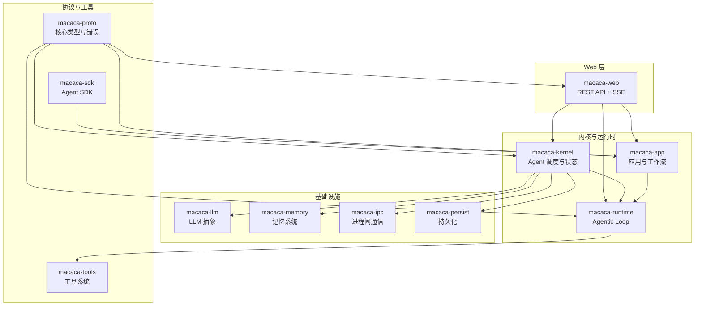
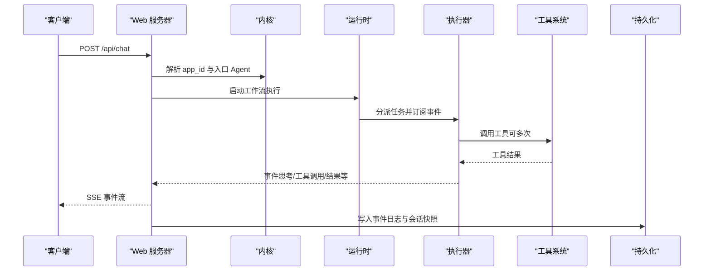
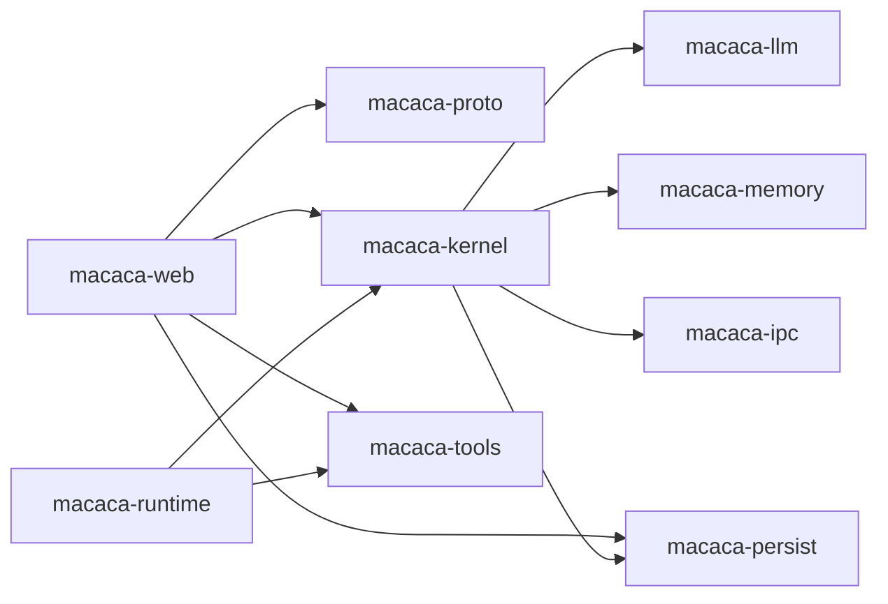

# API参考

<cite>
**本文档引用的文件**
- [Cargo.toml](file://macaca/Cargo.toml)
- [ARCHITECTURE-v2.md](file://macaca/ARCHITECTURE-v2.md)
- [README.md](file://macaca/README.md)
- [default.toml](file://macaca/config/default.toml)
- [routes.rs](file://macaca/crates/macaca-web/src/routes.rs)
- [sse.rs](file://macaca/crates/macaca-web/src/sse.rs)
- [types.rs](file://macaca/crates/macaca-proto/src/types.rs)
- [error.rs](file://macaca/crates/macaca-proto/src/error.rs)
- [config.rs](file://macaca/crates/macaca-proto/src/config.rs)
- [chat_orchestrator.rs](file://macaca/crates/macaca-web/src/chat_orchestrator.rs)
- [session.rs](file://macaca/crates/macaca-web/src/session.rs)
</cite>

## 目录
1. [简介](#简介)
2. [项目结构](#项目结构)
3. [核心组件](#核心组件)
4. [架构总览](#架构总览)
5. [详细组件分析](#详细组件分析)
6. [依赖分析](#依赖分析)
7. [性能考虑](#性能考虑)
8. [故障排除指南](#故障排除指南)
9. [结论](#结论)
10. [附录](#附录)

## 简介
本文件为 Macaca Agent OS 的完整 API 参考文档，覆盖以下内容：
- REST API 端点：HTTP 方法、URL 模式、请求参数、响应格式与错误码
- WebSocket（SSE）实时事件：事件类型、消息格式与交互协议
- Protocol Buffer 数据结构：核心类型、字段含义与序列化规则
- 配置 API：配置项说明、默认值与验证规则
- 使用示例、SDK 接口与集成指南
- 故障排除与性能优化建议

## 项目结构
Macaca 采用 Rust Workspace，核心模块位于 crates/ 目录，Web 服务位于 macaca-web，协议定义位于 macaca-proto。

图表来源
- [Cargo.toml:1-25](file://macaca/Cargo.toml#L1-L25)
- [ARCHITECTURE-v2.md:16-275](file://macaca/ARCHITECTURE-v2.md#L16-L275)

章节来源
- [Cargo.toml:1-25](file://macaca/Cargo.toml#L1-L25)
- [README.md:20-29](file://macaca/README.md#L20-L29)

## 核心组件
- Web 服务器：提供 REST API 与 SSE 事件流，负责会话管理、任务板、计划任务与事件日志查询。
- 内核与运行时：负责 Agent 生命周期、状态追踪、工作流编排与工具执行。
- 协议层：统一的类型定义、错误模型与配置结构，保证跨模块一致性。
- 基础设施：LLM 抽象、记忆系统、进程间通信与持久化存储。

章节来源
- [ARCHITECTURE-v2.md:55-110](file://macaca/ARCHITECTURE-v2.md#L55-L110)
- [routes.rs:44-65](file://macaca/crates/macaca-web/src/routes.rs#L44-L65)

## 架构总览
下图展示 Web 层如何与内核、运行时、工具与持久化交互，以及 SSE 事件如何回传至前端。

图表来源
- [chat_orchestrator.rs:268-520](file://macaca/crates/macaca-web/src/chat_orchestrator.rs#L268-L520)
- [sse.rs:57-202](file://macaca/crates/macaca-web/src/sse.rs#L57-L202)
- [session.rs:121-249](file://macaca/crates/macaca-web/src/session.rs#L121-L249)

## 详细组件分析

### REST API 端点

#### 系统状态
- GET /api/status
  - 响应字段：version、agent_count、app_count、llm_provider
  - 成功状态码：200
  - 错误：无（内部错误由框架处理）

章节来源
- [routes.rs:44-65](file://macaca/crates/macaca-web/src/routes.rs#L44-L65)

#### 应用管理
- GET /api/apps
  - 响应：数组，元素包含 id、name、status、agent_count、description、icon
  - 成功状态码：200
- GET /api/apps/{id}
  - 路径参数：id（ApplicationId）
  - 成功状态码：200；错误：400（无效 id）、404（应用不存在）
- POST /api/apps/reload
  - 响应：discovered_count、apps（同 GET /api/apps）
  - 成功状态码：200；错误：500（重载失败）

章节来源
- [routes.rs:68-150](file://macaca/crates/macaca-web/src/routes.rs#L68-L150)
- [routes.rs:344-394](file://macaca/crates/macaca-web/src/routes.rs#L344-L394)

#### 应用内 Agent 查询
- GET /api/apps/{id}/agents
  - 响应：数组，元素包含 id、name、state、activity、capabilities、is_active、current_task
  - activity.type：idle、working、thinking、error
  - 成功状态码：200；错误：400（无效 id）、404（应用不存在）

章节来源
- [routes.rs:153-252](file://macaca/crates/macaca-web/src/routes.rs#L153-L252)

#### Agent 状态流（SSE）
- GET /api/apps/{id}/agents/stream
  - 响应：SSE 事件流，事件类型：IDLE/WORKING/THINKING/ERROR
  - 成功状态码：200；错误：400（无效 id）、404（应用不存在）

章节来源
- [routes.rs:255-341](file://macaca/crates/macaca-web/src/routes.rs#L255-L341)

#### 技能目录
- GET /api/skills
  - 响应：数组，元素包含 name、description
  - 成功状态码：200

章节来源
- [routes.rs:397-417](file://macaca/crates/macaca-web/src/routes.rs#L397-L417)

#### 任务板（Todo）
- GET /api/apps/{app_id}/todos
  - 查询参数：session_id（可选）
  - 响应：todos（数组）、count（数字）
  - 成功状态码：200；错误：400（无效 app_id）
- GET /api/apps/{app_id}/todos/claim-diagnostics
  - 查询参数：session_id（必需）
  - 响应：诊断信息
  - 成功状态码：200；错误：400（缺少 session_id）
- GET /api/apps/{app_id}/todos/progress
  - 查询参数：session_id（可选）
  - 响应：各类状态计数与 all_done 标记
  - 成功状态码：200；错误：400（无效 app_id）
- GET /api/apps/{app_id}/todos/{agent_name}
  - 响应：agent、todos、count
  - 成功状态码：200；错误：400（无效 app_id）

章节来源
- [routes.rs:441-512](file://macaca/crates/macaca-web/src/routes.rs#L441-L512)

#### 目标（Goal）
- GET /api/apps/{app_id}/goals
  - 查询参数：session_id（可选）
  - 响应：goals（数组）、count（数字）
  - 成功状态码：200；错误：400（无效 app_id）

章节来源
- [routes.rs:514-529](file://macaca/crates/macaca-web/src/routes.rs#L514-L529)

#### 计划任务（Schedule）
- GET /api/apps/{app_id}/schedules
  - 响应：schedules（数组）、count（数字）
  - 成功状态码：200；错误：400（无效 app_id）
- POST /api/apps/{app_id}/schedules
  - 请求体：name、action（含 kind、描述等）、cron_expr 或 interval_secs（二选一）
  - 响应：schedule_id、name、next_run_at、enabled
  - 成功状态码：200；错误：400（参数缺失/非法）、404（应用不存在）
- GET /api/apps/{app_id}/schedules/{id}
  - 响应：具体计划条目
  - 成功状态码：200；错误：400（无效 id）、404（不存在）
- DELETE /api/apps/{app_id}/schedules/{id}
  - 成功状态码：204；错误：400（无效 id）、404（不存在）
- PUT /api/apps/{app_id}/schedules/{id}/toggle
  - 请求体：enabled（布尔）
  - 响应：schedule_id、enabled
  - 成功状态码：200；错误：400（参数缺失/非法）、404（不存在）

章节来源
- [routes.rs:532-731](file://macaca/crates/macaca-web/src/routes.rs#L532-L731)

#### 事件日志
- GET /api/sessions/{id}/events?since={seq}&limit={n}
  - 响应：events（数组）、latest_seq（数字）
  - 成功状态码：200；错误：404（会话不存在）
- GET /api/sessions/{id}/run-trace?since={seq}&limit={n}
  - 响应：events（数组，仅 run_trace 类型）、latest_seq（数字）
  - 成功状态码：200；错误：404（会话不存在）

章节来源
- [routes.rs:734-790](file://macaca/crates/macaca-web/src/routes.rs#L734-L790)

#### 会话管理
- GET /api/sessions
  - 查询参数：status（可选）
  - 响应：会话列表（按 updated_at 降序）
  - 成功状态码：200
- GET /api/apps/{id}/sessions
  - 响应：指定应用的所有会话
  - 成功状态码：200；错误：400（无效 id）
- GET /api/sessions/{session_id}
  - 响应：会话详情（含消息、回合、计划决策、事件统计等）
  - 成功状态码：200；错误：404（不存在）

章节来源
- [session.rs:587-667](file://macaca/crates/macaca-web/src/session.rs#L587-L667)
- [session.rs:693-691](file://macaca/crates/macaca-web/src/session.rs#L693-L691)

#### 聊天与停止
- POST /api/chat
  - 请求体：app_id、prompt、model（可选）、session_id（可选）、engine（可选）
  - 响应：SSE 事件流（思考、工具调用、结果、完成、错误等）
  - 成功状态码：200；错误：400（无效 app_id）、404（应用不存在）
- POST /api/chat/stop
  - 请求体：app_id
  - 响应：终止状态与被停止的组件列表
  - 成功状态码：200；错误：400（无效 app_id）

章节来源
- [chat_orchestrator.rs:127-144](file://macaca/crates/macaca-web/src/chat_orchestrator.rs#L127-L144)
- [chat_orchestrator.rs:268-520](file://macaca/crates/macaca-web/src/chat_orchestrator.rs#L268-L520)
- [chat_orchestrator.rs:154-256](file://macaca/crates/macaca-web/src/chat_orchestrator.rs#L154-L256)

### WebSocket（SSE）实时事件
- 事件类型
  - delegated_task_start/delegated_task_complete/delegated_task_error/delegated_task_cancelled/delegated_task_progress
  - delegated_thinking/delegated_tool_call/delegated_tool_result/delegated_assistant/delegated_cc_trace
  - hook_fork_*、executor_shutdown、stopped
- 消息格式
  - 事件名：上述类型
  - 数据：JSON 字符串，包含 task_id、agent、event（AgentExecutionEvent）、output、error 等字段
- 会话与广播
  - 事件先写入 EventLog，再广播到该应用下的所有活跃会话
  - SSE 连接断开后，可通过 /api/sessions/{session_id}/events 或 /api/sessions/{id}/run-trace 拉取增量

章节来源
- [sse.rs:57-202](file://macaca/crates/macaca-web/src/sse.rs#L57-L202)
- [session.rs:730-800](file://macaca/crates/macaca-web/src/session.rs#L730-L800)

### Protocol Buffer 数据结构
- 标识类型
  - AgentId、TaskId、ApplicationId、ForkId、MemoryId、MessageId、DriverId
- Agent 类型
  - AgentState：Created、Running、Suspended、Terminated
  - AgentActivity：Idle、Working、Error、Thinking
  - AgentRuntimeStatus：组合 agent_id、name、state、activity、updated_at、current_task
  - AgentManifest：包含 id、name、capabilities、permission、state、created_at、model
- 任务与工作流
  - TaskStatus：Pending、Assigned、Running、Completed、Failed
  - TaskPriority：Low、Normal、High、Critical
  - TaskRequest、Task、TaskResult
  - TodoItem、TodoGoal、TodoStatus、AgentTaskRef
- 记忆与消息
  - MemoryLayer：Session、File、Vector
  - MemoryEntry、IpcMessage
- 网关与消息
  - GatewayEvent：TaskRequest、StatusQuery、UserReply、Command
  - GatewayMessage、MessageFormat、FileAttachment
- LLM 类型
  - LlmRole：System、User、Assistant、Tool
  - LlmMessage、ToolCall、ToolDefinition、LlmOptions、LlmResponse、TokenUsage
- 事件与错误
  - EventEntry：seq、timestamp、session_id、event_type、source、payload
  - MacacaError：Agent、Task、Memory、IPC、LLM、Persist、Config、Gateway、PermissionDenied、NotFound、Timeout、BudgetExceeded、Serialization 等

章节来源
- [types.rs:7-131](file://macaca/crates/macaca-proto/src/types.rs#L7-L131)
- [types.rs:156-262](file://macaca/crates/macaca-proto/src/types.rs#L156-L262)
- [types.rs:300-430](file://macaca/crates/macaca-proto/src/types.rs#L300-L430)
- [types.rs:529-614](file://macaca/crates/macaca-proto/src/types.rs#L529-L614)
- [types.rs:616-777](file://macaca/crates/macaca-proto/src/types.rs#L616-L777)
- [types.rs:779-800](file://macaca/crates/macaca-proto/src/types.rs#L779-L800)
- [error.rs:3-51](file://macaca/crates/macaca-proto/src/error.rs#L3-L51)

### 配置 API
- 配置文件位置：config/default.toml
- 默认配置加载：MacacaConfig::load_default()
- 环境变量覆盖：前缀 AOS，双下划线分隔嵌套键
- 关键配置段落
  - kernel：max_agents、heartbeat_interval_ms、agent_timeout_ms
  - llm：default_provider、max_tokens_per_request、rate_limit_rpm、providers（键值对）
  - memory：session_ttl_seconds、file_store_path、auto_retrieve_on、vector、embedding、compression
  - ipc：nats_url、nats_auto_start、reconnect_max_attempts、reconnect_delay_ms
  - persist：engine、data_dir、snapshot_interval_seconds
  - gateway：enabled、telegram、discord
  - observability：log_level、tracing_enabled、otlp_endpoint、log_file（enabled、dir、prefix、format、retention_days、compress）
  - workspace：root_dir
- 验证规则
  - API 密钥解析：支持原始字符串或全大写环境变量名；优先使用 api_key_plan（订阅/配额），否则使用 api_key（按量）
  - 缺失环境变量将导致配置加载失败

章节来源
- [default.toml:1-119](file://macaca/config/default.toml#L1-L119)
- [config.rs:329-352](file://macaca/crates/macaca-proto/src/config.rs#L329-L352)
- [config.rs:87-96](file://macaca/crates/macaca-proto/src/config.rs#L87-L96)
- [config.rs:155-159](file://macaca/crates/macaca-proto/src/config.rs#L155-L159)

### 使用示例与集成指南
- 启动与调试
  - 使用 CLI 命令启动 Web 服务与内核：参见架构文档中的命令说明
- 聊天集成
  - 通过 POST /api/chat 发送消息，接收 SSE 事件流；支持 session_id 续会话
  - 使用 /api/chat/stop 终止应用内的所有执行
- 任务板与计划
  - 通过 /api/apps/{app_id}/schedules 管理定时任务；通过 /api/apps/{app_id}/todos 查询与诊断
- 事件与审计
  - 使用 /api/sessions/{id}/events 或 /api/sessions/{id}/run-trace 获取事件与运行轨迹
- SDK 集成
  - 使用 macaca-sdk 构建 Agent，支持声明式（YAML/TOML）与原生（Rust）两种开发方式

章节来源
- [ARCHITECTURE-v2.md:244-253](file://macaca/ARCHITECTURE-v2.md#L244-L253)
- [chat_orchestrator.rs:268-520](file://macaca/crates/macaca-web/src/chat_orchestrator.rs#L268-L520)

## 依赖分析
- 模块耦合
  - macaca-web 依赖 macaca-proto（类型与错误）、macaca-kernel（状态与执行）、macaca-persist（事件日志与会话存储）、macaca-tools（工具定义）
  - macaca-kernel 依赖 macaca-llm、macaca-memory、macaca-ipc、macaca-persist
  - macaca-runtime 依赖 macaca-tools、macaca-proto
- 外部依赖
  - LLM 提供商（OpenAI、Anthropic、DashScope 等）
  - 向量数据库（Milvus）
  - 消息队列/IPC（NATS）
  - 持久化（redb）

图表来源
- [Cargo.toml:71-89](file://macaca/Cargo.toml#L71-L89)
- [ARCHITECTURE-v2.md:55-110](file://macaca/ARCHITECTURE-v2.md#L55-L110)

章节来源
- [Cargo.toml:71-89](file://macaca/Cargo.toml#L71-L89)

## 性能考虑
- SSE 事件推送：事件先写入 EventLog 再广播，避免丢失；建议前端按 latest_seq 增量拉取
- 任务板与计划：定期清理与压缩，合理设置 snapshot_interval_seconds
- LLM 调用：控制 max_tokens_per_request 与 rate_limit_rpm，避免超限
- 记忆系统：启用压缩策略与合适的阈值，减少存储压力

## 故障排除指南
- LLM 错误诊断
  - 网络错误：检查连通性、代理与防火墙
  - 认证失败：确认 API Key 环境变量已设置且有效
  - 速率限制：等待配额恢复或调整速率
  - 请求错误：检查模型名称与请求格式
  - 服务器错误：稍后重试
- 常见错误码
  - 400：参数无效（如无效的 app_id、缺少必需参数）
  - 404：资源不存在（应用、会话、计划）
  - 500：服务器内部错误（配置加载失败、持久化异常）

章节来源
- [chat_orchestrator.rs:38-103](file://macaca/crates/macaca-web/src/chat_orchestrator.rs#L38-L103)
- [routes.rs:423-428](file://macaca/crates/macaca-web/src/routes.rs#L423-L428)

## 结论
本 API 参考文档系统性地梳理了 Macaca Agent OS 的 REST API、SSE 实时事件、核心数据结构与配置规范，结合架构图与序列图帮助开发者快速理解与集成。建议在生产环境中配合事件日志与运行轨迹进行监控与审计。

## 附录

### API 端点一览（摘要）
- 系统状态：GET /api/status
- 应用管理：GET /api/apps、GET /api/apps/{id}、POST /api/apps/reload
- 应用内 Agent：GET /api/apps/{id}/agents、GET /api/apps/{id}/agents/stream
- 技能目录：GET /api/skills
- 任务板：GET /api/apps/{app_id}/todos、GET /api/apps/{app_id}/todos/claim-diagnostics、GET /api/apps/{app_id}/todos/progress、GET /api/apps/{app_id}/todos/{agent_name}
- 目标：GET /api/apps/{app_id}/goals
- 计划任务：GET/POST/GET/DELETE/PUT /api/apps/{app_id}/schedules/{id}*
- 事件日志：GET /api/sessions/{id}/events、GET /api/sessions/{id}/run-trace
- 会话：GET /api/sessions、GET /api/apps/{id}/sessions、GET /api/sessions/{session_id}
- 聊天：POST /api/chat、POST /api/chat/stop

### SSE 事件类型对照
- 任务生命周期：delegated_task_start、delegated_task_complete、delegated_task_error、delegated_task_cancelled、delegated_task_progress
- 执行阶段：delegated_thinking、delegated_tool_call、delegated_tool_result、delegated_assistant、delegated_cc_trace
- 钩子与执行器：hook_fork_*、executor_shutdown、stopped

章节来源
- [sse.rs:57-202](file://macaca/crates/macaca-web/src/sse.rs#L57-L202)