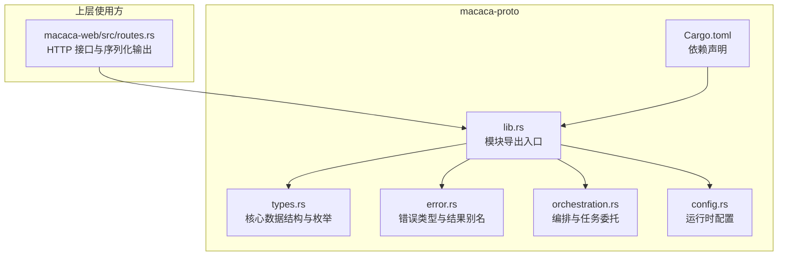
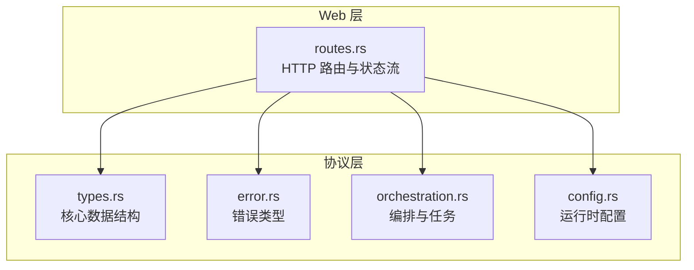
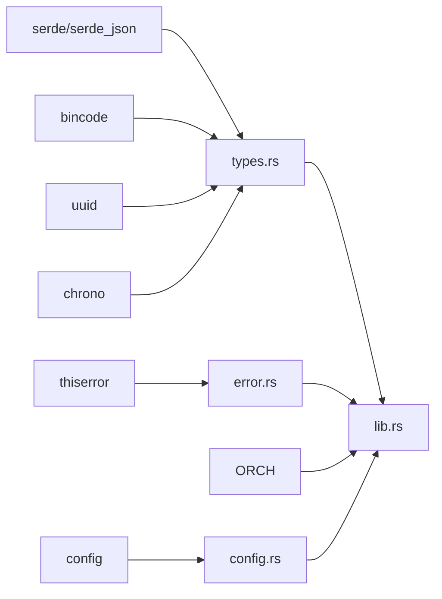
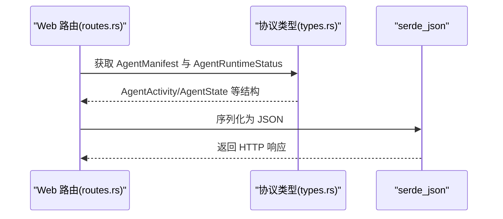

# Protocol Buffers

<cite>
**本文引用的文件**   
- [types.rs](file://macaca/crates/macaca-proto/src/types.rs)
- [error.rs](file://macaca/crates/macaca-proto/src/error.rs)
- [orchestration.rs](file://macaca/crates/macaca-proto/src/orchestration.rs)
- [config.rs](file://macaca/crates/macaca-proto/src/config.rs)
- [lib.rs](file://macaca/crates/macaca-proto/src/lib.rs)
- [Cargo.toml](file://macaca/crates/macaca-proto/Cargo.toml)
- [routes.rs](file://macaca/crates/macaca-web/src/routes.rs)
</cite>

## 目录
1. [简介](#简介)
2. [项目结构](#项目结构)
3. [核心组件](#核心组件)
4. [架构总览](#架构总览)
5. [详细组件分析](#详细组件分析)
6. [依赖分析](#依赖分析)
7. [性能考虑](#性能考虑)
8. [故障排查指南](#故障排查指南)
9. [结论](#结论)
10. [附录](#附录)

## 简介
本文件系统性梳理并文档化本仓库中的“Protocol Buffers”相关数据结构与序列化约定，重点覆盖以下内容：
- 消息类型、字段定义与数据类型映射
- ApplicationId、AgentActivity、Task 等核心数据结构的字段语义、约束与默认值
- 序列化规则（JSON/二进制）、版本兼容性与迁移策略
- 数据结构示例、字段校验规则与最佳实践
- 错误类型定义、异常处理与调试技巧

说明：当前代码库未直接使用 Protocol Buffers 编译器生成的代码；本仓库采用 Rust 的 serde 序列化机制对结构体进行 JSON/二进制序列化，并通过统一的类型模块导出，便于跨语言/跨进程传输与持久化。

## 项目结构
macaca-proto 是一个独立的 Rust crate，提供应用内通用的数据模型与错误类型，供上层服务（如 Web 路由、内核、任务调度等）复用。

**图表来源**
- [lib.rs:1-9](file://macaca/crates/macaca-proto/src/lib.rs#L1-L9)
- [types.rs:1-1206](file://macaca/crates/macaca-proto/src/types.rs#L1-L1206)
- [error.rs:1-52](file://macaca/crates/macaca-proto/src/error.rs#L1-L52)
- [orchestration.rs:1-321](file://macaca/crates/macaca-proto/src/orchestration.rs#L1-L321)
- [config.rs:1-374](file://macaca/crates/macaca-proto/src/config.rs#L1-L374)
- [Cargo.toml:1-13](file://macaca/crates/macaca-proto/Cargo.toml#L1-L13)
- [routes.rs:150-349](file://macaca/crates/macaca-web/src/routes.rs#L150-L349)

**章节来源**
- [lib.rs:1-9](file://macaca/crates/macaca-proto/src/lib.rs#L1-L9)
- [Cargo.toml:1-13](file://macaca/crates/macaca-proto/Cargo.toml#L1-L13)

## 核心组件
- 类型导出入口：lib.rs 将 types、error、orchestration、config 模块重新导出，形成统一的对外接口。
- 错误体系：error.rs 定义了 MacacaError 枚举与 MacacaResult 类型别名，覆盖 Agent、Task、Memory、IPC、LLM、Persist、Config、Gateway、权限、超时、预算、序列化等错误类别。
- 配置模型：config.rs 提供 MacacaConfig 及其子配置（Kernel、Llm、Memory、Ipc、Persist、Gateway、Observability、Workspace），并支持从 TOML 文件与环境变量加载。
- 编排与任务：orchestration.rs 定义 DelegatedTask、DelegatedTaskResult、OrchestrationCommand、AggregationStrategy、RoutingDecision 等编排相关结构。
- 数据模型：types.rs 定义 ApplicationId、AgentActivity、Task、TodoItem、LlmMessage、ToolCall、AgentExecutionEvent 等核心数据结构。

**章节来源**
- [lib.rs:1-9](file://macaca/crates/macaca-proto/src/lib.rs#L1-L9)
- [error.rs:1-52](file://macaca/crates/macaca-proto/src/error.rs#L1-L52)
- [config.rs:1-374](file://macaca/crates/macaca-proto/src/config.rs#L1-L374)
- [orchestration.rs:1-321](file://macaca/crates/macaca-proto/src/orchestration.rs#L1-L321)
- [types.rs:1-1206](file://macaca/crates/macaca-proto/src/types.rs#L1-L1206)

## 架构总览
下图展示数据结构在系统中的角色与交互关系：

**图表来源**
- [routes.rs:150-349](file://macaca/crates/macaca-web/src/routes.rs#L150-L349)
- [types.rs:1-1206](file://macaca/crates/macaca-proto/src/types.rs#L1-L1206)
- [error.rs:1-52](file://macaca/crates/macaca-proto/src/error.rs#L1-L52)
- [orchestration.rs:1-321](file://macaca/crates/macaca-proto/src/orchestration.rs#L1-L321)
- [config.rs:1-374](file://macaca/crates/macaca-proto/src/config.rs#L1-L374)

## 详细组件分析

### ApplicationId
- 类型：基于 UUID 的包装类型，用于标识应用实例。
- 字段与行为
  - new()：生成新的随机 UUID。
  - from_name(name)：基于固定命名空间的 UUID v5 生成确定性 ID，保证同名应用在重启后 ID 一致。
  - 默认实现：默认构造函数委托 new()。
  - 显示格式：实现 Display，便于日志与前端展示。
- 约束与默认值
  - 唯一性：new() 保证随机唯一；from_name() 在相同输入下稳定。
  - 默认值：无全局默认值，需显式构造。
- 使用场景
  - TodoGoal、TodoItem、DelegatedTask 等均携带 application_id，用于应用级隔离与事件归属。

**章节来源**
- [types.rs:101-131](file://macaca/crates/macaca-proto/src/types.rs#L101-L131)

### AgentActivity
- 类型：动态运行态，描述代理当前活动。
- 枚举变体
  - Idle：空闲。
  - Working{context}：工作中，携带简要上下文。
  - Error{message}：发生错误，携带错误信息。
  - Thinking{context}：思考中，携带处理上下文。
- 默认值：默认为 Idle。
- 用途：与 AgentRuntimeStatus 结合，用于前端状态流与 UI 展示。

**章节来源**
- [types.rs:167-192](file://macaca/crates/macaca-proto/src/types.rs#L167-L192)

### Task 与 TaskRequest
- Task
  - 字段：id、description、status、priority、assigned_agent、subtasks、parent、created_at、updated_at。
  - 约束：优先级为有序枚举；父子关系通过 parent/subtasks 表达；时间戳用于审计。
- TaskRequest
  - 字段：description、priority、requester。
  - 构造：new(description) 提供便捷构造，默认 priority=Normal、requester="user"。

**章节来源**
- [types.rs:319-347](file://macaca/crates/macaca-proto/src/types.rs#L319-L347)
- [types.rs:326-334](file://macaca/crates/macaca-proto/src/types.rs#L326-L334)

### TodoItem 与 TodoGoal
- TodoItem
  - 字段：id、application_id、session_id（可选）、assigned_agent、created_by、title、description、acceptance_criteria、context（可选）、status、priority、sequence_number（默认 0）、created_at、updated_at、deadline（可选）、depends_on、parent_task（可选）、progress_notes（默认空数组）、completion_summary、review_feedback、optimization_suggestions、attempt_count、max_attempts（默认 3）。
  - 约束：sequence_number 为 1 基序号，数值越小优先执行；max_attempts 控制重试上限。
  - 构造：new(...) 提供便捷构造，自动填充时间戳与默认值。
- TodoGoal
  - 字段：id、application_id、session_id（可选）、description、created_at、status。
  - 状态：Pending、Decomposing、InProgress、Evaluating、Completed、Failed。

**章节来源**
- [types.rs:383-430](file://macaca/crates/macaca-proto/src/types.rs#L383-L430)
- [types.rs:481-504](file://macaca/crates/macaca-proto/src/types.rs#L481-L504)
- [types.rs:516-527](file://macaca/crates/macaca-proto/src/types.rs#L516-L527)

### LLM 与工具调用
- LlmRole：System、User、Assistant、Tool。
- LlmMessage：role、content、tool_calls（可选）、tool_call_id（可选）。
  - 工具方法：system()/user()/assistant()/assistant_with_tool_calls()/tool_result()。
- ToolCall：id、name、arguments（JSON）。
- ToolDefinition：name、description、parameters（JSON Schema）。
- LlmOptions：model、max_tokens、temperature、stop_sequences、tools（可选）。
  - 默认值：model="gpt-4"、max_tokens=4096、temperature=0.7。
- LlmResponse：content、model、usage、finish_reason、tool_calls（可选）。
- TokenUsage：prompt_tokens、completion_tokens、total_tokens（默认）。

**章节来源**
- [types.rs:618-745](file://macaca/crates/macaca-proto/src/types.rs#L618-L745)

### 编排与任务委托
- DelegatedTask：id、application_id、from_agent、to_agent、prompt、priority、parallel、created_at、deadline（可选）、parent_task（可选）、context（可选）。
- DelegatedTaskResult：task_id、agent_id、success、output、error（可选）、artifacts、completed_at、tokens_used（可选）。
- OrchestrationCommand：Delegate、Broadcast、WaitFor、Aggregate、Report。
- AggregationStrategy：Concat、FirstSuccess、AllSuccess、Consensus。
- RoutingDecision：should_delegate、target_agents、parallel_execution、reasoning。
- AgentRouting：name、task、expected_output。

**章节来源**
- [orchestration.rs:17-84](file://macaca/crates/macaca-proto/src/orchestration.rs#L17-L84)
- [orchestration.rs:88-147](file://macaca/crates/macaca-proto/src/orchestration.rs#L88-L147)
- [orchestration.rs:151-173](file://macaca/crates/macaca-proto/src/orchestration.rs#L151-L173)

### IPC 与网关
- IpcMessage：id、from、to（可选）、topic、payload（JSON）、timestamp。
- GatewayEvent：TaskRequest、StatusQuery、UserReply、Command。
- GatewayMessage：content、format（PlainText/Markdown/CodeBlock）。
- FileAttachment：filename、data（字节数组）、mime_type。

**章节来源**
- [types.rs:558-614](file://macaca/crates/macaca-proto/src/types.rs#L558-L614)
- [types.rs:571-594](file://macaca/crates/macaca-proto/src/types.rs#L571-L594)
- [types.rs:610-614](file://macaca/crates/macaca-proto/src/types.rs#L610-L614)

### 运行时配置
- MacacaConfig：kernel、llm、memory、ipc、persist、gateway、observability、workspace。
- KernelConfig：max_agents、heartbeat_interval_ms、agent_timeout_ms。
- LlmConfig：default_provider、default_model、max_tokens_per_request、rate_limit_rpm、providers。
- MemoryConfig：session_ttl_seconds、file_store_path、auto_retrieve_on、vector、embedding、compression。
- IpcConfig：nats_url、nats_auto_start、reconnect_max_attempts、reconnect_delay_ms。
- PersistConfig：engine、data_dir、snapshot_interval_seconds。
- GatewayConfig：enabled、telegram、discord。
- ObservabilityConfig：log_level、tracing_enabled、otlp_endpoint、log_file。
- WorkspaceConfig：root_dir（默认 "./data/workspaces"）。

**章节来源**
- [config.rs:7-18](file://macaca/crates/macaca-proto/src/config.rs#L7-L18)
- [config.rs:31-36](file://macaca/crates/macaca-proto/src/config.rs#L31-L36)
- [config.rs:38-45](file://macaca/crates/macaca-proto/src/config.rs#L38-L45)
- [config.rs:126-134](file://macaca/crates/macaca-proto/src/config.rs#L126-L134)
- [config.rs:168-174](file://macaca/crates/macaca-proto/src/config.rs#L168-L174)
- [config.rs:176-181](file://macaca/crates/macaca-proto/src/config.rs#L176-L181)
- [config.rs:183-202](file://macaca/crates/macaca-proto/src/config.rs#L183-L202)
- [config.rs:204-212](file://macaca/crates/macaca-proto/src/config.rs#L204-L212)
- [config.rs:20-29](file://macaca/crates/macaca-proto/src/config.rs#L20-L29)

### 序列化与兼容性
- 序列化方式
  - serde_json：用于 HTTP 接口与事件日志等 JSON 场景。
  - bincode：在 macaca-proto 的依赖声明中可见，可用于高性能二进制序列化（具体使用取决于上层模块）。
- 版本兼容性
  - 对于新增字段，采用 serde 的默认/跳过策略（如 skip_serializing_if、default），确保旧客户端能解析新字段。
  - 示例：LlmMessage 的 tool_calls/tool_call_id 在旧格式中不存在时仍可反序列化。
- 迁移策略
  - 新增可选字段并提供默认值，避免破坏既有数据。
  - 对于结构变更，保留向后兼容的字段别名（如 snake_case 命名）。

**章节来源**
- [Cargo.toml:6-12](file://macaca/crates/macaca-proto/Cargo.toml#L6-L12)
- [types.rs:647-651](file://macaca/crates/macaca-proto/src/types.rs#L647-L651)
- [types.rs:1086-1094](file://macaca/crates/macaca-proto/src/types.rs#L1086-L1094)

### 数据结构示例与最佳实践
- 示例路径
  - ApplicationId.from_name("my-app") 生成确定性 ID。
  - LlmMessage::assistant_with_tool_calls("", vec![...]) 构造带工具调用的消息。
  - TodoItem::new(...).sequence_number=3 设置执行顺序。
- 最佳实践
  - 为可选字段设置合理默认值，避免空值风暴。
  - 使用 ApplicationId 实现应用级隔离，避免跨应用资源混淆。
  - 对外部输入进行严格校验（长度、格式、范围），并在业务层抛出 MacacaError。
  - 对大对象序列化优先选择二进制（bincode）以降低开销。

**章节来源**
- [types.rs:111-118](file://macaca/crates/macaca-proto/src/types.rs#L111-L118)
- [types.rs:685-693](file://macaca/crates/macaca-proto/src/types.rs#L685-L693)
- [types.rs:441-468](file://macaca/crates/macaca-proto/src/types.rs#L441-L468)

### 错误类型与异常处理
- 错误类型
  - Agent、Task、Memory、IPC、LLM、Persist、Config、Gateway、PermissionDenied、NotFound、Timeout、BudgetExceeded、Serialization。
- 异常处理
  - 使用 MacacaResult<T> 作为统一返回类型，结合 serde_json::Error、std::io::Error 进行透明转换。
  - 上层路由将错误映射为 HTTP 状态码与 JSON 错误响应。

**章节来源**
- [error.rs:3-49](file://macaca/crates/macaca-proto/src/error.rs#L3-L49)
- [routes.rs:150-252](file://macaca/crates/macaca-web/src/routes.rs#L150-L252)

## 依赖分析
- 外部依赖
  - serde、serde_json：序列化/反序列化 JSON。
  - bincode：二进制序列化（用于高性能场景）。
  - uuid：UUID 生成与解析。
  - chrono：UTC 时间戳。
  - thiserror：错误类型派生。
  - config：配置加载与环境变量注入。
- 内部依赖
  - lib.rs 将各模块重新导出，形成单一入口。

**图表来源**
- [Cargo.toml:6-12](file://macaca/crates/macaca-proto/Cargo.toml#L6-L12)
- [lib.rs:1-9](file://macaca/crates/macaca-proto/src/lib.rs#L1-L9)

**章节来源**
- [Cargo.toml:1-13](file://macaca/crates/macaca-proto/Cargo.toml#L1-L13)
- [lib.rs:1-9](file://macaca/crates/macaca-proto/src/lib.rs#L1-L9)

## 性能考虑
- 序列化性能
  - JSON：易读易调试，适合 HTTP 与日志；大体量数据建议使用 bincode。
  - 二进制：bincode 在 macaca-proto 依赖中可用，适合高吞吐 IPC 或持久化。
- 时间戳与排序
  - 使用 DateTime<Utc> 保证时区一致性；对任务/事件按时间戳或 sequence_number 排序。
- 并发与缓存
  - 对热点数据（如 Agent 状态）进行内存缓存，减少重复计算与序列化。

[本节为通用指导，无需特定文件来源]

## 故障排查指南
- 常见问题
  - JSON 反序列化失败：检查字段类型与命名是否匹配（snake_case）。
  - LLM 工具调用缺失：确认 LlmOptions 中 tools 是否正确传入。
  - 应用 ID 不一致：确认是否使用 from_name 生成确定性 ID。
- 调试技巧
  - 启用 ObservabilityConfig.log_file 输出 JSON 日志，定位事件序列。
  - 使用 AgentExecutionEvent 与 RunTracePayload 记录执行阶段与状态。
  - 对关键路径增加 MacacaError 包装，便于上层统一处理。

**章节来源**
- [config.rs:204-255](file://macaca/crates/macaca-proto/src/config.rs#L204-L255)
- [types.rs:803-820](file://macaca/crates/macaca-proto/src/types.rs#L803-L820)
- [types.rs:826-874](file://macaca/crates/macaca-proto/src/types.rs#L826-L874)

## 结论
本仓库通过 serde 提供了完整的数据模型与错误体系，满足应用内跨模块、跨进程的序列化与通信需求。ApplicationId、AgentActivity、Task、TodoItem、LlmMessage、OrchestrationCommand 等核心结构具备清晰的字段语义、合理的默认值与良好的兼容性设计。建议在生产环境中优先采用 bincode 进行高性能序列化，并配合完善的日志与错误处理机制保障稳定性。

[本节为总结，无需特定文件来源]

## 附录

### 关键流程：Agent 状态到前端的序列化

**图表来源**
- [routes.rs:150-349](file://macaca/crates/macaca-web/src/routes.rs#L150-L349)
- [types.rs:167-262](file://macaca/crates/macaca-proto/src/types.rs#L167-L262)