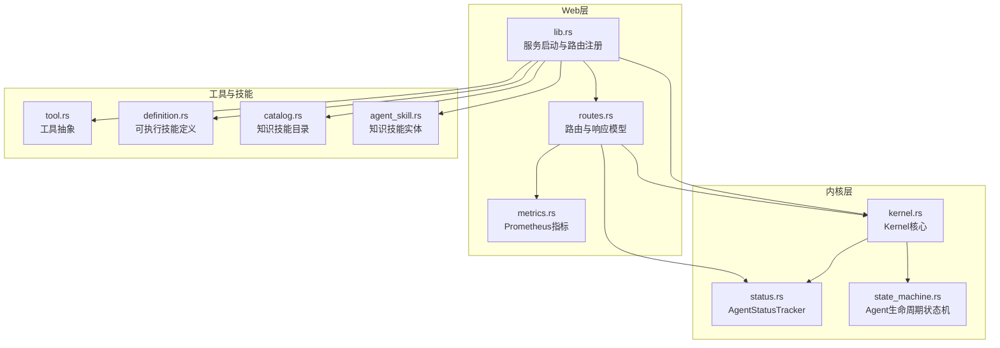
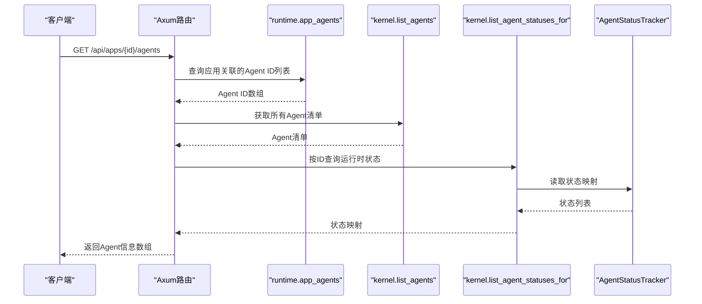
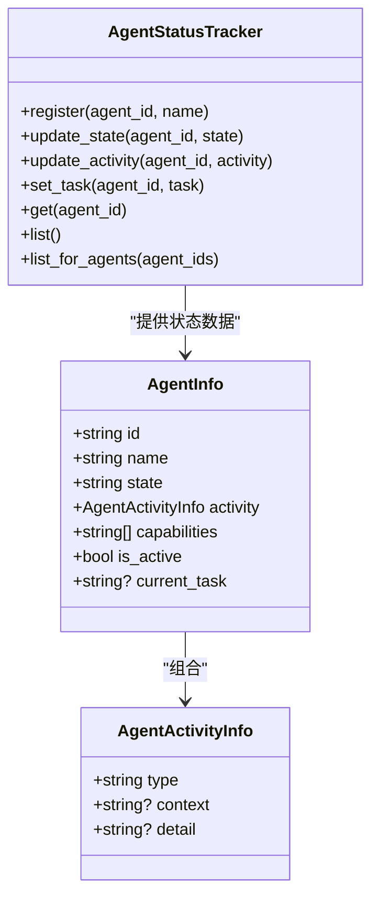
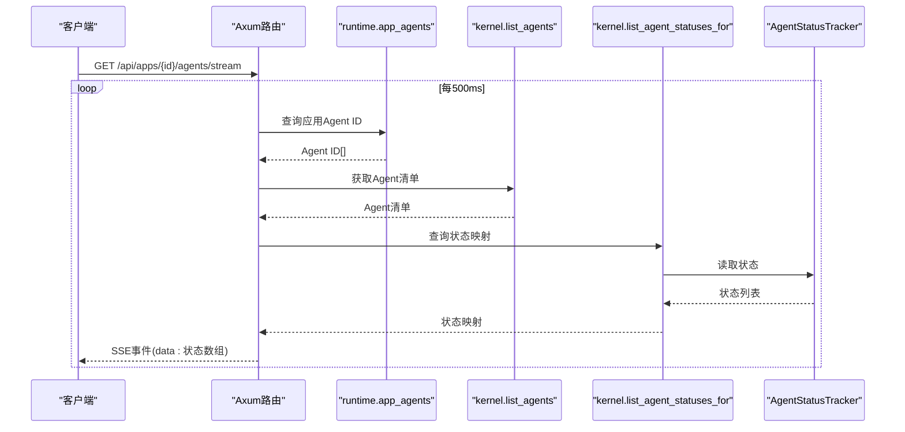
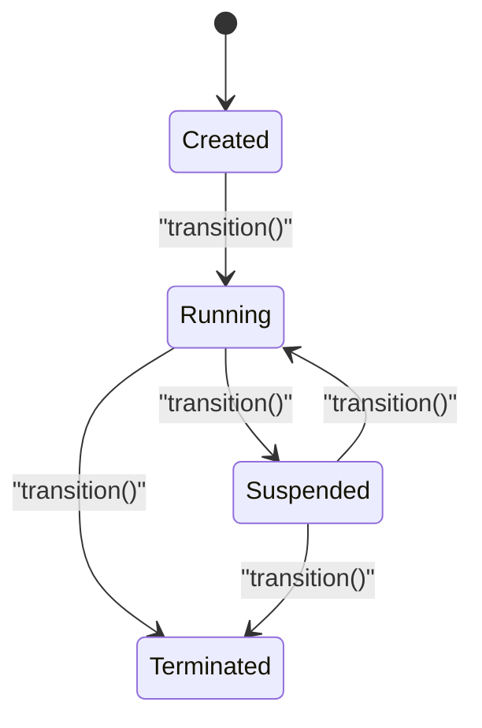
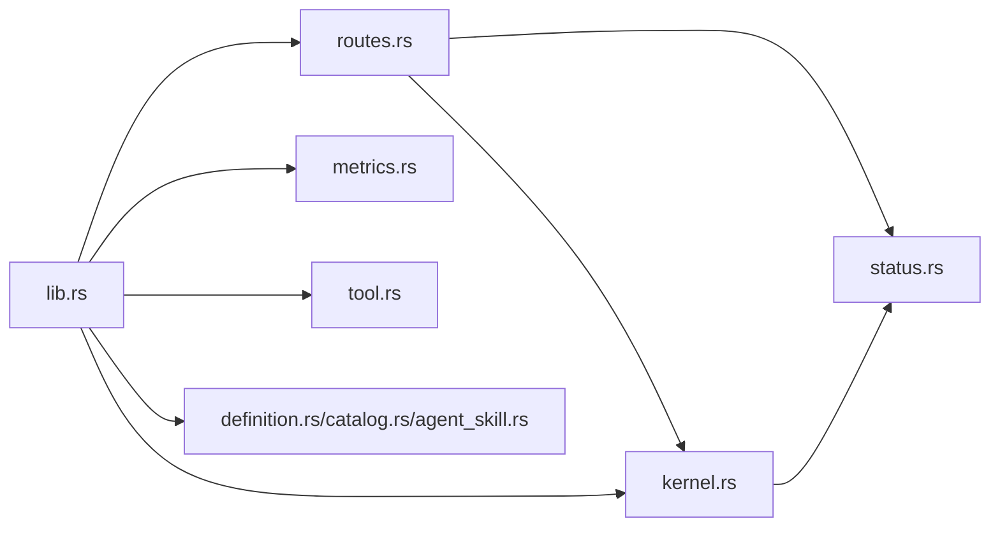

# Agent管理

<cite>
**本文档引用的文件**
- [routes.rs](file://macaca/crates/macaca-web/src/routes.rs)
- [status.rs](file://macaca/crates/macaca-kernel/src/status.rs)
- [kernel.rs](file://macaca/crates/macaca-kernel/src/kernel.rs)
- [state_machine.rs](file://macaca/crates/macaca-agent/src/state_machine.rs)
- [metrics.rs](file://macaca/crates/macaca-web/src/metrics.rs)
- [lib.rs](file://macaca/crates/macaca-web/src/lib.rs)
- [tool.rs](file://macaca/crates/macaca-tools/src/tool.rs)
- [definition.rs](file://macaca/crates/macaca-skill/src/definition.rs)
- [catalog.rs](file://macaca/crates/macaca-skill/src/catalog.rs)
- [agent_skill.rs](file://macaca/crates/macaca-skill/src/agent_skill.rs)
- [loop_manager.rs](file://macaca/crates/macaca-web/src/loop_manager.rs)
</cite>

## 目录
1. [简介](#简介)
2. [项目结构](#项目结构)
3. [核心组件](#核心组件)
4. [架构总览](#架构总览)
5. [详细组件分析](#详细组件分析)
6. [依赖关系分析](#依赖关系分析)
7. [性能考虑](#性能考虑)
8. [故障排查指南](#故障排查指南)
9. [结论](#结论)
10. [附录](#附录)

## 简介
本文件聚焦于Agent管理API，详细说明以下端点：
- GET /api/apps/:id/agents：获取应用下所有Agent的静态信息（状态、活动、能力、当前任务）
- GET /api/apps/:id/agents/stream：SSE实时推送Agent状态流（IDLE/WORKING/THINKING/ERROR）

内容涵盖Agent信息获取、实时状态流、活动类型与能力描述、状态转换、活动监控与性能指标获取方法，并提供Agent生命周期管理与故障诊断的实用指南。

## 项目结构
Agent管理API位于macaca-web子系统中，通过Axum路由暴露REST接口；运行时状态由Kernel与AgentStatusTracker维护，SSE流由路由处理器周期性拉取并推送。

图表来源
- [routes.rs:152-341](file://macaca/crates/macaca-web/src/routes.rs#L152-L341)
- [kernel.rs:16-136](file://macaca/crates/macaca-kernel/src/kernel.rs#L16-L136)
- [status.rs:11-116](file://macaca/crates/macaca-kernel/src/status.rs#L11-L116)
- [state_machine.rs:15-53](file://macaca/crates/macaca-agent/src/state_machine.rs#L15-L53)
- [metrics.rs:1-64](file://macaca/crates/macaca-web/src/metrics.rs#L1-L64)
- [lib.rs:608-646](file://macaca/crates/macaca-web/src/lib.rs#L608-L646)
- [tool.rs:22-65](file://macaca/crates/macaca-tools/src/tool.rs#L22-L65)
- [definition.rs:40-56](file://macaca/crates/macaca-skill/src/definition.rs#L40-L56)
- [catalog.rs:83-115](file://macaca/crates/macaca-skill/src/catalog.rs#L83-L115)
- [agent_skill.rs:23-33](file://macaca/crates/macaca-skill/src/agent_skill.rs#L23-L33)

章节来源
- [lib.rs:608-646](file://macaca/crates/macaca-web/src/lib.rs#L608-L646)
- [routes.rs:152-341](file://macaca/crates/macaca-web/src/routes.rs#L152-L341)

## 核心组件
- 路由处理器
  - GET /api/apps/:id/agents → get_app_agents
  - GET /api/apps/:id/agents/stream → stream_agent_status
- 状态追踪器
  - AgentStatusTracker：维护每个Agent的生命周期状态、活动类型、当前任务
- 内核
  - Kernel：统一调度Agent执行、维护状态追踪器访问接口
- 生命周期状态机
  - AgentStateMachine：约束Agent生命周期合法转换
- 指标系统
  - Prometheus指标：LLM请求、令牌用量、任务委托、活跃Agent数等

章节来源
- [routes.rs:156-252](file://macaca/crates/macaca-web/src/routes.rs#L156-L252)
- [status.rs:11-116](file://macaca/crates/macaca-kernel/src/status.rs#L11-L116)
- [kernel.rs:112-136](file://macaca/crates/macaca-kernel/src/kernel.rs#L112-L136)
- [state_machine.rs:15-53](file://macaca/crates/macaca-agent/src/state_machine.rs#L15-L53)
- [metrics.rs:16-64](file://macaca/crates/macaca-web/src/metrics.rs#L16-L64)

## 架构总览
Agent管理API的调用链路如下：

图表来源
- [routes.rs:207-252](file://macaca/crates/macaca-web/src/routes.rs#L207-L252)
- [kernel.rs:132-135](file://macaca/crates/macaca-kernel/src/kernel.rs#L132-L135)
- [status.rs:108-115](file://macaca/crates/macaca-kernel/src/status.rs#L108-L115)

## 详细组件分析

### Agent信息获取：GET /api/apps/:id/agents
- 请求参数
  - 路径参数：id（应用ID，UUID字符串）
- 处理流程
  - 解析应用ID为ApplicationId
  - 通过runtime.app_agents获取该应用下的Agent ID集合
  - 通过kernel.list_agents获取所有Agent清单
  - 通过kernel.list_agent_statuses_for按ID集合查询运行时状态
  - 将清单与状态映射合并，构造AgentInfo数组返回
- 响应模型
  - AgentInfo：包含id、name、state、activity、capabilities、is_active、current_task
  - AgentActivityInfo：包含type（idle/working/thinking/error）、context、detail
- 错误处理
  - 应用ID格式错误：返回400 Bad Request
  - 应用不存在：返回404 Not Found

图表来源
- [routes.rs:156-205](file://macaca/crates/macaca-web/src/routes.rs#L156-L205)
- [status.rs:11-116](file://macaca/crates/macaca-kernel/src/status.rs#L11-L116)

章节来源
- [routes.rs:207-252](file://macaca/crates/macaca-web/src/routes.rs#L207-L252)
- [routes.rs:156-205](file://macaca/crates/macaca-web/src/routes.rs#L156-L205)
- [status.rs:11-116](file://macaca/crates/macaca-kernel/src/status.rs#L11-L116)

### 实时状态流：GET /api/apps/:id/agents/stream
- 请求参数
  - 路径参数：id（应用ID，UUID字符串）
- 处理流程
  - 解析应用ID为ApplicationId
  - 循环：
    - 通过runtime.app_agents获取Agent ID集合
    - 通过kernel.list_agents获取Agent清单
    - 通过kernel.list_agent_statuses_for获取状态映射
    - 将状态映射转换为简化状态（IDLE/WORKING/THINKING/ERROR）与详情
    - 以SSE事件推送JSON数组
    - 间隔500ms再次查询
- 响应模型
  - SimpleAgentStatus：包含id、name、status（IDLE/WORKING/THINKING/ERROR）、detail（可选）
- 错误处理
  - 应用ID格式错误：发送包含错误信息的SSE事件
  - 应用不存在：发送error事件并终止

图表来源
- [routes.rs:267-341](file://macaca/crates/macaca-web/src/routes.rs#L267-L341)
- [kernel.rs:132-135](file://macaca/crates/macaca-kernel/src/kernel.rs#L132-L135)
- [status.rs:108-115](file://macaca/crates/macaca-kernel/src/status.rs#L108-L115)

章节来源
- [routes.rs:267-341](file://macaca/crates/macaca-web/src/routes.rs#L267-L341)

### Agent活动类型与能力描述
- 活动类型
  - idle：空闲
  - working：执行任务或工具调用
  - thinking：思考阶段
  - error：发生错误，包含错误消息
- 能力描述
  - AgentInfo.capabilities来自Agent清单中的能力名称集合
  - 可通过技能目录与工具集扩展Agent能力
- 技能体系
  - 知识技能（SKILL.md）：AgentSkill，用于注入到上下文
  - 可执行技能（YAML）：SkillDefinition，支持shell/mcp/script入口点
  - 工具抽象：Tool/ToolSet，提供参数Schema与执行接口

章节来源
- [routes.rs:170-205](file://macaca/crates/macaca-web/src/routes.rs#L170-L205)
- [definition.rs:14-56](file://macaca/crates/macaca-skill/src/definition.rs#L14-L56)
- [tool.rs:22-65](file://macaca/crates/macaca-tools/src/tool.rs#L22-L65)
- [agent_skill.rs:23-33](file://macaca/crates/macaca-skill/src/agent_skill.rs#L23-L33)

### Agent状态转换与生命周期
- 生命周期状态
  - Created → Running
  - Running → Suspended
  - Running → Terminated
  - Suspended → Running
  - Suspended → Terminated
- 约束
  - 非法转换将触发错误
- 运行时更新
  - Kernel.update_agent_activity会更新状态追踪器中的活动类型
  - 执行完成后自动置空闲

图表来源
- [state_machine.rs:33-52](file://macaca/crates/macaca-agent/src/state_machine.rs#L33-L52)
- [kernel.rs:117-120](file://macaca/crates/macaca-kernel/src/kernel.rs#L117-L120)

章节来源
- [state_machine.rs:15-53](file://macaca/crates/macaca-agent/src/state_machine.rs#L15-L53)
- [kernel.rs:117-120](file://macaca/crates/macaca-kernel/src/kernel.rs#L117-L120)

### 活动监控与性能指标
- 活动监控
  - SSE流每500ms推送一次，包含IDLE/WORKING/THINKING/ERROR状态与详情
  - 可结合current_task字段了解Agent当前任务
- 性能指标
  - LLM请求总量/时延/令牌用量
  - 任务委托总数、Worker重启次数
  - 当前活跃Agent数量
- 指标使用建议
  - 通过GET /metrics获取Prometheus指标
  - 结合SSE流与指标进行综合监控

章节来源
- [routes.rs:267-341](file://macaca/crates/macaca-web/src/routes.rs#L267-L341)
- [metrics.rs:16-64](file://macaca/crates/macaca-web/src/metrics.rs#L16-L64)

### Agent生命周期管理与故障诊断
- 生命周期管理
  - 使用AgentStateMachine进行状态转换
  - 通过Kernel.register_agent与unregister_agent管理Agent注册
  - 通过Kernel.update_agent_activity设置活动类型
- 故障诊断
  - SSE流中出现ERROR状态时，detail包含错误信息
  - 任务执行失败时，Worker循环会记录错误并标记失败
  - 可通过事件日志与运行轨迹接口辅助定位问题

章节来源
- [state_machine.rs:33-52](file://macaca/crates/macaca-agent/src/state_machine.rs#L33-L52)
- [kernel.rs:40-60](file://macaca/crates/macaca-kernel/src/kernel.rs#L40-L60)
- [loop_manager.rs:709-725](file://macaca/crates/macaca-web/src/loop_manager.rs#L709-L725)

## 依赖关系分析
- 组件耦合
  - routes.rs依赖runtime与kernel接口获取Agent清单与状态
  - kernel.rs依赖status.rs维护Agent运行时状态
  - lib.rs负责路由注册与服务启动
- 外部集成
  - Prometheus指标通过metrics.rs导出
  - 工具与技能通过tool.rs与definition.rs/agent_skill.rs/目录集成

图表来源
- [routes.rs:152-341](file://macaca/crates/macaca-web/src/routes.rs#L152-L341)
- [kernel.rs:16-136](file://macaca/crates/macaca-kernel/src/kernel.rs#L16-L136)
- [status.rs:11-116](file://macaca/crates/macaca-kernel/src/status.rs#L11-L116)
- [lib.rs:608-646](file://macaca/crates/macaca-web/src/lib.rs#L608-L646)
- [metrics.rs:1-64](file://macaca/crates/macaca-web/src/metrics.rs#L1-L64)
- [tool.rs:22-65](file://macaca/crates/macaca-tools/src/tool.rs#L22-L65)
- [definition.rs:40-56](file://macaca/crates/macaca-skill/src/definition.rs#L40-L56)
- [catalog.rs:83-115](file://macaca/crates/macaca-skill/src/catalog.rs#L83-L115)
- [agent_skill.rs:23-33](file://macaca/crates/macaca-skill/src/agent_skill.rs#L23-L33)

章节来源
- [lib.rs:608-646](file://macaca/crates/macaca-web/src/lib.rs#L608-L646)

## 性能考虑
- SSE轮询间隔
  - 默认500ms，可根据负载调整
- 状态查询
  - 合并清单与状态查询，减少重复遍历
- 指标开销
  - Prometheus指标仅在/metrics端点暴露，不影响常规API

## 故障排查指南
- 常见问题
  - 应用ID格式错误：检查UUID格式
  - 应用不存在：确认应用已加载并存在于注册表
  - SSE无更新：检查网络连接与代理配置
- 定位手段
  - 查看SSE流中的ERROR状态与detail
  - 结合事件日志与运行轨迹接口
  - 通过/metrics观察LLM与任务指标

章节来源
- [routes.rs:276-294](file://macaca/crates/macaca-web/src/routes.rs#L276-L294)
- [loop_manager.rs:709-725](file://macaca/crates/macaca-web/src/loop_manager.rs#L709-L725)

## 结论
本文档提供了Agent管理API的完整使用指南，包括静态信息获取与实时状态流、活动类型与能力描述、状态转换与生命周期管理、以及性能监控与故障诊断方法。通过这些接口与机制，用户可以有效管理Agent生命周期并进行可观测性运维。

## 附录
- 接口速查
  - GET /api/apps/{id}/agents：获取应用下Agent列表
  - GET /api/apps/{id}/agents/stream：SSE实时状态流
- 相关端点
  - GET /api/status：系统状态
  - GET /api/skills：技能列表
  - GET /metrics：Prometheus指标