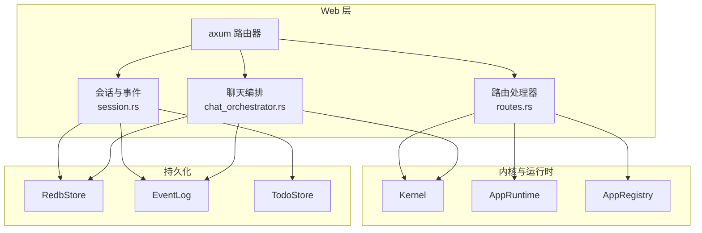
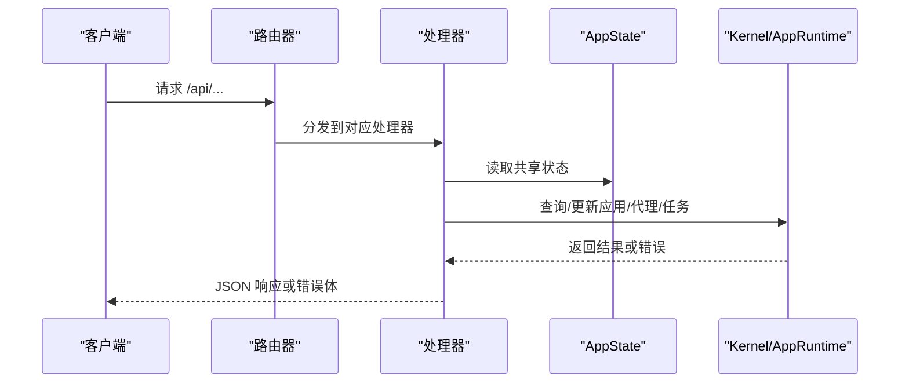
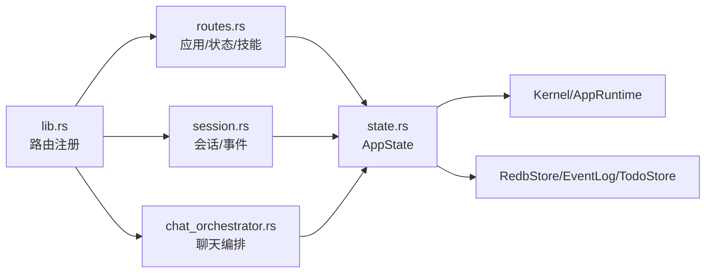

# REST API

<cite>
**本文引用的文件**
- [lib.rs](file://macaca/crates/macaca-web/src/lib.rs)
- [routes.rs](file://macaca/crates/macaca-web/src/routes.rs)
- [session.rs](file://macaca/crates/macaca-web/src/session.rs)
- [chat_orchestrator.rs](file://macaca/crates/macaca-web/src/chat_orchestrator.rs)
- [state.rs](file://macaca/crates/macaca-web/src/state.rs)
- [error.rs](file://macaca/crates/macaca-proto/src/error.rs)
</cite>

## 目录
1. [简介](#简介)
2. [项目结构](#项目结构)
3. [核心组件](#核心组件)
4. [架构总览](#架构总览)
5. [详细组件分析](#详细组件分析)
6. [依赖关系分析](#依赖关系分析)
7. [性能考量](#性能考量)
8. [故障排查指南](#故障排查指南)
9. [结论](#结论)

## 简介
本文件为 Agent OS 的 REST API 文档，覆盖已实现的 HTTP 端点与行为，包括系统状态、应用管理、会话与事件日志、技能目录、计划调度、任务看板以及聊天编排等模块。文档面向开发者，提供端点清单、请求/响应结构、状态码、错误格式、查询与路径参数说明，并给出常见错误场景与处理建议。

## 项目结构
- Web 服务器由 axum 路由器承载，统一挂载于 /api 前缀下。
- 核心路由注册集中在 macaca-web/src/lib.rs 的 start_server 流程中，按功能拆分到 routes.rs、session.rs、chat_orchestrator.rs 等模块。
- 共享状态 AppState 通过 State 提取器注入各处理器，包含内核、运行时、工具集、持久化存储、循环控制与会话上下文等。

图表来源
- [lib.rs:608-646](file://macaca/crates/macaca-web/src/lib.rs#L608-L646)
- [routes.rs:1-791](file://macaca/crates/macaca-web/src/routes.rs#L1-L791)
- [session.rs:1-1205](file://macaca/crates/macaca-web/src/session.rs#L1-L1205)
- [chat_orchestrator.rs:1-2259](file://macaca/crates/macaca-web/src/chat_orchestrator.rs#L1-L2259)

章节来源
- [lib.rs:608-646](file://macaca/crates/macaca-web/src/lib.rs#L608-L646)

## 核心组件
- 应用状态 AppState：封装内核、运行时、工具集、执行器注册表、持久化组件、循环状态与会话上下文，供所有处理器共享使用。
- 错误响应结构：统一的 JSON 错误体包含 error 字段，配合 HTTP 状态码返回。
- 数据模型：如状态、应用、代理、会话、技能、计划与任务看板等结构体，用于序列化响应。

章节来源
- [state.rs:120-143](file://macaca/crates/macaca-web/src/state.rs#L120-L143)
- [routes.rs:28-41](file://macaca/crates/macaca-web/src/routes.rs#L28-L41)

## 架构总览
- 路由层：集中注册 /api/* 端点，按功能模块拆分处理器。
- 处理器层：从 AppState 读取内核与运行时信息，访问持久化存储，必要时触发执行器与循环管理。
- 持久化层：会话、事件日志、任务看板均基于 RedbStore 存储，保证可恢复与可查询。

图表来源
- [lib.rs:608-646](file://macaca/crates/macaca-web/src/lib.rs#L608-L646)
- [routes.rs:1-791](file://macaca/crates/macaca-web/src/routes.rs#L1-L791)
- [state.rs:120-143](file://macaca/crates/macaca-web/src/state.rs#L120-L143)

## 详细组件分析

### 系统状态
- 端点：GET /api/status
- 功能：返回版本号、代理数量、应用数量与 LLM 提供商名称。
- 响应体字段
  - version: 字符串，来自包版本
  - agent_count: 整数，当前代理总数
  - app_count: 整数，已发现的应用数量
  - llm_provider: 字符串，当前 LLM 提供商名称
- 成功状态码：200
- 错误：无（内部计算逻辑不抛出业务错误）

章节来源
- [routes.rs:44-65](file://macaca/crates/macaca-web/src/routes.rs#L44-L65)

### 应用列表与详情
- GET /api/apps
  - 功能：列出所有应用的基本信息（含描述与图标），并附带代理数量。
  - 响应：数组，元素为 AppInfo 结构体
  - 成功状态码：200
- GET /api/apps/:id
  - 路径参数：id（UUID 字符串）
  - 功能：获取单个应用的详细信息；若 id 非法返回 400，不存在返回 404
  - 成功状态码：200；错误状态码：400/404
- POST /api/apps/reload
  - 功能：重新加载应用注册表并返回发现的应用列表
  - 响应：ReloadResponse，包含 discovered_count 与 apps 数组
  - 成功状态码：200；错误状态码：500（内部错误）

章节来源
- [routes.rs:68-110](file://macaca/crates/macaca-web/src/routes.rs#L68-L110)
- [routes.rs:113-150](file://macaca/crates/macaca-web/src/routes.rs#L113-L150)
- [routes.rs:344-394](file://macaca/crates/macaca-web/src/routes.rs#L344-L394)

### 应用代理与实时状态
- GET /api/apps/:id/agents
  - 路径参数：id（UUID 字符串）
  - 功能：返回该应用下的代理列表，包含状态、活动类型、能力、是否活跃及当前任务
  - 成功状态码：200；错误状态码：400/404
  - 响应体：数组，元素为 AgentInfo
- GET /api/apps/:id/agents/stream
  - 路径参数：id（UUID 字符串）
  - 功能：SSE 流，周期性推送该应用下代理的简化状态（IDLE/WORKING/ERROR 等）
  - 成功状态码：200；错误时流内发送错误消息
  - 响应体：SSE 事件流，数据为代理状态数组

章节来源
- [routes.rs:153-252](file://macaca/crates/macaca-web/src/routes.rs#L153-L252)
- [routes.rs:255-341](file://macaca/crates/macaca-web/src/routes.rs#L255-L341)

### 技能目录
- GET /api/skills
  - 功能：返回技能目录中的技能名称与描述
  - 响应：数组，元素为 SkillInfo
  - 成功状态码：200

章节来源
- [routes.rs:397-417](file://macaca/crates/macaca-web/src/routes.rs#L397-L417)

### 会话与事件日志
- GET /api/sessions
  - 查询参数：status（可选）
  - 功能：列出所有持久化会话，按更新时间倒序
  - 成功状态码：200
- GET /api/sessions/:app_id
  - 功能：列出指定应用的所有会话
  - 成功状态码：200
- GET /api/sessions/detail/:session_id
  - 功能：获取指定会话的完整信息，包含消息、回合、计划决策、事件 URL 与计数
  - 成功状态码：200；错误状态码：404
- GET /api/sessions/:id/events?since=&limit=
  - 功能：按 since/limit 查询会话事件，返回事件数组与最新序列号
  - 成功状态码：200
- GET /api/sessions/:id/run-trace?since=&limit=
  - 功能：仅返回 run_trace 类型事件，用于快速定位执行阶段
  - 成功状态码：200

章节来源
- [session.rs:580-667](file://macaca/crates/macaca-web/src/session.rs#L580-L667)
- [session.rs:670-779](file://macaca/crates/macaca-web/src/session.rs#L670-L779)
- [routes.rs:737-765](file://macaca/crates/macaca-web/src/routes.rs#L737-L765)
- [routes.rs:767-790](file://macaca/crates/macaca-web/src/routes.rs#L767-L790)

### 计划调度
- GET /api/apps/:app_id/schedules
  - 功能：列出应用的计划条目
  - 成功状态码：200
- POST /api/apps/:app_id/schedules
  - 请求体：JSON，需包含 name、action（对象）；action.kind 支持 create_goal、create_task
  - 可选字段：cron_expr 或 interval_secs（二选一）
  - 成功状态码：200；错误状态码：400
- GET /api/apps/:app_id/schedules/{id}
  - 功能：获取单个计划条目
  - 成功状态码：200；错误状态码：404
- DELETE /api/apps/:app_id/schedules/{id}
  - 功能：删除计划条目
  - 成功状态码：204；错误状态码：400/404
- PUT /api/apps/:app_id/schedules/{id}/toggle
  - 请求体：{ enabled: boolean }
  - 成功状态码：200；错误状态码：400/404

章节来源
- [routes.rs:540-731](file://macaca/crates/macaca-web/src/routes.rs#L540-L731)

### 任务看板
- GET /api/apps/{app_id}/todos?session_id=...
  - 功能：列出应用的任务看板项，可按 session_id 过滤
  - 成功状态码：200
- GET /api/apps/{app_id}/todos/progress?session_id=...
  - 功能：返回整体进度统计
  - 成功状态码：200
- GET /api/apps/{app_id}/todos/claim-diagnostics?session_id=...
  - 功能：返回工作者无法认领 Pending 任务的原因诊断
  - 成功状态码：200；错误状态码：400（缺少 session_id）
- GET /api/apps/{app_id}/todos/{agent_name}
  - 功能：返回指定代理的任务看板
  - 成功状态码：200
- GET /api/apps/{app_id}/goals?session_id=...
  - 功能：列出目标（可按 session_id 过滤）
  - 成功状态码：200

章节来源
- [routes.rs:441-529](file://macaca/crates/macaca-web/src/routes.rs#L441-L529)

### 聊天编排（SSE）
- POST /api/chat
  - 请求体：JSON，包含 app_id、prompt、可选 model、session_id、engine
  - 功能：启动聊天流程，返回 SSE 流，事件类型包括 tool_call、tool_result、assistant、content、done、error 等
  - 成功状态码：200（SSE 流）；错误状态码：400/404/500
- POST /api/chat/stop
  - 请求体：JSON，包含 app_id
  - 功能：终止应用内的所有进程，重置代理活动状态，取消未完成任务，广播停止事件
  - 成功状态码：200；错误状态码：400

章节来源
- [chat_orchestrator.rs:127-144](file://macaca/crates/macaca-web/src/chat_orchestrator.rs#L127-L144)
- [chat_orchestrator.rs:268-256](file://macaca/crates/macaca-web/src/chat_orchestrator.rs#L268-L256)

## 依赖关系分析
- 路由注册：start_server 中集中注册所有 /api/* 路由，映射到各模块处理器。
- 处理器依赖：处理器通过 State 访问 AppState，进而访问 Kernel、AppRuntime、AppRegistry、持久化组件等。
- 错误处理：统一使用 ErrorResponse 包装错误信息，结合标准 HTTP 状态码返回。

图表来源
- [lib.rs:608-646](file://macaca/crates/macaca-web/src/lib.rs#L608-L646)
- [routes.rs:1-791](file://macaca/crates/macaca-web/src/routes.rs#L1-L791)
- [session.rs:1-1205](file://macaca/crates/macaca-web/src/session.rs#L1-L1205)
- [chat_orchestrator.rs:1-2259](file://macaca/crates/macaca-web/src/chat_orchestrator.rs#L1-L2259)
- [state.rs:120-143](file://macaca/crates/macaca-web/src/state.rs#L120-L143)

章节来源
- [lib.rs:608-646](file://macaca/crates/macaca-web/src/lib.rs#L608-L646)
- [state.rs:120-143](file://macaca/crates/macaca-web/src/state.rs#L120-L143)

## 性能考量
- SSE 流：代理状态流每 500ms 推送一次，适合前端轮询替代方案；注意浏览器断线重连与热切换。
- 事件查询：/api/sessions/:id/events 与 /api/sessions/:id/run-trace 支持分页与上限限制，避免一次性拉取过多数据。
- 任务看板：支持按 session_id 过滤，减少无关数据传输。
- LLM 调用：聊天编排内置重试与速率限制，网络波动与配额限制可能导致延迟或失败，建议客户端做好退避与提示。

## 故障排查指南
- 通用错误格式
  - 响应体：{"error": "错误描述"}
  - 常见状态码：400（参数无效）、404（资源不存在）、500（内部错误）
- 常见问题与处理
  - 400 Invalid app_id：检查 UUID 格式是否正确
  - 404 App not found：确认应用已启动且存在于注册表
  - 400 session_id 缺失：某些端点要求 session_id 参数（如 claim-diagnostics）
  - 500 内部错误：通常由持久化或执行器异常导致，查看服务端日志
  - LLM 错误诊断：参考聊天编排中的错误诊断函数，区分网络、鉴权、配额、超时等问题
- 错误响应结构
  - 字段：error（字符串）
  - 使用：处理器统一通过 err 函数构造

章节来源
- [routes.rs:28-41](file://macaca/crates/macaca-web/src/routes.rs#L28-L41)
- [routes.rs:447-478](file://macaca/crates/macaca-web/src/routes.rs#L447-L478)
- [chat_orchestrator.rs:38-103](file://macaca/crates/macaca-web/src/chat_orchestrator.rs#L38-L103)
- [error.rs:1-52](file://macaca/crates/macaca-proto/src/error.rs#L1-L52)

## 结论
本文档梳理了 Agent OS 的 REST API，覆盖系统状态、应用管理、代理监控、会话与事件、技能目录、计划调度、任务看板与聊天编排等模块。建议在集成时关注参数校验、SSE 断线重连、事件分页与 LLM 错误诊断，以获得稳定可靠的体验。