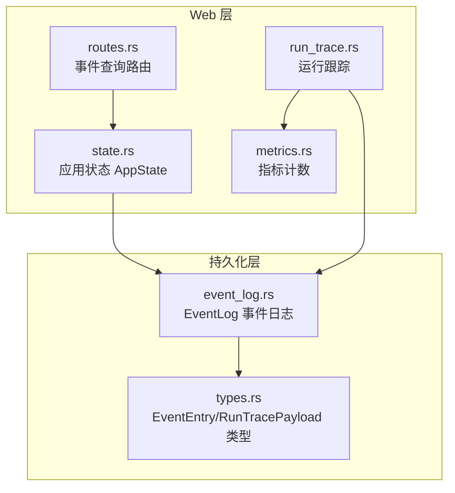
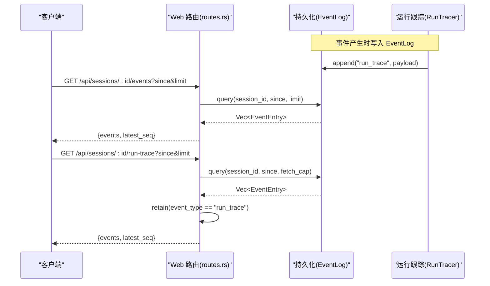
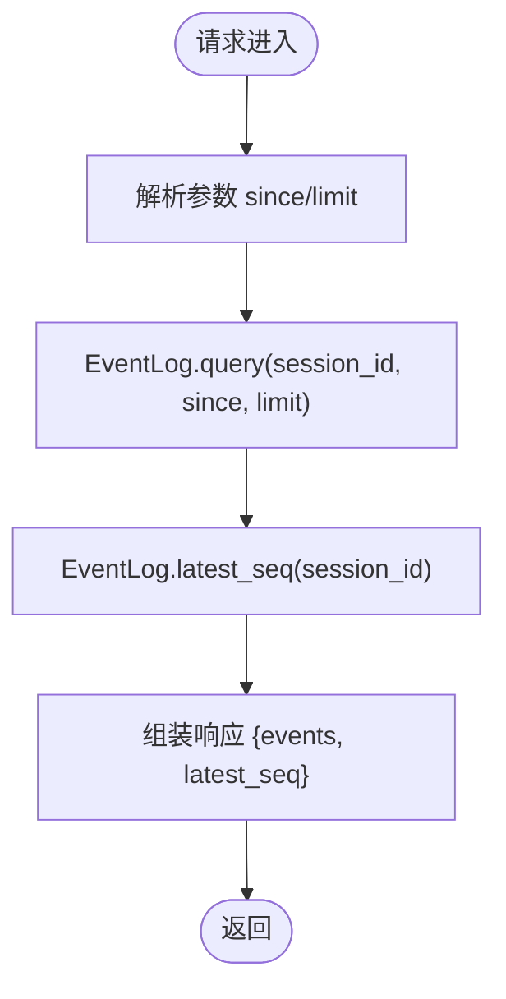
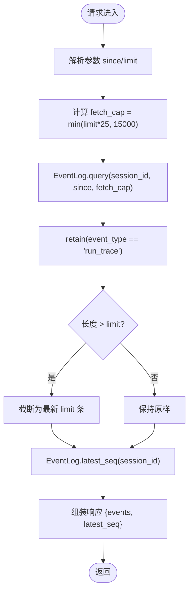
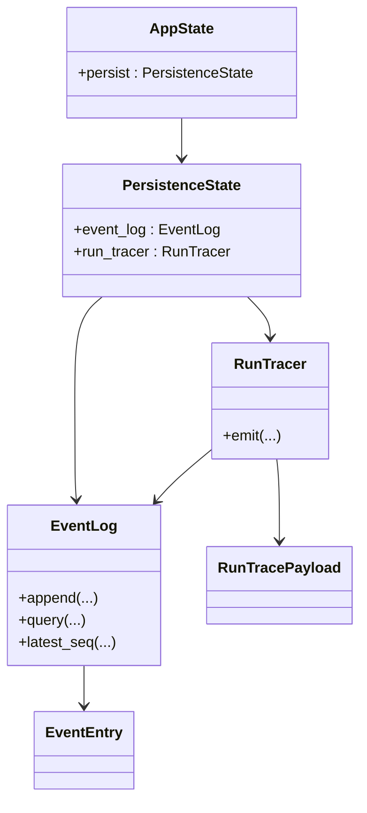

# 事件日志

<cite>
**本文档引用的文件**
- [event_log.rs](file://macaca/crates/macaca-persist/src/event_log.rs)
- [routes.rs](file://macaca/crates/macaca-web/src/routes.rs)
- [run_trace.rs](file://macaca/crates/macaca-web/src/run_trace.rs)
- [types.rs](file://macaca/crates/macaca-proto/src/types.rs)
- [state.rs](file://macaca/crates/macaca-web/src/state.rs)
- [event-log-redesign.md](file://macaca/docs/event-log-redesign.md)
- [metrics.rs](file://macaca/crates/macaca-web/src/metrics.rs)
- [trace_watch.py](file://macaca/scripts/trace_watch.py)
</cite>

## 目录
1. [简介](#简介)
2. [项目结构](#项目结构)
3. [核心组件](#核心组件)
4. [架构总览](#架构总览)
5. [详细组件分析](#详细组件分析)
6. [依赖关系分析](#依赖关系分析)
7. [性能考量](#性能考量)
8. [故障排查指南](#故障排查指南)
9. [结论](#结论)

## 简介
本文件面向事件日志API的使用者与维护者，系统性说明以下端点的行为与用法：
- GET /api/sessions/:id/events（事件查询）
- GET /api/sessions/:id/run-trace（运行跟踪查询）

重点涵盖事件过滤（按事件类型）、增量获取（基于序列号 since）、时间戳处理、批量查询优化，以及事件监控、调试追踪与性能分析的实用方法。

## 项目结构
事件日志API位于 Web 层路由模块，底层由事件日志存储提供支持，并通过运行跟踪模块生成结构化的运行轨迹事件。

**图表来源**
- [routes.rs:737-790](file://macaca/crates/macaca-web/src/routes.rs#L737-L790)
- [state.rs:58-70](file://macaca/crates/macaca-web/src/state.rs#L58-L70)
- [run_trace.rs:104-142](file://macaca/crates/macaca-web/src/run_trace.rs#L104-L142)
- [event_log.rs:18-186](file://macaca/crates/macaca-persist/src/event_log.rs#L18-L186)
- [types.rs:781-820](file://macaca/crates/macaca-proto/src/types.rs#L781-L820)

**章节来源**
- [routes.rs:737-790](file://macaca/crates/macaca-web/src/routes.rs#L737-L790)
- [state.rs:58-70](file://macaca/crates/macaca-web/src/state.rs#L58-L70)
- [event_log.rs:18-186](file://macaca/crates/macaca-persist/src/event_log.rs#L18-L186)
- [types.rs:781-820](file://macaca/crates/macaca-proto/src/types.rs#L781-L820)

## 核心组件
- 事件日志存储 EventLog
  - 提供事件追加、查询、最新序列号查询与计数统计
  - 使用 RedbStore 以键空间 events/{session_id}/{seq:08d} 存储 JSON
  - 事件写入为立即持久化，保证至少一次送达
- 事件查询路由
  - GET /api/sessions/:id/events：返回指定会话的事件列表，支持 since 与 limit 参数
  - GET /api/sessions/:id/run-trace：仅返回 event_type == "run_trace" 的结构化运行轨迹
- 运行跟踪 RunTracer
  - 生成结构化运行轨迹事件（phase、component、status 等）
  - 将 run_trace 事件写入 EventLog，并记录 Prometheus 指标

**章节来源**
- [event_log.rs:18-186](file://macaca/crates/macaca-persist/src/event_log.rs#L18-L186)
- [routes.rs:737-790](file://macaca/crates/macaca-web/src/routes.rs#L737-L790)
- [run_trace.rs:104-142](file://macaca/crates/macaca-web/src/run_trace.rs#L104-L142)
- [types.rs:781-820](file://macaca/crates/macaca-proto/src/types.rs#L781-L820)

## 架构总览
事件产生路径与查询路径解耦：事件在产生时立即写入 EventLog，前端通过轮询或 SSE 通知获取增量事件；运行轨迹通过 RunTracer 专门生成并过滤查询。

**图表来源**
- [routes.rs:751-790](file://macaca/crates/macaca-web/src/routes.rs#L751-L790)
- [event_log.rs:124-157](file://macaca/crates/macaca-persist/src/event_log.rs#L124-L157)
- [run_trace.rs:114-141](file://macaca/crates/macaca-web/src/run_trace.rs#L114-L141)

## 详细组件分析

### 事件查询端点 GET /api/sessions/:id/events
- 请求参数
  - since: 可选，起始序列号（排他），默认 0
  - limit: 可选，最大返回数量，默认 500
- 响应结构
  - events: 事件数组（EventEntry）
  - latest_seq: 当前会话最新序列号
- 查询逻辑
  - 从 EventLog.query(session_id, since, limit) 获取事件
  - 通过 EventLog.latest_seq(session_id) 返回最新序列号
- 时间戳与排序
  - EventEntry.timestamp 为事件发生时间（UTC）
  - EventEntry.seq 为每会话单调递增序列号，查询按 seq > since 顺序返回

**图表来源**
- [routes.rs:751-765](file://macaca/crates/macaca-web/src/routes.rs#L751-L765)
- [event_log.rs:124-175](file://macaca/crates/macaca-persist/src/event_log.rs#L124-L175)

**章节来源**
- [routes.rs:737-765](file://macaca/crates/macaca-web/src/routes.rs#L737-L765)
- [event_log.rs:124-175](file://macaca/crates/macaca-persist/src/event_log.rs#L124-L175)
- [types.rs:781-801](file://macaca/crates/macaca-proto/src/types.rs#L781-L801)

### 运行跟踪端点 GET /api/sessions/:id/run-trace
- 请求参数
  - since: 可选，起始序列号（排他），默认 0
  - limit: 可选，输出上限，默认 500，最大 2000
- 查询逻辑
  - 从 EventLog.query(session_id, since, fetch_cap) 获取事件
  - fetch_cap = min(limit_out * 25, 15000)，用于控制一次性扫描范围
  - 仅保留 event_type == "run_trace" 的事件
  - 若超过 limit_out，则截断为最新 limit_out 条
  - 返回 events 与 latest_seq
- 运行轨迹事件类型
  - event_type 固定为 "run_trace"
  - payload 包含 phase、component、status、message、task_id、goal_id、extra 等字段

**图表来源**
- [routes.rs:767-790](file://macaca/crates/macaca-web/src/routes.rs#L767-L790)
- [event_log.rs:124-157](file://macaca/crates/macaca-persist/src/event_log.rs#L124-L157)
- [types.rs:803-820](file://macaca/crates/macaca-proto/src/types.rs#L803-L820)

**章节来源**
- [routes.rs:767-790](file://macaca/crates/macaca-web/src/routes.rs#L767-L790)
- [run_trace.rs:104-142](file://macaca/crates/macaca-web/src/run_trace.rs#L104-L142)
- [types.rs:803-820](file://macaca/crates/macaca-proto/src/types.rs#L803-L820)

### 事件类型与过滤
- 通用事件类型
  - 包括但不限于 thinking、tool_call、tool_result、assistant、content、done、error、delegated_*、plan_decision、loop_paused/resumed、fork_created 等
- 运行轨迹事件类型
  - event_type == "run_trace"
  - payload 字段：phase（阶段）、component（组件）、status（状态）、message（消息）、task_id、goal_id、extra（扩展）
- 过滤策略
  - 通用查询：按 event_type 与业务侧自行过滤
  - 运行轨迹查询：服务端已内置 event_type == "run_trace" 过滤

**章节来源**
- [types.rs:781-820](file://macaca/crates/macaca-proto/src/types.rs#L781-L820)
- [run_trace.rs:14-57](file://macaca/crates/macaca-web/src/run_trace.rs#L14-L57)

### 时间戳处理
- EventEntry.timestamp 为事件发生时间（UTC）
- EventEntry.seq 为每会话单调递增序列号
- 查询按 seq 排序返回，天然具备时间先后顺序

**章节来源**
- [types.rs:781-801](file://macaca/crates/macaca-proto/src/types.rs#L781-L801)
- [event_log.rs:124-157](file://macaca/crates/macaca-persist/src/event_log.rs#L124-L157)

### 增量获取与批量查询优化
- 增量获取
  - 客户端轮询时将上次响应中的 latest_seq 作为下次请求的 since，即可只获取新增事件
- 批量查询优化
  - 通用查询：limit 控制单次返回数量
  - 运行轨迹查询：通过 fetch_cap 限制一次性扫描范围，避免大范围扫描导致延迟
  - 服务端对运行轨迹查询结果进行截断，确保输出数量不超过 limit

**章节来源**
- [routes.rs:751-790](file://macaca/crates/macaca-web/src/routes.rs#L751-L790)
- [event_log.rs:124-157](file://macaca/crates/macaca-persist/src/event_log.rs#L124-L157)

### 事件存储与通知
- 存储模型
  - 键空间：events/{session_id}/{seq:08d}
  - 每个事件独立键值，永不修改或删除
- 通知机制
  - EventLog.append 后通过广播发送 (session_id, seq)
  - SSE 层仅转发通知，不作为数据源

**章节来源**
- [event_log.rs:18-49](file://macaca/crates/macaca-persist/src/event_log.rs#L18-L49)
- [event-log-redesign.md:171-223](file://macaca/docs/event-log-redesign.md#L171-L223)

## 依赖关系分析
- 路由依赖应用状态 AppState，其中包含 EventLog 实例
- RunTracer 依赖 EventLog 与指标模块
- EventEntry 与 RunTracePayload 定义在协议模块

**图表来源**
- [state.rs:58-70](file://macaca/crates/macaca-web/src/state.rs#L58-L70)
- [routes.rs:751-790](file://macaca/crates/macaca-web/src/routes.rs#L751-L790)
- [run_trace.rs:104-142](file://macaca/crates/macaca-web/src/run_trace.rs#L104-L142)
- [event_log.rs:18-186](file://macaca/crates/macaca-persist/src/event_log.rs#L18-L186)
- [types.rs:781-820](file://macaca/crates/macaca-proto/src/types.rs#L781-L820)

**章节来源**
- [state.rs:58-70](file://macaca/crates/macaca-web/src/state.rs#L58-L70)
- [run_trace.rs:104-142](file://macaca/crates/macaca-web/src/run_trace.rs#L104-L142)
- [event_log.rs:18-186](file://macaca/crates/macaca-persist/src/event_log.rs#L18-L186)
- [types.rs:781-820](file://macaca/crates/macaca-proto/src/types.rs#L781-L820)

## 性能考量
- 写入路径
  - EventLog.append 为立即持久化，保证可靠性，写入成本与事件大小相关
- 读取路径
  - EventLog.query 对指定会话前缀扫描，按键名字典序遍历，seq 为 8 位零填充，字典序与数值序一致
  - 运行轨迹查询通过 fetch_cap 限制扫描规模，避免长链路全量扫描
- 指标与监控
  - 运行轨迹事件会记录 Prometheus 指标，便于观测各阶段与状态分布

**章节来源**
- [event_log.rs:124-157](file://macaca/crates/macaca-persist/src/event_log.rs#L124-L157)
- [routes.rs:767-790](file://macaca/crates/macaca-web/src/routes.rs#L767-L790)
- [metrics.rs:74-80](file://macaca/crates/macaca-web/src/metrics.rs#L74-L80)

## 故障排查指南
- 事件未显示或刷新后丢失
  - 确认使用 EventLog 查询而非依赖 SSE 内存缓冲
  - 刷新时使用 since=0 完整拉取，再订阅 SSE 获取后续更新
- 运行轨迹为空
  - 确认 RunTracer 已正确发出 run_trace 事件
  - 使用脚本 trace_watch.py 观察最新 run_trace 检查点
- 查询性能问题
  - 适当增大 limit 或调整 fetch_cap（运行轨迹端点内部已做上限控制）
  - 避免过小的 since 导致扫描过多历史

**章节来源**
- [event-log-redesign.md:171-223](file://macaca/docs/event-log-redesign.md#L171-L223)
- [trace_watch.py:97-117](file://macaca/scripts/trace_watch.py#L97-L117)

## 结论
事件日志 API 通过 EventLog 提供可靠的事件存储与查询能力，结合运行轨迹端点，能够满足事件监控、调试追踪与性能分析需求。建议：
- 前端统一从 EventLog 拉取事件，SSE 仅作为通知通道
- 使用 run-trace 端点快速定位执行瓶颈与异常
- 结合指标与 trace_watch 工具进行持续观测与告警