# 任务管理

<cite>
**本文档引用的文件**
- [routes.rs](file://macaca/crates/macaca-web/src/routes.rs)
- [todo_board.rs](file://macaca/crates/macaca-task/src/todo_board.rs)
- [todo_store.rs](file://macaca/crates/macaca-task/src/todo_store.rs)
- [scheduler.rs](file://macaca/crates/macaca-task/src/scheduler.rs)
- [plan_loop.rs](file://macaca/crates/macaca-task/src/plan_loop.rs)
- [decompose.rs](file://macaca/crates/macaca-task/src/decompose.rs)
- [types.rs](file://macaca/crates/macaca-proto/src/types.rs)
- [worker_loop.rs](file://macaca/crates/macaca-task/src/worker_loop.rs)
- [claim_diagnostics.rs](file://macaca/crates/macaca-task/src/claim_diagnostics.rs)
- [proposal.md](file://openspec/changes/refactor-sequential-task-execution/proposal.md)
- [design.md](file://openspec/changes/refactor-sequential-task-execution/design.md)
</cite>

## 目录
1. [简介](#简介)
2. [项目结构](#项目结构)
3. [核心组件](#核心组件)
4. [架构总览](#架构总览)
5. [详细组件分析](#详细组件分析)
6. [依赖关系分析](#依赖关系分析)
7. [性能考虑](#性能考虑)
8. [故障排查指南](#故障排查指南)
9. [结论](#结论)
10. [附录](#附录)

## 简介
本文件面向任务管理API的使用者与维护者，系统性梳理并说明以下端点与能力：
- GET /api/apps/{app_id}/todos：列出任务（可按会话过滤）
- GET /api/apps/{app_id}/goals：列出目标（可按会话过滤）
- GET /api/apps/{app_id}/schedules：列出计划调度（周期/间隔触发）

围绕这些端点，文档详细阐述任务列表查询、进度统计、计划调度与诊断信息获取；解释任务状态流转、优先级设置与依赖关系管理；并提供任务编排、批量操作与性能优化的实践指南。

## 项目结构
任务管理功能由Web路由层、任务空间与看板、持久化存储、计划与调度器、工作循环与诊断模块共同组成。下图展示与任务管理API直接相关的模块关系：

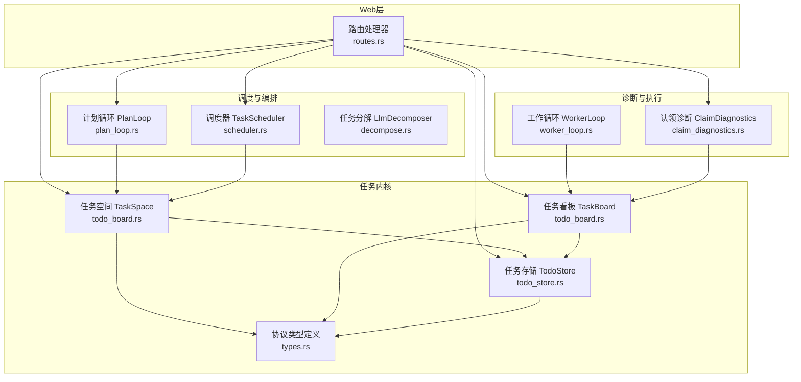

**图表来源**
- [routes.rs:441-529](file://macaca/crates/macaca-web/src/routes.rs#L441-L529)
- [todo_board.rs:252-509](file://macaca/crates/macaca-task/src/todo_board.rs#L252-L509)
- [todo_store.rs:27-332](file://macaca/crates/macaca-task/src/todo_store.rs#L27-L332)
- [scheduler.rs:217-367](file://macaca/crates/macaca-task/src/scheduler.rs#L217-L367)
- [plan_loop.rs:55-270](file://macaca/crates/macaca-task/src/plan_loop.rs#L55-L270)
- [decompose.rs:51-227](file://macaca/crates/macaca-task/src/decompose.rs#L51-L227)
- [worker_loop.rs:12-201](file://macaca/crates/macaca-task/src/worker_loop.rs#L12-L201)
- [claim_diagnostics.rs:1-41](file://macaca/crates/macaca-task/src/claim_diagnostics.rs#L1-L41)
- [types.rs:360-527](file://macaca/crates/macaca-proto/src/types.rs#L360-L527)

**章节来源**
- [routes.rs:441-529](file://macaca/crates/macaca-web/src/routes.rs#L441-L529)
- [todo_board.rs:252-509](file://macaca/crates/macaca-task/src/todo_board.rs#L252-L509)
- [todo_store.rs:27-332](file://macaca/crates/macaca-task/src/todo_store.rs#L27-L332)
- [scheduler.rs:217-367](file://macaca/crates/macaca-task/src/scheduler.rs#L217-L367)
- [plan_loop.rs:55-270](file://macaca/crates/macaca-task/src/plan_loop.rs#L55-L270)
- [decompose.rs:51-227](file://macaca/crates/macaca-task/src/decompose.rs#L51-L227)
- [worker_loop.rs:12-201](file://macaca/crates/macaca-task/src/worker_loop.rs#L12-L201)
- [claim_diagnostics.rs:1-41](file://macaca/crates/macaca-task/src/claim_diagnostics.rs#L1-L41)
- [types.rs:360-527](file://macaca/crates/macaca-proto/src/types.rs#L360-L527)

## 核心组件
- 路由处理器：提供任务列表、进度统计、目标列表、计划调度等API入口，并负责参数校验与错误响应。
- 任务空间 TaskSpace：应用级视图，负责任务创建、依赖解除、审查与进度汇总，支持跨会话/会话范围查询。
- 任务看板 TaskBoard：代理级视图，负责认领顺序、状态推进、提交评审、失败标记等原子操作。
- 任务存储 TodoStore：基于键值存储的持久化层，提供按应用/会话/代理隔离的读写接口。
- 计划调度 TaskScheduler：周期/间隔驱动的任务触发器，支持启用/禁用、下次运行时间计算与事件广播。
- 计划循环 PlanLoop：自治调度循环，负责目标分解、评审提醒、异常检测与目标完成评估。
- 任务分解 LlmDecomposer：将高层目标分解为可执行子任务，支持同代理内顺序与跨代理依赖声明。
- 工作循环 WorkerLoop：代理自动执行循环，持续认领、执行、提交评审。
- 认领诊断 ClaimDiagnostics：解释为何某些任务无法被代理认领，帮助定位阻塞原因。

**章节来源**
- [routes.rs:441-529](file://macaca/crates/macaca-web/src/routes.rs#L441-L529)
- [todo_board.rs:67-230](file://macaca/crates/macaca-task/src/todo_board.rs#L67-L230)
- [todo_board.rs:252-509](file://macaca/crates/macaca-task/src/todo_board.rs#L252-L509)
- [todo_store.rs:27-332](file://macaca/crates/macaca-task/src/todo_store.rs#L27-L332)
- [scheduler.rs:217-367](file://macaca/crates/macaca-task/src/scheduler.rs#L217-L367)
- [plan_loop.rs:55-270](file://macaca/crates/macaca-task/src/plan_loop.rs#L55-L270)
- [decompose.rs:51-227](file://macaca/crates/macaca-task/src/decompose.rs#L51-L227)
- [worker_loop.rs:12-201](file://macaca/crates/macaca-task/src/worker_loop.rs#L12-L201)
- [claim_diagnostics.rs:1-41](file://macaca/crates/macaca-task/src/claim_diagnostics.rs#L1-L41)

## 架构总览
下图展示任务管理API的关键调用链路与数据流：

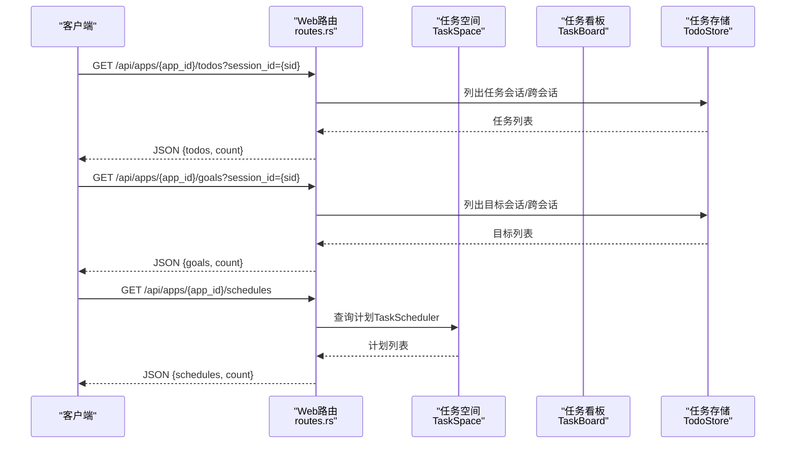

**图表来源**
- [routes.rs:441-529](file://macaca/crates/macaca-web/src/routes.rs#L441-L529)
- [todo_board.rs:252-509](file://macaca/crates/macaca-task/src/todo_board.rs#L252-L509)
- [todo_store.rs:123-179](file://macaca/crates/macaca-task/src/todo_store.rs#L123-L179)
- [scheduler.rs:264-277](file://macaca/crates/macaca-task/src/scheduler.rs#L264-L277)

**章节来源**
- [routes.rs:441-529](file://macaca/crates/macaca-web/src/routes.rs#L441-L529)
- [todo_board.rs:252-509](file://macaca/crates/macaca-task/src/todo_board.rs#L252-L509)
- [todo_store.rs:123-179](file://macaca/crates/macaca-task/src/todo_store.rs#L123-L179)
- [scheduler.rs:264-277](file://macaca/crates/macaca-task/src/scheduler.rs#L264-L277)

## 详细组件分析

### API端点与行为

#### GET /api/apps/{app_id}/todos
- 功能：列出任务，支持通过查询参数 session_id 进行会话过滤。
- 行为：
  - 解析 app_id 并校验格式；
  - 若提供 session_id，则仅返回该会话的任务；否则返回应用范围内所有任务；
  - 返回前对任务按 sequence_number 排序，确保顺序一致性。
- 响应：JSON 对象包含 todos 数组与 count。
- 错误：无效 app_id 返回 400。

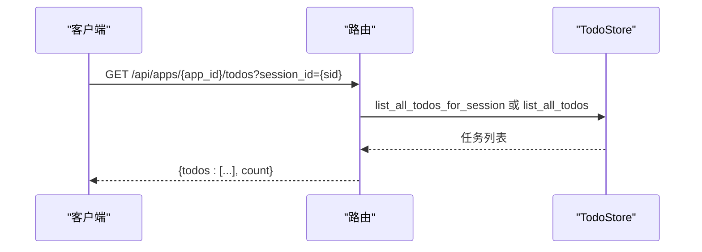

**图表来源**
- [routes.rs:441-457](file://macaca/crates/macaca-web/src/routes.rs#L441-L457)
- [todo_store.rs:123-170](file://macaca/crates/macaca-task/src/todo_store.rs#L123-L170)

**章节来源**
- [routes.rs:441-457](file://macaca/crates/macaca-web/src/routes.rs#L441-L457)
- [todo_store.rs:123-170](file://macaca/crates/macaca-task/src/todo_store.rs#L123-L170)

#### GET /api/apps/{app_id}/goals
- 功能：列出目标，支持通过查询参数 session_id 进行会话过滤。
- 行为：
  - 解析 app_id 并校验格式；
  - 若提供 session_id，则仅返回该会话的目标；否则返回应用范围内所有目标。
- 响应：JSON 对象包含 goals 数组与 count。
- 错误：无效 app_id 返回 400。

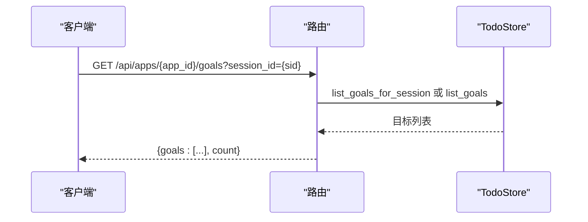

**图表来源**
- [routes.rs:514-529](file://macaca/crates/macaca-web/src/routes.rs#L514-L529)
- [todo_store.rs:288-316](file://macaca/crates/macaca-task/src/todo_store.rs#L288-L316)

**章节来源**
- [routes.rs:514-529](file://macaca/crates/macaca-web/src/routes.rs#L514-L529)
- [todo_store.rs:288-316](file://macaca/crates/macaca-task/src/todo_store.rs#L288-L316)

#### GET /api/apps/{app_id}/schedules
- 功能：列出应用的所有计划调度条目。
- 行为：
  - 解析 app_id 并校验格式；
  - 使用 TaskScheduler 列出该应用下的所有调度项。
- 响应：JSON 对象包含 schedules 数组与 count。
- 错误：无效 app_id 返回 400。

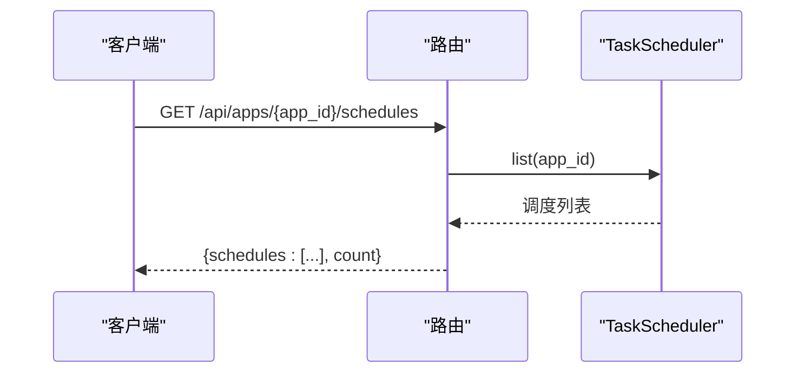

**图表来源**
- [routes.rs:540-553](file://macaca/crates/macaca-web/src/routes.rs#L540-L553)
- [scheduler.rs:264-277](file://macaca/crates/macaca-task/src/scheduler.rs#L264-L277)

**章节来源**
- [routes.rs:540-553](file://macaca/crates/macaca-web/src/routes.rs#L540-L553)
- [scheduler.rs:264-277](file://macaca/crates/macaca-task/src/scheduler.rs#L264-L277)

### 任务状态流转与优先级设置

#### 状态机与流转
- 支持的状态包括：待认领(Pending)、已认领(Assigned)、执行中(InProgress)、待评审(PendingReview)、需优化(NeedsOptimization)、已完成(Completed)、阻塞(Blocked)、取消(Cancelled)、失败(Failed)。
- 流转路径由代理看板与计划循环协作完成：
  - 代理看板：认领 → 启动执行 → 提交评审 → 计划评审（通过/不通过/失败阈值）。
  - 计划循环：监控评审结果、异常与目标完成情况，触发后续动作。

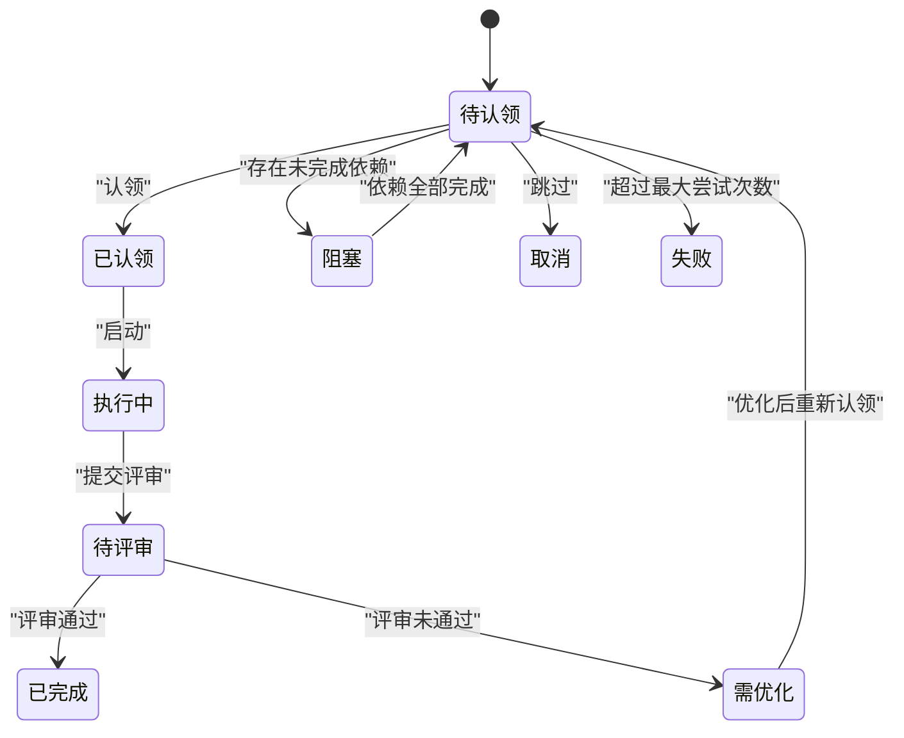

**图表来源**
- [types.rs:360-381](file://macaca/crates/macaca-proto/src/types.rs#L360-L381)
- [todo_board.rs:98-146](file://macaca/crates/macaca-task/src/todo_board.rs#L98-L146)
- [todo_board.rs:319-358](file://macaca/crates/macaca-task/src/todo_board.rs#L319-L358)

**章节来源**
- [types.rs:360-381](file://macaca/crates/macaca-proto/src/types.rs#L360-L381)
- [todo_board.rs:98-146](file://macaca/crates/macaca-task/src/todo_board.rs#L98-L146)
- [todo_board.rs:319-358](file://macaca/crates/macaca-task/src/todo_board.rs#L319-L358)

#### 优先级与顺序
- 优先级：任务在代理看板内部按 sequence_number 严格顺序执行，而非按优先级抢占。
- 自动序号：TaskSpace.create_and_assign 为同一 agent+session 自动分配递增序号，避免 LLM 冲突。
- 依赖声明：支持 depends_on（同会话）与跨代理依赖（AgentTaskRef.AllTasks/SpecificTask），用于表达阶段编排。

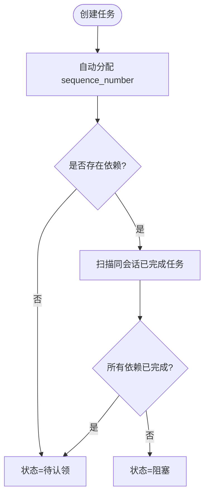

**图表来源**
- [todo_board.rs:269-317](file://macaca/crates/macaca-task/src/todo_board.rs#L269-L317)
- [decompose.rs:150-227](file://macaca/crates/macaca-task/src/decompose.rs#L150-L227)
- [design.md:34-69](file://openspec/changes/refactor-sequential-task-execution/design.md#L34-L69)

**章节来源**
- [todo_board.rs:269-317](file://macaca/crates/macaca-task/src/todo_board.rs#L269-L317)
- [decompose.rs:150-227](file://macaca/crates/macaca-task/src/decompose.rs#L150-L227)
- [design.md:34-69](file://openspec/changes/refactor-sequential-task-execution/design.md#L34-L69)

### 依赖关系管理与诊断

#### 依赖解析与解除
- 同会话依赖：通过 depends_on 指定 TaskId，当被依赖任务全部完成时，阻塞任务自动变为待认领。
- 跨代理依赖：通过 AgentTaskRef 声明等待某代理“所有任务”或“特定任务”，创建时解析为具体 TaskId。
- 依赖环检测：提供 detect_cycles 工具函数，用于批处理时检测依赖环。

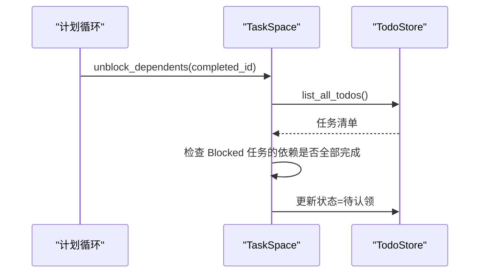

**图表来源**
- [todo_board.rs:378-399](file://macaca/crates/macaca-task/src/todo_board.rs#L378-L399)
- [todo_board.rs:502-509](file://macaca/crates/macaca-task/src/todo_board.rs#L502-L509)

**章节来源**
- [todo_board.rs:378-399](file://macaca/crates/macaca-task/src/todo_board.rs#L378-L399)
- [todo_board.rs:502-509](file://macaca/crates/macaca-task/src/todo_board.rs#L502-L509)

#### 认领诊断
- 当代理无法认领 Pending 任务时，可通过 GET /api/apps/{app_id}/todos/claim-diagnostics 获取诊断报告，解释首条非终止任务是否可认领及其原因（阻塞/等待/顺序限制）。
- 报告包含：首个门闩任务、等待原因、挂起/阻塞计数等。

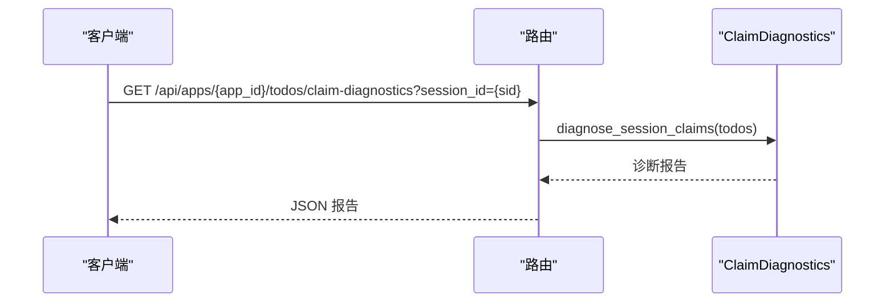

**图表来源**
- [routes.rs:459-479](file://macaca/crates/macaca-web/src/routes.rs#L459-L479)
- [claim_diagnostics.rs:1-41](file://macaca/crates/macaca-task/src/claim_diagnostics.rs#L1-L41)

**章节来源**
- [routes.rs:459-479](file://macaca/crates/macaca-web/src/routes.rs#L459-L479)
- [claim_diagnostics.rs:1-41](file://macaca/crates/macaca-task/src/claim_diagnostics.rs#L1-L41)

### 计划调度与触发

#### 调度器配置与事件
- 支持两种触发方式：cron 表达式（7字段）或固定间隔秒数；
- 每次触发产生 ScheduleEvent，Web层监听并根据 action 创建目标或任务；
- 支持启用/禁用、下次运行时间计算与运行计数统计。

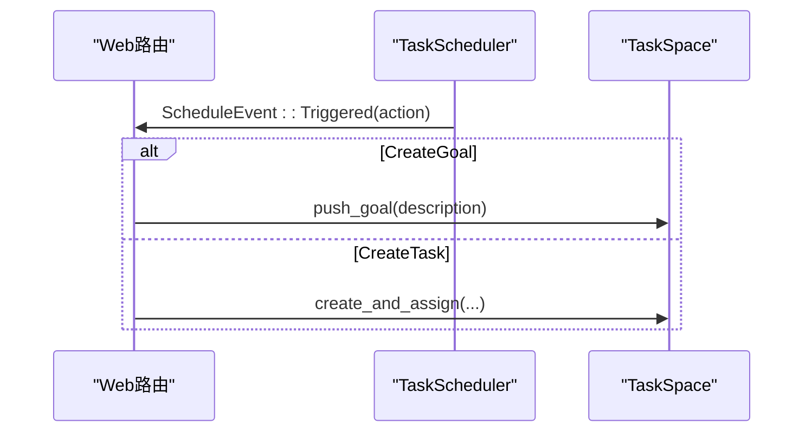

**图表来源**
- [routes.rs:569-666](file://macaca/crates/macaca-web/src/routes.rs#L569-L666)
- [scheduler.rs:184-190](file://macaca/crates/macaca-task/src/scheduler.rs#L184-L190)

**章节来源**
- [routes.rs:569-666](file://macaca/crates/macaca-web/src/routes.rs#L569-L666)
- [scheduler.rs:184-190](file://macaca/crates/macaca-task/src/scheduler.rs#L184-L190)

### 进度统计与目标评估

#### 应用级进度
- TaskSpace.overall_progress 统计各状态数量，支持跨会话/会话范围查询；
- 支持 all_tasks_done 快速判断整体完成状态。

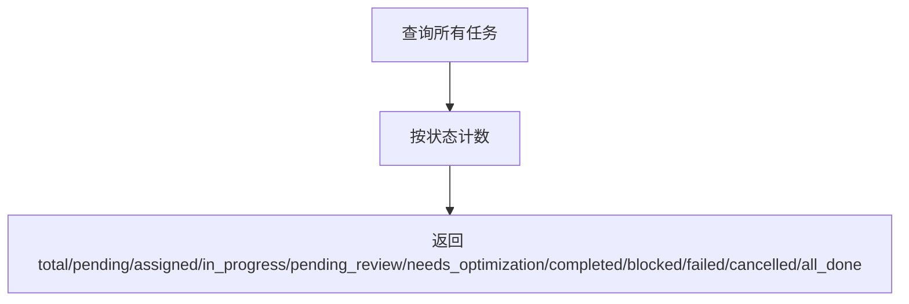

**图表来源**
- [todo_board.rs:426-443](file://macaca/crates/macaca-task/src/todo_board.rs#L426-L443)
- [routes.rs:481-499](file://macaca/crates/macaca-web/src/routes.rs#L481-L499)

**章节来源**
- [todo_board.rs:426-443](file://macaca/crates/macaca-task/src/todo_board.rs#L426-L443)
- [routes.rs:481-499](file://macaca/crates/macaca-web/src/routes.rs#L481-L499)

#### 目标评估与完成
- PlanLoop 监控目标状态，当目标下所有任务完成时，请求质量评估；
- GoalEvaluator 使用 LLM 对任务摘要进行评估，决定目标是否满意或需要补充工作。

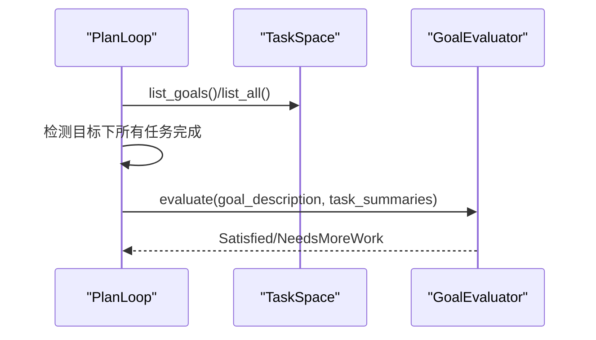

**图表来源**
- [plan_loop.rs:193-268](file://macaca/crates/macaca-task/src/plan_loop.rs#L193-L268)
- [plan_loop.rs:315-435](file://macaca/crates/macaca-task/src/plan_loop.rs#L315-L435)

**章节来源**
- [plan_loop.rs:193-268](file://macaca/crates/macaca-task/src/plan_loop.rs#L193-L268)
- [plan_loop.rs:315-435](file://macaca/crates/macaca-task/src/plan_loop.rs#L315-L435)

### 任务编排与批量操作实践

#### 编排策略
- 通过 AgentTaskRef 表达跨代理依赖（AllTasks/SpecificTask），结合 sequence 实现同代理内的严格顺序；
- 使用 PlanLoop 的事件驱动模型，配合 LlmDecomposer 将高层目标分解为有序子任务；
- 通过 ScheduleAction 在定时触发时自动生成目标或任务，形成闭环。

**章节来源**
- [decompose.rs:51-227](file://macaca/crates/macaca-task/src/decompose.rs#L51-L227)
- [design.md:50-69](file://openspec/changes/refactor-sequential-task-execution/design.md#L50-L69)
- [routes.rs:569-666](file://macaca/crates/macaca-web/src/routes.rs#L569-L666)

#### 批量操作建议
- 依赖声明：在一次分解批次内，先解析 depends_on_titles，再解析跨代理依赖，最后统一创建；
- 顺序控制：确保同一代理内的 sequence 严格递增，避免手动干预；
- 会话隔离：使用 session_id 将不同会话的任务隔离，便于并行推进与独立审计。

**章节来源**
- [decompose.rs:150-227](file://macaca/crates/macaca-task/src/decompose.rs#L150-L227)
- [todo_store.rs:123-170](file://macaca/crates/macaca-task/src/todo_store.rs#L123-L170)

## 依赖关系分析

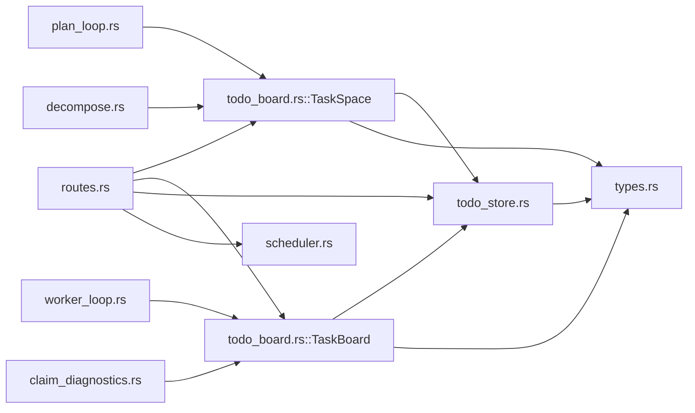

**图表来源**
- [routes.rs:441-529](file://macaca/crates/macaca-web/src/routes.rs#L441-L529)
- [todo_board.rs:67-230](file://macaca/crates/macaca-task/src/todo_board.rs#L67-L230)
- [todo_board.rs:252-509](file://macaca/crates/macaca-task/src/todo_board.rs#L252-L509)
- [todo_store.rs:27-332](file://macaca/crates/macaca-task/src/todo_store.rs#L27-L332)
- [scheduler.rs:217-367](file://macaca/crates/macaca-task/src/scheduler.rs#L217-L367)
- [plan_loop.rs:55-270](file://macaca/crates/macaca-task/src/plan_loop.rs#L55-L270)
- [worker_loop.rs:12-201](file://macaca/crates/macaca-task/src/worker_loop.rs#L12-L201)
- [claim_diagnostics.rs:1-41](file://macaca/crates/macaca-task/src/claim_diagnostics.rs#L1-L41)
- [decompose.rs:51-227](file://macaca/crates/macaca-task/src/decompose.rs#L51-L227)
- [types.rs:360-527](file://macaca/crates/macaca-proto/src/types.rs#L360-L527)

**章节来源**
- [routes.rs:441-529](file://macaca/crates/macaca-web/src/routes.rs#L441-L529)
- [todo_board.rs:67-230](file://macaca/crates/macaca-task/src/todo_board.rs#L67-L230)
- [todo_board.rs:252-509](file://macaca/crates/macaca-task/src/todo_board.rs#L252-L509)
- [todo_store.rs:27-332](file://macaca/crates/macaca-task/src/todo_store.rs#L27-L332)
- [scheduler.rs:217-367](file://macaca/crates/macaca-task/src/scheduler.rs#L217-L367)
- [plan_loop.rs:55-270](file://macaca/crates/macaca-task/src/plan_loop.rs#L55-L270)
- [worker_loop.rs:12-201](file://macaca/crates/macaca-task/src/worker_loop.rs#L12-L201)
- [claim_diagnostics.rs:1-41](file://macaca/crates/macaca-task/src/claim_diagnostics.rs#L1-L41)
- [decompose.rs:51-227](file://macaca/crates/macaca-task/src/decompose.rs#L51-L227)
- [types.rs:360-527](file://macaca/crates/macaca-proto/src/types.rs#L360-L527)

## 性能考虑
- 存储层采用键值存储，每次状态变更立即持久化，避免批处理带来的复杂性，但写入频率较高。建议：
  - 控制任务数量规模，合理拆分会话；
  - 使用 session_id 进行隔离，减少跨会话扫描范围；
  - 对高频查询（如进度统计）可在上层缓存短期结果。
- 计划调度轮询间隔默认 60 秒，可根据业务需求调整 SchedulerConfig.check_interval_secs。
- 认领顺序按 session 分组并按最新会话优先，减少跨会话干扰，提高吞吐。

[本节为通用指导，无需特定文件引用]

## 故障排查指南
- 任务无法被认领：
  - 使用 GET /api/apps/{app_id}/todos/claim-diagnostics?session_id={sid} 获取诊断报告；
  - 关注首个门闩任务、阻塞原因与依赖未完成项。
- 评审未触发：
  - 检查 PlanLoop 是否正常运行，确认 PendingReview 任务存在；
  - 查看 PlanLoop 的 AnomalyDetected 事件以定位失败任务。
- 调度未生效：
  - 确认 ScheduleEntry.enabled 为 true，检查 next_run_at 是否在未来；
  - 核对 Action 类型（CreateGoal/CreateTask）与参数完整性。

**章节来源**
- [routes.rs:459-479](file://macaca/crates/macaca-web/src/routes.rs#L459-L479)
- [plan_loop.rs:183-191](file://macaca/crates/macaca-task/src/plan_loop.rs#L183-L191)
- [scheduler.rs:150-161](file://macaca/crates/macaca-task/src/scheduler.rs#L150-L161)

## 结论
本文档系统梳理了任务管理API的端点、状态流转、依赖编排与调度机制，并提供了诊断与性能优化建议。通过严格的顺序执行、跨代理依赖与计划调度，系统能够稳定支撑多代理协同与复杂任务编排场景。

[本节为总结性内容，无需特定文件引用]

## 附录

### API定义概览
- GET /api/apps/{app_id}/todos
  - 查询参数：session_id（可选）
  - 响应：{todos:[...], count}
- GET /api/apps/{app_id}/goals
  - 查询参数：session_id（可选）
  - 响应：{goals:[...], count}
- GET /api/apps/{app_id}/schedules
  - 响应：{schedules:[...], count}

**章节来源**
- [routes.rs:441-529](file://macaca/crates/macaca-web/src/routes.rs#L441-L529)
- [routes.rs:540-553](file://macaca/crates/macaca-web/src/routes.rs#L540-L553)