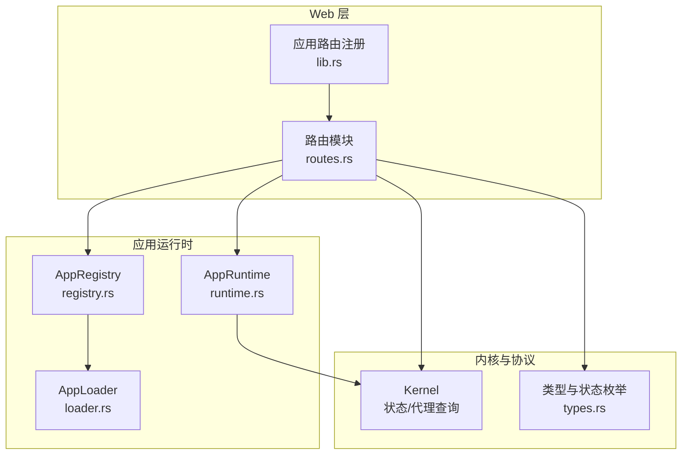
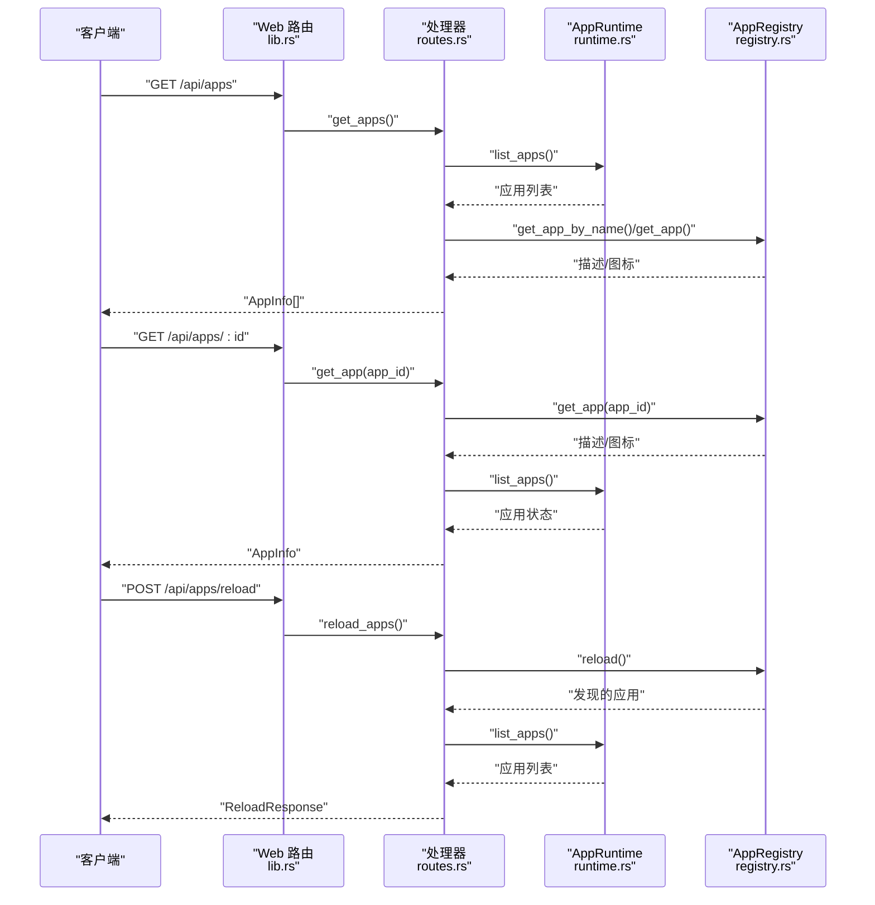
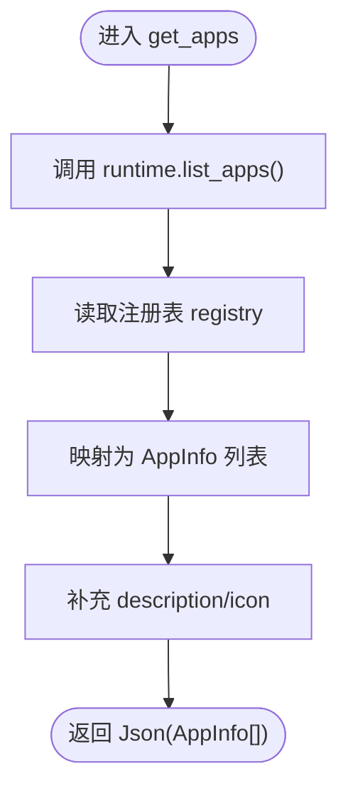
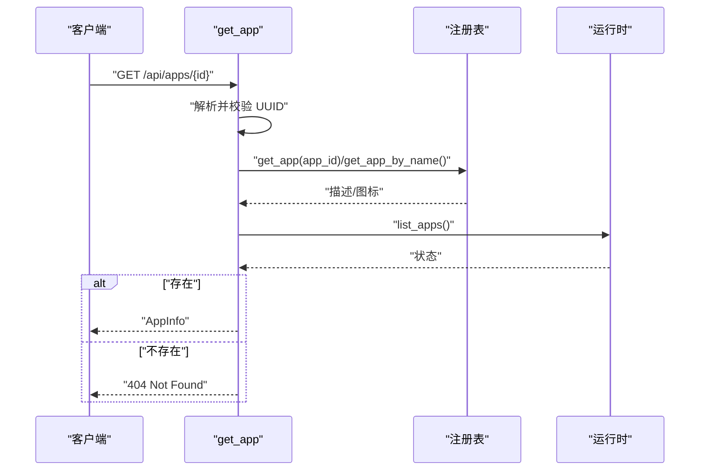
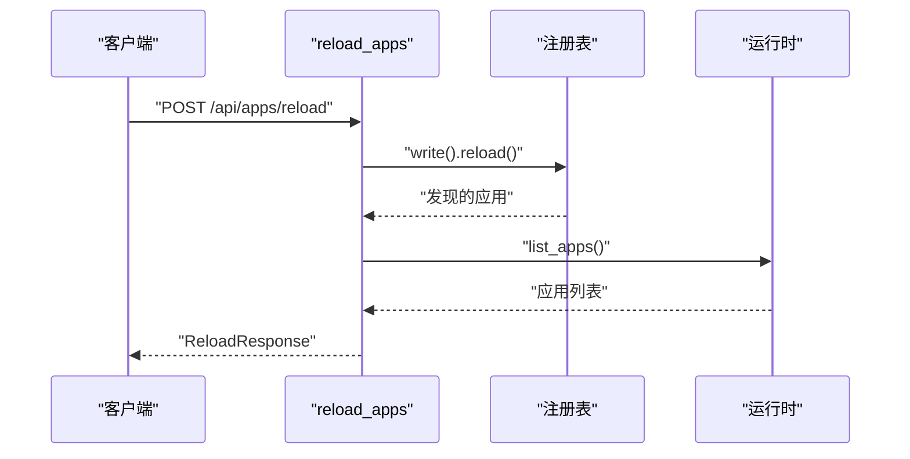
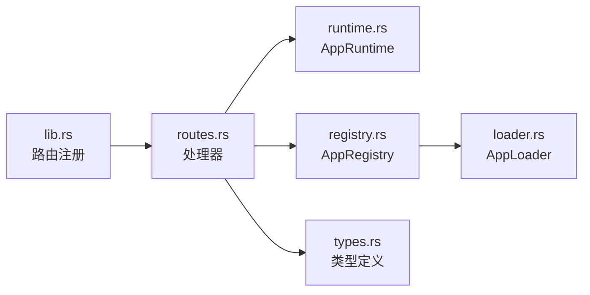

# 应用管理

<cite>
**本文引用的文件**
- [routes.rs](file://macaca/crates/macaca-web/src/routes.rs)
- [lib.rs](file://macaca/crates/macaca-web/src/lib.rs)
- [types.rs](file://macaca/crates/macaca-proto/src/types.rs)
- [runtime.rs](file://macaca/crates/macaca-app/src/runtime.rs)
- [registry.rs](file://macaca/crates/macaca-app/src/registry.rs)
- [loader.rs](file://macaca/crates/macaca-app/src/loader.rs)
- [ARCHITECTURE-v2.md](file://macaca/ARCHITECTURE-v2.md)
</cite>

## 目录
1. [简介](#简介)
2. [项目结构](#项目结构)
3. [核心组件](#核心组件)
4. [架构总览](#架构总览)
5. [详细组件分析](#详细组件分析)
6. [依赖分析](#依赖分析)
7. [性能考虑](#性能考虑)
8. [故障排查指南](#故障排查指南)
9. [结论](#结论)
10. [附录](#附录)

## 简介
本文件面向应用管理API，聚焦以下端点：
- GET /api/apps：获取应用列表
- GET /api/apps/:id：查询单个应用
- POST /api/apps/reload：重新加载应用

文档将说明应用信息结构、状态枚举、错误处理策略，并提供部署、配置更新与故障恢复的操作指南。

## 项目结构
应用管理API位于 Web 层（macaca-web），通过路由将请求转发至运行时（AppRuntime）、注册表（AppRegistry）与内核（Kernel）以获取应用与代理状态；应用清单（app.yaml）由注册表扫描并解析，运行时负责启动/停止应用及其代理。

图表来源
- [routes.rs:81-110](file://macaca/crates/macaca-web/src/routes.rs#L81-L110)
- [lib.rs:614-623](file://macaca/crates/macaca-web/src/lib.rs#L614-L623)
- [runtime.rs:15-27](file://macaca/crates/macaca-app/src/runtime.rs#L15-L27)
- [registry.rs:36-44](file://macaca/crates/macaca-app/src/registry.rs#L36-L44)
- [loader.rs:11-29](file://macaca/crates/macaca-app/src/loader.rs#L11-L29)
- [types.rs:101-131](file://macaca/crates/macaca-proto/src/types.rs#L101-L131)

章节来源
- [routes.rs:81-110](file://macaca/crates/macaca-web/src/routes.rs#L81-L110)
- [lib.rs:614-623](file://macaca/crates/macaca-web/src/lib.rs#L614-L623)

## 核心组件
- 应用信息结构 AppInfo
  - 字段：id、name、status、agent_count、description、icon
  - 用途：用于应用列表与单个应用查询的响应体
- 应用状态枚举 AppStatus
  - 取值：Loaded、Running、Stopped、Failed
  - 用途：反映应用生命周期状态
- 代理活动状态枚举 AgentActivity
  - 取值：Idle、Working、Error、Thinking
  - 用途：用于代理实时状态展示与SSE推送
- 应用标识 ApplicationId
  - 生成：基于名称的确定性UUID（v5）
  - 用途：跨重启保持一致的应用ID

章节来源
- [routes.rs:71-110](file://macaca/crates/macaca-web/src/routes.rs#L71-L110)
- [types.rs:101-131](file://macaca/crates/macaca-proto/src/types.rs#L101-L131)
- [types.rs:18-29](file://macaca/crates/macaca-proto/src/types.rs#L18-L29)
- [types.rs:168-186](file://macaca/crates/macaca-proto/src/types.rs#L168-L186)

## 架构总览
应用管理API的请求在 Web 路由层被接收，随后根据端点调用相应处理器：
- GET /api/apps：遍历已加载应用，合并注册表中的描述信息，组装 AppInfo 列表
- GET /api/apps/:id：校验应用ID合法性，从注册表与运行时获取应用信息
- POST /api/apps/reload：刷新注册表，重新扫描应用清单，重建应用信息列表

图表来源
- [lib.rs:614-623](file://macaca/crates/macaca-web/src/lib.rs#L614-L623)
- [routes.rs:81-110](file://macaca/crates/macaca-web/src/routes.rs#L81-L110)
- [routes.rs:116-150](file://macaca/crates/macaca-web/src/routes.rs#L116-L150)
- [routes.rs:353-394](file://macaca/crates/macaca-web/src/routes.rs#L353-L394)
- [runtime.rs:256-301](file://macaca/crates/macaca-app/src/runtime.rs#L256-L301)
- [registry.rs:36-44](file://macaca/crates/macaca-app/src/registry.rs#L36-L44)

## 详细组件分析

### GET /api/apps（应用列表）
- 功能：返回所有已加载应用的简要信息
- 数据来源：
  - 运行时：应用ID、名称、状态
  - 注册表：应用描述与图标（来自 app.yaml）
  - 内核：代理总数（agent_count）
- 输出：AppInfo 数组

图表来源
- [routes.rs:81-110](file://macaca/crates/macaca-web/src/routes.rs#L81-L110)

章节来源
- [routes.rs:81-110](file://macaca/crates/macaca-web/src/routes.rs#L81-L110)

### GET /api/apps/:id（单个应用）
- 功能：按应用ID返回应用详情
- 输入校验：应用ID必须为合法UUID
- 数据来源：
  - 注册表：应用描述与图标
  - 运行时：应用状态
  - 内核：代理总数
- 输出：单个 AppInfo
- 错误：
  - 400：无效的应用ID
  - 404：应用不存在

图表来源
- [routes.rs:116-150](file://macaca/crates/macaca-web/src/routes.rs#L116-L150)

章节来源
- [routes.rs:116-150](file://macaca/crates/macaca-web/src/routes.rs#L116-L150)

### POST /api/apps/reload（重新加载应用）
- 功能：刷新应用注册表，重新扫描应用清单，重建应用信息列表
- 流程：
  - 写锁注册表并 reload
  - 读取运行时应用列表
  - 读取注册表描述与图标
  - 组装 AppInfo 列表
- 输出：ReloadResponse（包含发现数量与应用列表）

图表来源
- [routes.rs:353-394](file://macaca/crates/macaca-web/src/routes.rs#L353-L394)

章节来源
- [routes.rs:353-394](file://macaca/crates/macaca-web/src/routes.rs#L353-L394)

### 应用信息结构与状态枚举
- AppInfo 字段
  - id：字符串形式的应用ID
  - name：应用名称
  - status：应用状态（字符串化）
  - agent_count：代理总数
  - description：应用描述（来自 app.yaml）
  - icon：图标标识（默认“cube”）
- AppStatus
  - Loaded：已加载但代理未启动
  - Running：代理运行中
  - Stopped：已停止
  - Failed：启动失败或运行中出现错误
- AgentActivity
  - Idle：空闲
  - Working：工作中（含上下文）
  - Error：错误（含错误信息）
  - Thinking：思考中（含上下文）

章节来源
- [routes.rs:71-110](file://macaca/crates/macaca-web/src/routes.rs#L71-L110)
- [types.rs:18-29](file://macaca/crates/macaca-proto/src/types.rs#L18-L29)
- [types.rs:168-186](file://macaca/crates/macaca-proto/src/types.rs#L168-L186)

### 错误处理与返回码
- 400 Bad Request：应用ID格式非法
- 404 Not Found：应用不存在
- 500 Internal Server Error：注册表重载失败

章节来源
- [routes.rs:120-122](file://macaca/crates/macaca-web/src/routes.rs#L120-L122)
- [routes.rs](file://macaca/crates/macaca-web/src/routes.rs#L149)
- [routes.rs:358-359](file://macaca/crates/macaca-web/src/routes.rs#L358-L359)

## 依赖分析
- Web 路由层依赖：
  - 路由注册：lib.rs 中将 /api/apps、/api/apps/:id、/api/apps/reload 绑定到处理器
  - 处理器：routes.rs 中实现 get_apps、get_app、reload_apps
- 应用运行时依赖：
  - AppRuntime：提供 list_apps、app_agents、agent_count 等查询
  - AppRegistry：提供应用清单扫描与描述读取
  - AppLoader：解析 app.yaml 并验证
- 协议与类型：
  - ApplicationId、AgentState、AgentActivity 等类型定义于 types.rs

图表来源
- [lib.rs:614-623](file://macaca/crates/macaca-web/src/lib.rs#L614-L623)
- [routes.rs:81-110](file://macaca/crates/macaca-web/src/routes.rs#L81-L110)
- [runtime.rs:15-27](file://macaca/crates/macaca-app/src/runtime.rs#L15-L27)
- [registry.rs:36-44](file://macaca/crates/macaca-app/src/registry.rs#L36-L44)
- [loader.rs:11-29](file://macaca/crates/macaca-app/src/loader.rs#L11-L29)
- [types.rs:101-131](file://macaca/crates/macaca-proto/src/types.rs#L101-L131)

章节来源
- [lib.rs:614-623](file://macaca/crates/macaca-web/src/lib.rs#L614-L623)
- [routes.rs:81-110](file://macaca/crates/macaca-web/src/routes.rs#L81-L110)
- [runtime.rs:15-27](file://macaca/crates/macaca-app/src/runtime.rs#L15-L27)
- [registry.rs:36-44](file://macaca/crates/macaca-app/src/registry.rs#L36-L44)
- [loader.rs:11-29](file://macaca/crates/macaca-app/src/loader.rs#L11-L29)
- [types.rs:101-131](file://macaca/crates/macaca-proto/src/types.rs#L101-L131)

## 性能考虑
- 列表查询复杂度：O(N)，N为已加载应用数；注册表描述读取为常数时间
- 重载查询复杂度：O(M)（M为发现的应用数）+ O(N)
- 建议：
  - 控制应用数量，避免一次性加载过多应用
  - 在高并发场景下，合理设置请求频率，避免频繁 reload
  - 对于大体量应用，建议分页或筛选条件（当前实现未提供）

## 故障排查指南
- 400 Invalid app_id
  - 检查请求路径中的应用ID是否为合法UUID
- 404 App not found
  - 确认应用是否已加载；尝试先调用 POST /api/apps/reload 刷新注册表
- 500 Failed to reload apps
  - 检查应用清单（app.yaml）格式与权限；确认注册表扫描目录可读
- 应用状态异常
  - 使用 GET /api/apps/:id 查看状态
  - 使用 GET /api/apps/:id/agents 查看代理状态与活动
  - 使用 GET /api/apps/:id/agents/stream 实时观察代理状态变更

章节来源
- [routes.rs:120-122](file://macaca/crates/macaca-web/src/routes.rs#L120-L122)
- [routes.rs](file://macaca/crates/macaca-web/src/routes.rs#L149)
- [routes.rs:358-359](file://macaca/crates/macaca-web/src/routes.rs#L358-L359)

## 结论
应用管理API提供了对应用生命周期与运行状态的统一入口，结合注册表与运行时，能够稳定地提供应用列表、详情与重新加载能力。通过合理的错误处理与状态枚举，便于前端与运维系统进行监控与故障恢复。

## 附录

### API 定义与示例

- GET /api/apps
  - 描述：获取应用列表
  - 响应：AppInfo[]
  - 示例响应字段：id、name、status、agent_count、description、icon
- GET /api/apps/:id
  - 描述：查询单个应用
  - 路径参数：id（应用ID，UUID）
  - 响应：AppInfo
  - 错误：400（无效ID）、404（应用不存在）
- POST /api/apps/reload
  - 描述：重新加载应用
  - 响应：ReloadResponse（discovered_count、apps: AppInfo[]）
  - 错误：500（重载失败）

章节来源
- [routes.rs:81-110](file://macaca/crates/macaca-web/src/routes.rs#L81-L110)
- [routes.rs:116-150](file://macaca/crates/macaca-web/src/routes.rs#L116-L150)
- [routes.rs:353-394](file://macaca/crates/macaca-web/src/routes.rs#L353-L394)

### 应用部署与配置更新操作指南
- 部署新应用
  - 将应用清单（app.yaml）放置于注册表扫描目录之一
  - 调用 POST /api/apps/reload 刷新注册表
  - 使用 GET /api/apps 查询新应用是否出现在列表
- 更新应用配置
  - 修改 app.yaml 后，调用 POST /api/apps/reload
  - 如需立即生效，可结合应用内部重启机制（视具体应用实现）
- 故障恢复
  - 若应用状态异常，先调用 POST /api/apps/reload 重新加载
  - 使用 GET /api/apps/:id/agents 与 GET /api/apps/:id/agents/stream 检查代理状态
  - 若仍异常，检查应用日志与 app.yaml 格式

章节来源
- [ARCHITECTURE-v2.md:28-317](file://macaca/ARCHITECTURE-v2.md#L28-L317)
- [registry.rs:11-16](file://macaca/crates/macaca-app/src/registry.rs#L11-L16)
- [loader.rs:16-29](file://macaca/crates/macaca-app/src/loader.rs#L16-L29)