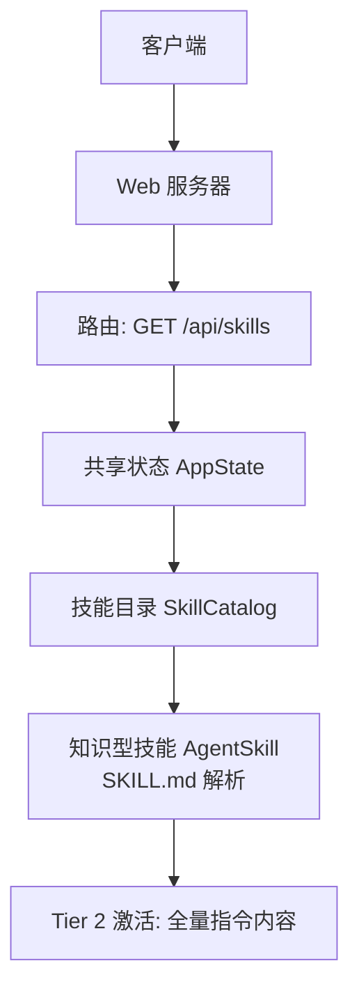
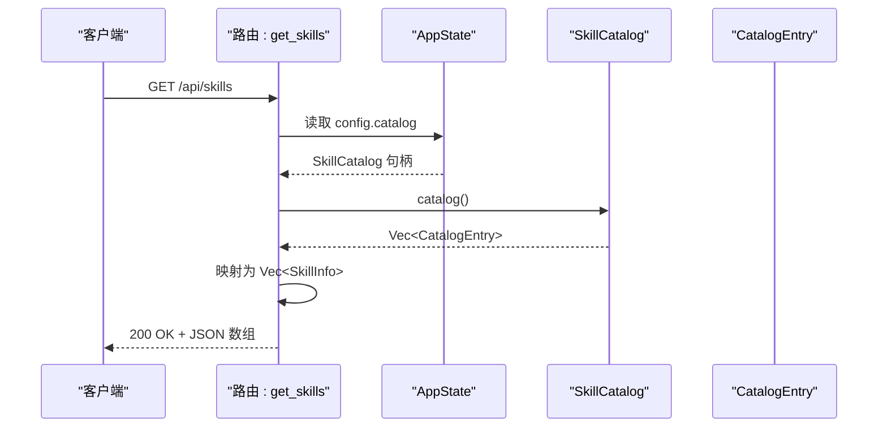
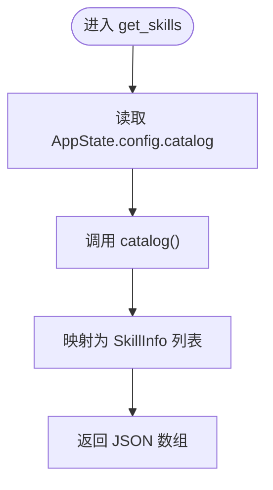
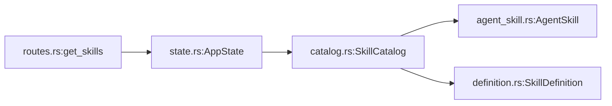

# 技能目录

<cite>
**本文引用的文件**
- [routes.rs](file://macaca/crates/macaca-web/src/routes.rs)
- [lib.rs](file://macaca/crates/macaca-web/src/lib.rs)
- [state.rs](file://macaca/crates/macaca-web/src/state.rs)
- [catalog.rs](file://macaca/crates/macaca-skill/src/catalog.rs)
- [agent_skill.rs](file://macaca/crates/macaca-skill/src/agent_skill.rs)
- [definition.rs](file://macaca/crates/macaca-skill/src/definition.rs)
- [fullstack-autodev golang SKILL.md](file://examples/apps/fullstack-autodev/skills/golang/SKILL.md)
- [fullstack-autodev shadcn-ui SKILL.md](file://examples/apps/fullstack-autodev/skills/shadcn-ui/SKILL.md)
</cite>

## 目录
1. [简介](#简介)
2. [项目结构](#项目结构)
3. [核心组件](#核心组件)
4. [架构总览](#架构总览)
5. [详细组件分析](#详细组件分析)
6. [依赖关系分析](#依赖关系分析)
7. [性能考量](#性能考量)
8. [故障排查指南](#故障排查指南)
9. [结论](#结论)
10. [附录](#附录)

## 简介
本文件为“技能目录”API（GET /api/skills）的技术与使用文档，面向需要查询与管理可用技能的开发者与集成方。该API提供按名称与描述组织的技能清单，用于技能发现、能力评估与工具选择。同时，文档阐述了技能信息的数据结构、描述字段与分类组织方式，并给出基于技能目录优化Agent能力组合与任务执行效率的实践建议。

## 项目结构
- Web服务通过路由层暴露 /api/skills，返回技能清单。
- 技能目录由 SkillCatalog 统一管理，支持从目录扫描、动态注册等方式加载知识型技能（SKILL.md），并提供三级渐进式披露：目录元数据（Tier 1）、完整指令内容（Tier 2）、资源文件（Tier 3）。
- 示例技能位于 examples/apps/fullstack-autodev/skills 下，包含 golang 与 shadcn-ui 等 SKILL.md 文件，展示技能描述与知识内容的组织方式。

图表来源
- [routes.rs:406-417](file://macaca/crates/macaca-web/src/routes.rs#L406-L417)
- [state.rs:121-142](file://macaca/crates/macaca-web/src/state.rs#L121-L142)
- [catalog.rs:40-106](file://macaca/crates/macaca-skill/src/catalog.rs#L40-L106)
- [agent_skill.rs:17-103](file://macaca/crates/macaca-skill/src/agent_skill.rs#L17-L103)

章节来源
- [routes.rs:396-417](file://macaca/crates/macaca-web/src/routes.rs#L396-L417)
- [lib.rs](file://macaca/crates/macaca-web/src/lib.rs#L628)
- [state.rs:106-142](file://macaca/crates/macaca-web/src/state.rs#L106-L142)
- [catalog.rs:1-106](file://macaca/crates/macaca-skill/src/catalog.rs#L1-L106)
- [agent_skill.rs:1-103](file://macaca/crates/macaca-skill/src/agent_skill.rs#L1-L103)

## 核心组件
- 路由处理器：GET /api/skills 返回技能清单，每个条目包含 name 与 description 字段。
- 技能目录：SkillCatalog 提供技能的发现、注册、目录化查询与激活（Tier 2）。
- 知识型技能：AgentSkill 表示 SKILL.md 格式的知识型技能，包含元数据与内容加载。
- 应用状态：AppState 中的 config.catalog 字段持有全局可读锁的 SkillCatalog 实例。

章节来源
- [routes.rs:400-417](file://macaca/crates/macaca-web/src/routes.rs#L400-L417)
- [state.rs:106-118](file://macaca/crates/macaca-web/src/state.rs#L106-L118)
- [catalog.rs:40-106](file://macaca/crates/macaca-skill/src/catalog.rs#L40-L106)
- [agent_skill.rs:17-103](file://macaca/crates/macaca-skill/src/agent_skill.rs#L17-L103)

## 架构总览
下图展示了 GET /api/skills 的端到端调用链路与组件交互：

图表来源
- [routes.rs:406-417](file://macaca/crates/macaca-web/src/routes.rs#L406-L417)
- [state.rs:114-115](file://macaca/crates/macaca-web/src/state.rs#L114-L115)
- [catalog.rs:102-106](file://macaca/crates/macaca-skill/src/catalog.rs#L102-L106)

章节来源
- [routes.rs:396-417](file://macaca/crates/macaca-web/src/routes.rs#L396-L417)
- [lib.rs](file://macaca/crates/macaca-web/src/lib.rs#L628)
- [state.rs:121-142](file://macaca/crates/macaca-web/src/state.rs#L121-L142)

## 详细组件分析

### API 定义与响应模型
- 端点：GET /api/skills
- 认证：无特殊认证要求（遵循服务通用策略）
- 响应体：数组，元素为 SkillInfo 对象，包含以下字段：
  - name: 技能名称（字符串）
  - description: 技能描述（字符串）

请求与响应示例（路径引用）
- 请求：GET /api/skills
- 响应：[SkillInfo 数组:406-417](file://macaca/crates/macaca-web/src/routes.rs#L406-L417)

章节来源
- [routes.rs:396-417](file://macaca/crates/macaca-web/src/routes.rs#L396-L417)

### 技能信息结构与字段
- 名称（name）：来自 SKILL.md 的 YAML frontmatter 或技能定义中的唯一标识。
- 描述（description）：来自 SKILL.md 的 YAML frontmatter 或技能定义中的人类可读说明。
- 分类组织：技能按名称排序输出；在系统内部，可通过目录扫描或注册方式批量组织。

参考实现位置
- [CatalogEntry 结构与转换:19-38](file://macaca/crates/macaca-skill/src/catalog.rs#L19-L38)
- [SkillInfo 结构:400-404](file://macaca/crates/macaca-web/src/routes.rs#L400-L404)
- [AgentSkill 元数据:24-33](file://macaca/crates/macaca-skill/src/agent_skill.rs#L24-L33)

章节来源
- [catalog.rs:19-38](file://macaca/crates/macaca-skill/src/catalog.rs#L19-L38)
- [agent_skill.rs:24-33](file://macaca/crates/macaca-skill/src/agent_skill.rs#L24-L33)
- [routes.rs:400-404](file://macaca/crates/macaca-web/src/routes.rs#L400-L404)

### 技能发现与加载流程
- 发现与加载：SkillCatalog 支持从目录扫描加载 AgentSkill，或直接注册已解析的技能对象。
- 渐进式披露：
  - Tier 1（目录）：仅加载 name 与 description，适合注入系统提示词或工具描述。
  - Tier 2（指令）：按需加载 SKILL.md 的完整内容，缓存以便重复使用。
  - Tier 3（资源）：按需加载脚本、参考与资产等资源文件。

参考实现位置
- [目录扫描与注册:74-86](file://macaca/crates/macaca-skill/src/catalog.rs#L74-L86)
- [目录查询（Tier 1）:102-106](file://macaca/crates/macaca-skill/src/catalog.rs#L102-L106)
- [激活技能（Tier 2）:129-151](file://macaca/crates/macaca-skill/src/catalog.rs#L129-L151)
- [AgentSkill 内容加载:60-78](file://macaca/crates/macaca-skill/src/agent_skill.rs#L60-L78)

章节来源
- [catalog.rs:74-151](file://macaca/crates/macaca-skill/src/catalog.rs#L74-L151)
- [agent_skill.rs:60-78](file://macaca/crates/macaca-skill/src/agent_skill.rs#L60-L78)

### 示例技能与内容组织
- 示例技能位于 examples/apps/fullstack-autodev/skills 下，包含 golang 与 shadcn-ui 两个 SKILL.md 示例，展示技能描述与知识内容的组织方式。
- 这些示例可用于验证 /api/skills 的输出是否符合预期。

参考文件
- [golang SKILL.md:1-4](file://examples/apps/fullstack-autodev/skills/golang/SKILL.md#L1-L4)
- [shadcn-ui SKILL.md:1-4](file://examples/apps/fullstack-autodev/skills/shadcn-ui/SKILL.md#L1-L4)

章节来源
- [fullstack-autodev golang SKILL.md:1-4](file://examples/apps/fullstack-autodev/skills/golang/SKILL.md#L1-L4)
- [fullstack-autodev shadcn-ui SKILL.md:1-4](file://examples/apps/fullstack-autodev/skills/shadcn-ui/SKILL.md#L1-L4)

### 技能目录 API 的处理逻辑
- 路由层读取 AppState 中的 SkillCatalog。
- 调用 catalog() 获取所有 CatalogEntry。
- 将 CatalogEntry 映射为 SkillInfo 并返回 JSON 数组。

图表来源
- [routes.rs:406-417](file://macaca/crates/macaca-web/src/routes.rs#L406-L417)
- [state.rs:114-115](file://macaca/crates/macaca-web/src/state.rs#L114-L115)
- [catalog.rs:102-106](file://macaca/crates/macaca-skill/src/catalog.rs#L102-L106)

章节来源
- [routes.rs:406-417](file://macaca/crates/macaca-web/src/routes.rs#L406-L417)
- [state.rs:114-115](file://macaca/crates/macaca-web/src/state.rs#L114-L115)
- [catalog.rs:102-106](file://macaca/crates/macaca-skill/src/catalog.rs#L102-L106)

## 依赖关系分析
- 路由依赖 AppState，后者持有 SkillCatalog 的读锁句柄。
- SkillCatalog 依赖 AgentSkill（知识型技能）与 discovery（发现机制）。
- AgentSkill 依赖文件系统读取与 YAML frontmatter 解析。

图表来源
- [routes.rs:406-417](file://macaca/crates/macaca-web/src/routes.rs#L406-L417)
- [state.rs:121-142](file://macaca/crates/macaca-web/src/state.rs#L121-L142)
- [catalog.rs:40-46](file://macaca/crates/macaca-skill/src/catalog.rs#L40-L46)
- [agent_skill.rs:17-33](file://macaca/crates/macaca-skill/src/agent_skill.rs#L17-L33)
- [definition.rs:40-56](file://macaca/crates/macaca-skill/src/definition.rs#L40-L56)

章节来源
- [routes.rs:406-417](file://macaca/crates/macaca-web/src/routes.rs#L406-L417)
- [state.rs:121-142](file://macaca/crates/macaca-web/src/state.rs#L121-L142)
- [catalog.rs:40-46](file://macaca/crates/macaca-skill/src/catalog.rs#L40-L46)
- [agent_skill.rs:17-33](file://macaca/crates/macaca-skill/src/agent_skill.rs#L17-L33)
- [definition.rs:40-56](file://macaca/crates/macaca-skill/src/definition.rs#L40-L56)

## 性能考量
- 目录查询（Tier 1）成本低，适合频繁调用与注入系统提示词。
- 指令激活（Tier 2）会进行磁盘读取与内容解析，建议按需激活并复用缓存结果。
- 资源加载（Tier 3）按需触发，避免不必要的 IO 开销。
- 在高并发场景下，注意对 SkillCatalog 的并发访问控制（当前通过读写锁保护）。

## 故障排查指南
- 404 Not Found：若未发现任何技能，返回空数组；若存在其他路由冲突，请检查路由注册顺序与路径匹配。
- 500 Internal Server Error：通常由磁盘读取失败或 YAML frontmatter 解析异常导致；请检查 SKILL.md 文件格式与权限。
- 技能未出现在列表中：确认技能目录扫描路径正确，或通过注册接口添加技能。

章节来源
- [routes.rs:423-428](file://macaca/crates/macaca-web/src/routes.rs#L423-L428)
- [agent_skill.rs:140-167](file://macaca/crates/macaca-skill/src/agent_skill.rs#L140-L167)

## 结论
GET /api/skills 提供了轻量、可扩展的技能发现入口，结合 SkillCatalog 的三级披露机制，可在不增加上下文负担的前提下，按需加载技能的完整知识内容。通过规范化的技能描述与结构化的内容组织，用户可以高效地进行能力评估与工具选择，并据此优化 Agent 的能力组合与任务执行效率。

## 附录

### 使用建议与最佳实践
- 技能发现与能力评估
  - 使用 /api/skills 获取技能清单，结合 description 进行初步筛选。
  - 针对特定任务，按需激活相应技能（Tier 2），以获得更丰富的上下文。
- 工具选择与组合
  - 将技能目录作为“可用工具箱”，在任务规划阶段根据技能覆盖范围与描述选择最合适的技能组合。
  - 对于跨领域任务，优先选择描述明确、结构清晰的技能，便于 Agent 正确调用与推理。
- 优化 Agent 能力组合与任务执行效率
  - 在系统提示词中注入技能目录（Tier 1），减少不必要的上下文膨胀。
  - 对高频使用的技能提前激活（Tier 2），降低延迟。
  - 将资源型内容（Tier 3）延迟加载，避免阻塞主流程。

### 示例技能参考
- golang：后端服务模式与工程实践
  - 参考：[golang SKILL.md:1-4](file://examples/apps/fullstack-autodev/skills/golang/SKILL.md#L1-L4)
- shadcn-ui：组件库与前端开发实践
  - 参考：[shadcn-ui SKILL.md:1-4](file://examples/apps/fullstack-autodev/skills/shadcn-ui/SKILL.md#L1-L4)