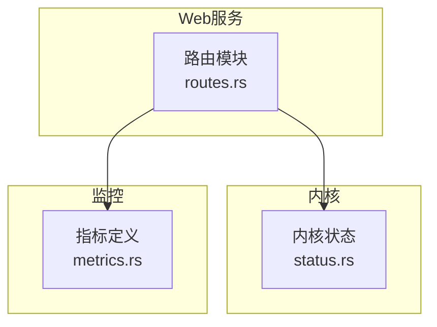
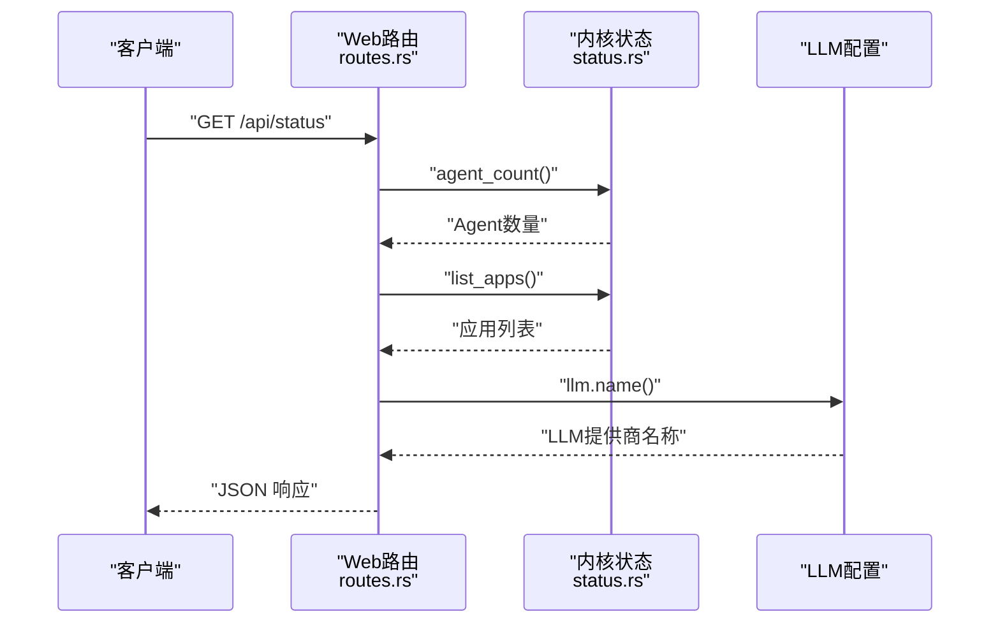
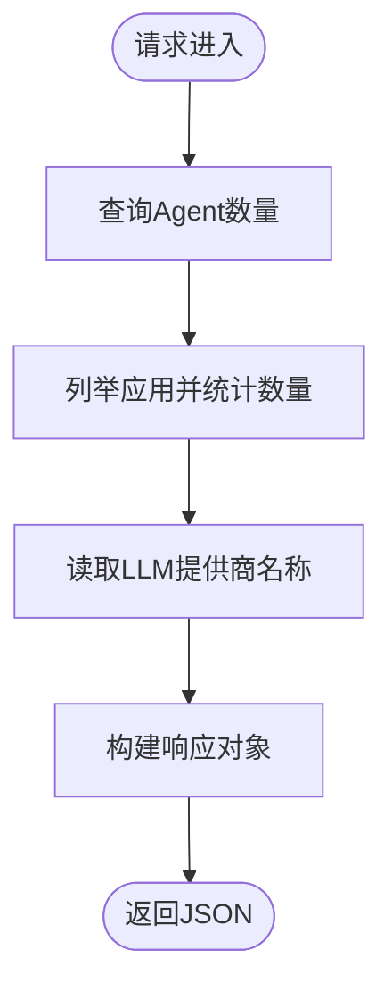
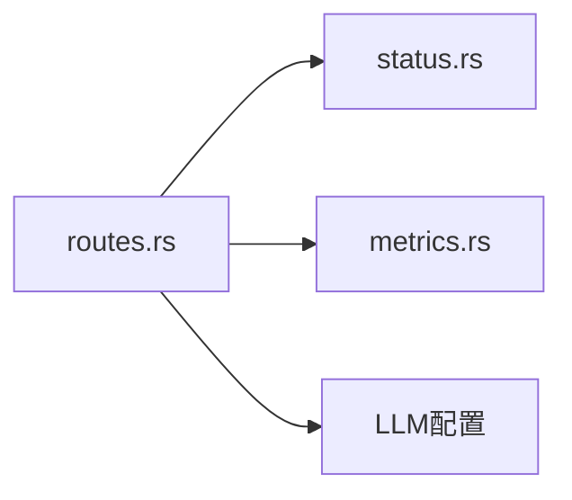

# 系统状态

<cite>
**本文引用的文件**
- [routes.rs](file://macaca/crates/macaca-web/src/routes.rs)
- [status.rs](file://macaca/crates/macaca-kernel/src/status.rs)
- [metrics.rs](file://macaca/crates/macaca-web/src/metrics.rs)
</cite>

## 目录
1. [简介](#简介)
2. [项目结构](#项目结构)
3. [核心组件](#核心组件)
4. [架构总览](#架构总览)
5. [详细组件分析](#详细组件分析)
6. [依赖关系分析](#依赖关系分析)
7. [性能考量](#性能考量)
8. [故障排查指南](#故障排查指南)
9. [结论](#结论)

## 简介
本文件为系统状态API（GET /api/status）的权威文档，面向开发者与运维人员，完整说明端点行为、响应结构、字段语义、典型状态变化以及健康检查与故障排查最佳实践。该端点用于快速获取系统当前运行态的关键指标：版本号、Agent数量、应用数量、LLM提供商名称等。

## 项目结构
与系统状态API直接相关的核心位置如下：
- Web路由层：提供HTTP端点与序列化响应
- 内核状态：暴露Agent计数与系统状态查询能力
- 指标监控：提供活跃Agent等运行时指标

图表来源
- [routes.rs](file://macaca/crates/macaca-web/src/routes.rs)
- [status.rs](file://macaca/crates/macaca-kernel/src/status.rs)
- [metrics.rs](file://macaca/crates/macaca-web/src/metrics.rs)

章节来源
- [routes.rs](file://macaca/crates/macaca-web/src/routes.rs)
- [status.rs](file://macaca/crates/macaca-kernel/src/status.rs)
- [metrics.rs](file://macaca/crates/macaca-web/src/metrics.rs)

## 核心组件
- 路由处理器：实现GET /api/status，组装并返回状态响应对象
- 状态模型：定义响应字段结构，包含版本、Agent数量、应用数量、LLM提供商
- 内核接口：提供Agent数量查询与应用列表查询能力
- 指标体系：提供活跃Agent等运行时指标，便于健康度评估

章节来源
- [routes.rs](file://macaca/crates/macaca-web/src/routes.rs)
- [status.rs](file://macaca/crates/macaca-kernel/src/status.rs)
- [metrics.rs](file://macaca/crates/macaca-web/src/metrics.rs)

## 架构总览
下图展示从HTTP请求到响应生成的调用链路，包括状态数据来源与关键依赖：

图表来源
- [routes.rs](file://macaca/crates/macaca-web/src/routes.rs)
- [status.rs](file://macaca/crates/macaca-kernel/src/status.rs)

## 详细组件分析

### 端点定义与处理流程
- 端点路径：GET /api/status
- 处理器职责：
  - 查询当前活跃Agent数量
  - 列举应用并统计应用数量
  - 获取LLM提供商名称
  - 返回统一的JSON响应体

图表来源
- [routes.rs](file://macaca/crates/macaca-web/src/routes.rs)

章节来源
- [routes.rs](file://macaca/crates/macaca-web/src/routes.rs)

### 响应模型与字段说明
响应体为一个JSON对象，包含以下字段：
- version：字符串，系统版本号
- agent_count：整数，当前活跃Agent数量
- app_count：整数，已注册/可用应用数量
- llm_provider：字符串，当前使用的LLM提供商名称

字段类型与含义
- version：来自编译时包版本信息，用于标识当前部署版本
- agent_count：通过内核接口查询，反映系统中正在运行的Agent实例数
- app_count：通过应用枚举结果长度计算，表示系统中可调度的应用总数
- llm_provider：来自LLM配置，标识当前生效的LLM服务提供商

章节来源
- [routes.rs](file://macaca/crates/macaca-web/src/routes.rs)

### 典型响应示例
- 成功响应（HTTP 200）
  - 字段：version、agent_count、app_count、llm_provider
  - 示例值：version为字符串版本号；agent_count与app_count为非负整数；llm_provider为提供商名称字符串

注意
- 当Agent或应用处于启动/停止过程中的瞬时状态时，agent_count与app_count可能在短时间内波动
- llm_provider取决于当前配置加载，若未正确初始化，可能为空或默认值

章节来源
- [routes.rs](file://macaca/crates/macaca-web/src/routes.rs)

### 状态变化与影响因素
- Agent数量变化
  - 新增/销毁Agent实例会直接影响agent_count
  - Agent重启或异常退出可能导致短暂波动
- 应用数量变化
  - 部署新应用或卸载应用会影响app_count
  - 应用加载失败或配置错误可能导致计数不增反降
- LLM提供商变化
  - 切换LLM配置或环境变量会改变llm_provider
  - LLM不可用时，系统可能回退至默认或报错，需结合日志定位

章节来源
- [routes.rs](file://macaca/crates/macaca-web/src/routes.rs)
- [status.rs](file://macaca/crates/macaca-kernel/src/status.rs)

### 与指标体系的关系
- 指标项ACTIVE_AGENTS（活跃Agent数）与响应中的agent_count保持一致，可用于外部Prometheus采集
- 其他指标如任务委托、工作进程重启次数等可用于更细粒度的健康诊断

章节来源
- [metrics.rs](file://macaca/crates/macaca-web/src/metrics.rs)

## 依赖关系分析
- 路由层依赖内核状态接口以获取Agent数量与应用列表
- 路由层依赖LLM配置以获取提供商名称
- 指标层提供独立的运行时观测维度，与HTTP端点互补

图表来源
- [routes.rs](file://macaca/crates/macaca-web/src/routes.rs)
- [status.rs](file://macaca/crates/macaca-kernel/src/status.rs)
- [metrics.rs](file://macaca/crates/macaca-web/src/metrics.rs)

章节来源
- [routes.rs](file://macaca/crates/macaca-web/src/routes.rs)
- [status.rs](file://macaca/crates/macaca-kernel/src/status.rs)
- [metrics.rs](file://macaca/crates/macaca-web/src/metrics.rs)

## 性能考量
- 端点查询为轻量级聚合操作，通常毫秒级返回
- 在高并发场景下，建议配合缓存策略或限流，避免频繁轮询造成内核压力
- 若需持续监控，优先使用指标导出（Prometheus）而非高频轮询HTTP端点

## 故障排查指南
常见问题与排查步骤
- 响应字段缺失或为空
  - 检查内核是否正常初始化（Agent与应用枚举）
  - 核对LLM配置是否正确加载
- agent_count为0但存在应用
  - 排查Agent生命周期管理与调度逻辑
  - 关注指标ACTIVE_AGENTS是否同步为0
- app_count异常
  - 检查应用清单加载与注册流程
  - 对比应用目录与配置文件一致性
- llm_provider显示异常
  - 校验环境变量与配置文件中的LLM设置
  - 查看启动日志中LLM初始化阶段的错误信息
- 健康检查建议
  - 使用GET /api/status进行周期性探测（如每30秒）
  - 结合ACTIVE_AGENTS指标与应用状态，综合判断系统健康度
  - 出现持续波动时，开启更详细的运行时日志定位根因

章节来源
- [routes.rs](file://macaca/crates/macaca-web/src/routes.rs)
- [status.rs](file://macaca/crates/macaca-kernel/src/status.rs)
- [metrics.rs](file://macaca/crates/macaca-web/src/metrics.rs)

## 结论
GET /api/status提供系统健康与资源概况的快速视图，结合指标体系可实现全面的运行时可观测性。建议在生产环境中将其纳入自动化健康检查，并与日志与指标共同使用，以便快速定位与恢复异常。