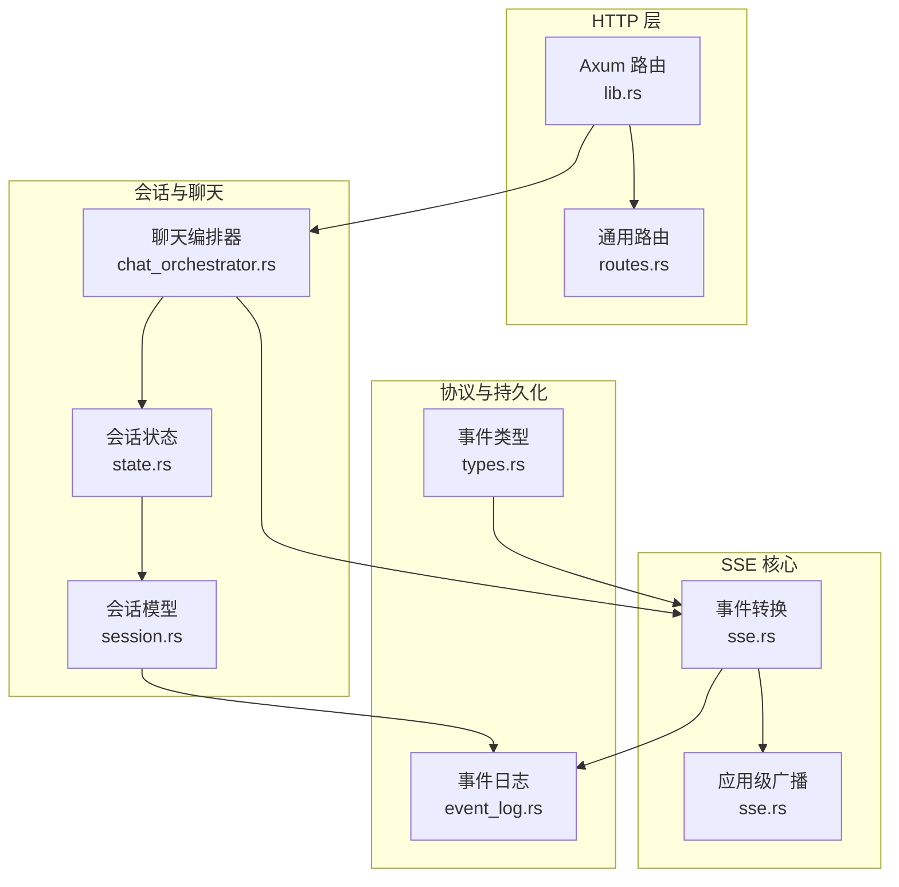
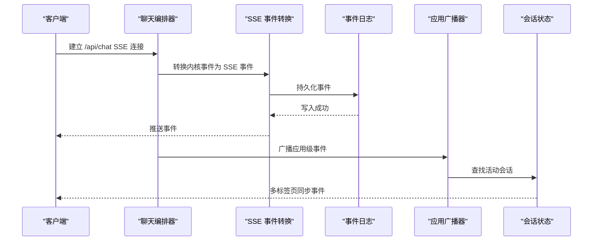
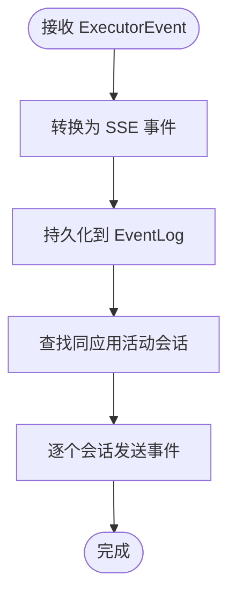
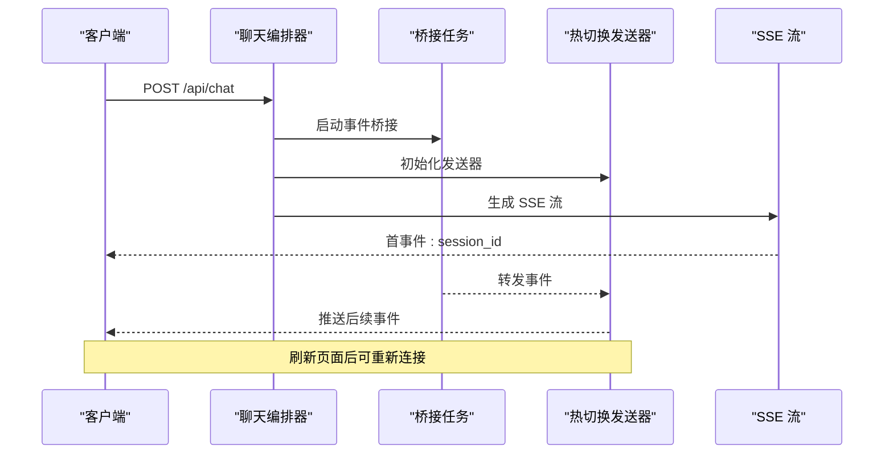
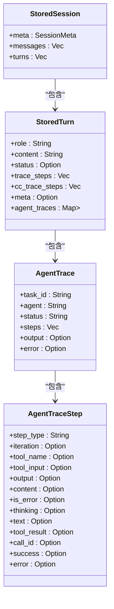
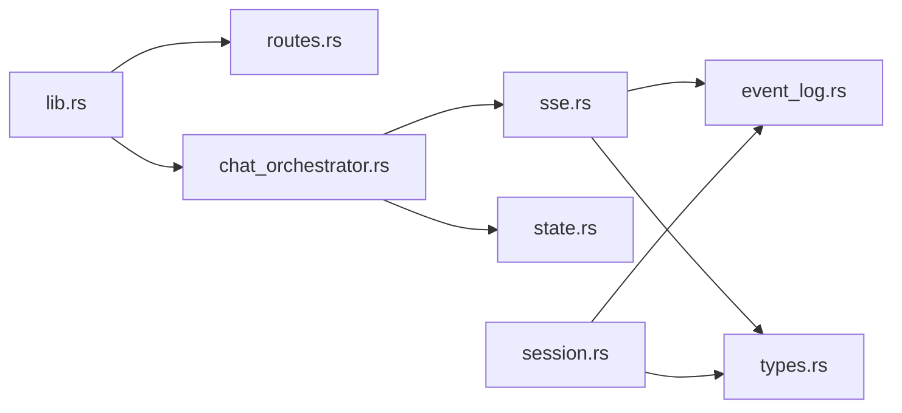

# WebSocket API

<cite>
**本文档引用的文件**
- [lib.rs](file://macaca/crates/macaca-web/src/lib.rs)
- [routes.rs](file://macaca/crates/macaca-web/src/routes.rs)
- [sse.rs](file://macaca/crates/macaca-web/src/sse.rs)
- [chat_orchestrator.rs](file://macaca/crates/macaca-web/src/chat_orchestrator.rs)
- [session.rs](file://macaca/crates/macaca-web/src/session.rs)
- [state.rs](file://macaca/crates/macaca-web/src/state.rs)
- [types.rs](file://macaca/crates/macaca-proto/src/types.rs)
- [event_log.rs](file://macaca/crates/macaca-persist/src/event_log.rs)
</cite>

## 目录
1. [简介](#简介)
2. [项目结构](#项目结构)
3. [核心组件](#核心组件)
4. [架构总览](#架构总览)
5. [详细组件分析](#详细组件分析)
6. [依赖关系分析](#依赖关系分析)
7. [性能考虑](#性能考虑)
8. [故障排除指南](#故障排除指南)
9. [结论](#结论)

## 简介
本文件系统化地文档化了基于 Axum 的 WebSocket/SSE（Server-Sent Events）实时通信接口，涵盖连接建立、消息格式与事件类型、事件推送机制、客户端连接管理、断线重连策略、错误处理与心跳机制，并提供性能优化建议。该 API 通过 SSE 将执行器事件、计划决策、任务状态等实时推送到前端，支持多标签页广播与持久化事件回放。

## 项目结构
与 WebSocket/SSE 相关的核心模块分布如下：
- 路由与入口：lib.rs（构建路由、注册 SSE 端点）、routes.rs（通用 API 路由）
- SSE 核心：sse.rs（事件转换、广播、计划决策存储）
- 会话与聊天编排：chat_orchestrator.rs（SSE 流式输出、热切换发送器、会话生命周期）
- 会话状态与持久化：session.rs（会话模型、代理追踪、事件回放）
- 全局状态：state.rs（ActiveSession、热切换 SSE 发送器）
- 协议与事件类型：types.rs（AgentExecutionEvent、RunTracePayload 等）
- 事件日志：event_log.rs（事件持久化、订阅）

图表来源
- [lib.rs:608-646](file://macaca/crates/macaca-web/src/lib.rs#L608-L646)
- [routes.rs:255-341](file://macaca/crates/macaca-web/src/routes.rs#L255-L341)
- [sse.rs:57-202](file://macaca/crates/macaca-web/src/sse.rs#L57-L202)
- [chat_orchestrator.rs:268-274](file://macaca/crates/macaca-web/src/chat_orchestrator.rs#L268-L274)
- [state.rs:35-52](file://macaca/crates/macaca-web/src/state.rs#L35-L52)
- [session.rs:484-490](file://macaca/crates/macaca-web/src/session.rs#L484-L490)
- [types.rs:822-927](file://macaca/crates/macaca-proto/src/types.rs#L822-L927)
- [event_log.rs:46-75](file://macaca/crates/macaca-persist/src/event_log.rs#L46-L75)

章节来源
- [lib.rs:608-646](file://macaca/crates/macaca-web/src/lib.rs#L608-L646)
- [routes.rs:255-341](file://macaca/crates/macaca-web/src/routes.rs#L255-L341)

## 核心组件
- SSE 事件转换器：将内核执行事件转换为前端可消费的 SSE 事件，包含任务开始、思考、工具调用、工具结果、助手内容、完成、失败、取消、进度、关闭等事件类型。
- 应用级广播器：将事件广播到同一应用下的所有活动会话，确保多标签页一致性。
- 聊天编排器：负责 SSE 流式输出、热切换发送器（支持浏览器刷新后重连）、会话生命周期管理。
- 会话状态：维护 ActiveSession、热切换 SSE 发送器、暂停/恢复信号。
- 事件持久化：EventLog 提供事件持久化与订阅，保障断线重连后事件回放能力。

章节来源
- [sse.rs:57-202](file://macaca/crates/macaca-web/src/sse.rs#L57-L202)
- [chat_orchestrator.rs:268-274](file://macaca/crates/macaca-web/src/chat_orchestrator.rs#L268-L274)
- [state.rs:35-52](file://macaca/crates/macaca-web/src/state.rs#L35-L52)
- [event_log.rs:46-75](file://macaca/crates/macaca-persist/src/event_log.rs#L46-L75)

## 架构总览
SSE 推送链路从聊天编排器开始，将内核事件转换为 SSE 事件，写入 EventLog 并通过热切换发送器推送给客户端；应用级广播器将事件同步到同一应用的所有活动会话；会话模型从 EventLog 重建代理追踪，确保断线重连后事件完整性。

图表来源
- [chat_orchestrator.rs:268-274](file://macaca/crates/macaca-web/src/chat_orchestrator.rs#L268-L274)
- [sse.rs:57-202](file://macaca/crates/macaca-web/src/sse.rs#L57-L202)
- [sse.rs:212-245](file://macaca/crates/macaca-web/src/sse.rs#L212-L245)
- [state.rs:35-52](file://macaca/crates/macaca-web/src/state.rs#L35-L52)

## 详细组件分析

### SSE 事件转换与广播
- 事件转换：将 ExecutorEvent 转换为 SSE 事件，事件类型包括 delegated_task_start、delegated_thinking、delegated_tool_call、delegated_tool_result、delegated_assistant、delegated_task_complete、delegated_task_error、delegated_task_cancelled、delegated_task_progress、executor_shutdown、hook_* 系列等。
- 应用广播：根据 ApplicationId 查找活动会话并广播事件，先持久化 EventLog 再发送，保证断线重连可见性。

图表来源
- [sse.rs:57-202](file://macaca/crates/macaca-web/src/sse.rs#L57-L202)
- [sse.rs:212-245](file://macaca/crates/macaca-web/src/sse.rs#L212-L245)

章节来源
- [sse.rs:57-202](file://macaca/crates/macaca-web/src/sse.rs#L57-L202)
- [sse.rs:212-245](file://macaca/crates/macaca-web/src/sse.rs#L212-L245)

### 聊天编排器与热切换发送器
- SSE 流式输出：将聊天请求转换为 SSE 流，首条事件携带 session_id，后续事件按顺序推送。
- 热切换发送器：使用可热替换的 mpsc::Sender，支持浏览器刷新后重新连接到同一协程循环。
- 会话生命周期：在执行前创建“运行中”会话快照，确保刷新后侧边栏可见；完成后持久化会话与代理追踪。

图表来源
- [chat_orchestrator.rs:268-274](file://macaca/crates/macaca-web/src/chat_orchestrator.rs#L268-L274)
- [chat_orchestrator.rs:2234-2258](file://macaca/crates/macaca-web/src/chat_orchestrator.rs#L2234-L2258)
- [state.rs:35-52](file://macaca/crates/macaca-web/src/state.rs#L35-L52)

章节来源
- [chat_orchestrator.rs:268-274](file://macaca/crates/macaca-web/src/chat_orchestrator.rs#L268-L274)
- [chat_orchestrator.rs:2234-2258](file://macaca/crates/macaca-web/src/chat_orchestrator.rs#L2234-L2258)
- [state.rs:35-52](file://macaca/crates/macaca-web/src/state.rs#L35-L52)

### 会话模型与事件回放
- 会话存储：使用 RedbStore 存储会话元数据与回合，支持并发写锁避免竞态。
- 代理追踪：独立存储代理追踪，避免与会话更新互相覆盖。
- 事件回放：从 EventLog 重建代理追踪，确保断线重连后事件完整性。

图表来源
- [session.rs:484-490](file://macaca/crates/macaca-web/src/session.rs#L484-L490)
- [session.rs:251-269](file://macaca/crates/macaca-web/src/session.rs#L251-L269)
- [session.rs:102-115](file://macaca/crates/macaca-web/src/session.rs#L102-L115)
- [session.rs:69-100](file://macaca/crates/macaca-web/src/session.rs#L69-L100)

章节来源
- [session.rs:484-490](file://macaca/crates/macaca-web/src/session.rs#L484-L490)
- [session.rs:251-269](file://macaca/crates/macaca-web/src/session.rs#L251-L269)
- [session.rs:102-115](file://macaca/crates/macaca-web/src/session.rs#L102-L115)
- [session.rs:69-100](file://macaca/crates/macaca-web/src/session.rs#L69-L100)

### 事件类型与消息格式
- 事件类型（SSE 事件名）：delegated_task_start、delegated_thinking、delegated_tool_call、delegated_tool_result、delegated_assistant、delegated_task_complete、delegated_task_error、delegated_task_cancelled、delegated_task_progress、executor_shutdown、hook_* 系列。
- 数据结构：事件负载包含 task_id、agent、agent_tab、event（内部 AgentExecutionEvent 结构）、success/output/error 等字段；部分事件包含 agent_tab 字段用于前端分组。
- 代理执行事件（AgentExecutionEvent）：Thinking、ToolCall、ToolResult、Assistant、CcTrace、Completed 等，携带迭代次数、工具名称与输入、输出、内容、错误标记等。

章节来源
- [sse.rs:57-202](file://macaca/crates/macaca-web/src/sse.rs#L57-L202)
- [types.rs:822-927](file://macaca/crates/macaca-proto/src/types.rs#L822-L927)

### 客户端连接管理与断线重连
- 热切换发送器：ActiveSession.sse_tx 支持在浏览器刷新后替换新的发送器，确保事件继续推送。
- 应用广播：同一应用下多标签页共享事件，广播器遍历活动会话并发送事件。
- 事件回放：EventLog 提供查询接口，客户端可通过 /api/sessions/:id/events 或 /api/sessions/:id/run-trace 获取历史事件。

章节来源
- [state.rs:35-52](file://macaca/crates/macaca-web/src/state.rs#L35-L52)
- [sse.rs:212-245](file://macaca/crates/macaca-web/src/sse.rs#L212-L245)
- [routes.rs:751-790](file://macaca/crates/macaca-web/src/routes.rs#L751-L790)

## 依赖关系分析
- 路由层：lib.rs 注册 SSE 相关路由，包括 /api/chat、/api/chat/v2、/api/sessions/stream/{session_id} 等。
- SSE 依赖：chat_orchestrator.rs 依赖 sse.rs 的事件转换与广播；依赖 state.rs 的 ActiveSession 与热切换发送器。
- 事件持久化：session.rs 与 sse.rs 依赖 event_log.rs 的持久化能力；会话模型从 EventLog 重建代理追踪。
- 协议类型：types.rs 定义 AgentExecutionEvent、RunTracePayload 等，被 SSE 转换器与会话模型使用。

图表来源
- [lib.rs:608-646](file://macaca/crates/macaca-web/src/lib.rs#L608-L646)
- [chat_orchestrator.rs:268-274](file://macaca/crates/macaca-web/src/chat_orchestrator.rs#L268-L274)
- [sse.rs:57-202](file://macaca/crates/macaca-web/src/sse.rs#L57-L202)
- [state.rs:35-52](file://macaca/crates/macaca-web/src/state.rs#L35-L52)
- [session.rs:484-490](file://macaca/crates/macaca-web/src/session.rs#L484-L490)
- [types.rs:822-927](file://macaca/crates/macaca-proto/src/types.rs#L822-L927)
- [event_log.rs:46-75](file://macaca/crates/macaca-persist/src/event_log.rs#L46-L75)

章节来源
- [lib.rs:608-646](file://macaca/crates/macaca-web/src/lib.rs#L608-L646)
- [chat_orchestrator.rs:268-274](file://macaca/crates/macaca-web/src/chat_orchestrator.rs#L268-L274)
- [sse.rs:57-202](file://macaca/crates/macaca-web/src/sse.rs#L57-L202)
- [state.rs:35-52](file://macaca/crates/macaca-web/src/state.rs#L35-L52)
- [session.rs:484-490](file://macaca/crates/macaca-web/src/session.rs#L484-L490)
- [types.rs:822-927](file://macaca/crates/macaca-proto/src/types.rs#L822-L927)
- [event_log.rs:46-75](file://macaca/crates/macaca-persist/src/event_log.rs#L46-L75)

## 性能考虑
- 心跳机制：Sse::new(stream).keep_alive(KeepAlive::default()) 默认启用心跳，保持连接活跃。
- 广播效率：应用广播前先持久化 EventLog，避免重复计算；仅对匹配会话发送事件，减少无效传输。
- 并发控制：会话快照持久化使用静态锁映射，避免并发写导致的数据竞争。
- 事件粒度：将代理追踪独立存储，避免与会话更新互相覆盖，降低写放大风险。
- 查询限制：run-trace 查询限制最大抓取量与返回量，防止过载。

章节来源
- [routes.rs:255-341](file://macaca/crates/macaca-web/src/routes.rs#L255-L341)
- [sse.rs:212-245](file://macaca/crates/macaca-web/src/sse.rs#L212-L245)
- [session.rs:317-389](file://macaca/crates/macaca-web/src/session.rs#L317-L389)
- [routes.rs:767-790](file://macaca/crates/macaca-web/src/routes.rs#L767-L790)

## 故障排除指南
- LLM 错误诊断：聊天编排器提供诊断函数，针对网络、认证、配额、请求格式、服务器错误、超时等情况给出可操作建议。
- 断线重连：使用 /api/sessions/:id/events 或 /api/sessions/:id/run-trace 按序号拉取事件，或直接重新连接 SSE 流。
- 会话状态异常：检查 ActiveSession.sse_tx 是否被正确替换；确认应用广播器是否找到匹配会话。
- 事件丢失：确认 EventLog 是否成功写入；必要时通过 EventLog 查询接口回放。

章节来源
- [chat_orchestrator.rs:38-103](file://macaca/crates/macaca-web/src/chat_orchestrator.rs#L38-L103)
- [routes.rs:751-790](file://macaca/crates/macaca-web/src/routes.rs#L751-L790)
- [state.rs:35-52](file://macaca/crates/macaca-web/src/state.rs#L35-L52)
- [sse.rs:212-245](file://macaca/crates/macaca-web/src/sse.rs#L212-L245)

## 结论
该 WebSocket/SSE API 通过事件转换、应用广播、热切换发送器与事件持久化，实现了可靠的实时状态更新流与事件推送机制。配合断线重连与心跳机制，能够在多标签页场景下保持一致的用户体验。建议在生产环境中结合心跳、限流与事件回放策略，进一步提升稳定性与性能。