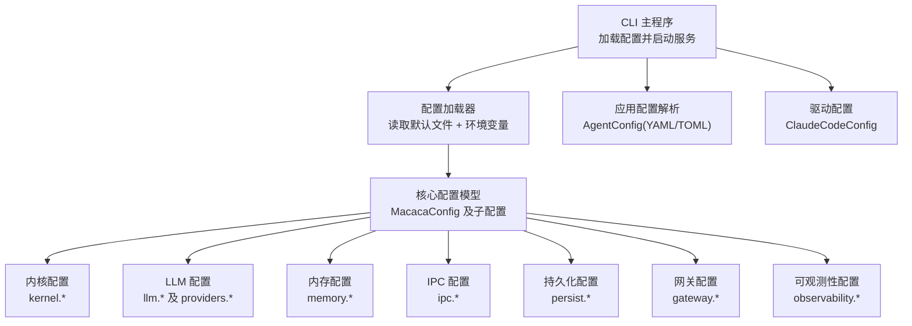
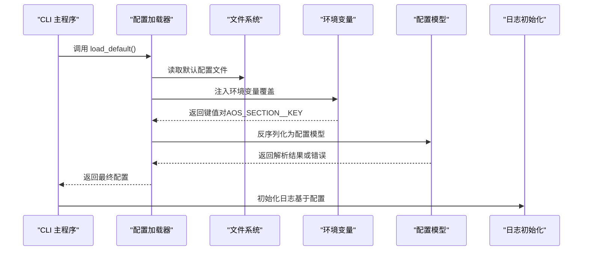
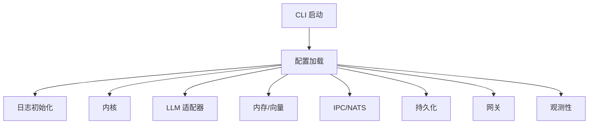

# 配置API

<cite>
**本文引用的文件**
- [default.toml](file://macaca/config/default.toml)
- [config.rs](file://macaca/crates/macaca-proto/src/config.rs)
- [error.rs](file://macaca/crates/macaca-proto/src/error.rs)
- [main.rs](file://macaca/crates/macaca-cli/src/main.rs)
- [lib.rs](file://macaca/crates/macaca-cli/src/lib.rs)
- [routes.rs](file://macaca/crates/macaca-web/src/routes.rs)
- [logging.rs](file://macaca/crates/macaca-cli/src/logging.rs)
- [config.rs](file://macaca/crates/macaca-sdk/src/config.rs)
- [config.rs](file://macaca/crates/macaca-driver-claude-code/src/config.rs)
</cite>

## 目录
1. [简介](#简介)
2. [项目结构](#项目结构)
3. [核心组件](#核心组件)
4. [架构总览](#架构总览)
5. [详细组件分析](#详细组件分析)
6. [依赖关系分析](#依赖关系分析)
7. [性能考量](#性能考量)
8. [故障排除指南](#故障排除指南)
9. [结论](#结论)
10. [附录](#附录)

## 简介
本文件为 Agent OS 的配置API文档，覆盖以下内容：
- 配置文件格式与默认值
- 环境变量与命令行参数
- 各配置项的作用、取值范围与相互依赖
- 配置加载流程与验证规则
- 配置热重载、配置验证与版本管理建议
- 配置示例、最佳实践与故障排除

## 项目结构
Agent OS 的配置体系由以下部分组成：
- 核心配置模型：定义在 proto 层的结构体，统一描述内核、内存、持久化、网关、可观测性等模块
- 默认配置文件：提供开箱即用的默认值
- 环境变量覆盖：通过统一前缀与分隔符实现键值覆盖
- 命令行入口：CLI 在启动时加载配置并初始化日志
- 应用配置：SDK 提供声明式应用配置解析（YAML/TOML）
- 驱动配置：特定驱动（如 Claude Code）的独立配置结构

图表来源
- [main.rs:33-78](file://macaca/crates/macaca-cli/src/main.rs#L33-L78)
- [config.rs:7-352](file://macaca/crates/macaca-proto/src/config.rs#L7-L352)
- [config.rs:9-152](file://macaca/crates/macaca-sdk/src/config.rs#L9-L152)
- [config.rs:23-103](file://macaca/crates/macaca-driver-claude-code/src/config.rs#L23-L103)

章节来源
- [main.rs:33-78](file://macaca/crates/macaca-cli/src/main.rs#L33-L78)
- [config.rs:7-352](file://macaca/crates/macaca-proto/src/config.rs#L7-L352)

## 核心组件
本节概述配置API的核心数据结构与默认行为。

- 核心配置模型
  - 结构：包含内核、LLM、内存、IPC、持久化、网关、可观测性、工作区等字段
  - 默认值：每个子配置类型均提供合理的默认值，确保最小可用配置
- 加载策略
  - 文件优先：从指定路径读取 TOML 文件（不存在时允许回退到默认值）
  - 环境变量覆盖：以统一前缀与双下划线分隔的键名进行覆盖
  - 解析失败：返回统一的配置错误类型
- 应用配置
  - 支持 YAML 与 TOML 两种格式
  - 包含名称、权限级别、工具许可、路径许可、网络访问、提示词模板、模型、最大token、温度等字段
  - 提供严格的校验逻辑（名称非空、权限级别合法、能力名称非空、温度范围等）

章节来源
- [config.rs:7-352](file://macaca/crates/macaca-proto/src/config.rs#L7-L352)
- [config.rs:9-152](file://macaca/crates/macaca-sdk/src/config.rs#L9-L152)
- [error.rs:3-49](file://macaca/crates/macaca-proto/src/error.rs#L3-L49)

## 架构总览
配置加载与生效的总体流程如下：

图表来源
- [main.rs:33-42](file://macaca/crates/macaca-cli/src/main.rs#L33-L42)
- [config.rs:329-351](file://macaca/crates/macaca-proto/src/config.rs#L329-L351)

章节来源
- [main.rs:33-42](file://macaca/crates/macaca-cli/src/main.rs#L33-L42)
- [config.rs:329-351](file://macaca/crates/macaca-proto/src/config.rs#L329-L351)

## 详细组件分析

### 1) 内核配置（kernel.*）
- 字段
  - max_agents：最大并发代理数
  - heartbeat_interval_ms：心跳间隔（毫秒）
  - agent_timeout_ms：代理超时时间（毫秒）
- 默认值
  - 来源于默认配置文件与模型默认实现
- 取值范围与约束
  - 正整数；心跳与超时应满足运行时稳定性要求
- 作用
  - 控制内核调度与代理生命周期
- 依赖关系
  - 与任务队列、执行器、状态机紧密耦合

章节来源
- [default.toml:1-5](file://macaca/config/default.toml#L1-L5)
- [config.rs:32-36](file://macaca/crates/macaca-proto/src/config.rs#L32-L36)
- [config.rs:257-264](file://macaca/crates/macaca-proto/src/config.rs#L257-L264)

### 2) LLM 配置（llm.* 与 providers.*）
- 字段
  - default_provider：默认提供商名称
  - default_model：默认模型（可选）
  - max_tokens_per_request：单次请求最大token
  - rate_limit_rpm：每分钟速率限制
  - providers：提供商映射，支持多提供商
- 提供商配置（示例：OpenAI、Anthropic、DashScope、MiniMax、OpenRouter 等）
  - api_key_plan：订阅/计费计划密钥（优先级高于按量密钥）
  - api_key：按量密钥（可为环境变量名，全大写）
  - base_url：提供商基础URL
  - default_model：该提供商默认模型（可选）
- 键解析规则
  - 空字符串：返回空
  - 全大写+下划线：作为环境变量名解析
  - 其他：作为字面量返回
- 默认值
  - 默认提供商与速率限制来自模型默认实现
- 取值范围与约束
  - api_key_plan 优先于 api_key
  - base_url 必须是有效的HTTP/HTTPS地址
- 作用
  - 选择与配置 LLM 提供商，决定模型调用与配额控制
- 依赖关系
  - 与 LLM 适配器、路由、限流模块集成

章节来源
- [default.toml:6-52](file://macaca/config/default.toml#L6-L52)
- [config.rs:39-62](file://macaca/crates/macaca-proto/src/config.rs#L39-L62)
- [config.rs:64-96](file://macaca/crates/macaca-proto/src/config.rs#L64-L96)
- [config.rs:257-271](file://macaca/crates/macaca-proto/src/config.rs#L257-L271)

### 3) 内存配置（memory.*）
- 字段
  - session_ttl_seconds：会话TTL（秒）
  - file_store_path：文件存储目录
  - auto_retrieve_on：自动检索触发时机（如 task_start）
  - vector：向量数据库配置
    - backend：后端类型（如 milvus）
    - milvus_url：Milvus 地址
    - collection_name：集合名称
  - embedding：嵌入配置
    - provider：嵌入提供商
    - model：嵌入模型
    - api_key：嵌入API密钥（同LLM键解析规则）
    - dimensions：嵌入维度
    - base_url：嵌入API基础URL（可选）
  - compression：压缩策略
    - enabled：是否启用
    - threshold_entries：阈值条目数
    - strategy：策略（如 llm_summarize）
- 默认值
  - 来自模型默认实现
- 取值范围与约束
  - dimensions 为正整数
  - base_url 为有效URL
- 作用
  - 管理会话记忆、文件存储、向量索引与压缩策略
- 依赖关系
  - 与向量存储、嵌入模型、文件系统、会话管理模块集成

章节来源
- [default.toml:57-78](file://macaca/config/default.toml#L57-L78)
- [config.rs:127-166](file://macaca/crates/macaca-proto/src/config.rs#L127-L166)
- [config.rs:143-159](file://macaca/crates/macaca-proto/src/config.rs#L143-L159)
- [config.rs:272-293](file://macaca/crates/macaca-proto/src/config.rs#L272-L293)

### 4) IPC 配置（ipc.*）
- 字段
  - nats_url：NATS 地址
  - nats_auto_start：是否自动启动
  - reconnect_max_attempts：最大重连次数
  - reconnect_delay_ms：重连延迟（毫秒）
- 默认值
  - 来自模型默认实现
- 取值范围与约束
  - 重连次数与延迟为非负整数
- 作用
  - 控制进程间通信与消息总线连接策略
- 依赖关系
  - 与内核调度、任务分发、事件总线集成

章节来源
- [default.toml:79-84](file://macaca/config/default.toml#L79-L84)
- [config.rs:169-174](file://macaca/crates/macaca-proto/src/config.rs#L169-L174)
- [config.rs:294-299](file://macaca/crates/macaca-proto/src/config.rs#L294-L299)

### 5) 持久化配置（persist.*）
- 字段
  - engine：持久化引擎（如 redb）
  - data_dir：数据目录
  - snapshot_interval_seconds：快照间隔（秒）
- 默认值
  - 来自模型默认实现
- 取值范围与约束
  - 目录需存在且可写
- 作用
  - 控制事件日志、检查点、状态快照的存储策略
- 依赖关系
  - 与事件日志、检查点、内核状态管理集成

章节来源
- [default.toml:88-92](file://macaca/config/default.toml#L88-L92)
- [config.rs:177-181](file://macaca/crates/macaca-proto/src/config.rs#L177-L181)
- [config.rs:300-304](file://macaca/crates/macaca-proto/src/config.rs#L300-L304)

### 6) 网关配置（gateway.*）
- 字段
  - enabled：是否启用
  - telegram：Telegram 配置
    - enabled：启用
    - bot_token_env：机器人令牌环境变量名
    - allowed_user_ids：允许的用户ID列表
  - discord：Discord 配置
    - enabled：启用
    - bot_token_env：机器人令牌环境变量名
    - command_prefix：命令前缀
- 默认值
  - Telegram 与 Discord 均启用，令牌来自环境变量
- 取值范围与约束
  - 令牌环境变量必须设置
- 作用
  - 启用并配置外部通讯网关
- 依赖关系
  - 与适配器、事件处理、权限控制集成

章节来源
- [default.toml:93-105](file://macaca/config/default.toml#L93-L105)
- [config.rs:184-202](file://macaca/crates/macaca-proto/src/config.rs#L184-L202)
- [config.rs:305-317](file://macaca/crates/macaca-proto/src/config.rs#L305-L317)

### 7) 观测性配置（observability.*）
- 字段
  - log_level：日志级别
  - tracing_enabled：是否启用链路追踪
  - otlp_endpoint：OTLP 上报端点（可选）
  - log_file：文件日志配置
    - enabled：启用
    - dir：日志目录
    - prefix：文件前缀
    - format：格式（json/text）
    - retention_days：保留天数
    - compress：是否压缩
- 默认值
  - 文件日志默认启用，目录、前缀、格式、保留天数、压缩均有默认值
- 取值范围与约束
  - format 为 "json" 或 "text"
- 作用
  - 控制日志输出、文件轮转与保留策略
- 依赖关系
  - 与日志初始化、清理任务集成

章节来源
- [default.toml:106-119](file://macaca/config/default.toml#L106-L119)
- [config.rs:205-255](file://macaca/crates/macaca-proto/src/config.rs#L205-L255)
- [logging.rs:214-255](file://macaca/crates/macaca-cli/src/logging.rs#L214-L255)

### 8) 工作区配置（workspace.*）
- 字段
  - root_dir：工作区根目录
- 默认值
  - 来自模型默认实现
- 作用
  - 定义应用与代理的工作空间位置
- 依赖关系
  - 与应用加载、代理注册、文件系统访问集成

章节来源
- [config.rs:21-29](file://macaca/crates/macaca-proto/src/config.rs#L21-L29)
- [config.rs:324-325](file://macaca/crates/macaca-proto/src/config.rs#L324-L325)

### 9) 应用配置（AgentConfig，YAML/TOML）
- 字段
  - name：代理名称（必填）
  - capabilities：能力列表（name/description）
  - permission_level：权限级别（system/user，默认 user）
  - allowed_tools：允许的工具列表
  - allowed_paths：允许的路径列表
  - network_access：是否允许网络访问
  - prompt_template：提示词模板
  - model：首选模型
  - max_tokens：最大token（可选）
  - temperature：采样温度（0.0~2.0）
  - persona_dir：人物档案目录（可选）
- 校验规则
  - name 非空
  - permission_level 为 "system" 或 "user"
  - capabilities 中 name 非空
  - temperature 范围 [0.0, 2.0]
- 作用
  - 声明式定义代理的行为边界与能力
- 依赖关系
  - 与代理构建器、注册API、内核集成

章节来源
- [config.rs:9-152](file://macaca/crates/macaca-sdk/src/config.rs#L9-L152)

### 10) 驱动配置（ClaudeCodeConfig）
- 字段
  - claude_bin：claude CLI 二进制路径（默认 "claude"）
  - work_dir：工作目录
  - model：模型（可选）
  - allowed_tools：允许工具列表
  - max_turns：最大对话轮数（可选）
  - system_prompt：注入系统提示（可选）
  - permission_mode：权限模式（Default/DangerouslySkipPermissions）
  - timeout_secs：单次调用超时（秒，默认 300）
- 默认值
  - 来自模型默认实现
- 作用
  - 配置 Claude Code 驱动的执行行为
- 依赖关系
  - 与驱动框架、工具集、执行器集成

章节来源
- [config.rs:23-103](file://macaca/crates/macaca-driver-claude-code/src/config.rs#L23-L103)

## 依赖关系分析
- 配置加载依赖
  - CLI 在启动时加载配置并初始化日志
  - 配置加载器依赖文件系统与环境变量
  - 日志清理依赖日期与时长配置
- 组件耦合
  - 内核配置影响任务调度与资源占用
  - LLM 配置影响模型调用与成本控制
  - 内存配置影响检索与存储性能
  - 网关配置影响外部交互与安全
  - 观测性配置影响运维与排障效率

图表来源
- [main.rs:33-78](file://macaca/crates/macaca-cli/src/main.rs#L33-L78)
- [config.rs:329-351](file://macaca/crates/macaca-proto/src/config.rs#L329-L351)

章节来源
- [main.rs:33-78](file://macaca/crates/macaca-cli/src/main.rs#L33-L78)
- [config.rs:329-351](file://macaca/crates/macaca-proto/src/config.rs#L329-L351)

## 性能考量
- LLM 请求上限
  - 合理设置 max_tokens_per_request 与 rate_limit_rpm，避免突发流量导致限流或超时
- 内存与向量
  - 适当调整 session_ttl_seconds 与压缩阈值，平衡检索精度与存储成本
- IPC 连接
  - 在 NATS 连接失败时，合理设置重试次数与延迟，避免频繁重建连接
- 日志轮转
  - 设置合适的保留天数与压缩策略，减少磁盘占用与IO压力

## 故障排除指南
- 配置加载失败
  - 检查配置文件路径是否存在，确认文件格式正确
  - 确认环境变量覆盖键名格式为 AOS_SECTION__KEY
- LLM 密钥问题
  - api_key_plan 与 api_key 的优先级与解析规则：全大写视为环境变量名
  - 若环境变量未设置，解析会报错
- 温度参数越界
  - temperature 必须在 [0.0, 2.0] 范围内
- 网关令牌缺失
  - Telegram/Discord 的 bot_token_env 必须设置
- 日志文件异常
  - 检查日志目录可写、保留天数与压缩策略配置

章节来源
- [error.rs:23-24](file://macaca/crates/macaca-proto/src/error.rs#L23-L24)
- [config.rs:110-143](file://macaca/crates/macaca-sdk/src/config.rs#L110-L143)
- [config.rs:64-96](file://macaca/crates/macaca-proto/src/config.rs#L64-L96)

## 结论
本配置API文档提供了 Agent OS 的配置全貌，包括文件格式、环境变量覆盖、默认值、验证规则与依赖关系。通过统一的加载与校验机制，系统能够在不同环境下稳定运行，并为运维与开发提供清晰的配置边界与排障路径。

## 附录

### A. 配置文件格式与默认值
- 默认配置文件位置：config/default.toml
- 默认值来源：模型默认实现与文件默认值共同构成
- 示例参考路径：
  - [默认配置示例:1-119](file://macaca/config/default.toml#L1-L119)
  - [核心配置模型默认值:257-327](file://macaca/crates/macaca-proto/src/config.rs#L257-L327)

章节来源
- [default.toml:1-119](file://macaca/config/default.toml#L1-L119)
- [config.rs:257-327](file://macaca/crates/macaca-proto/src/config.rs#L257-L327)

### B. 环境变量与命令行参数
- 环境变量覆盖
  - 前缀：AOS
  - 分隔符：双下划线（SECTION__KEY）
  - 示例：AOS_KERNEL__MAX_AGENTS
- 命令行参数
  - CLI 子命令：run、agents、status、version、web --port
  - web 子命令支持端口参数

章节来源
- [config.rs:332-346](file://macaca/crates/macaca-proto/src/config.rs#L332-L346)
- [main.rs:16-31](file://macaca/crates/macaca-cli/src/main.rs#L16-L31)

### C. 配置验证与错误类型
- 统一错误类型：MacacaError::Config
- 验证场景
  - 配置文件解析失败
  - 应用配置字段校验失败
  - LLM 密钥解析失败（环境变量未设置）

章节来源
- [error.rs:23-24](file://macaca/crates/macaca-proto/src/error.rs#L23-L24)
- [config.rs:110-143](file://macaca/crates/macaca-sdk/src/config.rs#L110-L143)
- [config.rs:64-96](file://macaca/crates/macaca-proto/src/config.rs#L64-L96)

### D. 配置热重载
- 应用层热重载
  - Web 接口提供应用重载能力，可用于重新发现与加载应用
- 配置层热重载
  - 当前实现未提供全局配置热重载；建议通过重启服务或在上层编排中实现平滑切换

章节来源
- [routes.rs:344-363](file://macaca/crates/macaca-web/src/routes.rs#L344-L363)

### E. 版本管理与迁移
- 版本标识：CLI 输出包含版本信息
- 配置迁移建议
  - 新增字段采用可选与默认值策略
  - 对不兼容变更提供迁移脚本或升级指引

章节来源
- [main.rs:50-53](file://macaca/crates/macaca-cli/src/main.rs#L50-L53)