# Agent执行循环

<cite>
**本文档引用的文件**
- [agentic_loop.rs](file://macaca/crates/macaca-runtime/src/agentic_loop.rs)
- [context_window.rs](file://macaca/crates/macaca-runtime/src/context_window.rs)
- [loop_detector.rs](file://macaca/crates/macaca-runtime/src/loop_detector.rs)
- [react_agent.rs](file://macaca/crates/macaca-framework/src/react_agent.rs)
- [agent.rs](file://macaca/crates/macaca-framework/src/agent.rs)
- [tool.rs](file://macaca/crates/macaca-framework/src/tool.rs)
- [memory.rs](file://macaca/crates/macaca-framework/src/memory.rs)
- [message.rs](file://macaca/crates/macaca-framework/src/message.rs)
- [model.rs](file://macaca/crates/macaca-framework/src/model.rs)
- [formatter.rs](file://macaca/crates/macaca-framework/src/formatter.rs)
- [pipeline.rs](file://macaca/crates/macaca-framework/src/pipeline.rs)
- [plan.rs](file://macaca/crates/macaca-framework/src/plan.rs)
- [session.rs](file://macaca/crates/macaca-framework/src/session.rs)
</cite>

## 目录
1. [引言](#引言)
2. [项目结构](#项目结构)
3. [核心组件](#核心组件)
4. [架构总览](#架构总览)
5. [详细组件分析](#详细组件分析)
6. [依赖关系分析](#依赖关系分析)
7. [性能考虑](#性能考虑)
8. [故障排查指南](#故障排查指南)
9. [结论](#结论)
10. [附录](#附录)

## 引言
本文件系统性阐述Agent执行循环（Agentic Loop）的设计与实现，覆盖从LLM调用、工具执行、上下文管理到状态更新的完整流程；解释循环控制、错误处理、超时管理与资源清理；详解上下文窗口管理策略（历史消息截断、token估算与内存优化）；解析React Agent的思考-行动循环范式；并提供可操作的配置选项、性能优化建议与调试方法。

## 项目结构
围绕Agent执行循环的关键模块分布于runtime与framework两大子系统：
- runtime：提供通用的执行循环、上下文窗口管理、循环检测与暂停/恢复能力
- framework：提供Agent抽象、ReAct实现、消息模型、工具系统、工作记忆、计划笔记本、会话持久化等

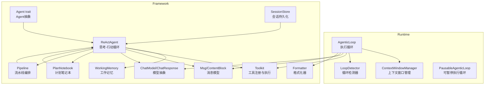

图表来源
- [agentic_loop.rs:65-715](file://macaca/crates/macaca-runtime/src/agentic_loop.rs#L65-L715)
- [context_window.rs:29-123](file://macaca/crates/macaca-runtime/src/context_window.rs#L29-L123)
- [loop_detector.rs:40-109](file://macaca/crates/macaca-runtime/src/loop_detector.rs#L40-L109)
- [react_agent.rs:37-285](file://macaca/crates/macaca-framework/src/react_agent.rs#L37-L285)
- [agent.rs:31-67](file://macaca/crates/macaca-framework/src/agent.rs#L31-L67)
- [tool.rs:197-402](file://macaca/crates/macaca-framework/src/tool.rs#L197-L402)
- [memory.rs:45-84](file://macaca/crates/macaca-framework/src/memory.rs#L45-L84)
- [message.rs:238-335](file://macaca/crates/macaca-framework/src/message.rs#L238-L335)
- [model.rs:143-156](file://macaca/crates/macaca-framework/src/model.rs#L143-L156)
- [formatter.rs:35-45](file://macaca/crates/macaca-framework/src/formatter.rs#L35-L45)
- [pipeline.rs:20-25](file://macaca/crates/macaca-framework/src/pipeline.rs#L20-L25)
- [plan.rs:297-437](file://macaca/crates/macaca-framework/src/plan.rs#L297-L437)
- [session.rs:18-28](file://macaca/crates/macaca-framework/src/session.rs#L18-L28)

章节来源
- [agentic_loop.rs:1-1094](file://macaca/crates/macaca-runtime/src/agentic_loop.rs#L1-L1094)
- [context_window.rs:1-252](file://macaca/crates/macaca-runtime/src/context_window.rs#L1-L252)
- [loop_detector.rs:1-174](file://macaca/crates/macaca-runtime/src/loop_detector.rs#L1-L174)
- [react_agent.rs:1-917](file://macaca/crates/macaca-framework/src/react_agent.rs#L1-L917)
- [agent.rs:1-673](file://macaca/crates/macaca-framework/src/agent.rs#L1-L673)
- [tool.rs:1-996](file://macaca/crates/macaca-framework/src/tool.rs#L1-L996)
- [memory.rs:1-1275](file://macaca/crates/macaca-framework/src/memory.rs#L1-L1275)
- [message.rs:1-622](file://macaca/crates/macaca-framework/src/message.rs#L1-L622)
- [model.rs:1-270](file://macaca/crates/macaca-framework/src/model.rs#L1-L270)
- [formatter.rs:1-1300](file://macaca/crates/macaca-framework/src/formatter.rs#L1-L1300)
- [pipeline.rs:1-722](file://macaca/crates/macaca-framework/src/pipeline.rs#L1-L722)
- [plan.rs:1-911](file://macaca/crates/macaca-framework/src/plan.rs#L1-L911)
- [session.rs:1-340](file://macaca/crates/macaca-framework/src/session.rs#L1-L340)

## 核心组件
- 执行循环（AgenticLoop）
  - 驱动LLM → 工具 → LLM的循环，直至模型返回最终文本或达到迭代上限
  - 支持事件回调、令牌用量统计、权限检查与工具超时
- 上下文窗口管理（ContextWindowManager）
  - 基于token估算与阈值触发的历史消息截断，保留系统提示与最近对话对
- 循环检测器（LoopDetector）
  - 检测重复工具调用，发出警告并在必要时终止循环以防止死循环
- React Agent（ReActAgent）
  - 实现“思考-行动-观察”循环，结合工作记忆与工具集进行多轮推理与执行
- 工具系统（Toolkit）
  - 注册、中间件链、分组激活/禁用、预设参数合并与执行
- 工作记忆（WorkingMemory）
  - 带标签过滤、删除、标记更新、摘要压缩与序列化
- 消息与内容块（Msg/ContentBlock）
  - 统一的消息载体，支持文本、工具调用/结果、图像/音频/视频等多模态
- 模型抽象（ChatModel/ChatResponse）
  - 统一的模型接口与响应结构，支持令牌用量统计
- 格式化器（Formatter）
  - 将框架消息转换为各提供商的请求格式，并解析响应
- 流水线（Pipeline）
  - 顺序、并行广播与消息枢纽等编排模式
- 计划笔记本（PlanNotebook）
  - 子任务分解、进度跟踪与提示生成
- 会话持久化（SessionStore）
  - 跨会话保存与恢复Agent状态

章节来源
- [agentic_loop.rs:22-51](file://macaca/crates/macaca-runtime/src/agentic_loop.rs#L22-L51)
- [context_window.rs:8-27](file://macaca/crates/macaca-runtime/src/context_window.rs#L8-L27)
- [loop_detector.rs:9-38](file://macaca/crates/macaca-runtime/src/loop_detector.rs#L9-L38)
- [react_agent.rs:26-50](file://macaca/crates/macaca-framework/src/react_agent.rs#L26-L50)
- [tool.rs:197-402](file://macaca/crates/macaca-framework/src/tool.rs#L197-L402)
- [memory.rs:45-84](file://macaca/crates/macaca-framework/src/memory.rs#L45-L84)
- [message.rs:20-107](file://macaca/crates/macaca-framework/src/message.rs#L20-L107)
- [model.rs:12-78](file://macaca/crates/macaca-framework/src/model.rs#L12-L78)
- [formatter.rs:35-45](file://macaca/crates/macaca-framework/src/formatter.rs#L35-L45)
- [pipeline.rs:20-25](file://macaca/crates/macaca-framework/src/pipeline.rs#L20-L25)
- [plan.rs:297-437](file://macaca/crates/macaca-framework/src/plan.rs#L297-L437)
- [session.rs:18-28](file://macaca/crates/macaca-framework/src/session.rs#L18-L28)

## 架构总览
下图展示执行循环在runtime与framework之间的协作关系，以及与工具、模型、格式化器、上下文与循环检测的交互。

```mermaid
sequenceDiagram
participant User as "用户"
participant Loop as "AgenticLoop"
participant Ctx as "ContextWindowManager"
participant LLM as "ChatModel"
participant Fmt as "Formatter"
participant Tools as "Toolkit"
participant Detector as "LoopDetector"
User->>Loop : "开始执行循环"
Loop->>Ctx : "根据阈值估算并裁剪历史"
Ctx-->>Loop : "返回裁剪后的消息列表"
Loop->>Fmt : "格式化消息"
Fmt-->>Loop : "提供者特定消息数组"
Loop->>LLM : "chat(消息, 选项)"
LLM-->>Loop : "ChatResponse(文本/工具调用, 用量)"
alt "包含工具调用"
Loop->>Detector : "记录工具调用指纹"
Detector-->>Loop : "继续/警告/终止"
Loop->>Tools : "执行工具(带超时与权限检查)"
Tools-->>Loop : "工具结果(JSON/文本)"
Loop->>Loop : "追加工具结果到消息"
else "无工具调用"
Loop-->>User : "返回最终文本"
end
Loop->>Loop : "累计令牌用量/迭代计数"
```

图表来源
- [agentic_loop.rs:79-201](file://macaca/crates/macaca-runtime/src/agentic_loop.rs#L79-L201)
- [context_window.rs:68-122](file://macaca/crates/macaca-runtime/src/context_window.rs#L68-L122)
- [formatter.rs:35-45](file://macaca/crates/macaca-framework/src/formatter.rs#L35-L45)
- [model.rs:143-156](file://macaca/crates/macaca-framework/src/model.rs#L143-L156)
- [tool.rs:314-371](file://macaca/crates/macaca-framework/src/tool.rs#L314-L371)
- [loop_detector.rs:61-93](file://macaca/crates/macaca-runtime/src/loop_detector.rs#L61-L93)

## 详细组件分析

### 执行循环（AgenticLoop）设计与实现
- 迭代控制
  - 通过最大迭代次数限制避免无限循环；每次迭代记录令牌用量与迭代次数
- LLM调用与事件流
  - 在每次迭代前发送“思考”事件；若返回文本内容则发送“助手”事件
  - 将响应内容与工具调用合并入消息历史
- 工具执行与权限
  - 对每个工具调用执行权限检查（路径/网络访问等），并以超时保护执行
  - 支持事件通道实时转发Trace事件（如Claude Code执行的中间状态）
- 循环检测
  - 基于工具名+参数的SHA-256指纹滑动窗口，超过阈值发出警告，超过上限强制终止
- 可暂停执行循环（PausableAgenticLoop）
  - 提供原子信号与通知机制，支持外部钩子恢复；恢复时注入用户消息携带原因

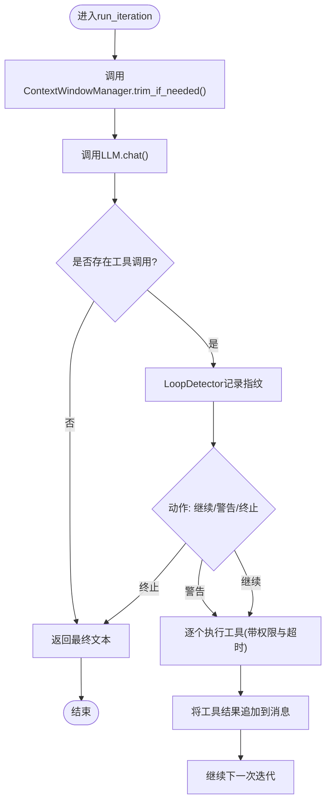

图表来源
- [agentic_loop.rs:79-201](file://macaca/crates/macaca-runtime/src/agentic_loop.rs#L79-L201)
- [loop_detector.rs:61-93](file://macaca/crates/macaca-runtime/src/loop_detector.rs#L61-L93)

章节来源
- [agentic_loop.rs:69-715](file://macaca/crates/macaca-runtime/src/agentic_loop.rs#L69-L715)

### 上下文窗口管理（ContextWindowManager）
- 估算策略
  - 基于字符数的启发式估算（ASCII约4字符/token，CJK约1.5字符/Token），并附加角色元数据开销
- 截断策略
  - 保留首条系统消息（若存在）、尾部N对消息（默认5对），中间部分替换为摘要占位消息
  - 当消息总数小于等于3或未超过阈值时不做截断
- 配置项
  - 最大token、截断阈值比例、保留最近消息对数

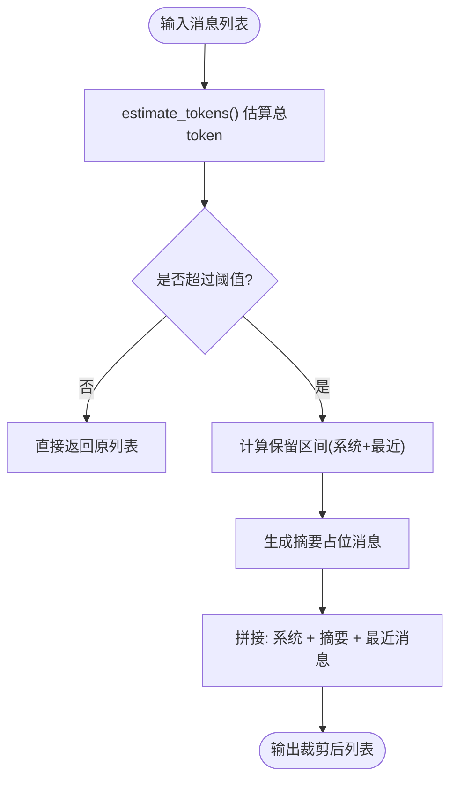

图表来源
- [context_window.rs:39-122](file://macaca/crates/macaca-runtime/src/context_window.rs#L39-L122)

章节来源
- [context_window.rs:8-123](file://macaca/crates/macaca-runtime/src/context_window.rs#L8-L123)

### 循环检测器（LoopDetector）
- 滑动窗口与连续重复计数
  - 维护固定大小的指纹队列与连续相同计数
- 触发条件
  - 达到重复阈值发出警告；达到最大重复次数强制终止
- 重置与哈希
  - 提供reset接口；使用SHA-256对“工具名|参数字符串”进行指纹化

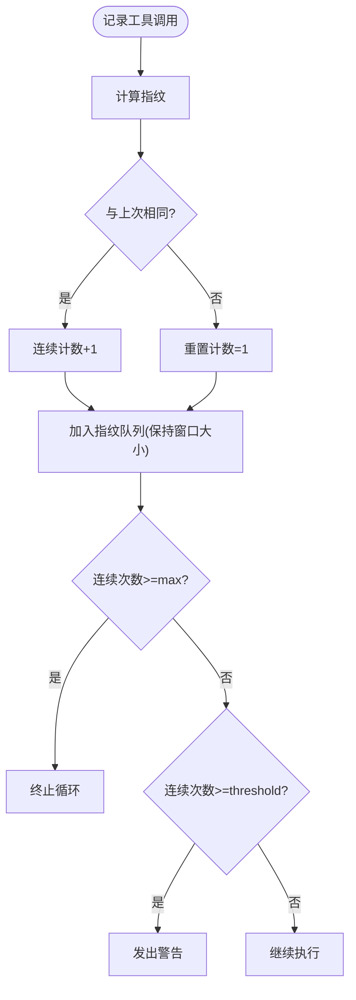

图表来源
- [loop_detector.rs:61-93](file://macaca/crates/macaca-runtime/src/loop_detector.rs#L61-L93)

章节来源
- [loop_detector.rs:9-109](file://macaca/crates/macaca-runtime/src/loop_detector.rs#L9-L109)

### React Agent（ReAct）实现模式
- 思考阶段
  - 从工作记忆获取上下文（含摘要），格式化为提供商消息，调用模型获得响应
  - 将助手响应写入记忆
- 行动阶段
  - 解析响应中的工具调用，逐一执行并把结果写回记忆
- 终止条件
  - 若无工具调用，则返回最后的助手消息作为回复
  - 若达到最大迭代次数仍未终止，返回最后一条助手消息
- 中断与压缩
  - 支持取消令牌中断；可选自动压缩工作记忆以降低token占用

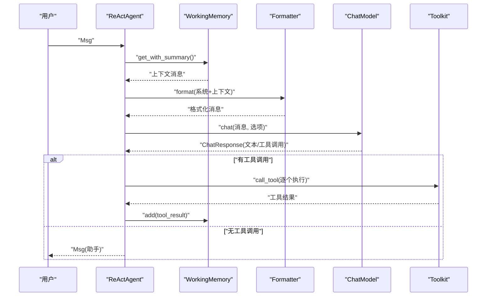

图表来源
- [react_agent.rs:117-265](file://macaca/crates/macaca-framework/src/react_agent.rs#L117-L265)
- [memory.rs:79-84](file://macaca/crates/macaca-framework/src/memory.rs#L79-L84)
- [formatter.rs:35-45](file://macaca/crates/macaca-framework/src/formatter.rs#L35-L45)
- [model.rs:143-156](file://macaca/crates/macaca-framework/src/model.rs#L143-L156)
- [tool.rs:314-371](file://macaca/crates/macaca-framework/src/tool.rs#L314-L371)

章节来源
- [react_agent.rs:26-285](file://macaca/crates/macaca-framework/src/react_agent.rs#L26-L285)

### 工具系统（Toolkit）与中间件
- 注册与查找
  - 注册工具处理器，按组管理；调用时校验组激活状态
- 预设参数与调用参数合并
  - 预设参数优先级低于调用方传入参数（后者覆盖冲突键）
- 中间件链
  - before/after钩子按插入顺序执行，支持日志、限流、鉴权等横切关注点
- 定义导出
  - 仅导出激活组内的工具定义，供LLM选择调用

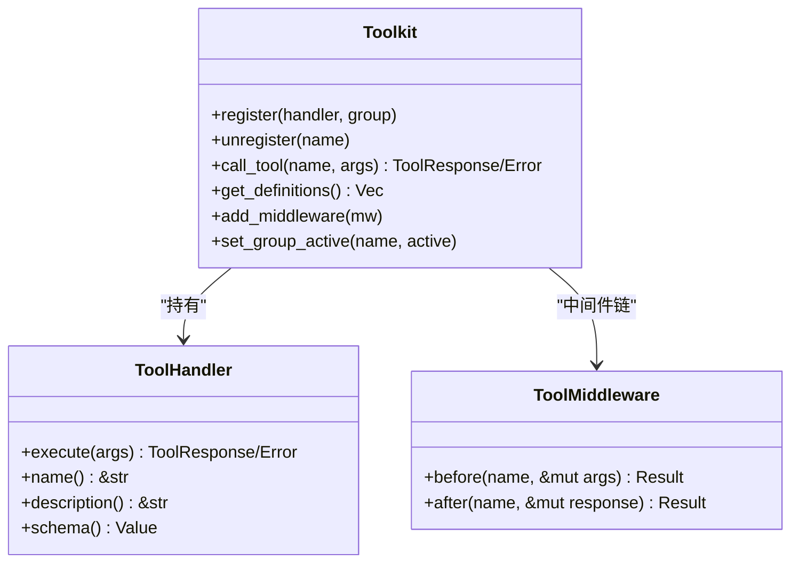

图表来源
- [tool.rs:197-402](file://macaca/crates/macaca-framework/src/tool.rs#L197-L402)

章节来源
- [tool.rs:197-402](file://macaca/crates/macaca-framework/src/tool.rs#L197-L402)

### 工作记忆（WorkingMemory）与压缩
- 标签化存储
  - 支持按标签检索、删除、批量标记更新
- 摘要压缩
  - 当token估算超过阈值时，将旧消息压缩为摘要，保留最近若干条消息
- 序列化
  - 实现StateModule，支持跨会话持久化

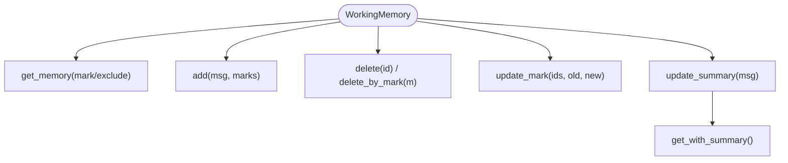

图表来源
- [memory.rs:45-177](file://macaca/crates/macaca-framework/src/memory.rs#L45-L177)

章节来源
- [memory.rs:45-575](file://macaca/crates/macaca-framework/src/memory.rs#L45-L575)

### 消息模型与格式化器
- 消息内容块
  - 文本、思考、工具调用/结果、图像/音频/视频等多模态内容块
- 格式化器
  - OpenAI/DashScope/Anthropic三种格式适配，负责消息序列化与响应解析

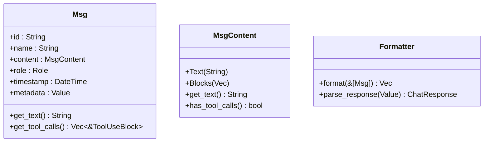

图表来源
- [message.rs:238-335](file://macaca/crates/macaca-framework/src/message.rs#L238-L335)
- [formatter.rs:35-45](file://macaca/crates/macaca-framework/src/formatter.rs#L35-L45)

章节来源
- [message.rs:20-335](file://macaca/crates/macaca-framework/src/message.rs#L20-L335)
- [formatter.rs:35-541](file://macaca/crates/macaca-framework/src/formatter.rs#L35-L541)

### 模型抽象与流水线编排
- ChatModel
  - 统一的异步聊天接口，返回ChatResponse与令牌用量
- Pipeline
  - Sequential/Fanout/MsgHub三种编排模式，支持并发与广播

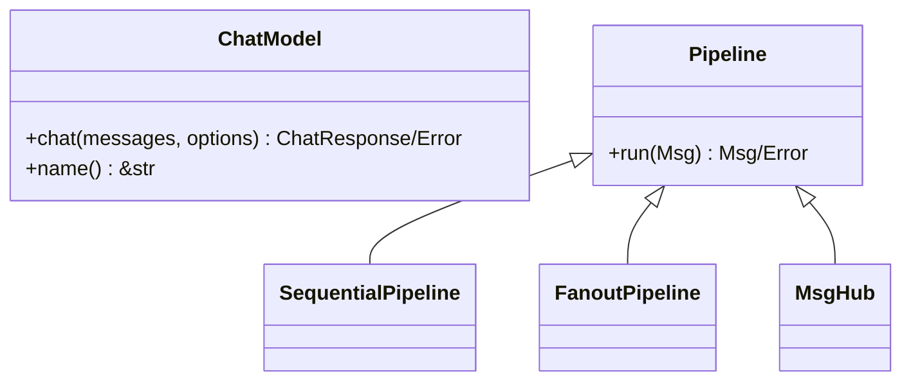

图表来源
- [model.rs:143-156](file://macaca/crates/macaca-framework/src/model.rs#L143-L156)
- [pipeline.rs:20-202](file://macaca/crates/macaca-framework/src/pipeline.rs#L20-L202)

章节来源
- [model.rs:12-270](file://macaca/crates/macaca-framework/src/model.rs#L12-L270)
- [pipeline.rs:20-202](file://macaca/crates/macaca-framework/src/pipeline.rs#L20-L202)

### 计划笔记本（PlanNotebook）
- 子任务生命周期
  - Todo → InProgress → Done/Abandoned，单实例约束
- 自动推进
  - 完成当前子任务后自动启动下一个Todo子任务
- 提示生成
  - 根据当前计划状态生成系统提示，引导下一步行动

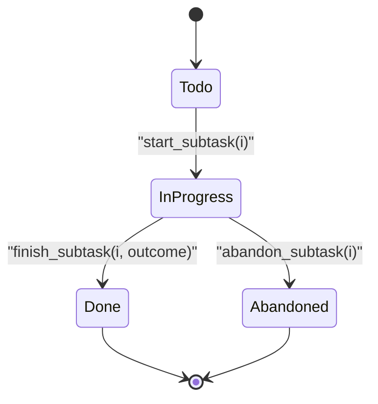

图表来源
- [plan.rs:194-291](file://macaca/crates/macaca-framework/src/plan.rs#L194-L291)

章节来源
- [plan.rs:297-437](file://macaca/crates/macaca-framework/src/plan.rs#L297-L437)

### 会话持久化（SessionStore）
- 存储接口
  - 保存/加载/删除会话，列出所有会话ID
- 内存实现
  - 分片锁提升并发性能；按会话前缀删除与枚举

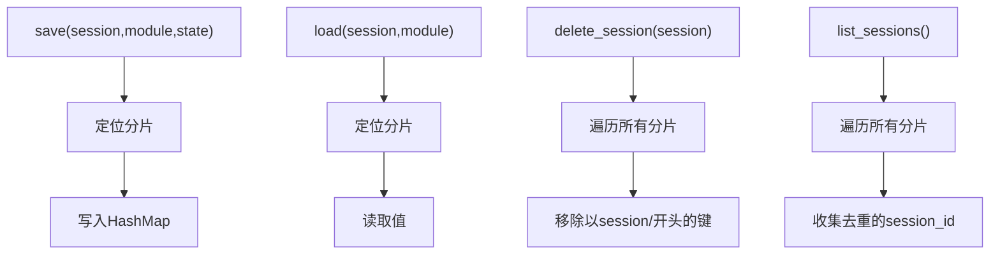

图表来源
- [session.rs:61-95](file://macaca/crates/macaca-framework/src/session.rs#L61-L95)

章节来源
- [session.rs:18-121](file://macaca/crates/macaca-framework/src/session.rs#L18-L121)

## 依赖关系分析
- 执行循环依赖
  - 上下文窗口管理：在每次LLM调用前进行token估算与裁剪
  - 循环检测器：在工具调用前后记录指纹，决定继续/警告/终止
  - 工具系统：执行工具调用，支持权限检查与超时
  - 模型抽象与格式化器：统一消息格式与响应解析
- React Agent依赖
  - 工作记忆：承载上下文与摘要
  - 工具系统：执行工具
  - 模型抽象与格式化器：与LLM交互
  - 计划笔记本：提供子任务分解与提示
  - 流水线：与其他Agent组合编排

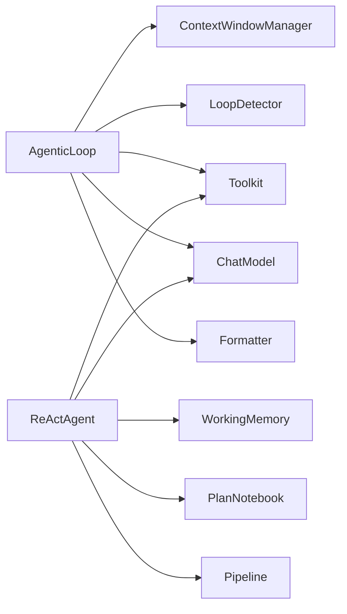

图表来源
- [agentic_loop.rs:234-241](file://macaca/crates/macaca-runtime/src/agentic_loop.rs#L234-L241)
- [react_agent.rs:37-50](file://macaca/crates/macaca-framework/src/react_agent.rs#L37-L50)

章节来源
- [agentic_loop.rs:214-348](file://macaca/crates/macaca-runtime/src/agentic_loop.rs#L214-L348)
- [react_agent.rs:212-285](file://macaca/crates/macaca-framework/src/react_agent.rs#L212-L285)

## 性能考虑
- 上下文窗口优化
  - 合理设置max_tokens与trim_threshold，避免频繁截断
  - 使用摘要压缩减少token占用，但需平衡信息损失
- 工具执行
  - 为工具设置合理超时；使用中间件进行限流与缓存
  - 合理分组激活，减少不必要的工具定义暴露给LLM
- 并发与资源
  - 使用分片SessionStore提升并发写入性能
  - 在PausableAgenticLoop中使用Notify替代轮询，降低CPU占用
- 日志与追踪
  - 通过事件通道输出CcTrace等中间状态，便于观测与调试

## 故障排查指南
- 循环卡住
  - 检查LoopDetector日志，确认是否出现重复工具调用；适当提高repeat_threshold或修复工具逻辑
- 工具执行失败
  - 查看权限检查与超时错误；核对工具参数schema与预设参数合并
- 上下文过长
  - 调整ContextWindowManager配置；启用工作记忆压缩
- 会话状态异常
  - 检查SessionStore保存/加载流程；确保StateModule实现正确

章节来源
- [loop_detector.rs:111-173](file://macaca/crates/macaca-runtime/src/loop_detector.rs#L111-L173)
- [tool.rs:314-371](file://macaca/crates/macaca-framework/src/tool.rs#L314-L371)
- [context_window.rs:68-122](file://macaca/crates/macaca-runtime/src/context_window.rs#L68-L122)
- [session.rs:101-121](file://macaca/crates/macaca-framework/src/session.rs#L101-L121)

## 结论
本文档从设计原理、实现细节、性能优化与故障排查四个维度全面解析了Agent执行循环。通过上下文窗口管理、循环检测、工具系统与消息模型的协同，实现了稳定高效的思考-行动循环；配合工作记忆、计划笔记本与会话持久化，进一步增强了可扩展性与可维护性。实际部署中应结合业务场景调整配置参数，并利用事件与中间件完善可观测性与安全性。

## 附录
- 配置选项速览
  - AgenticLoop.RuntimeConfig：max_iterations、tool_timeout
  - ContextWindowConfig：max_tokens、trim_threshold、preserve_recent
  - LoopDetectorConfig：window_size、repeat_threshold、max_repeats
  - MemoryCompressor：trigger_threshold、target_tokens、keep_recent
- 常见使用场景
  - ReActAgent用于复杂推理任务；AgenticLoop适合通用工具驱动的自动化流程
  - Pipeline用于多Agent协作与广播式决策
- 调试建议
  - 开启事件通道输出CcTrace与工具调用/结果
  - 使用中间件记录调用耗时与错误
  - 启用工作记忆压缩并监控token使用趋势