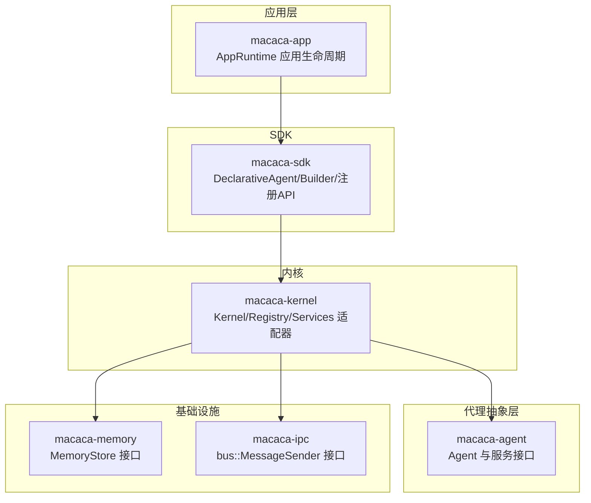
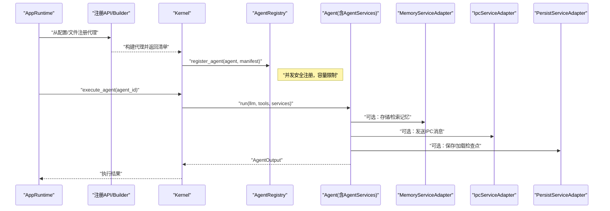
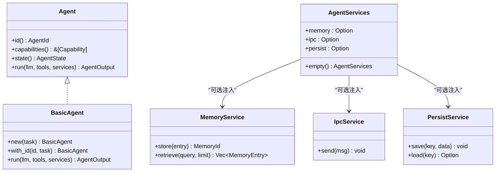
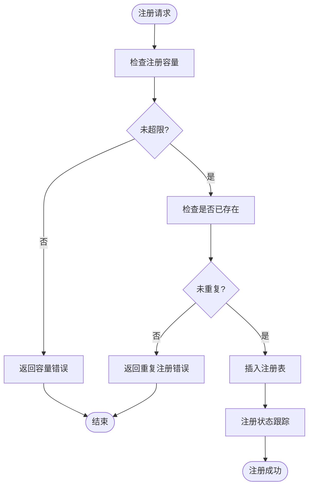
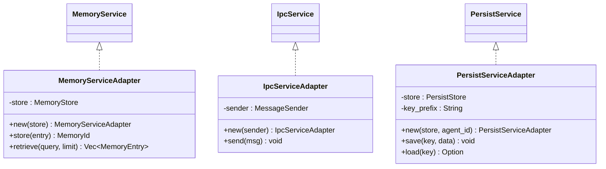
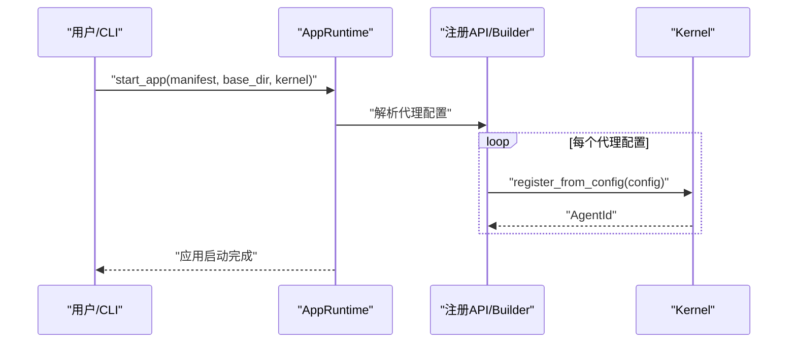
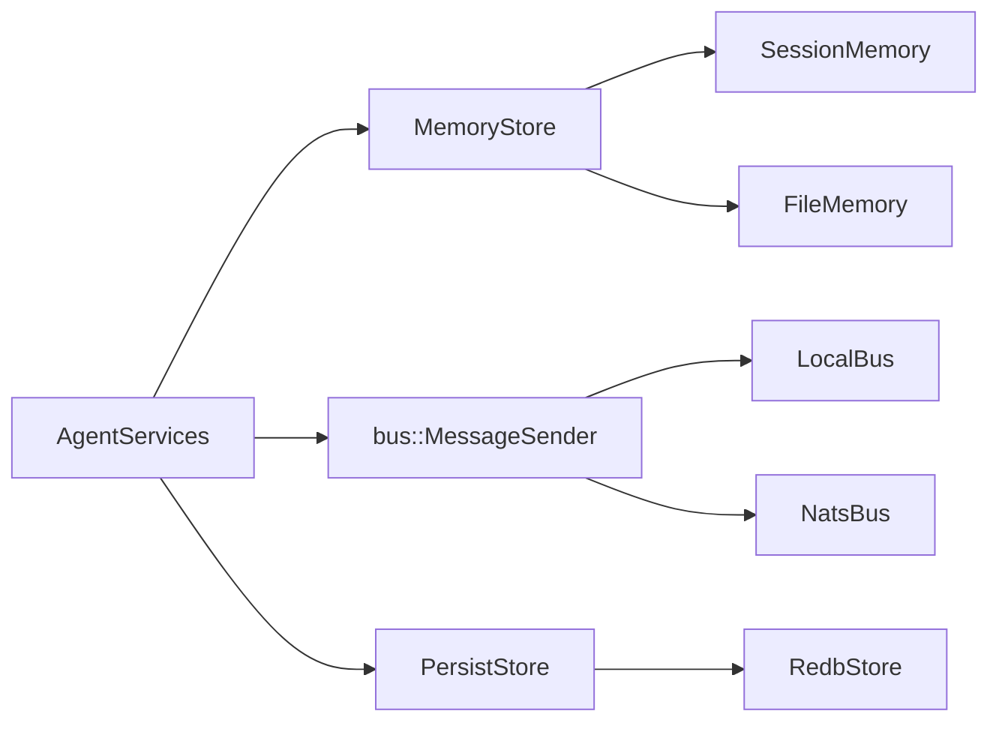

# Agent服务注入

<cite>
**本文引用的文件**
- [agent.rs](file://macaca/crates/macaca-agent/src/agent.rs)
- [lib.rs](file://macaca/crates/macaca-agent/src/lib.rs)
- [basic.rs](file://macaca/crates/macaca-agent/src/basic.rs)
- [services.rs](file://macaca/crates/macaca-kernel/src/services.rs)
- [kernel.rs](file://macaca/crates/macaca-kernel/src/kernel.rs)
- [registry.rs](file://macaca/crates/macaca-kernel/src/registry.rs)
- [runtime.rs](file://macaca/crates/macaca-app/src/runtime.rs)
- [registry_api.rs](file://macaca/crates/macaca-sdk/src/registry_api.rs)
- [builder.rs](file://macaca/crates/macaca-sdk/src/builder.rs)
- [lib.rs](file://macaca/crates/macaca-memory/src/lib.rs)
- [lib.rs](file://macaca/crates/macaca-ipc/src/lib.rs)
</cite>

## 目录
1. [简介](#简介)
2. [项目结构](#项目结构)
3. [核心组件](#核心组件)
4. [架构总览](#架构总览)
5. [详细组件分析](#详细组件分析)
6. [依赖关系分析](#依赖关系分析)
7. [性能考量](#性能考量)
8. [故障排查指南](#故障排查指南)
9. [结论](#结论)
10. [附录](#附录)

## 简介
本文件系统性阐述 Agent 服务注入的设计理念与实现机制，聚焦以下主题：
- 服务容器与依赖注入：如何在运行时为 Agent 注入 LLM 提供者、工具集、内存服务与 IPC 网关等能力。
- 生命周期管理：从应用加载、代理注册到执行与状态跟踪的全链路生命周期。
- 服务注册与发现：服务接口定义、实现绑定与解析流程。
- 运行时服务：状态共享、事件广播与跨 Agent 通信。
- 配置与扩展：自定义服务开发、服务组合与性能优化建议。
- 实战示例与常见问题排查。

## 项目结构
Agent 服务注入相关的核心模块分布于多个子 crate 中，围绕“代理抽象层（macaca-agent）—内核（macaca-kernel）—应用层（macaca-app）—SDK（macaca-sdk）”展开，形成清晰的分层与职责边界。

**图表来源**
- [lib.rs:11-14](file://macaca/crates/macaca-agent/src/lib.rs#L11-L14)
- [kernel.rs:16-38](file://macaca/crates/macaca-kernel/src/kernel.rs#L16-L38)
- [runtime.rs:16-27](file://macaca/crates/macaca-app/src/runtime.rs#L16-L27)
- [registry_api.rs:13-16](file://macaca/crates/macaca-sdk/src/registry_api.rs#L13-L16)
- [lib.rs:11-17](file://macaca/crates/macaca-memory/src/lib.rs#L11-L17)
- [lib.rs:14-16](file://macaca/crates/macaca-ipc/src/lib.rs#L14-L16)

**章节来源**
- [lib.rs:1-15](file://macaca/crates/macaca-agent/src/lib.rs#L1-L15)
- [kernel.rs:16-38](file://macaca/crates/macaca-kernel/src/kernel.rs#L16-L38)
- [runtime.rs:16-27](file://macaca/crates/macaca-app/src/runtime.rs#L16-L27)

## 核心组件
- 代理接口与服务注入
  - 代理 trait 定义了统一的运行契约，运行时通过 AgentServices 注入可选的内存、IPC、持久化服务。
  - 基础代理 BasicAgent 展示了最小实现：直接调用 LLM 提供者生成响应。
- 内核与注册中心
  - Kernel 聚合 LLM 提供者与工具集，负责代理注册、执行与状态跟踪。
  - AgentRegistry 维护已注册代理清单，支持并发安全访问。
- 服务适配器
  - 将底层基础设施（内存、IPC、持久化）封装为 AgentServices 的 trait 实现，完成解耦与注入。
- 应用运行时与声明式代理
  - AppRuntime 管理应用生命周期；SDK 提供 DeclarativeAgent 与 Builder，从配置构建代理并注册到内核。

**章节来源**
- [agent.rs:37-76](file://macaca/crates/macaca-agent/src/agent.rs#L37-L76)
- [basic.rs:14-84](file://macaca/crates/macaca-agent/src/basic.rs#L14-L84)
- [kernel.rs:16-38](file://macaca/crates/macaca-kernel/src/kernel.rs#L16-L38)
- [registry.rs:22-34](file://macaca/crates/macaca-kernel/src/registry.rs#L22-L34)
- [services.rs:19-94](file://macaca/crates/macaca-kernel/src/services.rs#L19-L94)
- [runtime.rs:46-88](file://macaca/crates/macaca-app/src/runtime.rs#L46-L88)
- [builder.rs:96-181](file://macaca/crates/macaca-sdk/src/builder.rs#L96-L181)

## 架构总览
下图展示了从应用加载到代理执行、服务注入与状态跟踪的关键交互路径。

**图表来源**
- [runtime.rs:70-87](file://macaca/crates/macaca-app/src/runtime.rs#L70-L87)
- [registry_api.rs:13-16](file://macaca/crates/macaca-sdk/src/registry_api.rs#L13-L16)
- [builder.rs:88-93](file://macaca/crates/macaca-sdk/src/builder.rs#L88-L93)
- [kernel.rs:40-60](file://macaca/crates/macaca-kernel/src/kernel.rs#L40-L60)
- [kernel.rs:66-84](file://macaca/crates/macaca-kernel/src/kernel.rs#L66-L84)
- [services.rs:30-94](file://macaca/crates/macaca-kernel/src/services.rs#L30-L94)

## 详细组件分析

### 代理接口与服务注入
- AgentServices 结构体
  - 字段：memory、ipc、persist 均为可选的 trait 对象包装，便于按需注入。
  - 工厂：empty() 返回空服务包，用于当前阶段的占位注入。
- 代理运行时签名
  - run 方法接收 LLM 提供者与工具集，以及 AgentServices，确保代理可按需使用内存、IPC、持久化等能力。
- 基础代理 BasicAgent
  - 最小实现：构造系统与用户消息，调用 LLM 并返回内容与用量统计。

**图表来源**
- [agent.rs:37-76](file://macaca/crates/macaca-agent/src/agent.rs#L37-L76)
- [basic.rs:14-84](file://macaca/crates/macaca-agent/src/basic.rs#L14-L84)

**章节来源**
- [agent.rs:37-76](file://macaca/crates/macaca-agent/src/agent.rs#L37-L76)
- [basic.rs:14-84](file://macaca/crates/macaca-agent/src/basic.rs#L14-L84)

### 内核与注册中心
- Kernel
  - 聚合 LLM 提供者与工具集，维护调度器与状态跟踪器。
  - 执行代理时，构建 AgentServices（当前为空），并标记状态为“思考/空闲”。
- AgentRegistry
  - 注册/注销/列举代理，支持最大容量限制与重复注册保护。
  - 提供只读锁下的代理访问，避免执行期间持有写锁。

**图表来源**
- [registry.rs:36-65](file://macaca/crates/macaca-kernel/src/registry.rs#L36-L65)

**章节来源**
- [kernel.rs:16-38](file://macaca/crates/macaca-kernel/src/kernel.rs#L16-L38)
- [kernel.rs:62-84](file://macaca/crates/macaca-kernel/src/kernel.rs#L62-L84)
- [registry.rs:22-34](file://macaca/crates/macaca-kernel/src/registry.rs#L22-L34)
- [registry.rs:36-65](file://macaca/crates/macaca-kernel/src/registry.rs#L36-L65)

### 服务适配器与注入机制
- MemoryServiceAdapter
  - 包装任意实现了 MemoryStore 的类型，暴露 store/retrieve 接口。
- IpcServiceAdapter
  - 包装任意实现了 bus::MessageSender 的类型，暴露 send 接口。
- PersistServiceAdapter
  - 包装 PersistStore，按代理 ID 前缀隔离键空间，提供 save/load。
- 注入时机
  - 当前阶段 Kernel.execute_agent 构建的是空 AgentServices；后续版本将在此处装配具体服务实例。

**图表来源**
- [services.rs:19-94](file://macaca/crates/macaca-kernel/src/services.rs#L19-L94)

**章节来源**
- [services.rs:19-94](file://macaca/crates/macaca-kernel/src/services.rs#L19-L94)

### 应用运行时与声明式代理
- AppRuntime
  - 从应用清单加载代理配置，逐个注册到内核，记录应用状态与代理 ID 列表。
- 注册 API 与 Builder
  - register_from_config/register_from_file 将配置转换为代理与清单，再由内核注册。
  - AgentBuilder 从配置构建 DeclarativeAgent，填充能力、权限、LLM 选项与状态。

**图表来源**
- [runtime.rs:46-87](file://macaca/crates/macaca-app/src/runtime.rs#L46-L87)
- [registry_api.rs:13-16](file://macaca/crates/macaca-sdk/src/registry_api.rs#L13-L16)
- [builder.rs:88-93](file://macaca/crates/macaca-sdk/src/builder.rs#L88-L93)

**章节来源**
- [runtime.rs:46-87](file://macaca/crates/macaca-app/src/runtime.rs#L46-L87)
- [registry_api.rs:13-16](file://macaca/crates/macaca-sdk/src/registry_api.rs#L13-L16)
- [builder.rs:88-93](file://macaca/crates/macaca-sdk/src/builder.rs#L88-L93)

### 运行时服务：状态共享、事件广播与跨代理通信
- 状态共享与跟踪
  - Kernel 内部维护 AgentStatusTracker，用于更新代理状态（运行中/思考/空闲）、活动与运行时信息。
- 事件广播与跨代理通信
  - IpcServiceAdapter 基于 bus::MessageSender，可将消息广播至本地或跨进程通道，实现多代理间通信。
- 内存与持久化
  - MemoryServiceAdapter/PersistServiceAdapter 分别提供会话/向量检索与键值检查点能力，支撑任务状态与记忆的持久化。

**章节来源**
- [kernel.rs:16-38](file://macaca/crates/macaca-kernel/src/kernel.rs#L16-L38)
- [kernel.rs:117-135](file://macaca/crates/macaca-kernel/src/kernel.rs#L117-L135)
- [services.rs:43-94](file://macaca/crates/macaca-kernel/src/services.rs#L43-L94)
- [lib.rs:14-16](file://macaca/crates/macaca-ipc/src/lib.rs#L14-L16)

## 依赖关系分析
- 松耦合接口
  - AgentServices 仅依赖 trait，不关心具体实现；MemoryStore、bus::MessageSender、PersistStore 亦以 trait 形式暴露。
- 依赖注入位置
  - 当前注入点位于 Kernel.execute_agent 的服务构建阶段；后续应扩展为从内核配置/注册表装配具体服务实例。
- 外部依赖
  - macaca-memory 提供 MemoryStore/SessionMemory 等实现；
  - macaca-ipc 提供 LocalBus/NatsBus 的 MessageSender 实现。

**图表来源**
- [services.rs:13-15](file://macaca/crates/macaca-kernel/src/services.rs#L13-L15)
- [lib.rs:11-17](file://macaca/crates/macaca-memory/src/lib.rs#L11-L17)
- [lib.rs:14-16](file://macaca/crates/macaca-ipc/src/lib.rs#L14-L16)

**章节来源**
- [services.rs:13-15](file://macaca/crates/macaca-kernel/src/services.rs#L13-L15)
- [lib.rs:11-17](file://macaca/crates/macaca-memory/src/lib.rs#L11-L17)
- [lib.rs:14-16](file://macaca/crates/macaca-ipc/src/lib.rs#L14-L16)

## 性能考量
- 并发与锁粒度
  - Registry 使用读写锁，执行阶段仅持有读锁，降低竞争开销。
- 服务适配器开销
  - 适配器为轻量包装，主要成本来自底层存储/网络操作；建议对频繁调用的检索/发送进行缓存与批处理。
- 状态跟踪
  - 状态更新与活动日志应异步化，避免阻塞代理执行主路径。
- LLM 与工具调用
  - 合理设置温度、最大令牌数与工具参数，减少无效往返；对工具执行结果进行去重与缓存。

## 故障排查指南
- 注册失败：容量超限或重复注册
  - 现象：注册报错提示容量或重复。
  - 排查：检查最大代理数配置与代理 ID 是否重复。
- 执行失败：代理不存在
  - 现象：执行报 Not Found。
  - 排查：确认代理是否已注册、ID 是否正确。
- IPC 发送无响应
  - 现象：消息发送后无回执或未被其他代理收到。
  - 排查：确认 bus 实现（本地/远程）与订阅关系；检查消息格式与目标代理 ID。
- 持久化键冲突
  - 现象：不同代理读取到彼此数据。
  - 排查：确认 PersistServiceAdapter 的 key 前缀是否按代理 ID 隔离。

**章节来源**
- [registry.rs:47-60](file://macaca/crates/macaca-kernel/src/registry.rs#L47-L60)
- [kernel.rs:74-78](file://macaca/crates/macaca-kernel/src/kernel.rs#L74-L78)
- [services.rs:71-82](file://macaca/crates/macaca-kernel/src/services.rs#L71-L82)

## 结论
Agent 服务注入体系通过清晰的接口抽象与适配器模式，实现了 LLM、工具、内存、IPC、持久化等能力的可插拔注入。当前阶段以空服务包占位，后续可在内核执行路径中装配具体服务实例，结合应用运行时与声明式代理，形成从配置到执行的完整闭环。通过合理的并发设计、状态跟踪与性能优化，可满足多代理协作与复杂任务编排的需求。

## 附录

### 服务注入配置与扩展接口
- 自定义服务开发
  - 实现对应 trait（MemoryService/IpcService/PersistService），并提供适配器包装。
  - 在内核初始化阶段，将适配器实例注入到 AgentServices。
- 服务组合
  - 可同时启用内存检索与 IPC 广播，实现“记忆+通信”的复合能力。
- 典型扩展点
  - 新增网关适配器（如 Discord/Telegram）以接入外部协议。
  - 引入向量数据库作为 MemoryStore 的实现，提升检索效率。

**章节来源**
- [services.rs:19-94](file://macaca/crates/macaca-kernel/src/services.rs#L19-L94)
- [lib.rs:14-16](file://macaca/crates/macaca-ipc/src/lib.rs#L14-L16)