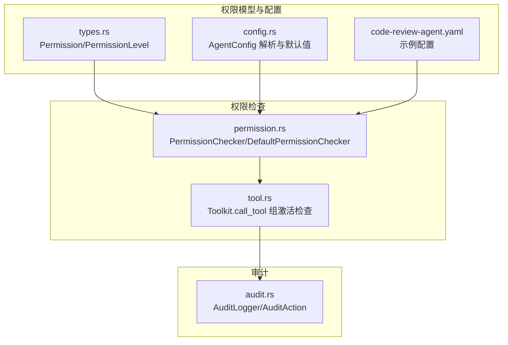
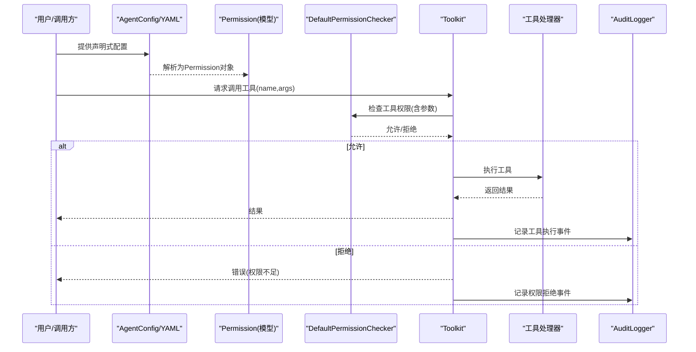
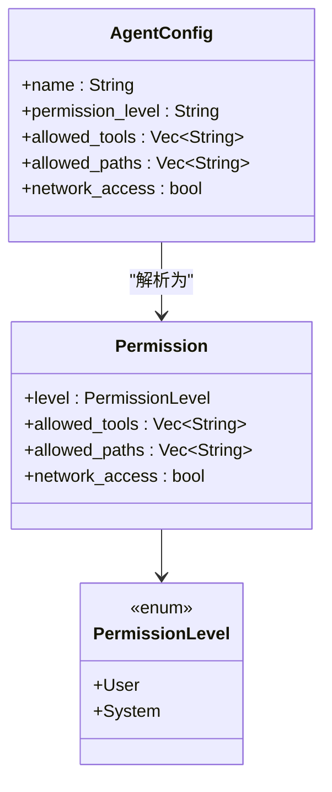
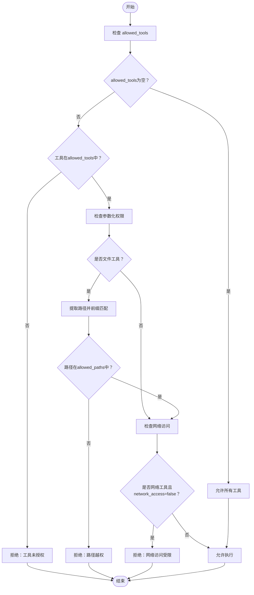
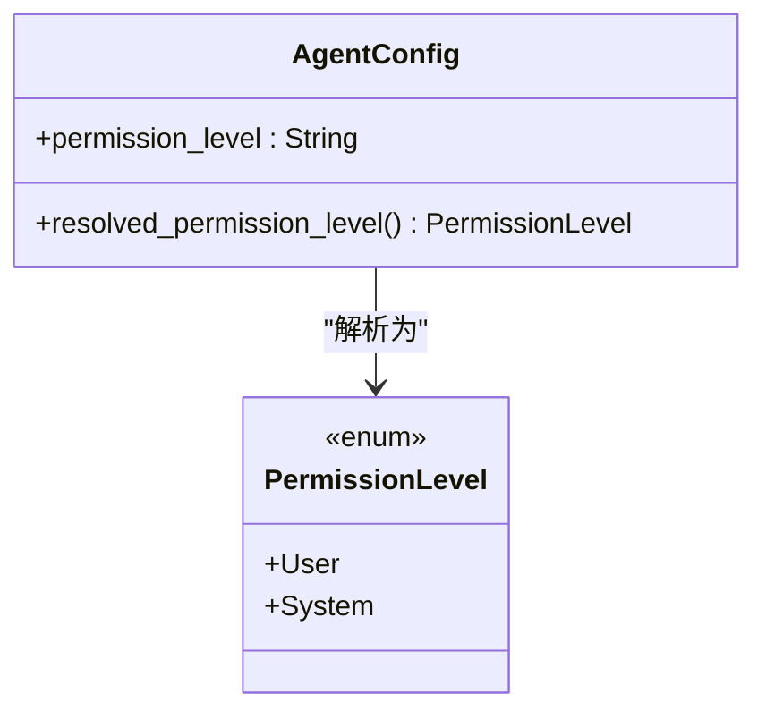
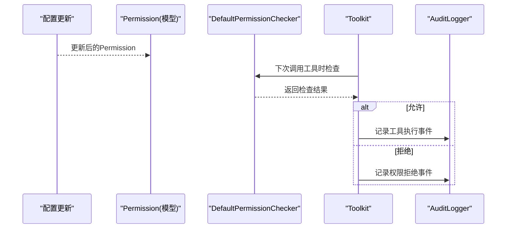
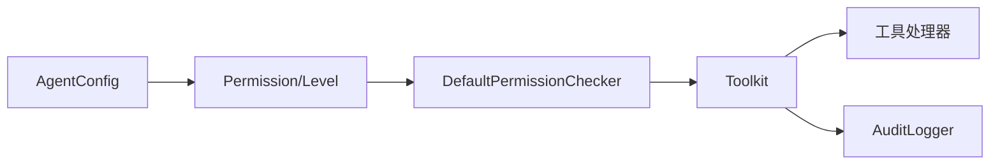

# Agent权限控制

<cite>
**本文引用的文件**
- [permission.rs](file://macaca/crates/macaca-runtime/src/permission.rs)
- [types.rs](file://macaca/crates/macaca-proto/src/types.rs)
- [config.rs](file://macaca/crates/macaca-sdk/src/config.rs)
- [audit.rs](file://macaca/crates/macaca-kernel/src/audit.rs)
- [tool.rs](file://macaca/crates/macaca-framework/src/tool.rs)
- [code-review-agent.yaml](file://macaca/examples/custom-agent-yaml/code-review-agent.yaml)
- [SYSTEM_AUDIT.md](file://macaca/docs/SYSTEM_AUDIT.md)
</cite>

## 目录
1. [简介](#简介)
2. [项目结构](#项目结构)
3. [核心组件](#核心组件)
4. [架构总览](#架构总览)
5. [详细组件分析](#详细组件分析)
6. [依赖关系分析](#依赖关系分析)
7. [性能考量](#性能考量)
8. [故障排查指南](#故障排查指南)
9. [结论](#结论)
10. [附录](#附录)

## 简介
本文件系统化阐述Agent权限控制体系的设计与实现，涵盖权限级别、访问控制与安全边界，详解Permission结构的定义与使用，包括工具访问权限、文件系统权限与网络访问控制。文档还覆盖权限检查机制（执行前验证、动态权限授予与撤销）、用户Agent与系统Agent的差异、最佳实践（最小权限原则、权限继承与安全审计），并提供具体配置示例与常见问题解决方案。

## 项目结构
权限控制相关代码主要分布在以下模块：
- 运行时权限检查：macaca-runtime/src/permission.rs
- 权限数据模型：macaca-proto/src/types.rs
- 声明式Agent配置解析与默认值：macaca-sdk/src/config.rs
- 工具组激活与工具调用：macaca-framework/src/tool.rs
- 安全审计日志：macaca-kernel/src/audit.rs
- 示例Agent配置：examples/custom-agent-yaml/code-review-agent.yaml

**图表来源**
- [permission.rs:1-311](file://macaca/crates/macaca-runtime/src/permission.rs#L1-L311)
- [types.rs:264-278](file://macaca/crates/macaca-proto/src/types.rs#L264-L278)
- [config.rs:1-304](file://macaca/crates/macaca-sdk/src/config.rs#L1-L304)
- [tool.rs:314-371](file://macaca/crates/macaca-framework/src/tool.rs#L314-L371)
- [audit.rs:1-339](file://macaca/crates/macaca-kernel/src/audit.rs#L1-L339)
- [code-review-agent.yaml:1-26](file://macaca/examples/custom-agent-yaml/code-review-agent.yaml#L1-L26)

**章节来源**
- [permission.rs:1-311](file://macaca/crates/macaca-runtime/src/permission.rs#L1-L311)
- [types.rs:264-278](file://macaca/crates/macaca-proto/src/types.rs#L264-L278)
- [config.rs:1-304](file://macaca/crates/macaca-sdk/src/config.rs#L1-L304)
- [tool.rs:314-371](file://macaca/crates/macaca-framework/src/tool.rs#L314-L371)
- [audit.rs:1-339](file://macaca/crates/macaca-kernel/src/audit.rs#L1-L339)
- [code-review-agent.yaml:1-26](file://macaca/examples/custom-agent-yaml/code-review-agent.yaml#L1-L26)

## 核心组件
- 权限模型
  - PermissionLevel：区分System（系统）与User（用户）两类Agent权限级别。
  - Permission：包含allowed_tools、allowed_paths、network_access与level字段，用于描述Agent的工具、文件系统与网络访问边界。
- 权限检查器
  - PermissionChecker trait：定义工具权限检查接口。
  - DefaultPermissionChecker：默认实现，支持工具白名单、路径前缀匹配与网络访问判断。
- 工具系统
  - Toolkit：工具注册、中间件与组激活管理；调用时检查工具所属组是否激活。
- 审计
  - AuditLogger：记录工具执行、权限拒绝等审计事件，支持查询与过滤。

**章节来源**
- [types.rs:264-278](file://macaca/crates/macaca-proto/src/types.rs#L264-L278)
- [permission.rs:6-91](file://macaca/crates/macaca-runtime/src/permission.rs#L6-L91)
- [tool.rs:197-371](file://macaca/crates/macaca-framework/src/tool.rs#L197-L371)
- [audit.rs:11-53](file://macaca/crates/macaca-kernel/src/audit.rs#L11-L53)

## 架构总览
权限控制贯穿“配置—模型—检查—执行—审计”的闭环：

**图表来源**
- [config.rs:1-304](file://macaca/crates/macaca-sdk/src/config.rs#L1-L304)
- [types.rs:272-278](file://macaca/crates/macaca-proto/src/types.rs#L272-L278)
- [permission.rs:39-91](file://macaca/crates/macaca-runtime/src/permission.rs#L39-L91)
- [tool.rs:314-371](file://macaca/crates/macaca-framework/src/tool.rs#L314-L371)
- [audit.rs:96-113](file://macaca/crates/macaca-kernel/src/audit.rs#L96-L113)

## 详细组件分析

### 权限模型与配置
- Permission结构
  - level：PermissionLevel::User 或 PermissionLevel::System
  - allowed_tools：允许使用的工具名称列表；为空表示开放策略（不限制）
  - allowed_paths：允许访问的文件系统路径前缀；为空表示不限制
  - network_access：是否允许网络访问
- AgentConfig解析
  - 支持从YAML/TOML加载，包含permission_level、allowed_tools、allowed_paths、network_access等字段
  - 默认permission_level为"user"，默认allowed_tools为空
- 示例配置
  - code-review-agent.yaml展示典型用户Agent配置：限制工具为file_read与shell，限定allowed_paths为/workspace目录，禁止network_access

**图表来源**
- [types.rs:264-278](file://macaca/crates/macaca-proto/src/types.rs#L264-L278)
- [config.rs:9-46](file://macaca/crates/macaca-sdk/src/config.rs#L9-L46)
- [code-review-agent.yaml:1-26](file://macaca/examples/custom-agent-yaml/code-review-agent.yaml#L1-L26)

**章节来源**
- [types.rs:264-278](file://macaca/crates/macaca-proto/src/types.rs#L264-L278)
- [config.rs:1-304](file://macaca/crates/macaca-sdk/src/config.rs#L1-L304)
- [code-review-agent.yaml:1-26](file://macaca/examples/custom-agent-yaml/code-review-agent.yaml#L1-L26)

### 权限检查机制
- 工具权限检查
  - 若allowed_tools为空，视为开放策略，所有工具均可使用
  - 否则仅允许在allowed_tools中列出的工具
- 参数化检查（路径与网络）
  - 文件工具：从参数中提取path/file_path/directory，进行前缀匹配校验
  - 网络工具：识别http_request/fetch/web_search或shell命令中的网络活动（如curl/wget等），若network_access为false则拒绝
- 工具组激活检查
  - Toolkit在调用工具前检查其所属组是否激活；"basic"组始终激活，其他组可被禁用

**图表来源**
- [permission.rs:39-91](file://macaca/crates/macaca-runtime/src/permission.rs#L39-L91)
- [permission.rs:93-161](file://macaca/crates/macaca-runtime/src/permission.rs#L93-L161)
- [tool.rs:314-343](file://macaca/crates/macaca-framework/src/tool.rs#L314-L343)

**章节来源**
- [permission.rs:39-91](file://macaca/crates/macaca-runtime/src/permission.rs#L39-L91)
- [permission.rs:93-161](file://macaca/crates/macaca-runtime/src/permission.rs#L93-L161)
- [tool.rs:314-343](file://macaca/crates/macaca-framework/src/tool.rs#L314-L343)

### 权限级别与应用场景
- User Agent（用户）
  - 默认权限级别，适合一般任务执行
  - 可通过配置限制allowed_tools、allowed_paths与network_access
- System Agent（系统）
  - 通过配置permission_level设置为"system"，在系统中拥有更广泛的权限
  - 适用于需要更高权限的系统运维或基础设施任务

**图表来源**
- [config.rs:145-151](file://macaca/crates/macaca-sdk/src/config.rs#L145-L151)
- [types.rs:264-270](file://macaca/crates/macaca-proto/src/types.rs#L264-L270)

**章节来源**
- [config.rs:145-151](file://macaca/crates/macaca-sdk/src/config.rs#L145-L151)
- [types.rs:264-270](file://macaca/crates/macaca-proto/src/types.rs#L264-L270)

### 权限配置最佳实践
- 最小权限原则
  - 将allowed_tools限制到实际需要的工具集合
  - 严格限定allowed_paths，避免越权访问
  - 默认network_access=false，按需开启
- 权限继承
  - 通过AgentConfig的默认值与示例配置模板，确保新Agent遵循统一的最小权限策略
- 安全审计
  - 使用AuditLogger记录工具执行与权限拒绝事件，便于追踪与合规审查

**章节来源**
- [config.rs:80-86](file://macaca/crates/macaca-sdk/src/config.rs#L80-L86)
- [code-review-agent.yaml:7-14](file://macaca/examples/custom-agent-yaml/code-review-agent.yaml#L7-L14)
- [audit.rs:11-53](file://macaca/crates/macaca-kernel/src/audit.rs#L11-L53)

### 权限检查流程（执行前验证、动态授予与撤销）
- 执行前验证
  - 在Toolkit.call_tool中完成：工具存在性、组激活状态、参数合并与中间件执行
  - 在DefaultPermissionChecker中完成：工具白名单、路径与网络检查
- 动态权限授予/撤销
  - 通过修改Agent配置（YAML/TOML）或运行时策略（取决于实现）调整allowed_tools、allowed_paths、network_access
  - 工具组激活状态可通过Toolkit.set_group_active动态切换
- 审计与追溯
  - 通过AuditLogger记录工具执行与权限拒绝事件，支持按Agent、时间范围与数量限制查询

**图表来源**
- [permission.rs:39-91](file://macaca/crates/macaca-runtime/src/permission.rs#L39-L91)
- [tool.rs:314-371](file://macaca/crates/macaca-framework/src/tool.rs#L314-L371)
- [audit.rs:96-113](file://macaca/crates/macaca-kernel/src/audit.rs#L96-L113)

**章节来源**
- [permission.rs:39-91](file://macaca/crates/macaca-runtime/src/permission.rs#L39-L91)
- [tool.rs:297-308](file://macaca/crates/macaca-framework/src/tool.rs#L297-L308)
- [audit.rs:96-113](file://macaca/crates/macaca-kernel/src/audit.rs#L96-L113)

### 权限配置示例
- 用户Agent示例（代码评审）
  - permission_level: "user"
  - allowed_tools: ["file_read","shell"]
  - allowed_paths: ["/workspace/src","/workspace/tests"]
  - network_access: false
- 系统Agent示例（需在配置中设置permission_level为"system"）

**章节来源**
- [code-review-agent.yaml:1-26](file://macaca/examples/custom-agent-yaml/code-review-agent.yaml#L1-L26)

### 常见权限问题与解决方案
- 问题：工具调用被拒绝
  - 检查allowed_tools中是否包含该工具名称
  - 检查工具组是否处于激活状态
- 问题：文件操作失败
  - 检查参数中的路径是否在allowed_paths前缀范围内
- 问题：网络请求被拒绝
  - 检查network_access是否为true，或确认工具/命令是否涉及网络活动
- 问题：权限变更后未生效
  - 确认Agent配置已更新并重新加载
  - 对于工具组，确认Toolkit.set_group_active已正确设置

**章节来源**
- [permission.rs:121-138](file://macaca/crates/macaca-runtime/src/permission.rs#L121-L138)
- [permission.rs:140-161](file://macaca/crates/macaca-runtime/src/permission.rs#L140-L161)
- [tool.rs:297-308](file://macaca/crates/macaca-framework/src/tool.rs#L297-L308)

## 依赖关系分析
- 权限模型依赖
  - Permission与PermissionLevel来自macaca-proto
  - AgentConfig来自macaca-sdk，解析为Permission
- 权限检查依赖
  - DefaultPermissionChecker依赖Permission进行工具、路径与网络检查
  - Toolkit在工具调用前进行组激活检查，与权限检查共同构成安全边界
- 审计依赖
  - AuditLogger记录工具执行与权限拒绝事件，支撑安全审计

**图表来源**
- [types.rs:264-278](file://macaca/crates/macaca-proto/src/types.rs#L264-L278)
- [config.rs:1-304](file://macaca/crates/macaca-sdk/src/config.rs#L1-L304)
- [permission.rs:39-91](file://macaca/crates/macaca-runtime/src/permission.rs#L39-L91)
- [tool.rs:314-371](file://macaca/crates/macaca-framework/src/tool.rs#L314-L371)
- [audit.rs:96-113](file://macaca/crates/macaca-kernel/src/audit.rs#L96-L113)

**章节来源**
- [types.rs:264-278](file://macaca/crates/macaca-proto/src/types.rs#L264-L278)
- [config.rs:1-304](file://macaca/crates/macaca-sdk/src/config.rs#L1-L304)
- [permission.rs:39-91](file://macaca/crates/macaca-runtime/src/permission.rs#L39-L91)
- [tool.rs:314-371](file://macaca/crates/macaca-framework/src/tool.rs#L314-L371)
- [audit.rs:96-113](file://macaca/crates/macaca-kernel/src/audit.rs#L96-L113)

## 性能考量
- 权限检查开销
  - 工具白名单检查为线性查找，allowed_tools较短时开销可忽略
  - 路径前缀匹配为字符串前缀比较，性能良好
  - 网络工具判定基于关键字匹配，复杂度低
- 工具组激活检查
  - Toolkit在每次调用前进行组状态查询，通常为哈希表查找，性能稳定
- 审计日志
  - 基于持久化存储，查询时需遍历键空间，建议合理使用查询参数（时间范围、数量限制）

[本节为通用指导，无需特定文件引用]

## 故障排查指南
- 审计事件查询
  - 使用AuditLogger.query按agent_id/since/until/limit过滤事件
  - 通过AuditAction区分工具执行与权限拒绝事件
- 常见错误定位
  - 权限拒绝：检查allowed_tools、allowed_paths、network_access与工具组激活状态
  - 工具不存在：确认工具名称拼写与注册状态
  - 配置未生效：确认Agent配置文件格式与字段值

**章节来源**
- [audit.rs:115-148](file://macaca/crates/macaca-kernel/src/audit.rs#L115-L148)
- [audit.rs:14-23](file://macaca/crates/macaca-kernel/src/audit.rs#L14-L23)
- [tool.rs:314-343](file://macaca/crates/macaca-framework/src/tool.rs#L314-L343)

## 结论
本权限控制体系以Permission模型为核心，结合DefaultPermissionChecker与Toolkit的组激活检查，实现了对工具、文件系统与网络访问的细粒度控制。配合声明式配置与安全审计，既满足最小权限原则，又提供了可追溯的安全保障。通过示例配置与最佳实践，可快速落地到实际场景中。

[本节为总结性内容，无需特定文件引用]

## 附录
- 相关文档与参考
  - 系统审计报告中提及的模块与安全相关问题，有助于理解整体安全现状与改进方向

**章节来源**
- [SYSTEM_AUDIT.md:124-155](file://macaca/docs/SYSTEM_AUDIT.md#L124-L155)