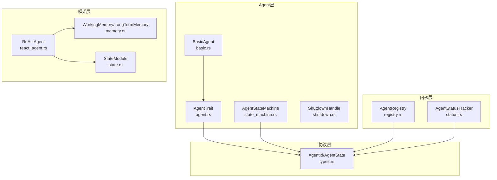
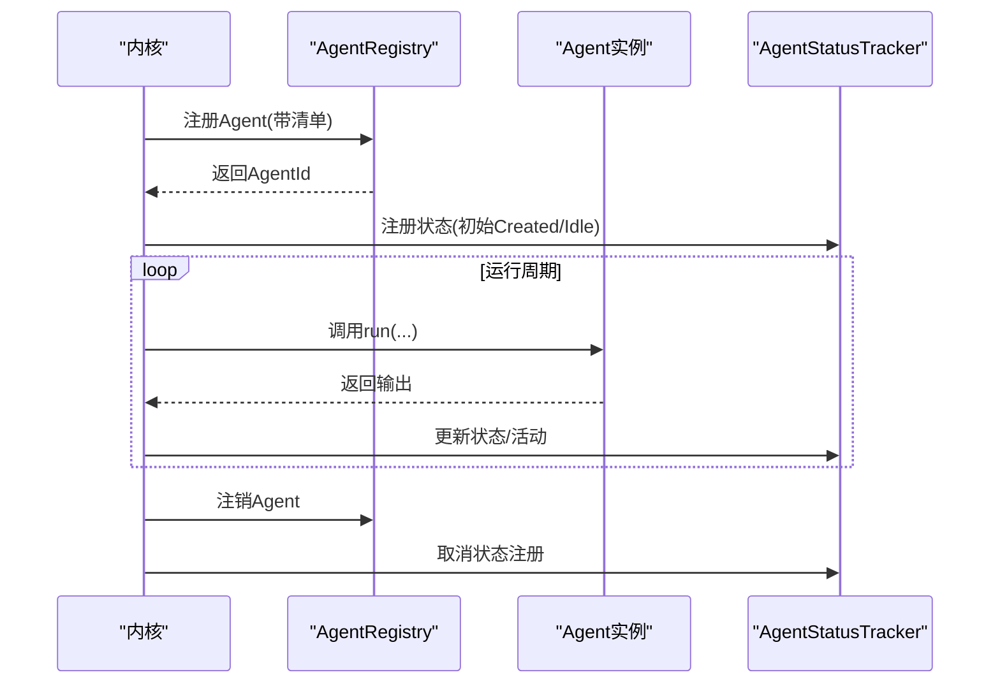
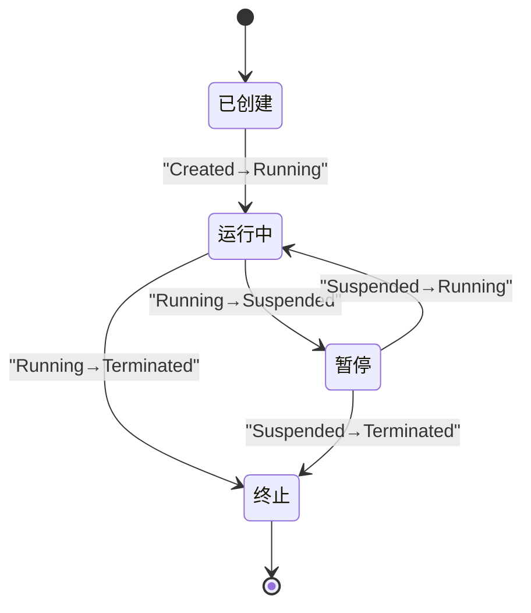
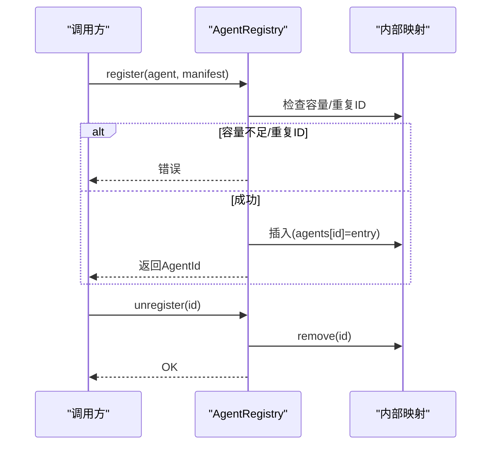
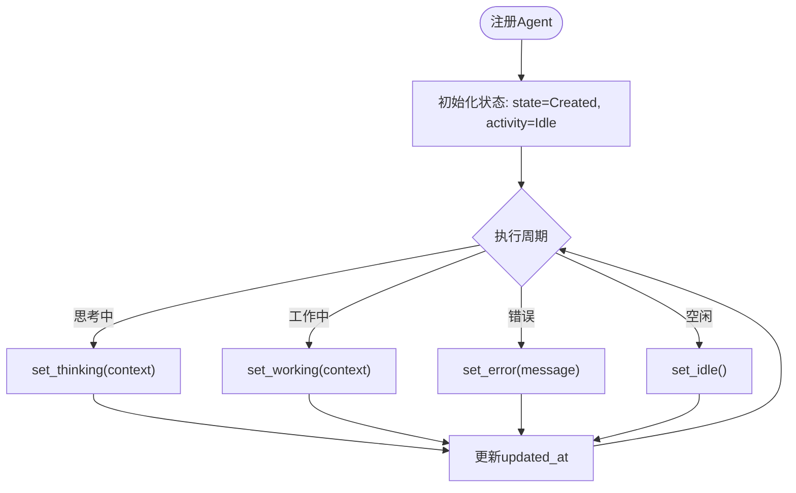
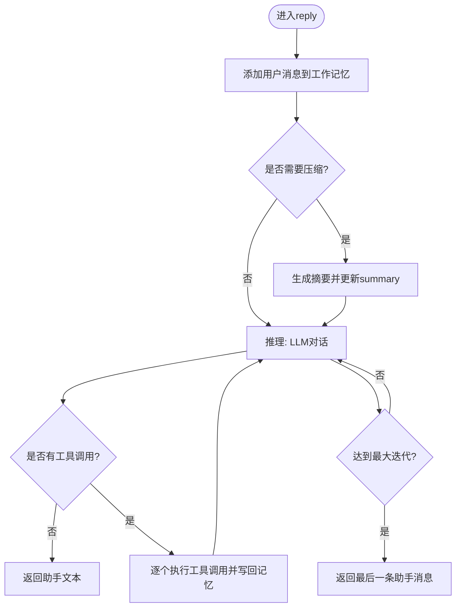
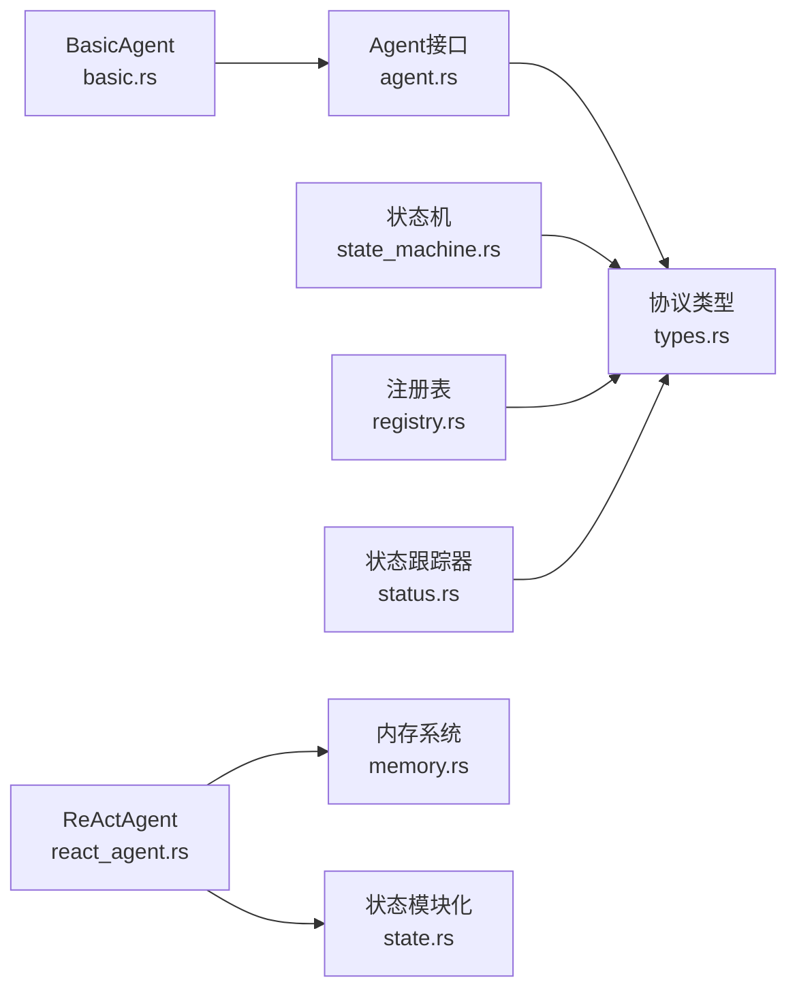

# Agent生命周期管理

<cite>
**本文档引用的文件**
- [lib.rs](file://macaca/crates/macaca-agent/src/lib.rs)
- [agent.rs](file://macaca/crates/macaca-agent/src/agent.rs)
- [state_machine.rs](file://macaca/crates/macaca-agent/src/state_machine.rs)
- [basic.rs](file://macaca/crates/macaca-agent/src/basic.rs)
- [shutdown.rs](file://macaca/crates/macaca-agent/src/shutdown.rs)
- [types.rs](file://macaca/crates/macaca-proto/src/types.rs)
- [registry.rs](file://macaca/crates/macaca-kernel/src/registry.rs)
- [status.rs](file://macaca/crates/macaca-kernel/src/status.rs)
- [react_agent.rs](file://macaca/crates/macaca-framework/src/react_agent.rs)
- [memory.rs](file://macaca/crates/macaca-framework/src/memory.rs)
- [state.rs](file://macaca/crates/macaca-framework/src/state.rs)
- [orchestration.rs](file://macaca/crates/macaca-proto/src/orchestration.rs)
</cite>

## 目录
1. [简介](#简介)
2. [项目结构](#项目结构)
3. [核心组件](#核心组件)
4. [架构总览](#架构总览)
5. [详细组件分析](#详细组件分析)
6. [依赖关系分析](#依赖关系分析)
7. [性能考虑](#性能考虑)
8. [故障排除指南](#故障排除指南)
9. [结论](#结论)

## 简介
本文件系统性阐述Agent生命周期管理的设计与实现，覆盖从Agent注册、运行、暂停、终止的完整生命周期，以及状态跟踪、注册表管理、状态机约束、内存压缩与持久化等关键机制。文档同时给出状态转换流程图、注册表交互序列图与内存管理流程图，帮助读者快速理解并正确使用该框架。

## 项目结构
本项目采用多crate模块化组织，围绕Agent生命周期管理的关键领域划分如下：
- macaca-agent：定义Agent基础接口、服务注入、状态机与基本Agent实现
- macaca-proto：定义跨模块共享的数据类型（AgentId、AgentState、AgentRuntimeStatus等）
- macaca-kernel：内核侧注册表与状态跟踪器
- macaca-framework：高级Agent（如ReActAgent）与内存系统、状态模块化
- macaca-llm、macaca-tools、macaca-memory等：支撑能力（非本文重点）

**图表来源**
- [agent.rs:58-76](file://macaca/crates/macaca-agent/src/agent.rs#L58-L76)
- [state_machine.rs:15-53](file://macaca/crates/macaca-agent/src/state_machine.rs#L15-L53)
- [basic.rs:14-84](file://macaca/crates/macaca-agent/src/basic.rs#L14-L84)
- [types.rs:156-262](file://macaca/crates/macaca-proto/src/types.rs#L156-L262)
- [registry.rs:22-116](file://macaca/crates/macaca-kernel/src/registry.rs#L22-L116)
- [status.rs:11-122](file://macaca/crates/macaca-kernel/src/status.rs#L11-L122)
- [react_agent.rs:37-285](file://macaca/crates/macaca-framework/src/react_agent.rs#L37-L285)
- [memory.rs:45-84](file://macaca/crates/macaca-framework/src/memory.rs#L45-L84)
- [state.rs:47-69](file://macaca/crates/macaca-framework/src/state.rs#L47-L69)

**章节来源**
- [lib.rs:1-15](file://macaca/crates/macaca-agent/src/lib.rs#L1-L15)
- [types.rs:156-262](file://macaca/crates/macaca-proto/src/types.rs#L156-L262)

## 核心组件
- Agent接口与服务注入：定义Agent必须实现的方法、能力声明与运行时服务注入（内存、IPC、持久化）
- Agent状态机：强制合法的状态转换，确保生命周期一致性
- 基础Agent实现：最小可运行Agent，演示如何调用LLM并返回结果
- 注册表：集中管理已注册Agent及其清单，支持容量控制、查找与清理
- 状态跟踪器：记录每个Agent的生命周期状态与动态活动（空闲、思考、工作、错误）
- ReActAgent：实现“推理-行动-观察”循环，集成工具调用与记忆压缩
- 内存系统：工作记忆与长期记忆，支持标记过滤、压缩与状态持久化
- 状态模块化：统一的序列化/反序列化接口，便于跨会话恢复

**章节来源**
- [agent.rs:58-76](file://macaca/crates/macaca-agent/src/agent.rs#L58-L76)
- [state_machine.rs:15-53](file://macaca/crates/macaca-agent/src/state_machine.rs#L15-L53)
- [basic.rs:14-84](file://macaca/crates/macaca-agent/src/basic.rs#L14-L84)
- [registry.rs:22-116](file://macaca/crates/macaca-kernel/src/registry.rs#L22-L116)
- [status.rs:11-122](file://macaca/crates/macaca-kernel/src/status.rs#L11-L122)
- [react_agent.rs:37-285](file://macaca/crates/macaca-framework/src/react_agent.rs#L37-L285)
- [memory.rs:45-84](file://macaca/crates/macaca-framework/src/memory.rs#L45-L84)
- [state.rs:47-69](file://macaca/crates/macaca-framework/src/state.rs#L47-L69)

## 架构总览
Agent生命周期管理由“接口-状态机-注册表-状态跟踪器-高级Agent-内存系统”构成，形成清晰的分层架构。接口层定义抽象，状态机保证生命周期约束，注册表与状态跟踪器提供运行期管理，高级Agent与内存系统负责执行与数据持久化。

**图表来源**
- [registry.rs:40-65](file://macaca/crates/macaca-kernel/src/registry.rs#L40-L65)
- [status.rs:24-35](file://macaca/crates/macaca-kernel/src/status.rs#L24-L35)
- [agent.rs:69-76](file://macaca/crates/macaca-agent/src/agent.rs#L69-L76)

## 详细组件分析

### Agent状态机与生命周期约束
- 状态枚举：Created、Running、Suspended、Terminated
- 合法转换：Created→Running；Running→Suspended或Terminated；Suspended→Running或Terminated
- 非法转换：直接从Created→Suspended或Created→Terminated，或在Terminated后尝试Running均抛出错误

**图表来源**
- [state_machine.rs:7-14](file://macaca/crates/macaca-agent/src/state_machine.rs#L7-L14)
- [types.rs:158-163](file://macaca/crates/macaca-proto/src/types.rs#L158-L163)

**章节来源**
- [state_machine.rs:15-53](file://macaca/crates/macaca-agent/src/state_machine.rs#L15-L53)
- [types.rs:158-163](file://macaca/crates/macaca-proto/src/types.rs#L158-L163)

### Agent注册与注销流程
- 注册：检查容量上限与重复ID，插入注册表并记录日志
- 查找：按ID读取清单，或列出所有清单
- 注销：移除注册项并记录日志
- 错误处理：容量超限、重复ID、未找到等场景返回明确错误

**图表来源**
- [registry.rs:40-75](file://macaca/crates/macaca-kernel/src/registry.rs#L40-L75)

**章节来源**
- [registry.rs:22-116](file://macaca/crates/macaca-kernel/src/registry.rs#L22-L116)

### Agent状态跟踪器
- 功能：为每个Agent维护运行时状态（生命周期状态+活动状态），支持查询与批量列表
- 活动状态：Idle、Thinking、Working、Error
- 接口：注册/注销、更新状态/活动、设置当前任务、查询单个/全部状态

**图表来源**
- [status.rs:24-95](file://macaca/crates/macaca-kernel/src/status.rs#L24-L95)
- [types.rs:166-192](file://macaca/crates/macaca-proto/src/types.rs#L166-L192)

**章节来源**
- [status.rs:11-122](file://macaca/crates/macaca-kernel/src/status.rs#L11-L122)
- [types.rs:166-192](file://macaca/crates/macaca-proto/src/types.rs#L166-L192)

### ReActAgent执行循环与内存压缩
- 执行循环：接收用户消息→构建上下文→调用LLM→若无工具调用则返回文本；若有工具调用则逐个执行并将结果写回记忆→重复直到文本回复或达到最大迭代
- 内存压缩：当未压缩消息的token估算超过阈值时，生成摘要并替换旧消息，保留最近若干条未压缩消息
- 取消令牌：支持在任意阶段取消执行

**图表来源**
- [react_agent.rs:214-265](file://macaca/crates/macaca-framework/src/react_agent.rs#L214-L265)
- [memory.rs:489-575](file://macaca/crates/macaca-framework/src/memory.rs#L489-L575)

**章节来源**
- [react_agent.rs:37-285](file://macaca/crates/macaca-framework/src/react_agent.rs#L37-L285)
- [memory.rs:257-575](file://macaca/crates/macaca-framework/src/memory.rs#L257-L575)

### 基础Agent实现与服务注入
- 基础Agent：构造函数生成唯一ID，声明文本生成能力，默认状态为Created
- 服务注入：MemoryService、IpcService、PersistService三类可选服务，通过AgentServices在运行时注入
- 运行逻辑：组装系统与用户消息，调用LLM并封装输出

**章节来源**
- [basic.rs:14-84](file://macaca/crates/macaca-agent/src/basic.rs#L14-L84)
- [agent.rs:10-53](file://macaca/crates/macaca-agent/src/agent.rs#L10-L53)

### 优雅关闭与信号处理
- 支持SIGTERM/SIGINT（Unix）或Ctrl-C（Windows）触发回调
- 使用oneshot通道通知等待者关闭完成

**章节来源**
- [shutdown.rs:19-49](file://macaca/crates/macaca-agent/src/shutdown.rs#L19-L49)

### 状态模块化与持久化
- StateModule：统一的序列化/反序列化接口，支持复合状态字典
- WorkingMemory/LongTermMemory：工作记忆支持标记过滤、删除、重标记、清空与摘要；长期记忆支持记录与检索
- ReActAgent将工作记忆与工具包纳入自身状态，实现跨会话恢复

**章节来源**
- [state.rs:47-122](file://macaca/crates/macaca-framework/src/state.rs#L47-L122)
- [memory.rs:45-84](file://macaca/crates/macaca-framework/src/memory.rs#L45-L84)
- [react_agent.rs:37-50](file://macaca/crates/macaca-framework/src/react_agent.rs#L37-L50)

### 协调与编排（扩展）
- DelegatedTask/DelegatedTaskResult：代理任务与结果
- OrchestrationCommand：委托、广播、等待、聚合、报告等命令
- 用于多Agent协作与智能路由

**章节来源**
- [orchestration.rs:18-147](file://macaca/crates/macaca-proto/src/orchestration.rs#L18-L147)

## 依赖关系分析
- Agent接口依赖协议层的AgentId、AgentState、AgentOutput等类型
- 注册表与状态跟踪器依赖协议层的AgentId与AgentRuntimeStatus
- ReActAgent依赖内存系统与状态模块化接口
- Agent状态机独立于具体实现，仅依赖协议层状态枚举

**图表来源**
- [agent.rs:5-7](file://macaca/crates/macaca-agent/src/agent.rs#L5-L7)
- [state_machine.rs](file://macaca/crates/macaca-agent/src/state_machine.rs#L3)
- [basic.rs:5-11](file://macaca/crates/macaca-agent/src/basic.rs#L5-L11)
- [registry.rs:8-9](file://macaca/crates/macaca-kernel/src/registry.rs#L8-L9)
- [status.rs](file://macaca/crates/macaca-kernel/src/status.rs#L8)
- [react_agent.rs:15-21](file://macaca/crates/macaca-framework/src/react_agent.rs#L15-L21)
- [memory.rs:9-15](file://macaca/crates/macaca-framework/src/memory.rs#L9-L15)
- [state.rs](file://macaca/crates/macaca-framework/src/state.rs#L11)

**章节来源**
- [lib.rs:11-14](file://macaca/crates/macaca-agent/src/lib.rs#L11-L14)

## 性能考虑
- 内存压缩：当未压缩消息token估算超过阈值时进行摘要压缩，减少上下文开销
- 取消令牌：在每次推理与工具调用之间检查取消信号，避免长时间阻塞
- 状态持久化：通过StateModule将关键状态序列化，降低重启成本
- 并发安全：注册表与状态跟踪器使用RwLock保护共享状态，读多写少场景下提升吞吐

[本节为通用指导，无需特定文件来源]

## 故障排除指南
- 状态转换错误：非法状态转换会返回Agent错误，需检查调用顺序与前置状态
- 注册失败：容量超限或重复ID会导致注册失败，检查max_agents与AgentId唯一性
- 未找到Agent：注销后仍调用可能返回未找到错误
- 内存压缩失败：模型调用错误或格式解析错误会被包装为压缩错误
- 取消执行：调用中断接口或取消令牌会返回中断错误

**章节来源**
- [state_machine.rs:43-51](file://macaca/crates/macaca-agent/src/state_machine.rs#L43-L51)
- [registry.rs:68-75](file://macaca/crates/macaca-kernel/src/registry.rs#L68-L75)
- [memory.rs:457-464](file://macaca/crates/macaca-framework/src/memory.rs#L457-L464)
- [react_agent.rs:273-276](file://macaca/crates/macaca-framework/src/react_agent.rs#L273-L276)

## 结论
该Agent生命周期管理体系以严格的生命周期状态机为核心，结合注册表与状态跟踪器实现运行期管理，配合ReActAgent与内存系统提供强大的推理-行动-观察能力，并通过状态模块化实现跨会话恢复。整体设计清晰、边界明确、易于扩展与维护。