# Agent系统

<cite>
**本文档引用的文件**
- [ARCHITECTURE-v2.md](file://macaca/ARCHITECTURE-v2.md)
- [README.md](file://macaca/README.md)
- [lib.rs](file://macaca/crates/macaca-agent/src/lib.rs)
- [agent.rs](file://macaca/crates/macaca-agent/src/agent.rs)
- [lib.rs](file://macaca/crates/macaca-kernel/src/lib.rs)
- [kernel.rs](file://macaca/crates/macaca-kernel/src/kernel.rs)
- [scheduler.rs](file://macaca/crates/macaca-kernel/src/scheduler.rs)
- [orchestrator.rs](file://macaca/crates/macaca-kernel/src/orchestrator.rs)
- [lib.rs](file://macaca/crates/macaca-runtime/src/lib.rs)
- [agentic_loop.rs](file://macaca/crates/macaca-runtime/src/agentic_loop.rs)
- [lib.rs](file://macaca/crates/macaca-framework/src/lib.rs)
- [react_agent.rs](file://macaca/crates/macaca-framework/src/react_agent.rs)
- [agent.rs](file://macaca/crates/macaca-framework/src/agent.rs)
- [plan.rs](file://macaca/crates/macaca-framework/src/plan.rs)
- [memory.rs](file://macaca/crates/macaca-framework/src/memory.rs)
- [execution.rs](file://macaca/crates/macaca-framework/src/execution.rs)
- [session.rs](file://macaca/crates/macaca-framework/src/session.rs)
- [tool.rs](file://macaca/crates/macaca-framework/src/tool.rs)
- [message.rs](file://macaca/crates/macaca-framework/src/message.rs)
- [state.rs](file://macaca/crates/macaca-framework/src/state.rs)
- [pipeline.rs](file://macaca/crates/macaca-framework/src/pipeline.rs)
- [types.rs](file://macaca/crates/macaca-proto/src/types.rs)
- [app-manifest.yaml](file://macaca/examples/todo-app-demo/app-manifest.yaml)
- [app-manifest.yaml](file://macaca/examples/custom-agent-yaml/app-manifest.yaml)
- [code-gen-agent.yaml](file://macaca/examples/todo-app-demo/code-gen-agent.yaml)
- [task-planner-agent.yaml](file://macaca/examples/todo-app-demo/task-planner-agent.yaml)
- [app.yaml](file://macaca/examples/apps/fullstack-autodev/app.yaml)
</cite>

## 更新摘要
**变更内容**
- 新增macaca-framework框架核心组件分析，包括计划笔记本、内存系统、执行器等
- 更新Agent生命周期管理机制，增加计划执行和状态持久化
- 新增多Agent协作管道（Sequential、Fanout、MsgHub）实现
- 增强消息系统支持富内容块和思维链追踪
- 完善工具系统和中间件架构
- 新增会话持久化和状态模块化设计

## 目录
1. [简介](#简介)
2. [项目结构](#项目结构)
3. [核心组件](#核心组件)
4. [架构总览](#架构总览)
5. [详细组件分析](#详细组件分析)
6. [依赖分析](#依赖分析)
7. [性能考虑](#性能考虑)
8. [故障排查指南](#故障排查指南)
9. [结论](#结论)
10. [附录](#附录)

## 简介
本文件系统性阐述Agent操作系统（Agent OS）的Agent注册、调度、执行与状态管理机制，覆盖Agent生命周期（初始化、激活、执行、休眠、终止），Kernel协调器如何管理多个Agent的并发执行与资源分配，以及Agent执行循环（Agentic Loop）的工作原理（LLM调用、工具执行、上下文管理）。同时提供Agent开发与配置的最佳实践，包括权限设置、资源限制、错误处理，并给出可复用的配置模板与代码路径指引。

**更新** 新增macaca-framework框架，提供更完整的Agent系统架构，包括计划笔记本、内存系统、执行器、会话持久化等核心组件。

## 项目结构
该仓库采用Rust Workspace组织，按功能域拆分为多个crate：内核（kernel）、运行时（runtime）、框架（framework）、代理（agent）、工具（tools）、驱动（driver）、LLM抽象（llm）、内存（memory）、持久化（persist）、IPC（ipc）、网关（gateway）、SDK（sdk）、原型（proto）等。各模块职责清晰，通过统一的协议类型（proto）进行解耦。

```mermaid
graph TB
subgraph "应用层"
WEB["macaca-web<br/>Web服务器"]
GW["macaca-gateway<br/>IM网关"]
end
subgraph "核心内核层"
KERNEL["macaca-kernel<br/>Kernel协调器"]
SCHED["调度器"]
REG["注册表"]
STAT["状态追踪"]
ORCH["编排器"]
end
subgraph "运行时与框架"
RUNTIME["macaca-runtime<br/>Agentic循环"]
FRAMEWORK["macaca-framework<br/>ReActAgent等"]
APPRT["macaca-app<br/>应用运行时"]
end
subgraph "能力与基础设施"
LLM["macaca-llm<br/>LLM抽象"]
TOOLS["macaca-tools<br/>工具系统"]
DRIVER["macaca-driver<br/>驱动框架"]
MEM["macaca-memory<br/>记忆系统"]
IPC["macaca-ipc<br/>进程间通信"]
PROTO["macaca-proto<br/>核心类型"]
END
subgraph "新框架组件"
PLAN["计划笔记本<br/>PlanNotebook"]
MEMORY["内存系统<br/>WorkingMemory/LongTermMemory"]
EXEC["执行器<br/>ExecutionContext"]
PIPE["管道系统<br/>Sequential/Fanout/MsgHub"]
SESSION["会话持久化<br/>SessionStore"]
STATE["状态模块<br/>StateModule"]
TOOLKIT["工具系统<br/>Toolkit/Middleware"]
MSG["消息系统<br/>Rich Content Blocks"]
END
WEB --> KERNEL
GW --> KERNEL
KERNEL --> SCHED
KERNEL --> REG
KERNEL --> STAT
KERNEL --> ORCH
KERNEL --> RUNTIME
RUNTIME --> LLM
RUNTIME --> TOOLS
FRAMEWORK --> RUNTIME
FRAMEWORK --> PLAN
FRAMEWORK --> MEMORY
FRAMEWORK --> EXEC
FRAMEWORK --> PIPE
FRAMEWORK --> SESSION
FRAMEWORK --> STATE
FRAMEWORK --> TOOLKIT
FRAMEWORK --> MSG
APPRT --> KERNEL
DRIVER --> TOOLS
MEM --> RUNTIME
IPC --> KERNEL
PROTO --> KERNEL
PROTO --> RUNTIME
PROTO --> FRAMEWORK
```

**图表来源**
- [ARCHITECTURE-v2.md:16-275](file://macaca/ARCHITECTURE-v2.md#L16-L275)
- [lib.rs:1-29](file://macaca/crates/macaca-kernel/src/lib.rs#L1-L29)
- [lib.rs:1-15](file://macaca/crates/macaca-runtime/src/lib.rs#L1-L15)
- [lib.rs:1-32](file://macaca/crates/macaca-framework/src/lib.rs#L1-L32)

**章节来源**
- [README.md:1-29](file://macaca/README.md#L1-L29)
- [ARCHITECTURE-v2.md:16-275](file://macaca/ARCHITECTURE-v2.md#L16-L275)

## 核心组件
- Agent抽象与服务注入：定义Agent Trait、服务注入接口（Memory/Ipc/Persist）与基础实现（BasicAgent、AgentStateMachine）。
- Kernel协调器：统一注册、调度、执行、状态追踪与服务桥接。
- 调度器：基于能力匹配与运行状态选择合适的Agent。
- 编排器：跨Agent的任务委托、并行执行与结果聚合。
- 运行时循环：Agentic Loop驱动LLM→工具→LLM的迭代，含事件流、权限校验、上下文窗口与循环检测。
- 框架Agent：ReActAgent实现推理-行动循环，支持取消、压缩与钩子扩展。
- 协议类型：统一的AgentId、TaskId、AgentState、AgentActivity、Permission等类型定义。
- **新增** 计划笔记本：支持复杂任务的自规划和子任务管理。
- **新增** 内存系统：工作记忆和长期记忆的双层存储架构。
- **新增** 执行器：会话级别的执行状态管理和持久化。
- **新增** 管道系统：多Agent协作的串行、并行和轮询模式。
- **新增** 工具系统：中间件架构和分组管理。
- **新增** 消息系统：富内容块支持思维链和多模态交互。

**章节来源**
- [lib.rs:1-15](file://macaca/crates/macaca-agent/src/lib.rs#L1-L15)
- [agent.rs:1-77](file://macaca/crates/macaca-agent/src/agent.rs#L1-L77)
- [lib.rs:1-29](file://macaca/crates/macaca-kernel/src/lib.rs#L1-L29)
- [kernel.rs:1-136](file://macaca/crates/macaca-kernel/src/kernel.rs#L1-L136)
- [scheduler.rs:1-85](file://macaca/crates/macaca-kernel/src/scheduler.rs#L1-L85)
- [orchestrator.rs:1-60](file://macaca/crates/macaca-kernel/src/orchestrator.rs#L1-L60)
- [lib.rs:1-15](file://macaca/crates/macaca-runtime/src/lib.rs#L1-L15)
- [agentic_loop.rs:1-120](file://macaca/crates/macaca-runtime/src/agentic_loop.rs#L1-L120)
- [lib.rs:1-32](file://macaca/crates/macaca-framework/src/lib.rs#L1-L32)
- [react_agent.rs:1-60](file://macaca/crates/macaca-framework/src/react_agent.rs#L1-L60)
- [agent.rs:1-67](file://macaca/crates/macaca-framework/src/agent.rs#L1-L67)
- [types.rs:1-120](file://macaca/crates/macaca-proto/src/types.rs#L1-L120)

## 架构总览
Agent OS采用分层架构：用户交互层（Web/IM）→平台服务层（Web服务器/Gateway）→核心内核层（Kernel/调度/编排/状态）→运行时与框架（Agentic Loop/ReActAgent）→能力扩展层（Driver/Tools/Memory/LLM/IPC）→协议层（Proto）。

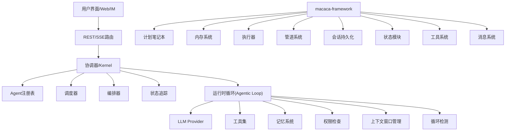

**图表来源**
- [ARCHITECTURE-v2.md:16-275](file://macaca/ARCHITECTURE-v2.md#L16-L275)
- [kernel.rs:1-136](file://macaca/crates/macaca-kernel/src/kernel.rs#L1-L136)
- [agentic_loop.rs:1-120](file://macaca/crates/macaca-runtime/src/agentic_loop.rs#L1-L120)

## 详细组件分析

### Agent生命周期与状态管理
- 生命周期阶段：Created → Running → Suspended → Terminated；动态活动状态：Idle、Thinking、Working、Error。
- 状态追踪：Kernel维护AgentRuntimeStatus，支持注册、更新状态、查询列表。
- 执行状态：execute_agent在执行前后分别标记Thinking与Idle；内部循环可进一步细化为工具执行、思考等状态（需在运行时事件中体现）。
- **新增** 计划执行：PlanNotebook支持复杂任务的自规划，包含子任务状态管理和进度跟踪。
- **新增** 会话持久化：ExecutionContext提供执行状态的持久化和恢复能力。

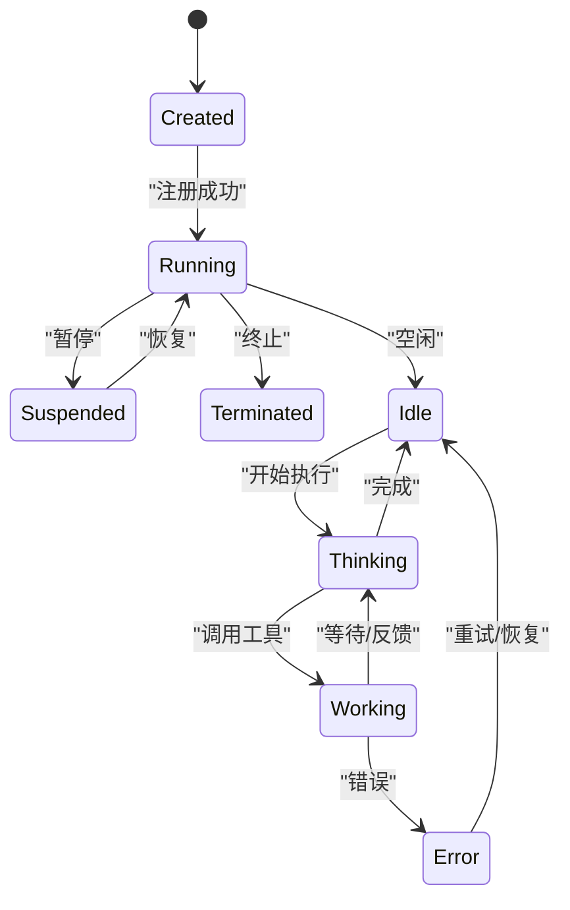

**图表来源**
- [types.rs:156-192](file://macaca/crates/macaca-proto/src/types.rs#L156-L192)
- [kernel.rs:62-84](file://macaca/crates/macaca-kernel/src/kernel.rs#L62-L84)

**章节来源**
- [types.rs:156-192](file://macaca/crates/macaca-proto/src/types.rs#L156-L192)
- [kernel.rs:40-84](file://macaca/crates/macaca-kernel/src/kernel.rs#L40-L84)

### Kernel协调器：注册、调度与执行
- 注册：register_agent将Agent注册到注册表，同时注册状态追踪并置为Running。
- 执行：execute_agent构建AgentServices（当前为空），调用Agent.run并更新状态。
- 调度：SimpleScheduler按能力匹配与运行状态选择Agent，支持回退策略。
- 编排：AgentOrchestrator管理跨Agent任务委托、并行执行与结果聚合，支持命令解析与最佳Agent匹配。

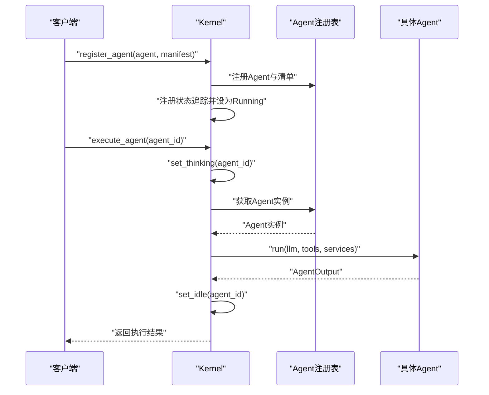

**图表来源**
- [kernel.rs:40-84](file://macaca/crates/macaca-kernel/src/kernel.rs#L40-L84)
- [scheduler.rs:31-84](file://macaca/crates/macaca-kernel/src/scheduler.rs#L31-L84)
- [orchestrator.rs:61-134](file://macaca/crates/macaca-kernel/src/orchestrator.rs#L61-L134)

**章节来源**
- [kernel.rs:40-136](file://macaca/crates/macaca-kernel/src/kernel.rs#L40-L136)
- [scheduler.rs:11-85](file://macaca/crates/macaca-kernel/src/scheduler.rs#L11-L85)
- [orchestrator.rs:24-186](file://macaca/crates/macaca-kernel/src/orchestrator.rs#L24-L186)

### Agent执行循环（Agentic Loop）工作原理
- 配置：max_iterations、tool_timeout等。
- 核心流程：构建带工具定义的LLM选项 → 调用LLM → 若无工具调用则结束 → 有工具调用则逐个执行并回传结果 → 循环直至上限或最终回复。
- 事件与追踪：支持事件通道推送Thinking/ToolCall/ToolResult/Assistant/Completed等事件；工具执行支持超时与TraceEvent流式转发。
- 安全与合规：LoopDetector防止死循环；PermissionChecker进行工具与路径/网络访问校验；ContextWindowManager控制上下文长度。

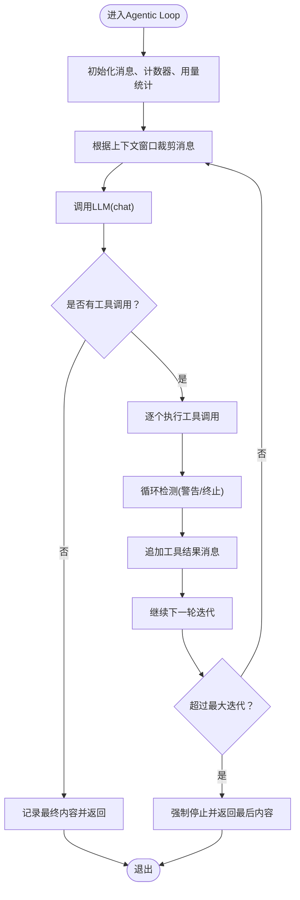

**图表来源**
- [agentic_loop.rs:203-278](file://macaca/crates/macaca-runtime/src/agentic_loop.rs#L203-L278)
- [agentic_loop.rs:350-498](file://macaca/crates/macaca-runtime/src/agentic_loop.rs#L350-L498)

**章节来源**
- [agentic_loop.rs:22-120](file://macaca/crates/macaca-runtime/src/agentic_loop.rs#L22-L120)
- [agentic_loop.rs:203-348](file://macaca/crates/macaca-runtime/src/agentic_loop.rs#L203-L348)
- [agentic_loop.rs:350-498](file://macaca/crates/macaca-runtime/src/agentic_loop.rs#L350-L498)

### ReActAgent框架实现
- 推理-行动循环：先将用户消息存入工作记忆，调用LLM生成响应；若无工具调用则作为最终回复；若有工具调用则逐一执行并将结果写回记忆。
- 可中断：支持CancellationToken在推理/行动过程中中断。
- 压缩与记忆：可选压缩器对记忆进行压缩；支持观察其他Agent的消息。

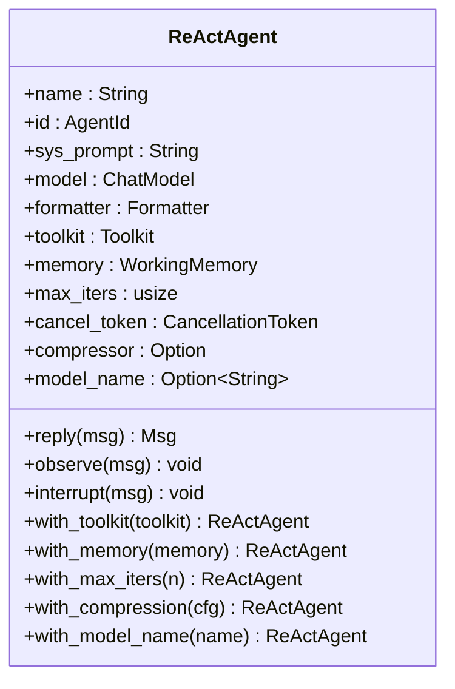

**图表来源**
- [react_agent.rs:37-112](file://macaca/crates/macaca-framework/src/react_agent.rs#L37-L112)
- [agent.rs:37-67](file://macaca/crates/macaca-framework/src/agent.rs#L37-L67)

**章节来源**
- [react_agent.rs:26-285](file://macaca/crates/macaca-framework/src/react_agent.rs#L26-L285)
- [agent.rs:31-67](file://macaca/crates/macaca-framework/src/agent.rs#L31-L67)

### 计划笔记本（PlanNotebook）
- 自我规划：支持将复杂目标分解为有序的子任务序列。
- 状态管理：单个活动计划，历史计划归档，支持恢复。
- 子任务约束：同一时间最多一个子任务处于进行中状态。
- 提示系统：根据当前状态生成指导消息，帮助Agent确定下一步行动。

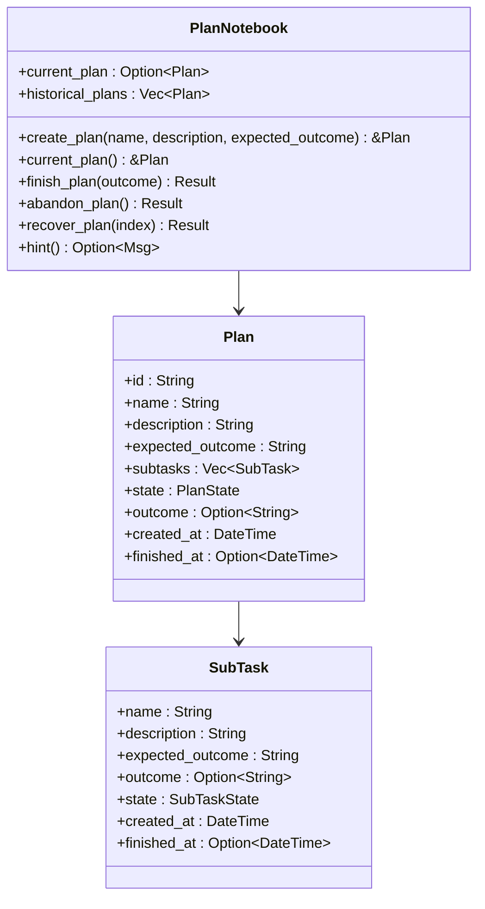

**图表来源**
- [plan.rs:306-448](file://macaca/crates/macaca-framework/src/plan.rs#L306-L448)
- [plan.rs:125-146](file://macaca/crates/macaca-framework/src/plan.rs#L125-L146)
- [plan.rs:34-51](file://macaca/crates/macaca-framework/src/plan.rs#L34-L51)

**章节来源**
- [plan.rs:1-800](file://macaca/crates/macaca-framework/src/plan.rs#L1-L800)

### 内存系统（Memory System）
- 工作记忆：会话内的消息存储，支持标签过滤、批量删除、标记更新。
- 长期记忆：跨会话的记忆存储，支持记录和检索。
- 压缩机制：自动压缩旧消息，保持上下文窗口效率。
- 状态持久化：支持内存状态的序列化和恢复。

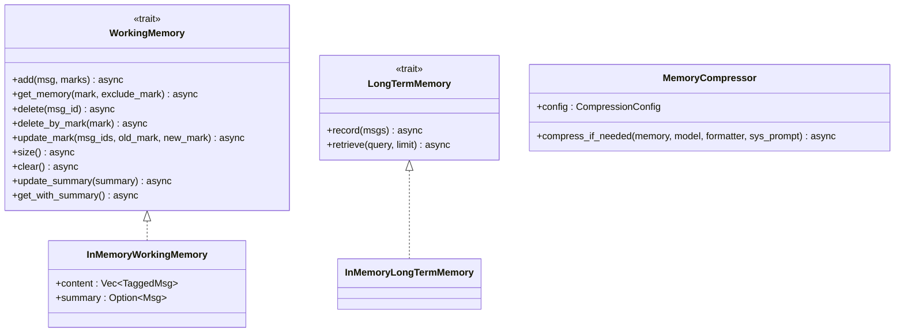

**图表来源**
- [memory.rs:45-84](file://macaca/crates/macaca-framework/src/memory.rs#L45-L84)
- [memory.rs:94-181](file://macaca/crates/macaca-framework/src/memory.rs#L94-L181)
- [memory.rs:317-344](file://macaca/crates/macaca-framework/src/memory.rs#L317-L344)
- [memory.rs:492-595](file://macaca/crates/macaca-framework/src/memory.rs#L492-L595)

**章节来源**
- [memory.rs:1-800](file://macaca/crates/macaca-framework/src/memory.rs#L1-L800)

### 执行器（ExecutionContext）
- 会话管理：跟踪执行会话的状态转换（运行、暂停、恢复、完成、错误、停止）。
- 持久化：支持执行状态的序列化和恢复。
- 时间戳：记录状态变更的时间信息。

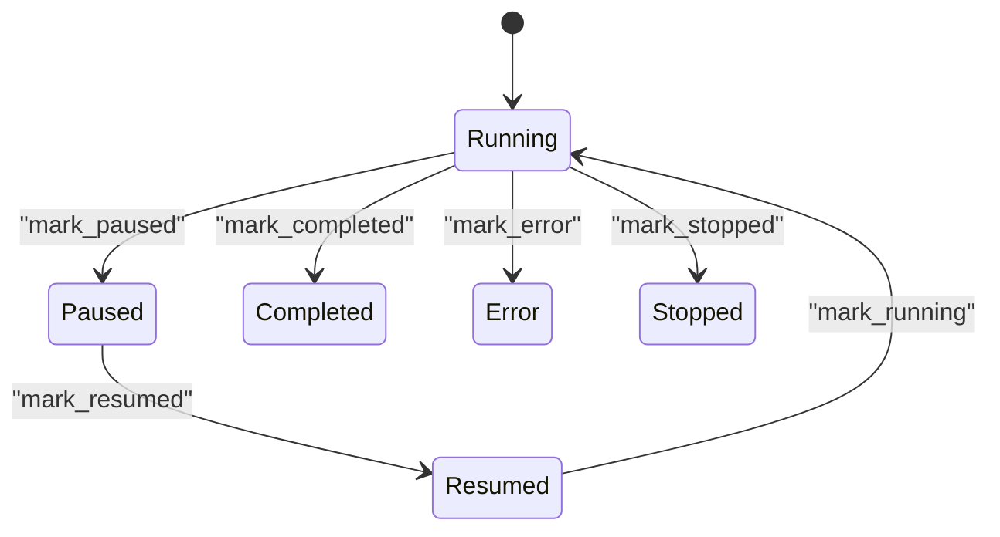

**图表来源**
- [execution.rs:14-21](file://macaca/crates/macaca-framework/src/execution.rs#L14-L21)
- [execution.rs:40-91](file://macaca/crates/macaca-framework/src/execution.rs#L40-L91)

**章节来源**
- [execution.rs:1-167](file://macaca/crates/macaca-framework/src/execution.rs#L1-L167)

### 管道系统（Pipeline System）
- 串行管道：Agent链式执行，前一个Agent的输出作为下一个Agent的输入。
- 扇出管道：广播消息给多个Agent，支持并行或顺序执行，返回第一个成功的结果。
- 消息中枢：多Agent圆桌讨论，每个Agent的回复广播给其他所有参与者。

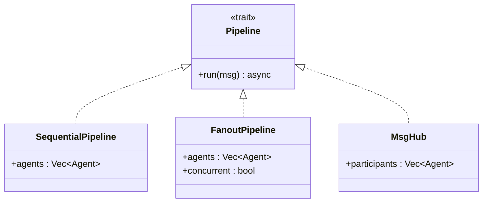

**图表来源**
- [pipeline.rs:22-25](file://macaca/crates/macaca-framework/src/pipeline.rs#L22-L25)
- [pipeline.rs:34-54](file://macaca/crates/macaca-framework/src/pipeline.rs#L34-L54)
- [pipeline.rs:67-102](file://macaca/crates/macaca-framework/src/pipeline.rs#L67-L102)
- [pipeline.rs:137-202](file://macaca/crates/macaca-framework/src/pipeline.rs#L137-L202)

**章节来源**
- [pipeline.rs:1-721](file://macaca/crates/macaca-framework/src/pipeline.rs#L1-L721)

### 工具系统（Toolkit System）
- 工具处理器：实现ToolHandler trait的工具组件。
- 中间件：ToolMiddleware提供横切关注点（日志、限流等）。
- 分组管理：ToolGroup支持工具的激活/停用。
- 预设参数：支持工具调用的预设参数合并。

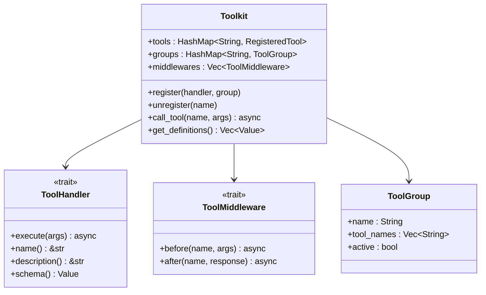

**图表来源**
- [tool.rs:197-401](file://macaca/crates/macaca-framework/src/tool.rs#L197-L401)
- [tool.rs:109-122](file://macaca/crates/macaca-framework/src/tool.rs#L109-L122)
- [tool.rs:133-143](file://macaca/crates/macaca-framework/src/tool.rs#L133-L143)
- [tool.rs:150-158](file://macaca/crates/macaca-framework/src/tool.rs#L150-L158)

**章节来源**
- [tool.rs:1-800](file://macaca/crates/macaca-framework/src/tool.rs#L1-L800)

### 消息系统（Rich Message System）
- 内容块：支持文本、思维、工具调用、工具结果、图像、音频、视频等多种内容类型。
- 角色系统：用户、助手、系统、工具四种角色。
- 元数据：支持结构化元数据存储。
- 序列化：完整的JSON序列化和反序列化支持。

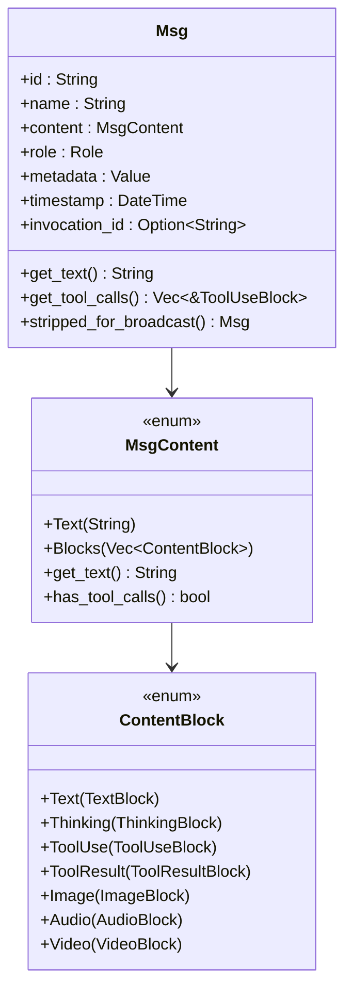

**图表来源**
- [message.rs:238-335](file://macaca/crates/macaca-framework/src/message.rs#L238-L335)
- [message.rs:117-124](file://macaca/crates/macaca-framework/src/message.rs#L117-L124)
- [message.rs:20-37](file://macaca/crates/macaca-framework/src/message.rs#L20-L37)

**章节来源**
- [message.rs:1-632](file://macaca/crates/macaca-framework/src/message.rs#L1-L632)

### 状态模块（StateModule）
- 自描述序列化：任何需要持久化的组件都实现StateModule trait。
- 递归序列化：自动包含嵌套的StateModule实现。
- 复合状态：支持多个子模块的状态组合。

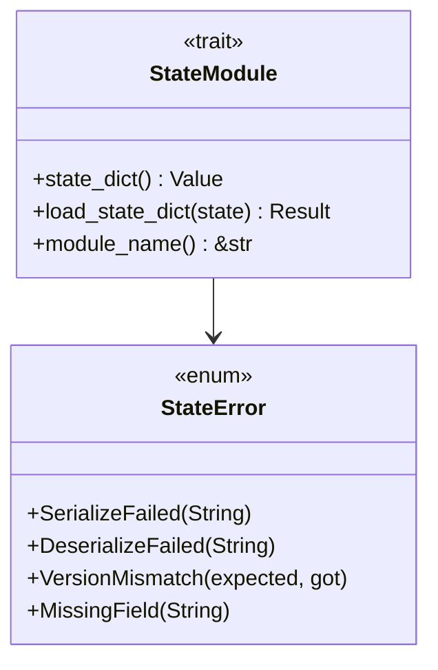

**图表来源**
- [state.rs:47-69](file://macaca/crates/macaca-framework/src/state.rs#L47-L69)
- [state.rs:71-89](file://macaca/crates/macaca-framework/src/state.rs#L71-L89)

**章节来源**
- [state.rs:1-308](file://macaca/crates/macaca-framework/src/state.rs#L1-L308)

### 会话持久化（Session Persistence）
- 会话存储：SessionStore trait提供会话状态的保存和加载。
- 内存存储：InMemorySessionStore支持分片锁提高并发性能。
- 辅助函数：save_module_state和load_module_state简化状态操作。

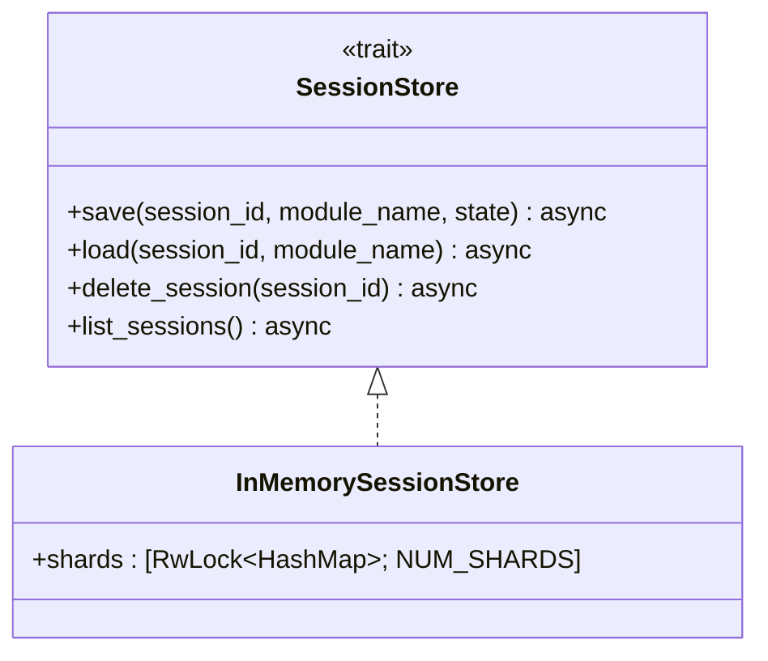

**图表来源**
- [session.rs:18-37](file://macaca/crates/macaca-framework/src/session.rs#L18-L37)
- [session.rs:43-113](file://macaca/crates/macaca-framework/src/session.rs#L43-L113)

**章节来源**
- [session.rs:1-393](file://macaca/crates/macaca-framework/src/session.rs#L1-L393)

### Agent抽象与服务注入
- Agent Trait：定义reply/observe/interrupt/name/id等核心方法。
- 服务注入：MemoryService/IpcService/PersistService三类可选服务，通过AgentServices在运行时注入。
- BasicAgent与AgentStateMachine：提供基础Agent实现与状态机封装。

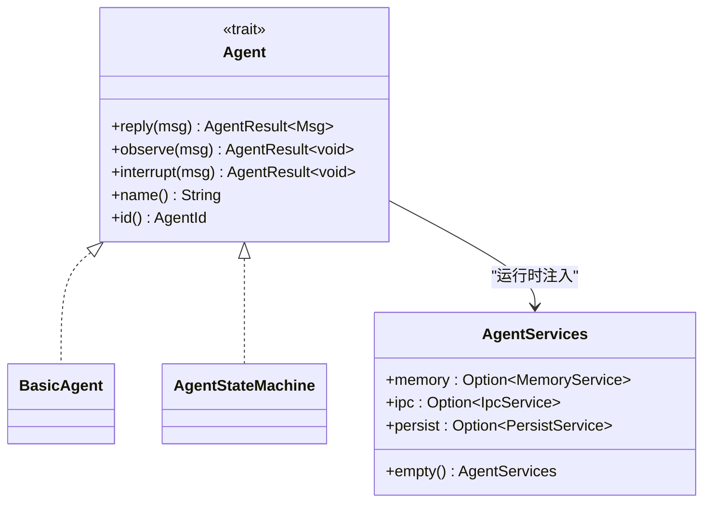

**图表来源**
- [agent.rs:58-77](file://macaca/crates/macaca-agent/src/agent.rs#L58-L77)
- [agent.rs:37-53](file://macaca/crates/macaca-agent/src/agent.rs#L37-L53)

**章节来源**
- [agent.rs:1-77](file://macaca/crates/macaca-agent/src/agent.rs#L1-L77)
- [lib.rs:1-15](file://macaca/crates/macaca-agent/src/lib.rs#L1-L15)

### 协议与类型系统
- 标识符：AgentId、TaskId、ApplicationId、ForkId、MemoryId、MessageId等。
- 状态与活动：AgentState（Created/Running/Suspended/Terminated）、AgentActivity（Idle/Working/Error/Thinking）。
- 权限模型：PermissionLevel（System/User）、Permission（allowed_tools/paths/network）。
- 任务与待办：Task/TaskStatus/TaskPriority、TodoItem/TodoStatus、TodoGoal/TodoGoalStatus。
- LLM消息与工具：LlmMessage/LlmOptions/LlmResponse、ToolCall/ToolDefinition。

**章节来源**
- [types.rs:7-131](file://macaca/crates/macaca-proto/src/types.rs#L7-L131)
- [types.rs:156-298](file://macaca/crates/macaca-proto/src/types.rs#L156-L298)
- [types.rs:300-527](file://macaca/crates/macaca-proto/src/types.rs#L300-L527)
- [types.rs:616-745](file://macaca/crates/macaca-proto/src/types.rs#L616-L745)

## 依赖分析
- 组件耦合：Kernel对Agent注册表、调度器、状态追踪与LLM/Tool提供方有直接依赖；运行时循环依赖LLM与工具集；框架Agent依赖运行时循环。
- 外部依赖：LLM抽象（OpenAI/Anthropic/DashScope等）、Driver框架（Shell/Filesystem/Claude Code等）、IPC（NATS）、记忆系统（向量/文件/会话层）。
- 可能的循环依赖：当前实现通过Trait与Arc共享避免直接循环；注意避免在Kernel中直接持有Agent内部状态引用。
- **新增** 框架依赖：macaca-framework为上层应用提供完整的Agent系统基础设施。

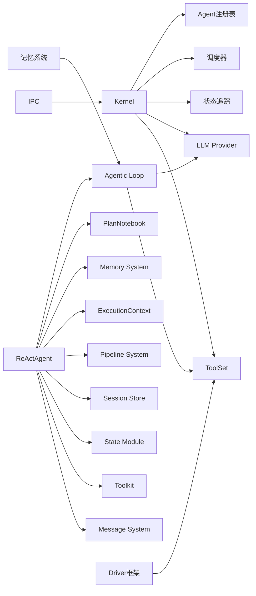

**图表来源**
- [lib.rs:14-29](file://macaca/crates/macaca-kernel/src/lib.rs#L14-L29)
- [lib.rs:1-15](file://macaca/crates/macaca-runtime/src/lib.rs#L1-L15)
- [lib.rs:1-32](file://macaca/crates/macaca-framework/src/lib.rs#L1-L32)

**章节来源**
- [lib.rs:1-29](file://macaca/crates/macaca-kernel/src/lib.rs#L1-L29)
- [lib.rs:1-15](file://macaca/crates/macaca-runtime/src/lib.rs#L1-L15)
- [lib.rs:1-32](file://macaca/crates/macaca-framework/src/lib.rs#L1-L32)

## 性能考虑
- 上下文窗口管理：ContextWindowManager在每次LLM调用前裁剪消息，避免超出模型上下文限制。
- 迭代上限与工具超时：max_iterations与tool_timeout防止无限循环与阻塞；LoopDetector可提前终止可疑循环。
- 并发与资源：Kernel通过注册表与调度器管理并发；建议为高负载场景配置合理的线程池与队列大小。
- 事件流与开销：事件通道（AgentExecutionEvent）用于实时追踪，但过多事件可能带来IO压力，应按需启用。
- **新增** 内存压缩：MemoryCompressor自动压缩旧消息，减少Token消耗。
- **新增** 分片存储：InMemorySessionStore使用分片锁提高并发性能。
- **新增** 工具中间件：中间件链可能影响性能，建议合理配置和监控。

## 故障排查指南
- Chat绕过Agent系统：当前实现post_chat直接调用LLM，导致状态始终为Idle且无工作流编排。应改为通过Coordinator Agent与Kernel.execute_agent执行。
- Agent内部状态未上报：AgenticLoop在工具执行与思考阶段应发出事件，确保状态追踪可见。
- Workflow引擎未集成：app.yaml中定义了workflow，但chat流程未触发，需实现WorkflowEngine并与Kernel集成。
- 权限与工具执行失败：检查Permission.allowed_tools/paths/network与PermissionChecker的实现；工具不存在或超时会返回错误。
- **新增** 计划执行异常：检查PlanNotebook的状态转换是否符合单个子任务进行中的约束。
- **新增** 内存访问问题：确认WorkingMemory的标签过滤和标记更新操作正确性。
- **新增** 会话恢复失败：验证StateModule的序列化和反序列化过程，检查版本兼容性。

**章节来源**
- [ARCHITECTURE-v2.md:569-600](file://macaca/ARCHITECTURE-v2.md#L569-L600)
- [agentic_loop.rs:350-498](file://macaca/crates/macaca-runtime/src/agentic_loop.rs#L350-L498)

## 结论
Agent OS通过清晰的分层架构与可插拔设计，提供了从用户交互到Agent协作的完整链路。Kernel负责注册、调度与状态管理，运行时循环驱动LLM与工具的迭代执行，框架Agent提供可扩展的推理-行动范式。**新增的macaca-framework框架进一步完善了系统架构，提供了计划笔记本、内存系统、执行器、管道系统、工具系统和消息系统等核心组件，支持复杂的多Agent协作和状态持久化需求。** 当前实现存在Chat绕过Agent、状态追踪不完整与Workflow未集成等问题，建议尽快修复以实现完整的Agent协作与可观测性。

## 附录

### Agent开发与配置最佳实践
- 权限设置
  - 使用Permission定义allowed_tools、allowed_paths与network_access，结合PermissionChecker在运行时校验。
  - 建议为不同Agent设定最小权限原则，避免过度授权。
- 资源限制
  - 设置RuntimeConfig.max_iterations与tool_timeout，防止长时间占用。
  - 使用ContextWindowManager控制上下文长度，避免Token溢出。
  - **新增** 配置MemoryCompressor的触发阈值和目标Token数，平衡性能和上下文质量。
- 错误处理
  - 在Agentic Loop中捕获工具超时与NotFound错误，记录事件并返回友好提示。
  - 使用LoopDetector识别潜在死循环，必要时终止并上报。
  - **新增** 实现PlanNotebook的错误处理，确保计划状态的一致性。
- 配置模板
  - 应用清单（L3声明式）：参考示例app-manifest.yaml，定义agents与workflows。
  - Agent清单字段：id、name、capabilities、permission、state、created_at、model等。
  - **新增** 复杂应用配置：参考fullstack-autodev的app.yaml，包含多Agent协作和工作流编排。
  - **新增** 工具配置：在Agent清单中定义allowed_tools和权限范围。
- **新增** 状态持久化
  - 使用StateModule实现组件的自动序列化。
  - 配置SessionStore进行会话状态的持久化。
  - 实现自定义的StateModule以支持复杂的数据结构。
- **新增** 多Agent协作
  - 使用SequentialPipeline进行链式任务处理。
  - 使用FanoutPipeline进行并行任务执行。
  - 使用MsgHub实现多Agent的圆桌讨论模式。
- **新增** 计划管理
  - 使用PlanNotebook进行复杂任务的自规划。
  - 实现子任务的状态管理和进度跟踪。
  - 利用hint()方法获取当前执行指导。