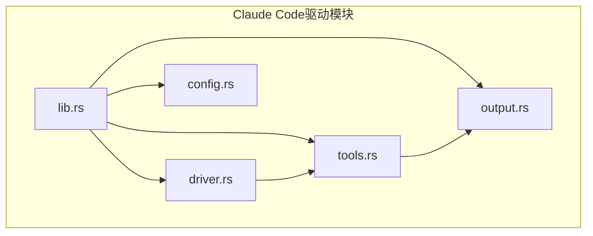
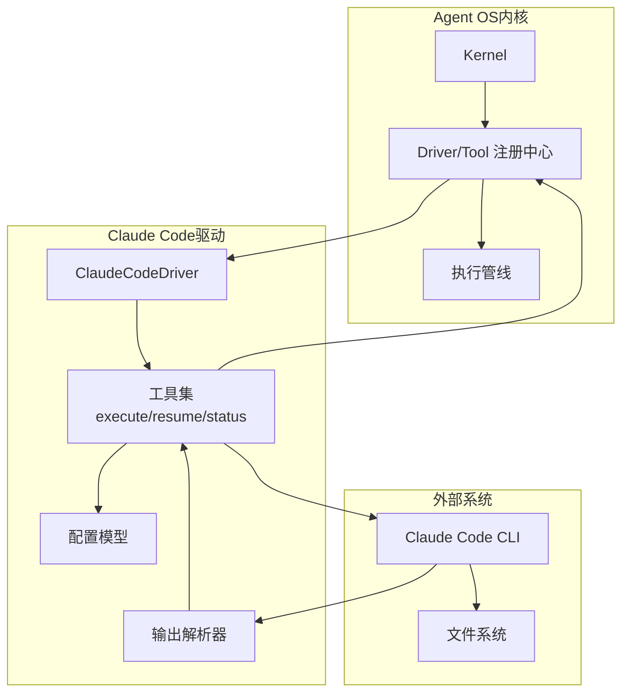
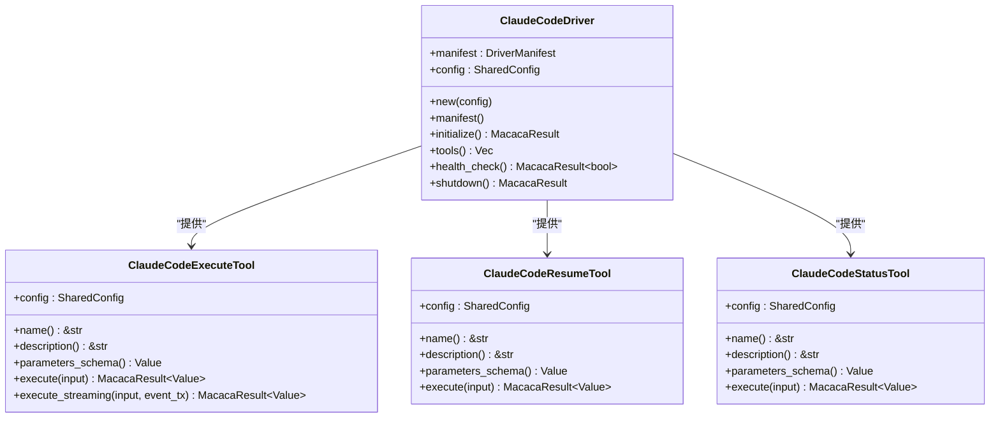
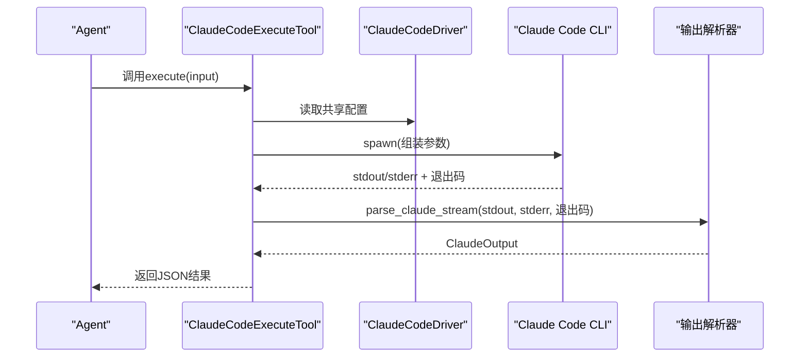
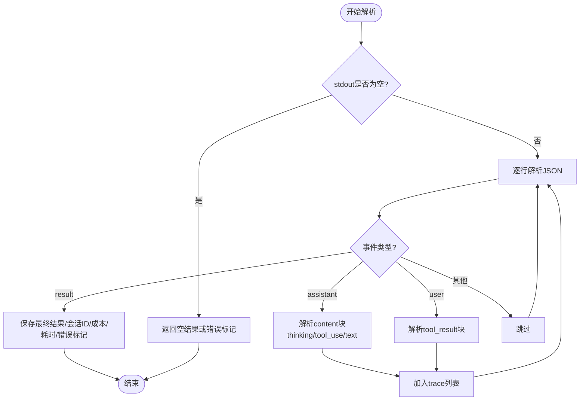
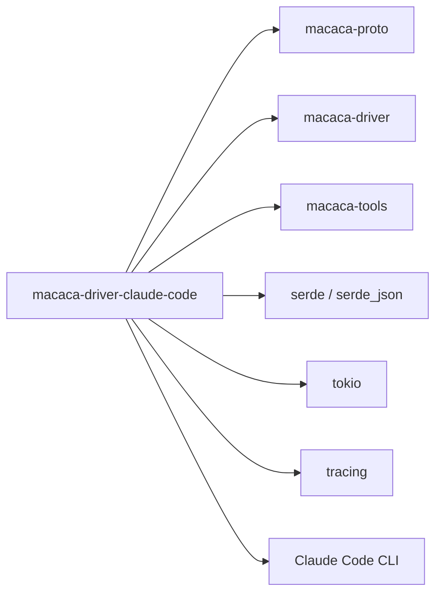

# Claude Code驱动

<cite>
**本文档引用的文件**
- [lib.rs](file://macaca/crates/macaca-driver-claude-code/src/lib.rs)
- [driver.rs](file://macaca/crates/macaca-driver-claude-code/src/driver.rs)
- [config.rs](file://macaca/crates/macaca-driver-claude-code/src/config.rs)
- [tools.rs](file://macaca/crates/macaca-driver-claude-code/src/tools.rs)
- [output.rs](file://macaca/crates/macaca-driver-claude-code/src/output.rs)
- [Cargo.toml](file://macaca/crates/macaca-driver-claude-code/Cargo.toml)
- [default.toml](file://macaca/config/default.toml)
- [code-gen-agent.yaml](file://macaca/examples/todo-app-demo/code-gen-agent.yaml)
- [code-review-agent.yaml](file://macaca/examples/custom-agent-yaml/code-review-agent.yaml)
- [README.md](file://macaca/README.md)
</cite>

## 目录
1. [简介](#简介)
2. [项目结构](#项目结构)
3. [核心组件](#核心组件)
4. [架构总览](#架构总览)
5. [详细组件分析](#详细组件分析)
6. [依赖关系分析](#依赖关系分析)
7. [性能考虑](#性能考虑)
8. [故障排除指南](#故障排除指南)
9. [结论](#结论)
10. [附录](#附录)

## 简介
本文件面向Claude Code驱动程序，系统性阐述其在Agent OS中的角色定位、与Claude AI平台的集成方式、代码生成与编辑能力实现、初始化流程、工具集管理以及MCP协议支持现状。同时，文档覆盖配置项、API限制、最佳实践，并提供代码审查、自动化编程与智能编辑等实际使用场景。

Claude Code驱动是Agent OS的一个用户可安装插件驱动，通过调用Claude Code CLI，将Claude的编程能力以工具形式暴露给Agent，从而实现自主编程任务的执行与追踪。

## 项目结构
该驱动位于Rust工作区的独立crate中，采用模块化组织：
- 驱动入口与导出：lib.rs
- 驱动主体：driver.rs（实现SoftwareDriver接口，注册工具）
- 配置模型：config.rs（驱动参数与权限模式）
- 工具实现：tools.rs（claude_code_execute、claude_code_resume、claude_code_status）
- 输出解析：output.rs（解析stream-json输出，构建TraceEvent与ClaudeOutput）

**图表来源**
- [lib.rs:1-13](file://macaca/crates/macaca-driver-claude-code/src/lib.rs#L1-L13)
- [driver.rs:1-175](file://macaca/crates/macaca-driver-claude-code/src/driver.rs#L1-L175)
- [config.rs:1-146](file://macaca/crates/macaca-driver-claude-code/src/config.rs#L1-L146)
- [tools.rs:1-649](file://macaca/crates/macaca-driver-claude-code/src/tools.rs#L1-L649)
- [output.rs:1-374](file://macaca/crates/macaca-driver-claude-code/src/output.rs#L1-L374)

**章节来源**
- [lib.rs:1-13](file://macaca/crates/macaca-driver-claude-code/src/lib.rs#L1-L13)
- [driver.rs:1-175](file://macaca/crates/macaca-driver-claude-code/src/driver.rs#L1-L175)
- [config.rs:1-146](file://macaca/crates/macaca-driver-claude-code/src/config.rs#L1-L146)
- [tools.rs:1-649](file://macaca/crates/macaca-driver-claude-code/src/tools.rs#L1-L649)
- [output.rs:1-374](file://macaca/crates/macaca-driver-claude-code/src/output.rs#L1-L374)

## 核心组件
- 驱动清单与生命周期
  - 驱动类型：CLI子进程驱动
  - 能力：execute_prompt、continue_session、check_status
  - 初始化：校验工作目录存在性，记录日志
  - 健康检查：调用claude --version，超时10秒
  - 关闭：记录日志
- 配置模型
  - 关键字段：claude_bin、work_dir、model、allowed_tools、max_turns、system_prompt、permission_mode、timeout_secs
  - 权限模式：Default（正常交互）、DangerouslySkipPermissions（跳过权限提示）
- 工具集
  - claude_code_execute：执行编程任务，支持会话续写、系统提示注入、模型选择、最大轮次、超时控制
  - claude_code_resume：基于session_id继续上一会话
  - claude_code_status：查询Claude CLI可用性与版本信息
- 输出解析
  - 解析stream-json流，提取thinking、tool_use、tool_result、text事件
  - 生成ClaudeOutput，包含最终结果、会话ID、成本、耗时、错误标记与完整trace

**章节来源**
- [driver.rs:37-121](file://macaca/crates/macaca-driver-claude-code/src/driver.rs#L37-L121)
- [config.rs:22-103](file://macaca/crates/macaca-driver-claude-code/src/config.rs#L22-L103)
- [tools.rs:26-266](file://macaca/crates/macaca-driver-claude-code/src/tools.rs#L26-L266)
- [output.rs:31-274](file://macaca/crates/macaca-driver-claude-code/src/output.rs#L31-L274)

## 架构总览
Claude Code驱动在Agent OS中的位置与交互如下：

**图表来源**
- [driver.rs:63-121](file://macaca/crates/macaca-driver-claude-code/src/driver.rs#L63-L121)
- [tools.rs:26-266](file://macaca/crates/macaca-driver-claude-code/src/tools.rs#L26-L266)
- [output.rs:49-250](file://macaca/crates/macaca-driver-claude-code/src/output.rs#L49-L250)

## 详细组件分析

### 驱动类与生命周期
- 结构体字段：manifest（驱动元数据）、config（共享配置）
- 生命周期方法：
  - initialize：检查工作目录，记录初始化信息
  - tools：返回三个工具实例
  - health_check：调用claude --version，带10秒超时
  - shutdown：记录关闭信息

**图表来源**
- [driver.rs:32-121](file://macaca/crates/macaca-driver-claude-code/src/driver.rs#L32-L121)
- [tools.rs:26-266](file://macaca/crates/macaca-driver-claude-code/src/tools.rs#L26-L266)

**章节来源**
- [driver.rs:32-121](file://macaca/crates/macaca-driver-claude-code/src/driver.rs#L32-L121)

### 工具执行流程（同步与异步）
- 同步执行：run_claude_cli
  - 组装命令行参数（prompt、output-format、verbose、resume、system-prompt、model、权限模式、max-turns、工作目录）
  - 设置超时、捕获stdout/stderr、解析输出
- 异步执行：run_claude_cli_streaming
  - 逐行读取stdout，解析JSON并发送TraceEvent
  - 超时时终止进程，返回超时错误

**图表来源**
- [tools.rs:66-136](file://macaca/crates/macaca-driver-claude-code/src/tools.rs#L66-L136)
- [tools.rs:272-347](file://macaca/crates/macaca-driver-claude-code/src/tools.rs#L272-L347)
- [output.rs:49-250](file://macaca/crates/macaca-driver-claude-code/src/output.rs#L49-L250)

**章节来源**
- [tools.rs:66-136](file://macaca/crates/macaca-driver-claude-code/src/tools.rs#L66-L136)
- [tools.rs:272-347](file://macaca/crates/macaca-driver-claude-code/src/tools.rs#L272-L347)
- [output.rs:49-250](file://macaca/crates/macaca-driver-claude-code/src/output.rs#L49-L250)

### 输出解析与Trace事件
- 支持事件类型：thinking、tool_use、tool_result、text
- 解析逻辑：遍历每行JSON，提取内容块，构建TraceEvent列表
- 最终结果：ClaudeOutput包含result、session_id、cost_usd、duration_ms、is_error、trace

**图表来源**
- [output.rs:49-250](file://macaca/crates/macaca-driver-claude-code/src/output.rs#L49-L250)

**章节来源**
- [output.rs:49-250](file://macaca/crates/macaca-driver-claude-code/src/output.rs#L49-L250)

### 配置模型与权限模式
- 默认二进制名："claude"
- 默认超时：300秒
- 权限模式：
  - Default：遵循Claude Code交互式权限提示
  - DangerouslySkipPermissions：调用--dangerously-skip-permissions参数
- 可选参数：model、allowed_tools、max_turns、system_prompt

**章节来源**
- [config.rs:22-103](file://macaca/crates/macaca-driver-claude-code/src/config.rs#L22-L103)

## 依赖关系分析
- 内部依赖
  - macaca-driver：驱动框架接口
  - macaca-tools：工具抽象与注册
  - macaca-proto：统一错误与结果类型
  - serde/serde_json：序列化与参数Schema
  - tokio：异步进程与IO
  - tracing：日志与调试
- 外部依赖
  - Claude Code CLI：作为子进程执行

**图表来源**
- [Cargo.toml:7-15](file://macaca/crates/macaca-driver-claude-code/Cargo.toml#L7-L15)

**章节来源**
- [Cargo.toml:1-18](file://macaca/crates/macaca-driver-claude-code/Cargo.toml#L1-L18)

## 性能考虑
- 超时控制：单次调用默认300秒，可通过配置调整；流式读取在超时时会终止子进程
- I/O处理：使用BufReader逐行读取stdout，避免阻塞；stderr单独收集
- 并发：配置使用Arc<RwLock<>>，工具间共享读取，避免重复解析
- 成本与耗时：输出包含cost_usd与duration_ms，便于成本与性能监控

[本节为通用指导，无需特定文件来源]

## 故障排除指南
- 健康检查失败
  - 现象：health_check返回false或超时
  - 排查：确认claude二进制路径正确、可执行权限、网络可达
  - 参考：[tools.rs:228-266](file://macaca/crates/macaca-driver-claude-code/src/tools.rs#L228-L266)
- 执行超时
  - 现象：返回超时错误
  - 排查：增大timeout_secs、检查工作目录权限、减少max_turns
  - 参考：[tools.rs:334-337](file://macaca/crates/macaca-driver-claude-code/src/tools.rs#L334-L337)
- 权限问题
  - 现象：交互式权限提示导致阻塞
  - 方案：设置dangerously_skip_permissions（谨慎使用）
  - 参考：[config.rs:8-20](file://macaca/crates/macaca-driver-claude-code/src/config.rs#L8-L20)
- 输出解析异常
  - 现象：无最终结果或trace不完整
  - 排查：检查CLI输出格式、确保使用--output-format stream-json
  - 参考：[output.rs:49-250](file://macaca/crates/macaca-driver-claude-code/src/output.rs#L49-L250)

**章节来源**
- [tools.rs:228-266](file://macaca/crates/macaca-driver-claude-code/src/tools.rs#L228-L266)
- [config.rs:8-20](file://macaca/crates/macaca-driver-claude-code/src/config.rs#L8-L20)
- [output.rs:49-250](file://macaca/crates/macaca-driver-claude-code/src/output.rs#L49-L250)

## 结论
Claude Code驱动通过标准化的CLI子进程接口，将Claude的编程能力安全地集成到Agent OS中。其设计强调：
- 明确的工具边界与参数Schema
- 完整的执行追踪与可观测性
- 可配置的权限模式与超时策略
- 与Agent OS内核的松耦合集成

在实际使用中，建议结合Agent配置与工作空间策略，合理设置模型、权限与超时，以获得稳定且高效的自动化编程体验。

[本节为总结，无需特定文件来源]

## 附录

### 使用场景与最佳实践
- 代码审查
  - 使用code-review-agent.yaml中的模板与模型，结合文件读取与shell工具进行静态分析
  - 参考：[code-review-agent.yaml:1-26](file://macaca/examples/custom-agent-yaml/code-review-agent.yaml#L1-L26)
- 自动化编程
  - 使用code-gen-agent.yaml中的模板，结合file_write与shell工具生成与编译代码
  - 参考：[code-gen-agent.yaml:1-26](file://macaca/examples/todo-app-demo/code-gen-agent.yaml#L1-L26)
- 智能编辑
  - 利用execute/resume工具的会话能力，配合system_prompt增强上下文
  - 参考：[tools.rs:26-266](file://macaca/crates/macaca-driver-claude-code/src/tools.rs#L26-L266)

**章节来源**
- [code-review-agent.yaml:1-26](file://macaca/examples/custom-agent-yaml/code-review-agent.yaml#L1-L26)
- [code-gen-agent.yaml:1-26](file://macaca/examples/todo-app-demo/code-gen-agent.yaml#L1-L26)
- [tools.rs:26-266](file://macaca/crates/macaca-driver-claude-code/src/tools.rs#L26-L266)

### 配置选项速览
- claude_bin：CLI二进制路径，默认"claude"
- work_dir：工作目录
- model：模型名称（如claude-sonnet-4-20250514）
- allowed_tools：允许的工具列表
- max_turns：最大对话轮次
- system_prompt：注入的系统提示
- permission_mode：权限模式（Default/DangerouslySkipPermissions）
- timeout_secs：单次调用超时（秒）

**章节来源**
- [config.rs:22-103](file://macaca/crates/macaca-driver-claude-code/src/config.rs#L22-L103)

### Agent OS全局配置参考
- 日志级别、网关、持久化、内存等配置项
- 参考：[default.toml:1-119](file://macaca/config/default.toml#L1-L119)

**章节来源**
- [default.toml:1-119](file://macaca/config/default.toml#L1-L119)

### 项目背景与目标
- 项目概述与系统目标
- 参考：[README.md:1-29](file://macaca/README.md#L1-L29)

**章节来源**
- [README.md:1-29](file://macaca/README.md#L1-L29)