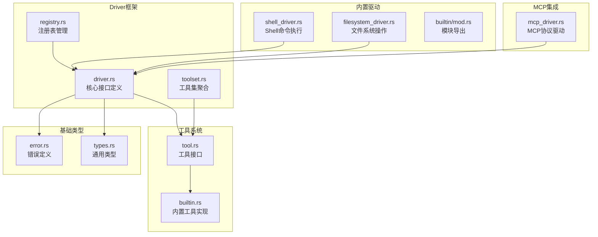
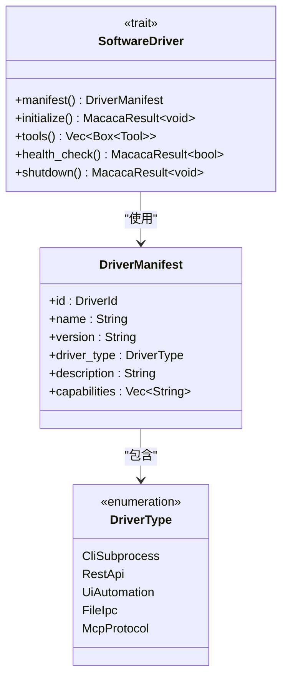
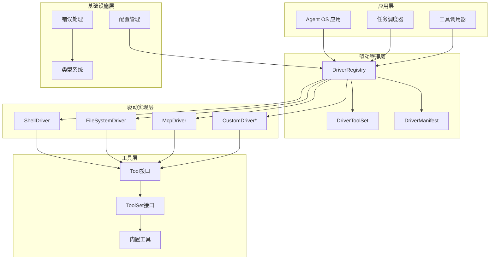
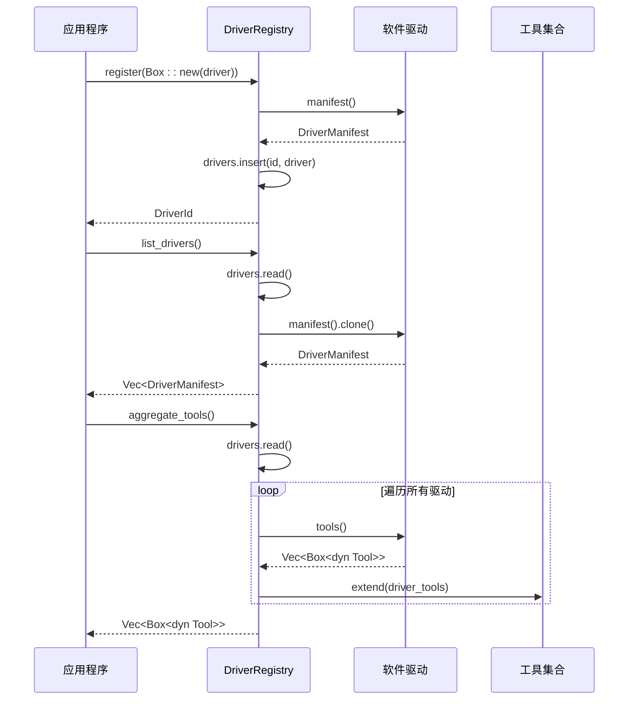
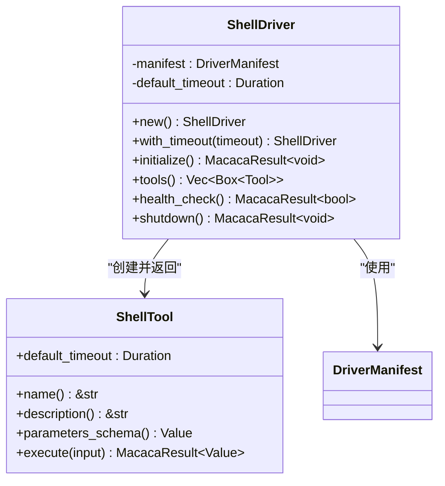
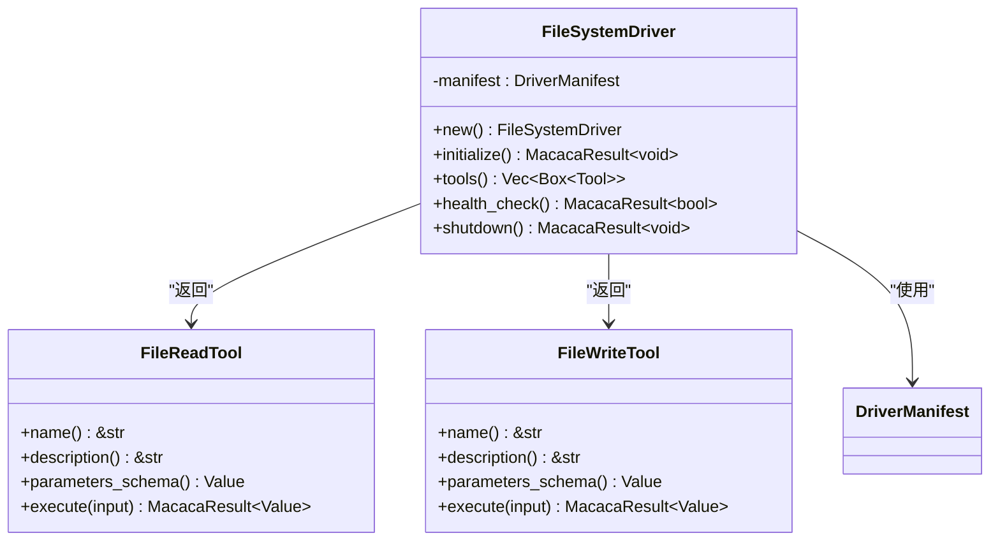
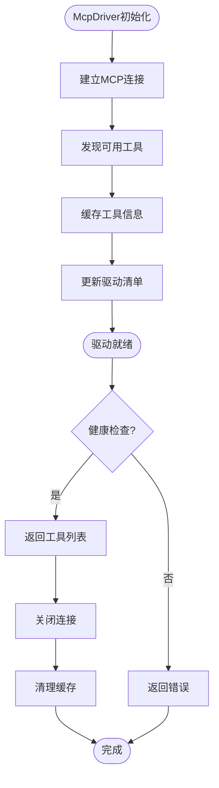
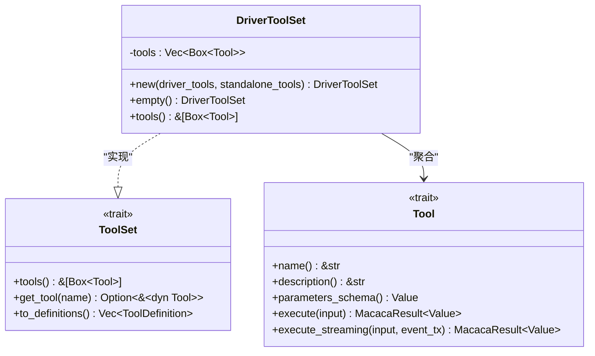
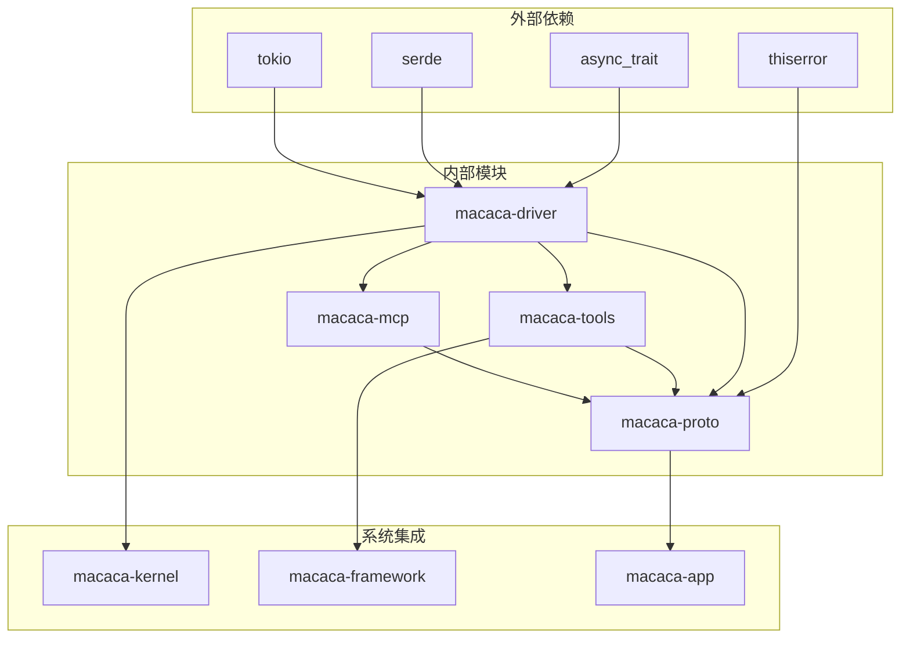
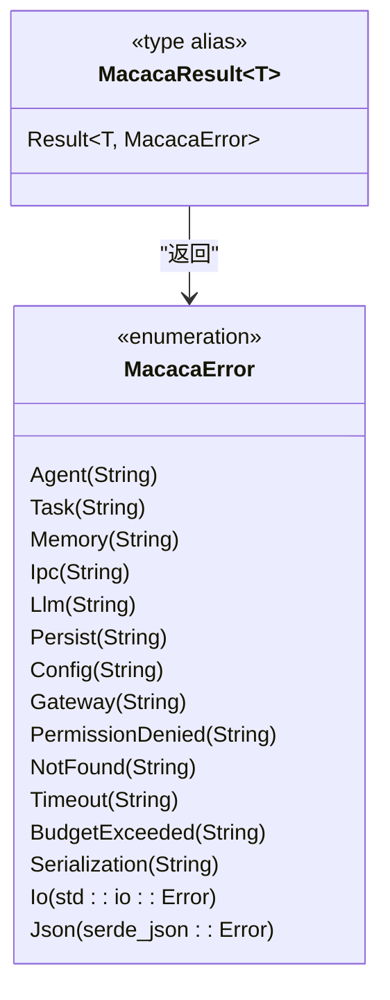

# Driver接口设计

<cite>
**本文档引用的文件**
- [driver.rs](file://macaca/crates/macaca-driver/src/driver.rs)
- [registry.rs](file://macaca/crates/macaca-driver/src/registry.rs)
- [toolset.rs](file://macaca/crates/macaca-driver/src/toolset.rs)
- [shell_driver.rs](file://macaca/crates/macaca-driver/src/builtin/shell_driver.rs)
- [filesystem_driver.rs](file://macaca/crates/macaca-driver/src/builtin/filesystem_driver.rs)
- [builtin/mod.rs](file://macaca/crates/macaca-driver/src/builtin/mod.rs)
- [driver.rs](file://macaca/crates/macaca-mcp/src/driver.rs)
- [tool.rs](file://macaca/crates/macaca-tools/src/tool.rs)
- [builtin.rs](file://macaca/crates/macaca-tools/src/builtin.rs)
- [error.rs](file://macaca/crates/macaca-proto/src/error.rs)
- [types.rs](file://macaca/crates/macaca-proto/src/types.rs)
</cite>

## 目录
1. [简介](#简介)
2. [项目结构](#项目结构)
3. [核心组件](#核心组件)
4. [架构概览](#架构概览)
5. [详细组件分析](#详细组件分析)
6. [依赖关系分析](#依赖关系分析)
7. [性能考虑](#性能考虑)
8. [故障排除指南](#故障排除指南)
9. [结论](#结论)

## 简介

Driver接口设计是Agent OS系统中软件驱动程序的核心抽象层。该设计提供了统一的接口来控制各种外部软件，包括CLI程序、REST API服务、GUI应用程序、文件系统操作和MCP协议服务器。通过标准化的生命周期管理和工具暴露模式，系统实现了对不同类型的软件控制的一致性抽象。

本设计的关键特性包括：
- 统一的SoftwareDriver trait接口
- 多种DriverType支持不同的交互方式
- 完整的生命周期管理
- 工具发现和暴露机制
- 错误处理和健康检查
- 注册表管理系统

## 项目结构

Driver框架位于macaca-driver crate中，采用模块化设计，将核心接口、注册表管理和内置驱动分离：

**图表来源**
- [driver.rs:1-73](file://macaca/crates/macaca-driver/src/driver.rs#L1-L73)
- [registry.rs:1-73](file://macaca/crates/macaca-driver/src/registry.rs#L1-L73)
- [toolset.rs:1-47](file://macaca/crates/macaca-driver/src/toolset.rs#L1-L47)

**章节来源**
- [driver.rs:1-73](file://macaca/crates/macaca-driver/src/driver.rs#L1-L73)
- [registry.rs:1-73](file://macaca/crates/macaca-driver/src/registry.rs#L1-L73)
- [toolset.rs:1-47](file://macaca/crates/macaca-driver/src/toolset.rs#L1-L47)

## 核心组件

### SoftwareDriver Trait

SoftwareDriver是所有驱动程序必须实现的核心trait，定义了完整的生命周期管理：

**图表来源**
- [driver.rs:34-61](file://macaca/crates/macaca-driver/src/driver.rs#L34-L61)

### 生命周期管理

驱动程序遵循严格的生命周期模式：

1. **注册阶段**：通过DriverRegistry.register()注册到系统
2. **初始化阶段**：调用initialize()启动连接或进程
3. **工具暴露**：通过tools()方法提供可用工具
4. **健康检查**：定期执行health_check()监控状态
5. **关闭阶段**：调用shutdown()进行清理

**章节来源**
- [driver.rs:39-44](file://macaca/crates/macaca-driver/src/driver.rs#L39-L44)

## 架构概览

Driver系统采用分层架构设计，确保了高度的模块化和可扩展性：

**图表来源**
- [registry.rs:12-17](file://macaca/crates/macaca-driver/src/registry.rs#L12-L17)
- [toolset.rs:7-9](file://macaca/crates/macaca-driver/src/toolset.rs#L7-L9)

## 详细组件分析

### DriverType枚举详解

DriverType定义了五种不同的驱动类型，每种类型对应特定的交互模式：

#### CliSubprocess类型
用于控制通过子进程交互的CLI程序：
- **特点**：直接启动外部进程，通过标准输入输出通信
- **适用场景**：Shell命令、编译器、版本控制系统等
- **实现要点**：需要处理进程生命周期、超时控制、错误捕获

#### RestApi类型
用于通过HTTP REST API控制远程服务：
- **特点**：基于JSON请求响应协议
- **适用场景**：Web服务、云API、微服务等
- **实现要点**：需要处理认证、重试机制、连接池

#### UiAutomation类型
用于自动化GUI应用程序：
- **特点**：通过系统级UI自动化接口控制
- **适用场景**：桌面应用、浏览器自动化、移动应用测试
- **实现要点**：需要处理跨平台兼容性和权限管理

#### FileIpc类型
用于通过文件系统进行进程间通信：
- **特点**：基于文件读写和管道通信
- **适用场景**：日志记录、配置管理、批量数据处理
- **实现要点**：需要处理文件锁、同步机制

#### McpProtocol类型
用于连接MCP（Model Context Protocol）服务器：
- **特点**：遵循MCP标准协议的AI工具集成
- **适用场景**：AI助手、智能代理、上下文感知工具
- **实现要点**：需要实现MCP协议规范和工具发现机制

**章节来源**
- [driver.rs:8-21](file://macaca/crates/macaca-driver/src/driver.rs#L8-L21)

### DriverRegistry注册机制

DriverRegistry提供了线程安全的驱动程序管理功能：

**图表来源**
- [registry.rs:26-66](file://macaca/crates/macaca-driver/src/registry.rs#L26-L66)

**章节来源**
- [registry.rs:12-73](file://macaca/crates/macaca-driver/src/registry.rs#L12-L73)

### 内置驱动实现

#### ShellDriver实现

ShellDriver是最简单的驱动实现，直接包装ShellTool：

**图表来源**
- [shell_driver.rs:14-74](file://macaca/crates/macaca-driver/src/builtin/shell_driver.rs#L14-L74)

#### FileSystemDriver实现

FileSystemDriver提供文件读写能力：

**图表来源**
- [filesystem_driver.rs:13-62](file://macaca/crates/macaca-driver/src/builtin/filesystem_driver.rs#L13-L62)

**章节来源**
- [shell_driver.rs:14-74](file://macaca/crates/macaca-driver/src/builtin/shell_driver.rs#L14-L74)
- [filesystem_driver.rs:13-62](file://macaca/crates/macaca-driver/src/builtin/filesystem_driver.rs#L13-L62)

### MCP驱动实现

McpDriver展示了复杂驱动的实现模式：

**图表来源**
- [driver.rs:57-117](file://macaca/crates/macaca-mcp/src/driver.rs#L57-L117)

**章节来源**
- [driver.rs:20-118](file://macaca/crates/macaca-mcp/src/driver.rs#L20-L118)

### 工具暴露模式

DriverToolSet提供了统一的工具聚合机制：

**图表来源**
- [toolset.rs:7-29](file://macaca/crates/macaca-driver/src/toolset.rs#L7-L29)

**章节来源**
- [toolset.rs:1-47](file://macaca/crates/macaca-driver/src/toolset.rs#L1-L47)
- [tool.rs:46-65](file://macaca/crates/macaca-tools/src/tool.rs#L46-L65)

## 依赖关系分析

Driver系统的设计遵循了清晰的依赖层次：

**图表来源**
- [driver.rs:1-7](file://macaca/crates/macaca-driver/src/driver.rs#L1-L7)
- [error.rs:1-49](file://macaca/crates/macaca-proto/src/error.rs#L1-L49)

**章节来源**
- [driver.rs:1-7](file://macaca/crates/macaca-driver/src/driver.rs#L1-L7)
- [error.rs:1-52](file://macaca/crates/macaca-proto/src/error.rs#L1-L52)

## 性能考虑

### 异步处理最佳实践

1. **非阻塞I/O**：所有网络和文件操作都应使用异步API
2. **连接池管理**：对于REST API驱动，实现连接复用
3. **超时控制**：为所有外部调用设置合理的超时时间
4. **并发限制**：避免过度并发导致资源耗尽

### 资源管理策略

1. **生命周期管理**：确保每个驱动都有明确的初始化和清理流程
2. **内存优化**：避免在tools()方法中创建昂贵的对象
3. **缓存策略**：合理缓存工具信息和连接状态
4. **错误恢复**：实现自动重连和降级策略

### 性能优化建议

1. **延迟初始化**：只在真正需要时才建立外部连接
2. **批量操作**：合并多个小操作以减少开销
3. **流式处理**：对于大文件操作使用流式API
4. **监控指标**：添加性能监控和日志记录

## 故障排除指南

### 常见错误类型

系统使用统一的错误处理机制：

**图表来源**
- [error.rs:3-51](file://macaca/crates/macaca-proto/src/error.rs#L3-L51)

### 错误处理策略

1. **具体错误分类**：根据错误类型采取不同的处理策略
2. **重试机制**：对临时性错误实现指数退避重试
3. **降级处理**：在部分功能失效时提供替代方案
4. **日志记录**：详细记录错误信息便于调试

**章节来源**
- [error.rs:1-52](file://macaca/crates/macaca-proto/src/error.rs#L1-L52)

### 调试技巧

1. **健康检查**：定期运行health_check()验证驱动状态
2. **日志级别**：使用适当的日志级别区分问题严重程度
3. **监控指标**：跟踪关键性能指标如响应时间、成功率
4. **测试覆盖**：为每个驱动编写单元测试和集成测试

## 结论

Driver接口设计成功地实现了以下目标：

1. **统一抽象**：通过SoftwareDriver trait提供了统一的接口
2. **灵活扩展**：支持多种驱动类型和自定义实现
3. **可靠管理**：完善的生命周期管理和错误处理机制
4. **高效集成**：与工具系统无缝集成，提供一致的用户体验

该设计为Agent OS系统提供了强大的软件控制能力，支持从简单的CLI工具到复杂的MCP协议服务器等各种应用场景。通过模块化设计和清晰的依赖关系，系统具有良好的可维护性和可扩展性。

未来可以考虑的改进方向包括：
- 更丰富的驱动类型支持
- 增强的监控和诊断功能
- 更智能的错误恢复机制
- 优化的性能监控指标