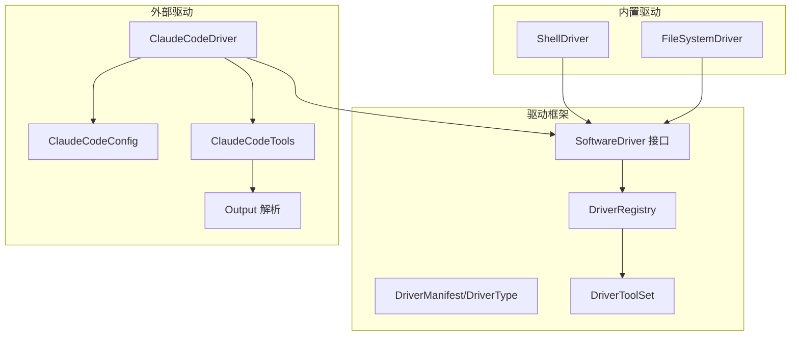
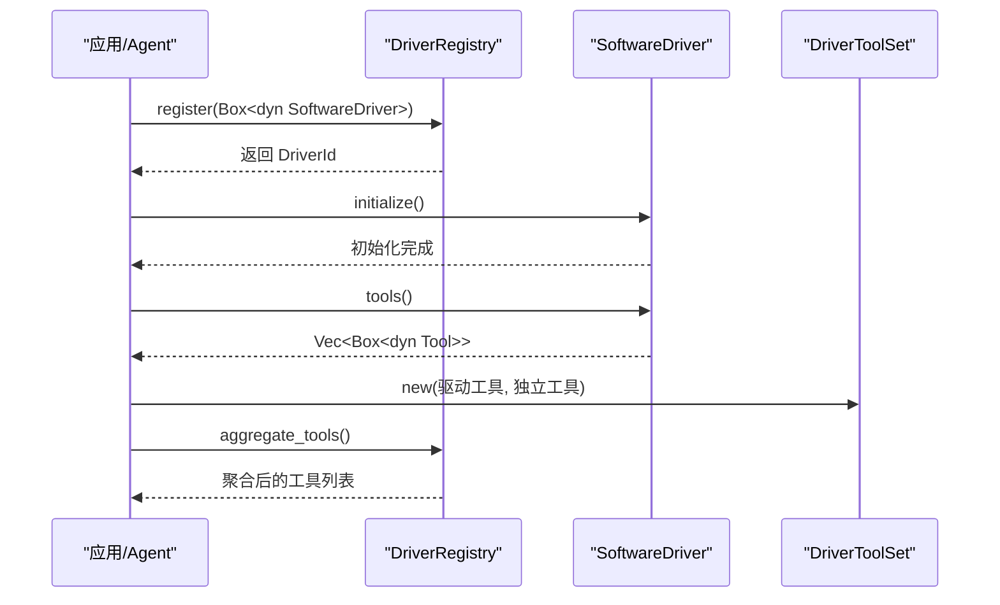
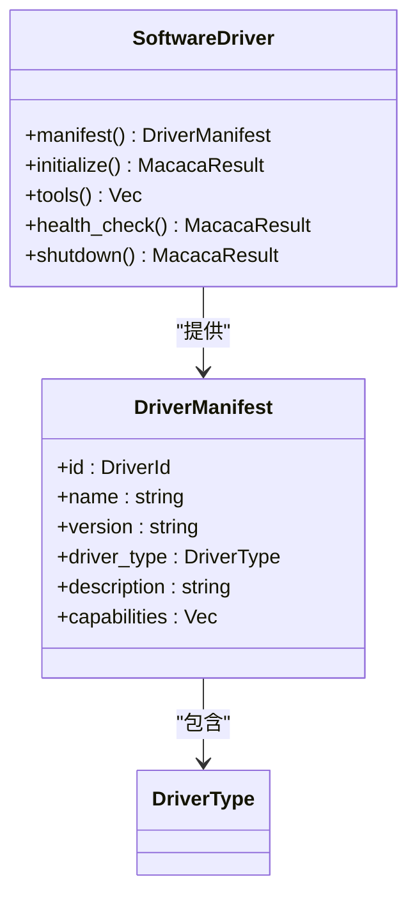
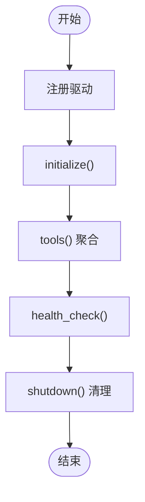
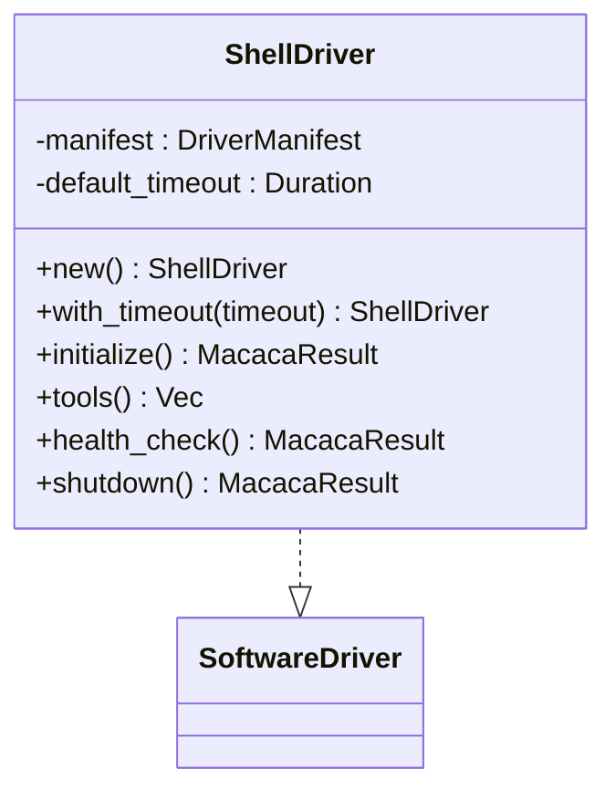
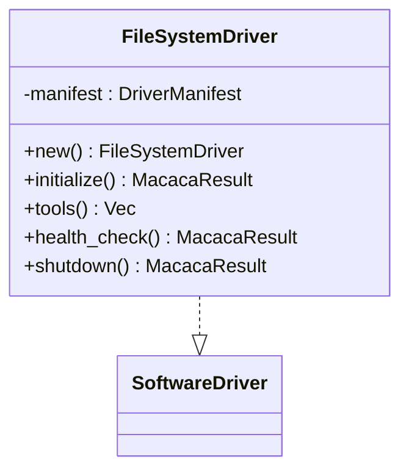
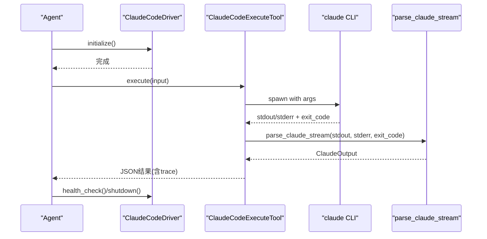
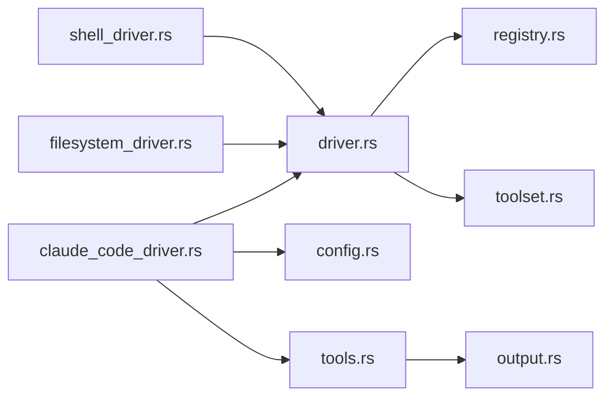

# Driver框架

<cite>
**本文引用的文件**
- [driver.rs](file://macaca/crates/macaca-driver/src/driver.rs)
- [lib.rs](file://macaca/crates/macaca-driver/src/lib.rs)
- [registry.rs](file://macaca/crates/macaca-driver/src/registry.rs)
- [toolset.rs](file://macaca/crates/macaca-driver/src/toolset.rs)
- [builtin/mod.rs](file://macaca/crates/macaca-driver/src/builtin/mod.rs)
- [shell_driver.rs](file://macaca/crates/macaca-driver/src/builtin/shell_driver.rs)
- [filesystem_driver.rs](file://macaca/crates/macaca-driver/src/builtin/filesystem_driver.rs)
- [driver.rs](file://macaca/crates/macaca-driver-claude-code/src/driver.rs)
- [config.rs](file://macaca/crates/macaca-driver-claude-code/src/config.rs)
- [tools.rs](file://macaca/crates/macaca-driver-claude-code/src/tools.rs)
- [output.rs](file://macaca/crates/macaca-driver-claude-code/src/output.rs)
- [lib.rs](file://macaca/crates/macaca-driver-claude-code/src/lib.rs)
- [ARCHITECTURE-v2.md](file://macaca/ARCHITECTURE-v2.md)
</cite>

## 目录
1. [简介](#简介)
2. [项目结构](#项目结构)
3. [核心组件](#核心组件)
4. [架构总览](#架构总览)
5. [详细组件分析](#详细组件分析)
6. [依赖关系分析](#依赖关系分析)
7. [性能考量](#性能考量)
8. [故障排查指南](#故障排查指南)
9. [结论](#结论)
10. [附录：自定义Driver开发指南](#附录自定义driver开发指南)

## 简介
本文件系统性地文档化了Driver框架的设计与实现，涵盖统一驱动接口、生命周期管理、错误处理机制，内置Shell与文件系统驱动，Claude Code驱动的特殊实现（代码生成、编辑与版本控制），以及自定义Driver的开发流程、配置管理与测试方法，并提供Driver选择策略、性能优化建议与安全最佳实践。

## 项目结构
Driver框架位于独立的Rust子crate中，采用模块化组织：
- 核心接口与类型：SoftwareDriver、DriverManifest、DriverType
- 注册中心：DriverRegistry，负责驱动的动态注册、聚合工具与健康检查
- 工具集：DriverToolSet，将多驱动与独立工具统一为ToolSet
- 内置驱动：ShellDriver、FileSystemDriver
- 外部插件驱动：ClaudeCodeDriver（用户安装的插件）

**图表来源**
- [driver.rs:34-61](file://macaca/crates/macaca-driver/src/driver.rs#L34-L61)
- [registry.rs:12-67](file://macaca/crates/macaca-driver/src/registry.rs#L12-L67)
- [toolset.rs:1-29](file://macaca/crates/macaca-driver/src/toolset.rs#L1-L29)
- [shell_driver.rs:14-74](file://macaca/crates/macaca-driver/src/builtin/shell_driver.rs#L14-L74)
- [filesystem_driver.rs:13-62](file://macaca/crates/macaca-driver/src/builtin/filesystem_driver.rs#L13-L62)
- [driver.rs:18-121](file://macaca/crates/macaca-driver-claude-code/src/driver.rs#L18-L121)
- [config.rs:22-103](file://macaca/crates/macaca-driver-claude-code/src/config.rs#L22-L103)
- [tools.rs:26-266](file://macaca/crates/macaca-driver-claude-code/src/tools.rs#L26-L266)
- [output.rs:31-47](file://macaca/crates/macaca-driver-claude-code/src/output.rs#L31-L47)

**章节来源**
- [lib.rs:1-15](file://macaca/crates/macaca-driver/src/lib.rs#L1-L15)
- [builtin/mod.rs:1-8](file://macaca/crates/macaca-driver/src/builtin/mod.rs#L1-L8)

## 核心组件
- SoftwareDriver接口：定义驱动元数据、初始化、工具暴露、健康检查与优雅关闭的生命周期方法。
- DriverType枚举：抽象不同驱动的交互方式（CLI子进程、REST、UI自动化、文件/IPC、MCP协议）。
- DriverManifest：驱动的标识、名称、版本、类型、描述与能力列表。
- DriverRegistry：线程安全的驱动注册中心，支持注册、注销、列举、聚合工具。
- DriverToolSet：将来自各驱动与独立工具的集合统一为ToolSet，供上层使用。

**章节来源**
- [driver.rs:8-61](file://macaca/crates/macaca-driver/src/driver.rs#L8-L61)
- [registry.rs:12-67](file://macaca/crates/macaca-driver/src/registry.rs#L12-L67)
- [toolset.rs:1-29](file://macaca/crates/macaca-driver/src/toolset.rs#L1-L29)

## 架构总览
Driver框架通过统一的SoftwareDriver接口将外部系统能力抽象为Tool，再由DriverRegistry进行集中管理与聚合，最终形成统一的ToolSet供Agent内核使用。Claude Code驱动作为用户安装的插件，通过CLI封装提供代码生成、编辑与会话管理能力；内置驱动（Shell、文件系统）提供基础能力。

**图表来源**
- [registry.rs:26-66](file://macaca/crates/macaca-driver/src/registry.rs#L26-L66)
- [driver.rs:46-61](file://macaca/crates/macaca-driver/src/driver.rs#L46-L61)
- [toolset.rs:11-29](file://macaca/crates/macaca-driver/src/toolset.rs#L11-L29)

**章节来源**
- [ARCHITECTURE-v2.md:118-139](file://macaca/ARCHITECTURE-v2.md#L118-L139)

## 详细组件分析

### SoftwareDriver接口与生命周期
- 元数据：manifest返回DriverManifest，用于发现与管理。
- 初始化：initialize启动子进程或建立连接。
- 工具暴露：tools返回一组Tool实例，统一接入Agent工具系统。
- 健康检查：health_check用于运行时健康评估。
- 优雅关闭：shutdown清理资源，终止子进程或断开连接。

**图表来源**
- [driver.rs:24-61](file://macaca/crates/macaca-driver/src/driver.rs#L24-L61)

**章节来源**
- [driver.rs:34-61](file://macaca/crates/macaca-driver/src/driver.rs#L34-L61)

### DriverRegistry：驱动注册与工具聚合
- 提供register/unregister/list/count等管理能力。
- aggregate_tools遍历已注册驱动，收集其工具，形成统一工具集。

**图表来源**
- [registry.rs:19-66](file://macaca/crates/macaca-driver/src/registry.rs#L19-L66)

**章节来源**
- [registry.rs:12-67](file://macaca/crates/macaca-driver/src/registry.rs#L12-L67)

### DriverToolSet：工具集合并
- 将来自驱动与独立工具的集合合并为统一的ToolSet，便于上层使用。

**章节来源**
- [toolset.rs:1-29](file://macaca/crates/macaca-driver/src/toolset.rs#L1-L29)

### 内置驱动：ShellDriver
- 驱动类型：CliSubprocess
- 能力：执行shell命令
- 配置：支持设置默认超时
- 生命周期：初始化无需资源，健康检查在Unix系统恒为true

**图表来源**
- [shell_driver.rs:14-74](file://macaca/crates/macaca-driver/src/builtin/shell_driver.rs#L14-L74)

**章节来源**
- [shell_driver.rs:14-74](file://macaca/crates/macaca-driver/src/builtin/shell_driver.rs#L14-L74)

### 内置驱动：FileSystemDriver
- 驱动类型：FileIpc
- 能力：文件读写
- 生命周期：无外部资源，初始化与健康检查均为可用

**图表来源**
- [filesystem_driver.rs:13-62](file://macaca/crates/macaca-driver/src/builtin/filesystem_driver.rs#L13-L62)

**章节来源**
- [filesystem_driver.rs:13-62](file://macaca/crates/macaca-driver/src/builtin/filesystem_driver.rs#L13-L62)

### Claude Code驱动：特殊实现
- 驱动类型：CliSubprocess
- 能力：执行提示、继续会话、状态检查
- 配置：ClaudeCodeConfig，支持模型、权限模式、超时、工作目录、允许工具、最大轮次、系统提示等
- 工具：claude_code_execute、claude_code_resume、claude_code_status
- 输出解析：parse_claude_stream将stream-json输出解析为TraceEvent/ClaudeOutput，支持跟踪事件流

**图表来源**
- [driver.rs:63-121](file://macaca/crates/macaca-driver-claude-code/src/driver.rs#L63-L121)
- [tools.rs:66-136](file://macaca/crates/macaca-driver-claude-code/src/tools.rs#L66-L136)
- [output.rs:49-250](file://macaca/crates/macaca-driver-claude-code/src/output.rs#L49-L250)

**章节来源**
- [driver.rs:18-121](file://macaca/crates/macaca-driver-claude-code/src/driver.rs#L18-L121)
- [config.rs:22-103](file://macaca/crates/macaca-driver-claude-code/src/config.rs#L22-L103)
- [tools.rs:26-266](file://macaca/crates/macaca-driver-claude-code/src/tools.rs#L26-L266)
- [output.rs:31-274](file://macaca/crates/macaca-driver-claude-code/src/output.rs#L31-L274)

## 依赖关系分析
- Driver框架依赖macaca_tools::Tool接口以统一能力抽象。
- Claude Code驱动依赖macaca_proto的错误与结果类型，Tokio异步运行时，以及内部output解析模块。
- DriverRegistry持有动态分发的SoftwareDriver，实现松耦合与可扩展。

**图表来源**
- [driver.rs:1-10](file://macaca/crates/macaca-driver/src/driver.rs#L1-L10)
- [registry.rs:1-10](file://macaca/crates/macaca-driver/src/registry.rs#L1-L10)
- [toolset.rs:1-3](file://macaca/crates/macaca-driver/src/toolset.rs#L1-L3)
- [shell_driver.rs:1-12](file://macaca/crates/macaca-driver/src/builtin/shell_driver.rs#L1-L12)
- [filesystem_driver.rs:1-11](file://macaca/crates/macaca-driver/src/builtin/filesystem_driver.rs#L1-L11)
- [driver.rs:1-16](file://macaca/crates/macaca-driver-claude-code/src/driver.rs#L1-L16)
- [config.rs:1-5](file://macaca/crates/macaca-driver-claude-code/src/config.rs#L1-L5)
- [tools.rs:1-17](file://macaca/crates/macaca-driver-claude-code/src/tools.rs#L1-L17)
- [output.rs:1-9](file://macaca/crates/macaca-driver-claude-code/src/output.rs#L1-L9)

**章节来源**
- [lib.rs:1-15](file://macaca/crates/macaca-driver/src/lib.rs#L1-L15)
- [lib.rs:1-13](file://macaca/crates/macaca-driver-claude-code/src/lib.rs#L1-L13)

## 性能考量
- 异步执行：所有驱动与工具均基于Tokio异步运行时，避免阻塞。
- 超时控制：Claude Code工具支持超时，防止长时间阻塞；DriverRegistry与工具系统也提供超时配置点。
- 流式输出：Claude Code支持流式解析，边读边解析，降低内存占用并提升可观测性。
- 资源复用：DriverRegistry持有共享句柄，减少重复初始化成本。
- I/O优化：Shell与文件系统驱动尽量使用系统默认行为，减少额外封装开销。

[本节为通用指导，不直接分析具体文件]

## 故障排查指南
- 健康检查失败
  - Shell/文件系统驱动通常恒为健康，若出现异常需检查平台环境。
  - Claude Code驱动通过执行“--version”进行健康检查，超时或非零退出视为不可用。
- 工具参数缺失
  - Claude Code工具要求必要参数（如prompt、session_id），缺少时返回错误。
- 超时问题
  - Claude Code工具支持超时配置，可通过配置调整；流式执行在超时时会尝试杀死子进程。
- 权限与安全
  - Claude Code支持权限模式，谨慎使用“跳过权限”模式，仅在受控环境下启用。

**章节来源**
- [shell_driver.rs:66-68](file://macaca/crates/macaca-driver/src/builtin/shell_driver.rs#L66-L68)
- [filesystem_driver.rs:55-57](file://macaca/crates/macaca-driver/src/builtin/filesystem_driver.rs#L55-L57)
- [driver.rs:101-115](file://macaca/crates/macaca-driver-claude-code/src/driver.rs#L101-L115)
- [tools.rs:66-97](file://macaca/crates/macaca-driver-claude-code/src/tools.rs#L66-L97)
- [tools.rs:174-199](file://macaca/crates/macaca-driver-claude-code/src/tools.rs#L174-L199)
- [config.rs:8-20](file://macaca/crates/macaca-driver-claude-code/src/config.rs#L8-L20)

## 结论
Driver框架通过统一的SoftwareDriver接口与DriverRegistry实现了对外部系统的解耦与抽象，内置驱动提供基础能力，Claude Code驱动则展示了如何将外部CLI工具无缝集成到Agent工具体系中。通过清晰的生命周期、健康检查与错误处理机制，该框架既保证了易用性，也为扩展与维护提供了坚实基础。

[本节为总结性内容，不直接分析具体文件]

## 附录：自定义Driver开发指南

### 1. 实现SoftwareDriver
- 定义DriverManifest（包含id/name/version/type/description/capabilities）
- 实现initialize/health_check/shutdown
- 在tools中返回一组Tool实例

**章节来源**
- [driver.rs:24-61](file://macaca/crates/macaca-driver/src/driver.rs#L24-L61)

### 2. 驱动类型选择
- CliSubprocess：适合命令行工具（如Shell、Claude Code）
- RestApi：适合HTTP/GraphQL接口
- UiAutomation：适合GUI自动化
- FileIpc：适合文件/管道通信
- McpProtocol：适合MCP协议服务器

**章节来源**
- [driver.rs:9-21](file://macaca/crates/macaca-driver/src/driver.rs#L9-L21)

### 3. 配置管理
- 对于需要外部二进制或外部服务的驱动，建议提供配置结构体，支持默认值、builder模式与序列化。
- Claude Code驱动展示了配置项设计与builder方法的使用。

**章节来源**
- [config.rs:22-103](file://macaca/crates/macaca-driver-claude-code/src/config.rs#L22-L103)

### 4. 工具实现
- 工具应实现Tool trait，提供name/description/parameters_schema/execute/execute_streaming
- 流式工具可借助事件通道发送TraceEvent，便于可观测性

**章节来源**
- [tools.rs:31-136](file://macaca/crates/macaca-driver-claude-code/src/tools.rs#L31-L136)
- [tools.rs:147-200](file://macaca/crates/macaca-driver-claude-code/src/tools.rs#L147-L200)
- [tools.rs:211-266](file://macaca/crates/macaca-driver-claude-code/src/tools.rs#L211-L266)

### 5. 生命周期与错误处理
- initialize：启动外部进程或建立连接，失败返回错误
- health_check：快速判断可用性
- shutdown：清理资源，确保幂等
- 错误处理：使用统一的错误类型，区分超时、参数缺失、外部进程错误等

**章节来源**
- [driver.rs:46-61](file://macaca/crates/macaca-driver/src/driver.rs#L46-L61)
- [driver.rs:69-85](file://macaca/crates/macaca-driver-claude-code/src/driver.rs#L69-L85)
- [driver.rs:117-120](file://macaca/crates/macaca-driver-claude-code/src/driver.rs#L117-L120)

### 6. 注册与聚合
- 使用DriverRegistry.register注册驱动
- 通过aggregate_tools获取统一工具集

**章节来源**
- [registry.rs:26-66](file://macaca/crates/macaca-driver/src/registry.rs#L26-L66)

### 7. 测试方法
- 单元测试：验证DriverManifest、工具Schema、健康检查与生命周期
- 集成测试：实际调用外部CLI或服务，验证输出与错误路径

**章节来源**
- [shell_driver.rs:76-111](file://macaca/crates/macaca-driver/src/builtin/shell_driver.rs#L76-L111)
- [filesystem_driver.rs:64-96](file://macaca/crates/macaca-driver/src/builtin/filesystem_driver.rs#L64-L96)
- [driver.rs:123-175](file://macaca/crates/macaca-driver-claude-code/src/driver.rs#L123-L175)
- [tools.rs:574-649](file://macaca/crates/macaca-driver-claude-code/src/tools.rs#L574-L649)

### 8. 安全最佳实践
- 限制外部进程权限，避免在敏感路径执行
- 对输入参数进行严格校验与白名单过滤
- 使用超时与资源限制，防止DoS
- 对外部输出进行最小化信任与必要清洗

[本节为通用指导，不直接分析具体文件]