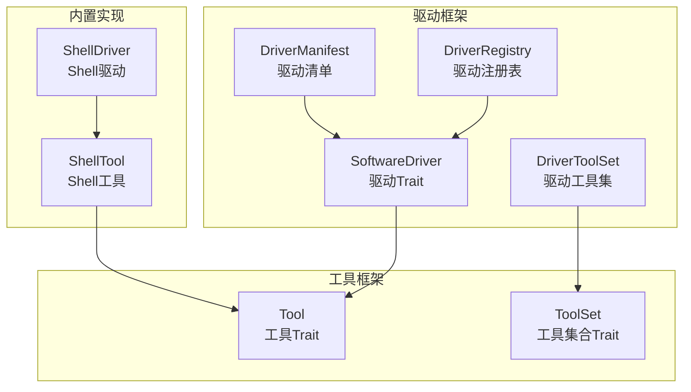
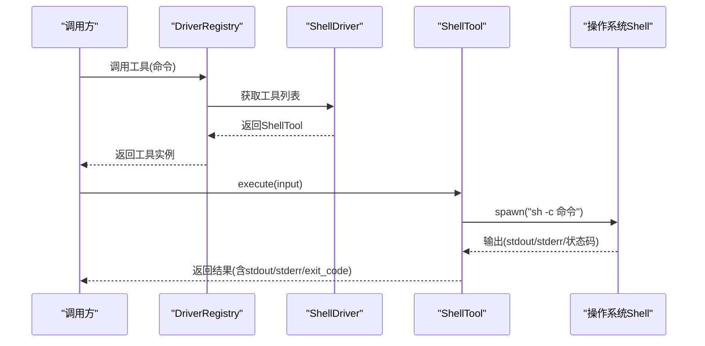
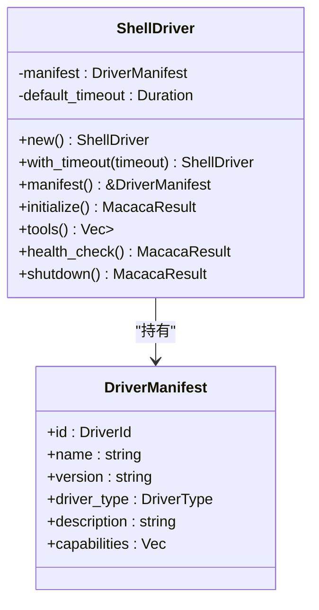
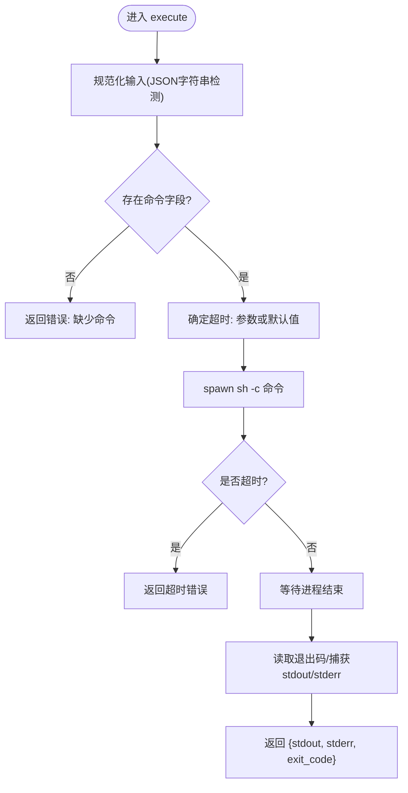
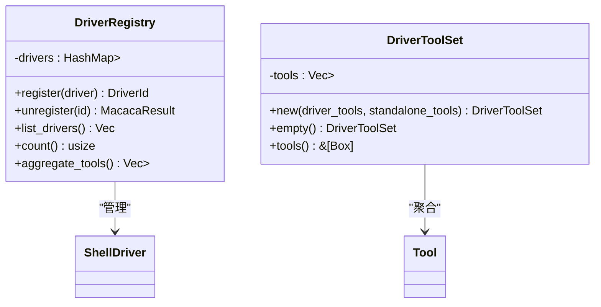
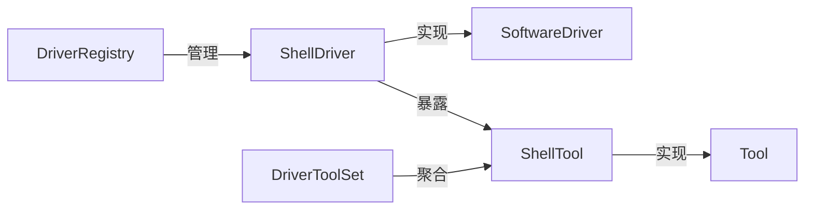

# Shell驱动程序

<cite>
**本文引用的文件**
- [shell_driver.rs](file://macaca/crates/macaca-driver/src/builtin/shell_driver.rs)
- [driver.rs](file://macaca/crates/macaca-driver/src/driver.rs)
- [lib.rs](file://macaca/crates/macaca-driver/src/lib.rs)
- [builtin.rs](file://macaca/crates/macaca-tools/src/builtin.rs)
- [tool.rs](file://macaca/crates/macaca-tools/src/tool.rs)
- [registry.rs](file://macaca/crates/macaca-driver/src/registry.rs)
- [toolset.rs](file://macaca/crates/macaca-driver/src/toolset.rs)
- [default.toml](file://macaca/config/default.toml)
- [tool.rs](file://macaca/crates/macaca-framework/src/tool.rs)
</cite>

## 目录
1. [简介](#简介)
2. [项目结构](#项目结构)
3. [核心组件](#核心组件)
4. [架构总览](#架构总览)
5. [详细组件分析](#详细组件分析)
6. [依赖关系分析](#依赖关系分析)
7. [性能考量](#性能考量)
8. [故障排查指南](#故障排查指南)
9. [结论](#结论)
10. [附录](#附录)

## 简介
本文件面向“Shell驱动程序”的技术文档，聚焦于ShellDriver与ShellTool的实现原理与使用方式。内容涵盖命令解析、进程创建与管理、执行流程（输入校验、参数传递、输出捕获）、生命周期管理（启动、监控、终止与清理）、错误处理策略（超时控制、异常捕获与恢复）、配置项说明（工作目录、环境变量、权限控制），并提供常见使用示例、性能优化建议与安全注意事项。

## 项目结构
Shell驱动程序位于Agent OS子系统中，采用分层设计：
- 驱动框架层：定义驱动生命周期与元数据接口
- 工具框架层：统一的工具抽象与执行管线
- 内置工具层：ShellTool等内置能力
- 注册与聚合层：驱动注册、工具聚合与对外暴露

图表来源
- [driver.rs:24-61](file://macaca/crates/macaca-driver/src/driver.rs#L24-L61)
- [registry.rs:15-67](file://macaca/crates/macaca-driver/src/registry.rs#L15-L67)
- [toolset.rs:7-29](file://macaca/crates/macaca-driver/src/toolset.rs#L7-L29)
- [shell_driver.rs:15-74](file://macaca/crates/macaca-driver/src/builtin/shell_driver.rs#L15-L74)
- [builtin.rs:168-237](file://macaca/crates/macaca-tools/src/builtin.rs#L168-L237)
- [tool.rs:24-44](file://macaca/crates/macaca-tools/src/tool.rs#L24-L44)

章节来源
- [driver.rs:1-90](file://macaca/crates/macaca-driver/src/driver.rs#L1-L90)
- [lib.rs:1-15](file://macaca/crates/macaca-driver/src/lib.rs#L1-L15)
- [shell_driver.rs:1-111](file://macaca/crates/macaca-driver/src/builtin/shell_driver.rs#L1-L111)
- [builtin.rs:162-237](file://macaca/crates/macaca-tools/src/builtin.rs#L162-L237)
- [tool.rs:1-66](file://macaca/crates/macaca-tools/src/tool.rs#L1-L66)
- [registry.rs:1-157](file://macaca/crates/macaca-driver/src/registry.rs#L1-L157)
- [toolset.rs:1-47](file://macaca/crates/macaca-driver/src/toolset.rs#L1-L47)

## 核心组件
- ShellDriver：封装ShellTool为可插拔的软件驱动，负责驱动元数据、初始化、工具暴露与健康检查。
- ShellTool：执行shell命令的核心工具，支持超时控制、标准输出/错误捕获与退出码返回。
- SoftwareDriver：驱动生命周期与能力暴露的统一接口。
- Tool/ToolSet：工具抽象与工具集合的统一接口。
- DriverRegistry：集中注册与管理已安装驱动，聚合所有工具。
- DriverToolSet：将来自驱动与独立工具合并为统一工具集。

章节来源
- [shell_driver.rs:14-74](file://macaca/crates/macaca-driver/src/builtin/shell_driver.rs#L14-L74)
- [builtin.rs:168-237](file://macaca/crates/macaca-tools/src/builtin.rs#L168-L237)
- [driver.rs:46-61](file://macaca/crates/macaca-driver/src/driver.rs#L46-L61)
- [tool.rs:24-44](file://macaca/crates/macaca-tools/src/tool.rs#L24-L44)
- [registry.rs:19-67](file://macaca/crates/macaca-driver/src/registry.rs#L19-L67)
- [toolset.rs:11-29](file://macaca/crates/macaca-driver/src/toolset.rs#L11-L29)

## 架构总览
下图展示了从调用方到ShellTool的完整执行链路，以及与工具系统的交互：

图表来源
- [registry.rs:58-66](file://macaca/crates/macaca-driver/src/registry.rs#L58-L66)
- [shell_driver.rs:60-64](file://macaca/crates/macaca-driver/src/builtin/shell_driver.rs#L60-L64)
- [builtin.rs:203-236](file://macaca/crates/macaca-tools/src/builtin.rs#L203-L236)

## 详细组件分析

### ShellDriver：驱动生命周期与工具暴露
- 驱动元数据：包含唯一ID、名称、版本、类型、描述与能力列表。
- 初始化：ShellDriver无需外部资源，初始化直接返回成功。
- 工具暴露：通过tools()返回ShellTool实例，并注入默认超时。
- 健康检查：在Unix系统上始终返回健康。
- 关闭：空操作，无资源需要释放。

图表来源
- [shell_driver.rs:15-74](file://macaca/crates/macaca-driver/src/builtin/shell_driver.rs#L15-L74)
- [driver.rs:24-32](file://macaca/crates/macaca-driver/src/driver.rs#L24-L32)

章节来源
- [shell_driver.rs:20-74](file://macaca/crates/macaca-driver/src/builtin/shell_driver.rs#L20-L74)
- [driver.rs:24-32](file://macaca/crates/macaca-driver/src/driver.rs#L24-L32)

### ShellTool：命令执行与错误处理
- 输入解析：要求提供命令字段；可选超时秒数；支持JSON字符串输入自动规范化。
- 进程创建：通过系统shell以“sh -c”执行命令。
- 超时控制：基于异步超时包装，超时返回统一的超时错误。
- 输出捕获：捕获标准输出、标准错误与退出码，统一编码为UTF-8字符串。
- 错误处理：进程启动失败、超时、非零退出码均作为错误返回。

图表来源
- [builtin.rs:203-236](file://macaca/crates/macaca-tools/src/builtin.rs#L203-L236)

章节来源
- [builtin.rs:203-236](file://macaca/crates/macaca-tools/src/builtin.rs#L203-L236)

### 驱动注册与工具聚合
- DriverRegistry：线程安全地注册/注销驱动，聚合所有驱动暴露的工具。
- DriverToolSet：将驱动工具与独立工具合并为统一工具集，供上层使用。

图表来源
- [registry.rs:15-67](file://macaca/crates/macaca-driver/src/registry.rs#L15-L67)
- [toolset.rs:7-29](file://macaca/crates/macaca-driver/src/toolset.rs#L7-L29)

章节来源
- [registry.rs:19-67](file://macaca/crates/macaca-driver/src/registry.rs#L19-L67)
- [toolset.rs:11-29](file://macaca/crates/macaca-driver/src/toolset.rs#L11-L29)

### 工具系统与执行管线（对比参考）
- 工具抽象：Tool/ToolSet定义了工具名称、描述、参数Schema与执行方法。
- 执行管线：工具框架提供中间件、组激活/停用、预设参数合并等能力，便于扩展与治理。
- 注意：ShellTool当前未使用该框架的中间件与流式事件，但其接口与Schema与该框架兼容。

章节来源
- [tool.rs:24-44](file://macaca/crates/macaca-tools/src/tool.rs#L24-L44)
- [tool.rs:105-122](file://macaca/crates/macaca-framework/src/tool.rs#L105-L122)

## 依赖关系分析
- ShellDriver依赖驱动框架的SoftwareDriver与DriverManifest。
- ShellTool依赖工具框架的Tool与ToolSet。
- DriverRegistry与DriverToolSet负责驱动与工具的集中管理与聚合。
- ShellTool内部使用Tokio子进程与超时机制。

图表来源
- [shell_driver.rs:49-74](file://macaca/crates/macaca-driver/src/builtin/shell_driver.rs#L49-L74)
- [builtin.rs:182-237](file://macaca/crates/macaca-tools/src/builtin.rs#L182-L237)
- [registry.rs:27-66](file://macaca/crates/macaca-driver/src/registry.rs#L27-L66)
- [toolset.rs:13-17](file://macaca/crates/macaca-driver/src/toolset.rs#L13-L17)

章节来源
- [shell_driver.rs:1-111](file://macaca/crates/macaca-driver/src/builtin/shell_driver.rs#L1-L111)
- [builtin.rs:1-376](file://macaca/crates/macaca-tools/src/builtin.rs#L1-L376)
- [registry.rs:1-157](file://macaca/crates/macaca-driver/src/registry.rs#L1-L157)
- [toolset.rs:1-47](file://macaca/crates/macaca-driver/src/toolset.rs#L1-L47)

## 性能考量
- 超时控制：通过异步超时避免长时间阻塞，建议根据任务复杂度调整ShellDriver默认超时或在调用时传入更精确的超时。
- 进程开销：频繁创建shell子进程会产生额外开销，建议合并命令或复用长生命周期进程（需谨慎评估安全与稳定性）。
- I/O吞吐：stdout/stderr按字节收集后统一转码，注意大输出可能带来内存压力，必要时分块处理或限制输出大小。
- 并发执行：多个ShellTool并发执行会竞争系统资源，应结合系统负载与队列策略进行限流。

## 故障排查指南
- 常见错误类型
  - 缺少命令字段：输入必须包含命令字符串。
  - 超时：超过设定超时将返回超时错误。
  - 启动失败：无法spawn shell或命令时返回错误。
  - 非零退出码：命令执行失败但有输出，可通过exit_code定位问题。
- 排查步骤
  - 确认输入格式与字段：命令必填，超时可选。
  - 检查超时设置：适当增大超时或缩短命令执行时间。
  - 查看stdout/stderr：结合业务日志定位问题根因。
  - 验证环境：确保系统可用且具备相应权限。
- 相关测试参考
  - 基础回显与退出码测试
  - 超时行为测试
  - 输入规范化测试

章节来源
- [builtin.rs:327-358](file://macaca/crates/macaca-tools/src/builtin.rs#L327-L358)
- [builtin.rs:276-325](file://macaca/crates/macaca-tools/src/builtin.rs#L276-L325)

## 结论
Shell驱动程序通过简洁的接口与稳健的错误处理，提供了可靠的命令执行能力。其设计遵循统一的工具与驱动抽象，便于集成与扩展。在生产环境中，建议合理设置超时、关注输出规模、评估并发与权限，并结合日志与监控进行持续优化与排障。

## 附录

### 使用示例与最佳实践
- 基础命令执行
  - 输入：包含命令字段；可选超时秒数。
  - 输出：包含标准输出、标准错误与退出码。
- 最佳实践
  - 明确超时边界：对耗时不确定的任务设置合理超时。
  - 合理拆分命令：避免单条命令过长导致解析与执行困难。
  - 安全优先：避免在命令中拼接不受信任的用户输入，必要时进行严格白名单过滤。
  - 日志与审计：记录关键命令与结果，便于追踪与复盘。
- 参考测试
  - 回显与退出码
  - 超时行为
  - 输入规范化

章节来源
- [builtin.rs:327-358](file://macaca/crates/macaca-tools/src/builtin.rs#L327-L358)
- [builtin.rs:276-325](file://macaca/crates/macaca-tools/src/builtin.rs#L276-L325)

### 配置选项说明
- 工作目录
  - ShellTool当前以系统shell默认工作目录运行；如需指定工作目录，请在命令中使用切换目录的前置命令或在上层逻辑中进行路径转换。
- 环境变量传递
  - ShellTool通过系统shell继承当前进程环境；如需隔离或注入特定变量，可在命令中显式设置或在上层封装中注入。
- 权限控制
  - ShellTool不内置权限控制；建议在上层策略中限制可执行命令范围与来源，并结合系统级权限策略进行管控。
- 全局超时
  - 可通过ShellDriver.with_timeout设置默认超时，影响所有ShellTool实例。

章节来源
- [shell_driver.rs:37-40](file://macaca/crates/macaca-driver/src/builtin/shell_driver.rs#L37-L40)
- [builtin.rs:203-236](file://macaca/crates/macaca-tools/src/builtin.rs#L203-L236)