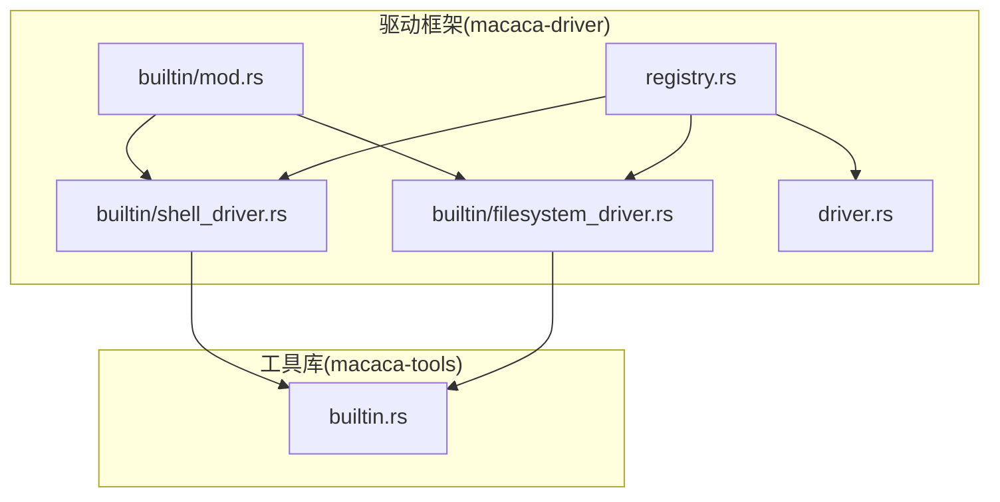
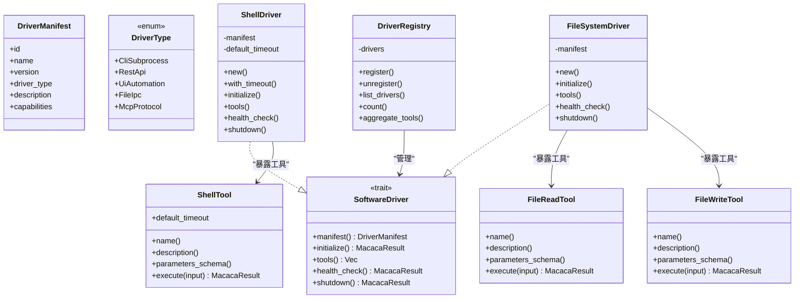
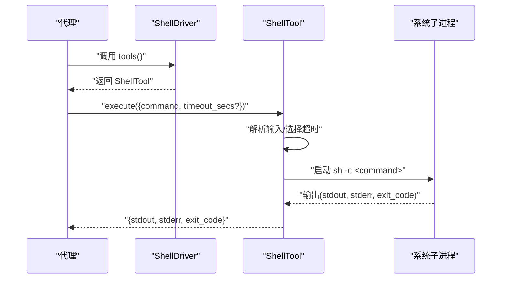
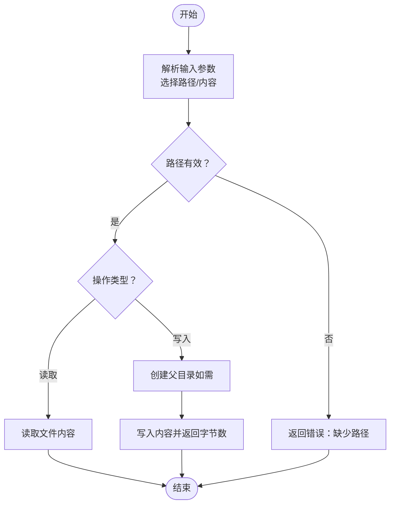
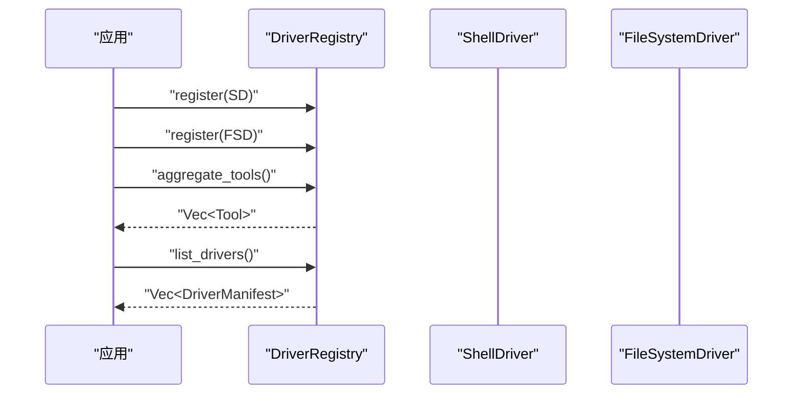
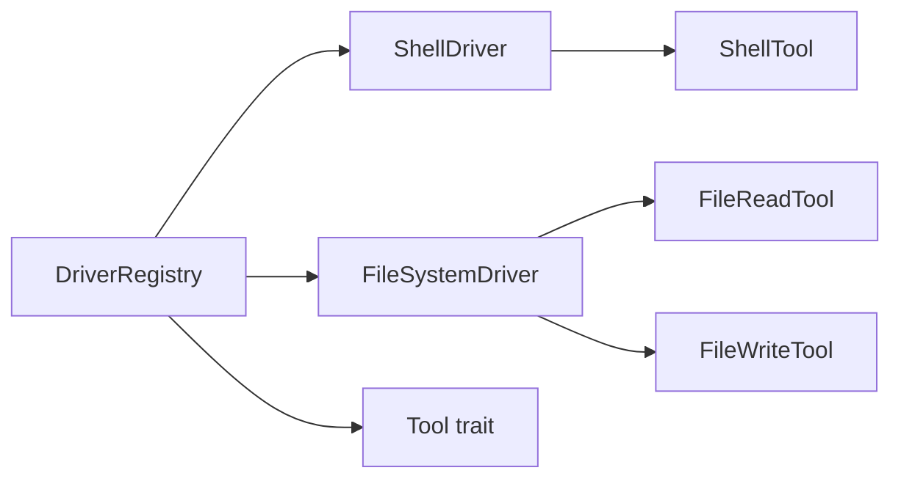

# 内置驱动程序

<cite>
**本文引用的文件**
- [shell_driver.rs](file://macaca/crates/macaca-driver/src/builtin/shell_driver.rs)
- [filesystem_driver.rs](file://macaca/crates/macaca-driver/src/builtin/filesystem_driver.rs)
- [mod.rs](file://macaca/crates/macaca-driver/src/builtin/mod.rs)
- [driver.rs](file://macaca/crates/macaca-driver/src/driver.rs)
- [registry.rs](file://macaca/crates/macaca-driver/src/registry.rs)
- [builtin.rs](file://macaca/crates/macaca-tools/src/builtin.rs)
- [lib.rs](file://macaca/crates/macaca-driver/src/lib.rs)
- [default.toml](file://macaca/config/default.toml)
- [integration_tests.rs](file://macaca/crates/macaca-framework/tests/integration_tests.rs)
</cite>

## 目录
1. [简介](#简介)
2. [项目结构](#项目结构)
3. [核心组件](#核心组件)
4. [架构总览](#架构总览)
5. [详细组件分析](#详细组件分析)
6. [依赖关系分析](#依赖关系分析)
7. [性能考量](#性能考量)
8. [故障排查指南](#故障排查指南)
9. [结论](#结论)
10. [附录](#附录)

## 简介
本文件系统化地文档化了 Agent OS 中的“内置驱动程序”，重点覆盖两类内置驱动：
- Shell 驱动：通过子进程执行命令、管理进程生命周期与输出处理。
- 文件系统驱动：提供本地文件读写能力，支持路径解析与内容写入。

同时，文档阐述了驱动程序的配置项、参数传递与结果格式化方式，并给出使用示例、常见问题与解决方案、性能与安全注意事项，以及扩展与定制内置驱动的方法。

## 项目结构
内置驱动位于驱动框架模块中，采用“驱动层 + 工具层”的分层设计：
- 驱动层：定义统一的软件驱动接口与生命周期，内置驱动实现具体能力。
- 工具层：提供可复用的工具实现（如 ShellTool、FileReadTool、FileWriteTool），由驱动暴露给代理使用。
- 注册中心：集中注册、发现与聚合驱动及其工具。

图表来源
- [mod.rs:1-8](file://macaca/crates/macaca-driver/src/builtin/mod.rs#L1-L8)
- [shell_driver.rs:1-111](file://macaca/crates/macaca-driver/src/builtin/shell_driver.rs#L1-L111)
- [filesystem_driver.rs:1-96](file://macaca/crates/macaca-driver/src/builtin/filesystem_driver.rs#L1-L96)
- [driver.rs:1-90](file://macaca/crates/macaca-driver/src/driver.rs#L1-L90)
- [registry.rs:1-157](file://macaca/crates/macaca-driver/src/registry.rs#L1-L157)
- [builtin.rs:1-376](file://macaca/crates/macaca-tools/src/builtin.rs#L1-L376)

章节来源
- [lib.rs:1-15](file://macaca/crates/macaca-driver/src/lib.rs#L1-L15)
- [mod.rs:1-8](file://macaca/crates/macaca-driver/src/builtin/mod.rs#L1-L8)

## 核心组件
- 软件驱动接口与类型
  - 驱动类型枚举：描述驱动与目标软件交互的方式（例如子进程、文件IPC等）。
  - 驱动清单：包含驱动标识、名称、版本、类型、描述与能力列表。
  - 软件驱动 trait：定义生命周期方法（初始化、工具暴露、健康检查、关闭）。
- 驱动注册中心
  - 提供线程安全的注册、注销、列举与工具聚合功能。
- 内置驱动
  - ShellDriver：封装 ShellTool，暴露命令执行能力。
  - FileSystemDriver：封装 FileReadTool 与 FileWriteTool，暴露文件读写能力。

章节来源
- [driver.rs:8-61](file://macaca/crates/macaca-driver/src/driver.rs#L8-L61)
- [registry.rs:12-67](file://macaca/crates/macaca-driver/src/registry.rs#L12-L67)
- [shell_driver.rs:14-74](file://macaca/crates/macaca-driver/src/builtin/shell_driver.rs#L14-L74)
- [filesystem_driver.rs:13-62](file://macaca/crates/macaca-driver/src/builtin/filesystem_driver.rs#L13-L62)

## 架构总览
内置驱动通过统一的 SoftwareDriver 接口对外暴露能力，工具层提供具体实现，注册中心负责驱动的生命周期管理与工具聚合。

图表来源
- [driver.rs:8-61](file://macaca/crates/macaca-driver/src/driver.rs#L8-L61)
- [shell_driver.rs:14-74](file://macaca/crates/macaca-driver/src/builtin/shell_driver.rs#L14-L74)
- [filesystem_driver.rs:13-62](file://macaca/crates/macaca-driver/src/builtin/filesystem_driver.rs#L13-L62)
- [builtin.rs:47-237](file://macaca/crates/macaca-tools/src/builtin.rs#L47-L237)
- [registry.rs:12-67](file://macaca/crates/macaca-driver/src/registry.rs#L12-L67)

## 详细组件分析

### Shell 驱动（命令执行、进程管理与输出处理）
- 角色与职责
  - 将 ShellTool 包装为 SoftwareDriver，暴露“执行命令”能力。
  - 支持自定义默认超时时间，便于控制长时间运行命令的风险。
- 关键行为
  - 初始化：无需外部资源，直接返回成功。
  - 健康检查：在类 Unix 环境下始终视为健康。
  - 工具暴露：返回单个 ShellTool 实例。
  - 关闭：无资源需要清理。
- 参数与结果
  - 输入模式：支持 JSON 字符串或对象；自动解析路径别名（如 file_path、filepath）。
  - 命令执行：通过系统 shell 子进程执行，支持超时控制。
  - 输出格式：包含标准输出、标准错误与退出码。
- 错误处理
  - 缺少必要字段会返回错误。
  - 超时触发超时错误，spawn 失败返回相应错误。
- 使用建议
  - 对高风险命令设置更短超时。
  - 在需要跨平台兼容时，避免硬编码 shell 特性，尽量使用通用命令。

图表来源
- [shell_driver.rs:60-64](file://macaca/crates/macaca-driver/src/builtin/shell_driver.rs#L60-L64)
- [builtin.rs:162-237](file://macaca/crates/macaca-tools/src/builtin.rs#L162-L237)

章节来源
- [shell_driver.rs:14-74](file://macaca/crates/macaca-driver/src/builtin/shell_driver.rs#L14-L74)
- [builtin.rs:162-237](file://macaca/crates/macaca-tools/src/builtin.rs#L162-L237)

### 文件系统驱动（文件读写、目录遍历与权限管理）
- 角色与职责
  - 将 FileReadTool 与 FileWriteTool 组合作为 SoftwareDriver 暴露。
  - 读取文件内容与写入文本内容，自动创建父目录。
- 关键行为
  - 初始化/健康检查/关闭：均无需外部资源。
  - 工具暴露：返回读写两个工具实例。
- 参数与结果
  - 读取：支持多种路径别名；失败返回错误。
  - 写入：支持多种内容别名；自动创建目录；返回写入字节数。
- 权限与安全
  - 读写基于本地文件系统，受运行环境用户权限约束。
  - 不提供目录遍历能力（当前实现仅暴露读写工具）。
- 使用建议
  - 使用绝对路径或工作区相对路径，避免越权访问。
  - 对写入内容进行必要的校验与转义。

图表来源
- [filesystem_driver.rs:40-62](file://macaca/crates/macaca-driver/src/builtin/filesystem_driver.rs#L40-L62)
- [builtin.rs:47-160](file://macaca/crates/macaca-tools/src/builtin.rs#L47-L160)

章节来源
- [filesystem_driver.rs:13-62](file://macaca/crates/macaca-driver/src/builtin/filesystem_driver.rs#L13-L62)
- [builtin.rs:47-160](file://macaca/crates/macaca-tools/src/builtin.rs#L47-L160)

### 驱动注册与工具聚合
- 注册中心职责
  - 注册/注销驱动，按 ID 管理。
  - 列举驱动清单，统计数量。
  - 聚合所有驱动暴露的工具，形成统一工具集。
- 并发与一致性
  - 使用读写锁保护内部映射，支持多任务并发访问。
- 使用场景
  - 在应用启动时注册内置驱动，随后通过注册中心聚合工具，供代理选择使用。

图表来源
- [registry.rs:19-67](file://macaca/crates/macaca-driver/src/registry.rs#L19-L67)

章节来源
- [registry.rs:12-67](file://macaca/crates/macaca-driver/src/registry.rs#L12-L67)

## 依赖关系分析
- 模块间依赖
  - 内置驱动依赖工具库中的 ShellTool、FileReadTool、FileWriteTool。
  - 驱动框架提供 SoftwareDriver 接口与 DriverManifest 类型。
  - 注册中心依赖 SoftwareDriver 接口与工具 trait。
- 外部依赖
  - 异步运行时与超时控制用于命令执行。
  - 文件系统异步 API 用于读写。
- 循环依赖
  - 未见循环导入；驱动与工具通过 trait 解耦。

图表来源
- [shell_driver.rs:8-12](file://macaca/crates/macaca-driver/src/builtin/shell_driver.rs#L8-L12)
- [filesystem_driver.rs:7-11](file://macaca/crates/macaca-driver/src/builtin/filesystem_driver.rs#L7-L11)
- [builtin.rs:10-10](file://macaca/crates/macaca-tools/src/builtin.rs#L10-L10)
- [registry.rs:7-10](file://macaca/crates/macaca-driver/src/registry.rs#L7-L10)

章节来源
- [driver.rs:3-6](file://macaca/crates/macaca-driver/src/driver.rs#L3-L6)
- [builtin.rs:3-10](file://macaca/crates/macaca-tools/src/builtin.rs#L3-L10)
- [registry.rs:3-10](file://macaca/crates/macaca-driver/src/registry.rs#L3-L10)

## 性能考量
- Shell 执行
  - 子进程启动与 IO 开销：频繁小命令可能产生显著开销，建议合并命令或批处理。
  - 超时控制：合理设置默认超时，避免长时间阻塞。
- 文件读写
  - 大文件读写应关注内存占用与磁盘 IO；可考虑分块处理。
  - 自动创建目录的开销通常较小，但需注意路径合法性。
- 并发与注册中心
  - 聚合工具与列举驱动为 O(n) 操作，n 为已注册驱动数；在驱动数量较多时注意调用频率。

## 故障排查指南
- Shell 驱动
  - 命令未返回：确认命令存在且具备执行权限；检查超时设置是否过短。
  - 超时错误：适当提高 timeout_secs 或调整默认超时。
  - 无法启动子进程：检查 shell 可用性与系统资源。
- 文件系统驱动
  - 读取失败：确认路径存在且可读；检查权限。
  - 写入失败：确认目标路径可写；检查磁盘空间与权限。
- 注册中心
  - 注销不存在的驱动：确保传入正确的驱动 ID。
  - 工具聚合为空：确认驱动已正确注册并暴露工具。

章节来源
- [builtin.rs:203-237](file://macaca/crates/macaca-tools/src/builtin.rs#L203-L237)
- [builtin.rs:129-160](file://macaca/crates/macaca-tools/src/builtin.rs#L129-L160)
- [registry.rs:33-41](file://macaca/crates/macaca-driver/src/registry.rs#L33-L41)

## 结论
内置驱动通过统一的 SoftwareDriver 接口与工具抽象，实现了对 Shell 与本地文件系统的稳定封装。ShellDriver 提供命令执行与超时控制，FileSystemDriver 提供读写能力与目录创建。结合 DriverRegistry 的注册与聚合能力，内置驱动可无缝融入代理系统，满足日常自动化与文件操作需求。通过合理的配置与安全策略，可在保证性能的同时提升稳定性与安全性。

## 附录

### 配置选项与参数传递
- Shell 驱动
  - 默认超时：可通过构造函数设置。
  - 命令执行输入：包含命令字符串与可选超时秒数。
  - 输出：包含标准输出、标准错误与退出码。
- 文件系统驱动
  - 读取输入：支持多种路径别名。
  - 写入输入：支持多种内容别名；自动创建父目录；返回写入字节数。

章节来源
- [shell_driver.rs:20-41](file://macaca/crates/macaca-driver/src/builtin/shell_driver.rs#L20-L41)
- [builtin.rs:162-237](file://macaca/crates/macaca-tools/src/builtin.rs#L162-L237)
- [builtin.rs:47-160](file://macaca/crates/macaca-tools/src/builtin.rs#L47-L160)

### 使用示例与最佳实践
- 示例参考
  - 集成测试展示了工具与代理的协作流程，可作为使用示例的参考。
- 最佳实践
  - 明确命令超时，避免长时间阻塞。
  - 对写入内容进行必要校验，防止注入与破坏。
  - 使用注册中心统一管理驱动与工具，便于扩展与维护。

章节来源
- [integration_tests.rs:176-206](file://macaca/crates/macaca-framework/tests/integration_tests.rs#L176-L206)
- [integration_tests.rs:212-256](file://macaca/crates/macaca-framework/tests/integration_tests.rs#L212-L256)

### 安全限制与合规建议
- Shell 执行
  - 严格限制可执行命令范围，避免危险命令。
  - 使用非特权账户运行，最小权限原则。
- 文件系统
  - 限制写入路径，避免覆盖关键系统文件。
  - 对输入进行白名单校验，防止路径穿越。

### 扩展与定制内置驱动
- 新增驱动步骤
  - 实现 SoftwareDriver trait，定义清单与生命周期。
  - 暴露所需工具集合。
  - 通过 DriverRegistry 注册并聚合。
- 定制已有驱动
  - 修改默认超时、能力列表或工具参数模式。
  - 增加健康检查逻辑或资源清理。

章节来源
- [driver.rs:34-61](file://macaca/crates/macaca-driver/src/driver.rs#L34-L61)
- [registry.rs:26-31](file://macaca/crates/macaca-driver/src/registry.rs#L26-L31)
- [lib.rs:12-15](file://macaca/crates/macaca-driver/src/lib.rs#L12-L15)