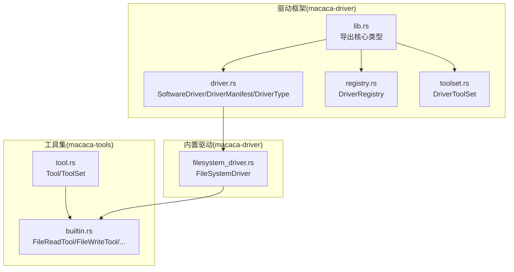
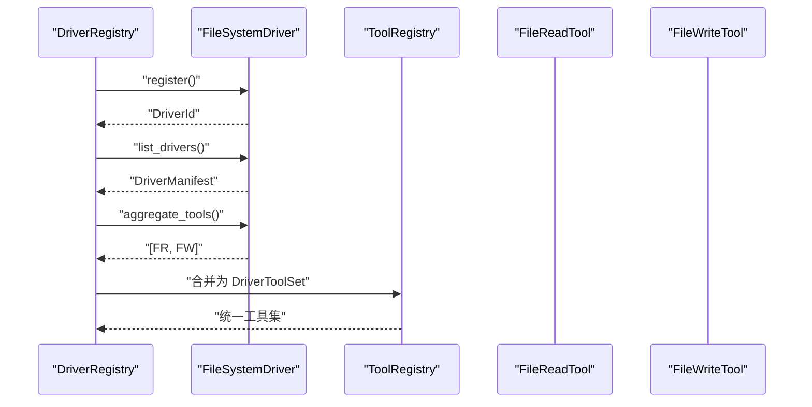
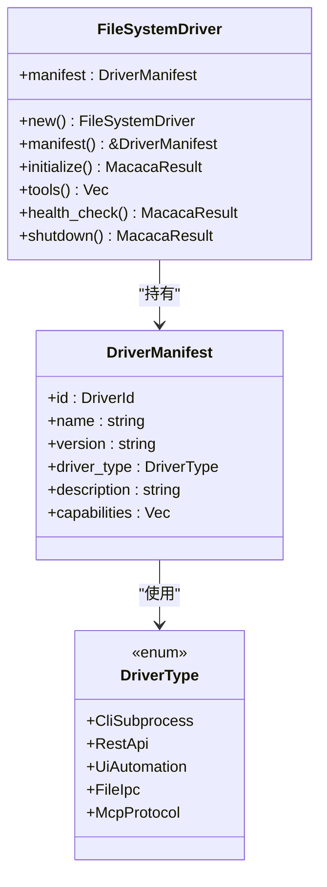
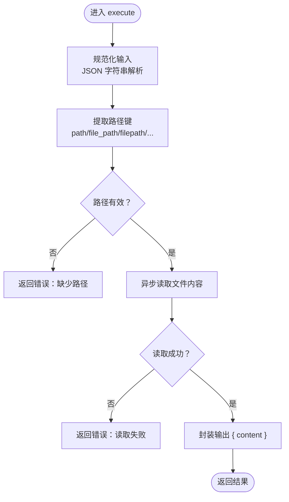
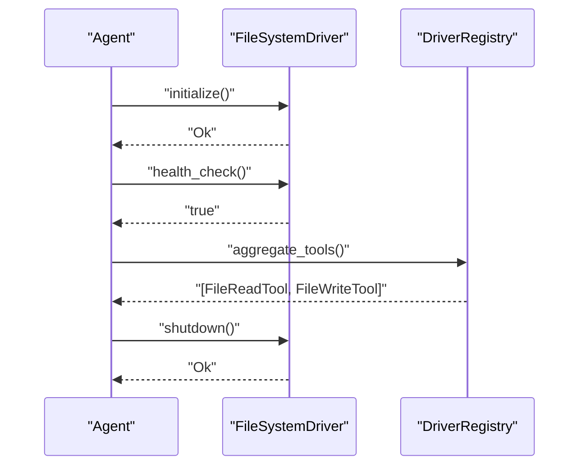
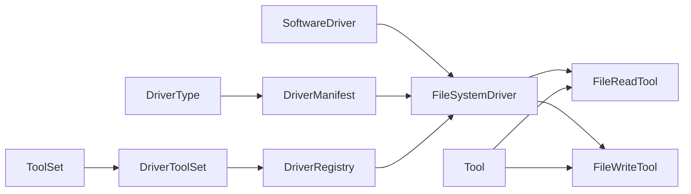

# 文件系统驱动

<cite>
**本文引用的文件**
- [filesystem_driver.rs](file://macaca/crates/macaca-driver/src/builtin/filesystem_driver.rs)
- [driver.rs](file://macaca/crates/macaca-driver/src/driver.rs)
- [lib.rs](file://macaca/crates/macaca-driver/src/lib.rs)
- [builtin.rs](file://macaca/crates/macaca-tools/src/builtin.rs)
- [tool.rs](file://macaca/crates/macaca-tools/src/tool.rs)
- [registry.rs](file://macaca/crates/macaca-driver/src/registry.rs)
- [toolset.rs](file://macaca/crates/macaca-driver/src/toolset.rs)
- [default.toml](file://macaca/config/default.toml)
</cite>

## 目录
1. [简介](#简介)
2. [项目结构](#项目结构)
3. [核心组件](#核心组件)
4. [架构总览](#架构总览)
5. [详细组件分析](#详细组件分析)
6. [依赖关系分析](#依赖关系分析)
7. [性能考量](#性能考量)
8. [故障排查指南](#故障排查指南)
9. [结论](#结论)
10. [附录](#附录)

## 简介
本文件系统驱动（FileSystemDriver）是 Agent OS 中的一个内置软件驱动，通过统一的工具接口暴露本地文件系统的读写能力。它不直接实现文件读写逻辑，而是组合两个内置工具：文件读取工具与文件写入工具，并以“文件/IPC”交互方式对外提供能力。该驱动遵循 Agent OS 的驱动框架，具备标准生命周期（初始化、健康检查、关闭），并可被注册中心聚合到全局工具集中，供智能体按需调用。

## 项目结构
FileSystemDriver 所在的模块位于驱动框架与工具集之间，采用分层设计：
- 驱动框架层：定义通用驱动接口、清单元数据与注册中心等。
- 工具集层：定义工具与工具集合的抽象，内置多种工具（含文件读写）。
- 内置驱动层：将工具封装为具体驱动，暴露给上层使用。

**图表来源**
- [lib.rs:1-15](file://macaca/crates/macaca-driver/src/lib.rs#L1-L15)
- [driver.rs:1-90](file://macaca/crates/macaca-driver/src/driver.rs#L1-L90)
- [registry.rs:1-157](file://macaca/crates/macaca-driver/src/registry.rs#L1-L157)
- [toolset.rs:1-47](file://macaca/crates/macaca-driver/src/toolset.rs#L1-L47)
- [tool.rs:1-66](file://macaca/crates/macaca-tools/src/tool.rs#L1-L66)
- [builtin.rs:1-376](file://macaca/crates/macaca-tools/src/builtin.rs#L1-L376)
- [filesystem_driver.rs:1-96](file://macaca/crates/macaca-driver/src/builtin/filesystem_driver.rs#L1-L96)

**章节来源**
- [lib.rs:1-15](file://macaca/crates/macaca-driver/src/lib.rs#L1-L15)
- [driver.rs:1-90](file://macaca/crates/macaca-driver/src/driver.rs#L1-L90)
- [registry.rs:1-157](file://macaca/crates/macaca-driver/src/registry.rs#L1-L157)
- [toolset.rs:1-47](file://macaca/crates/macaca-driver/src/toolset.rs#L1-L47)
- [tool.rs:1-66](file://macaca/crates/macaca-tools/src/tool.rs#L1-L66)
- [builtin.rs:1-376](file://macaca/crates/macaca-tools/src/builtin.rs#L1-L376)
- [filesystem_driver.rs:1-96](file://macaca/crates/macaca-driver/src/builtin/filesystem_driver.rs#L1-L96)

## 核心组件
- FileSystemDriver：内置驱动，负责声明驱动元信息、生命周期与工具暴露。其工具集由文件读取与文件写入两个工具组成。
- FileReadTool：从文件系统读取内容，支持多种参数键名别名（如 path、file_path、filepath 等）。
- FileWriteTool：向文件写入内容，自动创建父目录，返回写入字节数。
- SoftwareDriver：驱动框架的核心 trait，定义了驱动的标准生命周期与能力暴露。
- DriverRegistry：驱动注册中心，负责驱动的注册、注销、列举与工具聚合。
- DriverToolSet：将来自驱动与独立工具的集合统一为一个工具集，便于上层调度。

**章节来源**
- [filesystem_driver.rs:13-62](file://macaca/crates/macaca-driver/src/builtin/filesystem_driver.rs#L13-L62)
- [builtin.rs:47-160](file://macaca/crates/macaca-tools/src/builtin.rs#L47-L160)
- [driver.rs:34-61](file://macaca/crates/macaca-driver/src/driver.rs#L34-L61)
- [registry.rs:12-67](file://macaca/crates/macaca-driver/src/registry.rs#L12-L67)
- [toolset.rs:5-29](file://macaca/crates/macaca-driver/src/toolset.rs#L5-L29)

## 架构总览
FileSystemDriver 作为软件驱动，通过工具接口与 Agent OS 的工具系统对接。其核心流程如下：
- 驱动注册：DriverRegistry 注册 FileSystemDriver 实例。
- 能力暴露：FileSystemDriver 的 tools() 返回 FileReadTool 与 FileWriteTool。
- 工具聚合：DriverToolSet 将所有驱动工具与独立工具合并为统一工具集。
- 生命周期：Agent 在需要时调用 initialize()/health_check()/shutdown()。

**图表来源**
- [registry.rs:26-66](file://macaca/crates/macaca-driver/src/registry.rs#L26-L66)
- [filesystem_driver.rs:51-53](file://macaca/crates/macaca-driver/src/builtin/filesystem_driver.rs#L51-L53)
- [toolset.rs:11-17](file://macaca/crates/macaca-driver/src/toolset.rs#L11-L17)

**章节来源**
- [registry.rs:19-66](file://macaca/crates/macaca-driver/src/registry.rs#L19-L66)
- [filesystem_driver.rs:46-61](file://macaca/crates/macaca-driver/src/builtin/filesystem_driver.rs#L46-L61)
- [toolset.rs:11-29](file://macaca/crates/macaca-driver/src/toolset.rs#L11-L29)

## 详细组件分析

### FileSystemDriver 组件分析
- 角色与职责
  - 提供文件系统读写能力的软件驱动。
  - 声明驱动元信息（名称、版本、类型、描述、能力）。
  - 暴露工具集（file_read、file_write）。
  - 生命周期管理（initialize/health_check/shutdown）。
- 关键行为
  - 初始化：无需外部资源，直接返回成功。
  - 健康检查：恒定返回健康状态。
  - 关闭：无资源需要清理。
- 测试覆盖
  - 验证清单字段与能力列表。
  - 验证工具数量与名称。
  - 验证生命周期调用。

**图表来源**
- [filesystem_driver.rs:14-38](file://macaca/crates/macaca-driver/src/builtin/filesystem_driver.rs#L14-L38)
- [driver.rs:24-32](file://macaca/crates/macaca-driver/src/driver.rs#L24-L32)
- [driver.rs:9-21](file://macaca/crates/macaca-driver/src/driver.rs#L9-L21)

**章节来源**
- [filesystem_driver.rs:13-62](file://macaca/crates/macaca-driver/src/builtin/filesystem_driver.rs#L13-L62)
- [driver.rs:23-32](file://macaca/crates/macaca-driver/src/driver.rs#L23-L32)

### 文件读取工具（FileReadTool）
- 输入参数
  - 支持路径键名：path、file_path、filepath、file、filename（非空校验）。
  - 支持输入规范化：若传入字符串且为合法 JSON 对象，会先解析再使用。
- 处理流程
  - 解析并校验路径。
  - 使用异步文件系统读取文本内容。
  - 包装为 JSON 输出对象，包含 content 字段。
- 错误处理
  - 缺少路径或路径为空：返回代理错误。
  - 文件读取失败：包装为代理错误并携带原始错误信息。

**图表来源**
- [builtin.rs:14-23](file://macaca/crates/macaca-tools/src/builtin.rs#L14-L23)
- [builtin.rs:77-94](file://macaca/crates/macaca-tools/src/builtin.rs#L77-L94)

**章节来源**
- [builtin.rs:47-94](file://macaca/crates/macaca-tools/src/builtin.rs#L47-L94)

### 文件写入工具（FileWriteTool）
- 输入参数
  - 路径：path、file_path、filepath（必填）。
  - 内容：content、text、body（必填）。
- 处理流程
  - 解析并校验路径与内容。
  - 若父目录不存在，先创建所有父目录。
  - 异步写入内容，返回写入字节数。
- 错误处理
  - 缺少路径或内容：返回代理错误。
  - 创建目录失败：返回代理错误。
  - 写入失败：返回代理错误。

**图表来源**
- [builtin.rs:130-160](file://macaca/crates/macaca-tools/src/builtin.rs#L130-L160)

**章节来源**
- [builtin.rs:96-160](file://macaca/crates/macaca-tools/src/builtin.rs#L96-L160)

### 驱动生命周期与健康检查
- 初始化：FileSystemDriver 不依赖外部服务，initialize 直接返回成功。
- 健康检查：health_check 返回恒定健康状态。
- 关闭：shutdown 无资源清理，直接返回成功。
- 注册与聚合：DriverRegistry 负责注册、注销、列举与工具聚合；DriverToolSet 将所有工具合并为统一集合。

**图表来源**
- [filesystem_driver.rs:46-61](file://macaca/crates/macaca-driver/src/builtin/filesystem_driver.rs#L46-L61)
- [registry.rs:58-66](file://macaca/crates/macaca-driver/src/registry.rs#L58-L66)

**章节来源**
- [filesystem_driver.rs:46-61](file://macaca/crates/macaca-driver/src/builtin/filesystem_driver.rs#L46-L61)
- [registry.rs:58-66](file://macaca/crates/macaca-driver/src/registry.rs#L58-L66)

## 依赖关系分析
- FileSystemDriver 依赖工具集中的 FileReadTool 与 FileWriteTool。
- 驱动框架提供 SoftwareDriver 接口、DriverManifest 清单与 DriverType 类型。
- DriverRegistry 聚合所有已注册驱动的工具，形成统一工具集。
- ToolTrait 定义工具的执行接口与参数模式，ToolSet 提供工具集合的查询与定义导出。

**图表来源**
- [filesystem_driver.rs:51-53](file://macaca/crates/macaca-driver/src/builtin/filesystem_driver.rs#L51-L53)
- [driver.rs:24-32](file://macaca/crates/macaca-driver/src/driver.rs#L24-L32)
- [registry.rs:58-66](file://macaca/crates/macaca-driver/src/registry.rs#L58-L66)
- [toolset.rs:25-29](file://macaca/crates/macaca-driver/src/toolset.rs#L25-L29)
- [tool.rs:22-44](file://macaca/crates/macaca-tools/src/tool.rs#L22-L44)
- [builtin.rs:47-160](file://macaca/crates/macaca-tools/src/builtin.rs#L47-L160)

**章节来源**
- [filesystem_driver.rs:51-53](file://macaca/crates/macaca-driver/src/builtin/filesystem_driver.rs#L51-L53)
- [driver.rs:24-32](file://macaca/crates/macaca-driver/src/driver.rs#L24-L32)
- [registry.rs:58-66](file://macaca/crates/macaca-driver/src/registry.rs#L58-L66)
- [toolset.rs:25-29](file://macaca/crates/macaca-driver/src/toolset.rs#L25-L29)
- [tool.rs:22-44](file://macaca/crates/macaca-tools/src/tool.rs#L22-L44)
- [builtin.rs:47-160](file://macaca/crates/macaca-tools/src/builtin.rs#L47-L160)

## 性能考量
- 异步 I/O：文件读写基于异步文件系统，避免阻塞事件循环，适合高并发场景。
- 目录创建：写入前自动创建父目录，减少调用方的前置准备开销。
- 参数解析：对输入进行一次 JSON 解析与键名映射，复杂度线性于参数数量。
- 超时控制：当前文件读写未设置超时，建议在上层调用或工具扩展中引入超时策略，防止长时间阻塞。

[本节为通用性能讨论，不直接分析具体文件，故无章节来源]

## 故障排查指南
- 读取失败
  - 现象：返回代理错误，包含原始错误信息。
  - 排查：确认路径存在、可读权限、文件未被占用。
  - 参考路径：[builtin.rs:88-90](file://macaca/crates/macaca-tools/src/builtin.rs#L88-L90)
- 写入失败
  - 现象：返回代理错误，包含原始错误信息。
  - 排查：确认目标路径可写、磁盘空间充足、父目录权限正确。
  - 参考路径：[builtin.rs:154-156](file://macaca/crates/macaca-tools/src/builtin.rs#L154-L156)
- 缺少参数
  - 现象：返回代理错误，提示缺少 path 或 content。
  - 排查：检查输入 JSON 是否包含必需键，或使用别名键名。
  - 参考路径：[builtin.rs:80-84](file://macaca/crates/macaca-tools/src/builtin.rs#L80-L84), [builtin.rs:132-143](file://macaca/crates/macaca-tools/src/builtin.rs#L132-L143)
- 目录创建失败
  - 现象：返回代理错误，提示无法创建父目录。
  - 排查：检查父目录权限、磁盘配额、路径格式。
  - 参考路径：[builtin.rs:147-151](file://macaca/crates/macaca-tools/src/builtin.rs#L147-L151)
- 驱动生命周期问题
  - 现象：健康检查异常或关闭失败。
  - 排查：确认驱动已正确注册、未重复关闭。
  - 参考路径：[filesystem_driver.rs:46-61](file://macaca/crates/macaca-driver/src/builtin/filesystem_driver.rs#L46-L61), [registry.rs:33-41](file://macaca/crates/macaca-driver/src/registry.rs#L33-L41)

**章节来源**
- [builtin.rs:80-90](file://macaca/crates/macaca-tools/src/builtin.rs#L80-L90)
- [builtin.rs:132-156](file://macaca/crates/macaca-tools/src/builtin.rs#L132-L156)
- [filesystem_driver.rs:46-61](file://macaca/crates/macaca-driver/src/builtin/filesystem_driver.rs#L46-L61)
- [registry.rs:33-41](file://macaca/crates/macaca-driver/src/registry.rs#L33-L41)

## 结论
FileSystemDriver 通过组合 FileReadTool 与 FileWriteTool，为 Agent OS 提供了稳定、可扩展的文件系统读写能力。其设计遵循统一的驱动与工具接口，易于集成、测试与维护。在实际使用中，应关注参数校验、权限与磁盘空间、以及必要的超时控制，以确保在复杂环境中可靠运行。

[本节为总结性内容，不直接分析具体文件，故无章节来源]

## 附录

### 文件操作接口与参数规范
- 文件读取（file_read）
  - 输入：路径键（path/file_path/filepath）。
  - 输出：包含 content 的对象。
  - 参考路径：[builtin.rs:65-75](file://macaca/crates/macaca-tools/src/builtin.rs#L65-L75), [builtin.rs:77-94](file://macaca/crates/macaca-tools/src/builtin.rs#L77-L94)
- 文件写入（file_write）
  - 输入：路径键（path/file_path/filepath）与内容键（content/text/body）。
  - 输出：包含 bytes_written 的对象。
  - 参考路径：[builtin.rs:114-127](file://macaca/crates/macaca-tools/src/builtin.rs#L114-L127), [builtin.rs:129-160](file://macaca/crates/macaca-tools/src/builtin.rs#L129-L160)

**章节来源**
- [builtin.rs:65-75](file://macaca/crates/macaca-tools/src/builtin.rs#L65-L75)
- [builtin.rs:114-127](file://macaca/crates/macaca-tools/src/builtin.rs#L114-L127)

### 目录遍历与权限管理
- 目录遍历：当前驱动未提供目录遍历能力，如需目录扫描可在上层工具中扩展。
- 权限管理：文件读写依赖操作系统权限，驱动不对权限进行额外拦截或模拟，调用方需确保具备相应权限。
- 安全边界：驱动未内置沙箱或白名单机制，建议在部署层面限制工作区根目录与访问范围。

[本节为概念性说明，不直接分析具体文件，故无章节来源]

### 跨平台兼容性与限制
- 跨平台：基于异步文件系统，适配多平台文件语义。
- 平台差异：不同平台的路径分隔符、大小写敏感性、符号链接处理可能不同，调用方需注意路径构造与一致性。
- 限制：当前实现未包含目录遍历、递归搜索、过滤与排序等高级功能，如需请在上层扩展。

[本节为通用指导，不直接分析具体文件，故无章节来源]

### 实际使用示例（场景与路径）
- 配置文件管理
  - 场景：读取/更新配置文件（如 JSON/TOML）。
  - 路径参考：[default.toml:85-87](file://macaca/config/default.toml#L85-L87)
- 日志记录
  - 场景：将运行日志写入文件，便于持久化与检索。
  - 路径参考：[default.toml:111-119](file://macaca/config/default.toml#L111-L119)
- 数据备份
  - 场景：将内存或会话数据写入文件，支持离线备份。
  - 路径参考：[default.toml:57-78](file://macaca/config/default.toml#L57-L78)

**章节来源**
- [default.toml:85-87](file://macaca/config/default.toml#L85-L87)
- [default.toml:111-119](file://macaca/config/default.toml#L111-L119)
- [default.toml:57-78](file://macaca/config/default.toml#L57-L78)