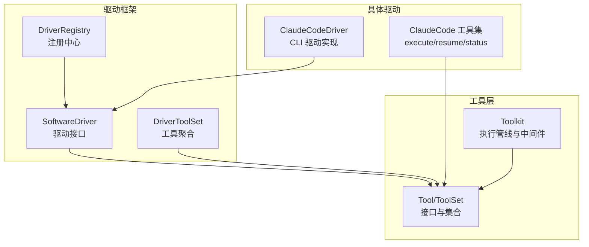
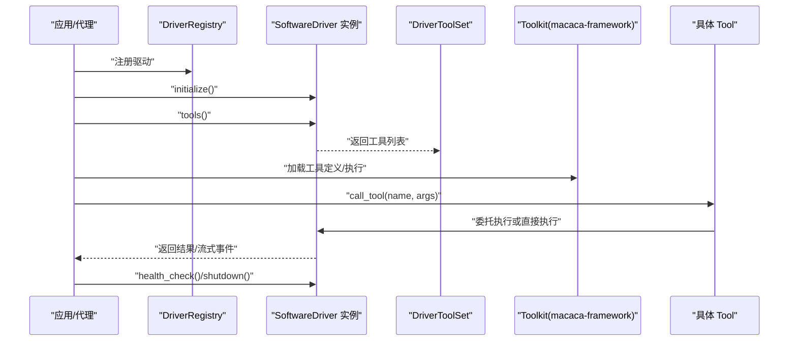
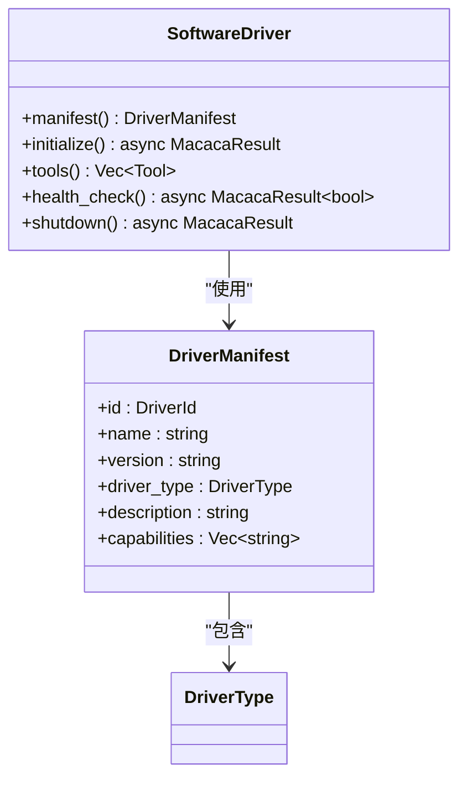
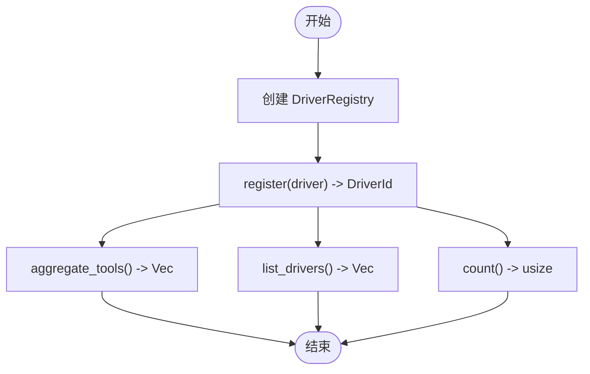
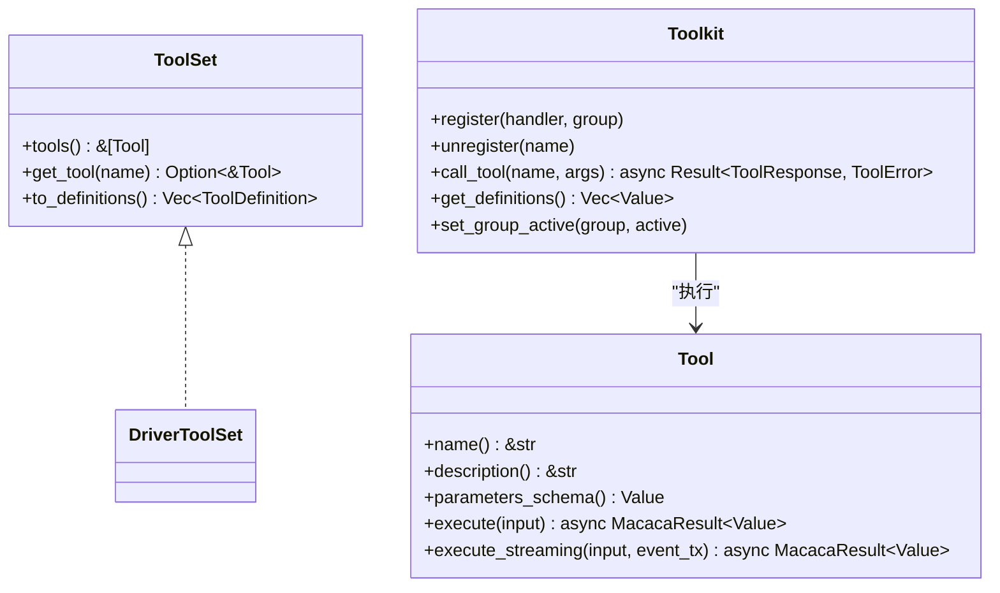
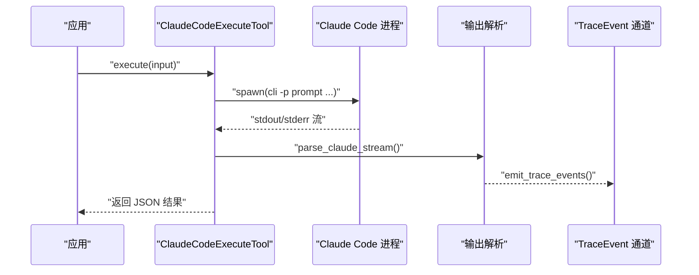
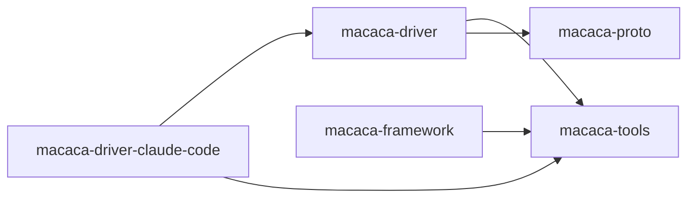

# 自定义驱动开发

<cite>
**本文引用的文件**
- [macaca-driver/src/driver.rs](file://macaca/crates/macaca-driver/src/driver.rs)
- [macaca-driver/src/registry.rs](file://macaca/crates/macaca-driver/src/registry.rs)
- [macaca-driver/src/toolset.rs](file://macaca/crates/macaca-driver/src/toolset.rs)
- [macaca-driver/src/lib.rs](file://macaca/crates/macaca-driver/src/lib.rs)
- [macaca-driver-claude-code/src/driver.rs](file://macaca/crates/macaca-driver-claude-code/src/driver.rs)
- [macaca-driver-claude-code/src/tools.rs](file://macaca/crates/macaca-driver-claude-code/src/tools.rs)
- [macaca-tools/src/tool.rs](file://macaca/crates/macaca-tools/src/tool.rs)
- [macaca-framework/src/tool.rs](file://macaca/crates/macaca-framework/src/tool.rs)
</cite>

## 目录
1. [简介](#简介)
2. [项目结构](#项目结构)
3. [核心组件](#核心组件)
4. [架构总览](#架构总览)
5. [详细组件分析](#详细组件分析)
6. [依赖关系分析](#依赖关系分析)
7. [性能考量](#性能考量)
8. [故障排查指南](#故障排查指南)
9. [结论](#结论)
10. [附录](#附录)

## 简介
本指南面向希望为 Agent OS 开发“自定义驱动”的工程师，系统讲解如何实现 SoftwareDriver trait、生命周期方法、工具定义与元数据配置，并覆盖从项目初始化到测试部署的完整流程。文档还总结了工具接口实现模式、参数校验与返回值处理、调试技巧、性能优化与错误处理策略，并通过 Claude Code 驱动的实际实现给出可复用的工程范式。

## 项目结构
Agent OS 的驱动框架位于 macaca-driver crate，围绕 SoftwareDriver trait 提供统一抽象；具体驱动（如 Claude Code）在独立 crate 中实现；工具层由 macaca-tools 定义 Tool/ToolSet 抽象，框架层 macaca-framework 提供工具执行管线与中间件能力。

图表来源
- [macaca-driver/src/driver.rs:46-61](file://macaca/crates/macaca-driver/src/driver.rs#L46-L61)
- [macaca-driver/src/registry.rs:15-73](file://macaca/crates/macaca-driver/src/registry.rs#L15-L73)
- [macaca-driver/src/toolset.rs:7-29](file://macaca/crates/macaca-driver/src/toolset.rs#L7-L29)
- [macaca-tools/src/tool.rs:24-44](file://macaca/crates/macaca-tools/src/tool.rs#L24-L44)
- [macaca-framework/src/tool.rs:197-402](file://macaca/crates/macaca-framework/src/tool.rs#L197-L402)
- [macaca-driver-claude-code/src/driver.rs:32-61](file://macaca/crates/macaca-driver-claude-code/src/driver.rs#L32-L61)
- [macaca-driver-claude-code/src/tools.rs:27-136](file://macaca/crates/macaca-driver-claude-code/src/tools.rs#L27-L136)

章节来源
- [macaca-driver/src/lib.rs:1-15](file://macaca/crates/macaca-driver/src/lib.rs#L1-L15)
- [macaca-tools/src/lib.rs:1-20](file://macaca/crates/macaca-tools/src/lib.rs#L1-L20)

## 核心组件
- SoftwareDriver：驱动必须实现的生命周期与能力暴露接口，包含元数据、初始化、工具暴露、健康检查、优雅关闭。
- DriverRegistry：线程安全的驱动注册中心，支持注册、注销、清单列举、工具聚合。
- DriverToolSet：将所有驱动工具与独立工具合并为统一 ToolSet。
- Tool/ToolSet：工具接口与工具集合抽象，定义参数 Schema、执行与流式执行。
- ClaudeCodeDriver/ClaudeCode 工具：用户态插件驱动的完整实现范式，展示 CLI 驱动的参数校验、超时控制、流式事件输出等。

章节来源
- [macaca-driver/src/driver.rs:34-61](file://macaca/crates/macaca-driver/src/driver.rs#L34-L61)
- [macaca-driver/src/registry.rs:12-73](file://macaca/crates/macaca-driver/src/registry.rs#L12-L73)
- [macaca-driver/src/toolset.rs:5-29](file://macaca/crates/macaca-driver/src/toolset.rs#L5-L29)
- [macaca-tools/src/tool.rs:22-65](file://macaca/crates/macaca-tools/src/tool.rs#L22-L65)
- [macaca-driver-claude-code/src/driver.rs:18-61](file://macaca/crates/macaca-driver-claude-code/src/driver.rs#L18-L61)
- [macaca-driver-claude-code/src/tools.rs:26-136](file://macaca/crates/macaca-driver-claude-code/src/tools.rs#L26-L136)

## 架构总览
下图展示了从应用侧调用工具到具体驱动执行的端到端流程，以及驱动内部的生命周期管理。

图表来源
- [macaca-driver/src/registry.rs:26-66](file://macaca/crates/macaca-driver/src/registry.rs#L26-L66)
- [macaca-driver/src/driver.rs:46-61](file://macaca/crates/macaca-driver/src/driver.rs#L46-L61)
- [macaca-driver/src/toolset.rs:11-29](file://macaca/crates/macaca-driver/src/toolset.rs#L11-L29)
- [macaca-framework/src/tool.rs:314-371](file://macaca/crates/macaca-framework/src/tool.rs#L314-L371)
- [macaca-driver-claude-code/src/driver.rs:64-121](file://macaca/crates/macaca-driver-claude-code/src/driver.rs#L64-L121)

## 详细组件分析

### SoftwareDriver 生命周期与实现要点
- 元数据 DriverManifest：包含 id、name、version、driver_type、description、capabilities 等，用于发现与管理。
- 生命周期方法：
  - initialize：启动子进程、建立连接、准备运行环境。
  - tools：返回一组 Tool 实例，作为对外能力暴露。
  - health_check：返回目标软件是否可用的布尔判断。
  - shutdown：清理资源、终止子进程、断开连接。
- DriverType：枚举驱动类型（CLI 子进程、REST/GraphQL、UI 自动化、文件/IPC、MCP 协议），用于路由与能力匹配。

图表来源
- [macaca-driver/src/driver.rs:24-61](file://macaca/crates/macaca-driver/src/driver.rs#L24-L61)

章节来源
- [macaca-driver/src/driver.rs:23-61](file://macaca/crates/macaca-driver/src/driver.rs#L23-L61)

### DriverRegistry 注册与工具聚合
- 支持并发安全注册与注销，按 DriverId 管理 SoftwareDriver 实例。
- 提供 list_drivers、count、aggregate_tools 等能力，便于上层发现与组合工具集。

图表来源
- [macaca-driver/src/registry.rs:19-73](file://macaca/crates/macaca-driver/src/registry.rs#L19-L73)

章节来源
- [macaca-driver/src/registry.rs:12-73](file://macaca/crates/macaca-driver/src/registry.rs#L12-L73)

### DriverToolSet 工具聚合
- 将来自各驱动的工具与独立工具合并为统一集合，供 Toolkit 使用。
- 提供空集合与合并构造器，简化组合逻辑。

章节来源
- [macaca-driver/src/toolset.rs:5-29](file://macaca/crates/macaca-driver/src/toolset.rs#L5-L29)

### Tool/ToolSet 接口与 Toolkit 执行管线
- Tool：定义 name、description、parameters_schema、execute、execute_streaming。
- ToolSet：工具集合，支持按名称查找与转换为 LLM 友好的 ToolDefinition 列表。
- Toolkit：集中注册、分组激活/禁用、中间件链式调用、参数预设与优先级合并、最终执行与响应封装。

图表来源
- [macaca-tools/src/tool.rs:22-65](file://macaca/crates/macaca-tools/src/tool.rs#L22-L65)
- [macaca-framework/src/tool.rs:197-402](file://macaca/crates/macaca-framework/src/tool.rs#L197-L402)
- [macaca-driver/src/toolset.rs:25-29](file://macaca/crates/macaca-driver/src/toolset.rs#L25-L29)

章节来源
- [macaca-tools/src/tool.rs:22-65](file://macaca/crates/macaca-tools/src/tool.rs#L22-L65)
- [macaca-framework/src/tool.rs:197-402](file://macaca/crates/macaca-framework/src/tool.rs#L197-L402)

### ClaudeCodeDriver 实战范式
- 驱动职责：将 Claude Code CLI 包装为 SoftwareDriver，暴露三个工具：执行、续会、状态检查。
- 参数校验：在 Tool.execute 中严格校验必填字段，返回结构化错误。
- 超时与健壮性：使用 tokio::time::timeout 控制 CLI 执行时间；捕获 spawn、wait、读取 stdout/stderr 的异常。
- 流式事件：解析 CLI 输出的 JSON 行，向 event_tx 发送 TraceEvent，支持链路追踪与可观测性。
- 健康检查：通过调用二进制 --version 并检查退出码与输出内容，返回可用性信息。

图表来源
- [macaca-driver-claude-code/src/tools.rs:66-136](file://macaca/crates/macaca-driver-claude-code/src/tools.rs#L66-L136)
- [macaca-driver-claude-code/src/tools.rs:273-347](file://macaca/crates/macaca-driver-claude-code/src/tools.rs#L273-L347)
- [macaca-driver-claude-code/src/tools.rs:351-466](file://macaca/crates/macaca-driver-claude-code/src/tools.rs#L351-L466)
- [macaca-driver-claude-code/src/tools.rs:469-572](file://macaca/crates/macaca-driver-claude-code/src/tools.rs#L469-L572)

章节来源
- [macaca-driver-claude-code/src/driver.rs:18-121](file://macaca/crates/macaca-driver-claude-code/src/driver.rs#L18-L121)
- [macaca-driver-claude-code/src/tools.rs:26-266](file://macaca/crates/macaca-driver-claude-code/src/tools.rs#L26-L266)

### 开发流程：从零到上线
- 初始化
  - 新建驱动 crate，依赖 macaca-driver、macaca-tools、macaca-proto。
  - 定义 DriverManifest（含 capabilities）与 DriverType。
- 实现 SoftwareDriver
  - initialize：准备工作目录、连接目标系统、拉起子进程或建立连接。
  - tools：返回若干 Tool 实例，每个 Tool 需要 name、description、parameters_schema、execute。
  - health_check：返回布尔或结构化可用性信息。
  - shutdown：释放资源、终止进程、断开连接。
- 注册与聚合
  - 使用 DriverRegistry.register 注册驱动实例。
  - 通过 DriverToolSet 聚合工具，交由 Toolkit 暴露给代理。
- 测试与部署
  - 编写单元测试覆盖参数校验、超时、错误分支。
  - 在集成测试中验证 initialize -> tools -> health_check -> shutdown 的完整生命周期。
  - 通过 CI 将驱动打包为可安装插件，随 Agent OS 启动时自动发现与注册。

章节来源
- [macaca-driver/src/driver.rs:34-61](file://macaca/crates/macaca-driver/src/driver.rs#L34-L61)
- [macaca-driver/src/registry.rs:26-66](file://macaca/crates/macaca-driver/src/registry.rs#L26-L66)
- [macaca-driver/src/toolset.rs:11-29](file://macaca/crates/macaca-driver/src/toolset.rs#L11-L29)
- [macaca-driver-claude-code/src/driver.rs:37-121](file://macaca/crates/macaca-driver-claude-code/src/driver.rs#L37-L121)

### 工具接口实现模式与最佳实践
- 参数 Schema 设计
  - 使用 JSON Schema 描述输入参数，明确 required 字段与默认值。
  - 对于可选参数，提供合理的默认行为或显式的 preset_args。
- 参数验证
  - 在 Tool.execute 中进行强类型校验与存在性检查，返回结构化错误。
  - 对外部进程或网络请求，设置合理超时与重试策略。
- 返回值处理
  - 统一返回 serde_json::Value，便于上层序列化与 LLM 消费。
  - 对于复杂结果，建议包含会话标识、成本、耗时、错误码等元信息。
- 流式执行
  - 若支持流式输出，使用 execute_streaming 并通过 event_tx 发送 TraceEvent。
  - 解析输出时注意边界情况（部分行、乱序、截断）。

章节来源
- [macaca-tools/src/tool.rs:22-44](file://macaca/crates/macaca-tools/src/tool.rs#L22-L44)
- [macaca-driver-claude-code/src/tools.rs:41-136](file://macaca/crates/macaca-driver-claude-code/src/tools.rs#L41-L136)

### 调试技巧与可观测性
- 日志与追踪
  - 使用 tracing 记录关键路径（如启动、命令行参数、进程退出码）。
  - 在流式执行中，逐行解析并发送 TraceEvent，便于前端可视化。
- 健康检查
  - 提供轻量级健康检查（如 CLI --version），避免阻塞主流程。
- 错误分类
  - 明确区分参数错误、权限错误、超时、外部服务不可达等，便于上层策略处理。

章节来源
- [macaca-driver-claude-code/src/driver.rs:78-84](file://macaca/crates/macaca-driver-claude-code/src/driver.rs#L78-L84)
- [macaca-driver-claude-code/src/tools.rs:231-265](file://macaca/crates/macaca-driver-claude-code/src/tools.rs#L231-L265)
- [macaca-driver-claude-code/src/tools.rs:423-448](file://macaca/crates/macaca-driver-claude-code/src/tools.rs#L423-L448)

### 性能优化建议
- 连接池与复用
  - 对长连接型驱动（REST/GraphQL/UI），复用连接以减少握手开销。
- 异步与背压
  - 流式输出使用无界通道时需配合背压策略，避免内存膨胀。
- 超时与并发
  - 为外部调用设置上限超时；对批量任务采用并发限制与队列控制。
- 缓存与去重
  - 对重复查询或昂贵操作进行缓存；对幂等操作进行去重。

[本节为通用指导，无需列出章节来源]

### 故障排查指南
- 常见问题定位
  - CLI 驱动：检查二进制是否存在、权限是否足够、工作目录是否正确。
  - 网络驱动：确认端点可达、鉴权头是否正确、限流与熔断策略。
  - UI 驱动：确认自动化引擎可用、窗口句柄有效、无障碍权限。
- 错误处理策略
  - 将错误映射为 MacacaError/ToolError 的具体变体，便于上层统一处理。
  - 对可恢复错误（超时、临时网络失败）进行指数退避重试。
  - 对不可恢复错误（参数缺失、权限不足）快速失败并返回清晰提示。

章节来源
- [macaca-driver-claude-code/src/tools.rs:334-347](file://macaca/crates/macaca-driver-claude-code/src/tools.rs#L334-L347)
- [macaca-framework/src/tool.rs:82-99](file://macaca/crates/macaca-framework/src/tool.rs#L82-L99)

## 依赖关系分析
- 驱动框架依赖
  - macaca-driver 依赖 macaca-tools（Tool/ToolSet）、macaca-proto（DriverId、MacacaResult/错误）。
  - 具体驱动（如 Claude Code）依赖驱动框架与工具层，并通过配置模块管理运行参数。
- 执行链路
  - 应用侧通过 Toolkit 调用 Tool，Tool 可委托 SoftwareDriver 或直接执行。
  - DriverRegistry 负责驱动生命周期管理与工具聚合。

图表来源
- [macaca-driver/src/lib.rs:12-14](file://macaca/crates/macaca-driver/src/lib.rs#L12-L14)
- [macaca-driver-claude-code/src/driver.rs:11-16](file://macaca/crates/macaca-driver-claude-code/src/driver.rs#L11-L16)
- [macaca-framework/src/tool.rs:1-15](file://macaca/crates/macaca-framework/src/tool.rs#L1-L15)

章节来源
- [macaca-driver/src/lib.rs:1-15](file://macaca/crates/macaca-driver/src/lib.rs#L1-L15)
- [macaca-driver-claude-code/src/driver.rs:1-17](file://macaca/crates/macaca-driver-claude-code/src/driver.rs#L1-L17)

## 性能考量
- I/O 与 CPU 密集度
  - 对 I/O 密集型（网络/文件）驱动，优先异步与连接复用。
  - 对 CPU 密集型（编译/渲染）驱动，考虑分片与并行化。
- 资源隔离
  - 为每个驱动实例分配独立工作目录与命名空间，避免竞争。
- 监控指标
  - 记录执行耗时、吞吐、错误率、超时比例，辅助容量规划与告警。

[本节为通用指导，无需列出章节来源]

## 故障排查指南
- 参数校验失败
  - 检查 Tool.parameters_schema 与调用方传参是否一致。
- 外部进程异常
  - 查看 spawn/wait/read 的错误信息，确认二进制路径、环境变量、权限。
- 超时与中断
  - 调整超时阈值；必要时在流式执行中主动 kill 子进程并上报。
- 健康检查不通过
  - 使用最小化命令（如 --version）验证可用性；记录 stdout/stderr 以便诊断。

章节来源
- [macaca-driver-claude-code/src/tools.rs:66-97](file://macaca/crates/macaca-driver-claude-code/src/tools.rs#L66-L97)
- [macaca-driver-claude-code/src/tools.rs:334-347](file://macaca/crates/macaca-driver-claude-code/src/tools.rs#L334-L347)
- [macaca-driver-claude-code/src/tools.rs:441-448](file://macaca/crates/macaca-driver-claude-code/src/tools.rs#L441-L448)

## 结论
通过遵循 SoftwareDriver 生命周期与 Tool 接口规范，结合 DriverRegistry 的注册与聚合机制，开发者可以快速构建稳定、可观测、可扩展的外部系统集成驱动。Claude Code 驱动提供了 CLI 驱动的完整实现范式，包括参数校验、超时控制、流式事件与健康检查，可作为多类驱动（REST、UI、文件/IPC、MCP）的参考模板。

## 附录
- 版本兼容性
  - 驱动应声明 DriverManifest.version，并在 major 版本变更时保持向后兼容或提供迁移指引。
- 依赖管理
  - 使用 Cargo.toml 明确版本范围与特性开关；避免在驱动内硬编码外部系统版本。
- 安全与权限
  - 对文件/进程类操作，提供最小权限模型；对网络类操作，支持证书与代理配置。

[本节为通用指导，无需列出章节来源]