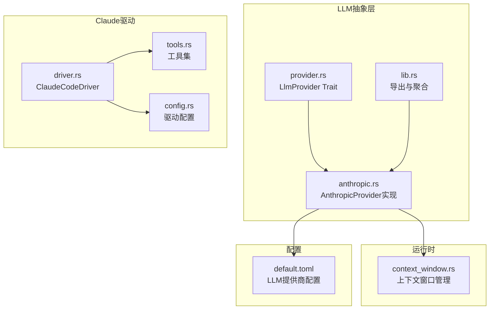
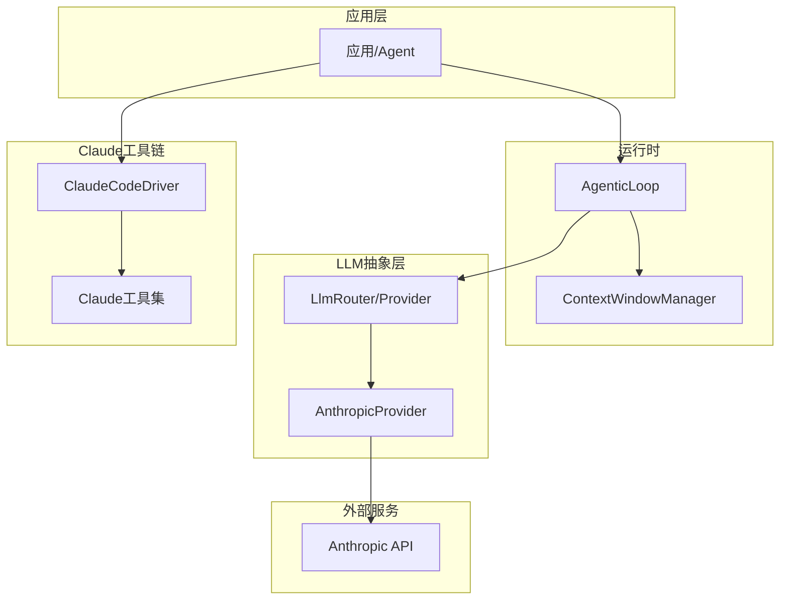
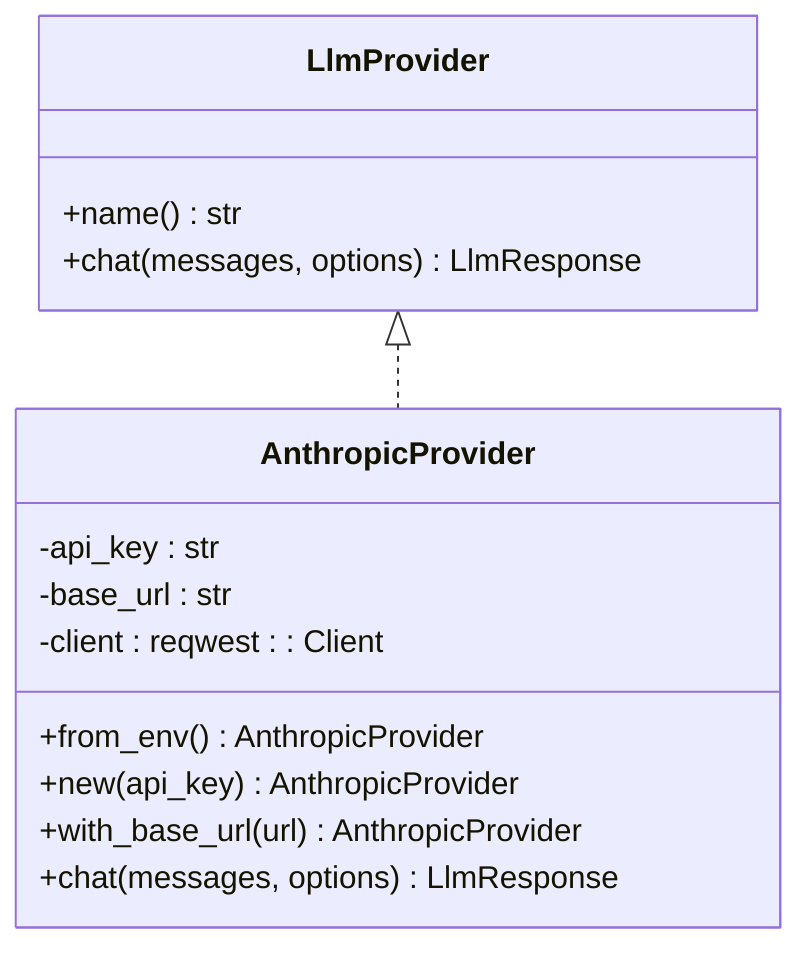
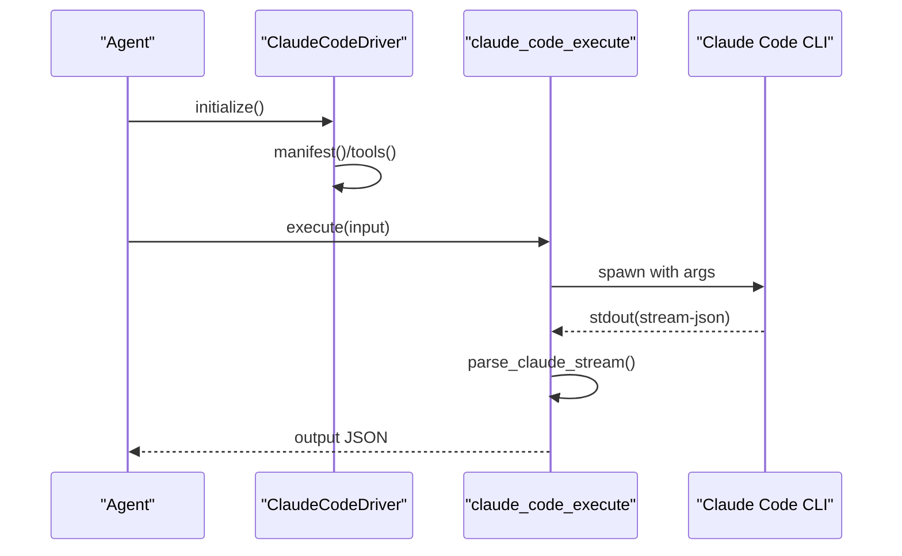
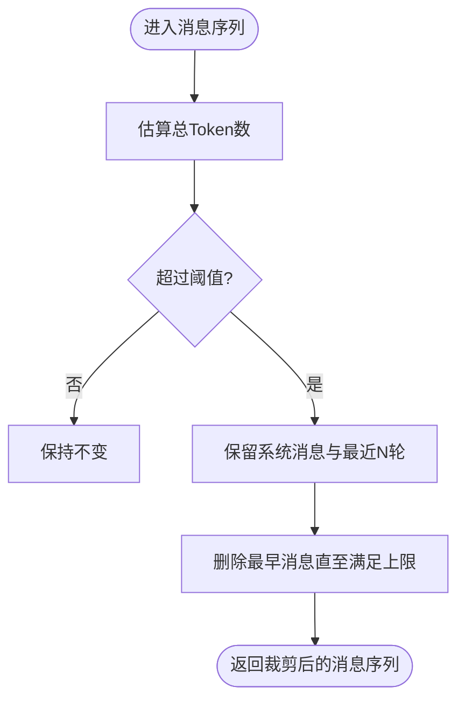
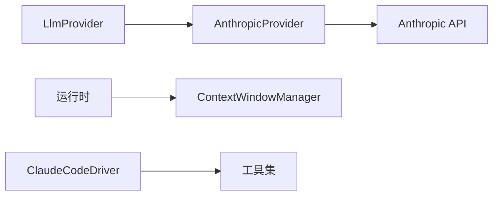

# Anthropic集成

<cite>
**本文档引用的文件**
- [anthropic.rs](file://macaca/crates/macaca-llm/src/anthropic.rs)
- [provider.rs](file://macaca/crates/macaca-llm/src/provider.rs)
- [lib.rs](file://macaca/crates/macaca-llm/src/lib.rs)
- [default.toml](file://macaca/config/default.toml)
- [driver.rs](file://macaca/crates/macaca-driver-claude-code/src/driver.rs)
- [config.rs](file://macaca/crates/macaca-driver-claude-code/src/config.rs)
- [tools.rs](file://macaca/crates/macaca-driver-claude-code/src/tools.rs)
- [context_window.rs](file://macaca/crates/macaca-runtime/src/context_window.rs)
- [ARCHITECTURE-v2.md](file://macaca/ARCHITECTURE-v2.md)
- [CLAUDE.md](file://CLAUDE.md)
</cite>

## 目录
1. [简介](#简介)
2. [项目结构](#项目结构)
3. [核心组件](#核心组件)
4. [架构总览](#架构总览)
5. [详细组件分析](#详细组件分析)
6. [依赖关系分析](#依赖关系分析)
7. [性能考量](#性能考量)
8. [故障排除指南](#故障排除指南)
9. [结论](#结论)
10. [附录](#附录)

## 简介
本文件系统性阐述在Macaca Agent操作系统中对Anthropic Claude API的集成实现，涵盖API密钥管理、请求格式适配、响应处理机制，以及Claude特有能力（工具调用、内容块、上下文窗口管理）在该平台中的落地方式。同时给出配置示例、错误处理与调试技巧、性能优化建议与监控指标说明。

## 项目结构
与Anthropic集成相关的核心代码位于以下位置：
- LLM抽象与Anthropic实现：`macaca/crates/macaca-llm/src/`
- 驱动与工具：`macaca/crates/macaca-driver-claude-code/src/`
- 运行时上下文窗口管理：`macaca/crates/macaca-runtime/src/context_window.rs`
- 全局配置：`macaca/config/default.toml`
- 架构文档：`macaca/ARCHITECTURE-v2.md`、`CLAUDE.md`

**图表来源**
- [provider.rs:1-20](file://macaca/crates/macaca-llm/src/provider.rs#L1-L20)
- [anthropic.rs:1-288](file://macaca/crates/macaca-llm/src/anthropic.rs#L1-L288)
- [lib.rs:1-52](file://macaca/crates/macaca-llm/src/lib.rs#L1-L52)
- [context_window.rs:1-66](file://macaca/crates/macaca-runtime/src/context_window.rs#L1-L66)
- [default.toml:15-17](file://macaca/config/default.toml#L15-L17)
- [driver.rs:1-175](file://macaca/crates/macaca-driver-claude-code/src/driver.rs#L1-L175)
- [tools.rs:1-649](file://macaca/crates/macaca-driver-claude-code/src/tools.rs#L1-L649)
- [config.rs:1-146](file://macaca/crates/macaca-driver-claude-code/src/config.rs#L1-L146)

**章节来源**
- [anthropic.rs:1-288](file://macaca/crates/macaca-llm/src/anthropic.rs#L1-L288)
- [provider.rs:1-20](file://macaca/crates/macaca-llm/src/provider.rs#L1-L20)
- [lib.rs:1-52](file://macaca/crates/macaca-llm/src/lib.rs#L1-L52)
- [default.toml:15-17](file://macaca/config/default.toml#L15-L17)
- [driver.rs:1-175](file://macaca/crates/macaca-driver-claude-code/src/driver.rs#L1-L175)
- [tools.rs:1-649](file://macaca/crates/macaca-driver-claude-code/src/tools.rs#L1-L649)
- [config.rs:1-146](file://macaca/crates/macaca-driver-claude-code/src/config.rs#L1-L146)
- [context_window.rs:1-66](file://macaca/crates/macaca-runtime/src/context_window.rs#L1-L66)
- [ARCHITECTURE-v2.md:176-192](file://macaca/ARCHITECTURE-v2.md#L176-L192)
- [CLAUDE.md:1-296](file://CLAUDE.md#L1-L296)

## 核心组件
- LlmProvider抽象：统一LLM调用接口，支持多提供商路由与扩展。
- AnthropicProvider：实现Claude Messages API的请求封装、消息格式转换、工具调用解析与响应映射。
- ClaudeCodeDriver：将Claude Code CLI作为软件驱动，暴露执行、续会、状态等工具，支持流式输出与事件追踪。
- 上下文窗口管理：在运行时对消息进行Token估算与截断，确保不超过模型上下文限制。
- 配置体系：通过default.toml集中管理各提供商的API密钥与基础URL。

**章节来源**
- [provider.rs:1-20](file://macaca/crates/macaca-llm/src/provider.rs#L1-L20)
- [anthropic.rs:12-37](file://macaca/crates/macaca-llm/src/anthropic.rs#L12-L37)
- [driver.rs:32-61](file://macaca/crates/macaca-driver-claude-code/src/driver.rs#L32-L61)
- [tools.rs:27-98](file://macaca/crates/macaca-driver-claude-code/src/tools.rs#L27-L98)
- [context_window.rs:8-27](file://macaca/crates/macaca-runtime/src/context_window.rs#L8-L27)
- [default.toml:15-17](file://macaca/config/default.toml#L15-L17)

## 架构总览
下图展示Anthropic集成在系统中的位置与交互关系：

**图表来源**
- [ARCHITECTURE-v2.md:176-192](file://macaca/ARCHITECTURE-v2.md#L176-L192)
- [anthropic.rs:170-259](file://macaca/crates/macaca-llm/src/anthropic.rs#L170-L259)
- [driver.rs:63-121](file://macaca/crates/macaca-driver-claude-code/src/driver.rs#L63-L121)
- [context_window.rs:29-66](file://macaca/crates/macaca-runtime/src/context_window.rs#L29-L66)

## 详细组件分析

### AnthropicProvider实现
- API密钥管理
  - 支持从环境变量加载密钥，若未设置则抛出配置错误。
  - 支持自定义基础URL，便于代理或测试环境。
- 请求格式适配
  - 将通用消息结构转换为Claude Messages API的消息数组，系统消息单独提取。
  - 支持文本与内容块混合，工具调用以tool_use块表示，工具结果以tool_result块表示。
  - 可选地携带tools定义（名称、描述、JSON Schema参数）用于函数调用。
- 响应处理机制
  - 解析响应中的文本块与tool_use块，组装为统一的响应对象。
  - 提供finish_reason、Token用量统计与可选的tool_calls列表。
- 错误处理
  - 对HTTP失败状态与解析失败进行包装，便于上层统一处理。

**图表来源**
- [provider.rs:8-19](file://macaca/crates/macaca-llm/src/provider.rs#L8-L19)
- [anthropic.rs:12-37](file://macaca/crates/macaca-llm/src/anthropic.rs#L12-L37)
- [anthropic.rs:170-259](file://macaca/crates/macaca-llm/src/anthropic.rs#L170-L259)

**章节来源**
- [anthropic.rs:18-37](file://macaca/crates/macaca-llm/src/anthropic.rs#L18-L37)
- [anthropic.rs:111-168](file://macaca/crates/macaca-llm/src/anthropic.rs#L111-L168)
- [anthropic.rs:176-259](file://macaca/crates/macaca-llm/src/anthropic.rs#L176-L259)

### Claude Code驱动与工具
- 驱动能力
  - 作为软件驱动，暴露执行、续会、状态检查三类工具。
  - 支持配置模型、工作目录、权限模式、最大轮次、超时等参数。
- 工具执行
  - 执行工具：调用Claude Code CLI，支持流式输出与事件追踪。
  - 续会工具：基于会话ID继续对话。
  - 状态工具：检查CLI可用性并返回版本信息。
- 输出解析
  - 解析CLI输出的流式JSON，提取思考、工具调用、文本与工具结果等事件，用于前端可视化与审计。

**图表来源**
- [driver.rs:63-121](file://macaca/crates/macaca-driver-claude-code/src/driver.rs#L63-L121)
- [tools.rs:66-135](file://macaca/crates/macaca-driver-claude-code/src/tools.rs#L66-L135)
- [tools.rs:273-347](file://macaca/crates/macaca-driver-claude-code/src/tools.rs#L273-L347)

**章节来源**
- [driver.rs:32-61](file://macaca/crates/macaca-driver-claude-code/src/driver.rs#L32-L61)
- [driver.rs:87-99](file://macaca/crates/macaca-driver-claude-code/src/driver.rs#L87-L99)
- [tools.rs:27-98](file://macaca/crates/macaca-driver-claude-code/src/tools.rs#L27-L98)
- [tools.rs:142-200](file://macaca/crates/macaca-driver-claude-code/src/tools.rs#L142-L200)
- [tools.rs:206-266](file://macaca/crates/macaca-driver-claude-code/src/tools.rs#L206-L266)
- [tools.rs:273-466](file://macaca/crates/macaca-driver-claude-code/src/tools.rs#L273-L466)

### 上下文窗口管理
- Token估算
  - 基于字符数与CJK字符比例估算Token数量，并考虑角色元数据开销。
- 截断策略
  - 当接近阈值时按配置截断旧消息，保留系统消息与最近若干轮对话。
- 配置项
  - 最大Token、截断阈值、保留最近轮次等均可定制。

**图表来源**
- [context_window.rs:42-66](file://macaca/crates/macaca-runtime/src/context_window.rs#L42-L66)

**章节来源**
- [context_window.rs:8-27](file://macaca/crates/macaca-runtime/src/context_window.rs#L8-L27)
- [context_window.rs:42-66](file://macaca/crates/macaca-runtime/src/context_window.rs#L42-L66)

### 配置与密钥管理
- LLM提供商配置
  - Anthropic段落包含api_key与base_url字段，支持从环境变量或占位符加载。
- 环境变量
  - AnthropicProvider从环境变量加载API密钥，未设置时初始化失败。
- 驱动配置
  - ClaudeCodeDriver支持模型、工作目录、权限模式、最大轮次、超时等配置。

**章节来源**
- [default.toml:15-17](file://macaca/config/default.toml#L15-L17)
- [anthropic.rs:19-22](file://macaca/crates/macaca-llm/src/anthropic.rs#L19-L22)
- [config.rs:22-55](file://macaca/crates/macaca-driver-claude-code/src/config.rs#L22-L55)

## 依赖关系分析
- Provider接口与实现
  - LlmProvider为抽象接口，AnthropicProvider实现具体协议细节。
- 运行时集成
  - 上下文窗口管理在运行时对消息进行预处理，避免越界。
- 驱动生态
  - ClaudeCodeDriver通过工具集与Agent协作，形成“本地CLI+远程LLM”的混合能力。

**图表来源**
- [provider.rs:8-19](file://macaca/crates/macaca-llm/src/provider.rs#L8-L19)
- [anthropic.rs:170-259](file://macaca/crates/macaca-llm/src/anthropic.rs#L170-L259)
- [context_window.rs:29-66](file://macaca/crates/macaca-runtime/src/context_window.rs#L29-L66)
- [driver.rs:87-99](file://macaca/crates/macaca-driver-claude-code/src/driver.rs#L87-L99)

**章节来源**
- [lib.rs:30-52](file://macaca/crates/macaca-llm/src/lib.rs#L30-L52)
- [ARCHITECTURE-v2.md:176-192](file://macaca/ARCHITECTURE-v2.md#L176-L192)

## 性能考量
- 请求批量化与合并
  - 在Agent循环中尽可能合并短消息，减少往返次数。
- 上下文压缩
  - 合理设置上下文窗口阈值与保留轮次，避免频繁截断导致信息丢失。
- 超时与重试
  - Claude Code CLI工具设置合理超时，避免长时间阻塞。
- 日志与可观测性
  - 使用trace事件输出关键阶段（思考、工具调用、文本），便于性能分析与问题定位。

[本节为通用指导，无需特定文件引用]

## 故障排除指南
- Anthropic API错误
  - 检查环境变量是否正确设置，确认基础URL与模型名称。
  - 关注HTTP状态码与错误响应体，结合日志定位问题。
- Claude Code CLI不可用
  - 使用状态工具检查CLI可用性与版本。
  - 确认工作目录存在且权限允许，必要时调整权限模式。
- 工具调用异常
  - 核对工具Schema与参数，确保与工具定义一致。
  - 查看trace事件，定位工具执行阶段的错误。
- 上下文溢出
  - 调整上下文窗口配置，增加保留轮次或提高阈值。
  - 在Agent层面减少冗余历史消息。

**章节来源**
- [anthropic.rs:217-223](file://macaca/crates/macaca-llm/src/anthropic.rs#L217-L223)
- [tools.rs:228-265](file://macaca/crates/macaca-driver-claude-code/src/tools.rs#L228-L265)
- [tools.rs:441-448](file://macaca/crates/macaca-driver-claude-code/src/tools.rs#L441-L448)
- [context_window.rs:19-27](file://macaca/crates/macaca-runtime/src/context_window.rs#L19-L27)

## 结论
本集成在Macaca框架内提供了对Anthropic Claude API的完整支持：从Provider抽象到消息格式转换、工具调用解析与响应映射；配合Claude Code驱动实现本地编程能力；并通过上下文窗口管理保障长对话稳定性。结合合理的配置与可观测性实践，可在生产环境中可靠地使用Claude能力。

[本节为总结，无需特定文件引用]

## 附录

### 配置示例与最佳实践
- LLM提供商配置
  - 在配置文件中设置Anthropic的api_key与base_url，支持从环境变量加载。
- Claude Code驱动配置
  - 指定工作目录、模型、权限模式与超时时间，按需启用危险跳过权限模式。
- 最佳实践
  - 为不同场景选择合适模型与温度、最大生成长度。
  - 合理设置上下文窗口，避免频繁截断。
  - 使用trace事件与日志记录关键步骤，便于审计与优化。

**章节来源**
- [default.toml:15-17](file://macaca/config/default.toml#L15-L17)
- [config.rs:65-103](file://macaca/crates/macaca-driver-claude-code/src/config.rs#L65-L103)
- [CLAUDE.md:72-175](file://CLAUDE.md#L72-L175)