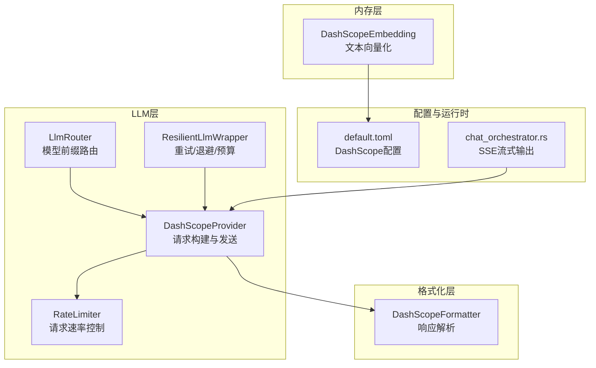
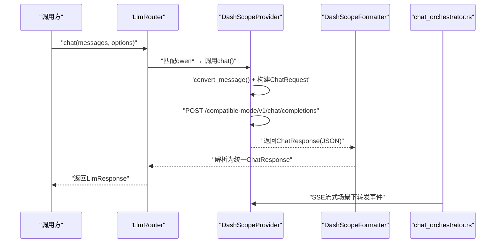
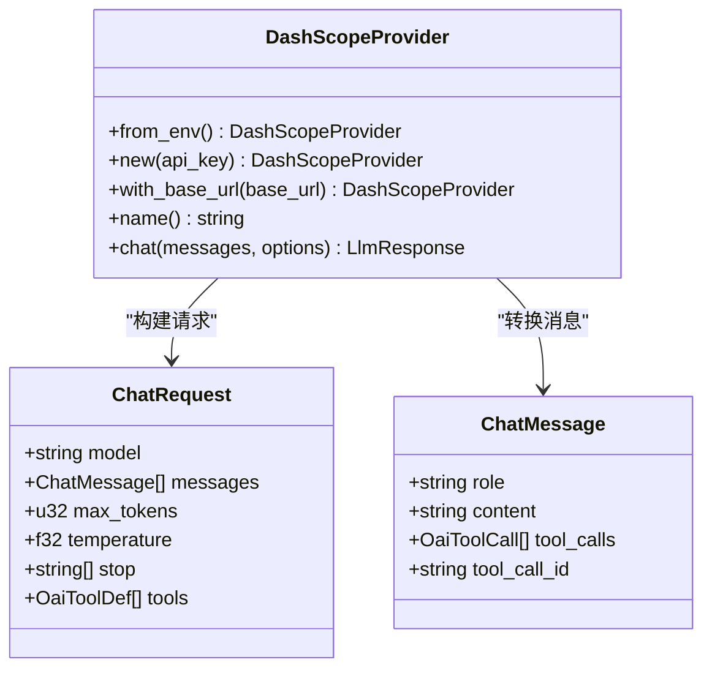
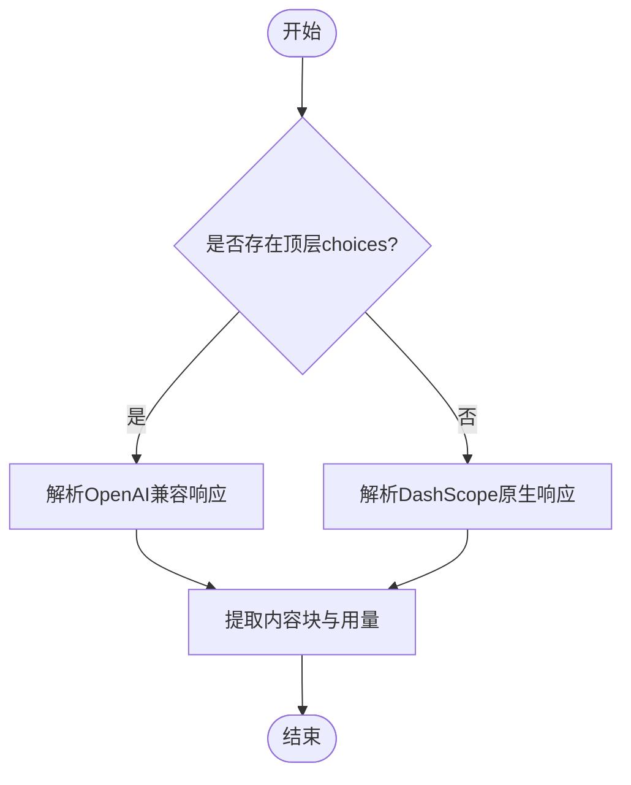
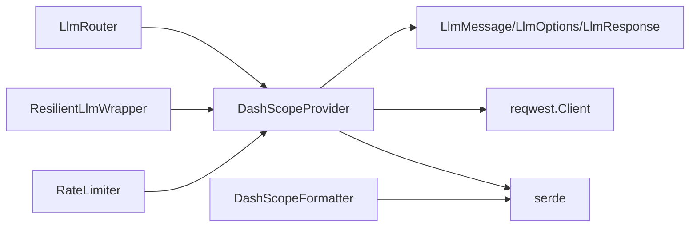

# DashScope集成

<cite>
**本文档引用的文件**
- [dashscope.rs](file://macaca/crates/macaca-llm/src/dashscope.rs)
- [formatter.rs](file://macaca/crates/macaca-framework/src/formatter.rs)
- [embedding.rs](file://macaca/crates/macaca-memory/src/embedding.rs)
- [lib.rs](file://macaca/crates/macaca-llm/src/lib.rs)
- [provider.rs](file://macaca/crates/macaca-llm/src/provider.rs)
- [router.rs](file://macaca/crates/macaca-llm/src/router.rs)
- [resilient.rs](file://macaca/crates/macaca-llm/src/resilient.rs)
- [rate_limit.rs](file://macaca/crates/macaca-llm/src/rate_limit.rs)
- [default.toml](file://macaca/config/default.toml)
- [live_llm_test.rs](file://macaca/crates/macaca-integration-tests/tests/live_llm_test.rs)
- [chat_orchestrator.rs](file://macaca/crates/macaca-web/src/chat_orchestrator.rs)
</cite>

## 目录
1. [简介](#简介)
2. [项目结构](#项目结构)
3. [核心组件](#核心组件)
4. [架构总览](#架构总览)
5. [详细组件分析](#详细组件分析)
6. [依赖关系分析](#依赖关系分析)
7. [性能考虑](#性能考虑)
8. [故障排除指南](#故障排除指南)
9. [结论](#结论)
10. [附录](#附录)

## 简介
本文件系统性地文档化了在该代码库中对阿里云DashScope（通义千问）的集成实现。内容涵盖：
- API密钥配置与环境变量读取
- 请求格式转换（OpenAI兼容模式）
- 响应解析与多模态支持
- 支持的通义千问系列模型与参数设置
- 特色能力（流式输出、多模态、企业级特性）
- 配置示例、错误处理策略与性能调优建议
- 使用限制、成本控制与监控实现要点

## 项目结构
DashScope集成主要分布在以下模块：
- LLM适配层：提供DashScope兼容接口与消息格式转换
- 格式化器：统一OpenAI/DashScope响应解析
- 内存嵌入：文本向量化服务
- 路由与注册：自动识别qwen前缀模型并路由到DashScope
- 可靠性与限流：重试、退避、预算与速率限制
- 配置：默认配置文件中的DashScope段落
- Web流式：SSE事件流以支持流式输出

图表来源
- [dashscope.rs:18-49](file://macaca/crates/macaca-llm/src/dashscope.rs#L18-49)
- [formatter.rs:303-407](file://macaca/crates/macaca-framework/src/formatter.rs#L303-L407)
- [embedding.rs:70-125](file://macaca/crates/macaca-memory/src/embedding.rs#L70-L125)
- [router.rs:78-112](file://macaca/crates/macaca-llm/src/router.rs#L78-L112)
- [resilient.rs:12-41](file://macaca/crates/macaca-llm/src/resilient.rs#L12-L41)
- [rate_limit.rs:41-72](file://macaca/crates/macaca-llm/src/rate_limit.rs#L41-L72)
- [default.toml:19-22](file://macaca/config/default.toml#L19-L22)
- [chat_orchestrator.rs:2245-2258](file://macaca/crates/macaca-web/src/chat_orchestrator.rs#L2245-L2258)

章节来源
- [lib.rs:1-52](file://macaca/crates/macaca-llm/src/lib.rs#L1-L52)
- [provider.rs:1-20](file://macaca/crates/macaca-llm/src/provider.rs#L1-L20)
- [router.rs:78-112](file://macaca/crates/macaca-llm/src/router.rs#L78-L112)
- [default.toml:19-22](file://macaca/config/default.toml#L19-L22)

## 核心组件
- DashScopeProvider：基于OpenAI兼容端点的Qwen系列模型适配器，负责消息格式转换、请求构建、认证与响应解析。
- DashScopeFormatter：统一解析OpenAI兼容与DashScope原生响应格式，支持工具调用与多模态内容块。
- DashScopeEmbedding：文本向量化服务，使用DashScope Embedding API。
- LlmRouter：根据模型名称前缀自动路由到DashScope（qwen*）。
- ResilientLlmWrapper：提供可配置的重试、指数退避、预算控制与回退模型。
- RateLimiter：基于时间窗口的请求速率控制。

章节来源
- [dashscope.rs:18-49](file://macaca/crates/macaca-llm/src/dashscope.rs#L18-49)
- [formatter.rs:303-407](file://macaca/crates/macaca-framework/src/formatter.rs#L303-L407)
- [embedding.rs:70-125](file://macaca/crates/macaca-memory/src/embedding.rs#L70-L125)
- [router.rs:78-112](file://macaca/crates/macaca-llm/src/router.rs#L78-L112)
- [resilient.rs:12-41](file://macaca/crates/macaca-llm/src/resilient.rs#L12-L41)
- [rate_limit.rs:41-72](file://macaca/crates/macaca-llm/src/rate_limit.rs#L41-L72)

## 架构总览
DashScope集成采用“适配器+格式化器+路由”的分层设计：
- 适配器层：DashScopeProvider将内部消息结构转换为OpenAI兼容请求，并通过Bearer Token认证调用DashScope端点。
- 格式化器层：DashScopeFormatter统一解析两种响应格式（OpenAI兼容与DashScope原生），提取内容、用量与工具调用。
- 路由层：LlmRouter依据模型前缀（如qwen*）自动选择DashScopeProvider。
- 可靠性层：ResilientLlmWrapper与RateLimiter共同保障稳定性与资源控制。
- 流式输出：Web层通过SSE事件桥接LLM输出，实现流式交互。

图表来源
- [router.rs:78-112](file://macaca/crates/macaca-llm/src/router.rs#L78-L112)
- [dashscope.rs:185-260](file://macaca/crates/macaca-llm/src/dashscope.rs#L185-L260)
- [formatter.rs:320-406](file://macaca/crates/macaca-framework/src/formatter.rs#L320-L406)
- [chat_orchestrator.rs:2245-2258](file://macaca/crates/macaca-web/src/chat_orchestrator.rs#L2245-L2258)

## 详细组件分析

### DashScopeProvider（适配器）
- 功能职责
  - 从环境变量读取API密钥或显式传入
  - 将内部消息结构转换为OpenAI兼容的ChatMessage
  - 构造ChatRequest（模型、消息、温度、最大生成长度、停止词、工具定义）
  - 通过Bearer Token访问DashScope兼容端点
  - 解析响应为统一的LlmResponse，包含内容、用量、结束原因与工具调用
- 关键实现要点
  - 角色映射：System/User/Assistant/Tool → system/user/assistant/tool
  - 工具调用序列化：函数名与JSON参数字符串
  - 错误处理：HTTP状态码与解析失败的统一错误包装
- 支持的模型
  - 通过路由规则自动识别qwen*前缀（含qwen-turbo、qwen-plus、qwen-max、qwen3-max等）

图表来源
- [dashscope.rs:18-49](file://macaca/crates/macaca-llm/src/dashscope.rs#L18-49)
- [dashscope.rs:53-104](file://macaca/crates/macaca-llm/src/dashscope.rs#L53-L104)
- [dashscope.rs:185-260](file://macaca/crates/macaca-llm/src/dashscope.rs#L185-L260)

章节来源
- [dashscope.rs:18-49](file://macaca/crates/macaca-llm/src/dashscope.rs#L18-49)
- [dashscope.rs:133-177](file://macaca/crates/macaca-llm/src/dashscope.rs#L133-L177)
- [dashscope.rs:185-260](file://macaca/crates/macaca-llm/src/dashscope.rs#L185-L260)
- [router.rs:78-112](file://macaca/crates/macaca-llm/src/router.rs#L78-L112)

### DashScopeFormatter（响应解析）
- 功能职责
  - 优先尝试OpenAI兼容格式解析
  - 若无顶层choices，则解析DashScope原生格式（output.choices与usage字段）
  - 提取内容块（文本/工具调用），并构造统一ChatResponse
- 多模态与工具调用
  - 支持tool_calls解析与参数反序列化
  - 文本内容与工具调用混合输出

图表来源
- [formatter.rs:320-406](file://macaca/crates/macaca-framework/src/formatter.rs#L320-L406)

章节来源
- [formatter.rs:303-407](file://macaca/crates/macaca-framework/src/formatter.rs#L303-L407)

### DashScopeEmbedding（文本向量化）
- 功能职责
  - 使用DashScope Embedding API进行文本向量化
  - 默认模型：text-embedding-v4
  - 参数：text_type=document
  - 错误处理：HTTP状态码与解析失败的统一错误包装
- 维度
  - 返回向量维度由实现固定（用于内存嵌入）

章节来源
- [embedding.rs:70-125](file://macaca/crates/macaca-memory/src/embedding.rs#L70-L125)

### 路由与注册（自动识别qwen*）
- 路由规则
  - qwen* → dashscope
  - 其他前缀：openai/anthropic/deepseek等
- 自动注册
  - LlmRouter在初始化时按规则注册Provider

章节来源
- [router.rs:78-112](file://macaca/crates/macaca-llm/src/router.rs#L78-L112)
- [lib.rs:12-27](file://macaca/crates/macaca-llm/src/lib.rs#L12-L27)

### 可靠性与限流
- 重试与退避
  - 可配置最大重试次数、基础退避时间与最大退避时间
  - 可配置HTTP状态码作为可重试条件
  - 支持预算上限（USD）与回退模型列表
- 速率限制
  - 基于滑动窗口的时间戳队列
  - 支持每分钟请求数配置

章节来源
- [resilient.rs:12-41](file://macaca/crates/macaca-llm/src/resilient.rs#L12-L41)
- [resilient.rs:91-122](file://macaca/crates/macaca-llm/src/resilient.rs#L91-L122)
- [rate_limit.rs:41-72](file://macaca/crates/macaca-llm/src/rate_limit.rs#L41-L72)

## 依赖关系分析
- 组件耦合
  - DashScopeProvider依赖LlmProvider接口与内部消息类型
  - DashScopeFormatter独立于具体Provider，专注于解析
  - LlmRouter与ResilientLlmWrapper通过Provider抽象解耦
- 外部依赖
  - HTTP客户端（reqwest）用于请求发送
  - 序列化库（serde）用于请求/响应编解码
  - 环境变量读取用于API密钥注入

图表来源
- [dashscope.rs:1-16](file://macaca/crates/macaca-llm/src/dashscope.rs#L1-L16)
- [formatter.rs:303-312](file://macaca/crates/macaca-framework/src/formatter.rs#L303-L312)
- [router.rs:78-112](file://macaca/crates/macaca-llm/src/router.rs#L78-L112)
- [resilient.rs:1-11](file://macaca/crates/macaca-llm/src/resilient.rs#L1-L11)

## 性能考虑
- 请求批量化
  - 合理设置max_tokens与temperature，避免过长上下文导致延迟增加
- 重试策略
  - 对429/500/502/503等临时错误启用重试，结合指数退避降低抖动
- 速率限制
  - 使用RateLimiter控制RPM，避免触发平台限流
- 流式输出
  - SSE事件流可降低首字节延迟，提升用户体验
- 成本控制
  - 通过CostTracker统计用量，结合ResilientConfig的预算上限防止超支

## 故障排除指南
- 常见错误与定位
  - API密钥未设置：from_env()会报错；检查环境变量DASHSCOPE_API_KEY
  - HTTP错误：查看状态码与响应体，确认模型名、参数与网络连通性
  - 响应解析失败：确认是否为OpenAI兼容或DashScope原生格式
- 排查步骤
  - 启用调试日志，观察请求URL、认证头与响应结构
  - 使用集成测试样例验证qwen-turbo/qwen-max/qwen3-max
  - 检查路由规则，确保模型名以qwen开头
- 回退与重试
  - 配置fallback_models与retry_on_status，提高可用性
  - 设置max_budget_usd，避免异常流量导致成本飙升

章节来源
- [dashscope.rs:268-292](file://macaca/crates/macaca-llm/src/dashscope.rs#L268-L292)
- [resilient.rs:91-122](file://macaca/crates/macaca-llm/src/resilient.rs#L91-L122)
- [live_llm_test.rs:33-83](file://macaca/crates/macaca-integration-tests/tests/live_llm_test.rs#L33-L83)

## 结论
该DashScope集成通过OpenAI兼容端点实现了对通义千问系列模型的统一接入，具备良好的扩展性与可靠性。配合格式化器、路由、限流与重试机制，可在生产环境中稳定运行。建议在实际部署中：
- 明确配置API密钥与默认模型
- 合理设置重试与预算策略
- 利用SSE实现流式输出体验
- 通过日志与监控持续优化性能与成本

## 附录

### 配置示例（来自默认配置文件）
- LLM提供商段落
  - 供应商：dashscope
  - API密钥：DASHSCOPE_API_KEY
  - 基础URL：兼容模式v1端点
  - 默认模型：qwen3-max
- 内存嵌入段落
  - 提供商：dashscope
  - 模型：text-embedding-v4
  - 维度：1024
  - 基础URL：兼容模式v1端点

章节来源
- [default.toml:19-22](file://macaca/config/default.toml#L19-L22)
- [default.toml:67-72](file://macaca/config/default.toml#L67-L72)

### API使用限制与成本控制
- 使用限制
  - 通过路由规则限定qwen*模型走DashScope
  - 通过RateLimiter限制RPM
- 成本控制
  - ResilientConfig支持预算上限
  - CostTracker记录请求次数与token用量
- 监控实现
  - Web层通过SSE事件流输出中间结果
  - 日志级别与OTLP配置位于observability段

章节来源
- [router.rs:78-112](file://macaca/crates/macaca-llm/src/router.rs#L78-L112)
- [rate_limit.rs:41-72](file://macaca/crates/macaca-llm/src/rate_limit.rs#L41-L72)
- [resilient.rs:12-41](file://macaca/crates/macaca-llm/src/resilient.rs#L12-L41)
- [default.toml:106-119](file://macaca/config/default.toml#L106-L119)
- [chat_orchestrator.rs:2245-2258](file://macaca/crates/macaca-web/src/chat_orchestrator.rs#L2245-L2258)