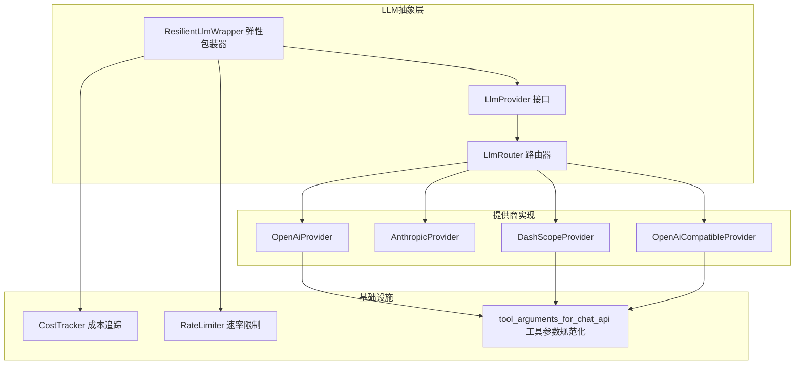
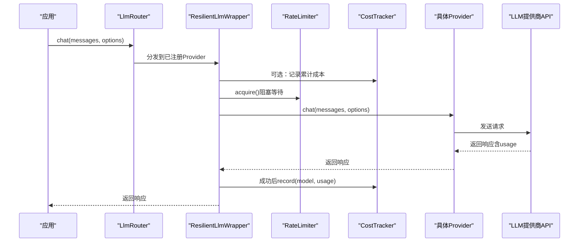
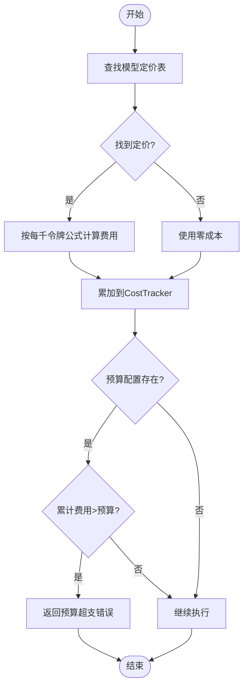
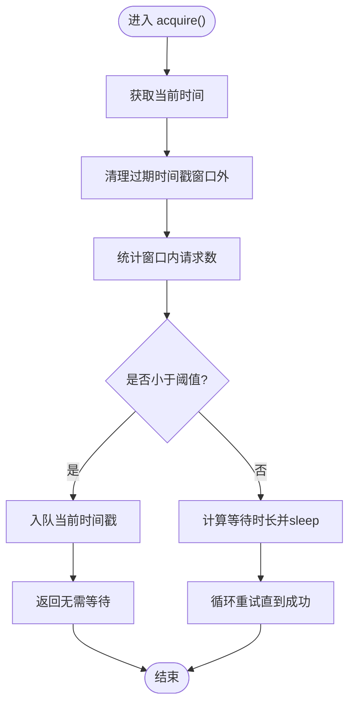
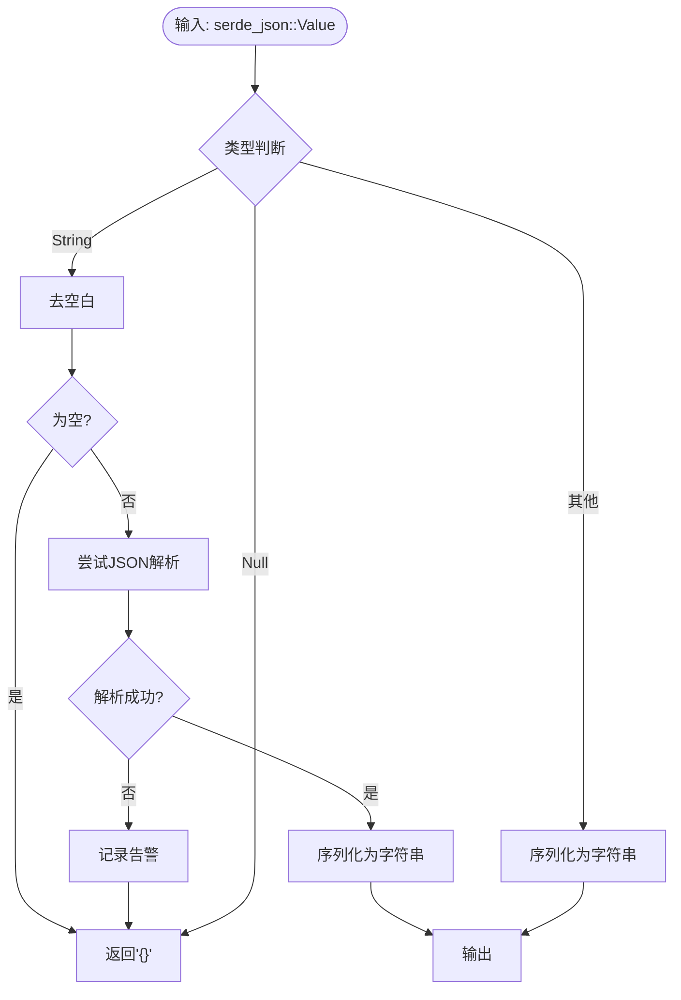
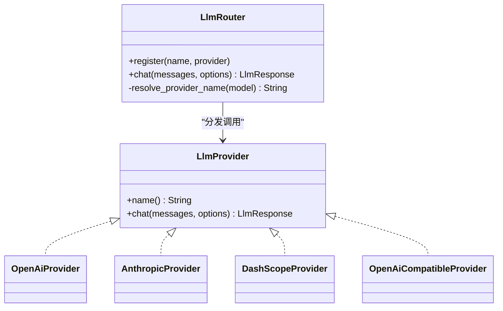
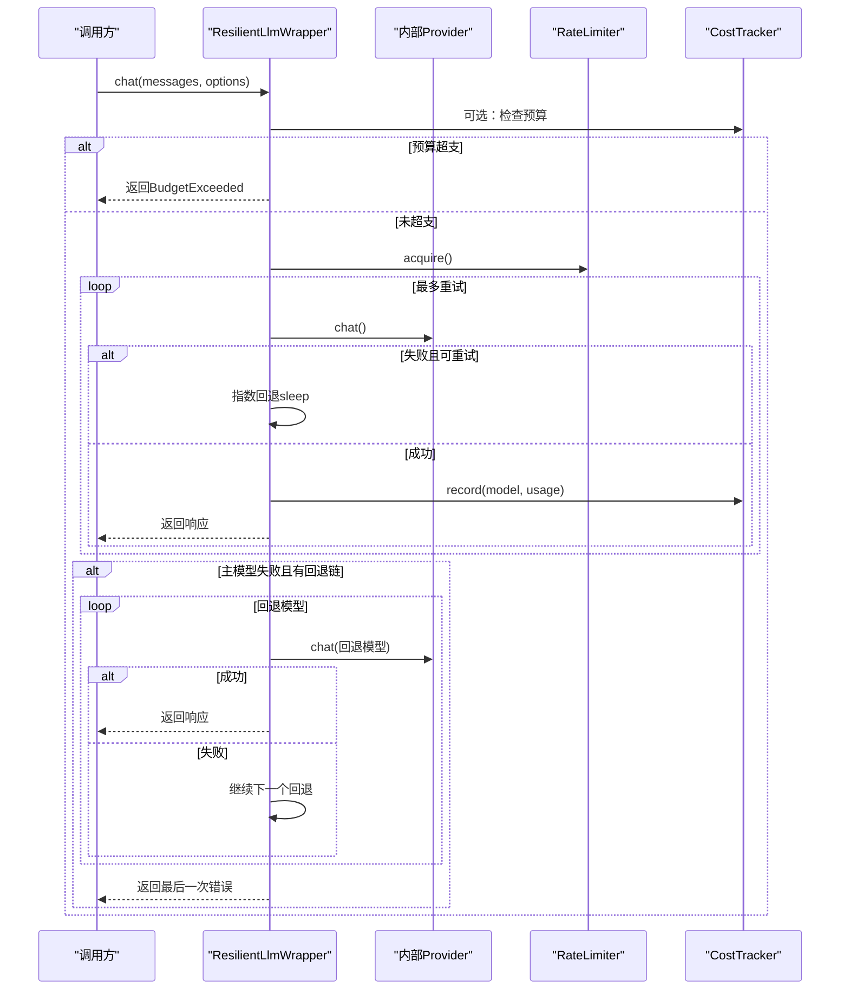
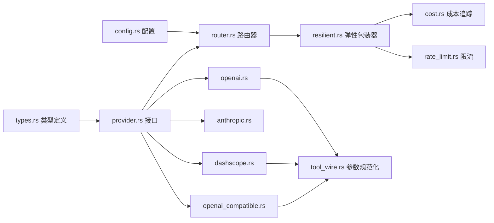

# LLM工具函数

<cite>
**本文引用的文件**
- [lib.rs](file://macaca/crates/macaca-llm/src/lib.rs)
- [provider.rs](file://macaca/crates/macaca-llm/src/provider.rs)
- [router.rs](file://macaca/crates/macaca-llm/src/router.rs)
- [openai.rs](file://macaca/crates/macaca-llm/src/openai.rs)
- [anthropic.rs](file://macaca/crates/macaca-llm/src/anthropic.rs)
- [dashscope.rs](file://macaca/crates/macaca-llm/src/dashscope.rs)
- [openai_compatible.rs](file://macaca/crates/macaca-llm/src/openai_compatible.rs)
- [resilient.rs](file://macaca/crates/macaca-llm/src/resilient.rs)
- [cost.rs](file://macaca/crates/macaca-llm/src/cost.rs)
- [rate_limit.rs](file://macaca/crates/macaca-llm/src/rate_limit.rs)
- [tool_wire.rs](file://macaca/crates/macaca-llm/src/tool_wire.rs)
- [coding_plans.rs](file://macaca/crates/macaca-llm/src/coding_plans.rs)
- [types.rs](file://macaca/crates/macaca-proto/src/types.rs)
- [config.rs](file://macaca/crates/macaca-proto/src/config.rs)
- [default.toml](file://macaca/config/default.toml)
</cite>

## 目录
1. [简介](#简介)
2. [项目结构](#项目结构)
3. [核心组件](#核心组件)
4. [架构总览](#架构总览)
5. [详细组件分析](#详细组件分析)
6. [依赖关系分析](#依赖关系分析)
7. [性能考虑](#性能考虑)
8. [故障排查指南](#故障排查指南)
9. [结论](#结论)
10. [附录](#附录)

## 简介
本文件面向LLM工具函数的使用者与维护者，系统化阐述以下主题：
- 成本计算与预算控制：定价模型、计费策略、累计统计与预算拦截
- 速率限制与流量控制：滑动窗口限流、令牌桶思想、阻塞等待策略
- 工具调用wire协议：参数序列化、反序列化与类型安全保证
- 配置示例与最佳实践：多提供商路由、兼容性处理、日志与可观测性
- 监控指标与性能优化：请求次数、令牌用量、成本与延迟优化建议

## 项目结构
本项目以模块化方式组织LLM能力，核心位于macaca-llm子 crate，类型与配置定义位于macaca-proto子 crate。关键模块职责如下：
- 提供商抽象与实现：统一的LlmProvider trait与OpenAI、Anthropic、DashScope、OpenAI兼容实现
- 路由器：根据模型前缀自动选择提供商
- 弹性包装器：重试、回退、预算检查、速率限制集成
- 成本追踪：按模型定价表累加令牌用量与费用
- 速率限制：滑动窗口限流器
- 工具调用wire协议：严格序列化/反序列化，确保上游API兼容性
- 配置与类型：统一的LLM消息、选项、响应与配置结构

图表来源
- [provider.rs:1-20](file://macaca/crates/macaca-llm/src/provider.rs#L1-L20)
- [router.rs:1-253](file://macaca/crates/macaca-llm/src/router.rs#L1-L253)
- [resilient.rs:1-619](file://macaca/crates/macaca-llm/src/resilient.rs#L1-L619)
- [openai.rs:1-277](file://macaca/crates/macaca-llm/src/openai.rs#L1-L277)
- [anthropic.rs:1-288](file://macaca/crates/macaca-llm/src/anthropic.rs#L1-L288)
- [dashscope.rs:1-294](file://macaca/crates/macaca-llm/src/dashscope.rs#L1-L294)
- [openai_compatible.rs:1-332](file://macaca/crates/macaca-llm/src/openai_compatible.rs#L1-L332)
- [cost.rs:1-163](file://macaca/crates/macaca-llm/src/cost.rs#L1-L163)
- [rate_limit.rs:1-123](file://macaca/crates/macaca-llm/src/rate_limit.rs#L1-L123)
- [tool_wire.rs:1-64](file://macaca/crates/macaca-llm/src/tool_wire.rs#L1-L64)

章节来源
- [lib.rs:1-52](file://macaca/crates/macaca-llm/src/lib.rs#L1-L52)
- [router.rs:1-253](file://macaca/crates/macaca-llm/src/router.rs#L1-L253)
- [provider.rs:1-20](file://macaca/crates/macaca-llm/src/provider.rs#L1-L20)

## 核心组件
- LlmProvider接口：统一的聊天调用抽象，屏蔽不同提供商差异
- LlmRouter：基于模型前缀的自动路由，支持内置规则与自定义注册
- ResilientLlmWrapper：在Provider之上叠加重试、回退、预算检查、速率限制
- CostTracker：按模型定价表累加prompt/completion/总令牌用量与费用
- RateLimiter：滑动窗口限流器，阻塞等待直至窗口内请求数低于阈值
- tool_arguments_for_chat_api：工具调用参数规范化，确保严格JSON对象字符串
- OpenAI/Anthropic/DashScope/OpenAI-Compatible Provider：各自wire协议与消息转换
- 类型与配置：统一的消息、选项、响应结构与LLM配置

章节来源
- [provider.rs:1-20](file://macaca/crates/macaca-llm/src/provider.rs#L1-L20)
- [router.rs:1-253](file://macaca/crates/macaca-llm/src/router.rs#L1-L253)
- [resilient.rs:1-619](file://macaca/crates/macaca-llm/src/resilient.rs#L1-L619)
- [cost.rs:1-163](file://macaca/crates/macaca-llm/src/cost.rs#L1-L163)
- [rate_limit.rs:1-123](file://macaca/crates/macaca-llm/src/rate_limit.rs#L1-L123)
- [tool_wire.rs:1-64](file://macaca/crates/macaca-llm/src/tool_wire.rs#L1-L64)
- [openai.rs:1-277](file://macaca/crates/macaca-llm/src/openai.rs#L1-L277)
- [anthropic.rs:1-288](file://macaca/crates/macaca-llm/src/anthropic.rs#L1-L288)
- [dashscope.rs:1-294](file://macaca/crates/macaca-llm/src/dashscope.rs#L1-L294)
- [openai_compatible.rs:1-332](file://macaca/crates/macaca-llm/src/openai_compatible.rs#L1-L332)
- [types.rs:616-746](file://macaca/crates/macaca-proto/src/types.rs#L616-L746)
- [config.rs:39-96](file://macaca/crates/macaca-proto/src/config.rs#L39-L96)

## 架构总览
下图展示从应用到LLM提供商的整体调用链路，包括弹性包装器的重试、回退、预算检查与速率限制流程。

图表来源
- [router.rs:114-128](file://macaca/crates/macaca-llm/src/router.rs#L114-L128)
- [resilient.rs:173-236](file://macaca/crates/macaca-llm/src/resilient.rs#L173-L236)
- [rate_limit.rs:74-86](file://macaca/crates/macaca-llm/src/rate_limit.rs#L74-L86)
- [cost.rs:60-71](file://macaca/crates/macaca-llm/src/cost.rs#L60-L71)
- [openai.rs:175-250](file://macaca/crates/macaca-llm/src/openai.rs#L175-L250)
- [anthropic.rs:176-258](file://macaca/crates/macaca-llm/src/anthropic.rs#L176-L258)
- [dashscope.rs:185-260](file://macaca/crates/macaca-llm/src/dashscope.rs#L185-L260)
- [openai_compatible.rs:198-288](file://macaca/crates/macaca-llm/src/openai_compatible.rs#L198-L288)

## 详细组件分析

### 成本计算与预算控制
- 定价模型
  - 按模型每1000令牌的单价（prompt/completion分别计价），内置常见模型的定价表
  - 支持未知模型返回零成本，避免panic
- 统计与查询
  - 累计prompt/completion/总令牌数、总费用、请求次数
  - 提供是否超预算与剩余预算查询
- 预算拦截
  - 在弹性包装器中，调用前检查累计费用是否超过配置预算，超支直接拒绝

图表来源
- [cost.rs:11-17](file://macaca/crates/macaca-llm/src/cost.rs#L11-L17)
- [cost.rs:20-38](file://macaca/crates/macaca-llm/src/cost.rs#L20-L38)
- [cost.rs:60-101](file://macaca/crates/macaca-llm/src/cost.rs#L60-L101)
- [resilient.rs:178-189](file://macaca/crates/macaca-llm/src/resilient.rs#L178-L189)

章节来源
- [cost.rs:1-163](file://macaca/crates/macaca-llm/src/cost.rs#L1-L163)
- [resilient.rs:12-28](file://macaca/crates/macaca-llm/src/resilient.rs#L12-L28)
- [resilient.rs:178-189](file://macaca/crates/macaca-llm/src/resilient.rs#L178-L189)

### 速率限制与流量控制
- 算法：滑动窗口限流
  - 维护最近时间窗内的请求时间戳队列
  - 当窗口内请求数达到阈值时，计算最早请求到期时间并阻塞等待
- 使用场景
  - 在弹性包装器中，每次调用前acquire()，确保全局速率合规
- 配置入口
  - LlmConfig中提供默认速率限制（requests per minute）

图表来源
- [rate_limit.rs:26-54](file://macaca/crates/macaca-llm/src/rate_limit.rs#L26-L54)
- [rate_limit.rs:74-86](file://macaca/crates/macaca-llm/src/rate_limit.rs#L74-L86)
- [config.rs:42-43](file://macaca/crates/macaca-proto/src/config.rs#L42-L43)

章节来源
- [rate_limit.rs:1-123](file://macaca/crates/macaca-llm/src/rate_limit.rs#L1-L123)
- [resilient.rs:67-75](file://macaca/crates/macaca-llm/src/resilient.rs#L67-L75)
- [config.rs:265-271](file://macaca/crates/macaca-proto/src/config.rs#L265-L271)

### 工具调用wire协议
- 目标：确保tool_calls.function.arguments为严格JSON对象字符串，满足严格API（如MiniMax）要求
- 处理逻辑
  - 若输入为字符串：尝试解析为JSON，失败则记录告警并返回空对象
  - 若输入为null：返回空对象
  - 其他情况：序列化为字符串
- Provider侧使用
  - OpenAI、DashScope、OpenAI-Compatible在构造请求时调用此函数生成arguments字段

图表来源
- [tool_wire.rs:11-18](file://macaca/crates/macaca-llm/src/tool_wire.rs#L11-L18)
- [tool_wire.rs:20-36](file://macaca/crates/macaca-llm/src/tool_wire.rs#L20-L36)
- [openai.rs:140-154](file://macaca/crates/macaca-llm/src/openai.rs#L140-L154)
- [dashscope.rs:149-165](file://macaca/crates/macaca-llm/src/dashscope.rs#L149-L165)
- [openai_compatible.rs:162-178](file://macaca/crates/macaca-llm/src/openai_compatible.rs#L162-L178)

章节来源
- [tool_wire.rs:1-64](file://macaca/crates/macaca-llm/src/tool_wire.rs#L1-L64)
- [openai.rs:132-167](file://macaca/crates/macaca-llm/src/openai.rs#L132-L167)
- [dashscope.rs:142-177](file://macaca/crates/macaca-llm/src/dashscope.rs#L142-L177)
- [openai_compatible.rs:155-190](file://macaca/crates/macaca-llm/src/openai_compatible.rs#L155-L190)

### 路由器与提供商实现
- 路由规则
  - 内置：gpt-/o1/o3- → openai；claude- → anthropic；qwen* → dashscope；deepseek-* → deepseek；minimax-系列 → minimax
  - 支持“provider/model”格式的聚合平台（如OpenRouter）
  - 未命中内置规则时，使用模型字符串作为提供商键
- Provider实现要点
  - OpenAI：标准OpenAI wire协议，角色映射、工具定义与调用解析
  - Anthropic：消息内容支持文本或内容块，工具使用tool_use块
  - DashScope：OpenAI兼容端点，工具参数同样需要规范化
  - OpenAI-Compatible：通用OpenAI兼容实现，支持本地/第三方服务

图表来源
- [provider.rs:1-20](file://macaca/crates/macaca-llm/src/provider.rs#L1-L20)
- [router.rs:21-129](file://macaca/crates/macaca-llm/src/router.rs#L21-L129)
- [openai.rs:12-39](file://macaca/crates/macaca-llm/src/openai.rs#L12-L39)
- [anthropic.rs:12-37](file://macaca/crates/macaca-llm/src/anthropic.rs#L12-L37)
- [dashscope.rs:22-49](file://macaca/crates/macaca-llm/src/dashscope.rs#L22-L49)
- [openai_compatible.rs:18-58](file://macaca/crates/macaca-llm/src/openai_compatible.rs#L18-L58)

章节来源
- [router.rs:78-129](file://macaca/crates/macaca-llm/src/router.rs#L78-L129)
- [openai.rs:123-170](file://macaca/crates/macaca-llm/src/openai.rs#L123-L170)
- [anthropic.rs:111-170](file://macaca/crates/macaca-llm/src/anthropic.rs#L111-L170)
- [dashscope.rs:133-180](file://macaca/crates/macaca-llm/src/dashscope.rs#L133-L180)
- [openai_compatible.rs:146-193](file://macaca/crates/macaca-llm/src/openai_compatible.rs#L146-L193)

### 弹性包装器：重试、回退与预算
- 重试与指数回退
  - 最多重试次数可配置；回退时延按2^n递增，上限可配置
  - 错误分类：网络、超时、连接、解析失败、特定HTTP状态码视为可重试
- 回退模型链
  - 主模型失败且可重试时，依次尝试备用模型，每个回退模型独立重试
- 预算拦截
  - 调用前检查累计费用是否超预算，超支直接返回错误
- 速率限制
  - 调用前acquire()，阻塞等待至窗口允许

图表来源
- [resilient.rs:124-164](file://macaca/crates/macaca-llm/src/resilient.rs#L124-L164)
- [resilient.rs:173-236](file://macaca/crates/macaca-llm/src/resilient.rs#L173-L236)
- [rate_limit.rs:74-86](file://macaca/crates/macaca-llm/src/rate_limit.rs#L74-L86)
- [cost.rs:60-71](file://macaca/crates/macaca-llm/src/cost.rs#L60-L71)

章节来源
- [resilient.rs:12-41](file://macaca/crates/macaca-llm/src/resilient.rs#L12-L41)
- [resilient.rs:173-236](file://macaca/crates/macaca-llm/src/resilient.rs#L173-L236)

### 类型与配置
- LLM消息、选项、响应与工具调用类型
  - 角色枚举、消息体、工具定义与调用、TokenUsage等
- LLM配置
  - 默认提供商、默认模型、最大tokens、默认速率限制（rpm）、提供商列表与密钥解析规则
  - 支持“订阅/Token Plan”优先于按量付费密钥

章节来源
- [types.rs:616-746](file://macaca/crates/macaca-proto/src/types.rs#L616-L746)
- [config.rs:39-96](file://macaca/crates/macaca-proto/src/config.rs#L39-L96)
- [config.rs:265-271](file://macaca/crates/macaca-proto/src/config.rs#L265-L271)

## 依赖关系分析
- 模块耦合
  - Provider实现依赖统一的类型与错误模型
  - ResilientLlmWrapper依赖Provider、CostTracker、RateLimiter
  - Router依赖Provider注册表与路由规则
- 外部依赖
  - HTTP客户端（reqwest）、异步运行时（tokio）、序列化（serde/serde_json）
  - 日志与追踪（tracing）

图表来源
- [types.rs:616-746](file://macaca/crates/macaca-proto/src/types.rs#L616-L746)
- [config.rs:39-96](file://macaca/crates/macaca-proto/src/config.rs#L39-L96)
- [router.rs:1-253](file://macaca/crates/macaca-llm/src/router.rs#L1-L253)
- [resilient.rs:1-619](file://macaca/crates/macaca-llm/src/resilient.rs#L1-L619)
- [openai.rs:1-277](file://macaca/crates/macaca-llm/src/openai.rs#L1-L277)
- [anthropic.rs:1-288](file://macaca/crates/macaca-llm/src/anthropic.rs#L1-L288)
- [dashscope.rs:1-294](file://macaca/crates/macaca-llm/src/dashscope.rs#L1-L294)
- [openai_compatible.rs:1-332](file://macaca/crates/macaca-llm/src/openai_compatible.rs#L1-L332)
- [tool_wire.rs:1-64](file://macaca/crates/macaca-llm/src/tool_wire.rs#L1-L64)
- [cost.rs:1-163](file://macaca/crates/macaca-llm/src/cost.rs#L1-L163)
- [rate_limit.rs:1-123](file://macaca/crates/macaca-llm/src/rate_limit.rs#L1-L123)

章节来源
- [lib.rs:30-52](file://macaca/crates/macaca-llm/src/lib.rs#L30-L52)

## 性能考虑
- 速率限制
  - 合理设置rpm，避免频繁sleep；对高并发场景可考虑多实例隔离
- 重试与回退
  - 控制最大重试次数与回退上限，防止雪崩；区分可重试与不可重试错误
- 成本控制
  - 结合CostTracker定期导出统计，配合预算拦截减少超支风险
- 序列化与解析
  - 工具参数规范化避免重复解析与无效传输；保持最小必要字段
- 网络与代理
  - 通过OpenAI兼容路径适配本地/第三方服务，减少协议转换开销

## 故障排查指南
- 预算超支
  - 现象：调用被立即拒绝
  - 排查：确认CostTracker累计费用与预算配置；检查是否正确注入CostTracker
- 429/5xx错误
  - 现象：请求被限流或服务端异常
  - 排查：检查回退策略与指数回退参数；确认Provider可用性
- 工具参数不合规
  - 现象：严格API拒绝请求
  - 排查：确认tool_arguments_for_chat_api是否被调用；检查上游返回的arguments类型
- 路由错误
  - 现象：找不到对应Provider
  - 排查：核对模型前缀与路由规则；确认Provider是否已注册

章节来源
- [resilient.rs:178-189](file://macaca/crates/macaca-llm/src/resilient.rs#L178-L189)
- [resilient.rs:95-122](file://macaca/crates/macaca-llm/src/resilient.rs#L95-L122)
- [tool_wire.rs:28-35](file://macaca/crates/macaca-llm/src/tool_wire.rs#L28-L35)
- [router.rs:120-128](file://macaca/crates/macaca-llm/src/router.rs#L120-L128)

## 结论
本LLM工具函数体系以统一抽象为核心，结合弹性包装器实现了稳健的重试、回退、预算与速率控制，并通过严格的工具调用参数规范化保障了跨提供商的一致性与兼容性。配合完善的类型与配置体系，可在多场景下稳定扩展与演进。

## 附录

### 配置示例与最佳实践
- LLM配置要点
  - 设置默认提供商与默认模型
  - 配置最大tokens与速率限制（rpm）
  - 为各提供商配置base_url与密钥解析规则
  - 对MiniMax等特殊提供商，确保base_url指向OpenAI兼容端点
- 示例配置参考
  - 默认配置文件展示了各提供商的启用方式与典型参数

章节来源
- [default.toml:6-51](file://macaca/config/default.toml#L6-L51)
- [config.rs:39-96](file://macaca/crates/macaca-proto/src/config.rs#L39-L96)
- [coding_plans.rs:12-24](file://macaca/crates/macaca-llm/src/coding_plans.rs#L12-L24)

### 监控指标建议
- 请求级
  - 成功/失败计数、错误类型分布、平均/95百分位延迟
- 成本级
  - 累计prompt/completion/总令牌用量、累计费用、剩余预算
- 速率级
  - 实际rpm、窗口内请求数、等待时长分布
- 工具调用级
  - 工具调用次数、参数规范化失败率、上游API拒绝率

### 性能优化建议
- 合理设置rpm与重试上限，避免过度sleep
- 使用回退模型链提升可用性，但需控制回退数量
- 定期导出CostTracker统计，结合预算拦截降低超支概率
- 对本地/第三方服务采用OpenAI兼容路径，减少协议转换与解析开销