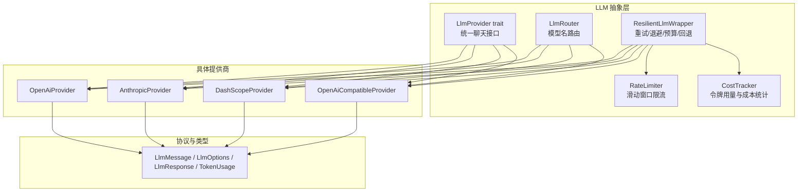
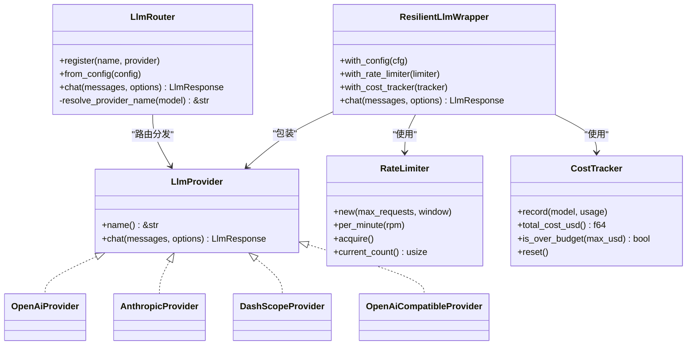
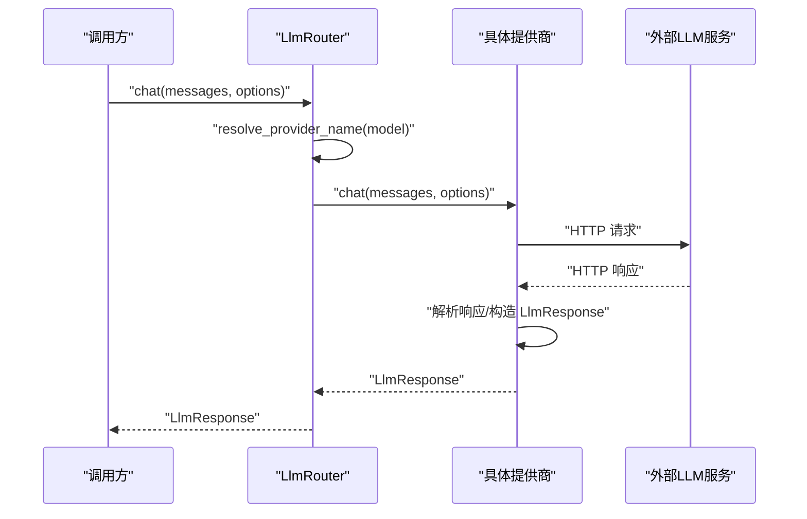
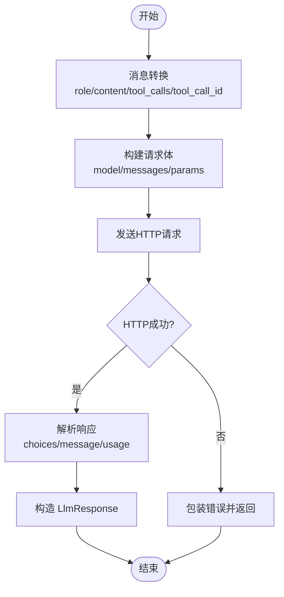
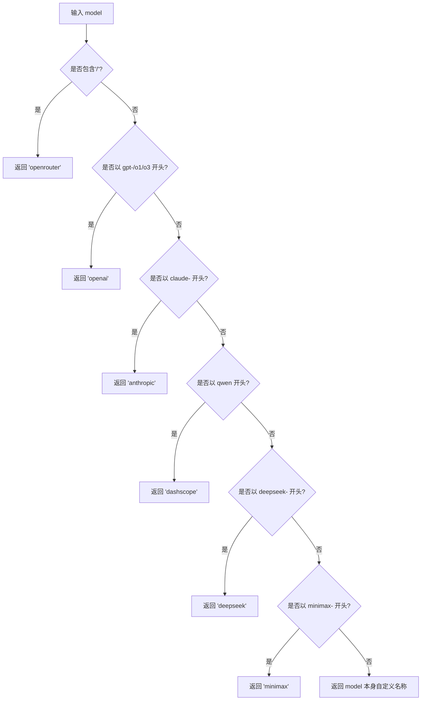
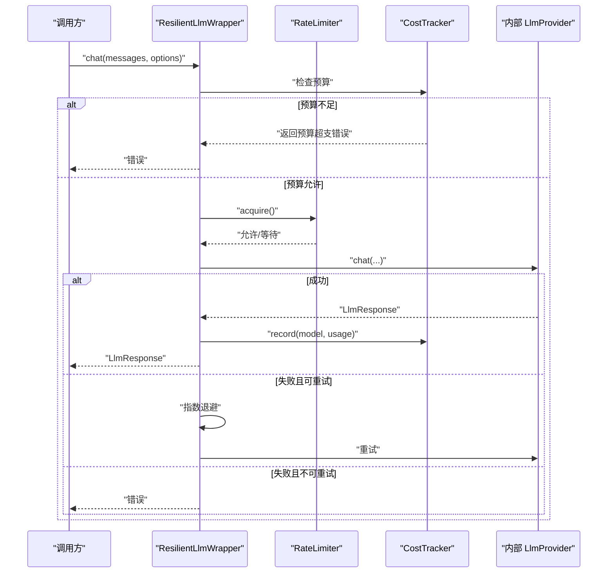
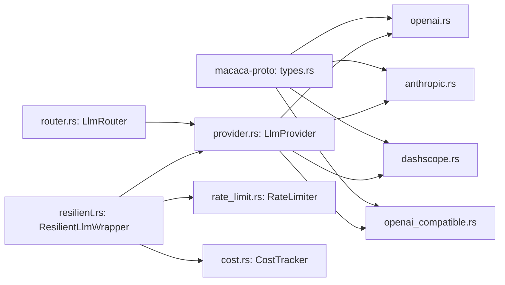

# LLM提供商接口

<cite>
**本文档引用的文件**
- [provider.rs](file://macaca/crates/macaca-llm/src/provider.rs)
- [lib.rs](file://macaca/crates/macaca-llm/src/lib.rs)
- [openai.rs](file://macaca/crates/macaca-llm/src/openai.rs)
- [anthropic.rs](file://macaca/crates/macaca-llm/src/anthropic.rs)
- [dashscope.rs](file://macaca/crates/macaca-llm/src/dashscope.rs)
- [openai_compatible.rs](file://macaca/crates/macaca-llm/src/openai_compatible.rs)
- [router.rs](file://macaca/crates/macaca-llm/src/router.rs)
- [tool_wire.rs](file://macaca/crates/macaca-llm/src/tool_wire.rs)
- [types.rs](file://macaca/crates/macaca-proto/src/types.rs)
- [resilient.rs](file://macaca/crates/macaca-llm/src/resilient.rs)
- [rate_limit.rs](file://macaca/crates/macaca-llm/src/rate_limit.rs)
- [cost.rs](file://macaca/crates/macaca-llm/src/cost.rs)
- [README.md](file://macaca/README.md)
- [SYSTEM_OVERVIEW.md](file://macaca/docs/SYSTEM_OVERVIEW.md)
</cite>

## 目录
1. [简介](#简介)
2. [项目结构](#项目结构)
3. [核心组件](#核心组件)
4. [架构总览](#架构总览)
5. [详细组件分析](#详细组件分析)
6. [依赖关系分析](#依赖关系分析)
7. [性能考量](#性能考量)
8. [故障排查指南](#故障排查指南)
9. [结论](#结论)
10. [附录](#附录)

## 简介
本文件系统性阐述 LLM 提供商接口的设计理念、实现要求与最佳实践，覆盖统一聊天接口、消息格式标准化、响应处理机制、错误处理策略，以及如何实现自定义 LLM 提供商。文档同时给出性能优化建议与常见问题排查方法，帮助开发者在多提供商、多模型场景下构建稳定、可观测、可扩展的 LLM 调用层。

## 项目结构
- LLM 抽象层位于 macaca-llm crate，核心接口为 LlmProvider trait，提供统一的聊天能力；同时内置 OpenAI、Anthropic、DashScope 三大提供商，以及通用 OpenAI 兼容适配器。
- 数据结构与类型定义位于 macaca-proto crate，包括 LlmMessage、LlmOptions、LlmResponse、TokenUsage 等，确保跨提供商的消息与响应格式一致。
- LlmRouter 负责根据模型名前缀将请求路由到对应提供商，支持注册自定义提供商名称与 OpenAI 兼容后端。
- 辅助能力包括重试与指数退避（ResilientLlmWrapper）、速率限制（RateLimiter）、成本跟踪（CostTracker），用于生产环境的稳定性与成本控制。

**图表来源**
- [provider.rs:1-20](file://macaca/crates/macaca-llm/src/provider.rs#L1-L20)
- [router.rs:1-253](file://macaca/crates/macaca-llm/src/router.rs#L1-L253)
- [openai.rs:1-277](file://macaca/crates/macaca-llm/src/openai.rs#L1-L277)
- [anthropic.rs:1-288](file://macaca/crates/macaca-llm/src/anthropic.rs#L1-L288)
- [dashscope.rs:1-294](file://macaca/crates/macaca-llm/src/dashscope.rs#L1-L294)
- [openai_compatible.rs:1-332](file://macaca/crates/macaca-llm/src/openai_compatible.rs#L1-L332)
- [resilient.rs:1-619](file://macaca/crates/macaca-llm/src/resilient.rs#L1-L619)
- [rate_limit.rs:1-123](file://macaca/crates/macaca-llm/src/rate_limit.rs#L1-L123)
- [cost.rs:1-163](file://macaca/crates/macaca-llm/src/cost.rs#L1-L163)
- [types.rs:616-746](file://macaca/crates/macaca-proto/src/types.rs#L616-L746)

**章节来源**
- [README.md:1-29](file://macaca/README.md#L1-L29)
- [SYSTEM_OVERVIEW.md:1-137](file://macaca/docs/SYSTEM_OVERVIEW.md#L1-L137)

## 核心组件
- LlmProvider trait：定义统一的聊天接口与提供商标识，所有具体提供商均需实现该接口以保证上层调用一致性。
- LlmRouter：基于模型名前缀的自动路由，内置规则覆盖主流提供商，支持注册任意自定义提供商名称。
- 具体提供商实现：OpenAI、Anthropic、DashScope、OpenAI 兼容适配器，均遵循统一的消息转换与响应解析流程。
- 数据类型：LlmMessage、LlmOptions、LlmResponse、TokenUsage 等，确保消息格式标准化与响应解析一致性。
- 辅助能力：ResilientLlmWrapper（重试/退避/预算/回退）、RateLimiter（滑动窗口限流）、CostTracker（成本统计）。

**章节来源**
- [provider.rs:1-20](file://macaca/crates/macaca-llm/src/provider.rs#L1-L20)
- [router.rs:1-253](file://macaca/crates/macaca-llm/src/router.rs#L1-L253)
- [lib.rs:1-52](file://macaca/crates/macaca-llm/src/lib.rs#L1-L52)
- [types.rs:616-746](file://macaca/crates/macaca-proto/src/types.rs#L616-L746)

## 架构总览
下图展示 LlmProvider 抽象层与具体提供商之间的关系，以及与路由、重试包装器、限流与成本跟踪的交互。

**图表来源**
- [provider.rs:1-20](file://macaca/crates/macaca-llm/src/provider.rs#L1-L20)
- [openai.rs:1-277](file://macaca/crates/macaca-llm/src/openai.rs#L1-L277)
- [anthropic.rs:1-288](file://macaca/crates/macaca-llm/src/anthropic.rs#L1-L288)
- [dashscope.rs:1-294](file://macaca/crates/macaca-llm/src/dashscope.rs#L1-L294)
- [openai_compatible.rs:1-332](file://macaca/crates/macaca-llm/src/openai_compatible.rs#L1-L332)
- [router.rs:1-253](file://macaca/crates/macaca-llm/src/router.rs#L1-L253)
- [resilient.rs:1-619](file://macaca/crates/macaca-llm/src/resilient.rs#L1-L619)
- [rate_limit.rs:1-123](file://macaca/crates/macaca-llm/src/rate_limit.rs#L1-L123)
- [cost.rs:1-163](file://macaca/crates/macaca-llm/src/cost.rs#L1-L163)

## 详细组件分析

### LlmProvider 抽象与实现要求
- 设计理念
  - 通过 trait 抽象屏蔽不同提供商的差异，统一聊天接口与错误处理。
  - 通过 name() 返回提供商标识，便于日志、监控与路由决策。
- 实现要求
  - 必须实现 name() 与 chat() 方法。
  - chat() 参数为消息列表与选项，返回标准化响应与统一错误类型。
  - 建议对网络请求进行超时与重试策略封装，结合 ResilientLlmWrapper 使用。
- 错误处理
  - 将底层错误包装为统一的 MacacaError，便于上层统一处理与降级。

**图表来源**
- [router.rs:114-129](file://macaca/crates/macaca-llm/src/router.rs#L114-L129)
- [provider.rs:13-18](file://macaca/crates/macaca-llm/src/provider.rs#L13-L18)

**章节来源**
- [provider.rs:1-20](file://macaca/crates/macaca-llm/src/provider.rs#L1-L20)

### 消息格式标准化与工具调用
- 消息角色映射
  - LlmRole::System/User/Assistant/Tool 映射到各提供商的对应字段。
- 工具调用序列化
  - 工具参数 arguments 统一为 JSON 字符串，严格遵循 OpenAI 兼容格式，避免上游模型返回非对象字符串导致的兼容性问题。
- 响应解析
  - 统一解析 choices/message/content/finish_reason/tool_calls/usage 等字段，构造 LlmResponse。

**图表来源**
- [openai.rs:132-250](file://macaca/crates/macaca-llm/src/openai.rs#L132-L250)
- [anthropic.rs:111-258](file://macaca/crates/macaca-llm/src/anthropic.rs#L111-L258)
- [dashscope.rs:142-260](file://macaca/crates/macaca-llm/src/dashscope.rs#L142-L260)
- [openai_compatible.rs:155-288](file://macaca/crates/macaca-llm/src/openai_compatible.rs#L155-L288)
- [tool_wire.rs:11-36](file://macaca/crates/macaca-llm/src/tool_wire.rs#L11-L36)

**章节来源**
- [types.rs:616-746](file://macaca/crates/macaca-proto/src/types.rs#L616-L746)
- [tool_wire.rs:1-64](file://macaca/crates/macaca-llm/src/tool_wire.rs#L1-L64)

### 路由机制与模型名规则
- 内置路由规则
  - gpt-* / o1* / o3* → openai
  - claude-* → anthropic
  - qwen* → dashscope
  - deepseek-* → deepseek
  - 支持以“provider/model”形式的聚合平台路由（如 openrouter）
- 自定义注册
  - 通过 LlmRouter::register 或 LlmRouter::from_config 注册任意提供商名称与实例。
- 错误处理
  - 未匹配到提供商时返回明确的错误信息，便于定位配置问题。

**图表来源**
- [router.rs:78-112](file://macaca/crates/macaca-llm/src/router.rs#L78-L112)

**章节来源**
- [router.rs:1-253](file://macaca/crates/macaca-llm/src/router.rs#L1-L253)

### 具体提供商实现要点

#### OpenAI 提供商
- 关键点
  - 使用 /v1/chat/completions 接口，支持工具定义与工具调用。
  - 将 LlmMessage 转换为 OpenAiMessage，工具参数通过 tool_wire 规范化。
  - 解析 ChatResponse，提取 content、finish_reason、usage、tool_calls。
- 错误处理
  - 非 2xx 状态码时读取响应文本并包装为 MacacaError。
- 性能建议
  - 合理设置 max_tokens 与 temperature，避免不必要的长上下文。
  - 使用 ResilientLlmWrapper 进行重试与预算控制。

**章节来源**
- [openai.rs:1-277](file://macaca/crates/macaca-llm/src/openai.rs#L1-L277)

#### Anthropic 提供商
- 关键点
  - 使用 /v1/messages 接口，支持 system 消息与工具调用。
  - 将 LlmMessage 转换为 AnthropicMessage，工具调用以内容块形式组织。
  - 解析 MessagesResponse，拼接文本内容并提取 tool_calls。
- 错误处理
  - 非 2xx 状态码时读取响应文本并包装为 MacacaError。
- 性能建议
  - 合理设置 max_tokens，避免超出模型上下文限制。
  - 使用 ResilientLlmWrapper 与 RateLimiter 控制并发与速率。

**章节来源**
- [anthropic.rs:1-288](file://macaca/crates/macaca-llm/src/anthropic.rs#L1-L288)

#### DashScope 提供商
- 关键点
  - 通过 OpenAI 兼容接口调用 DashScope 的 /compatible-mode/v1/chat/completions。
  - 使用与 OpenAI 兼容的消息与工具调用格式。
- 错误处理
  - 非 2xx 状态码时读取响应文本并包装为 MacacaError。
- 性能建议
  - 针对 DashScope 的模型命名规范选择合适模型，避免不必要的切换。

**章节来源**
- [dashscope.rs:1-294](file://macaca/crates/macaca-llm/src/dashscope.rs#L1-L294)

#### OpenAI 兼容提供商
- 关键点
  - 适用于 vLLM、Ollama、LM Studio、DeepSeek、Together AI、Groq 等。
  - 支持空 API Key 场景（本地/私有部署）。
  - 统一的消息与工具调用格式，增强生态兼容性。
- 错误处理
  - 非 2xx 状态码时读取响应文本并包装为 MacacaError。
- 性能建议
  - 通过 ResilientLlmWrapper 设置合理的重试次数与回退模型。
  - 使用 RateLimiter 控制并发，避免下游服务过载。

**章节来源**
- [openai_compatible.rs:1-332](file://macaca/crates/macaca-llm/src/openai_compatible.rs#L1-L332)

### 重试、退避与预算控制
- ResilientLlmWrapper
  - 指数退避（2^attempt），上限可配置。
  - 可配置重试的 HTTP 状态码集合。
  - 支持备用模型回退链，逐个尝试直至成功或全部失败。
  - 预算检查：在调用前检查累计消费是否超过预算。
- RateLimiter
  - 滑动窗口限流，按时间窗口统计请求数量，超过阈值则等待。
- CostTracker
  - 统计总提示/补全/总令牌数与累计美元成本，支持查询与重置。

**图表来源**
- [resilient.rs:124-236](file://macaca/crates/macaca-llm/src/resilient.rs#L124-L236)
- [rate_limit.rs:57-93](file://macaca/crates/macaca-llm/src/rate_limit.rs#L57-L93)
- [cost.rs:55-108](file://macaca/crates/macaca-llm/src/cost.rs#L55-L108)

**章节来源**
- [resilient.rs:1-619](file://macaca/crates/macaca-llm/src/resilient.rs#L1-L619)
- [rate_limit.rs:1-123](file://macaca/crates/macaca-llm/src/rate_limit.rs#L1-L123)
- [cost.rs:1-163](file://macaca/crates/macaca-llm/src/cost.rs#L1-L163)

## 依赖关系分析
- LlmProvider 为所有提供商的共同接口，具体提供商实现均依赖 macaca-proto 的类型定义。
- LlmRouter 依赖 LlmProvider 并持有 Arc<dyn LlmProvider>，通过名称映射到具体实现。
- ResilientLlmWrapper 依赖 LlmProvider、RateLimiter、CostTracker，形成可插拔的增强层。
- OpenAI 兼容适配器复用 OpenAI 兼容的消息与工具调用格式，减少重复实现。

**图表来源**
- [provider.rs:1-20](file://macaca/crates/macaca-llm/src/provider.rs#L1-L20)
- [router.rs:1-253](file://macaca/crates/macaca-llm/src/router.rs#L1-L253)
- [openai.rs:1-277](file://macaca/crates/macaca-llm/src/openai.rs#L1-L277)
- [anthropic.rs:1-288](file://macaca/crates/macaca-llm/src/anthropic.rs#L1-L288)
- [dashscope.rs:1-294](file://macaca/crates/macaca-llm/src/dashscope.rs#L1-L294)
- [openai_compatible.rs:1-332](file://macaca/crates/macaca-llm/src/openai_compatible.rs#L1-L332)
- [resilient.rs:1-619](file://macaca/crates/macaca-llm/src/resilient.rs#L1-L619)
- [rate_limit.rs:1-123](file://macaca/crates/macaca-llm/src/rate_limit.rs#L1-L123)
- [cost.rs:1-163](file://macaca/crates/macaca-llm/src/cost.rs#L1-L163)
- [types.rs:616-746](file://macaca/crates/macaca-proto/src/types.rs#L616-L746)

**章节来源**
- [lib.rs:30-52](file://macaca/crates/macaca-llm/src/lib.rs#L30-L52)

## 性能考量
- 消息长度与上下文
  - 合理设置 max_tokens，避免过长上下文导致延迟与成本上升。
  - 对于 Anthropic，注意其输入/输出令牌计费方式与最大上下文限制。
- 并发与限流
  - 使用 RateLimiter 控制每分钟请求数，避免触发上游限流。
  - 对于本地/私有部署，合理设置并发与队列深度。
- 重试与退避
  - 针对 429/502/503 等可重试状态码配置指数退避，避免雪崩效应。
  - 为关键模型配置备用模型回退链，提升可用性。
- 成本控制
  - 使用 CostTracker 统计成本，结合 ResilientConfig.max_budget_usd 进行预算控制。
- 工具调用
  - 通过 tool_wire 规范化工具参数，减少上游解析失败导致的重试与失败。

[本节为通用指导，无需特定文件引用]

## 故障排查指南
- 常见错误类型
  - 配置错误：API Key 未设置或环境变量不正确。
  - 路由错误：模型名不在内置规则内，或未注册自定义提供商名称。
  - 网络错误：超时、连接中断、解析失败。
  - 限额错误：429/配额不足、预算超支。
- 排查步骤
  - 检查 LlmRouter::from_config 是否正确加载提供商配置。
  - 确认模型名是否符合内置路由规则或已注册自定义名称。
  - 查看 ResilientLlmWrapper 的重试日志，确认是否为可重试错误。
  - 使用 CostTracker 检查累计成本与预算状态。
  - 对于 OpenAI 兼容适配器，检查响应体是否符合预期格式，必要时开启详细日志。
- 相关实现参考
  - 配置加载与跳过策略、错误包装与返回。
  - 路由解析与缺失提供商错误。
  - 重试条件判断与回退链执行。
  - 限流等待与当前计数查询。

**章节来源**
- [router.rs:44-76](file://macaca/crates/macaca-llm/src/router.rs#L44-L76)
- [router.rs:114-129](file://macaca/crates/macaca-llm/src/router.rs#L114-L129)
- [resilient.rs:91-122](file://macaca/crates/macaca-llm/src/resilient.rs#L91-L122)
- [resilient.rs:196-236](file://macaca/crates/macaca-llm/src/resilient.rs#L196-L236)
- [rate_limit.rs:74-93](file://macaca/crates/macaca-llm/src/rate_limit.rs#L74-L93)

## 结论
通过 LlmProvider 抽象与 LlmRouter 路由机制，系统实现了对多提供商、多模型的统一接入与灵活调度。配合 ResilientLlmWrapper、RateLimiter 与 CostTracker，可在生产环境中实现高可用、可控成本与可观测性的 LLM 调用层。开发者只需遵循统一的消息格式与响应规范，即可快速实现自定义提供商并无缝接入现有框架。

[本节为总结性内容，无需特定文件引用]

## 附录

### 如何实现自定义 LLM 提供商
- 步骤概览
  - 实现 LlmProvider trait：name() 返回提供商标识；chat() 实现请求发送与响应解析。
  - 定义请求体与响应体结构，遵循 OpenAI 兼容格式以提升互操作性。
  - 在 LlmRouter 中注册提供商名称与实例，或通过 LlmRouter::from_config 从配置加载。
  - 可选：使用 ResilientLlmWrapper 包装以启用重试、退避、预算与回退模型。
- 最佳实践
  - 明确错误分类：网络/解析/配额/认证等，分别采用重试或直接失败策略。
  - 规范化工具调用参数，使用 tool_arguments_for_chat_api 确保 JSON 对象字符串。
  - 合理设置超时与重试参数，避免对下游造成压力。
  - 记录 TokenUsage 并纳入 CostTracker，以便预算控制与成本分析。

**章节来源**
- [provider.rs:1-20](file://macaca/crates/macaca-llm/src/provider.rs#L1-L20)
- [router.rs:32-76](file://macaca/crates/macaca-llm/src/router.rs#L32-L76)
- [openai_compatible.rs:192-288](file://macaca/crates/macaca-llm/src/openai_compatible.rs#L192-L288)
- [tool_wire.rs:11-36](file://macaca/crates/macaca-llm/src/tool_wire.rs#L11-L36)
- [resilient.rs:167-236](file://macaca/crates/macaca-llm/src/resilient.rs#L167-L236)