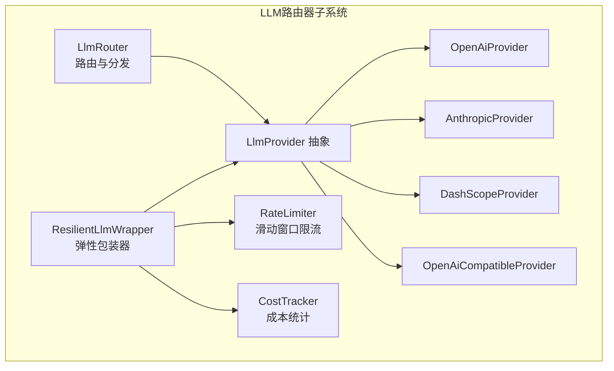
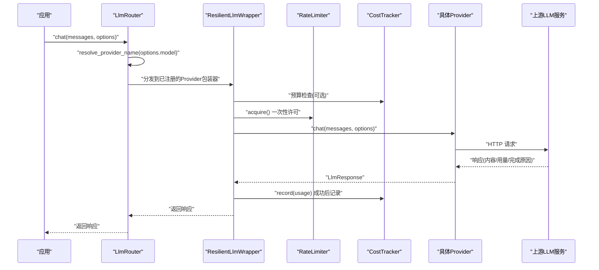
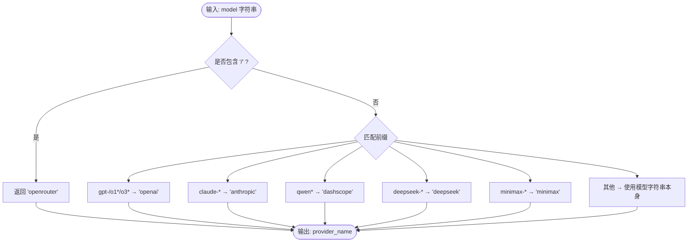
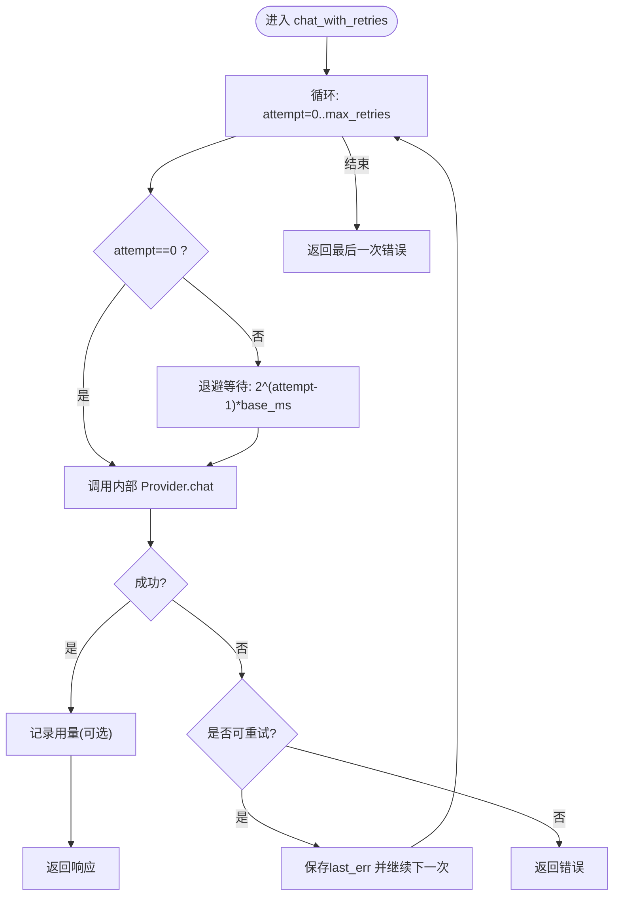
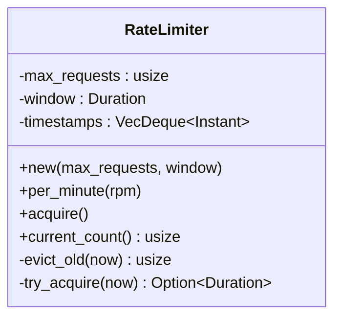
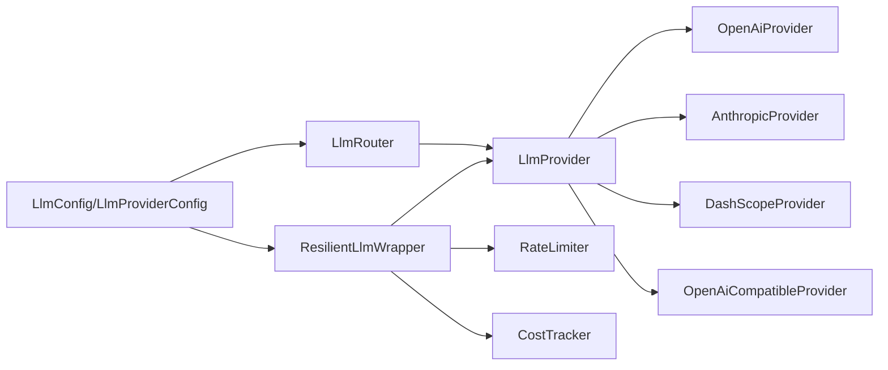

# LLM路由器

<cite>
**本文档引用的文件**
- [router.rs](file://macaca/crates/macaca-llm/src/router.rs)
- [resilient.rs](file://macaca/crates/macaca-llm/src/resilient.rs)
- [provider.rs](file://macaca/crates/macaca-llm/src/provider.rs)
- [rate_limit.rs](file://macaca/crates/macaca-llm/src/rate_limit.rs)
- [cost.rs](file://macaca/crates/macaca-llm/src/cost.rs)
- [openai.rs](file://macaca/crates/macaca-llm/src/openai.rs)
- [anthropic.rs](file://macaca/crates/macaca-llm/src/anthropic.rs)
- [dashscope.rs](file://macaca/crates/macaca-llm/src/dashscope.rs)
- [openai_compatible.rs](file://macaca/crates/macaca-llm/src/openai_compatible.rs)
- [config.rs](file://macaca/crates/macaca-proto/src/config.rs)
- [types.rs](file://macaca/crates/macaca-proto/src/types.rs)
- [error.rs](file://macaca/crates/macaca-proto/src/error.rs)
- [default.toml](file://macaca/config/default.toml)
- [Cargo.toml](file://macaca/crates/macaca-llm/Cargo.toml)
</cite>

## 目录
1. [简介](#简介)
2. [项目结构](#项目结构)
3. [核心组件](#核心组件)
4. [架构总览](#架构总览)
5. [详细组件分析](#详细组件分析)
6. [依赖关系分析](#依赖关系分析)
7. [性能考虑](#性能考虑)
8. [故障排除指南](#故障排除指南)
9. [结论](#结论)
10. [附录](#附录)

## 简介
本文件系统性阐述LLM路由器的设计与实现，覆盖以下关键主题：
- 负载均衡与路由规则：基于模型前缀的自动路由、聚合平台路由、自定义提供商注册。
- 故障转移与弹性策略：指数退避重试、预算控制、成本追踪、可插拔降级链路。
- 性能优化：滑动窗口限流、并发控制、最小化网络往返、工具调用参数规范化。
- 配置体系：默认配置、提供商键值解析、环境变量覆盖、运行时构建。
- 监控与可观测性：日志、追踪、成本统计、预算告警。
- 使用示例、排障建议与调优实践。

## 项目结构
LLM路由器位于macaca-llm crate中，围绕统一的LlmProvider抽象构建，支持原生OpenAI、Anthropic、DashScope以及任意OpenAI兼容端点。核心模块包括：
- 路由器：根据模型名称解析提供商并分发请求。
- 弹性包装器：在Provider外层叠加重试、退避、预算与成本控制。
- 提供商实现：OpenAI、Anthropic、DashScope、通用OpenAI兼容。
- 基础设施：限流、成本统计、工具调用参数规范化、错误类型与配置模型。

图表来源
- [router.rs:21-129](file://macaca/crates/macaca-llm/src/router.rs#L21-L129)
- [resilient.rs:45-50](file://macaca/crates/macaca-llm/src/resilient.rs#L45-L50)
- [rate_limit.rs:13-24](file://macaca/crates/macaca-llm/src/rate_limit.rs#L13-L24)
- [cost.rs:51-53](file://macaca/crates/macaca-llm/src/cost.rs#L51-L53)
- [provider.rs:9-19](file://macaca/crates/macaca-llm/src/provider.rs#L9-L19)
- [openai.rs:12-16](file://macaca/crates/macaca-llm/src/openai.rs#L12-L16)
- [anthropic.rs:12-16](file://macaca/crates/macaca-llm/src/anthropic.rs#L12-L16)
- [dashscope.rs:22-26](file://macaca/crates/macaca-llm/src/dashscope.rs#L22-L26)
- [openai_compatible.rs:18-23](file://macaca/crates/macaca-llm/src/openai_compatible.rs#L18-L23)

章节来源
- [router.rs:1-135](file://macaca/crates/macaca-llm/src/router.rs#L1-L135)
- [resilient.rs:1-619](file://macaca/crates/macaca-llm/src/resilient.rs#L1-L619)
- [provider.rs:1-20](file://macaca/crates/macaca-llm/src/provider.rs#L1-L20)
- [rate_limit.rs:1-123](file://macaca/crates/macaca-llm/src/rate_limit.rs#L1-L123)
- [cost.rs:1-163](file://macaca/crates/macaca-llm/src/cost.rs#L1-L163)
- [openai.rs:1-277](file://macaca/crates/macaca-llm/src/openai.rs#L1-L277)
- [anthropic.rs:1-288](file://macaca/crates/macaca-llm/src/anthropic.rs#L1-L288)
- [dashscope.rs:1-294](file://macaca/crates/macaca-llm/src/dashscope.rs#L1-L294)
- [openai_compatible.rs:1-332](file://macaca/crates/macaca-llm/src/openai_compatible.rs#L1-L332)

## 核心组件
- LlmRouter：负责将消息与选项路由到具体提供商，内置多条规则，支持通过注册表扩展。
- ResilientLlmWrapper：在Provider外层提供重试、退避、预算与成本控制能力。
- RateLimiter：滑动窗口限流，避免突发流量冲击上游API。
- CostTracker：按模型记录token用量与累计美元成本，支持预算上限检查。
- LlmProvider：统一的异步聊天接口抽象，屏蔽不同提供商差异。
- OpenAI/Anthropic/DashScope/OpenAI-Compatible：各提供商的具体实现，负责HTTP请求与响应转换。

章节来源
- [router.rs:21-129](file://macaca/crates/macaca-llm/src/router.rs#L21-L129)
- [resilient.rs:45-237](file://macaca/crates/macaca-llm/src/resilient.rs#L45-L237)
- [rate_limit.rs:13-93](file://macaca/crates/macaca-llm/src/rate_limit.rs#L13-L93)
- [cost.rs:51-108](file://macaca/crates/macaca-llm/src/cost.rs#L51-L108)
- [provider.rs:9-19](file://macaca/crates/macaca-llm/src/provider.rs#L9-L19)

## 架构总览
下图展示从应用到LLM提供商的完整调用链，包括路由器、弹性包装器、限流与成本控制：

图表来源
- [router.rs:115-129](file://macaca/crates/macaca-llm/src/router.rs#L115-L129)
- [resilient.rs:173-236](file://macaca/crates/macaca-llm/src/resilient.rs#L173-L236)
- [rate_limit.rs:75-86](file://macaca/crates/macaca-llm/src/rate_limit.rs#L75-L86)
- [cost.rs:61-71](file://macaca/crates/macaca-llm/src/cost.rs#L61-L71)

## 详细组件分析

### 路由器与路由规则
- 内置规则：
  - gpt-*、o1*、o3* → openai
  - claude-* → anthropic
  - qwen* → dashscope
  - deepseek-* → deepseek
  - MiniMax 家族前缀 → minimax
  - 包含“/”的模型名 → openrouter（聚合平台）
  - 其他 → 使用模型字符串作为提供商键
- 运行时注册：通过注册表将任意名称映射到Provider实例，支持动态扩展。
- 错误处理：未找到对应提供商时返回明确错误，便于上层感知。

图表来源
- [router.rs:86-112](file://macaca/crates/macaca-llm/src/router.rs#L86-L112)

章节来源
- [router.rs:14-129](file://macaca/crates/macaca-llm/src/router.rs#L14-L129)

### 弹性包装器与重试/退避/预算/降级
- 重试与退避：
  - 最大重试次数、基础退避毫秒数、最大退避毫秒数。
  - 指数退避公式：min(base * 2^attempt, max)，防止过长等待。
  - 可配置HTTP状态码（如429/500/502/503）触发重试。
  - 关键字检测：网络超时、连接失败、解析失败等瞬时错误也会重试。
- 预算控制：
  - 在首次尝试前检查累计消费是否超过预算上限，超限直接拒绝。
  - 支持动态更新预算与剩余预算查询。
- 降级链路：
  - 主模型重试耗尽后，按顺序尝试备用模型，每个备用模型独立执行完整重试周期。
  - 非可重试错误（如鉴权失败）立即终止，不进入降级链路。
- 成本记录：
  - 成功响应后记录token用量与估算成本，用于预算检查与统计。

图表来源
- [resilient.rs:125-164](file://macaca/crates/macaca-llm/src/resilient.rs#L125-L164)

章节来源
- [resilient.rs:13-237](file://macaca/crates/macaca-llm/src/resilient.rs#L13-L237)

### 限流器（滑动窗口）
- 维护最近窗口内的请求时间戳队列，超过窗口即淘汰。
- 当请求数达到阈值时，计算最早请求到期时间并睡眠等待，避免超出速率限制。
- 提供每分钟速率构造函数，便于快速配置。

图表来源
- [rate_limit.rs:13-93](file://macaca/crates/macaca-llm/src/rate_limit.rs#L13-L93)

章节来源
- [rate_limit.rs:1-123](file://macaca/crates/macaca-llm/src/rate_limit.rs#L1-L123)

### 成本追踪与预算
- 默认定价表：针对常见模型提供近似USD/1K tokens的定价，未知模型按零成本处理。
- 累积统计：总prompt/completion/总token数、总美元成本、请求次数。
- 预算检查：在发起请求前判断是否超支，支持剩余预算查询与重置。

章节来源
- [cost.rs:4-108](file://macaca/crates/macaca-llm/src/cost.rs#L4-L108)

### 提供商实现概览
- OpenAI：标准OpenAI v1接口，支持工具调用、停止序列、温度、最大token等。
- Anthropic：Messages API，支持system消息、tool_use/content blocks。
- DashScope：OpenAI兼容端点，适配Qwen系列。
- OpenAI-Compatible：通用兼容实现，支持自定义名称与URL，适用于本地或第三方兼容服务。

章节来源
- [openai.rs:12-251](file://macaca/crates/macaca-llm/src/openai.rs#L12-L251)
- [anthropic.rs:12-259](file://macaca/crates/macaca-llm/src/anthropic.rs#L12-L259)
- [dashscope.rs:22-260](file://macaca/crates/macaca-llm/src/dashscope.rs#L22-L260)
- [openai_compatible.rs:18-289](file://macaca/crates/macaca-llm/src/openai_compatible.rs#L18-L289)

## 依赖关系分析
- 外部依赖：reqwest用于HTTP请求，tokio用于异步运行时，serde/serde_json用于序列化。
- 内部依赖：LlmProvider抽象被四个具体Provider实现；ResilientLlmWrapper组合Provider、RateLimiter与CostTracker；Router持有Provider注册表并进行名称解析。
- 配置依赖：LlmConfig定义默认提供商、默认模型、全局速率限制与提供商列表；LlmProviderConfig支持“订阅计划密钥优先”的键解析策略。

图表来源
- [router.rs:44-76](file://macaca/crates/macaca-llm/src/router.rs#L44-L76)
- [resilient.rs:52-76](file://macaca/crates/macaca-llm/src/resilient.rs#L52-L76)
- [config.rs:39-96](file://macaca/crates/macaca-proto/src/config.rs#L39-L96)
- [Cargo.toml:6-15](file://macaca/crates/macaca-llm/Cargo.toml#L6-L15)

章节来源
- [router.rs:1-135](file://macaca/crates/macaca-llm/src/router.rs#L1-L135)
- [resilient.rs:1-619](file://macaca/crates/macaca-llm/src/resilient.rs#L1-L619)
- [config.rs:39-96](file://macaca/crates/macaca-proto/src/config.rs#L39-L96)
- [Cargo.toml:1-18](file://macaca/crates/macaca-llm/Cargo.toml#L1-L18)

## 性能考虑
- 重试与退避：指数退避避免雪崩效应，最大退避上限防止无限延长。
- 限流：滑动窗口限流确保在高并发场景下不突破上游速率限制。
- 成本控制：预算前置检查减少无效调用，配合用量记录实现精细化成本管理。
- 工具调用参数规范化：严格JSON格式化，避免因参数格式问题导致的上游错误与重试。
- 网络优化：统一使用无代理客户端，减少中间环节延迟；兼容端点支持本地部署以降低网络开销。

## 故障排除指南
- 未找到提供商
  - 现象：路由到未知模型名时报错。
  - 排查：确认模型前缀是否符合内置规则，或是否已在运行时注册了对应名称。
  - 参考：[router.rs:121-126](file://macaca/crates/macaca-llm/src/router.rs#L121-L126)
- 重试未生效
  - 现象：出现429/503等状态码但未重试。
  - 排查：检查ResilientConfig中的retry_on_status是否包含该状态码；确认错误信息中是否包含网络/解析类关键字。
  - 参考：[resilient.rs:95-122](file://macaca/crates/macaca-llm/src/resilient.rs#L95-L122)
- 预算超支
  - 现象：请求被拒绝，提示预算超支。
  - 排查：检查CostTracker累计成本与max_budget_usd设置；必要时重置统计或提高预算。
  - 参考：[resilient.rs:178-189](file://macaca/crates/macaca-llm/src/resilient.rs#L178-L189)
- 降级链路未触发
  - 现象：主模型失败后未切换到备用模型。
  - 排查：确认fallback_models非空且主错误为可重试；若为主错误（如鉴权失败），不会进入降级链路。
  - 参考：[resilient.rs:197-235](file://macaca/crates/macaca-llm/src/resilient.rs#L197-L235)
- 工具调用参数异常
  - 现象：某些上游API拒绝请求。
  - 排查：使用tool_arguments_for_chat_api规范化参数，确保为有效JSON对象字符串。
  - 参考：[tool_wire.rs:12-18](file://macaca/crates/macaca-llm/src/tool_wire.rs#L12-L18)

章节来源
- [router.rs:121-126](file://macaca/crates/macaca-llm/src/router.rs#L121-L126)
- [resilient.rs:95-122](file://macaca/crates/macaca-llm/src/resilient.rs#L95-L122)
- [resilient.rs:178-189](file://macaca/crates/macaca-llm/src/resilient.rs#L178-L189)
- [resilient.rs:197-235](file://macaca/crates/macaca-llm/src/resilient.rs#L197-L235)
- [tool_wire.rs:12-18](file://macaca/crates/macaca-llm/src/tool_wire.rs#L12-L18)

## 结论
LLM路由器通过清晰的抽象与可插拔设计，在保证易用性的同时提供了强大的弹性与可观测能力。内置路由规则覆盖主流模型族，结合弹性包装器的重试、退避、预算与成本控制，能够稳定应对上游不稳定与成本压力。配合滑动窗口限流与工具调用参数规范化，整体具备良好的性能与可靠性。建议在生产环境中启用预算控制与日志追踪，并根据业务峰值合理配置限流与重试参数。

## 附录

### 配置选项与优先级
- LlmConfig
  - default_provider：默认提供商名称
  - default_model：默认模型（可选）
  - max_tokens_per_request：单次请求最大token
  - rate_limit_rpm：全局速率限制（requests per minute）
  - providers：提供商列表，键为提供商名称
- LlmProviderConfig
  - api_key_plan：订阅计划密钥（优先级高于api_key）
  - api_key：按量付费密钥（支持环境变量名）
  - base_url：提供商基础URL
  - default_model：该提供商默认模型（可选）

章节来源
- [config.rs:39-96](file://macaca/crates/macaca-proto/src/config.rs#L39-L96)
- [default.toml:6-51](file://macaca/config/default.toml#L6-L51)

### 路由规则与优先级
- 聚合平台优先：包含“/”的模型名优先路由至openrouter。
- 特定前缀：gpt-/claude-/qwen-/deepseek-/minimax-等前缀有固定映射。
- 自定义：其他模型名直接作为提供商键使用，需在运行时注册。

章节来源
- [router.rs:86-112](file://macaca/crates/macaca-llm/src/router.rs#L86-L112)

### 重试机制与超时处理
- 重试条件：HTTP状态码命中retry_on_status或错误信息包含网络/解析/超时等关键字。
- 退避策略：指数增长，上限保护。
- 超时：当前实现未显式设置HTTP超时，建议在实际部署中结合上游服务特性与网络环境配置合理的超时策略。

章节来源
- [resilient.rs:95-122](file://macaca/crates/macaca-llm/src/resilient.rs#L95-L122)
- [resilient.rs:80-89](file://macaca/crates/macaca-llm/src/resilient.rs#L80-L89)

### 错误恢复策略
- 非可重试错误：立即返回，不进入降级链路。
- 可重试错误：按顺序尝试主模型与备用模型，每个模型独立重试。
- 预算超支：在发起请求前拦截，避免无效调用。

章节来源
- [resilient.rs:197-235](file://macaca/crates/macaca-llm/src/resilient.rs#L197-L235)
- [resilient.rs:178-189](file://macaca/crates/macaca-llm/src/resilient.rs#L178-L189)

### 监控指标与健康检查
- 日志与追踪：广泛使用tracing记录关键事件（重试、降级、预算检查等）。
- 成本统计：CostTracker提供累计token与美元成本，支持预算告警。
- 健康检查：可通过定期调用特定模型或使用外部探针检查上游可用性（建议在应用层实现）。

章节来源
- [resilient.rs:135-143](file://macaca/crates/macaca-llm/src/resilient.rs#L135-L143)
- [resilient.rs:217-221](file://macaca/crates/macaca-llm/src/resilient.rs#L217-L221)
- [cost.rs:61-108](file://macaca/crates/macaca-llm/src/cost.rs#L61-L108)

### 配置示例与最佳实践
- 示例配置要点
  - 设置default_provider与providers列表，确保api_key或api_key_plan正确解析。
  - 合理设置rate_limit_rpm以匹配上游配额。
  - 对于DashScope/Qwen系列，设置合适的base_url与default_model。
- 最佳实践
  - 为每个提供商配置独立的api_key_plan与api_key，优先使用订阅计划密钥。
  - 开启预算控制并在网关层暴露预算查询接口。
  - 使用降级链路为关键模型配置备用模型，提升可用性。
  - 结合限流与重试参数，避免突发流量冲击上游服务。

章节来源
- [default.toml:6-51](file://macaca/config/default.toml#L6-L51)
- [config.rs:87-96](file://macaca/crates/macaca-proto/src/config.rs#L87-L96)