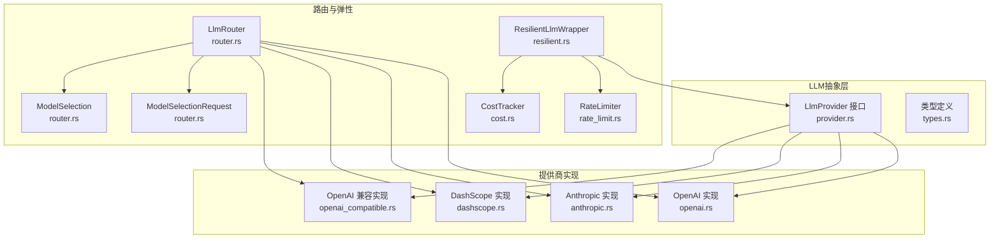
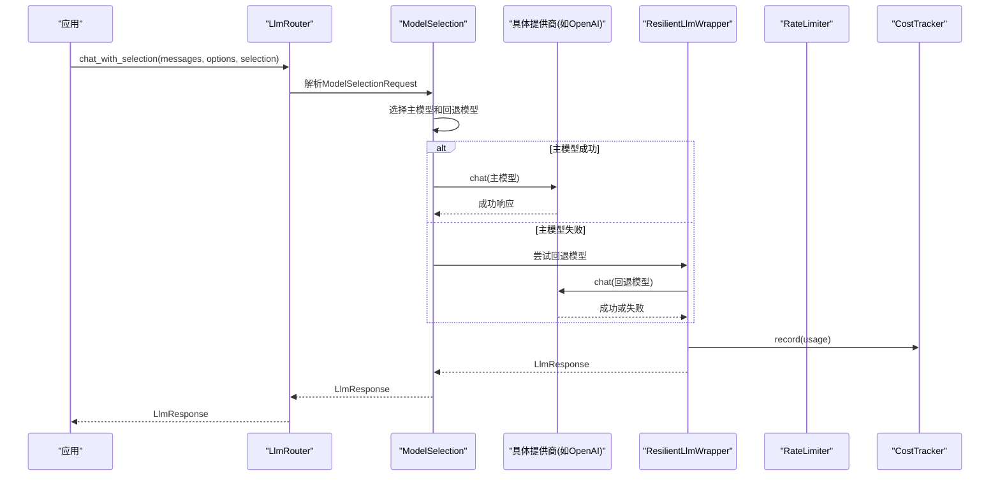
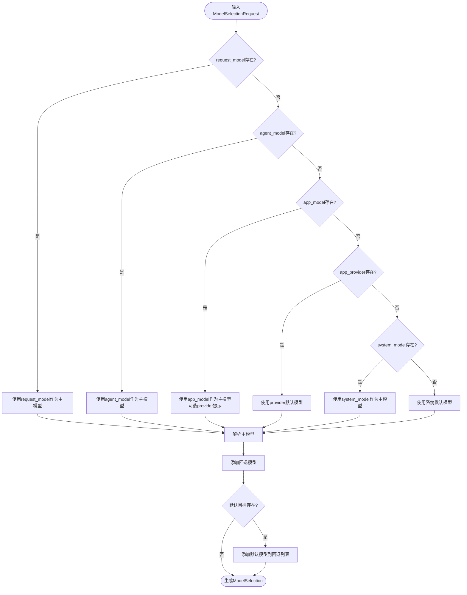
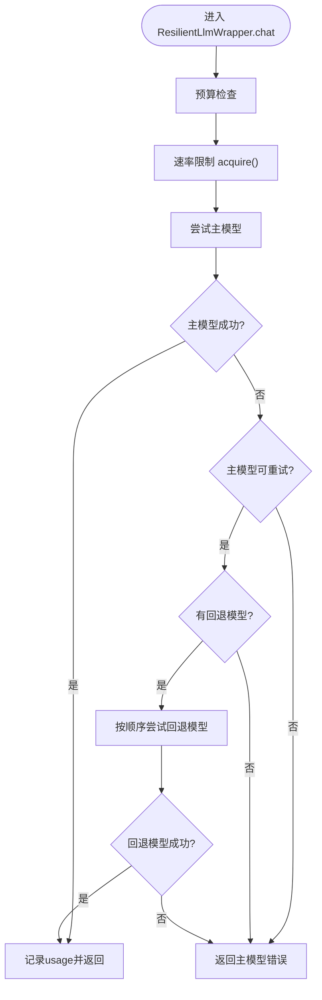
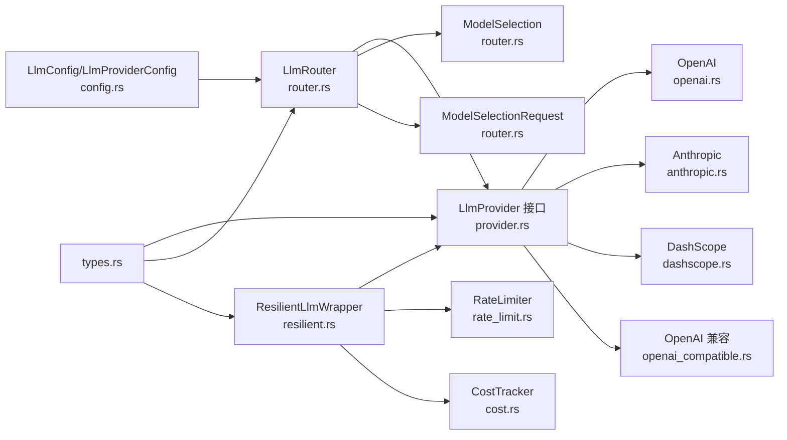

# LLM集成

<cite>
**本文引用的文件**
- [lib.rs](file://macaca/crates/macaca-llm/src/lib.rs)
- [provider.rs](file://macaca/crates/macaca-llm/src/provider.rs)
- [router.rs](file://macaca/crates/macaca-llm/src/router.rs)
- [openai.rs](file://macaca/crates/macaca-llm/src/openai.rs)
- [anthropic.rs](file://macaca/crates/macaca-llm/src/anthropic.rs)
- [dashscope.rs](file://macaca/crates/macaca-llm/src/dashscope.rs)
- [openai_compatible.rs](file://macaca/crates/macaca-llm/src/openai_compatible.rs)
- [cost.rs](file://macaca/crates/macaca-llm/src/cost.rs)
- [rate_limit.rs](file://macaca/crates/macaca-llm/src/rate_limit.rs)
- [resilient.rs](file://macaca/crates/macaca-llm/src/resilient.rs)
- [tool_wire.rs](file://macaca/crates/macaca-llm/src/tool_wire.rs)
- [types.rs](file://macaca/crates/macaca-proto/src/types.rs)
- [config.rs](file://macaca/crates/macaca-proto/src/config.rs)
- [default.toml](file://macaca/config/default.toml)
</cite>

## 更新摘要
**变更内容**
- 完全重设计的LLM提供程序路由系统，支持复杂的模型选择策略
- 新增ModelSelectionRequest和ModelSelection结构，提供多层级模型选择机制
- 增强的回退机制，支持主模型失败时的多级回退策略
- 改进的路由解析逻辑，支持更灵活的模型标识符格式
- 新增OpenRouter聚合平台支持和MiniMax等新提供商

## 目录
1. [简介](#简介)
2. [项目结构](#项目结构)
3. [核心组件](#核心组件)
4. [架构总览](#架构总览)
5. [详细组件分析](#详细组件分析)
6. [依赖关系分析](#依赖关系分析)
7. [性能考虑](#性能考虑)
8. [故障排查指南](#故障排查指南)
9. [结论](#结论)
10. [附录](#附录)

## 简介
本文件系统性梳理了该仓库中的LLM集成方案，覆盖统一抽象层、OpenAI、Anthropic、DashScope与OpenAI兼容模型的适配实现、LLM路由器的路由规则与负载/故障转移策略、成本追踪与速率限制、重试与弹性机制、以及配置与监控要点。经过完全重设计的路由系统现在支持更复杂的模型选择策略和回退机制，能够处理多层级的模型选择需求。

## 项目结构
- LLM抽象与实现位于 macaca/crates/macaca-llm，核心模块包括：
  - 抽象接口与统一响应模型：provider.rs、types.rs
  - 各提供商实现：openai.rs、anthropic.rs、dashscope.rs、openai_compatible.rs
  - 路由器：router.rs（完全重设计）
  - 弹性与可靠性：resilient.rs
  - 成本与速率限制：cost.rs、rate_limit.rs
  - 工具调用参数规范化：tool_wire.rs
- 配置模型与默认配置：config.rs、default.toml
- 对外导出入口：lib.rs

**图表来源**
- [router.rs:15-42](file://macaca/crates/macaca-llm/src/router.rs#L15-L42)
- [resilient.rs:12-50](file://macaca/crates/macaca-llm/src/resilient.rs#L12-L50)

**章节来源**
- [lib.rs:1-52](file://macaca/crates/macaca-llm/src/lib.rs#L1-L52)
- [types.rs:616-746](file://macaca/crates/macaca-proto/src/types.rs#L616-L746)
- [config.rs:39-96](file://macaca/crates/macaca-proto/src/config.rs#L39-L96)
- [default.toml:1-125](file://macaca/config/default.toml#L1-L125)

## 核心组件
- 统一LLM接口：LlmProvider，定义名称与聊天调用方法，屏蔽各提供商差异。
- 统一消息与选项模型：LlmMessage、LlmOptions、LlmResponse，确保跨提供商的消息格式与返回结构一致。
- **新增**：ModelSelectionRequest，支持多层级模型选择请求，包括请求模型、代理模型、应用模型、系统模型等。
- **新增**：ModelSelection，表示最终选择的主模型和回退模型列表。
- **新增**：ModelTarget，封装提供程序和模型的组合标识。
- 路由器：LlmRouter，基于模型前缀自动选择提供商，并支持自定义注册。
- 提供商实现：OpenAI、Anthropic、DashScope、OpenAI兼容实现，负责请求构造、参数映射与响应解析。
- 弹性包装器：ResilientLlmWrapper，提供重试退避、预算检查、可选速率限制与成本追踪。
- 成本与速率限制：CostTracker、RateLimiter，分别用于成本统计与滑动窗口限流。
- 工具调用参数规范化：tool_wire，保证工具参数在严格API下的兼容性。

**章节来源**
- [provider.rs:1-20](file://macaca/crates/macaca-llm/src/provider.rs#L1-L20)
- [types.rs:616-746](file://macaca/crates/macaca-proto/src/types.rs#L616-L746)
- [router.rs:15-42](file://macaca/crates/macaca-llm/src/router.rs#L15-L42)
- [resilient.rs:12-50](file://macaca/crates/macaca-llm/src/resilient.rs#L12-L50)
- [cost.rs:1-163](file://macaca/crates/macaca-llm/src/cost.rs#L1-L163)
- [rate_limit.rs:1-123](file://macaca/crates/macaca-llm/src/rate_limit.rs#L1-L123)
- [tool_wire.rs:1-64](file://macaca/crates/macaca-llm/src/tool_wire.rs#L1-L64)

## 架构总览
下图展示从应用到LLM路由器，再到具体提供商的调用链路，以及弹性包装器如何介入重试、预算与限流。新的路由系统支持多层级模型选择和回退机制。

**图表来源**
- [router.rs:320-366](file://macaca/crates/macaca-llm/src/router.rs#L320-L366)
- [resilient.rs:200-235](file://macaca/crates/macaca-llm/src/resilient.rs#L200-L235)

## 详细组件分析

### 统一LLM接口与数据模型
- LlmProvider：统一的提供商接口，要求实现名称与异步聊天方法。
- LlmMessage/LlmOptions/LlmResponse：标准化消息角色、工具调用、停止序列、温度、最大token、工具定义与返回内容、finish_reason、token用量等。
- TokenUsage：统一prompt/completion/total token统计。

**章节来源**
- [provider.rs:1-20](file://macaca/crates/macaca-llm/src/provider.rs#L1-L20)
- [types.rs:616-746](file://macaca/crates/macaca-proto/src/types.rs#L616-L746)

### LLM路由器（完全重设计的路由系统）
**更新** 路由器已完全重设计，支持复杂的模型选择策略和回退机制。

#### 新的模型选择层次结构
- **ModelSelectionRequest**：支持多层级模型选择请求
  - request_model：来自请求的模型
  - agent_model：代理级别的模型
  - app_model：应用级别的模型
  - app_provider：应用级别的提供商提示
  - system_model：系统级别的默认模型
  - fallbacks：显式指定的回退模型列表

- **ModelSelection**：最终的模型选择结果
  - primary：主模型（首选模型）
  - fallbacks：回退模型列表
  - source：选择来源（request、agent、app、system）

#### 改进的路由解析逻辑
- 内置路由规则：
  - gpt-*、o1*、o3* → openai
  - claude-* → anthropic
  - qwen* → dashscope
  - deepseek-* → deepseek
  - **新增**：miniMax-* → minimax（MiniMax系列）
  - **新增**：包含"/"的模型 → openrouter（聚合平台）
  - 其他 → 使用模型字符串作为提供商键（允许自定义注册）

- **增强的模型标识符支持**：
  - `provider:model` 格式（如 `openai:gpt-4o`）
  - `provider/model` 格式（如 `openai/gpt-4o`）
  - 简单模型名称（如 `gpt-4o`）

#### 支持从配置批量创建并注册提供商，缺失API Key时跳过并记录警告。
- 未匹配到提供商时返回错误。

**图表来源**
- [router.rs:168-213](file://macaca/crates/macaca-llm/src/router.rs#L168-L213)

**章节来源**
- [router.rs:15-42](file://macaca/crates/macaca-llm/src/router.rs#L15-L42)
- [router.rs:168-303](file://macaca/crates/macaca-llm/src/router.rs#L168-L303)
- [router.rs:320-366](file://macaca/crates/macaca-llm/src/router.rs#L320-L366)

### OpenAI提供商
- 默认Base URL：https://api.openai.com/v1
- 请求体字段：model、messages（含role/content/tool_calls/tool_call_id）、max_tokens、temperature、stop、tools
- 响应解析：choices[0].message.content/finish_reason，usage(prompt_tokens/completion_tokens/total_tokens)，可选tool_calls
- 工具调用参数通过tool_wire规范化，确保严格API兼容
- 错误处理：网络失败、HTTP非成功状态、JSON解析失败均转为统一错误

**章节来源**
- [openai.rs:1-277](file://macaca/crates/macaca-llm/src/openai.rs#L1-L277)
- [tool_wire.rs:1-64](file://macaca/crates/macaca-llm/src/tool_wire.rs#L1-L64)

### Anthropic提供商
- 默认Base URL：https://api.anthropic.com/v1
- 特有头部：x-api-key、anthropic-version
- 消息转换：系统消息抽取为独立字段，助手消息支持文本与tool_use混合块，工具结果以tool_result块回传
- 响应解析：content块拼接文本，stop_reason映射finish_reason，usage拆分为input_tokens/output_tokens
- 错误处理：同OpenAI模式

**章节来源**
- [anthropic.rs:1-288](file://macaca/crates/macaca-llm/src/anthropic.rs#L1-L288)

### DashScope提供商（Qwen系列）
- 默认Base URL：https://dashscope.aliyuncs.com/compatible-mode/v1
- 采用OpenAI兼容的chat/completions端点，消息与工具调用参数与OpenAI实现一致
- 错误处理：同OpenAI模式

**章节来源**
- [dashscope.rs:1-294](file://macaca/crates/macaca-llm/src/dashscope.rs#L1-L294)
- [tool_wire.rs:1-64](file://macaca/crates/macaca-llm/src/tool_wire.rs#L1-L64)

### OpenAI兼容提供商（vLLM、Ollama、DeepSeek等）
- 通用实现，支持任意OpenAI兼容端点
- 自定义提供商名称，便于在路由器中按名称路由
- 支持空API Key（某些本地/代理场景）

**章节来源**
- [openai_compatible.rs:1-332](file://macaca/crates/macaca-llm/src/openai_compatible.rs#L1-L332)

### 成本追踪（CostTracker）
- 模型定价表：内置常见模型的每千tokens价格（美元），未知模型按零成本处理
- 统计维度：累计prompt/completion/total tokens、请求数、总成本
- 预算检查：支持剩余预算查询与超支判断
- 线程安全：内部使用互斥锁保护共享状态

**章节来源**
- [cost.rs:1-163](file://macaca/crates/macaca-llm/src/cost.rs#L1-L163)

### 速率限制（RateLimiter）
- 滑动窗口算法：维护最近N秒内的请求时间戳
- 当超过上限时，计算最早请求到期后的时间并睡眠等待
- 提供每分钟便捷构造器

**章节来源**
- [rate_limit.rs:1-123](file://macaca/crates/macaca-llm/src/rate_limit.rs#L1-L123)

### 弹性包装器（ResilientLlmWrapper）
**更新** 弹性包装器现在支持更复杂的回退机制。

- **增强的回退机制**：
  - 支持配置多个回退模型
  - 每个回退模型都有完整的重试周期
  - 主模型失败时按顺序尝试回退模型
  - 非可重试错误（如认证失败）直接返回，不触发回退

- **重试与退避**：指数退避（2^n倍），上限毫秒值可配置
- **可重试条件**：根据错误字符串匹配HTTP状态码或常见网络/解析错误关键词
- **预算控制**：在每次尝试前检查累计成本是否超限
- **速率限制**：在整次调用（含回退链）前执行acquire
- **成本记录**：仅在成功响应时记录usage

**图表来源**
- [resilient.rs:124-164](file://macaca/crates/macaca-llm/src/resilient.rs#L124-L164)
- [resilient.rs:200-235](file://macaca/crates/macaca-llm/src/resilient.rs#L200-L235)

**章节来源**
- [resilient.rs:12-50](file://macaca/crates/macaca-llm/src/resilient.rs#L12-L50)
- [resilient.rs:200-235](file://macaca/crates/macaca-llm/src/resilient.rs#L200-L235)

### 工具调用参数规范化（tool_wire）
- 将工具参数统一序列化为JSON对象字符串，避免严格API拒绝
- 对无效JSON进行告警并回退为空对象
- 保证OpenAI兼容API的严格参数要求

**章节来源**
- [tool_wire.rs:1-64](file://macaca/crates/macaca-llm/src/tool_wire.rs#L1-L64)

## 依赖关系分析
- LlmRouter依赖provider接口与各提供商实现，支持动态注册与配置驱动创建
- **新增**：ModelSelectionRequest和ModelSelection提供多层级模型选择
- ResilientLlmWrapper组合LlmProvider、RateLimiter与CostTracker，形成可插拔的可靠性增强层
- **增强**：支持回退模型配置，实现多级故障转移
- 各提供商实现依赖统一的类型定义与工具参数规范化模块
- 配置模块提供LLM配置结构与键解析逻辑，支持环境变量注入

**图表来源**
- [config.rs:39-96](file://macaca/crates/macaca-proto/src/config.rs#L39-L96)
- [router.rs:15-42](file://macaca/crates/macaca-llm/src/router.rs#L15-L42)
- [resilient.rs:12-50](file://macaca/crates/macaca-llm/src/resilient.rs#L12-L50)
- [types.rs:616-746](file://macaca/crates/macaca-proto/src/types.rs#L616-L746)

**章节来源**
- [config.rs:1-387](file://macaca/crates/macaca-proto/src/config.rs#L1-L387)
- [router.rs:15-42](file://macaca/crates/macaca-llm/src/router.rs#L15-L42)
- [resilient.rs:12-50](file://macaca/crates/macaca-llm/src/resilient.rs#L12-L50)

## 性能考虑
- **路由与序列化开销**：路由器仅做字符串匹配与哈希查找，开销极低；消息转换与JSON序列化为CPU热点，建议复用消息向量与避免重复序列化。
- **新增**：ModelSelection解析可能涉及多次字符串操作，建议缓存常用模型选择结果。
- **并发与连接**：各提供商实现使用reqwest客户端，注意连接池与代理设置；在高并发场景建议统一管理客户端实例。
- **重试与退避**：指数退避可缓解瞬时抖动，但会放大延迟；建议结合业务SLA调整最大重试次数与上限。
- **新增**：回退机制可能增加额外的网络调用，需要合理配置回退模型数量和重试策略。
- **速率限制**：滑动窗口限流对突发流量有抑制作用，建议结合提供商配额与自身吞吐目标设定合理窗口与上限。
- **成本控制**：CostTracker仅在成功后记录，避免误计；建议在关键路径前置预算检查，减少无效调用。

## 故障排查指南
- **API Key缺失或不正确**
  - 现象：路由器创建时跳过该提供商并告警；直接调用时报错。
  - 处理：检查环境变量或配置项，确认大小写与空格。
- **HTTP错误或解析失败**
  - 现象：统一错误包含状态码与响应体片段。
  - 处理：查看日志中的响应体片段，确认上游返回格式；检查网络连通与代理设置。
- **工具调用参数异常**
  - 现象：严格API拒绝请求。
  - 处理：使用tool_arguments_for_chat_api规范化参数；检查上游返回的arguments是否为有效JSON对象字符串。
- **预算超支**
  - 现象：直接返回预算超支错误，不发起实际请求。
  - 处理：调整预算阈值或在调用前检查剩余预算。
- **重试无效**
  - 现象：错误被判定为不可重试，立即返回。
  - 处理：确认错误信息是否包含可重试状态码或网络相关关键词；必要时扩展可重试状态列表。
- **新增**：模型选择失败
  - 现象：无法解析模型标识符或找不到合适的提供商。
  - 处理：检查ModelSelectionRequest的配置，确认模型名称格式正确；验证提供商是否已注册。
- **新增**：回退机制问题
  - 现象：主模型失败后没有尝试回退模型，或回退模型配置无效。
  - 处理：检查ResilientConfig中的fallback_models配置；确认回退模型名称格式正确且可用。

**章节来源**
- [router.rs:109-151](file://macaca/crates/macaca-llm/src/router.rs#L109-L151)
- [openai.rs:216-222](file://macaca/crates/macaca-llm/src/openai.rs#L216-L222)
- [anthropic.rs:217-223](file://macaca/crates/macaca-llm/src/anthropic.rs#L217-L223)
- [dashscope.rs:226-232](file://macaca/crates/macaca-llm/src/dashscope.rs#L226-L232)
- [openai_compatible.rs:241-248](file://macaca/crates/macaca-llm/src/openai_compatible.rs#L241-L248)
- [resilient.rs:95-122](file://macaca/crates/macaca-llm/src/resilient.rs#L95-L122)
- [resilient.rs:178-189](file://macaca/crates/macaca-llm/src/resilient.rs#L178-L189)

## 结论
该LLM集成方案通过完全重设计的路由系统，实现了对OpenAI、Anthropic、DashScope及OpenAI兼容模型的一致接入；新的ModelSelectionRequest和ModelSelection机制提供了灵活的多层级模型选择策略；弹性包装器的增强回退机制补齐了生产级的故障转移能力；配合成本追踪与速率限制，满足多提供商协同与成本可控的工程需求。

## 附录

### 配置示例与最佳实践
- **配置文件位置与加载**
  - 默认路径：config/default.toml
  - 加载方式：支持从文件与环境变量合并覆盖
- **关键配置项**
  - llm.default_provider：默认提供商名称
  - llm.rate_limit_rpm：全局速率限制（requests per minute）
  - llm.providers.*：按提供商注册，支持api_key_plan与api_key二选一（订阅优先）
- **新增**：模型选择配置
  - 支持多种模型标识符格式：`provider:model`、`provider/model`、简单名称
  - 支持回退模型配置
- **最佳实践**
  - 为每个提供商设置合理的默认模型与base_url
  - 在生产环境使用环境变量注入API Key，避免硬编码
  - 为不同提供商设置差异化重试策略与预算阈值
  - **新增**：合理配置回退模型，避免过多的回退链导致性能下降

**章节来源**
- [default.toml:1-125](file://macaca/config/default.toml#L1-L125)
- [config.rs:39-96](file://macaca/crates/macaca-proto/src/config.rs#L39-L96)
- [config.rs:329-352](file://macaca/crates/macaca-proto/src/config.rs#L329-L352)

### 监控指标建议
- **路由命中率**：统计各提供商的调用次数与占比
- **模型选择效率**：统计ModelSelection解析时间与成功率
- **成本指标**：总token消耗、总成本、请求次数、剩余预算
- **速率限制**：当前窗口内请求数、等待时长
- **错误与重试**：错误分布（HTTP状态、网络/解析类）、重试次数与成功率
- **新增**：回退机制指标
  - 回退触发次数与成功率
  - 各回退模型的使用频率
  - 回退链平均长度
- **响应时延**：端到端时延与各阶段耗时（网络、解析、处理）