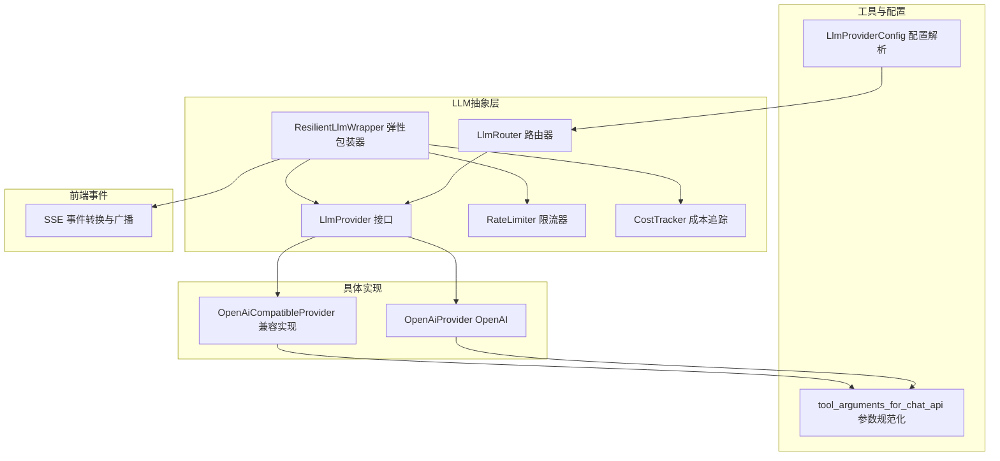
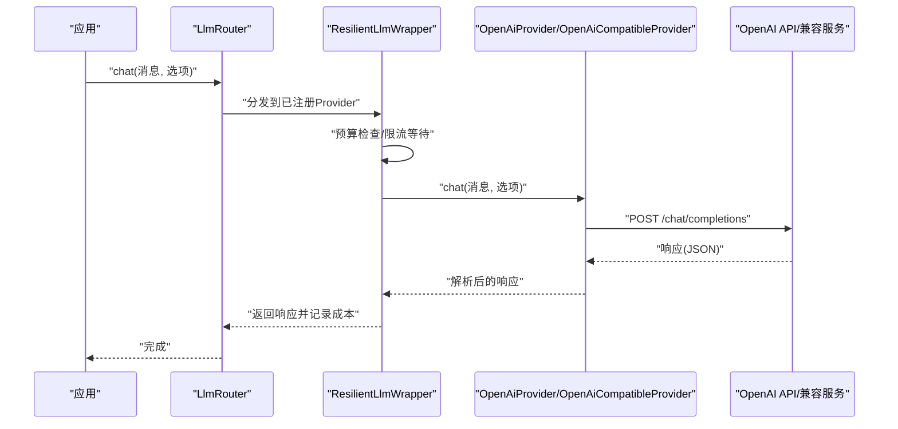
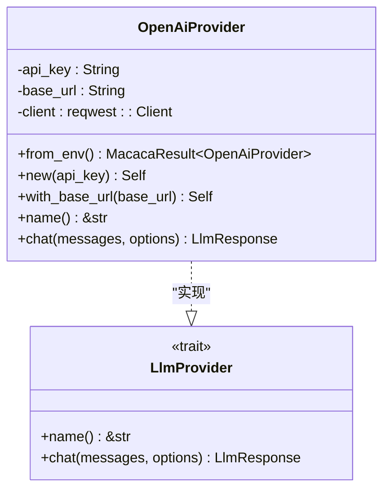
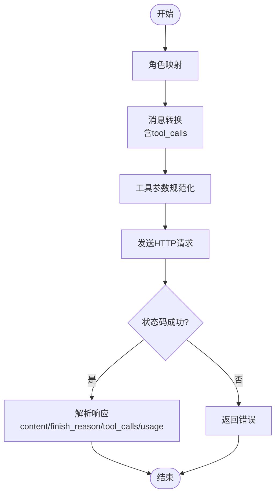
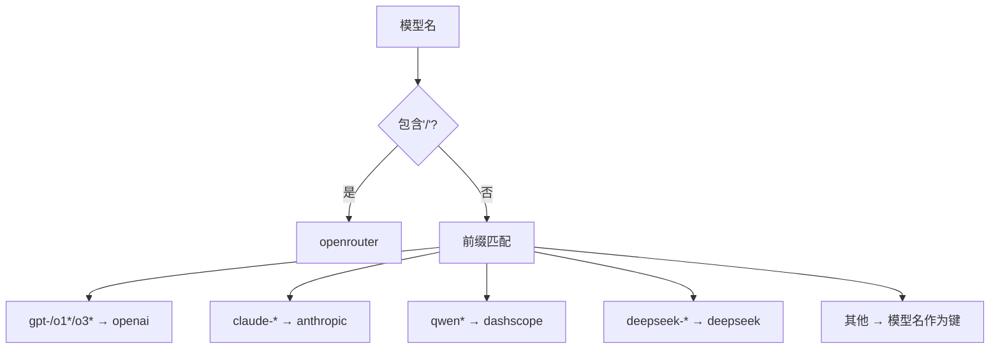
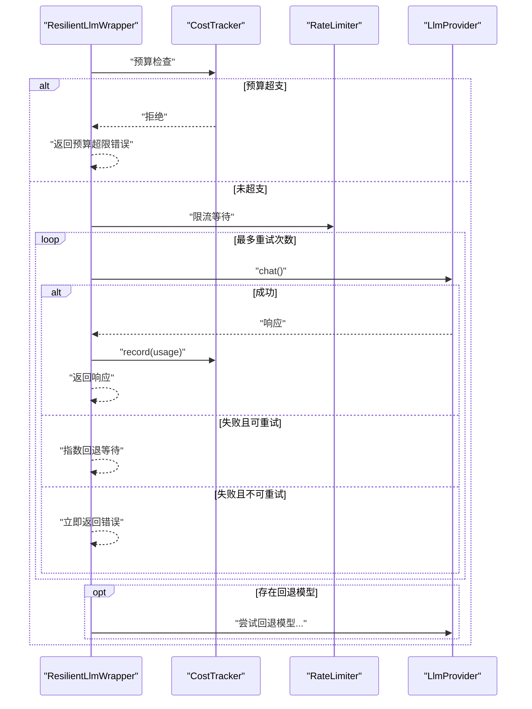
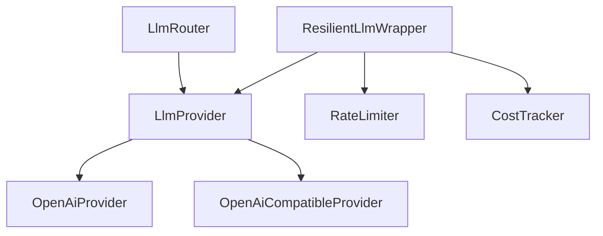

# OpenAI集成

<cite>
**本文档引用的文件**
- [openai.rs](file://macaca/crates/macaca-llm/src/openai.rs)
- [provider.rs](file://macaca/crates/macaca-llm/src/provider.rs)
- [lib.rs](file://macaca/crates/macaca-llm/src/lib.rs)
- [router.rs](file://macaca/crates/macaca-llm/src/router.rs)
- [resilient.rs](file://macaca/crates/macaca-llm/src/resilient.rs)
- [rate_limit.rs](file://macaca/crates/macaca-llm/src/rate_limit.rs)
- [cost.rs](file://macaca/crates/macaca-llm/src/cost.rs)
- [tool_wire.rs](file://macaca/crates/macaca-llm/src/tool_wire.rs)
- [openai_compatible.rs](file://macaca/crates/macaca-llm/src/openai_compatible.rs)
- [config.rs](file://macaca/crates/macaca-proto/src/config.rs)
- [default.toml](file://macaca/config/default.toml)
- [sse.rs](file://macaca/crates/macaca-web/src/sse.rs)
</cite>

## 目录
1. [简介](#简介)
2. [项目结构](#项目结构)
3. [核心组件](#核心组件)
4. [架构总览](#架构总览)
5. [详细组件分析](#详细组件分析)
6. [依赖关系分析](#依赖关系分析)
7. [性能考虑](#性能考虑)
8. [故障排除指南](#故障排除指南)
9. [结论](#结论)
10. [附录](#附录)

## 简介
本文件系统性地文档化了项目中的OpenAI集成实现，涵盖以下方面：
- API密钥配置与加载机制
- 请求格式转换与响应解析
- 支持的模型类型、参数设置与功能特性
- OpenAI特有能力：函数调用、工具使用与流式响应处理
- 配置示例、错误处理策略与性能优化建议
- API限制、成本控制与监控指标的实现细节

该集成通过统一的LLM抽象层实现，既可直接对接OpenAI官方API，也可适配任意OpenAI兼容的第三方服务。

## 项目结构
OpenAI集成位于LLM抽象层中，采用模块化设计，核心文件分布如下：
- 抽象接口：LlmProvider
- 具体实现：OpenAiProvider、OpenAiCompatibleProvider
- 路由与编排：LlmRouter
- 容错与弹性：ResilientLlmWrapper
- 限流与成本：RateLimiter、CostTracker
- 工具参数规范化：tool_arguments_for_chat_api
- 配置解析：LlmProviderConfig
- 前端事件：SSE事件转换与广播

**图表来源**
- [provider.rs:1-20](file://macaca/crates/macaca-llm/src/provider.rs#L1-L20)
- [router.rs:1-253](file://macaca/crates/macaca-llm/src/router.rs#L1-L253)
- [resilient.rs:1-619](file://macaca/crates/macaca-llm/src/resilient.rs#L1-L619)
- [rate_limit.rs:1-123](file://macaca/crates/macaca-llm/src/rate_limit.rs#L1-L123)
- [cost.rs:1-163](file://macaca/crates/macaca-llm/src/cost.rs#L1-L163)
- [tool_wire.rs:1-64](file://macaca/crates/macaca-llm/src/tool_wire.rs#L1-L64)
- [config.rs:47-78](file://macaca/crates/macaca-proto/src/config.rs#L47-L78)
- [openai.rs:1-277](file://macaca/crates/macaca-llm/src/openai.rs#L1-L277)
- [openai_compatible.rs:1-332](file://macaca/crates/macaca-llm/src/openai_compatible.rs#L1-L332)
- [sse.rs:1-246](file://macaca/crates/macaca-web/src/sse.rs#L1-L246)

**章节来源**
- [lib.rs:1-52](file://macaca/crates/macaca-llm/src/lib.rs#L1-L52)
- [default.toml:1-119](file://macaca/config/default.toml#L1-L119)

## 核心组件
- LlmProvider：定义统一的聊天接口，所有LLM后端实现均遵循此接口。
- OpenAiProvider：OpenAI官方API的具体实现，负责消息格式转换、请求发送与响应解析。
- OpenAiCompatibleProvider：通用的OpenAI兼容API实现，支持vLLM、Ollama等第三方服务。
- LlmRouter：根据模型名称前缀自动路由到对应Provider。
- ResilientLlmWrapper：在Provider外层增加重试、回退、预算检查与成本记录能力。
- RateLimiter：滑动窗口限流器，避免突发请求导致限流或失败。
- CostTracker：按模型定价表统计token用量与累计成本。
- tool_arguments_for_chat_api：确保工具调用参数符合严格API要求（如必须为JSON对象字符串）。

**章节来源**
- [provider.rs:7-20](file://macaca/crates/macaca-llm/src/provider.rs#L7-L20)
- [openai.rs:12-39](file://macaca/crates/macaca-llm/src/openai.rs#L12-L39)
- [openai_compatible.rs:17-58](file://macaca/crates/macaca-llm/src/openai_compatible.rs#L17-L58)
- [router.rs:14-129](file://macaca/crates/macaca-llm/src/router.rs#L14-L129)
- [resilient.rs:43-76](file://macaca/crates/macaca-llm/src/resilient.rs#L43-L76)
- [rate_limit.rs:7-93](file://macaca/crates/macaca-llm/src/rate_limit.rs#L7-L93)
- [cost.rs:40-108](file://macaca/crates/macaca-llm/src/cost.rs#L40-L108)
- [tool_wire.rs:11-36](file://macaca/crates/macaca-llm/src/tool_wire.rs#L11-L36)

## 架构总览
下图展示了从应用到LLM后端的完整调用链路，以及弹性包装器如何增强可靠性与可观测性。

**图表来源**
- [router.rs:114-129](file://macaca/crates/macaca-llm/src/router.rs#L114-L129)
- [resilient.rs:173-236](file://macaca/crates/macaca-llm/src/resilient.rs#L173-L236)
- [openai.rs:175-250](file://macaca/crates/macaca-llm/src/openai.rs#L175-L250)

## 详细组件分析

### OpenAiProvider 组件分析
OpenAiProvider是OpenAI官方API的实现，负责：
- API密钥读取与基础URL配置
- 将内部消息结构转换为OpenAI请求格式
- 发送HTTP请求并解析响应
- 处理工具调用与finish_reason

**图表来源**
- [openai.rs:12-39](file://macaca/crates/macaca-llm/src/openai.rs#L12-L39)
- [provider.rs:8-19](file://macaca/crates/macaca-llm/src/provider.rs#L8-L19)

**章节来源**
- [openai.rs:18-39](file://macaca/crates/macaca-llm/src/openai.rs#L18-L39)
- [openai.rs:175-250](file://macaca/crates/macaca-llm/src/openai.rs#L175-L250)

### 请求格式转换与响应解析
OpenAI请求/响应的关键转换逻辑：
- 角色映射：System/User/Assistant/Tool → 对应OpenAI角色字符串
- 消息转换：将内部消息结构转换为OpenAI消息格式，支持tool_calls字段
- 工具调用参数规范化：确保参数为合法JSON对象字符串
- 响应解析：提取content、finish_reason、tool_calls与token使用情况

**图表来源**
- [openai.rs:123-167](file://macaca/crates/macaca-llm/src/openai.rs#L123-L167)
- [tool_wire.rs:11-36](file://macaca/crates/macaca-llm/src/tool_wire.rs#L11-L36)

**章节来源**
- [openai.rs:132-167](file://macaca/crates/macaca-llm/src/openai.rs#L132-L167)
- [tool_wire.rs:11-36](file://macaca/crates/macaca-llm/src/tool_wire.rs#L11-L36)

### LlmRouter 路由机制
LlmRouter根据模型名称前缀自动选择Provider：
- gpt-* / o1* / o3* → openai
- claude-* → anthropic
- qwen* → dashscope
- deepseek-* → deepseek
- 其他 → 使用模型字符串作为Provider键

**图表来源**
- [router.rs:78-112](file://macaca/crates/macaca-llm/src/router.rs#L78-L112)

**章节来源**
- [router.rs:37-76](file://macaca/crates/macaca-llm/src/router.rs#L37-L76)
- [router.rs:78-112](file://macaca/crates/macaca-llm/src/router.rs#L78-L112)

### ResilientLlmWrapper 弹性与可靠性
ResilientLlmWrapper在Provider外层提供：
- 可配置重试与指数回退
- 可选预算上限检查
- 可选速率限制
- 成本记录与统计
- 失败时的模型回退链

**图表来源**
- [resilient.rs:173-236](file://macaca/crates/macaca-llm/src/resilient.rs#L173-L236)
- [rate_limit.rs:74-86](file://macaca/crates/macaca-llm/src/rate_limit.rs#L74-L86)
- [cost.rs:60-71](file://macaca/crates/macaca-llm/src/cost.rs#L60-L71)

**章节来源**
- [resilient.rs:12-41](file://macaca/crates/macaca-llm/src/resilient.rs#L12-L41)
- [resilient.rs:173-236](file://macaca/crates/macaca-llm/src/resilient.rs#L173-L236)
- [rate_limit.rs:13-93](file://macaca/crates/macaca-llm/src/rate_limit.rs#L13-L93)
- [cost.rs:55-108](file://macaca/crates/macaca-llm/src/cost.rs#L55-L108)

### OpenAI兼容实现
OpenAiCompatibleProvider用于适配任何OpenAI兼容的API端点，具备与OpenAiProvider相同的请求/响应格式与工具调用能力。

**章节来源**
- [openai_compatible.rs:17-58](file://macaca/crates/macaca-llm/src/openai_compatible.rs#L17-L58)
- [openai_compatible.rs:192-200](file://macaca/crates/macaca-llm/src/openai_compatible.rs#L192-L200)

### 配置与API密钥管理
- 配置文件default.toml中定义了llm.providers.openai的api_key与base_url
- LlmProviderConfig支持从环境变量解析密钥，支持“全部大写”作为环境变量名
- LlmRouter::from_config会基于配置创建Provider实例，并进行API密钥可用性检查

**章节来源**
- [default.toml:11-13](file://macaca/config/default.toml#L11-L13)
- [config.rs:47-78](file://macaca/crates/macaca-proto/src/config.rs#L47-L78)
- [router.rs:37-76](file://macaca/crates/macaca-llm/src/router.rs#L37-L76)

### 流式响应处理
当前OpenAI集成实现采用一次性请求/响应模式，未包含OpenAI Stream API的专用处理逻辑。若需流式响应，可在上游框架或Web层进行SSE封装与事件转换。

**章节来源**
- [sse.rs:57-202](file://macaca/crates/macaca-web/src/sse.rs#L57-L202)

## 依赖关系分析
- LlmProvider为所有Provider的共同接口，保证多后端一致性
- OpenAiProvider与OpenAiCompatibleProvider共享消息转换与工具调用参数规范化逻辑
- ResilientLlmWrapper组合使用RateLimiter与CostTracker，增强可靠性与成本控制
- LlmRouter集中管理Provider注册与路由规则

**图表来源**
- [provider.rs:8-19](file://macaca/crates/macaca-llm/src/provider.rs#L8-L19)
- [openai.rs:169-173](file://macaca/crates/macaca-llm/src/openai.rs#L169-L173)
- [openai_compatible.rs:192-196](file://macaca/crates/macaca-llm/src/openai_compatible.rs#L192-L196)
- [resilient.rs:43-50](file://macaca/crates/macaca-llm/src/resilient.rs#L43-L50)
- [router.rs:21-35](file://macaca/crates/macaca-llm/src/router.rs#L21-L35)

**章节来源**
- [lib.rs:30-52](file://macaca/crates/macaca-llm/src/lib.rs#L30-L52)

## 性能考虑
- 限流策略：使用滑动窗口限流器控制请求速率，避免触发平台限流
- 重试与回退：指数回退减少瞬时峰值，回退模型提升成功率
- 成本控制：基于模型定价表统计token用量，提供预算上限与剩余预算查询
- 参数规范化：确保工具调用参数为合法JSON对象字符串，减少上游解析失败

**章节来源**
- [rate_limit.rs:13-93](file://macaca/crates/macaca-llm/src/rate_limit.rs#L13-L93)
- [resilient.rs:12-41](file://macaca/crates/macaca-llm/src/resilient.rs#L12-L41)
- [cost.rs:19-38](file://macaca/crates/macaca-llm/src/cost.rs#L19-L38)
- [tool_wire.rs:11-36](file://macaca/crates/macaca-llm/src/tool_wire.rs#L11-L36)

## 故障排除指南
- API密钥问题：确认环境变量OPENAI_API_KEY已正确设置，或在配置文件中指定
- 路由错误：检查模型名称是否符合前缀规则，或显式注册Provider
- 重试与回退：查看日志中重试与回退提示，确认网络与上游服务状态
- 预算超限：启用CostTracker并设置max_budget_usd，避免超出预算
- 工具调用失败：检查工具参数是否为合法JSON对象字符串，必要时使用tool_arguments_for_chat_api进行规范化

**章节来源**
- [openai.rs:20-24](file://macaca/crates/macaca-llm/src/openai.rs#L20-L24)
- [router.rs:120-128](file://macaca/crates/macaca-llm/src/router.rs#L120-L128)
- [resilient.rs:178-189](file://macaca/crates/macaca-llm/src/resilient.rs#L178-L189)
- [tool_wire.rs:28-36](file://macaca/crates/macaca-llm/src/tool_wire.rs#L28-L36)

## 结论
本OpenAI集成通过统一的LLM抽象层实现了对OpenAI官方API与OpenAI兼容服务的无缝支持。结合弹性包装器、限流与成本控制机制，能够在复杂生产环境中稳定运行。未来可扩展的方向包括：
- 增加OpenAI Stream API的专用流式处理
- 提供更丰富的模型定价与成本分析报表
- 扩展更多第三方Provider的原生适配

## 附录

### 支持的模型类型与参数
- 模型类型：OpenAI官方模型（如gpt-4o、gpt-4-turbo）、兼容模型（如DeepSeek、vLLM）
- 关键参数：model、messages、max_tokens、temperature、stop、tools
- 工具调用：支持function类型的工具定义与参数规范化

**章节来源**
- [openai.rs:43-55](file://macaca/crates/macaca-llm/src/openai.rs#L43-L55)
- [openai_compatible.rs:62-74](file://macaca/crates/macaca-llm/src/openai_compatible.rs#L62-L74)

### 配置示例
- 在配置文件中设置llm.providers.openai的api_key与base_url
- 使用环境变量名（如OPENAI_API_KEY）自动解析密钥
- 通过LlmRouter::from_config批量创建Provider实例

**章节来源**
- [default.toml:11-13](file://macaca/config/default.toml#L11-L13)
- [config.rs:64-78](file://macaca/crates/macaca-proto/src/config.rs#L64-L78)
- [router.rs:37-76](file://macaca/crates/macaca-llm/src/router.rs#L37-L76)

### 错误处理策略
- 状态码非成功：统一返回MacacaError::Llm
- 解析失败：返回MacacaError::Llm
- 预算超限：返回MacacaError::BudgetExceeded
- 网络/超时/连接类错误：标记为可重试

**章节来源**
- [openai.rs:216-227](file://macaca/crates/macaca-llm/src/openai.rs#L216-L227)
- [resilient.rs:95-122](file://macaca/crates/macaca-llm/src/resilient.rs#L95-L122)

### 性能优化建议
- 合理设置max_retries与backoff参数，平衡延迟与成功率
- 使用RateLimiter控制并发与速率，避免触发上游限流
- 启用CostTracker并设置预算上限，防止成本失控
- 对工具参数进行规范化，减少上游解析失败

**章节来源**
- [resilient.rs:12-41](file://macaca/crates/macaca-llm/src/resilient.rs#L12-L41)
- [rate_limit.rs:57-93](file://macaca/crates/macaca-llm/src/rate_limit.rs#L57-L93)
- [cost.rs:93-101](file://macaca/crates/macaca-llm/src/cost.rs#L93-L101)