# 运行时系统

<cite>
**本文档引用的文件**
- [lib.rs](file://macaca/crates/macaca-runtime/src/lib.rs)
- [agentic_loop.rs](file://macaca/crates/macaca-runtime/src/agentic_loop.rs)
- [context_window.rs](file://macaca/crates/macaca-runtime/src/context_window.rs)
- [loop_detector.rs](file://macaca/crates/macaca-runtime/src/loop_detector.rs)
- [permission.rs](file://macaca/crates/macaca-runtime/src/permission.rs)
- [Cargo.toml](file://macaca/crates/macaca-runtime/Cargo.toml)
- [lib.rs](file://macaca/crates/macaca-runtime-host/src/lib.rs)
- [mcp_runtime.rs](file://macaca/crates/macaca-runtime-host/src/mcp_runtime.rs)
- [compat.rs](file://macaca/crates/macaca-runtime-host/src/compat.rs)
- [env_bridge.rs](file://macaca/crates/macaca-runtime-host/src/env_bridge.rs)
- [compat_mappings.toml](file://macaca/crates/macaca-runtime-host/resources/compat_mappings.toml)
- [mcp_runtime.rs](file://macaca/crates/macaca-web/src/mcp_runtime.rs)
- [lib.rs](file://macaca/crates/macaca-framework/src/lib.rs)
- [mcp.rs](file://macaca/crates/macaca-framework/src/mcp.rs)
- [agent.rs](file://macaca/crates/macaca-agent/src/agent.rs)
- [basic.rs](file://macaca/crates/macaca-agent/src/basic.rs)
- [state_machine.rs](file://macaca/crates/macaca-agent/src/state_machine.rs)
- [shutdown.rs](file://macaca/crates/macaca-agent/src/shutdown.rs)
- [agent.rs](file://macaca/crates/macaca-framework/src/agent.rs)
</cite>

## 更新摘要
**变更内容**
- 新增macaca-runtime-host架构分析，替代原有macaca-web中的MCP逻辑
- 添加MCP运行时管理器、兼容性映射和环境桥接功能的详细说明
- 更新架构概览以反映新的分层设计
- 增加新的组件关系图和生命周期管理说明

## 目录
1. [简介](#简介)
2. [项目结构](#项目结构)
3. [核心组件](#核心组件)
4. [架构概览](#架构概览)
5. [详细组件分析](#详细组件分析)
6. [依赖关系分析](#依赖关系分析)
7. [性能考虑](#性能考虑)
8. [故障排除指南](#故障排除指南)
9. [结论](#结论)

## 简介

运行时系统是 Agent OS 的核心执行引擎，负责管理智能体的生命周期、执行循环和安全控制。该系统提供了完整的代理执行框架，包括上下文窗口管理、循环检测、权限控制和优雅关闭支持。

**更新** 新架构引入了专门的 macaca-runtime-host crate，提供 MCP 运行时管理、兼容性映射和环境桥接功能，替代原有的 macaca-web 中的 MCP 逻辑，实现更清晰的职责分离和更好的可扩展性。

运行时系统采用模块化设计，通过清晰的接口抽象和可插拔的组件架构，为各种类型的智能体提供统一的执行环境。系统特别注重安全性、可扩展性和可靠性，确保智能体能够在受控环境中安全地执行工具调用和任务处理。

## 项目结构

运行时系统主要位于 `macaca-runtime` crate 中，同时与 `macaca-agent`、`macaca-framework` 和新增的 `macaca-runtime-host` crate 协同工作，形成完整的智能体执行生态系统。

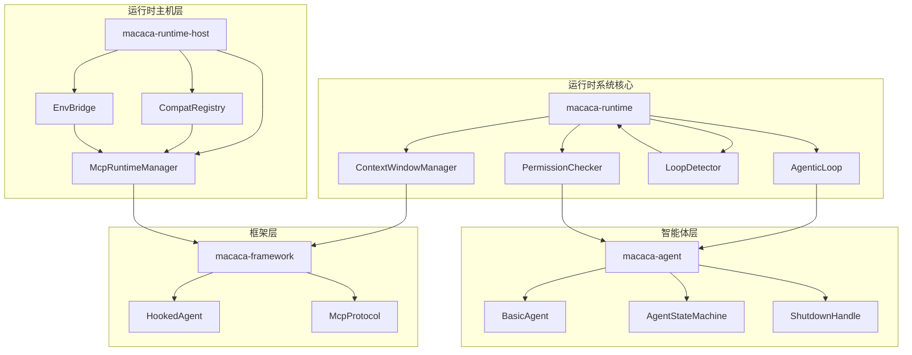

**图表来源**
- [lib.rs:1-15](file://macaca/crates/macaca-runtime/src/lib.rs#L1-L15)
- [lib.rs:1-23](file://macaca/crates/macaca-runtime-host/src/lib.rs#L1-L23)
- [agent.rs:1-79](file://macaca/crates/macaca-agent/src/agent.rs#L1-L79)
- [lib.rs:1-33](file://macaca/crates/macaca-framework/src/lib.rs#L1-L33)

**章节来源**
- [lib.rs:1-15](file://macaca/crates/macaca-runtime/src/lib.rs#L1-L15)
- [lib.rs:1-23](file://macaca/crates/macaca-runtime-host/src/lib.rs#L1-L23)
- [Cargo.toml:1-17](file://macaca/crates/macaca-runtime/Cargo.toml#L1-L17)

## 核心组件

运行时系统由四个核心组件构成，每个组件都有明确的职责和接口：

### 智能体执行循环 (AgenticLoop)
智能体执行循环是系统的心脏，负责协调 LLM 调用、工具执行和结果反馈的完整循环。它实现了标准的 LLM → 工具 → LLM 循环模式，并提供了事件驱动的执行能力。

### 上下文窗口管理器 (ContextWindowManager)
上下文窗口管理器负责监控和控制 LLM 的上下文长度，防止超出模型的上下文限制。它使用启发式算法估算 token 数量，并在必要时自动修剪历史消息。

### 循环检测器 (LoopDetector)
循环检测器监控智能体的行为模式，防止无限循环和重复执行相同操作。当检测到异常行为时，它会发出警告或强制终止执行。

### 权限检查器 (PermissionChecker)
权限检查器确保智能体只能执行被授权的操作，特别是文件系统访问和网络操作的安全控制。它支持基于工具名称和参数的细粒度权限控制。

### MCP 运行时管理器 (McpRuntimeManager)
**新增** MCP 运行时管理器是运行时主机层的核心组件，负责管理 MCP 服务器的生命周期、注册和状态跟踪。它提供了全局、应用、会话、代理会话和调用级别的生命周期管理。

### 兼容性注册表 (CompatRegistry)
**新增** 兼容性注册表提供声明式的技能到 MCP 服务器映射功能，替代了原有的硬编码产品特定分支。它支持从技能安装规范到 MCP 服务器定义的自动映射。

### 环境桥接器 (EnvBridge)
**新增** 环境桥接器负责将配置中的 MCP 环境变量安全地传递到 MCP 子进程中，支持字面量值、环境变量转发和占位符检测等多种语义。

**章节来源**
- [agentic_loop.rs:61-67](file://macaca/crates/macaca-runtime/src/agentic_loop.rs#L61-L67)
- [context_window.rs:29-32](file://macaca/crates/macaca-runtime/src/context_window.rs#L29-L32)
- [loop_detector.rs:40-49](file://macaca/crates/macaca-runtime/src/loop_detector.rs#L40-L49)
- [permission.rs:5-31](file://macaca/crates/macaca-runtime/src/permission.rs#L5-L31)
- [mcp_runtime.rs:284-289](file://macaca/crates/macaca-runtime-host/src/mcp_runtime.rs#L284-L289)
- [compat.rs:100-104](file://macaca/crates/macaca-runtime-host/src/compat.rs#L100-L104)
- [env_bridge.rs:27-40](file://macaca/crates/macaca-runtime-host/src/env_bridge.rs#L27-L40)

## 架构概览

运行时系统采用分层架构设计，从底层的执行引擎到上层的智能体接口，形成了清晰的职责分离。新增的 macaca-runtime-host 层提供了 MCP 运行时管理能力，实现了与 HTTP 主机的解耦。

```mermaid
sequenceDiagram
participant Client as 客户端应用
participant RuntimeHost as 运行时主机
participant McpMgr as MCP管理器
participant Framework as 框架层
participant Agent as 智能体
participant Loop as 执行循环
participant LLM as 大语言模型
participant Tools as 工具集
participant Perm as 权限检查器
Client->>RuntimeHost : 创建运行时主机实例
RuntimeHost->>McpMgr : 初始化MCP管理器
McpMgr->>Framework : 注册MCP工具
Framework->>Agent : 创建智能体实例
Agent->>Loop : 初始化执行循环
Loop->>Perm : 验证工具权限
Perm-->>Loop : 权限验证结果
loop 执行循环
Loop->>LLM : 发送消息请求
LLM-->>Loop : 返回响应和工具调用
alt 存在工具调用
Loop->>Tools : 执行工具调用
Tools-->>Loop : 返回执行结果
Loop->>LLM : 提供工具结果
else 无工具调用
Loop-->>Client : 返回最终响应
end
Loop->>Loop : 检查循环状态
end
Loop-->>Client : 执行完成
```

**图表来源**
- [mcp_runtime.rs:335-377](file://macaca/crates/macaca-runtime-host/src/mcp_runtime.rs#L335-L377)
- [agentic_loop.rs:233-314](file://macaca/crates/macaca-runtime/src/agentic_loop.rs#L233-L314)
- [permission.rs:39-91](file://macaca/crates/macaca-runtime/src/permission.rs#L39-L91)

## 详细组件分析

### 智能体执行循环 (AgenticLoop)

智能体执行循环是运行时系统的核心，它实现了完整的代理执行流程。该组件具有以下关键特性：

#### 主要功能
- **迭代执行**: 支持多次 LLM 循环调用，直到达到停止条件
- **工具集成**: 自动检测和执行工具调用请求
- **事件驱动**: 提供详细的执行事件流，便于监控和调试
- **超时控制**: 为工具执行设置超时保护
- **暂停恢复**: 支持智能体的暂停和恢复机制

#### 执行流程
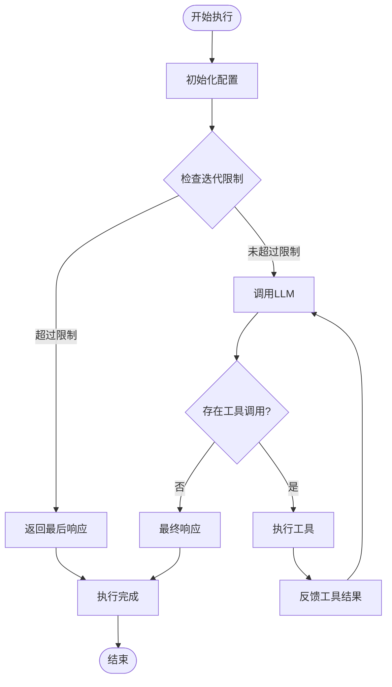

**图表来源**
- [agentic_loop.rs:263-314](file://macaca/crates/macaca-runtime/src/agentic_loop.rs#L263-L314)

#### 配置选项
- **最大迭代次数**: 默认 25 次，防止无限循环
- **工具超时时间**: 默认 60 秒，确保系统稳定性
- **事件回调**: 可选的执行事件通知机制

**章节来源**
- [agentic_loop.rs:22-38](file://macaca/crates/macaca-runtime/src/agentic_loop.rs#L22-L38)
- [agentic_loop.rs:233-404](file://macaca/crates/macaca-runtime/src/agentic_loop.rs#L233-L404)

### 上下文窗口管理器 (ContextWindowManager)

上下文窗口管理器负责智能体对话历史的内存管理和优化，确保 LLM 能够有效处理长对话而不会超出上下文限制。

#### 核心算法
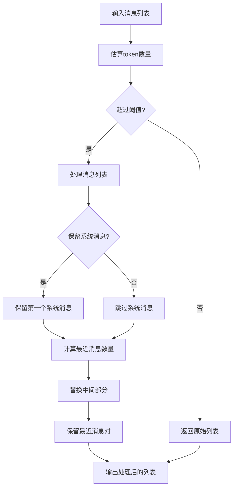

**图表来源**
- [context_window.rs:75-122](file://macaca/crates/macaca-runtime/src/context_window.rs#L75-L122)

#### 令牌估算策略
- **ASCII 文本**: 约 4 个字符 = 1 个 token
- **CJK 文本**: 约 1.5 个字符 = 1 个 token
- **元数据开销**: 每条消息额外 +4 个 token

#### 配置参数
- **最大令牌数**: 默认 120,000 个 token
- **修剪阈值**: 默认 80% (0.8)
- **保留最近消息**: 默认 5 对消息

**章节来源**
- [context_window.rs:8-27](file://macaca/crates/macaca-runtime/src/context_window.rs#L8-L27)
- [context_window.rs:39-65](file://macaca/crates/macaca-runtime/src/context_window.rs#L39-L65)

### 循环检测器 (LoopDetector)

循环检测器通过分析工具调用的模式来识别潜在的无限循环，提供多级的安全防护机制。

#### 检测算法
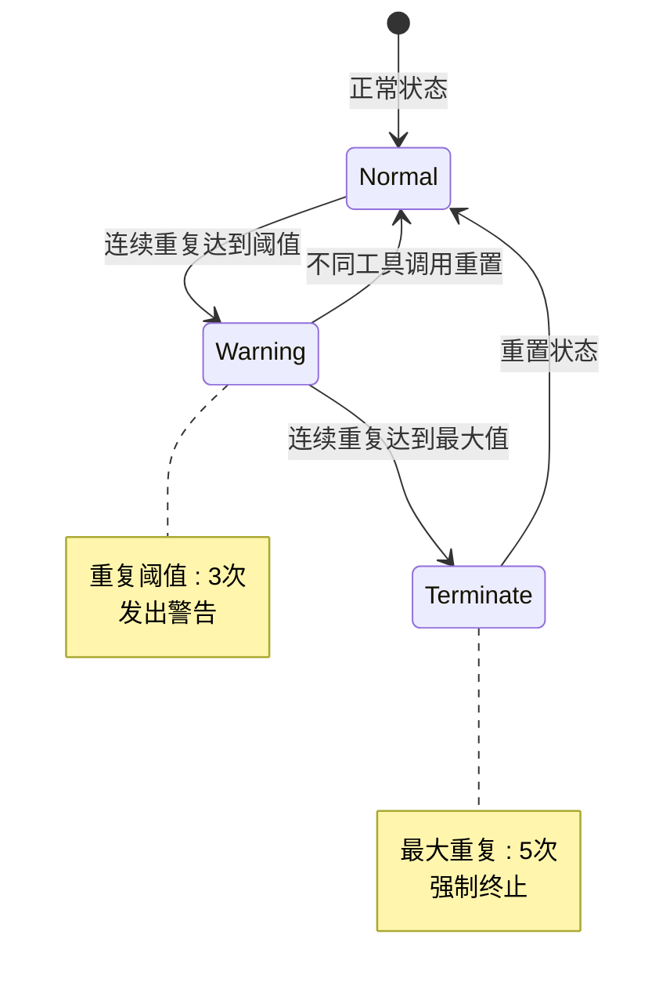

**图表来源**
- [loop_detector.rs:65-93](file://macaca/crates/macaca-runtime/src/loop_detector.rs#L65-L93)

#### 安全机制
- **滑动窗口**: 维护最近 10 次调用的哈希值
- **连续计数**: 跟踪相同调用的连续出现次数
- **SHA-256 哈希**: 对工具名和参数进行加密哈希
- **分级响应**: 从警告到强制终止的渐进式安全措施

**章节来源**
- [loop_detector.rs:9-28](file://macaca/crates/macaca-runtime/src/loop_detector.rs#L9-L28)
- [loop_detector.rs:61-109](file://macaca/crates/macaca-runtime/src/loop_detector.rs#L61-L109)

### 权限检查器 (PermissionChecker)

权限检查器确保智能体只能执行被授权的操作，特别是在文件系统和网络访问方面提供严格的安全控制。

#### 权限类型
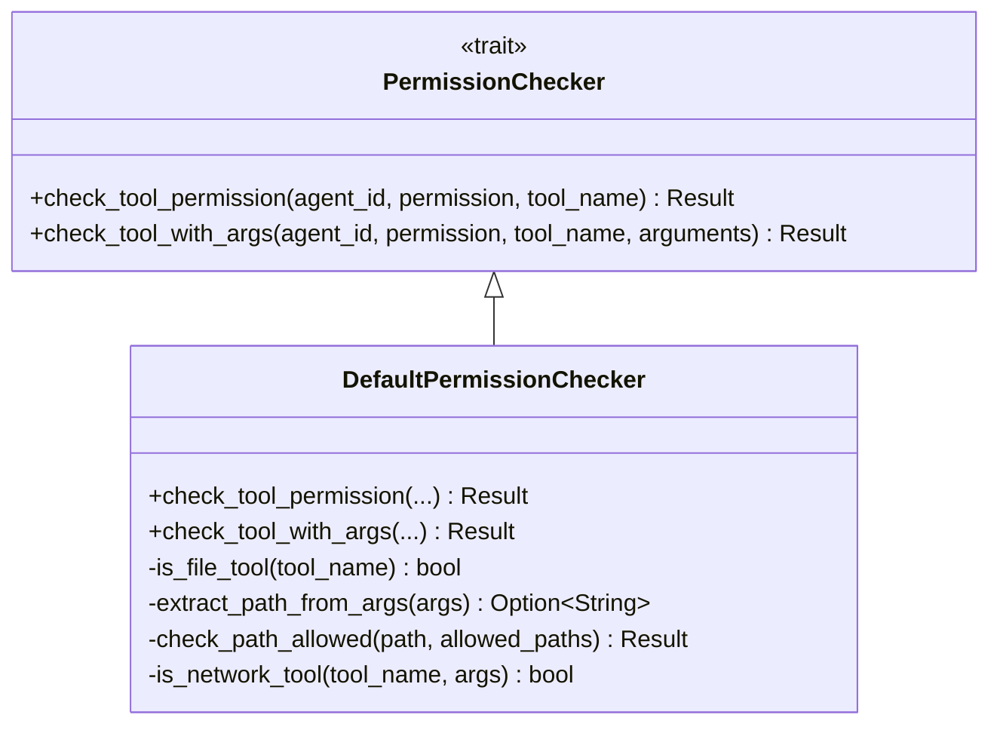

**图表来源**
- [permission.rs:6-31](file://macaca/crates/macaca-runtime/src/permission.rs#L6-L31)
- [permission.rs:37-91](file://macaca/crates/macaca-runtime/src/permission.rs#L37-L91)

#### 文件系统权限
- **允许的工具**: file_read, file_write, read_file, write_file, file_edit, file_append, list_directory
- **路径前缀匹配**: 使用严格的前缀匹配确保路径安全
- **空路径列表**: 允许所有路径访问（开放策略）

#### 网络访问控制
- **网络工具识别**: http_request, fetch, web_search
- **Shell 命令分析**: 检测 curl, wget, ssh, scp, rsync 等命令
- **动态权限检查**: 基于命令内容的实时网络访问判断

**章节来源**
- [permission.rs:93-161](file://macaca/crates/macaca-runtime/src/permission.rs#L93-L161)
- [permission.rs:163-325](file://macaca/crates/macaca-runtime/src/permission.rs#L163-L325)

### MCP 运行时管理器 (McpRuntimeManager)

**新增** MCP 运行时管理器是运行时主机层的核心组件，负责管理 MCP 服务器的完整生命周期。它提供了 OS 级别的 MCP 注册表和运行时管理功能。

#### 生命周期管理
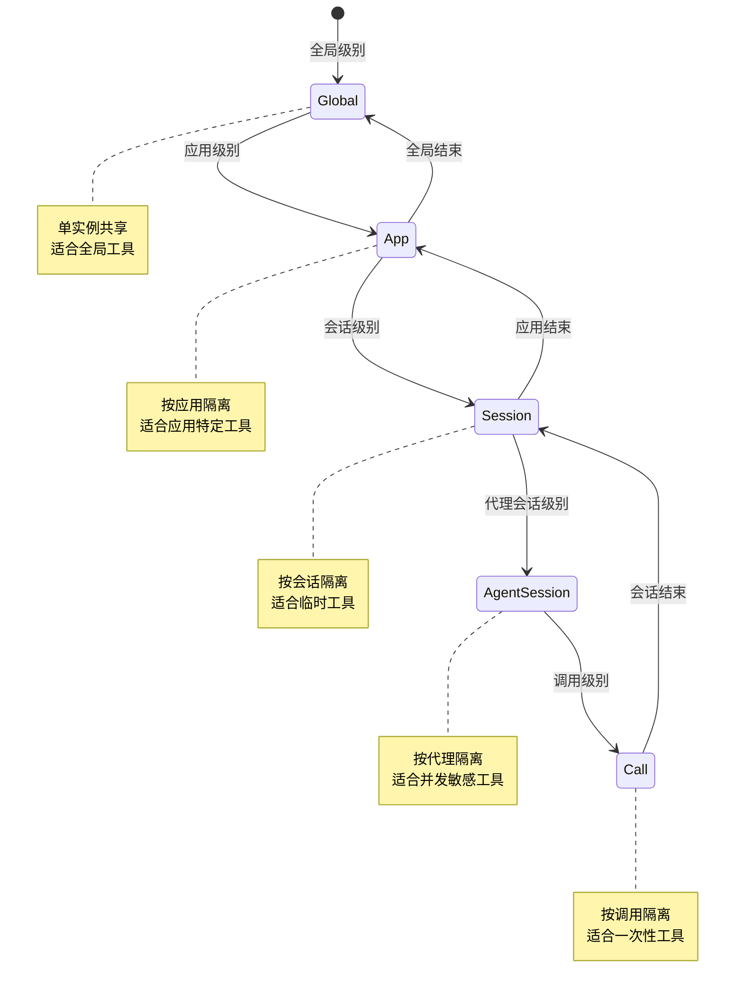

**图表来源**
- [mcp_runtime.rs:31-46](file://macaca/crates/macaca-runtime-host/src/mcp_runtime.rs#L31-L46)
- [mcp_runtime.rs:795-836](file://macaca/crates/macaca-runtime-host/src/mcp_runtime.rs#L795-L836)

#### 核心功能
- **服务器定义管理**: 管理 MCP 服务器的配置和状态
- **工具注册**: 将 MCP 工具注册到框架工具包中
- **生命周期跟踪**: 跟踪运行时实例的引用计数和状态
- **资源清理**: 提供会话、应用和全局级别的资源清理
- **状态监控**: 提供 MCP 服务器的健康状态监控

#### 配置选项
- **传输配置**: 支持 stdio、SSE 和 streamable HTTP 传输
- **会话模式**: 支持有状态和无状态会话模式
- **工具前缀**: 支持工具名称冲突解决策略
- **必需二进制**: 检查 MCP 服务器的依赖项

**章节来源**
- [mcp_runtime.rs:284-289](file://macaca/crates/macaca-runtime-host/src/mcp_runtime.rs#L284-L289)
- [mcp_runtime.rs:335-377](file://macaca/crates/macaca-runtime-host/src/mcp_runtime.rs#L335-L377)
- [mcp_runtime.rs:416-454](file://macaca/crates/macaca-runtime-host/src/mcp_runtime.rs#L416-L454)

### 兼容性注册表 (CompatRegistry)

**新增** 兼容性注册表提供声明式的技能到 MCP 服务器映射功能，消除了硬编码的产品特定分支逻辑。它支持从技能安装规范到 MCP 服务器定义的自动映射。

#### 映射机制
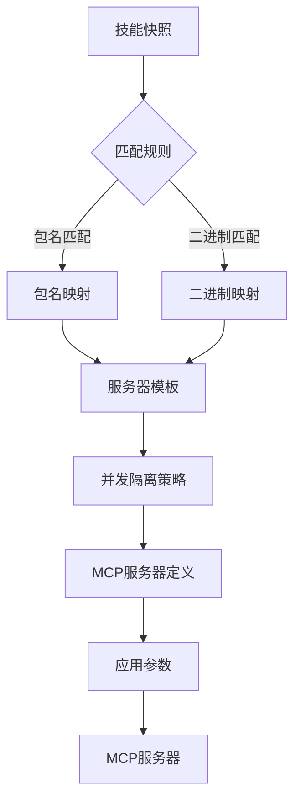

**图表来源**
- [compat.rs:146-150](file://macaca/crates/macaca-runtime-host/src/compat.rs#L146-L150)
- [compat.rs:179-212](file://macaca/crates/macaca-runtime-host/src/compat.rs#L179-L212)

#### 配置格式
- **包名匹配**: 支配 `install.package` 字段的匹配
- **二进制匹配**: 支配 `install.bins` 字段的匹配
- **服务器模板**: 定义生成的 MCP 服务器配置
- **并发隔离**: 定义命令行参数的安全策略

#### 内置映射
- **Playwright**: 自动映射到 `playwright-mcp` 服务器
- **Figma**: 自动映射到 `figma-developer-mcp` 服务器
- **可扩展性**: 支持用户自定义映射覆盖

**章节来源**
- [compat.rs:100-104](file://macaca/crates/macaca-runtime-host/src/compat.rs#L100-L104)
- [compat.rs:146-150](file://macaca/crates/macaca-runtime-host/src/compat.rs#L146-L150)
- [compat_mappings.toml:43-75](file://macaca/crates/macaca-runtime-host/resources/compat_mappings.toml#L43-L75)

### 环境桥接器 (EnvBridge)

**新增** 环境桥接器负责将配置中的 MCP 环境变量安全地传递到 MCP 子进程中，支持多种语义和安全检查机制。

#### 环境变量处理
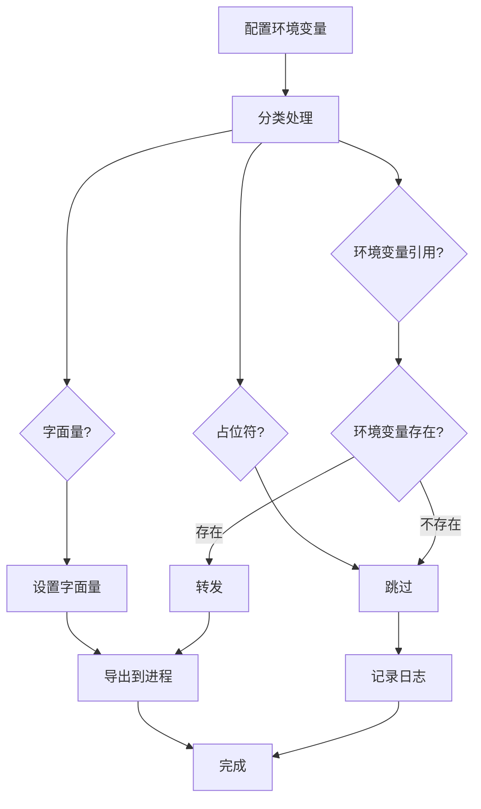

**图表来源**
- [env_bridge.rs:57-74](file://macaca/crates/macaca-runtime-host/src/env_bridge.rs#L57-L74)
- [env_bridge.rs:86-127](file://macaca/crates/macaca-runtime-host/src/env_bridge.rs#L86-L127)

#### 处理语义
- **字面量值**: 直接设置为环境变量值
- **环境变量转发**: 从现有环境变量转发值
- **占位符检测**: 自动跳过占位符值（如 YOUR_TOKEN）
- **空值处理**: 忽略空值和空白值

#### 安全特性
- **POSIX 兼容**: 自动将键名转换为大写
- **占位符保护**: 防止占位符意外覆盖真实环境变量
- **缺失检查**: 检测并报告缺失的环境变量引用
- **审计日志**: 记录所有环境变量的应用结果

**章节来源**
- [env_bridge.rs:27-40](file://macaca/crates/macaca-runtime-host/src/env_bridge.rs#L27-L40)
- [env_bridge.rs:86-127](file://macaca/crates/macaca-runtime-host/src/env_bridge.rs#L86-L127)

### 智能体生命周期管理

运行时系统还提供了完整的智能体生命周期管理功能，确保智能体能够正确地创建、运行、暂停和终止。

#### 状态转换图
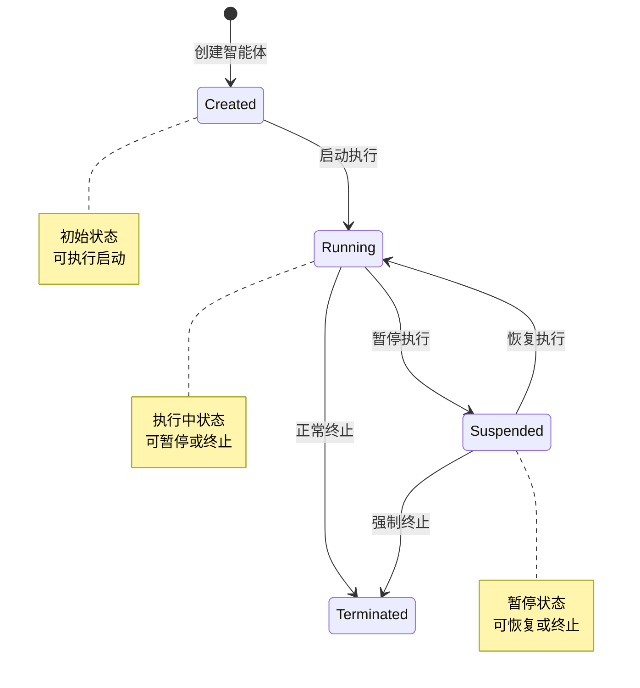

**图表来源**
- [state_machine.rs:7-14](file://macaca/crates/macaca-agent/src/state_machine.rs#L7-L14)

#### 关键特性
- **状态验证**: 确保每次状态转换都是有效的
- **错误处理**: 对无效状态转换抛出明确的错误信息
- **线程安全**: 支持并发的状态管理操作

**章节来源**
- [state_machine.rs:19-52](file://macaca/crates/macaca-agent/src/state_machine.rs#L19-L52)

### 优雅关闭支持

运行时系统提供了跨平台的优雅关闭机制，支持 SIGTERM 和 SIGINT 信号的处理。

#### 关闭流程
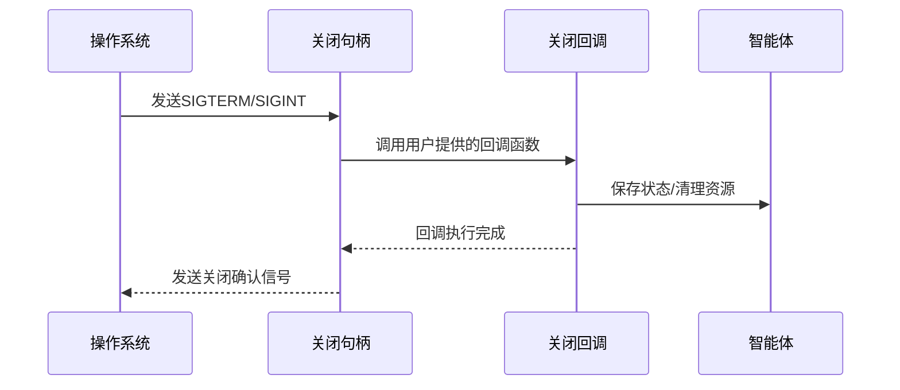

**图表来源**
- [shutdown.rs:26-48](file://macaca/crates/macaca-agent/src/shutdown.rs#L26-L48)

**章节来源**
- [shutdown.rs:19-49](file://macaca/crates/macaca-agent/src/shutdown.rs#L19-L49)

## 依赖关系分析

运行时系统通过清晰的依赖关系设计，实现了模块间的松耦合和高内聚。新增的 macaca-runtime-host 层提供了 MCP 运行时管理能力，与现有组件形成良好的协作关系。

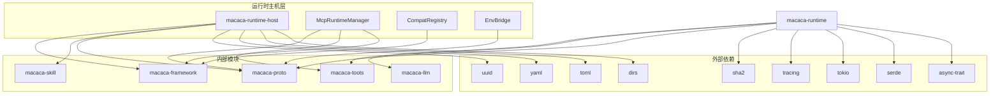

**图表来源**
- [Cargo.toml:6-15](file://macaca/crates/macaca-runtime/Cargo.toml#L6-L15)
- [Cargo.toml:7-19](file://macaca/crates/macaca-runtime-host/Cargo.toml#L7-L19)

### 核心依赖说明

#### 外部依赖
- **async-trait**: 提供异步 trait 的宏展开支持
- **serde**: 实现 JSON 序列化和反序列化
- **tokio**: 异步运行时和并发工具
- **tracing**: 结构化日志记录和指标收集
- **sha2**: 加密哈希算法用于循环检测
- **dirs**: 用户目录定位
- **toml/yaml**: 配置文件解析
- **uuid**: 测试和唯一标识符生成

#### 内部模块依赖
- **macaca-proto**: 定义核心数据结构和类型
- **macaca-tools**: 提供工具注册和执行接口
- **macaca-llm**: 抽象 LLM 提供者接口
- **macaca-skill**: 提供技能发现和管理功能
- **macaca-framework**: 提供 MCP 协议和工具包功能

#### 运行时主机依赖
- **macaca-runtime-host**: 提供 MCP 运行时管理能力
- **macaca-framework**: 提供 MCP 协议实现
- **macaca-skill**: 提供技能元数据

**章节来源**
- [Cargo.toml:1-17](file://macaca/crates/macaca-runtime/Cargo.toml#L1-L17)
- [Cargo.toml:7-19](file://macaca/crates/macaca-runtime-host/Cargo.toml#L7-L19)

## 性能考虑

运行时系统在设计时充分考虑了性能优化，采用了多种策略来确保高效的执行和资源利用。

### 内存管理优化
- **上下文修剪**: 自动管理对话历史的内存使用
- **令牌估算**: 高效的内存占用预估算法
- **滑动窗口**: 限制循环检测器的内存占用
- **运行时实例缓存**: MCP 运行时实例的引用计数管理

### 并发执行优化
- **异步执行**: 所有 I/O 操作都支持异步非阻塞
- **超时控制**: 防止长时间阻塞影响整体性能
- **事件驱动**: 减少轮询开销，提高响应速度
- **并发隔离**: MCP 服务器的并发安全策略

### 安全性与性能平衡
- **权限缓存**: 减少重复的权限检查开销
- **哈希缓存**: 循环检测中的哈希值缓存
- **配置优化**: 可调参数平衡安全性和性能
- **资源池**: MCP 服务器连接的复用和管理

### MCP 运行时性能
- **生命周期管理**: 按需创建和销毁 MCP 服务器实例
- **状态监控**: 实时监控 MCP 服务器的健康状态
- **资源清理**: 自动清理闲置的 MCP 服务器实例
- **并发控制**: 通过生命周期作用域控制并发访问

## 故障排除指南

### 常见问题诊断

#### 执行循环超时
**症状**: 智能体在固定时间内无法完成执行
**解决方案**: 
- 检查工具执行时间是否过长
- 调整 `tool_timeout` 配置
- 分析工具执行的具体步骤

#### 上下文溢出错误
**症状**: LLM 返回上下文过长错误
**解决方案**:
- 检查 `max_tokens` 配置
- 分析对话历史的长度和复杂度
- 考虑手动清理不必要的历史记录

#### 权限拒绝错误
**症状**: 工具执行被拒绝
**解决方案**:
- 检查 `allowed_tools` 配置
- 验证文件路径是否在允许范围内
- 确认网络访问权限设置

#### 循环检测触发
**症状**: 执行被强制终止
**解决方案**:
- 分析工具调用模式
- 检查是否存在逻辑错误
- 调整循环检测阈值

#### MCP 服务器连接失败
**症状**: MCP 工具无法注册或调用
**解决方案**:
- 检查 MCP 服务器配置和传输设置
- 验证必需二进制文件的存在
- 确认环境变量已正确传递
- 查看 MCP 服务器的日志输出

#### 兼容性映射失效
**症状**: 技能无法正确映射到 MCP 服务器
**解决方案**:
- 检查技能的安装规范
- 验证兼容性映射配置
- 确认命令行参数的安全策略
- 查看兼容性注册表的日志

**章节来源**
- [agentic_loop.rs:484-501](file://macaca/crates/macaca-runtime/src/agentic_loop.rs#L484-L501)
- [context_window.rs:75-122](file://macaca/crates/macaca-runtime/src/context_window.rs#L75-L122)
- [permission.rs:54-87](file://macaca/crates/macaca-runtime/src/permission.rs#L54-L87)
- [mcp_runtime.rs:555-616](file://macaca/crates/macaca-runtime-host/src/mcp_runtime.rs#L555-L616)
- [compat.rs:146-150](file://macaca/crates/macaca-runtime-host/src/compat.rs#L146-L150)

## 结论

运行时系统为 Agent OS 提供了强大而灵活的执行环境。通过模块化的架构设计和完善的错误处理机制，系统能够可靠地管理各种类型的智能体执行任务。

**更新** 新的 macaca-runtime-host 架构显著提升了系统的可扩展性和维护性。通过将 MCP 运行时管理、兼容性映射和环境桥接功能集中在一个专门的 crate 中，系统实现了更好的职责分离和更低的耦合度。

### 主要优势
- **安全性**: 多层次的安全控制确保系统稳定运行
- **可扩展性**: 模块化设计支持功能扩展和定制
- **可观测性**: 丰富的事件和日志支持调试和监控
- **可靠性**: 完善的错误处理和恢复机制
- **可移植性**: MCP 运行时管理器可在不同主机类型间复用
- **声明式配置**: 兼容性映射支持声明式技能管理
- **环境安全**: 环境桥接器提供安全的环境变量传递

### 未来发展方向
- **性能优化**: 进一步优化内存使用和执行效率
- **监控增强**: 添加更详细的性能指标和监控功能
- **配置管理**: 提供更灵活的运行时配置选项
- **扩展接口**: 支持更多类型的工具和执行模式
- **MCP 协议完善**: 增强对更多传输协议的支持
- **并发控制**: 改进 MCP 服务器的并发访问控制
- **可观测性**: 增强 MCP 运行时的监控和调试能力

运行时系统为构建复杂的智能体应用奠定了坚实的基础，其设计理念和实现方式为类似系统的设计提供了宝贵的参考价值。新的架构进一步增强了系统的稳定性和可维护性，为未来的功能扩展提供了良好的基础。