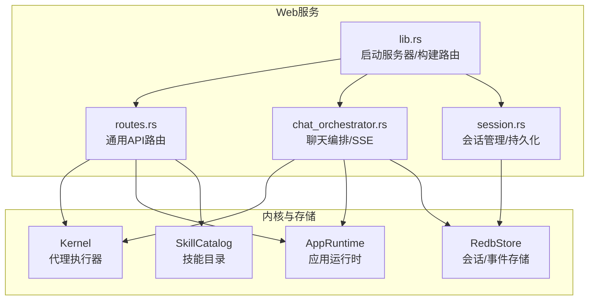
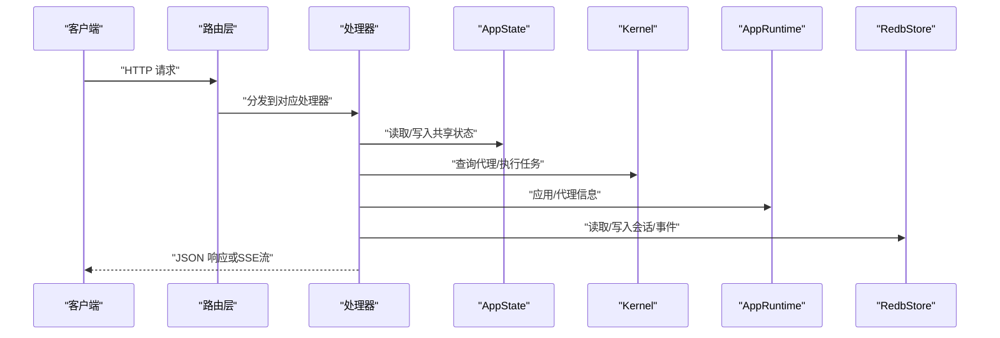
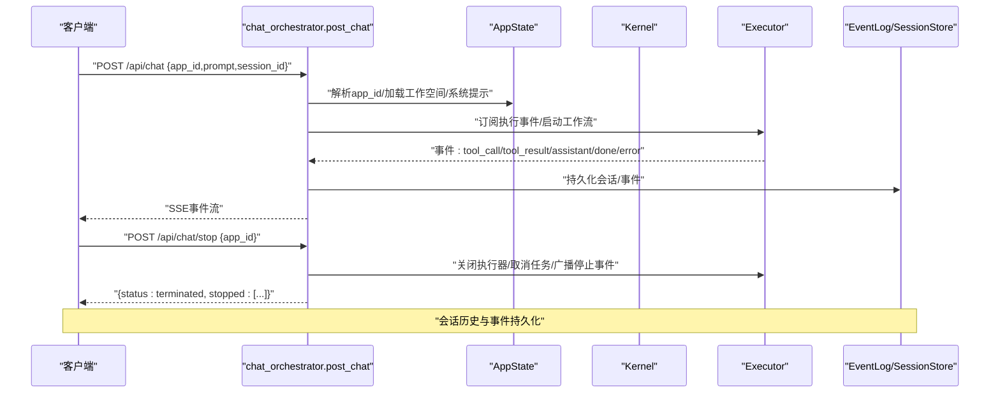
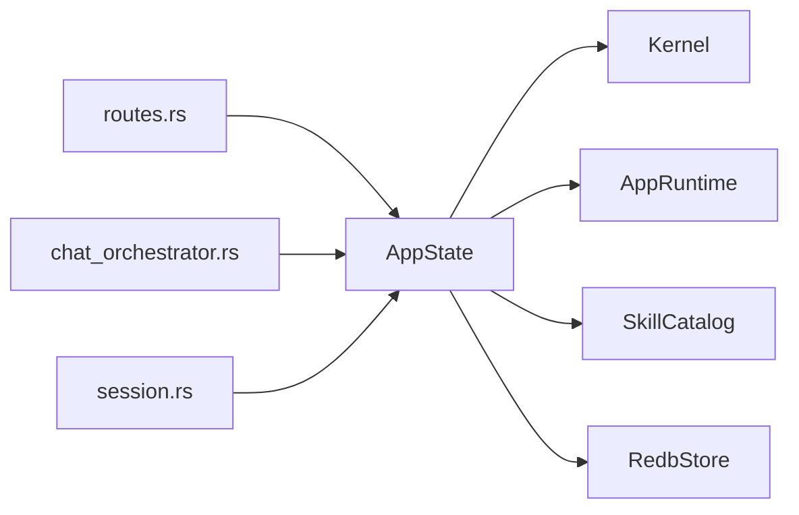

# REST API端点

<cite>
**本文档引用的文件**
- [routes.rs](file://macaca/crates/macaca-web/src/routes.rs)
- [lib.rs](file://macaca/crates/macaca-web/src/lib.rs)
- [chat_orchestrator.rs](file://macaca/crates/macaca-web/src/chat_orchestrator.rs)
- [session.rs](file://macaca/crates/macaca-web/src/session.rs)
- [Cargo.toml](file://macaca/Cargo.toml)
</cite>

## 目录
1. [简介](#简介)
2. [项目结构](#项目结构)
3. [核心组件](#核心组件)
4. [架构总览](#架构总览)
5. [详细组件分析](#详细组件分析)
6. [依赖关系分析](#依赖关系分析)
7. [性能考虑](#性能考虑)
8. [故障排除指南](#故障排除指南)
9. [结论](#结论)
10. [附录](#附录)

## 简介
本文件系统化梳理 Agent OS 的 REST API 端点设计与实现，覆盖应用程序管理、会话管理、聊天接口、技能查询等核心功能。文档面向开发者与集成者，提供端点规范、数据模型、错误处理、认证机制、版本控制策略与向后兼容性说明，并给出客户端 SDK 使用建议与最佳实践。

## 项目结构
- Web 服务由 macaca-web 提供，基于 axum 框架，统一注册路由并注入共享应用状态。
- 核心路由集中在 routes.rs；聊天编排逻辑在 chat_orchestrator.rs；会话持久化与 SSE 流在 session.rs。
- 客户端 SDK 位于 macaca-sdk，提供声明式代理注册与配置解析能力。

图表来源
- [lib.rs:608-646](file://macaca/crates/macaca-web/src/lib.rs#L608-L646)
- [routes.rs:11-100](file://macaca/crates/macaca-web/src/routes.rs#L11-L100)
- [chat_orchestrator.rs:1-120](file://macaca/crates/macaca-web/src/chat_orchestrator.rs#L1-L120)
- [session.rs:1-60](file://macaca/crates/macaca-web/src/session.rs#L1-L60)

章节来源
- [lib.rs:82-662](file://macaca/crates/macaca-web/src/lib.rs#L82-L662)
- [Cargo.toml:1-25](file://macaca/Cargo.toml#L1-L25)

## 核心组件
- 应用程序管理 API：列出应用、获取单个应用信息、获取应用代理列表、SSE 实时状态流、重载应用。
- 会话管理 API：列出会话、按应用筛选、获取会话详情、事件查询、运行轨迹查询、SSE 事件流。
- 聊天接口 API：POST /api/chat（SSE 流式对话）、POST /api/chat/stop（终止进程）、POST /api/chat/v2（预留）。
- 技能查询 API：GET /api/skills（列出知识技能）。
- 任务与计划 API：待办/目标查询、进度统计、计划任务的增删改查。
- 系统状态 API：GET /api/status（版本、代理数、应用数、LLM 提供商）。

章节来源
- [routes.rs:44-110](file://macaca/crates/macaca-web/src/routes.rs#L44-L110)
- [routes.rs:397-417](file://macaca/crates/macaca-web/src/routes.rs#L397-L417)
- [routes.rs:441-529](file://macaca/crates/macaca-web/src/routes.rs#L441-L529)
- [routes.rs:540-731](file://macaca/crates/macaca-web/src/routes.rs#L540-L731)
- [routes.rs:751-790](file://macaca/crates/macaca-web/src/routes.rs#L751-L790)
- [lib.rs:614-646](file://macaca/crates/macaca-web/src/lib.rs#L614-L646)

## 架构总览
- 路由层：集中定义所有 API 路由，绑定到具体处理器。
- 处理器层：封装业务逻辑，访问共享状态（AppState），调用内核、运行时、存储模块。
- 数据层：会话与事件持久化使用 RedbStore；技能目录来自 SkillCatalog；工具集动态组合。
- 流式输出：SSE 用于聊天流、代理状态流、会话事件流。

图表来源
- [lib.rs:608-646](file://macaca/crates/macaca-web/src/lib.rs#L608-L646)
- [routes.rs:11-110](file://macaca/crates/macaca-web/src/routes.rs#L11-L110)
- [session.rs:587-621](file://macaca/crates/macaca-web/src/session.rs#L587-L621)

## 详细组件分析

### 应用管理 API
- 列出应用
  - 方法与路径：GET /api/apps
  - 请求参数：无
  - 响应：数组，元素包含 id、name、status、agent_count、description、icon
  - 状态码：200 成功
  - 错误：内部错误返回 500
- 获取单个应用
  - 方法与路径：GET /api/apps/{id}
  - 路径参数：id（UUID）
  - 响应：单个应用信息对象
  - 状态码：200 成功；400 无效 id；404 应用不存在
- 获取应用代理
  - 方法与路径：GET /api/apps/{id}/agents
  - 响应：代理数组，含 id、name、state、activity、capabilities、is_active、current_task
  - 状态码：200 成功；400/404 错误
- 代理状态 SSE 流
  - 方法与路径：GET /api/apps/{id}/agents/stream
  - 响应：SSE 事件流，推送简化的代理状态（IDLE/WORKING/ERROR）
  - 状态码：200 成功；400 无效 id；404 应用不存在
- 重载应用
  - 方法与路径：POST /api/apps/reload
  - 响应：discovered_count、apps 数组
  - 状态码：200 成功；500 内部错误

章节来源
- [routes.rs:68-110](file://macaca/crates/macaca-web/src/routes.rs#L68-L110)
- [routes.rs:113-150](file://macaca/crates/macaca-web/src/routes.rs#L113-L150)
- [routes.rs:153-252](file://macaca/crates/macaca-web/src/routes.rs#L153-L252)
- [routes.rs:255-341](file://macaca/crates/macaca-web/src/routes.rs#L255-L341)
- [routes.rs:344-394](file://macaca/crates/macaca-web/src/routes.rs#L344-L394)

### 会话管理 API
- 列出所有会话
  - 方法与路径：GET /api/sessions
  - 查询参数：status（可选）
  - 响应：会话列表项数组（session_id、app_id、created_at、updated_at、message_count、title、status）
  - 状态码：200 成功；500 内部错误
- 列出某应用的会话
  - 方法与路径：GET /api/apps/{id}/sessions
  - 响应：同上，按应用过滤
  - 状态码：200 成功；500 内部错误
- 获取会话详情
  - 方法与路径：GET /api/sessions/detail/{session_id}
  - 响应：完整会话详情（包含 turns、plan_decisions、events_url、events_count 等）
  - 状态码：200 成功；404 未找到；500 内部错误
- 会话事件查询
  - 方法与路径：GET /api/sessions/{id}/events
  - 查询参数：since（起始序列号）、limit（数量限制）
  - 响应：events 数组、latest_seq
  - 状态码：200 成功；500 内部错误
- 运行轨迹查询
  - 方法与路径：GET /api/sessions/{id}/run-trace
  - 查询参数：since、limit（上限 2000）
  - 响应：events 数组（仅 run_trace 类型）、latest_seq
  - 状态码：200 成功；500 内部错误
- 会话事件 SSE 流
  - 方法与路径：GET /api/sessions/stream/{session_id}
  - 响应：SSE 事件流，持续推送事件
  - 状态码：200 成功；500 内部错误

章节来源
- [session.rs:562-667](file://macaca/crates/macaca-web/src/session.rs#L562-L667)
- [session.rs:669-731](file://macaca/crates/macaca-web/src/session.rs#L669-L731)
- [session.rs:733-790](file://macaca/crates/macaca-web/src/session.rs#L733-L790)
- [routes.rs:751-790](file://macaca/crates/macaca-web/src/routes.rs#L751-L790)

### 聊天接口 API
- 发送消息并流式返回
  - 方法与路径：POST /api/chat
  - 请求体：app_id、prompt、model（可选）、session_id（可选）、engine（可选）
  - 响应：SSE 事件流，事件类型包括 tool_call、tool_result、assistant、content、done、error
  - 状态码：200 成功；400 无效 app_id；404 应用不存在；500 内部错误
- 终止所有进程
  - 方法与路径：POST /api/chat/stop
  - 请求体：app_id
  - 响应：终止状态与被停止的部分（coordinator、executor、agent_status_reset、tasks_cancelled、plan_loop、worker_loops）
  - 状态码：200 成功；400 无效 app_id；500 内部错误
- v2 接口（预留）
  - 方法与路径：POST /api/chat/v2
  - 用途：后续演进版本，当前未实现

图表来源
- [chat_orchestrator.rs:268-274](file://macaca/crates/macaca-web/src/chat_orchestrator.rs#L268-L274)
- [chat_orchestrator.rs:150-256](file://macaca/crates/macaca-web/src/chat_orchestrator.rs#L150-L256)
- [session.rs:587-621](file://macaca/crates/macaca-web/src/session.rs#L587-L621)

章节来源
- [chat_orchestrator.rs:127-144](file://macaca/crates/macaca-web/src/chat_orchestrator.rs#L127-L144)
- [chat_orchestrator.rs:268-274](file://macaca/crates/macaca-web/src/chat_orchestrator.rs#L268-L274)
- [chat_orchestrator.rs:150-256](file://macaca/crates/macaca-web/src/chat_orchestrator.rs#L150-L256)

### 技能查询 API
- 列出知识技能
  - 方法与路径：GET /api/skills
  - 响应：数组，元素包含 name、description
  - 状态码：200 成功

章节来源
- [routes.rs:397-417](file://macaca/crates/macaca-web/src/routes.rs#L397-L417)

### 任务与计划 API
- 待办查询
  - 方法与路径：GET /api/apps/{app_id}/todos
  - 查询参数：session_id（可选）
  - 响应：{ todos, count }
  - 状态码：200 成功；400 无效 app_id；500 内部错误
- 待办诊断（Claim 问题）
  - 方法与路径：GET /api/apps/{app_id}/todos/claim-diagnostics
  - 查询参数：session_id（必需）
  - 响应：诊断结果
  - 状态码：200 成功；400 缺少 session_id；500 内部错误
- 待办进度
  - 方法与路径：GET /api/apps/{app_id}/todos/progress
  - 查询参数：session_id（可选）
  - 响应：各类状态计数与 all_done 标记
  - 状态码：200 成功；400 无效 app_id；500 内部错误
- 指定代理的待办板
  - 方法与路径：GET /api/apps/{app_id}/todos/{agent_name}
  - 响应：{ agent, todos, count }
  - 状态码：200 成功；400 无效 app_id；500 内部错误
- 目标查询
  - 方法与路径：GET /api/apps/{app_id}/goals
  - 查询参数：session_id（可选）
  - 响应：{ goals, count }
  - 状态码：200 成功；400 无效 app_id；500 内部错误
- 计划任务
  - 列表：GET /api/apps/{app_id}/schedules
  - 创建：POST /api/apps/{app_id}/schedules（支持 cron_expr 或 interval_secs，action 为 JSON 对象）
  - 获取：GET /api/apps/{app_id}/schedules/{id}
  - 删除：DELETE /api/apps/{app_id}/schedules/{id}
  - 切换启用：PUT /api/apps/{app_id}/schedules/{id}/toggle（body: { enabled: bool }）

章节来源
- [routes.rs:441-529](file://macaca/crates/macaca-web/src/routes.rs#L441-L529)
- [routes.rs:540-731](file://macaca/crates/macaca-web/src/routes.rs#L540-L731)

### 系统状态 API
- 系统状态
  - 方法与路径：GET /api/status
  - 响应：version、agent_count、app_count、llm_provider
  - 状态码：200 成功

章节来源
- [routes.rs:44-65](file://macaca/crates/macaca-web/src/routes.rs#L44-L65)

## 依赖关系分析
- 路由注册集中在 lib.rs 的 Router 构建阶段，统一挂载所有端点。
- 各处理器通过 State 访问 Kernel、AppRuntime、SkillCatalog、RedbStore 等组件。
- SSE 流式输出依赖 tokio mpsc 通道与 axum Sse，确保断线重连恢复。

图表来源
- [lib.rs:608-646](file://macaca/crates/macaca-web/src/lib.rs#L608-L646)
- [routes.rs:11-110](file://macaca/crates/macaca-web/src/routes.rs#L11-L110)

章节来源
- [lib.rs:608-646](file://macaca/crates/macaca-web/src/lib.rs#L608-L646)

## 性能考虑
- SSE 流采用固定周期轮询更新（代理状态流每 500ms），可根据前端需求调整频率以平衡实时性与带宽。
- 事件查询支持 since/limit 参数，避免一次性拉取大量数据；run-trace 查询对上限进行限制（最多 2000）。
- 会话快照保存采用按会话粒度的互斥锁，避免并发写入导致的数据竞争。
- LLM 调用具备重试与速率限制包装，减少上游异常对系统的影响。

## 故障排除指南
- 常见错误响应
  - 400：无效参数（如无效的 UUID、缺少必需字段）
  - 404：资源不存在（应用、会话、计划等）
  - 500：内部错误（存储失败、解析错误、执行器异常）
- LLM 错误诊断
  - 网络错误：检查网络连通性、代理设置、API 可达性
  - 认证错误：检查 API Key 配置
  - 限流：等待后重试或降低请求频率
  - 超时：检查网络延迟或切换更快模型
- 终止流程
  - /api/chat/stop 会设置取消标志、关闭执行器、重置代理活动、取消非终态任务，并广播停止事件

章节来源
- [routes.rs:33-35](file://macaca/crates/macaca-web/src/routes.rs#L33-L35)
- [chat_orchestrator.rs:38-103](file://macaca/crates/macaca-web/src/chat_orchestrator.rs#L38-L103)
- [chat_orchestrator.rs:150-256](file://macaca/crates/macaca-web/src/chat_orchestrator.rs#L150-L256)

## 结论
本 REST API 体系围绕应用、会话、聊天与技能四大领域构建，采用 SSE 实现实时交互，结合持久化存储保障会话与事件可追溯。路由层清晰分离，处理器通过共享状态解耦内核与存储，具备良好的扩展性与稳定性。未来可通过版本化端点与向后兼容策略进一步增强生态演进能力。

## 附录

### 认证机制
- 当前实现未内置认证中间件，CORS 已开启允许任意来源。生产环境建议在网关层或反向代理处增加鉴权与速率限制。

章节来源
- [lib.rs:609-612](file://macaca/crates/macaca-web/src/lib.rs#L609-L612)

### API 版本控制与向后兼容
- 当前路由未显式携带版本号（如 /v1/）。若需演进，建议：
  - 新增版本前缀（/v2/...），保持旧版本一段时间以保证兼容
  - 对破坏性变更提供迁移指引与降级策略
  - 通过 Content-Type 或 Accept 头部区分版本（如 application/vnd.macaca.v2+json）

### 客户端 SDK 使用示例与最佳实践
- SDK 能力
  - 声明式代理配置与注册（YAML/TOML）
  - Fluent 构建器与注册辅助函数
- 最佳实践
  - 在应用启动时加载技能目录与工具集，确保代理可用能力完整
  - 使用 session_id 进行会话续接，避免丢失上下文
  - 对 SSE 流进行断线重连与缓冲处理
  - 对 LLM 调用进行重试与超时控制，合理设置速率限制

章节来源
- [lib.rs:187-221](file://macaca/crates/macaca-web/src/lib.rs#L187-L221)
- [lib.rs:250-336](file://macaca/crates/macaca-web/src/lib.rs#L250-L336)
- [lib.rs:338-448](file://macaca/crates/macaca-web/src/lib.rs#L338-L448)
- [lib.rs:608-646](file://macaca/crates/macaca-web/src/lib.rs#L608-L646)