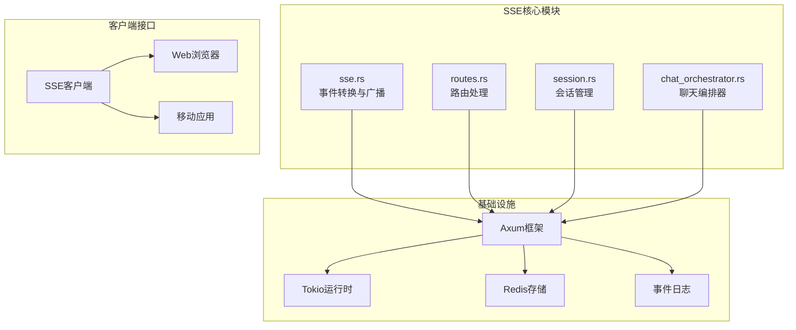
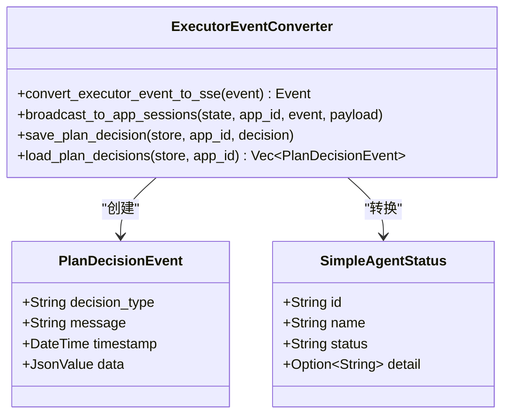
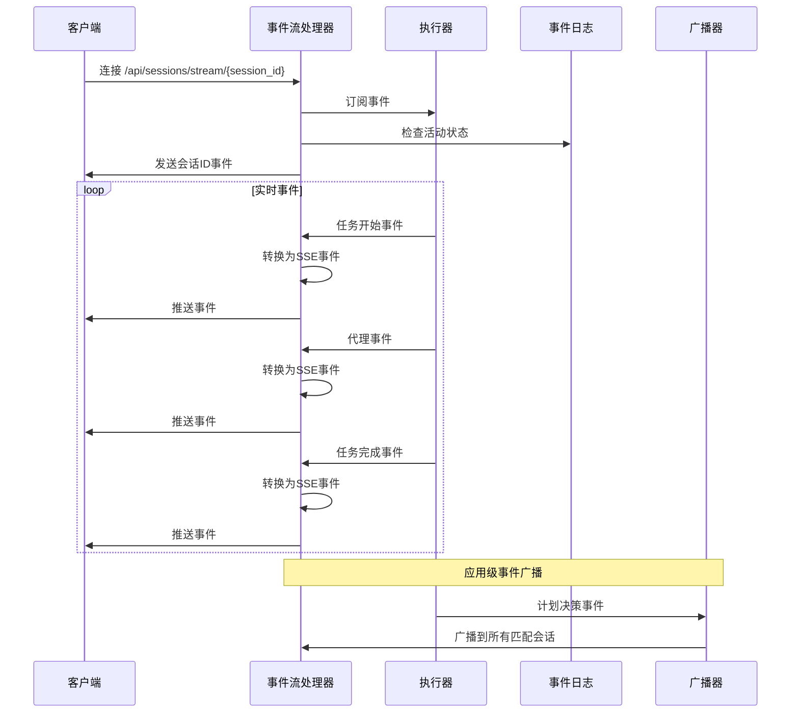
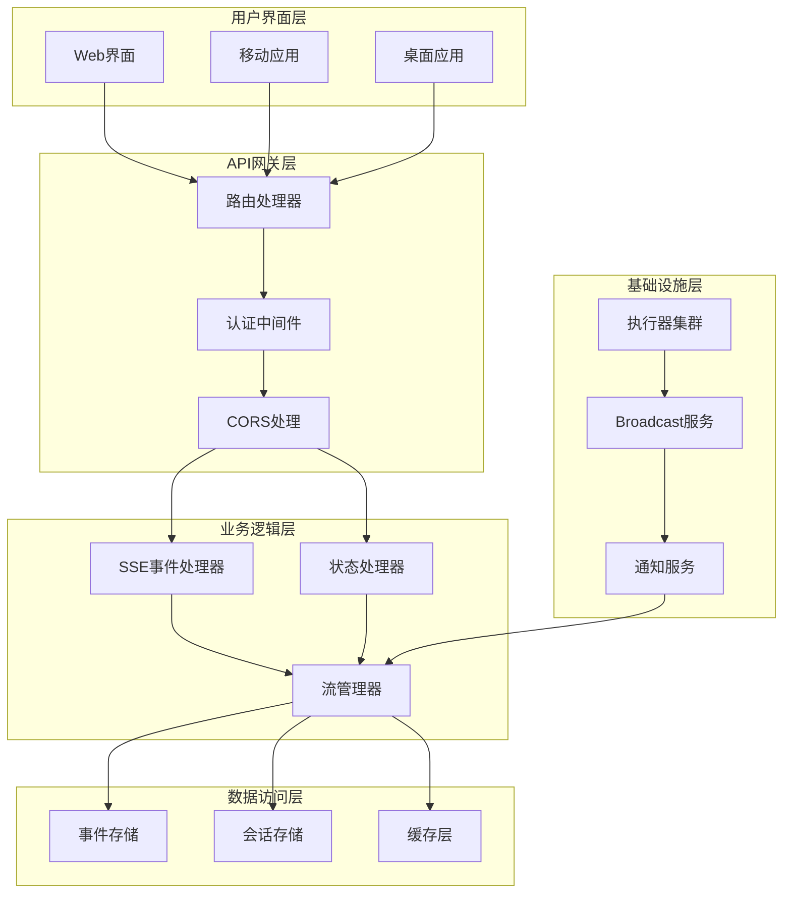
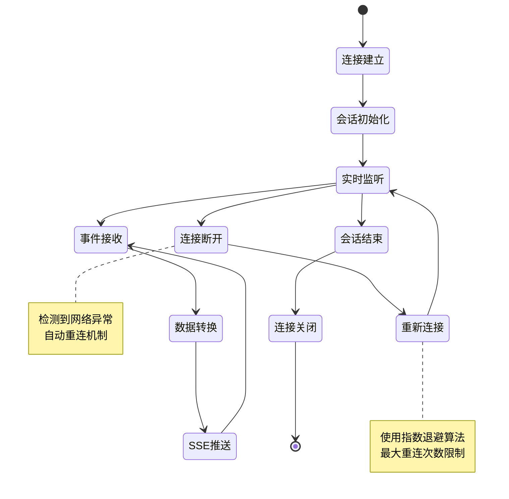
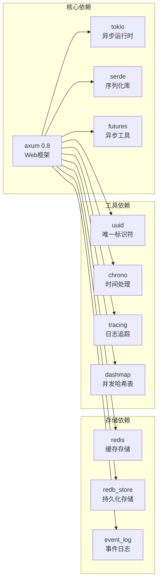
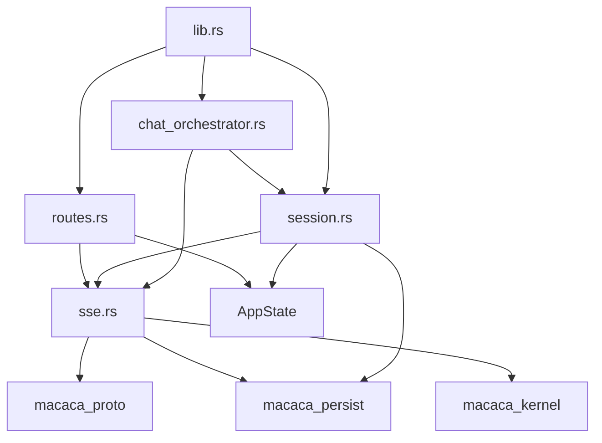

# SSE流式响应

<cite>
**本文档引用的文件**
- [sse.rs](file://macaca/crates/macaca-web/src/sse.rs)
- [routes.rs](file://macaca/crates/macaca-web/src/routes.rs)
- [session.rs](file://macaca/crates/macaca-web/src/session.rs)
- [chat_orchestrator.rs](file://macaca/crates/macaca-web/src/chat_orchestrator.rs)
- [lib.rs](file://macaca/crates/macaca-web/src/lib.rs)
- [Cargo.toml](file://macaca/crates/macaca-web/Cargo.toml)
</cite>

## 目录
1. [简介](#简介)
2. [项目结构](#项目结构)
3. [核心组件](#核心组件)
4. [架构概览](#架构概览)
5. [详细组件分析](#详细组件分析)
6. [依赖关系分析](#依赖关系分析)
7. [性能考虑](#性能考虑)
8. [故障排除指南](#故障排除指南)
9. [结论](#结论)

## 简介

本文档深入解析了Agent OS中基于Server-Sent Events (SSE) 的实时流式响应系统。该系统实现了完整的SSE协议栈，支持会话事件流和代理状态流等多种实时通信场景。

SSE（Server-Sent Events）是一种允许服务器向客户端推送实时更新的技术，特别适用于单向数据流场景。在Agent OS中，SSE被广泛应用于实时状态监控、任务执行跟踪、代理状态更新等场景。

## 项目结构

Agent OS的SSE实现主要集中在`macaca-web` crate中，采用模块化设计：



**图表来源**
- [lib.rs:614-646](file://macaca/crates/macaca-web/src/lib.rs#L614-L646)
- [Cargo.toml:6-34](file://macaca/crates/macaca-web/Cargo.toml#L6-L34)

**章节来源**
- [lib.rs:614-646](file://macaca/crates/macaca-web/src/lib.rs#L614-L646)
- [Cargo.toml:6-34](file://macaca/crates/macaca-web/Cargo.toml#L6-L34)

## 核心组件

### SSE事件转换器

SSE事件转换器负责将内部事件转换为标准的SSE格式，支持多种事件类型：



**图表来源**
- [sse.rs:19-55](file://macaca/crates/macaca-web/src/sse.rs#L19-L55)
- [routes.rs:258-265](file://macaca/crates/macaca-web/src/routes.rs#L258-L265)

### 会话事件流处理器

会话事件流处理器提供实时的会话状态更新：



**图表来源**
- [session.rs:930-1014](file://macaca/crates/macaca-web/src/session.rs#L930-L1014)
- [sse.rs:212-245](file://macaca/crates/macaca-web/src/sse.rs#L212-L245)

**章节来源**
- [sse.rs:57-202](file://macaca/crates/macaca-web/src/sse.rs#L57-L202)
- [session.rs:930-1014](file://macaca/crates/macaca-web/src/session.rs#L930-L1014)

## 架构概览

Agent OS的SSE架构采用了分层设计，确保高可用性和可扩展性：



**图表来源**
- [lib.rs:614-646](file://macaca/crates/macaca-web/src/lib.rs#L614-L646)
- [routes.rs:14-25](file://macaca/crates/macaca-web/src/routes.rs#L14-L25)

## 详细组件分析

### 事件类型定义

Agent OS定义了丰富的事件类型来覆盖各种应用场景：

#### 代理执行事件
| 事件类型 | 描述 | 数据结构 | 使用场景 |
|---------|------|----------|----------|
| `delegated_task_start` | 任务开始 | `{task_id, agent, agent_tab}` | 任务启动监控 |
| `delegated_thinking` | 代理思考 | `{task_id, agent, event: AgentExecutionEvent}` | 思考过程追踪 |
| `delegated_tool_call` | 工具调用 | `{task_id, agent, tool_name, tool_input}` | 工具使用记录 |
| `delegated_tool_result` | 工具结果 | `{task_id, agent, tool_name, output, is_error}` | 结果验证 |
| `delegated_assistant` | 助手回复 | `{task_id, agent, content}` | 对话内容 |
| `delegated_completed` | 任务完成 | `{task_id, success, output}` | 任务结束 |
| `delegated_task_error` | 任务错误 | `{task_id, error}` | 错误处理 |
| `delegated_task_cancelled` | 任务取消 | `{task_id}` | 取消处理 |
| `delegated_task_progress` | 任务进度 | `{task_id, step, output}` | 进度监控 |

#### 协调器事件
| 事件类型 | 描述 | 数据结构 | 使用场景 |
|---------|------|----------|----------|
| `hook_delegate_completed` | 委托完成 | `{fork_id, task_id, success, output}` | 分支合并 |
| `hook_delegate_failed` | 委托失败 | `{fork_id, task_id, error}` | 失败处理 |
| `hook_fork_validated` | 分支验证 | `{fork_id, result}` | 验证结果 |
| `hook_fork_merged` | 分支合并 | `{fork_id}` | 合并确认 |
| `hook_fork_created` | 分支创建 | `{fork_id, application_id, agent_name}` | 新分支 |
| `hook_fork_waiting` | 分支等待 | `{fork_id, delegate_task_id}` | 等待状态 |
| `hook_fork_resumed` | 分支恢复 | `{fork_id, task_id, success}` | 恢复状态 |

#### 会话控制事件
| 事件类型 | 描述 | 数据结构 | 使用场景 |
|---------|------|----------|----------|
| `session_id` | 会话标识 | `{session_id}` | 连接确认 |
| `session_end` | 会话结束 | `{}` | 会话终止 |
| `executor_shutdown` | 执行器关闭 | `{}` | 系统关闭 |

**章节来源**
- [sse.rs:59-201](file://macaca/crates/macaca-web/src/sse.rs#L59-L201)

### 数据编码格式

SSE数据采用JSON格式进行编码，确保跨平台兼容性：

#### 标准事件格式
```json
{
  "event": "delegated_task_start",
  "data": "{\"task_id\":\"task-123\",\"agent\":\"backend\",\"agent_tab\":\"backend\"}",
  "retry": 2000
}
```

#### 错误事件格式
```json
{
  "event": "error",
  "data": "{\"error\":\"Invalid app_id\"}"
}
```

#### 心跳事件格式
```json
{
  "event": "heartbeat",
  "data": "{}"
}
```

### 客户端连接管理

系统实现了智能的连接管理机制：



**图表来源**
- [session.rs:952-963](file://macaca/crates/macaca-web/src/session.rs#L952-L963)

**章节来源**
- [session.rs:930-1014](file://macaca/crates/macaca-web/src/session.rs#L930-L1014)

### 关键流端点

#### 会话事件流 (`/api/sessions/stream/{session_id}`)
提供实时的会话状态更新，支持活动协调器的热交换功能。

#### 代理状态流 (`/api/apps/{id}/agents/stream`)
提供应用内所有代理的实时状态更新，包括工作状态、思考状态、错误状态等。

#### 计划决策流
通过应用级广播机制，向所有相关会话推送计划决策事件。

**章节来源**
- [routes.rs:254-341](file://macaca/crates/macaca-web/src/routes.rs#L254-L341)
- [session.rs:927-1014](file://macaca/crates/macaca-web/src/session.rs#L927-L1014)

## 依赖关系分析

### 外部依赖

Agent OS的SSE实现依赖于以下关键组件：



**图表来源**
- [Cargo.toml:21-34](file://macaca/crates/macaca-web/Cargo.toml#L21-L34)

### 内部模块依赖



**图表来源**
- [lib.rs:614-646](file://macaca/crates/macaca-web/src/lib.rs#L614-L646)
- [sse.rs:9-13](file://macaca/crates/macaca-web/src/sse.rs#L9-L13)

**章节来源**
- [Cargo.toml:6-34](file://macaca/crates/macaca-web/Cargo.toml#L6-L34)
- [lib.rs:614-646](file://macaca/crates/macaca-web/src/lib.rs#L614-L646)

## 性能考虑

### 连接池管理
系统采用连接池模式管理SSE连接，避免频繁的连接建立和销毁开销。

### 缓冲区优化
- 事件缓冲区大小：64个事件
- 广播通道容量：根据应用负载动态调整
- 内存使用监控：防止内存泄漏

### 压缩策略
对于大型事件数据，系统支持自动压缩以减少网络传输开销。

### 负载均衡
多实例部署时，通过Redis实现事件的分布式广播。

## 故障排除指南

### 常见问题及解决方案

#### 连接超时问题
**症状**：客户端无法建立SSE连接
**原因**：网络延迟或服务器过载
**解决方案**：
1. 检查服务器资源使用情况
2. 调整连接超时参数
3. 实施连接池管理

#### 事件丢失问题
**症状**：客户端接收不到某些事件
**原因**：网络中断或缓冲区溢出
**解决方案**：
1. 实现事件确认机制
2. 增加缓冲区容量
3. 启用事件持久化

#### 内存泄漏问题
**症状**：服务器内存持续增长
**原因**：未正确清理连接资源
**解决方案**：
1. 实施连接生命周期管理
2. 添加资源监控告警
3. 定期清理僵尸连接

### 调试工具

#### 日志级别设置
- INFO：正常操作日志
- DEBUG：详细事件跟踪
- WARN：潜在问题警告
- ERROR：严重错误报告

#### 性能监控指标
- 连接数统计
- 事件吞吐量
- 内存使用率
- CPU利用率

**章节来源**
- [session.rs:952-963](file://macaca/crates/macaca-web/src/session.rs#L952-L963)
- [sse.rs:212-245](file://macaca/crates/macaca-web/src/sse.rs#L212-L245)

## 结论

Agent OS的SSE流式响应系统提供了完整、可靠的实时通信解决方案。通过精心设计的架构和完善的错误处理机制，系统能够满足复杂应用场景下的实时数据传输需求。

### 主要优势
1. **高可靠性**：事件持久化确保数据不丢失
2. **高性能**：异步处理和连接池优化
3. **可扩展性**：模块化设计支持水平扩展
4. **易维护性**：清晰的代码结构和完善的文档

### 未来改进方向
1. **WebSocket支持**：扩展双向通信能力
2. **事件过滤**：支持客户端自定义事件过滤
3. **安全增强**：实施更严格的身份验证机制
4. **监控完善**：增加更多性能指标和告警机制

该SSE实现为Agent OS提供了强大的实时通信基础，为构建复杂的AI代理生态系统奠定了坚实的技术基础。