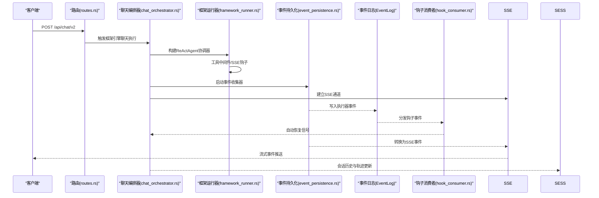
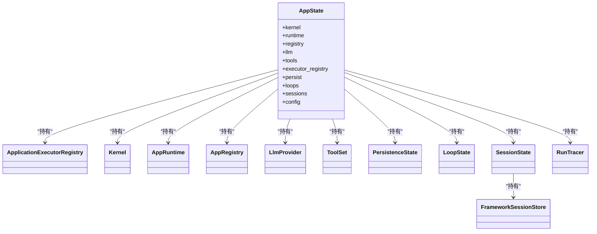

# Web服务层

<cite>
**本文档引用的文件**
- [lib.rs](file://macaca/crates/macaca-web/src/lib.rs)
- [routes.rs](file://macaca/crates/macaca-web/src/routes.rs)
- [sse.rs](file://macaca/crates/macaca-web/src/sse.rs)
- [session.rs](file://macaca/crates/macaca-web/src/session.rs)
- [chat_orchestrator.rs](file://macaca/crates/macaca-web/src/chat_orchestrator.rs)
- [event_persistence.rs](file://macaca/crates/macaca-web/src/event_persistence.rs)
- [state.rs](file://macaca/crates/macaca-web/src/state.rs)
- [agent_runner.rs](file://macaca/crates/macaca-web/src/agent_runner.rs)
- [loop_manager.rs](file://macaca/crates/macaca-web/src/loop_manager.rs)
- [workspace.rs](file://macaca/crates/macaca-web/src/workspace.rs)
- [run_trace.rs](file://macaca/crates/macaca-web/src/run_trace.rs)
- [framework_runner.rs](file://macaca/crates/macaca-web/src/framework_runner.rs)
- [framework_toolkit.rs](file://macaca/crates/macaca-web/src/framework_toolkit.rs)
- [hook_consumer.rs](file://macaca/crates/macaca-web/src/hook_consumer.rs)
</cite>

## 更新摘要
**所做更改**
- 新增框架运行器组件文档，包括 ReActAgent 构建器和工具中间件
- 更新会话管理章节，增加框架会话存储和执行上下文管理
- 新增运行追踪章节，详细说明跨组件运行状态监控
- 更新聊天编排器章节，增加框架引擎支持和暂停/恢复机制
- 新增钩子事件消费者章节，说明自动协调器通知系统
- 更新依赖关系分析，增加新组件之间的交互关系

## 目录
1. [简介](#简介)
2. [项目结构](#项目结构)
3. [核心组件](#核心组件)
4. [架构总览](#架构总览)
5. [详细组件分析](#详细组件分析)
6. [依赖关系分析](#依赖关系分析)
7. [性能考量](#性能考量)
8. [故障排查指南](#故障排查指南)
9. [结论](#结论)
10. [附录](#附录)

## 简介
本文件系统性梳理并文档化 Web 服务层，涵盖 REST API 设计与路由、SSE 实时事件流、会话管理、聊天编排器、事件持久化、计划与工作循环、运行追踪、工作空间权限等。文档同时提供 API 使用示例、错误处理策略、安全与性能优化建议，并给出客户端实现与调试方法。

**更新** 本次更新反映了 Web 服务层的重大现代化，包括新增的框架运行器组件、会话管理增强和运行追踪系统。

## 项目结构
Web 服务层位于 macaca-web crate，采用模块化组织：路由定义、SSE 转换与广播、会话与持久化、聊天编排器、事件收集与持久化、应用状态共享、代理执行器、计划与工作循环、运行追踪、工作空间权限等。

```mermaid
graph TB
subgraph "HTTP服务器"
AX["Axum Router"]
CORS["CORS中间件"]
END
subgraph "路由模块"
RT["routes.rs<br/>系统状态/应用/任务/日程/事件查询"]
CH["chat_orchestrator.rs<br/>聊天SSE/停止控制/框架引擎"]
SESS["session.rs<br/>会话列表/详情/事件流/框架会话"]
SSE["sse.rs<br/>事件转换/广播/决策持久化"]
EP["event_persistence.rs<br/>事件收集/写入EventLog"]
LM["loop_manager.rs<br/>Plan/Worker循环生命周期/框架笔记本"]
AR["agent_runner.rs<br/>框架原生代理执行器"]
ST["state.rs<br/>共享AppState/框架会话存储"]
WS["workspace.rs<br/>工作空间权限"]
RT2["run_trace.rs<br/>运行追踪/跨组件监控"]
END
subgraph "框架组件"
FR["framework_runner.rs<br/>ReActAgent构建器/工具中间件"]
FT["framework_toolkit.rs<br/>工具策略/工作空间工具"]
HC["hook_consumer.rs<br/>钩子事件消费者/自动通知"]
END
AX --> CORS --> RT
RT --> CH
RT --> SESS
RT --> SSE
CH --> EP
CH --> SSE
CH --> LM
CH --> AR
CH --> WS
CH --> RT2
CH --> FR
SESS --> SSE
SESS --> FR
LM --> SSE
LM --> FR
AR --> ST
AR --> FR
FR --> FT
FR --> HC
WS --> AR
RT2 --> SSE
```

**图表来源**
- [lib.rs:608-646](file://macaca/crates/macaca-web/src/lib.rs#L608-L646)
- [routes.rs:1-791](file://macaca/crates/macaca-web/src/routes.rs#L1-L791)
- [chat_orchestrator.rs:1-800](file://macaca/crates/macaca-web/src/chat_orchestrator.rs#L1-L800)
- [session.rs:1-800](file://macaca/crates/macaca-web/src/session.rs#L1-L800)
- [sse.rs:1-246](file://macaca/crates/macaca-web/src/sse.rs#L1-L246)
- [event_persistence.rs:1-184](file://macaca/crates/macaca-web/src/event_persistence.rs#L1-L184)
- [loop_manager.rs:1-800](file://macaca/crates/macaca-web/src/loop_manager.rs#L1-L800)
- [agent_runner.rs:1-785](file://macaca/crates/macaca-web/src/agent_runner.rs#L1-L785)
- [workspace.rs:1-134](file://macaca/crates/macaca-web/src/workspace.rs#L1-L134)
- [run_trace.rs:1-143](file://macaca/crates/macaca-web/src/run_trace.rs#L1-L143)
- [framework_runner.rs:1-800](file://macaca/crates/macaca-web/src/framework_runner.rs#L1-L800)
- [framework_toolkit.rs:1-731](file://macaca/crates/macaca-web/src/framework_toolkit.rs#L1-L731)
- [hook_consumer.rs:1-237](file://macaca/crates/macaca-web/src/hook_consumer.rs#L1-L237)

**章节来源**
- [lib.rs:82-662](file://macaca/crates/macaca-web/src/lib.rs#L82-L662)

## 核心组件
- 应用状态 AppState：统一持有内核、运行时、注册表、LLM 提供商、工具集、执行器注册表、持久化存储、循环句柄、会话状态与配置。
- 路由模块 routes.rs：提供系统状态、应用管理、技能查询、任务/目标/日程、事件日志等 REST 接口。
- SSE 模块 sse.rs：将执行器事件转换为 SSE 事件，支持广播到应用下所有会话、持久化计划决策。
- 会话模块 session.rs：会话 CRUD、历史重建、事件流、代理轨迹收集与持久化、实时状态更新、框架会话存储。
- 聊天编排器 chat_orchestrator.rs：SSE 流式聊天、工作流执行、停止控制、错误诊断、运行追踪、框架引擎支持。
- 事件持久化 event_persistence.rs：订阅执行器事件，写入 EventLog 并生成运行追踪。
- 计划与工作循环 loop_manager.rs：PlanLoop/WorkerLoop 生命周期、事件消费、决策广播与持久化、框架笔记本管理。
- 代理执行器 agent_runner.rs：基于框架的代理执行器实现，构建系统提示、工具集、权限与执行。
- 框架运行器 framework_runner.rs：ReActAgent 构建器、工具中间件、钩子系统、暂停/恢复机制。
- 框架工具包 framework_toolkit.rs：工具策略、工作空间工具适配器、代理工具注册。
- 钩子事件消费者 hook_consumer.rs：监听 fork 事件并自动通知协调器。
- 工作空间 workspace.rs：应用级工作空间隔离与访问控制。
- 运行追踪 run_trace.rs：run_trace 事件的结构化记录与作用域选择。

**章节来源**
- [state.rs:120-143](file://macaca/crates/macaca-web/src/state.rs#L120-L143)
- [routes.rs:44-791](file://macaca/crates/macaca-web/src/routes.rs#L44-L791)
- [sse.rs:15-246](file://macaca/crates/macaca-web/src/sse.rs#L15-L246)
- [session.rs:24-800](file://macaca/crates/macaca-web/src/session.rs#L24-L800)
- [chat_orchestrator.rs:105-800](file://macaca/crates/macaca-web/src/chat_orchestrator.rs#L105-L800)
- [event_persistence.rs:18-184](file://macaca/crates/macaca-web/src/event_persistence.rs#L18-L184)
- [loop_manager.rs:22-800](file://macaca/crates/macaca-web/src/loop_manager.rs#L22-L800)
- [agent_runner.rs:68-785](file://macaca/crates/macaca-web/src/agent_runner.rs#L68-L785)
- [workspace.rs:11-134](file://macaca/crates/macaca-web/src/workspace.rs#L11-L134)
- [run_trace.rs:13-143](file://macaca/crates/macaca-web/src/run_trace.rs#L13-L143)
- [framework_runner.rs:1-800](file://macaca/crates/macaca-web/src/framework_runner.rs#L1-L800)
- [framework_toolkit.rs:1-731](file://macaca/crates/macaca-web/src/framework_toolkit.rs#L1-L731)
- [hook_consumer.rs:1-237](file://macaca/crates/macaca-web/src/hook_consumer.rs#L1-L237)

## 架构总览
Web 服务层以 Axum Router 为核心入口，通过 AppState 注入各模块协作。聊天编排器负责 SSE 流与工作流执行；事件持久化模块将执行器事件写入 EventLog；SSE 模块将事件转换为前端可消费的事件流；会话模块负责会话生命周期与历史重建；计划/工作循环模块驱动任务板与目标完成；运行追踪模块提供跨组件的运行状态快照；框架运行器提供现代化的 ReActAgent 执行环境。



**图表来源**
- [lib.rs:608-646](file://macaca/crates/macaca-web/src/lib.rs#L608-L646)
- [chat_orchestrator.rs:268-799](file://macaca/crates/macaca-web/src/chat_orchestrator.rs#L268-L799)
- [framework_runner.rs:208-268](file://macaca/crates/macaca-web/src/framework_runner.rs#L208-L268)
- [hook_consumer.rs:27-236](file://macaca/crates/macaca-web/src/hook_consumer.rs#L27-L236)

## 详细组件分析

### REST API 设计与路由
- 统一返回结构：错误响应统一为 JSON 包含 error 字段，便于前端一致处理。
- 路由分层：系统状态、应用管理、技能、任务/目标/日程、事件日志、会话等接口清晰分离。
- 查询参数：如事件查询支持 since/limit，任务进度支持按会话过滤。
- 错误处理：明确的状态码与错误信息，便于定位问题。
- 引擎选择：新增 /api/chat/v2 支持框架引擎，通过 engine 参数选择执行方式。

**章节来源**
- [routes.rs:28-41](file://macaca/crates/macaca-web/src/routes.rs#L28-L41)
- [routes.rs:44-791](file://macaca/crates/macaca-web/src/routes.rs#L44-L791)

### SSE 实时事件流
- 事件类型：包含委托任务开始/进行/完成/失败/取消、代理思考/工具调用/结果、运行追踪等。
- 广播机制：按应用维度广播到所有活跃会话，确保多标签页一致性。
- 决策持久化：计划决策独立键空间持久化，避免与会话读写竞争。
- 框架集成：SSE 钩子和工具中间件支持框架代理的实时事件流。

**章节来源**
- [sse.rs:15-246](file://macaca/crates/macaca-web/src/sse.rs#L15-L246)
- [chat_orchestrator.rs:268-799](file://macaca/crates/macaca-web/src/chat_orchestrator.rs#L268-L799)

### 会话管理与历史重建
- 会话存储：基于 RedbStore 的键空间设计，支持会话元数据、消息、回合与代理轨迹分离存储。
- 实时状态：根据执行器事件更新会话状态，避免覆盖周期性保存的数据。
- 历史重建：从 EventLog 重建代理轨迹，保证断线重连后仍可恢复。
- 框架会话：新增框架会话存储，支持 ExecutionContext 和模块状态管理。

**章节来源**
- [session.rs:24-800](file://macaca/crates/macaca-web/src/session.rs#L24-L800)
- [chat_orchestrator.rs:486-799](file://macaca/crates/macaca-web/src/chat_orchestrator.rs#L486-L799)

### 聊天编排器与工作流
- 请求模型：支持 app_id、prompt、可选 session_id、engine 等字段。
- 停止控制：统一终止应用内的协调器、执行器、任务与循环。
- 错误诊断：针对网络、鉴权、配额、请求格式、服务器错误、超时等场景提供诊断建议。
- 运行追踪：在关键阶段记录 run_trace 事件，便于监控与排障。
- 框架引擎：支持 engine=framework 参数，使用 ReActAgent 替代传统 AgenticLoop。

**章节来源**
- [chat_orchestrator.rs:127-256](file://macaca/crates/macaca-web/src/chat_orchestrator.rs#L127-L256)
- [chat_orchestrator.rs:38-103](file://macaca/crates/macaca-web/src/chat_orchestrator.rs#L38-L103)
- [run_trace.rs:14-143](file://macaca/crates/macaca-web/src/run_trace.rs#L14-L143)

### 事件持久化与运行追踪
- 事件收集：订阅执行器事件，写入 EventLog，同时生成 run_trace 快照。
- 事件类型映射：将内部事件映射为标准化的 delegated_* 事件类型。
- 运行追踪：提供结构化 payload，支持按会话或应用范围记录。
- 钩子事件：支持 ForkValidated、DelegateFailed 等钩子事件的自动处理。

**章节来源**
- [event_persistence.rs:18-184](file://macaca/crates/macaca-web/src/event_persistence.rs#L18-L184)
- [run_trace.rs:76-142](file://macaca/crates/macaca-web/src/run_trace.rs#L76-L142)

### 计划与工作循环
- PlanLoop：目标分解、审查触发、异常检测、目标完成评估与通知。
- WorkerLoop：任务认领、执行、提交评审、重试与异常处理。
- 决策广播：将计划与工作循环的关键决策通过 SSE 广播给前端。
- 框架笔记本：支持 Planner 的计划笔记本功能，记录分解和审查过程。

**章节来源**
- [loop_manager.rs:22-800](file://macaca/crates/macaca-web/src/loop_manager.rs#L22-L800)

### 代理执行器与工具集
- 工具集定制：按代理角色注入不同工具集合，限制敏感工具。
- 系统提示构建：动态加载代理 persona 与工作空间路径。
- 权限控制：基于工作空间路径的白名单策略。
- 框架集成：WebAgentRunner 作为框架原生执行器，保持内核接口稳定。

**章节来源**
- [agent_runner.rs:68-785](file://macaca/crates/macaca-web/src/agent_runner.rs#L68-L785)
- [workspace.rs:22-73](file://macaca/crates/macaca-web/src/workspace.rs#L22-L73)

### 框架运行器与工具中间件
- ReActAgent 构建：提供多种构建器，包括协调器、工作者和带目标的代理。
- 工具中间件：SSEToolMiddleware、ExecutorToolMiddleware 等，桥接工具调用到 SSE 和执行器事件。
- 钩子系统：SseEmitterHook、ExecutorEmitterHook 等，提供生命周期事件桥接。
- 暂停/恢复：PauseOnGoalMiddleware 支持创建目标时的暂停和恢复机制。

**章节来源**
- [framework_runner.rs:1-800](file://macaca/crates/macaca-web/src/framework_runner.rs#L1-L800)
- [framework_toolkit.rs:1-731](file://macaca/crates/macaca-web/src/framework_toolkit.rs#L1-L731)

### 钩子事件消费者
- 自动通知：监听 ForkValidated、DelegateFailed 等钩子事件，自动恢复协调器。
- 会话映射：通过 fork_to_session 映射找到等待的协调器会话。
- 事件处理：提取任务结果，发送 ResumeReason 信号，清除暂停状态。

**章节来源**
- [hook_consumer.rs:1-237](file://macaca/crates/macaca-web/src/hook_consumer.rs#L1-L237)

### 应用状态与共享
- AppState：集中管理内核、运行时、注册表、LLM、工具集、执行器注册表、持久化、循环句柄、会话状态与配置。
- 热插拔：SSE 发送器可热替换，支持浏览器刷新后恢复连接。
- 框架会话：新增 framework_session_store，支持 ExecutionContext 和模块状态持久化。

**章节来源**
- [state.rs:120-143](file://macaca/crates/macaca-web/src/state.rs#L120-L143)
- [session.rs:39-52](file://macaca/crates/macaca-web/src/session.rs#L39-L52)

## 依赖关系分析



**图表来源**
- [state.rs:120-143](file://macaca/crates/macaca-web/src/state.rs#L120-L143)

**章节来源**
- [state.rs:58-118](file://macaca/crates/macaca-web/src/state.rs#L58-L118)

## 性能考量
- SSE 频率控制：代理状态流每 500ms 推送一次，平衡实时性与带宽。
- 事件持久化顺序：先写 EventLog 再发送 SSE，确保断线可恢复。
- 会话保存并发：使用会话级锁避免并发读写覆盖。
- 循环唤醒策略：审查完成后主动唤醒 WorkerLoop，减少任务积压。
- LLM 调用优化：重试与速率限制、成本跟踪、回退模型配置。
- 框架代理缓存：ReActAgent 构建器支持代理复用，减少初始化开销。
- 钩子事件批处理：批量处理钩子事件，避免频繁的会话查找操作。

**章节来源**
- [routes.rs:254-341](file://macaca/crates/macaca-web/src/routes.rs#L254-L341)
- [session.rs:317-389](file://macaca/crates/macaca-web/src/session.rs#L317-L389)
- [loop_manager.rs:246-248](file://macaca/crates/macaca-web/src/loop_manager.rs#L246-L248)
- [lib.rs:107-128](file://macaca/crates/macaca-web/src/lib.rs#L107-L128)

## 故障排查指南
- LLM 错误诊断：网络、鉴权、配额、请求格式、服务器错误、超时等场景的诊断建议。
- 事件丢失：检查 EventLog 写入与 SSE 广播顺序，确认广播目标会话是否匹配。
- 会话不一致：确认会话锁与周期性保存逻辑，避免并发覆盖。
- 停止无效：检查 /api/chat/stop 是否正确设置取消标志与执行器关闭流程。
- 日志与追踪：使用 run_trace 事件定位卡点阶段，结合事件日志查询接口定位具体事件。
- 框架代理问题：检查 ReActAgent 构建器配置，验证工具中间件链路。
- 钩子事件异常：确认 fork_to_session 映射正确，检查会话暂停/恢复状态。

**章节来源**
- [chat_orchestrator.rs:38-103](file://macaca/crates/macaca-web/src/chat_orchestrator.rs#L38-L103)
- [session.rs:317-389](file://macaca/crates/macaca-web/src/session.rs#L317-L389)
- [routes.rs:751-790](file://macaca/crates/macaca-web/src/routes.rs#L751-L790)

## 结论
Web 服务层通过清晰的模块划分与强一致的事件持久化，实现了可靠的聊天编排、实时事件流、会话管理与任务驱动的计划/工作循环。配合运行追踪与工作空间权限模型，系统具备良好的可观测性与安全性。新增的框架运行器组件提供了现代化的 ReActAgent 执行环境，支持更灵活的工具管理和暂停/恢复机制。建议在生产环境中启用速率限制、成本跟踪与告警，并定期清理过期会话与事件以控制存储增长。

## 附录

### API 使用示例（路径参考）
- 获取系统状态：GET /api/status
- 列举应用：GET /api/apps
- 获取单个应用：GET /api/apps/{id}
- 获取应用代理：GET /api/apps/{id}/agents
- 实时代理状态流：GET /api/apps/{id}/agents/stream
- 重新加载应用：POST /api/apps/reload
- 技能列表：GET /api/skills
- 聊天请求（SSE）：POST /api/chat/v2
- 停止聊天：POST /api/chat/stop
- 会话列表：GET /api/sessions
- 应用会话列表：GET /api/apps/{id}/sessions
- 会话详情：GET /api/sessions/detail/{session_id}
- 会话事件流：GET /api/sessions/stream/{session_id}
- 事件查询：GET /api/sessions/{id}/events?since={seq}&limit={n}
- 运行追踪查询：GET /api/sessions/{id}/run-trace?since={seq}&limit={n}
- 目标与任务：GET /api/apps/{id}/goals、GET /api/apps/{id}/todos、GET /api/apps/{id}/todos/progress、GET /api/apps/{id}/todos/claim-diagnostics、GET /api/apps/{id}/todos/{agent_name}

**章节来源**
- [lib.rs:608-646](file://macaca/crates/macaca-web/src/lib.rs#L608-L646)
- [routes.rs:44-791](file://macaca/crates/macaca-web/src/routes.rs#L44-L791)

### 客户端实现指南
- SSE 连接：使用浏览器原生 EventSource 或现代 JS 的 fetch + ReadableStream，监听 delegated_* 与 plan_decision 等事件类型。
- 断线重连：利用会话事件流的 since 参数与事件日志查询接口恢复状态。
- 停止控制：在用户触发停止时调用 /api/chat/stop，确保所有执行器与循环被正确关闭。
- 错误处理：对 error 事件与 HTTP 错误码进行统一处理，向用户展示诊断建议。
- 框架引擎：通过 engine=framework 参数使用新的 ReActAgent 执行引擎。

**章节来源**
- [chat_orchestrator.rs:148-256](file://macaca/crates/macaca-web/src/chat_orchestrator.rs#L148-L256)
- [routes.rs:751-790](file://macaca/crates/macaca-web/src/routes.rs#L751-L790)

### 调试工具使用
- 运行追踪：通过 run_trace 事件定位卡点阶段，结合事件日志查询接口检索具体事件。
- 事件日志：使用 /api/sessions/{id}/events 与 /api/sessions/{id}/run-trace 获取增量事件与运行快照。
- 代理状态流：使用 /api/apps/{id}/agents/stream 观察代理活动变化。
- 框架调试：通过框架运行器的日志输出观察 ReActAgent 的执行过程。

**章节来源**
- [run_trace.rs:76-142](file://macaca/crates/macaca-web/src/run_trace.rs#L76-L142)
- [routes.rs:751-790](file://macaca/crates/macaca-web/src/routes.rs#L751-L790)