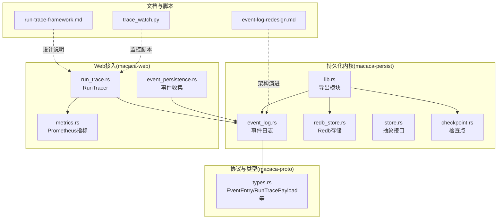
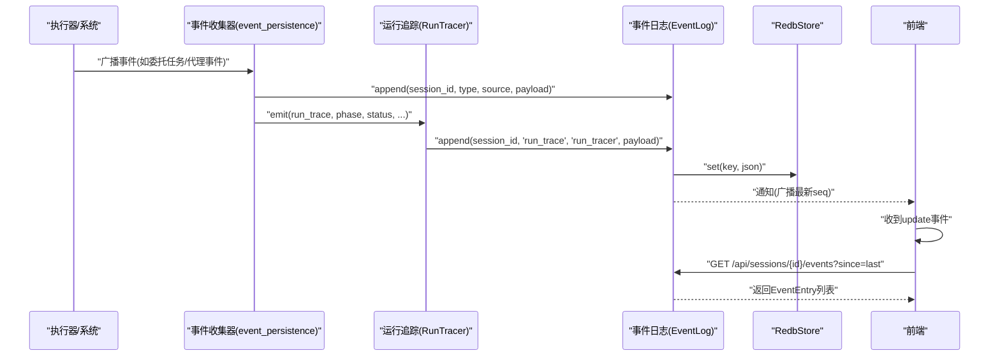
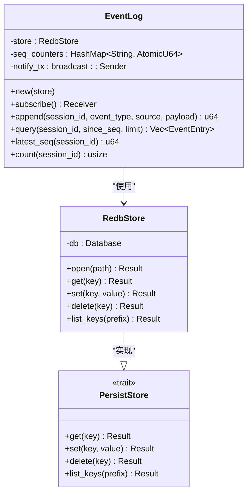
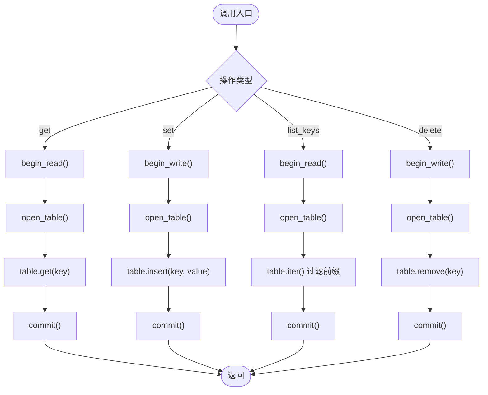
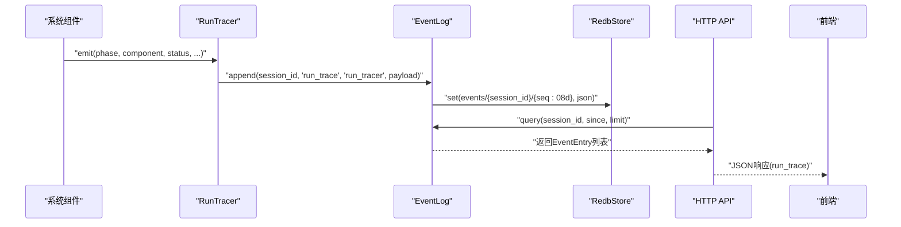
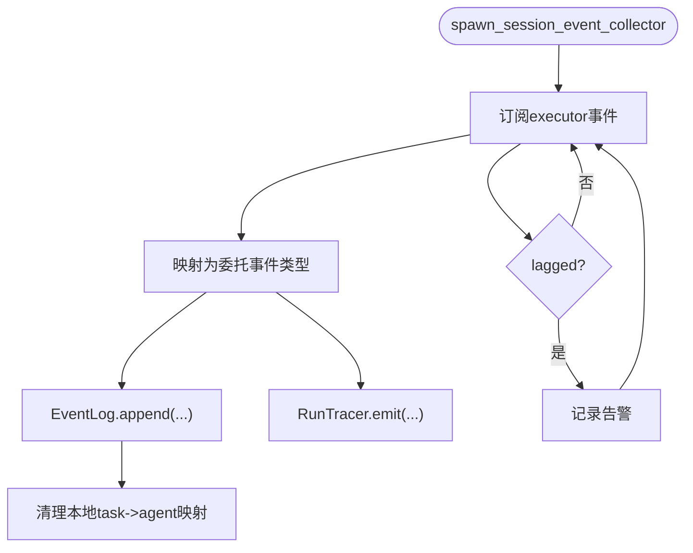
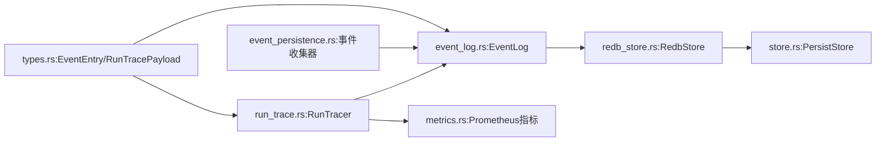

# 事件持久化

<cite>
**本文档引用的文件**
- [lib.rs](file://macaca/crates/macaca-persist/src/lib.rs)
- [event_log.rs](file://macaca/crates/macaca-persist/src/event_log.rs)
- [redb_store.rs](file://macaca/crates/macaca-persist/src/redb_store.rs)
- [store.rs](file://macaca/crates/macaca-persist/src/store.rs)
- [checkpoint.rs](file://macaca/crates/macaca-persist/src/checkpoint.rs)
- [types.rs](file://macaca/crates/macaca-proto/src/types.rs)
- [run_trace.rs](file://macaca/crates/macaca-web/src/run_trace.rs)
- [event_persistence.rs](file://macaca/crates/macaca-web/src/event_persistence.rs)
- [metrics.rs](file://macaca/crates/macaca-web/src/metrics.rs)
- [run-trace-framework.md](file://macaca/docs/run-trace-framework.md)
- [event-log-redesign.md](file://macaca/docs/event-log-redesign.md)
- [trace_watch.py](file://macaca/scripts/trace_watch.py)
</cite>

## 目录
1. [简介](#简介)
2. [项目结构](#项目结构)
3. [核心组件](#核心组件)
4. [架构总览](#架构总览)
5. [详细组件分析](#详细组件分析)
6. [依赖关系分析](#依赖关系分析)
7. [性能考量](#性能考量)
8. [故障排查指南](#故障排查指南)
9. [结论](#结论)
10. [附录](#附录)

## 简介
本文件系统化阐述事件持久化体系的设计与实现，涵盖事件日志记录机制（事件类型、数据格式、存储策略）、运行追踪（RunTrace）功能（执行轨迹、状态变更、性能监控）、Redb 存储后端配置与优化、事件查询接口与索引机制、以及备份、恢复与清理策略，并提供事件分析与可视化报告建议。

## 项目结构
事件持久化相关代码主要分布在以下模块：
- 持久化内核：macaca-persist（事件日志、Redb 存储、检查点管理）
- 协议与类型：macaca-proto（事件与运行追踪的数据结构）
- Web 层接入：macaca-web（RunTrace 生成、事件收集、指标导出）
- 文档与脚本：run-trace-framework.md、event-log-redesign.md、trace_watch.py

**图表来源**
- [lib.rs:1-12](file://macaca/crates/macaca-persist/src/lib.rs#L1-L12)
- [event_log.rs:1-35](file://macaca/crates/macaca-persist/src/event_log.rs#L1-L35)
- [redb_store.rs:1-16](file://macaca/crates/macaca-persist/src/redb_store.rs#L1-L16)
- [store.rs:1-12](file://macaca/crates/macaca-persist/src/store.rs#L1-L12)
- [checkpoint.rs:1-13](file://macaca/crates/macaca-persist/src/checkpoint.rs#L1-L13)
- [types.rs:782-820](file://macaca/crates/macaca-proto/src/types.rs#L782-L820)
- [run_trace.rs:104-142](file://macaca/crates/macaca-web/src/run_trace.rs#L104-L142)
- [event_persistence.rs:18-31](file://macaca/crates/macaca-web/src/event_persistence.rs#L18-L31)
- [metrics.rs:74-80](file://macaca/crates/macaca-web/src/metrics.rs#L74-L80)
- [run-trace-framework.md:1-65](file://macaca/docs/run-trace-framework.md#L1-L65)
- [event-log-redesign.md:1-351](file://macaca/docs/event-log-redesign.md#L1-L351)
- [trace_watch.py:97-117](file://macaca/scripts/trace_watch.py#L97-L117)

**章节来源**
- [lib.rs:1-12](file://macaca/crates/macaca-persist/src/lib.rs#L1-L12)
- [event_log-redesign.md:161-223](file://macaca/docs/event-log-redesign.md#L161-L223)

## 核心组件
- 事件日志 EventLog：面向会话的追加式事件存储，键空间(events/{session_id}/{seq:08d})，支持按会话查询、最新序号与计数。
- RedbStore：基于 redb 的键值存储实现，提供 get/set/delete/list_keys 的异步接口。
- 检查点 CheckpointManager：以“snapshot/{agent_id}”为键存储 AgentManifest 快照。
- RunTracer：向 EventLog 写入结构化的 run_trace 事件，携带 phase/component/status/message/task_id/goal_id/extra 等字段。
- 协议类型：EventEntry、RunTracePayload 等，统一事件与追踪数据结构。

**章节来源**
- [event_log.rs:18-186](file://macaca/crates/macaca-persist/src/event_log.rs#L18-L186)
- [redb_store.rs:12-115](file://macaca/crates/macaca-persist/src/redb_store.rs#L12-L115)
- [checkpoint.rs:10-60](file://macaca/crates/macaca-persist/src/checkpoint.rs#L10-L60)
- [run_trace.rs:104-142](file://macaca/crates/macaca-web/src/run_trace.rs#L104-L142)
- [types.rs:782-820](file://macaca/crates/macaca-proto/src/types.rs#L782-L820)

## 架构总览
事件持久化采用“事件日志优先”的设计：事件在产生时立即持久化到 EventLog，SSE 降级为通知机制，前端通过 REST API 拉取事件，确保刷新不丢数据、可重放。

**图表来源**
- [event_persistence.rs:18-183](file://macaca/crates/macaca-web/src/event_persistence.rs#L18-L183)
- [run_trace.rs:114-141](file://macaca/crates/macaca-web/src/run_trace.rs#L114-L141)
- [event_log.rs:93-122](file://macaca/crates/macaca-persist/src/event_log.rs#L93-L122)
- [redb_store.rs:37-73](file://macaca/crates/macaca-persist/src/redb_store.rs#L37-L73)

**章节来源**
- [event-log-redesign.md:161-223](file://macaca/docs/event-log-redesign.md#L161-L223)

## 详细组件分析

### 事件日志 EventLog
- 键空间与序列：events/{session_id}/{seq:08d}，每会话独立单调递增序号，首次访问从 DB 前缀扫描初始化计数器。
- 追加与可见性：append 立即持久化并广播通知；查询按 since_seq 排除旧事件，最多返回 limit 条。
- 并发与一致性：RwLock + AtomicU64 保证并发安全；通知通道非阻塞，订阅者可按需消费。

**图表来源**
- [event_log.rs:27-186](file://macaca/crates/macaca-persist/src/event_log.rs#L27-L186)
- [redb_store.rs:12-115](file://macaca/crates/macaca-persist/src/redb_store.rs#L12-L115)
- [store.rs:4-11](file://macaca/crates/macaca-persist/src/store.rs#L4-L11)

**章节来源**
- [event_log.rs:18-186](file://macaca/crates/macaca-persist/src/event_log.rs#L18-L186)

### Redb 存储后端
- 表定义：单表 TableDefinition<&str, &[u8]>，键为字符串，值为字节切片。
- 事务模型：读写均在独立事务中执行；get/set/delete/list_keys 均通过 spawn_blocking 包裹 redb 的阻塞 API。
- 生命周期：open 时确保表存在；提供异步封装以适配 tokio。

**图表来源**
- [redb_store.rs:37-115](file://macaca/crates/macaca-persist/src/redb_store.rs#L37-L115)

**章节来源**
- [redb_store.rs:12-115](file://macaca/crates/macaca-persist/src/redb_store.rs#L12-L115)

### 运行追踪 RunTrace
- 数据模型：event_type 固定为 "run_trace"，source 为 "run_tracer"，payload 为 RunTracePayload。
- 结构化字段：phase（阶段）、component（组件）、status（状态）、message、task_id、goal_id、extra。
- 生成与传播：RunTracer.emit 将结构化检查点写入 EventLog；同时记录 Prometheus 指标 run_trace_events_total。
- 查询接口：提供 /api/sessions/{id}/run-trace?since=&limit= 仅返回 run_trace 事件。

**图表来源**
- [run_trace.rs:114-141](file://macaca/crates/macaca-web/src/run_trace.rs#L114-L141)
- [event_log.rs:124-157](file://macaca/crates/macaca-persist/src/event_log.rs#L124-L157)
- [metrics.rs:74-80](file://macaca/crates/macaca-web/src/metrics.rs#L74-L80)
- [run-trace-framework.md:52-56](file://macaca/docs/run-trace-framework.md#L52-L56)

**章节来源**
- [run_trace.rs:104-142](file://macaca/crates/macaca-web/src/run_trace.rs#L104-L142)
- [run-trace-framework.md:1-65](file://macaca/docs/run-trace-framework.md#L1-L65)
- [metrics.rs:74-80](file://macaca/crates/macaca-web/src/metrics.rs#L74-L80)

### 事件收集与转发
- per-session 事件收集器：订阅 ApplicationExecutor 的事件流，将执行器事件映射为委托类事件写入 EventLog，并同步喂给 AgentTraceCollector 以兼容旧的会话保存。
- RunTrace 触发：在关键生命周期（任务开始/完成/失败）触发 run_trace 检查点。

**图表来源**
- [event_persistence.rs:18-183](file://macaca/crates/macaca-web/src/event_persistence.rs#L18-L183)

**章节来源**
- [event_persistence.rs:18-183](file://macaca/crates/macaca-web/src/event_persistence.rs#L18-L183)

### 检查点管理 CheckpointManager
- 键空间：snapshot/{agent_id}
- 能力：保存、加载、枚举、删除 AgentManifest 快照，支持按前缀列出所有快照并解析 UUID。

**章节来源**
- [checkpoint.rs:10-60](file://macaca/crates/macaca-persist/src/checkpoint.rs#L10-L60)

## 依赖关系分析
- EventLog 依赖 PersistStore 抽象与 RedbStore 实现。
- RunTracer 依赖 EventLog 与 Prometheus 指标。
- Web 侧事件收集器依赖 ApplicationExecutor 事件总线与 RunTracer。
- 协议层 types.rs 定义 EventEntry 与 RunTracePayload，被 EventLog 与 Web 层共同使用。

**图表来源**
- [types.rs:782-820](file://macaca/crates/macaca-proto/src/types.rs#L782-L820)
- [event_log.rs:12-14](file://macaca/crates/macaca-persist/src/event_log.rs#L12-L14)
- [redb_store.rs:8-10](file://macaca/crates/macaca-persist/src/redb_store.rs#L8-L10)
- [store.rs:6-11](file://macaca/crates/macaca-persist/src/store.rs#L6-L11)
- [run_trace.rs:9-11](file://macaca/crates/macaca-web/src/run_trace.rs#L9-L11)
- [event_persistence.rs:12-16](file://macaca/crates/macaca-web/src/event_persistence.rs#L12-L16)
- [metrics.rs:74-80](file://macaca/crates/macaca-web/src/metrics.rs#L74-L80)

**章节来源**
- [lib.rs:1-12](file://macaca/crates/macaca-persist/src/lib.rs#L1-L12)

## 性能考量
- 写入路径
  - EventLog.append 为立即持久化，确保 at-least-once；每次写入独立事务，适合高吞吐的事件风暴。
  - RedbStore 的读写均通过 spawn_blocking，避免阻塞 tokio 事件循环。
- 查询路径
  - query 使用前缀扫描 + 前向遍历，按序号过滤 since_seq，限制 limit，避免全表扫描。
  - latest_seq 优先从内存缓存的 AtomicU64 读取，首次访问才扫描 DB。
- 并发与锁
  - next_seq 使用 RwLock + 双检锁，减少写锁持有时间；seq_counters 以会话为粒度隔离。
- 指标与可观测性
  - run_trace_events_total 提供 phase/status 维度的计数，便于定位瓶颈与异常。

**章节来源**
- [event_log.rs:59-91](file://macaca/crates/macaca-persist/src/event_log.rs#L59-L91)
- [redb_store.rs:37-115](file://macaca/crates/macaca-persist/src/redb_store.rs#L37-L115)
- [metrics.rs:74-80](file://macaca/crates/macaca-web/src/metrics.rs#L74-L80)

## 故障排查指南
- 事件丢失与滞后
  - 旧架构中存在广播 lag、SSE 不可重放等问题；新架构通过 EventLog 消除这些风险。
  - 若出现停滞，可使用 trace_watch.py 监控 run_trace 最新序号变化，结合 run_trace 事件定位卡点阶段。
- 数据一致性
  - EventLog 采用追加式存储，键空间(events/{session_id}/{seq:08d})天然有序且可前缀扫描；若发现乱序，检查客户端 since 参数是否正确。
- 性能退化
  - 高频查询时注意 limit 设置；必要时分页多次拉取。
  - 监控 run_trace_events_total，关注 phase/status 分布，识别热点阶段与错误率。
- 存储健康
  - redb 文件大小增长过快时，考虑外部归档与清理策略（见“备份、恢复与清理策略”）。

**章节来源**
- [event-log-redesign.md:107-158](file://macaca/docs/event-log-redesign.md#L107-L158)
- [trace_watch.py:97-117](file://macaca/scripts/trace_watch.py#L97-L117)

## 结论
事件持久化系统以 EventLog 为核心，通过 RedbStore 提供可靠、可扩展的键值存储；RunTrace 作为结构化检查点补充，显著提升排障效率。新架构消除了旧有竞态与丢数风险，前端可完全依赖 EventLog 重放，实现刷新不丢数据与可审计可重放。

## 附录

### 事件类型与数据格式
- EventEntry 字段
  - seq：每会话单调递增序号
  - timestamp：UTC 时间戳
  - session_id：归属会话标识
  - event_type：事件类别（如 thinking、tool_call、delegated_*、run_trace 等）
  - source：事件来源（coordinator、executor:*、plan_loop 等）
  - payload：事件负载（JSON）
- RunTracePayload 字段
  - phase：逻辑阶段（如 chat.request、delegate.task_start 等）
  - component：子系统（coordinator、executor、plan_loop 等）
  - status：状态（ok/error/waiting/info）
  - message/task_id/goal_id/extra：可选上下文信息

**章节来源**
- [types.rs:782-820](file://macaca/crates/macaca-proto/src/types.rs#L782-L820)
- [run-trace-framework.md:10-13](file://macaca/docs/run-trace-framework.md#L10-L13)

### 存储策略与键空间
- 事件键空间：events/{session_id}/{seq:08d}
- 检查点键空间：snapshot/{agent_id}
- 前缀扫描：list_keys("events/{session_id}/") 实现高效顺序遍历
- 追加式写入：永不 read-modify-write，避免竞态与锁竞争

**章节来源**
- [event_log.rs:16-57](file://macaca/crates/macaca-persist/src/event_log.rs#L16-L57)
- [checkpoint.rs:8-22](file://macaca/crates/macaca-persist/src/checkpoint.rs#L8-L22)

### 事件查询接口与时间范围过滤
- REST API
  - GET /api/sessions/{id}/events?since={seq}&limit={n}
  - GET /api/sessions/{id}/run-trace?since=&limit=
- 查询语义
  - since：排除小于等于该序号的事件
  - limit：限制返回数量
  - run-trace 仅返回 event_type="run_trace" 的事件

**章节来源**
- [event_log.rs:124-157](file://macaca/crates/macaca-persist/src/event_log.rs#L124-L157)
- [run-trace-framework.md:52-56](file://macaca/docs/run-trace-framework.md#L52-L56)

### 索引机制
- 自然索引：键名按会话与序号排序，list_keys 返回有序列表，天然支持范围扫描。
- 前缀索引：events/{session_id}/ 前缀扫描，O(事件数) 遍历，满足大多数查询需求。
- 建议：若需跨会话聚合或复杂过滤，可在应用层构建二级索引（例如按 phase/status 聚合统计）。

**章节来源**
- [event_log.rs:132-156](file://macaca/crates/macaca-persist/src/event_log.rs#L132-L156)

### 备份、恢复与清理策略
- 备份
  - 直接复制 redb 数据文件进行冷备份；或导出 run_trace 与关键事件到外部存储。
- 恢复
  - 停机状态下替换 redb 文件，重启服务后 EventLog 自动重建会话轨迹。
- 清理
  - 基于会话维度的过期策略：删除超过保留期的 events/{session_id}/ 前缀键。
  - 基于时间的滚动清理：定期扫描 oldest_seq 并删除历史区间。
  - 注意：清理需确保不会影响正在运行的会话；建议在低峰期执行。

[本节为通用实践建议，未直接分析具体文件，故不附“章节来源”]

### 事件分析工具与可视化报告
- 指标导出
  - run_trace_events_total：按 phase/status 维度统计
- 监控脚本
  - trace_watch.py：轮询 run-trace 与增量 events，打印最近检查点并扫描 tool_result/delegated_* 错误
- 可视化建议
  - 将 run_trace 事件映射为流程图（phase 转移）、热力图（phase/status 分布）、时序图（事件时间轴）
  - 结合前端页面展示会话轨迹与性能指标

**章节来源**
- [metrics.rs:74-80](file://macaca/crates/macaca-web/src/metrics.rs#L74-L80)
- [trace_watch.py:97-117](file://macaca/scripts/trace_watch.py#L97-L117)
- [run-trace-framework.md:58-60](file://macaca/docs/run-trace-framework.md#L58-L60)