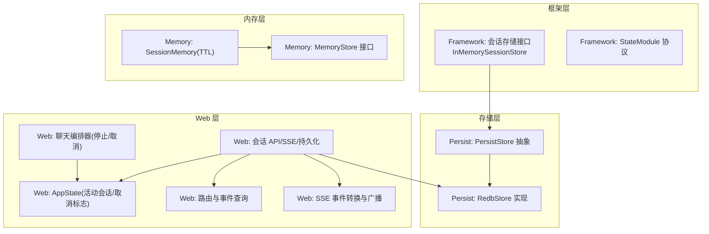
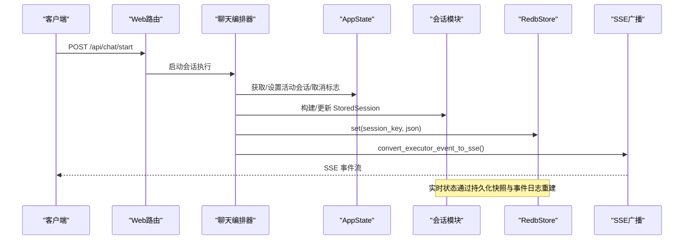
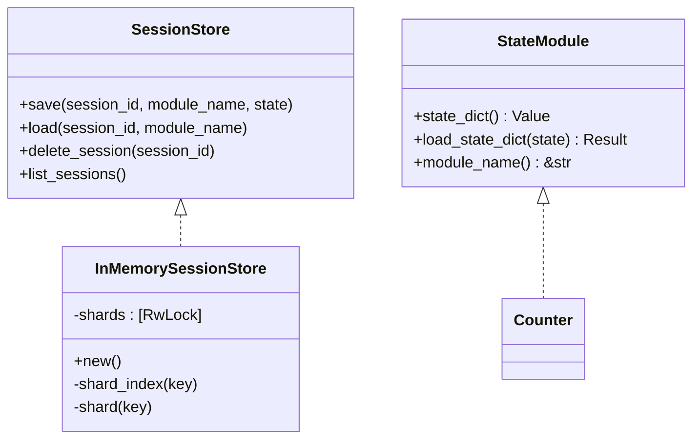
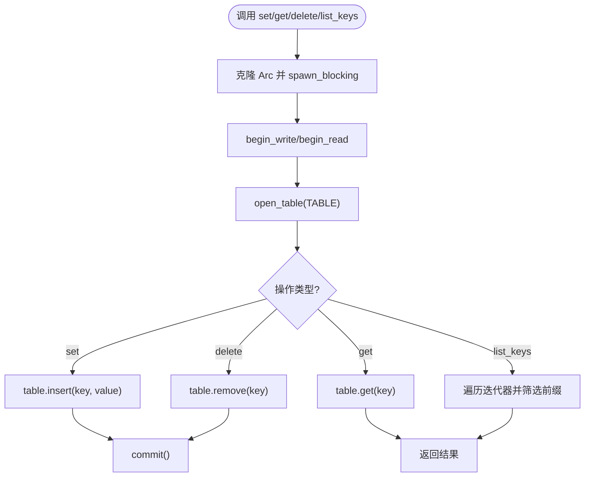
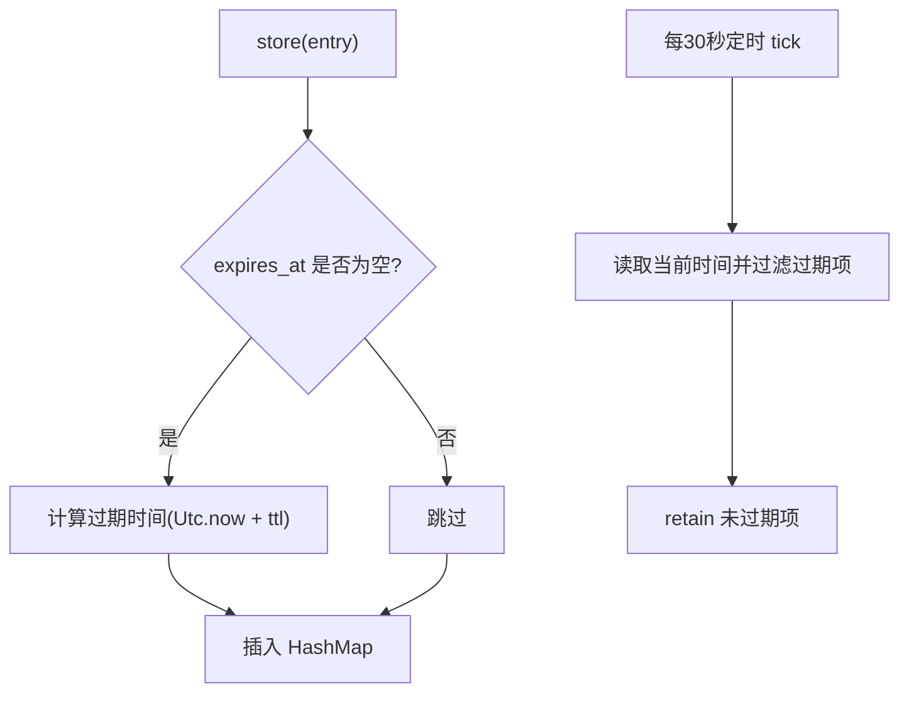
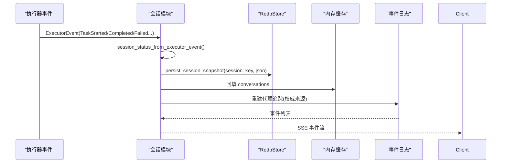
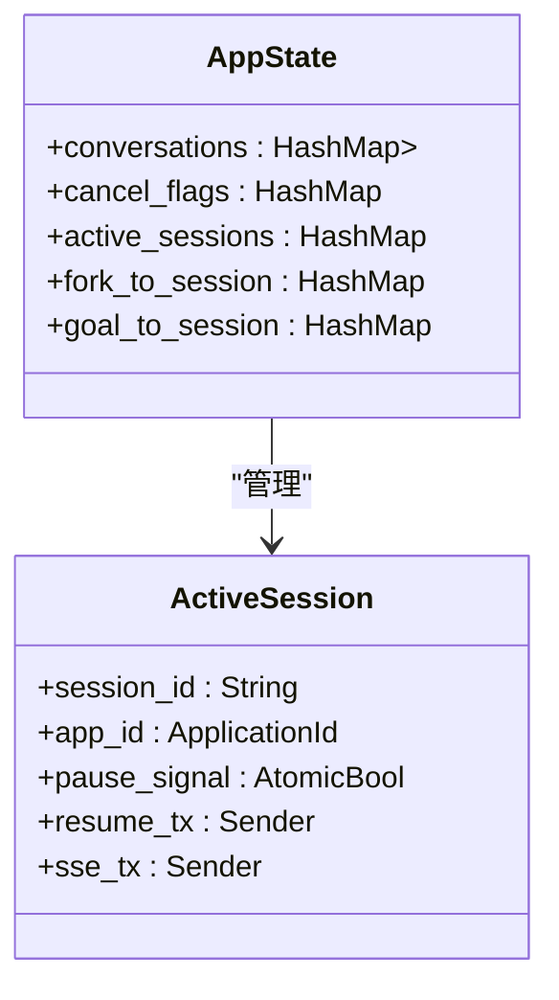
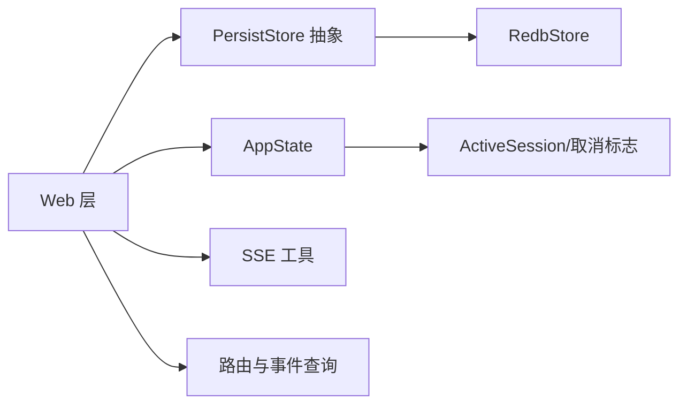

# 会话管理

<cite>
**本文档引用的文件**
- [session.rs](file://macaca/crates/macaca-framework/src/session.rs)
- [state.rs](file://macaca/crates/macaca-framework/src/state.rs)
- [session.rs](file://macaca/crates/macaca-memory/src/session.rs)
- [store.rs](file://macaca/crates/macaca-memory/src/store.rs)
- [redb_store.rs](file://macaca/crates/macaca-persist/src/redb_store.rs)
- [store.rs](file://macaca/crates/macaca-persist/src/store.rs)
- [session.rs](file://macaca/crates/macaca-web/src/session.rs)
- [state.rs](file://macaca/crates/macaca-web/src/state.rs)
- [routes.rs](file://macaca/crates/macaca-web/src/routes.rs)
- [sse.rs](file://macaca/crates/macaca-web/src/sse.rs)
- [chat_orchestrator.rs](file://macaca/crates/macaca-web/src/chat_orchestrator.rs)
</cite>

## 目录
1. [简介](#简介)
2. [项目结构](#项目结构)
3. [核心组件](#核心组件)
4. [架构总览](#架构总览)
5. [详细组件分析](#详细组件分析)
6. [依赖关系分析](#依赖关系分析)
7. [性能考量](#性能考量)
8. [故障排除指南](#故障排除指南)
9. [结论](#结论)
10. [附录：API与使用示例](#附录api与使用示例)

## 简介
本文件系统性地阐述会话管理子系统的设计与实现，覆盖会话生命周期（创建、维护、销毁）、状态跟踪与取消标志管理、活动会话监控、存储实现（Redb 持久化、内存缓存、会话恢复）、会话 ID 生成策略、超时处理与并发访问控制，并提供 API 使用示例、状态查询与事件订阅方法，以及调试与故障排除建议。

## 项目结构
会话管理由多个模块协同完成：
- 框架层（Framework）：定义会话存储接口、内存会话存储、状态模块序列化协议。
- 存储层（Persist）：基于 Redb 的键值存储抽象与实现。
- 内存层（Memory）：会话级内存存储（带 TTL 过期）。
- Web 层（Web）：HTTP API、SSE 实时流、会话持久化与恢复、活动会话与取消标志管理。

**图表来源**
- [session.rs:17-95](file://macaca/crates/macaca-framework/src/session.rs#L17-L95)
- [state.rs:47-69](file://macaca/crates/macaca-framework/src/state.rs#L47-L69)
- [store.rs:4-11](file://macaca/crates/macaca-persist/src/store.rs#L4-L11)
- [redb_store.rs:10-35](file://macaca/crates/macaca-persist/src/redb_store.rs#L10-L35)
- [session.rs:1-120](file://macaca/crates/macaca-web/src/session.rs#L1-L120)
- [state.rs:35-104](file://macaca/crates/macaca-web/src/state.rs#L35-L104)
- [routes.rs:735-791](file://macaca/crates/macaca-web/src/routes.rs#L735-L791)
- [sse.rs:1-56](file://macaca/crates/macaca-web/src/sse.rs#L1-L56)
- [chat_orchestrator.rs:148-200](file://macaca/crates/macaca-web/src/chat_orchestrator.rs#L148-L200)

**章节来源**
- [session.rs:1-340](file://macaca/crates/macaca-framework/src/session.rs#L1-L340)
- [store.rs:1-12](file://macaca/crates/macaca-persist/src/store.rs#L1-L12)
- [redb_store.rs:1-116](file://macaca/crates/macaca-persist/src/redb_store.rs#L1-L116)
- [session.rs:1-800](file://macaca/crates/macaca-web/src/session.rs#L1-L800)
- [state.rs:1-143](file://macaca/crates/macaca-web/src/state.rs#L1-L143)
- [routes.rs:1-791](file://macaca/crates/macaca-web/src/routes.rs#L1-L791)
- [sse.rs:1-246](file://macaca/crates/macaca-web/src/sse.rs#L1-L246)
- [chat_orchestrator.rs:1-2259](file://macaca/crates/macaca-web/src/chat_orchestrator.rs#L1-L2259)

## 核心组件
- 会话存储接口与内存实现
  - 会话存储接口定义保存、加载、删除会话、列出会话等能力。
  - 内存会话存储采用分片锁提升并发写入性能。
- 状态模块协议
  - StateModule 定义组件状态的序列化/反序列化与模块名约定，支持复合状态字典。
- Redb 持久化存储
  - 提供键值存储抽象与 redb 实现，用于会话与事件日志持久化。
- Web 会话与实时流
  - 提供会话 CRUD、列表、详情、事件查询；通过 SSE 广播执行事件；按会话粒度持久化快照。
- 活动会话与取消标志
  - 维护活跃会话映射、暂停/恢复通道、取消标志，支持跨浏览器刷新的热切换。
- 会话级内存（TTL）
  - 基于时间戳的过期清理，支持检索、限制返回数量、按代理过滤。

**章节来源**
- [session.rs:17-95](file://macaca/crates/macaca-framework/src/session.rs#L17-L95)
- [state.rs:47-69](file://macaca/crates/macaca-framework/src/state.rs#L47-L69)
- [redb_store.rs:10-116](file://macaca/crates/macaca-persist/src/redb_store.rs#L10-L116)
- [session.rs:1-800](file://macaca/crates/macaca-web/src/session.rs#L1-L800)
- [state.rs:35-104](file://macaca/crates/macaca-web/src/state.rs#L35-L104)
- [session.rs:18-61](file://macaca/crates/macaca-memory/src/session.rs#L18-L61)
- [store.rs:22-30](file://macaca/crates/macaca-memory/src/store.rs#L22-L30)

## 架构总览
下图展示从请求到持久化的端到端流程，包括 SSE 实时更新与事件日志重建。

**图表来源**
- [routes.rs:1-791](file://macaca/crates/macaca-web/src/routes.rs#L1-L791)
- [chat_orchestrator.rs:127-200](file://macaca/crates/macaca-web/src/chat_orchestrator.rs#L127-L200)
- [session.rs:317-389](file://macaca/crates/macaca-web/src/session.rs#L317-L389)
- [sse.rs:57-202](file://macaca/crates/macaca-web/src/sse.rs#L57-L202)

## 详细组件分析

### 会话存储与状态模块
- 会话存储接口
  - 支持按 session_id + module_name 的键空间保存/加载状态，删除会话、列出会话。
- 内存会话存储
  - 分片哈希锁（NUM_SHARDS=8），按键的字节和取模选择分片，降低锁竞争。
  - 删除会话需遍历所有分片清理前缀匹配键；列出会话通过聚合各分片键前缀去重排序。
- 状态模块协议
  - StateModule 定义 state_dict/load_state_dict/module_name，支持复合状态组合与加载。
  - 提供 save_module_state/load_module_state 辅助函数，简化模块状态持久化。

**图表来源**
- [session.rs:17-95](file://macaca/crates/macaca-framework/src/session.rs#L17-L95)
- [state.rs:47-69](file://macaca/crates/macaca-framework/src/state.rs#L47-L69)

**章节来源**
- [session.rs:17-95](file://macaca/crates/macaca-framework/src/session.rs#L17-L95)
- [state.rs:47-69](file://macaca/crates/macaca-framework/src/state.rs#L47-L69)

### Redb 持久化存储
- 抽象接口
  - 提供 get/set/delete/list_keys 四个基本操作，统一不同后端。
- redb 实现
  - 打开数据库并确保表存在；读写均在阻塞任务中执行以避免阻塞异步运行时。
  - list_keys 遍历表并筛选前缀匹配键；get/set/delete 包装 redb 事务与表操作。

**图表来源**
- [redb_store.rs:37-115](file://macaca/crates/macaca-persist/src/redb_store.rs#L37-L115)

**章节来源**
- [store.rs:4-11](file://macaca/crates/macaca-persist/src/store.rs#L4-L11)
- [redb_store.rs:10-116](file://macaca/crates/macaca-persist/src/redb_store.rs#L10-L116)

### 会话级内存（TTL）
- 设计要点
  - 内部维护 HashMap<MemoryId, MemoryEntry>，后台定时器每 30 秒清理过期条目。
  - store 时若未设置过期时间则根据 TTL 自动计算；retrieve/list 支持按代理过滤与大小限制。
- 并发与一致性
  - 读写使用 Arc<RwLock>，保证并发安全；清理逻辑在持有写锁时进行过滤删除。

**图表来源**
- [session.rs:24-61](file://macaca/crates/macaca-memory/src/session.rs#L24-L61)
- [store.rs:22-30](file://macaca/crates/macaca-memory/src/store.rs#L22-L30)

**章节来源**
- [session.rs:18-135](file://macaca/crates/macaca-memory/src/session.rs#L18-L135)
- [store.rs:22-30](file://macaca/crates/macaca-memory/src/store.rs#L22-L30)

### Web 会话管理与持久化
- 会话数据模型
  - SessionMeta：会话元信息（创建/更新时间、消息数、标题、状态）。
  - StoredSession：完整会话（消息数组或 turns 结构）。
  - StoredTurn：回合结构，支持 trace 步骤、CC 跟踪、代理追踪、元数据。
- 持久化与并发控制
  - persist_session_snapshot 使用静态锁表对同一 session_id 进行互斥写，避免并发读改写覆盖。
  - 代理追踪独立存储于 AGENT_TRACES_PREFIX，避免与会话主数据的读改写竞争。
- 实时更新与事件重建
  - update_session_realtime 基于 ExecutorEvent 更新会话状态，不写入代理追踪。
  - get_session_by_id 从持久化加载并回填内存缓存；同时从 EventLog 重建代理追踪，确保权威性。

**图表来源**
- [session.rs:296-389](file://macaca/crates/macaca-web/src/session.rs#L296-L389)
- [session.rs:532-558](file://macaca/crates/macaca-web/src/session.rs#L532-L558)
- [session.rs:693-800](file://macaca/crates/macaca-web/src/session.rs#L693-L800)

**章节来源**
- [session.rs:466-527](file://macaca/crates/macaca-web/src/session.rs#L466-L527)
- [session.rs:317-389](file://macaca/crates/macaca-web/src/session.rs#L317-L389)
- [session.rs:532-558](file://macaca/crates/macaca-web/src/session.rs#L532-L558)
- [session.rs:693-800](file://macaca/crates/macaca-web/src/session.rs#L693-L800)

### 活动会话与取消标志管理
- ActiveSession
  - 保存会话 ID、应用 ID、暂停信号、恢复通道、可热替换的 SSE 发送端。
- 取消标志
  - cancel_flags 以 app_id 为键，值为 AtomicBool；停止接口设置标志并关闭执行器。
- 映射关系
  - fork_to_session/goal_to_session 将派生任务与会话关联，便于完成通知与恢复。

**图表来源**
- [state.rs:35-104](file://macaca/crates/macaca-web/src/state.rs#L35-L104)

**章节来源**
- [state.rs:35-104](file://macaca/crates/macaca-web/src/state.rs#L35-L104)
- [chat_orchestrator.rs:148-200](file://macaca/crates/macaca-web/src/chat_orchestrator.rs#L148-L200)

### 会话 API 与事件订阅
- 会话查询
  - GET /api/sessions 列出所有会话元信息；GET /api/apps/:id/sessions 按应用过滤。
  - GET /api/sessions/:session_id 获取会话详情（含 turns 与事件统计）。
- 事件查询
  - GET /api/sessions/:id/events 查询会话事件（支持 since/limit）。
  - GET /api/sessions/:id/run-trace 查询 run_trace 事件（轻量查看执行点）。
- 计划决策
  - 计划决策事件独立存储于 PLAN_DECISIONS_PREFIX，便于按应用维度追加与读取。

**章节来源**
- [routes.rs:587-667](file://macaca/crates/macaca-web/src/routes.rs#L587-L667)
- [routes.rs:755-791](file://macaca/crates/macaca-web/src/routes.rs#L755-L791)
- [sse.rs:15-55](file://macaca/crates/macaca-web/src/sse.rs#L15-L55)

## 依赖关系分析
- 组件耦合
  - Web 层依赖 PersistStore 抽象，具体实现为 RedbStore；通过 AppState 注入。
  - 会话模块依赖 ExecutorEvent/SSE 工具进行事件转换与广播。
  - 活动会话与取消标志位于 AppState，被聊天编排器与停止接口使用。
- 外部依赖
  - redb 数据库、Tokio 异步运行时、Serde 序列化、Axum 路由与 SSE。

**图表来源**
- [store.rs:4-11](file://macaca/crates/macaca-persist/src/store.rs#L4-L11)
- [redb_store.rs:10-35](file://macaca/crates/macaca-persist/src/redb_store.rs#L10-L35)
- [state.rs:120-143](file://macaca/crates/macaca-web/src/state.rs#L120-L143)
- [routes.rs:735-791](file://macaca/crates/macaca-web/src/routes.rs#L735-L791)
- [sse.rs:1-56](file://macaca/crates/macaca-web/src/sse.rs#L1-L56)

**章节来源**
- [store.rs:4-11](file://macaca/crates/macaca-persist/src/store.rs#L4-L11)
- [redb_store.rs:10-116](file://macaca/crates/macaca-persist/src/redb_store.rs#L10-L116)
- [state.rs:120-143](file://macaca/crates/macaca-web/src/state.rs#L120-L143)
- [routes.rs:735-791](file://macaca/crates/macaca-web/src/routes.rs#L735-L791)
- [sse.rs:1-56](file://macaca/crates/macaca-web/src/sse.rs#L1-L56)

## 性能考量
- 并发写入
  - 内存会话存储采用分片锁（NUM_SHARDS=8），显著降低热点键竞争。
  - Redb 操作在阻塞任务中执行，避免阻塞 Tokio 主循环。
- 读路径优化
  - 列表会话通过 HashSet 去重，再排序输出；会话详情直接从持久化加载并回填内存缓存。
- 实时流与持久化
  - SSE 广播前先写入事件日志，保证断连重连后仍可重建状态。
  - 代理追踪独立存储，避免与会话主数据的读改写冲突。
- TTL 清理
  - 后台定时器批量清理过期项，减少频繁锁竞争。

[本节为通用性能讨论，无需特定文件来源]

## 故障排除指南
- LLM 错误诊断
  - 提供针对网络错误、认证失败、配额/限流、请求错误、服务器错误、超时的诊断提示。
- 会话状态异常
  - 若会话状态未更新，检查 persist_session_snapshot 的并发锁是否生效；确认 update_session_realtime 是否正确触发。
- 事件丢失或重复
  - 事件日志为权威来源，优先从 EventLog 重建代理追踪；SSE 广播前已写入事件日志。
- 取消无效
  - 确认停止接口已设置 app_id 对应的 AtomicBool；执行器与计划/工作循环应响应关闭信号。
- 内存过期未清理
  - 检查 SessionMemory 的定时器是否正常运行；手动调用 evict_expired 进行即时清理验证。

**章节来源**
- [chat_orchestrator.rs:38-103](file://macaca/crates/macaca-web/src/chat_orchestrator.rs#L38-L103)
- [session.rs:317-389](file://macaca/crates/macaca-web/src/session.rs#L317-L389)
- [session.rs:532-558](file://macaca/crates/macaca-web/src/session.rs#L532-L558)
- [session.rs:53-61](file://macaca/crates/macaca-memory/src/session.rs#L53-L61)

## 结论
该会话管理系统通过清晰的分层设计实现了高可用的会话生命周期管理：框架层提供状态模块与内存存储抽象，存储层以 Redb 保障持久化可靠性，Web 层结合 SSE 实现实时可观测性与事件重建。分片锁、TTL 清理、并发互斥写与事件日志权威性共同确保了系统在高并发场景下的稳定性与一致性。

## 附录：API与使用示例
以下为常用 API 与使用路径（以源码路径代替具体代码片段）：
- 创建/继续会话
  - 请求体包含 app_id、prompt、可选 session_id、engine 等字段。
  - 参考：[chat_orchestrator.rs:127-140](file://macaca/crates/macaca-web/src/chat_orchestrator.rs#L127-L140)
- 停止会话
  - 设置取消标志并关闭执行器，重置代理活动状态。
  - 参考：[chat_orchestrator.rs:154-200](file://macaca/crates/macaca-web/src/chat_orchestrator.rs#L154-L200)
- 查询会话列表
  - GET /api/sessions 或按应用 GET /api/apps/:id/sessions。
  - 参考：[routes.rs:587-667](file://macaca/crates/macaca-web/src/routes.rs#L587-L667)
- 获取会话详情
  - GET /api/sessions/:session_id，包含 turns 与事件统计。
  - 参考：[routes.rs:693-791](file://macaca/crates/macaca-web/src/routes.rs#L693-L791)
- 查询事件
  - GET /api/sessions/:id/events?since=&limit=。
  - 参考：[routes.rs:755-765](file://macaca/crates/macaca-web/src/routes.rs#L755-L765)
- 查询计划决策
  - 从 PLAN_DECISIONS_PREFIX 读取应用级决策事件。
  - 参考：[sse.rs:46-55](file://macaca/crates/macaca-web/src/sse.rs#L46-L55)