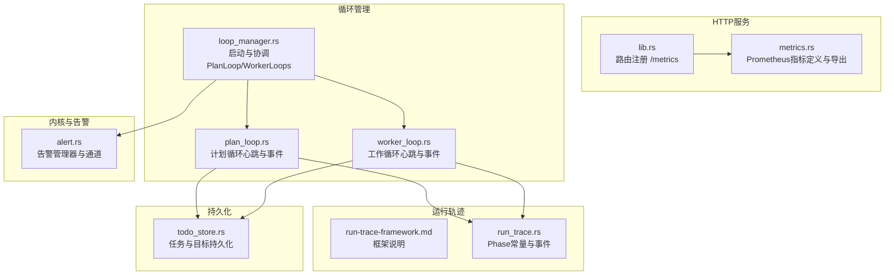
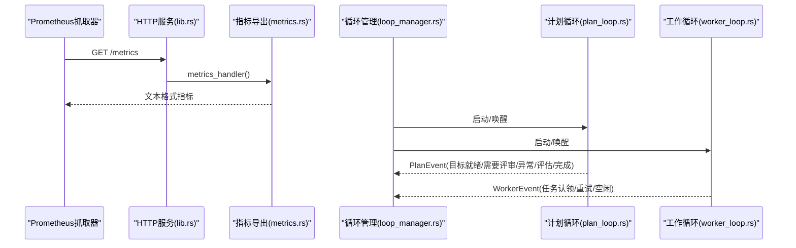
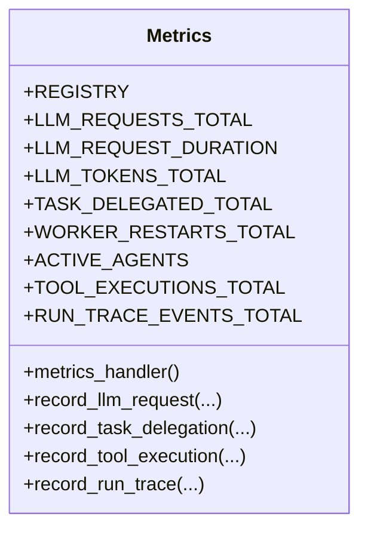
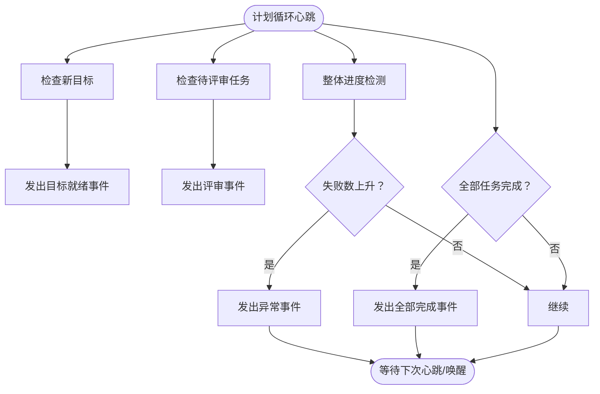
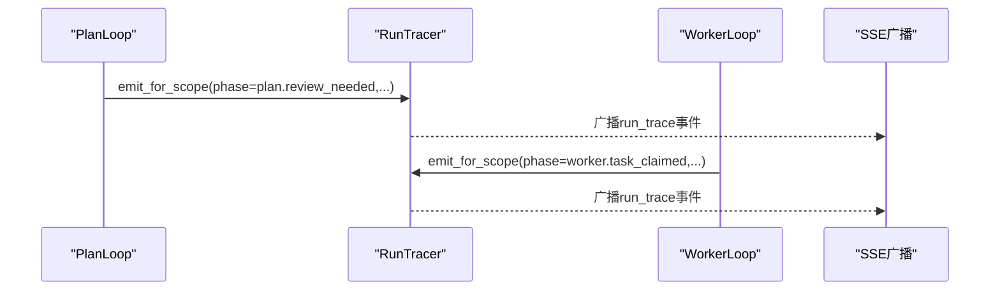
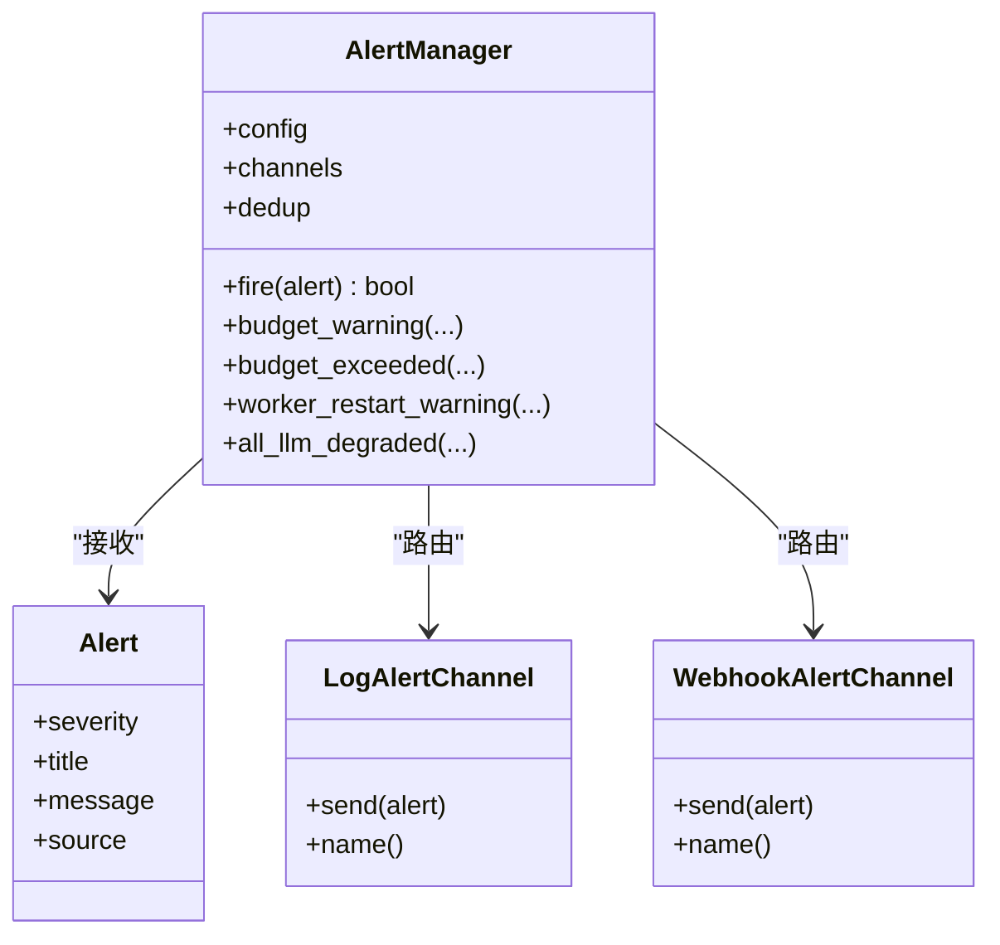
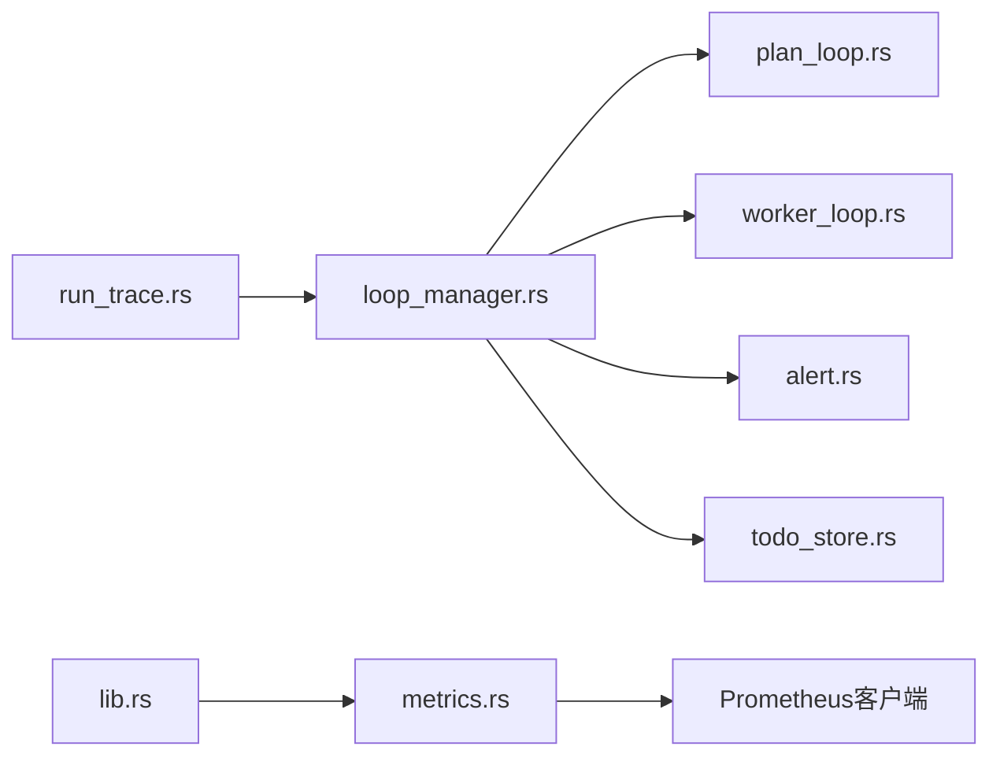

# 指标监控

<cite>
**本文引用的文件**
- [metrics.rs](file://macaca/crates/macaca-web/src/metrics.rs)
- [lib.rs](file://macaca/crates/macaca-web/src/lib.rs)
- [loop_manager.rs](file://macaca/crates/macaca-web/src/loop_manager.rs)
- [plan_loop.rs](file://macaca/crates/macaca-task/src/plan_loop.rs)
- [worker_loop.rs](file://macaca/crates/macaca-task/src/worker_loop.rs)
- [alert.rs](file://macaca/crates/macaca-kernel/src/alert.rs)
- [run-trace-framework.md](file://macaca/docs/run-trace-framework.md)
- [run_trace.rs](file://macaca/crates/macaca-web/src/run_trace.rs)
- [agent_runner.rs](file://macaca/crates/macaca-web/src/agent_runner.rs)
- [todo_store.rs](file://macaca/crates/macaca-task/src/todo_store.rs)
- [trace_watch.py](file://macaca/scripts/trace_watch.py)
</cite>

## 目录
1. [简介](#简介)
2. [项目结构](#项目结构)
3. [核心组件](#核心组件)
4. [架构总览](#架构总览)
5. [详细组件分析](#详细组件分析)
6. [依赖关系分析](#依赖关系分析)
7. [性能考量](#性能考量)
8. [故障排查指南](#故障排查指南)
9. [结论](#结论)
10. [附录](#附录)

## 简介
本文件系统性阐述指标监控体系的设计与实现，覆盖以下方面：
- 性能指标采集与暴露：CPU、内存、请求延迟、错误率等关键指标
- Prometheus 兼容指标格式与端点设计
- 循环管理器（计划循环与工作循环）状态监控
- 指标聚合策略、历史数据存储与告警规则配置
- 监控仪表板集成、告警通知与性能分析工具
- 指标优化建议与故障诊断方法

## 项目结构
监控相关能力主要分布在以下模块：
- 指标暴露层：macaca-web 的 metrics 模块与路由注册
- 循环管理与事件：loop_manager、plan_loop、worker_loop
- 告警系统：kernel 的 alert 管理器
- 运行轨迹（Run Trace）：用于结构化检查点与问题定位
- 任务持久化：todo_store 支撑任务状态与进度统计

图表来源
- [lib.rs:614-646](file://macaca/crates/macaca-web/src/lib.rs#L614-L646)
- [metrics.rs:1-142](file://macaca/crates/macaca-web/src/metrics.rs#L1-L142)
- [loop_manager.rs:24-537](file://macaca/crates/macaca-web/src/loop_manager.rs#L24-L537)
- [plan_loop.rs:55-270](file://macaca/crates/macaca-task/src/plan_loop.rs#L55-L270)
- [worker_loop.rs:69-217](file://macaca/crates/macaca-task/src/worker_loop.rs#L69-L217)
- [alert.rs:170-271](file://macaca/crates/macaca-kernel/src/alert.rs#L170-L271)
- [run-trace-framework.md:1-46](file://macaca/docs/run-trace-framework.md#L1-L46)
- [run_trace.rs:14-46](file://macaca/crates/macaca-web/src/run_trace.rs#L14-L46)
- [todo_store.rs:23-81](file://macaca/crates/macaca-task/src/todo_store.rs#L23-L81)

章节来源
- [lib.rs:614-646](file://macaca/crates/macaca-web/src/lib.rs#L614-L646)
- [metrics.rs:1-142](file://macaca/crates/macaca-web/src/metrics.rs#L1-L142)

## 核心组件
- 指标注册与导出
  - 使用全局注册表统一暴露指标，提供便捷记录函数，支持 LLM 请求总量/时长/Token、任务委托、工具执行、运行轨迹等计数与直方图
  - /metrics 端点以纯文本格式返回所有指标，无需鉴权
- 循环管理器
  - 启动 PlanLoop 与多个 WorkerLoop，维护唤醒句柄，实现即时唤醒与心跳轮询
  - PlanLoop 通过事件驱动分解目标、触发评审、检测异常、评估目标完成度
  - WorkerLoop 拉取任务、执行、提交评审，并在无工作时保持心跳
- 告警系统
  - 支持日志与 Webhook 通道，具备去重窗口控制，提供预算超支、Worker 重启、LLM 全部降级等常用告警
- 运行轨迹（Run Trace）
  - 结构化检查点，标注 phase/component/status/message/task_id/goal_id 等，辅助快速定位卡点
- 任务持久化
  - TodoStore 以键空间隔离（应用/会话/代理），保证状态变更可追溯与重启恢复

章节来源
- [metrics.rs:16-80](file://macaca/crates/macaca-web/src/metrics.rs#L16-L80)
- [loop_manager.rs:24-537](file://macaca/crates/macaca-web/src/loop_manager.rs#L24-L537)
- [plan_loop.rs:55-270](file://macaca/crates/macaca-task/src/plan_loop.rs#L55-L270)
- [worker_loop.rs:69-217](file://macaca/crates/macaca-task/src/worker_loop.rs#L69-L217)
- [alert.rs:70-271](file://macaca/crates/macaca-kernel/src/alert.rs#L70-L271)
- [run-trace-framework.md:1-46](file://macaca/docs/run-trace-framework.md#L1-L46)
- [todo_store.rs:23-81](file://macaca/crates/macaca-task/src/todo_store.rs#L23-L81)

## 架构总览
Prometheus 通过 /metrics 抓取指标；循环管理器负责任务生命周期与事件；运行轨迹提供结构化检查点；告警系统在异常时触发。

图表来源
- [lib.rs:614-646](file://macaca/crates/macaca-web/src/lib.rs#L614-L646)
- [metrics.rs:131-141](file://macaca/crates/macaca-web/src/metrics.rs#L131-L141)
- [loop_manager.rs:73-534](file://macaca/crates/macaca-web/src/loop_manager.rs#L73-L534)
- [plan_loop.rs:93-269](file://macaca/crates/macaca-task/src/plan_loop.rs#L93-L269)
- [worker_loop.rs:105-216](file://macaca/crates/macaca-task/src/worker_loop.rs#L105-L216)

## 详细组件分析

### 指标定义与导出
- 指标类型与标签
  - LLM 请求总量与状态、请求时长直方图、Token 使用总量（按 prompt/completion 分类）
  - 任务委托总数（按代理名）、Worker 重启总数（按代理名）
  - 当前活跃代理数
  - 工具执行总数（按工具名与成功/失败）
  - 运行轨迹事件总数（按阶段与状态）
- 导出端点
  - /metrics 以 Prometheus 文本格式返回全部指标，无需鉴权
- 记录函数
  - 提供 record_llm_request、record_task_delegation、record_tool_execution、record_run_trace 等便捷函数

图表来源
- [metrics.rs:12-141](file://macaca/crates/macaca-web/src/metrics.rs#L12-L141)

章节来源
- [metrics.rs:16-80](file://macaca/crates/macaca-web/src/metrics.rs#L16-L80)
- [metrics.rs:131-141](file://macaca/crates/macaca-web/src/metrics.rs#L131-L141)

### 循环管理器监控（计划循环与工作循环）
- 计划循环（PlanLoop）
  - 心跳间隔与最大评审数量可配置
  - 事件：目标就绪、需要评审、全部任务完成、异常检测、目标评估、目标完成
  - 异常检测：失败任务数上升时发出异常事件并触发告警
- 工作循环（WorkerLoop）
  - 心跳间隔与最大连续执行时间可配置
  - 事件：任务认领、重试任务、空闲
  - 即时唤醒：当评审完成或任务分配时，通过 waker 唤醒
- 循环生命周期管理
  - loop_manager 负责启动/注册 PlanLoop 与 WorkerLoops，维护唤醒句柄与关闭信号
  - 在评审完成后唤醒所有 WorkerLoops，在任务认领后唤醒 PlanLoop

图表来源
- [plan_loop.rs:93-269](file://macaca/crates/macaca-task/src/plan_loop.rs#L93-L269)
- [loop_manager.rs:246-248](file://macaca/crates/macaca-web/src/loop_manager.rs#L246-L248)

章节来源
- [plan_loop.rs:17-32](file://macaca/crates/macaca-task/src/plan_loop.rs#L17-L32)
- [plan_loop.rs:93-269](file://macaca/crates/macaca-task/src/plan_loop.rs#L93-L269)
- [worker_loop.rs:14-29](file://macaca/crates/macaca-task/src/worker_loop.rs#L14-L29)
- [worker_loop.rs:105-216](file://macaca/crates/macaca-task/src/worker_loop.rs#L105-L216)
- [loop_manager.rs:24-537](file://macaca/crates/macaca-web/src/loop_manager.rs#L24-L537)

### 运行轨迹（Run Trace）与监控
- 目的：在不替代现有事件日志的前提下，提供稀疏、结构化的检查点，帮助快速定位卡点
- 数据模型：事件类型固定为 run_trace，载荷包含 phase、component、status、message、task_id、goal_id、extra
- 标准 phase（部分）：chat.request、workflow.start、plan.loop_started、plan.review_needed、worker.task_claimed、worker.submit_review 等
- 实践：通过 run_trace 事件与 SSE 广播结合，便于前端实时展示与告警联动

图表来源
- [run-trace-framework.md:1-46](file://macaca/docs/run-trace-framework.md#L1-L46)
- [run_trace.rs:14-46](file://macaca/crates/macaca-web/src/run_trace.rs#L14-L46)
- [loop_manager.rs:196-282](file://macaca/crates/macaca-web/src/loop_manager.rs#L196-L282)
- [loop_manager.rs:580-632](file://macaca/crates/macaca-web/src/loop_manager.rs#L580-L632)
- [agent_runner.rs:119-150](file://macaca/crates/macaca-web/src/agent_runner.rs#L119-L150)

章节来源
- [run-trace-framework.md:1-46](file://macaca/docs/run-trace-framework.md#L1-L46)
- [run_trace.rs:14-46](file://macaca/crates/macaca-web/src/run_trace.rs#L14-L46)
- [loop_manager.rs:196-282](file://macaca/crates/macaca-web/src/loop_manager.rs#L196-L282)
- [loop_manager.rs:580-632](file://macaca/crates/macaca-web/src/loop_manager.rs#L580-L632)
- [agent_runner.rs:119-150](file://macaca/crates/macaca-web/src/agent_runner.rs#L119-L150)

### 告警系统与通知
- 通道
  - 日志通道：始终可用
  - Webhook 通道：可配置 URL，发送 JSON 载荷（severity/title/message/source）
- 去重策略
  - 基于 source+title 的键进行去重，窗口默认 300 秒
- 常用告警
  - 预算预警/超限、Worker 重启次数过多、LLM 全部降级

图表来源
- [alert.rs:16-271](file://macaca/crates/macaca-kernel/src/alert.rs#L16-L271)

章节来源
- [alert.rs:70-271](file://macaca/crates/macaca-kernel/src/alert.rs#L70-L271)
- [loop_manager.rs:314-316](file://macaca/crates/macaca-web/src/loop_manager.rs#L314-L316)

### 指标聚合策略与历史数据存储
- 指标聚合
  - CounterVec 与 HistogramVec 由 Prometheus 客户端负责桶与累计值管理
  - 可通过 PromQL 聚合（如按 agent/model/phase 聚合）
- 历史数据存储
  - 任务与目标持久化采用 RedbStore，键空间隔离，支持跨会话查询
  - 运行轨迹事件写入 EventLog，便于审计与回放

章节来源
- [metrics.rs:16-80](file://macaca/crates/macaca-web/src/metrics.rs#L16-L80)
- [todo_store.rs:23-81](file://macaca/crates/macaca-task/src/todo_store.rs#L23-L81)

### 监控仪表板集成与性能分析工具
- 仪表板集成
  - 使用 /metrics 暴露的指标，结合 Grafana/Prometheus 实现可视化
- 性能分析工具
  - trace_watch.py：监控 run_trace 最新序列号变化，检测停滞（长时间无新检查点）

章节来源
- [lib.rs:614-646](file://macaca/crates/macaca-web/src/lib.rs#L614-L646)
- [trace_watch.py:97-117](file://macaca/scripts/trace_watch.py#L97-L117)

## 依赖关系分析
- 指标导出依赖 Prometheus 客户端库，通过 TextEncoder 编码输出
- 循环管理器依赖 TaskSpace/TaskBoard 进行任务状态读写
- 告警系统与运行轨迹共同支撑异常检测与问题定位
- 路由层将 /metrics 注册到 HTTP 服务器

图表来源
- [metrics.rs:7-10](file://macaca/crates/macaca-web/src/metrics.rs#L7-L10)
- [loop_manager.rs:24-537](file://macaca/crates/macaca-web/src/loop_manager.rs#L24-L537)
- [plan_loop.rs:55-270](file://macaca/crates/macaca-task/src/plan_loop.rs#L55-L270)
- [worker_loop.rs:69-217](file://macaca/crates/macaca-task/src/worker_loop.rs#L69-L217)
- [alert.rs:170-271](file://macaca/crates/macaca-kernel/src/alert.rs#L170-L271)
- [todo_store.rs:23-81](file://macaca/crates/macaca-task/src/todo_store.rs#L23-L81)
- [run_trace.rs:14-46](file://macaca/crates/macaca-web/src/run_trace.rs#L14-L46)
- [lib.rs:614-646](file://macaca/crates/macaca-web/src/lib.rs#L614-L646)

章节来源
- [lib.rs:614-646](file://macaca/crates/macaca-web/src/lib.rs#L614-L646)
- [metrics.rs:7-10](file://macaca/crates/macaca-web/src/metrics.rs#L7-L10)

## 性能考量
- 指标开销
  - Counter/Histogram 为轻量计数，建议仅记录关键路径（LLM 请求、工具执行、任务委托）
- 循环频率
  - PlanLoop/WorkerLoop 心跳间隔影响响应延迟与 CPU 占用，需根据负载调优
- 去重与告警
  - 合理设置去重窗口，避免频繁告警风暴
- 存储与 IO
  - TodoStore 每次状态变更即持久化，确保一致性但可能带来 IO 压力，建议监控磁盘与写放大

## 故障排查指南
- 无新指标增长
  - 检查 /metrics 是否可达（无需鉴权）
  - 确认 Prometheus 抓取配置与网络连通
- 循环卡住
  - 使用 trace_watch.py 观察 run_trace 序列号是否停滞
  - 关注 PlanLoop/WorkerLoop 的心跳与唤醒逻辑
- 评审未触发
  - 确认评审事件是否被发出并广播
  - 检查 WorkerLoop 是否被正确唤醒
- 告警未到达
  - 检查 AlertManager 配置与去重窗口
  - 验证 Webhook URL 可达性

章节来源
- [lib.rs:614-646](file://macaca/crates/macaca-web/src/lib.rs#L614-L646)
- [trace_watch.py:97-117](file://macaca/scripts/trace_watch.py#L97-L117)
- [loop_manager.rs:246-248](file://macaca/crates/macaca-web/src/loop_manager.rs#L246-L248)
- [alert.rs:195-229](file://macaca/crates/macaca-kernel/src/alert.rs#L195-L229)

## 结论
该监控体系以 Prometheus 指标为核心，结合循环管理器事件、运行轨迹与告警系统，形成“可观测—可定位—可告警”的闭环。通过合理的指标聚合与去重策略、完善的任务持久化与检查点机制，能够有效支撑生产环境的稳定性与可运维性。

## 附录
- 指标清单（按标签维度）
  - LLM 请求：model、status(success/error)
  - LLM Token：model、type(prompt/completion)
  - 任务委托：agent
  - 工具执行：tool_name、status(success/error)
  - 运行轨迹：phase、status(ok/error/waiting/info)
- 常用查询建议（PromQL）
  - LLM 请求速率：rate(llm_requests_total[5m])
  - LLM 请求时延分位：histogram_quantile(0.95, sum by(le, model) (rate(llm_request_duration_seconds_bucket[5m])))
  - 任务委托趋势：sum by(agent) (rate(task_delegated_total[5m]))
  - 工具成功率：sum by(tool_name) (rate(tool_executions_total{status="success"}[5m])) / sum by(tool_name) (rate(tool_executions_total[5m]))