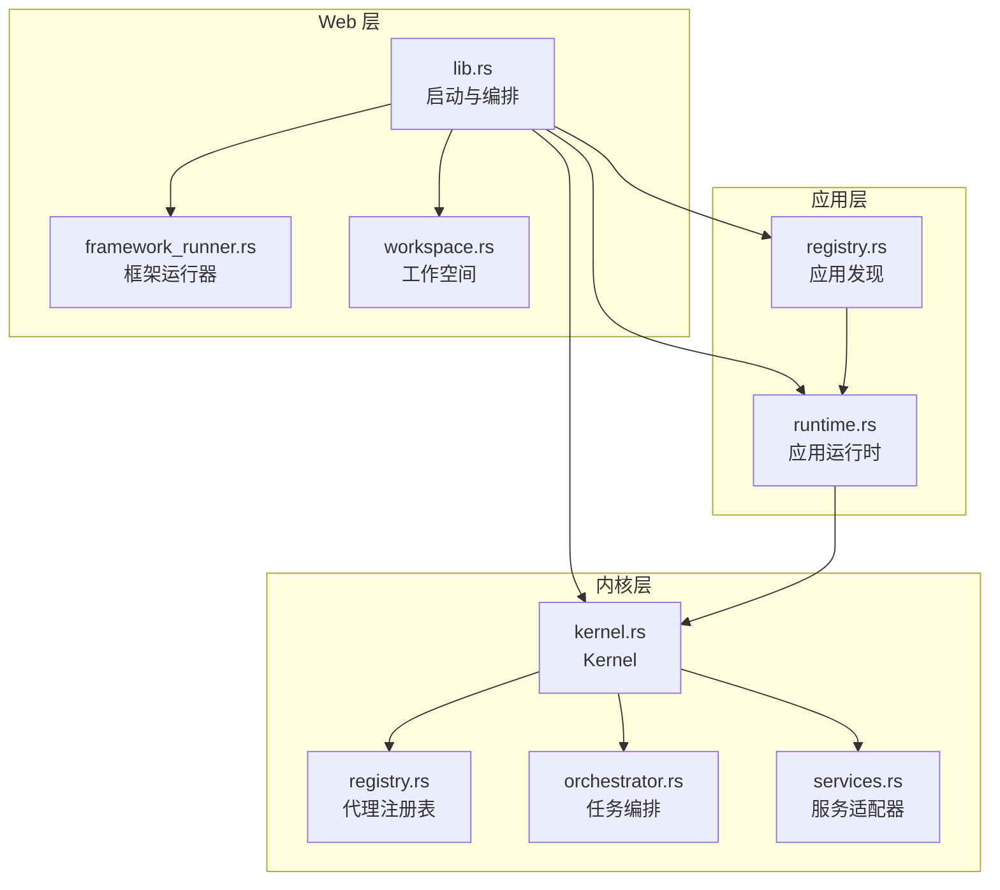
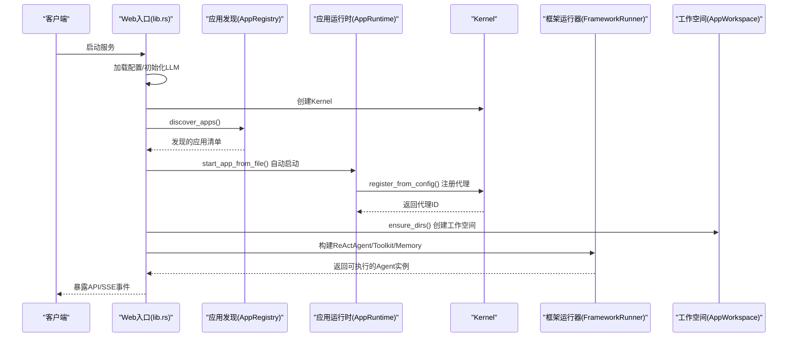
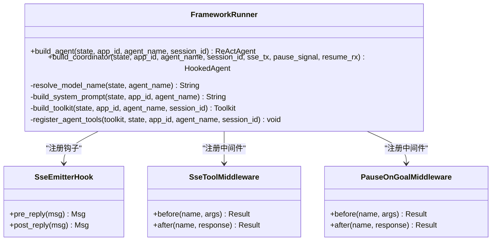
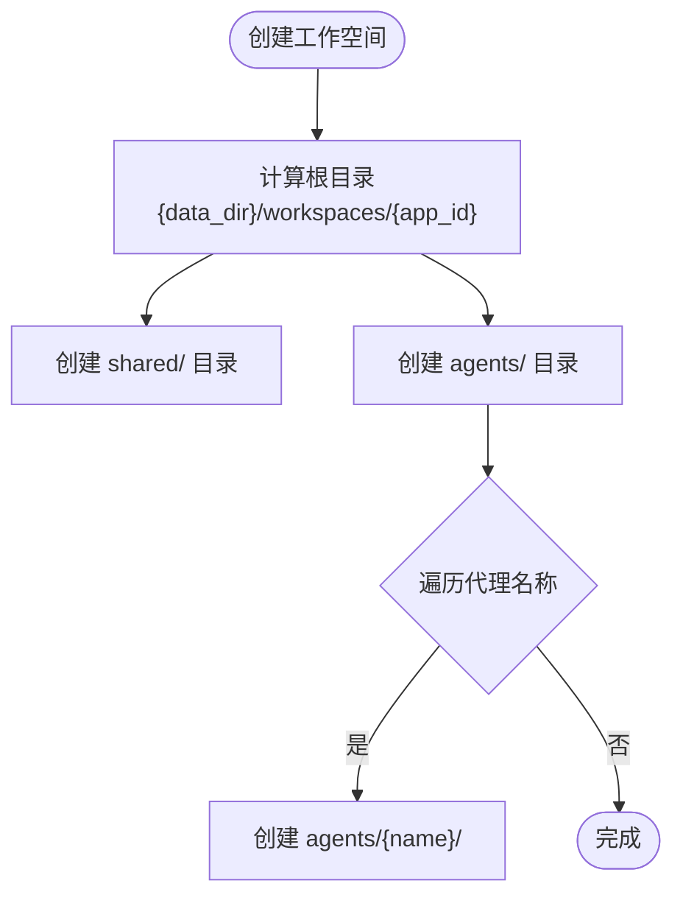
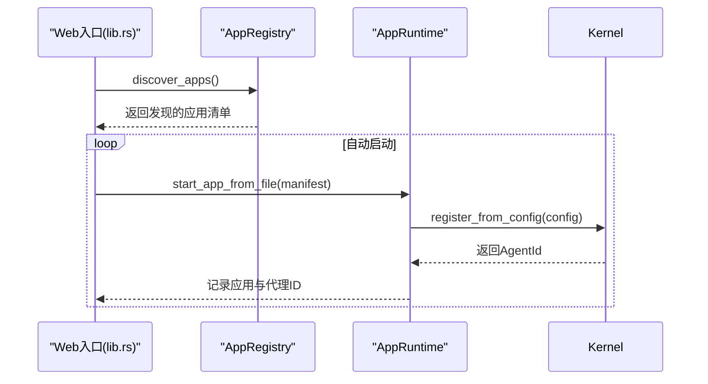
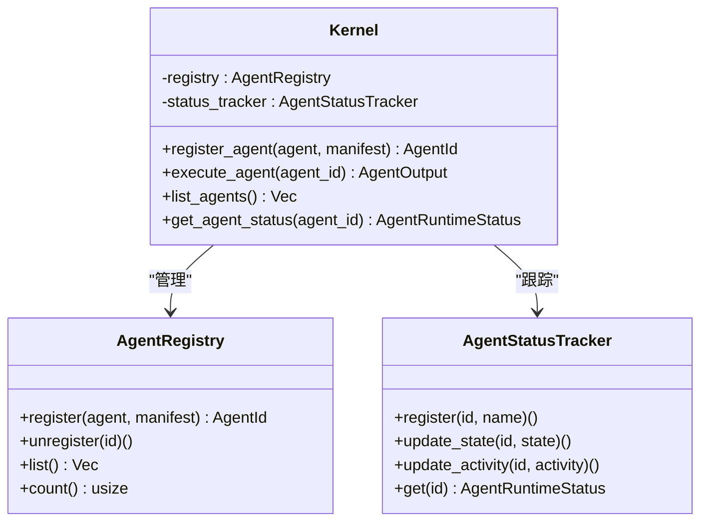
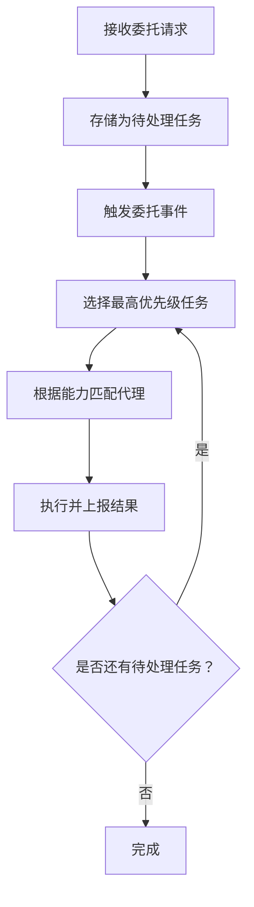
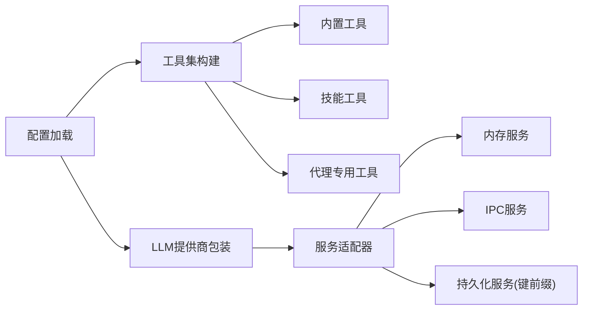
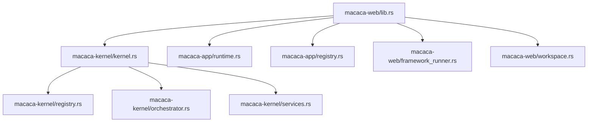

# 框架运行器

<cite>
**本文引用的文件**
- [framework_runner.rs](file://macaca/crates/macaca-web/src/framework_runner.rs)
- [workspace.rs](file://macaca/crates/macaca-web/src/workspace.rs)
- [lib.rs](file://macaca/crates/macaca-web/src/lib.rs)
- [kernel.rs](file://macaca/crates/macaca-kernel/src/kernel.rs)
- [registry.rs](file://macaca/crates/macaca-kernel/src/registry.rs)
- [runtime.rs](file://macaca/crates/macaca-app/src/runtime.rs)
- [registry.rs](file://macaca/crates/macaca-app/src/registry.rs)
- [orchestrator.rs](file://macaca/crates/macaca-kernel/src/orchestrator.rs)
- [services.rs](file://macaca/crates/macaca-kernel/src/services.rs)
</cite>

## 目录
1. [简介](#简介)
2. [项目结构](#项目结构)
3. [核心组件](#核心组件)
4. [架构总览](#架构总览)
5. [详细组件分析](#详细组件分析)
6. [依赖关系分析](#依赖关系分析)
7. [性能考量](#性能考量)
8. [故障排查指南](#故障排查指南)
9. [结论](#结论)
10. [附录](#附录)

## 简介
本文件系统性阐述“框架运行器”的设计与实现，覆盖应用框架的启动与管理机制（应用发现、加载与初始化）、工作空间管理（目录结构、文件组织与权限控制）、运行时环境配置与隔离、与Kernel的交互与状态同步、应用生命周期管理、热重载与故障恢复策略，以及扩展接口与自定义运行器开发指南。目标是帮助开发者在不深入源码的前提下，也能高效理解并使用该框架运行器。

## 项目结构
框架运行器位于 Web 层（macaca-web），通过统一入口启动服务，串联 Kernel、AppRuntime、工具集与持久化层，并为前端提供 SSE 事件桥接与会话管理能力。关键模块如下：
- 启动与编排：macaca-web/lib.rs 负责加载配置、初始化 LLM 提供商、构建 Kernel、扫描并启动应用、注册工具集、建立工作空间与会话存储、挂载路由与 SSE。
- 框架运行器：macaca-web/framework_runner.rs 将传统执行环替换为基于 macaca-framework 的 ReActAgent，提供统一工具链、工作记忆与钩子事件桥接。
- 工作空间：macaca-web/workspace.rs 定义应用级工作区目录结构与路径解析，支持共享与私有目录及权限约束。
- 应用运行时：macaca-app/runtime.rs 管理应用生命周期（启动/停止/移除），从清单加载并注册代理。
- 应用发现：macaca-app/registry.rs 扫描标准目录发现应用清单，支持用户数据目录与默认应用。
- Kernel 核心：macaca-kernel/kernel.rs 提供代理注册、执行与状态跟踪；registry.rs 管理代理注册表；orchestrator.rs 协调任务委托；services.rs 提供服务适配器以实现隔离与持久化。

图表来源
- [lib.rs:82-662](file://macaca/crates/macaca-web/src/lib.rs#L82-L662)
- [framework_runner.rs:40-122](file://macaca/crates/macaca-web/src/framework_runner.rs#L40-L122)
- [workspace.rs:22-73](file://macaca/crates/macaca-web/src/workspace.rs#L22-L73)
- [runtime.rs:21-168](file://macaca/crates/macaca-app/src/runtime.rs#L21-L168)
- [registry.rs:46-215](file://macaca/crates/macaca-app/src/registry.rs#L46-L215)
- [kernel.rs:16-136](file://macaca/crates/macaca-kernel/src/kernel.rs#L16-L136)
- [registry.rs:21-116](file://macaca/crates/macaca-kernel/src/registry.rs#L21-L116)
- [orchestrator.rs:25-186](file://macaca/crates/macaca-kernel/src/orchestrator.rs#L25-L186)
- [services.rs:17-94](file://macaca/crates/macaca-kernel/src/services.rs#L17-L94)

章节来源
- [lib.rs:82-662](file://macaca/crates/macaca-web/src/lib.rs#L82-L662)

## 核心组件
- 框架运行器（FrameworkRunner）
  - 将 Persona 配置转换为 ReActAgent，注入 LLM 适配器、工具集与工作记忆。
  - 支持协调器（coordinator）与规划器（planner）等角色的特殊工具集与中间件（如 SSE 事件桥接、目标创建暂停/恢复）。
- 工作空间（AppWorkspace）
  - 为每个应用分配独立根目录，划分共享与私有子目录，提供路径解析与权限约束。
- 应用运行时（AppRuntime）
  - 从清单加载应用，解析代理配置并通过 Kernel 注册代理；支持停止与移除。
- 应用发现（AppRegistry）
  - 扫描标准目录与用户数据目录，发现 app.yaml 清单并缓存信息。
- Kernel
  - 统一注册与执行代理，维护代理状态跟踪与调度器接口；提供状态查询与活动更新。
- 任务编排（AgentOrchestrator）
  - 基于代理能力进行任务路由与聚合，支持并行执行与结果上报。
- 服务适配器（Services）
  - 将内存、IPC、持久化等基础设施适配为 Agent 可用的服务，实现键前缀隔离与广播通道。

章节来源
- [framework_runner.rs:40-122](file://macaca/crates/macaca-web/src/framework_runner.rs#L40-L122)
- [workspace.rs:22-73](file://macaca/crates/macaca-web/src/workspace.rs#L22-L73)
- [runtime.rs:21-168](file://macaca/crates/macaca-app/src/runtime.rs#L21-L168)
- [registry.rs:46-215](file://macaca/crates/macaca-app/src/registry.rs#L46-L215)
- [kernel.rs:16-136](file://macaca/crates/macaca-kernel/src/kernel.rs#L16-L136)
- [orchestrator.rs:25-186](file://macaca/crates/macaca-kernel/src/orchestrator.rs#L25-L186)
- [services.rs:17-94](file://macaca/crates/macaca-kernel/src/services.rs#L17-L94)

## 架构总览
下图展示从 Web 入口到 Kernel 的完整启动与交互链路，包括应用发现、加载、工具集构建、工作空间创建与 SSE 事件桥接。

图表来源
- [lib.rs:141-174](file://macaca/crates/macaca-web/src/lib.rs#L141-L174)
- [runtime.rs:29-88](file://macaca/crates/macaca-app/src/runtime.rs#L29-L88)
- [kernel.rs:41-53](file://macaca/crates/macaca-kernel/src/kernel.rs#L41-L53)
- [workspace.rs:66-72](file://macaca/crates/macaca-web/src/workspace.rs#L66-L72)
- [framework_runner.rs:50-71](file://macaca/crates/macaca-web/src/framework_runner.rs#L50-L71)

章节来源
- [lib.rs:141-174](file://macaca/crates/macaca-web/src/lib.rs#L141-L174)
- [runtime.rs:29-88](file://macaca/crates/macaca-app/src/runtime.rs#L29-L88)
- [kernel.rs:41-53](file://macaca/crates/macaca-kernel/src/kernel.rs#L41-L53)
- [workspace.rs:66-72](file://macaca/crates/macaca-web/src/workspace.rs#L66-L72)
- [framework_runner.rs:50-71](file://macaca/crates/macaca-web/src/framework_runner.rs#L50-L71)

## 详细组件分析

### 框架运行器（FrameworkRunner）
- 角色与职责
  - 从 Persona 文件与 Kernel 中的代理清单构建系统提示词，注入能力列表与工作区路径。
  - 构建 Toolkit：合并全局工具集与按代理定制的工具（如任务板、目标创建、进度检查等）。
  - 包装 ReActAgent：为协调器添加 Hook 与工具中间件，实现 SSE 事件桥接与目标创建暂停/恢复。
- 关键流程
  - 构建标准 ReActAgent：组装 LLM 适配器、格式化器、工具集与工作记忆。
  - 构建协调器：注册 SSE 钩子与目标中间件，设置最大迭代次数与模型名。
  - 工具集构建：按代理类型动态注册任务板或目标相关的工具，并注入运行追踪回调。
- 事件桥接
  - Hook 在回复前后发出 thinking/content/done 事件。
  - 工具中间件在工具调用前后发出 tool_call/tool_result 事件。
- 暂停/恢复
  - 目标创建中间件在检测到 create_goal 后设置暂停信号，等待 resume 信号后恢复并追加上下文。

图表来源
- [framework_runner.rs:40-122](file://macaca/crates/macaca-web/src/framework_runner.rs#L40-L122)
- [framework_runner.rs:371-413](file://macaca/crates/macaca-web/src/framework_runner.rs#L371-L413)
- [framework_runner.rs:420-466](file://macaca/crates/macaca-web/src/framework_runner.rs#L420-L466)
- [framework_runner.rs:475-521](file://macaca/crates/macaca-web/src/framework_runner.rs#L475-L521)

章节来源
- [framework_runner.rs:40-122](file://macaca/crates/macaca-web/src/framework_runner.rs#L40-L122)
- [framework_runner.rs:371-413](file://macaca/crates/macaca-web/src/framework_runner.rs#L371-L413)
- [framework_runner.rs:420-466](file://macaca/crates/macaca-web/src/framework_runner.rs#L420-L466)
- [framework_runner.rs:475-521](file://macaca/crates/macaca-web/src/framework_runner.rs#L475-L521)

### 工作空间管理（AppWorkspace）
- 目录结构
  - 根目录：{data_dir}/workspaces/{app_id}/
  - 共享目录：shared/（所有代理读写）
  - 私有目录：agents/{name}/（仅对应代理读写）
- 权限与路径
  - 普通代理允许访问共享与自身私有目录。
  - 协调/规划代理额外允许访问 agents 根目录，便于跨代理协作。
- 初始化
  - ensure_dirs() 幂等创建目录，避免重复初始化失败。

图表来源
- [workspace.rs:27-72](file://macaca/crates/macaca-web/src/workspace.rs#L27-L72)

章节来源
- [workspace.rs:22-73](file://macaca/crates/macaca-web/src/workspace.rs#L22-L73)

### 应用发现与加载（AppRegistry/AppRuntime）
- 应用发现
  - 扫描 STANDARD_APP_DIRS 与用户数据目录，定位 app.yaml 清单并缓存。
  - 支持通过环境变量指定自定义应用目录。
- 应用加载
  - 解析清单，生成代理配置并通过 Kernel 注册。
  - 记录已加载应用及其代理 ID，支持停止与移除。
- 默认应用
  - 若未显式指定，优先加载 fullstack-autodev 示例应用。

图表来源
- [registry.rs:78-149](file://macaca/crates/macaca-app/src/registry.rs#L78-L149)
- [runtime.rs:29-88](file://macaca/crates/macaca-app/src/runtime.rs#L29-L88)
- [lib.rs:141-174](file://macaca/crates/macaca-web/src/lib.rs#L141-L174)

章节来源
- [registry.rs:78-149](file://macaca/crates/macaca-app/src/registry.rs#L78-L149)
- [runtime.rs:29-88](file://macaca/crates/macaca-app/src/runtime.rs#L29-L88)
- [lib.rs:141-174](file://macaca/crates/macaca-web/src/lib.rs#L141-L174)

### Kernel 与状态同步
- 代理注册与执行
  - Kernel 通过 AgentRegistry 存储代理与清单，支持注册、注销、列出与计数。
  - 执行时构建 AgentServices 空包，标记代理为“思考中”，执行完成后置为“空闲”。
- 状态跟踪
  - AgentStatusTracker 记录代理状态与活动，提供查询接口。
- 与框架运行器的协作
  - 框架运行器通过 Kernel 获取代理清单与模型名，用于构建系统提示词与 ReActAgent。

图表来源
- [kernel.rs:16-136](file://macaca/crates/macaca-kernel/src/kernel.rs#L16-L136)
- [registry.rs:21-116](file://macaca/crates/macaca-kernel/src/registry.rs#L21-L116)

章节来源
- [kernel.rs:16-136](file://macaca/crates/macaca-kernel/src/kernel.rs#L16-L136)
- [registry.rs:21-116](file://macaca/crates/macaca-kernel/src/registry.rs#L21-L116)

### 任务编排与委托（AgentOrchestrator）
- 能力匹配
  - 基于关键词与示例对提示进行评分，选择最佳代理。
- 任务委托
  - 支持优先级、并行执行与上下文传递；记录待处理与已完成任务。
- 结果聚合
  - 支持多种聚合策略（拼接、首个成功、全部成功、共识）。

图表来源
- [orchestrator.rs:62-149](file://macaca/crates/macaca-kernel/src/orchestrator.rs#L62-L149)

章节来源
- [orchestrator.rs:25-186](file://macaca/crates/macaca-kernel/src/orchestrator.rs#L25-L186)

### 运行时环境配置与隔离
- 配置加载
  - 从默认配置加载 LLM 提供商、速率限制、成本追踪与弹性重试策略。
- 工具集构建
  - 合并内置工具与可执行技能工具，动态注入代理工具（如任务板、目标创建）。
- 服务隔离
  - PersistServiceAdapter 使用键前缀隔离不同代理的数据。
  - MemoryServiceAdapter 与 IpcServiceAdapter 分别封装内存检索与消息广播。

图表来源
- [lib.rs:82-129](file://macaca/crates/macaca-web/src/lib.rs#L82-L129)
- [lib.rs:187-221](file://macaca/crates/macaca-web/src/lib.rs#L187-L221)
- [services.rs:66-94](file://macaca/crates/macaca-kernel/src/services.rs#L66-L94)

章节来源
- [lib.rs:82-129](file://macaca/crates/macaca-web/src/lib.rs#L82-L129)
- [lib.rs:187-221](file://macaca/crates/macaca-web/src/lib.rs#L187-L221)
- [services.rs:66-94](file://macaca/crates/macaca-kernel/src/services.rs#L66-L94)

## 依赖关系分析
- Web 层依赖
  - Kernel：代理注册与执行、状态跟踪。
  - AppRuntime/AppRegistry：应用发现与加载。
  - FrameworkRunner：ReActAgent 构建与事件桥接。
  - Workspace：工作空间目录创建与权限约束。
- 内核层依赖
  - AgentRegistry：代理注册表。
  - AgentOrchestrator：任务委托与路由。
  - Services：服务适配器实现隔离与持久化。

图表来源
- [lib.rs:30-46](file://macaca/crates/macaca-web/src/lib.rs#L30-L46)
- [kernel.rs:11-22](file://macaca/crates/macaca-kernel/src/kernel.rs#L11-L22)
- [runtime.rs:8-13](file://macaca/crates/macaca-app/src/runtime.rs#L8-L13)
- [registry.rs:36-44](file://macaca/crates/macaca-app/src/registry.rs#L36-L44)

章节来源
- [lib.rs:30-46](file://macaca/crates/macaca-web/src/lib.rs#L30-L46)
- [kernel.rs:11-22](file://macaca/crates/macaca-kernel/src/kernel.rs#L11-L22)
- [runtime.rs:8-13](file://macaca/crates/macaca-app/src/runtime.rs#L8-L13)
- [registry.rs:36-44](file://macaca/crates/macaca-app/src/registry.rs#L36-L44)

## 性能考量
- 并发与锁粒度
  - Kernel 与 AppRuntime 使用 RwLock 保护内部映射，降低写冲突影响。
- 工具集与中间件
  - 工具链采用中间件链，建议按需注册，避免过长链路导致延迟。
- 事件流
  - SSE 事件发送为异步非阻塞，注意下游消费能力与缓冲区大小。
- LLM 弹性与限流
  - ResilientLlmWrapper 提供重试与回退策略；RateLimiter 控制 QPS，CostTracker 记录开销。

## 故障排查指南
- 应用启动失败
  - 检查 app.yaml 是否存在且格式正确；确认标准扫描目录与用户数据目录权限。
  - 查看自动启动日志，定位注册阶段错误。
- 代理执行异常
  - 通过 Kernel 列出代理与状态，确认代理是否已注册；检查代理清单中的模型名与权限配置。
- 工作空间问题
  - 确认 ensure_dirs() 是否成功创建 shared 与 agents 子目录；检查权限是否允许代理读写。
- 任务委托无响应
  - 检查 AgentOrchestrator 的代理能力注册与关键字匹配；查看事件通道是否被消费。
- SSE 事件缺失
  - 确认协调器已注册 SseEmitterHook 与 SseToolMiddleware；检查事件通道容量与消费者。

章节来源
- [lib.rs:169-173](file://macaca/crates/macaca-web/src/lib.rs#L169-L173)
- [kernel.rs:87-136](file://macaca/crates/macaca-kernel/src/kernel.rs#L87-L136)
- [workspace.rs:66-72](file://macaca/crates/macaca-web/src/workspace.rs#L66-L72)
- [orchestrator.rs:150-186](file://macaca/crates/macaca-kernel/src/orchestrator.rs#L150-L186)

## 结论
框架运行器通过 Web 层统一入口，将应用发现、加载、工具集构建与事件桥接整合，借助 Kernel 实现代理注册与状态管理，并以工作空间提供隔离的文件系统环境。配合任务编排与服务适配器，形成可扩展、可观测、可恢复的运行时体系。开发者可基于现有接口快速扩展工具、代理与工作流，同时保持良好的隔离与一致性。

## 附录
- 应用生命周期管理
  - 启动：discover_apps() + start_app_from_file() + register_from_config()。
  - 停止：stop_app() 注销代理并标记为 Stopped。
  - 移除：remove_app() 清理已停止应用。
- 热重载与故障恢复
  - 热重载：提供 /api/apps/reload 接口触发重新发现与启动。
  - 故障恢复：重启后自动恢复待处理任务（如 PendingReview），并重建工作空间。
- 扩展接口与自定义运行器开发
  - 自定义工具：实现 Tool trait 并注册至 CompositeToolSet。
  - 自定义代理：实现 Agent trait 并通过 AppManifest 或 register_from_config 注册。
  - 自定义运行器：参考 FrameworkRunner 的模式，封装 ReActAgent、Toolkit 与 Hook，接入 SSE 与暂停/恢复机制。

章节来源
- [lib.rs:623](file://macaca/crates/macaca-web/src/lib.rs#L623)
- [lib.rs:538-587](file://macaca/crates/macaca-web/src/lib.rs#L538-L587)
- [framework_runner.rs:50-122](file://macaca/crates/macaca-web/src/framework_runner.rs#L50-L122)