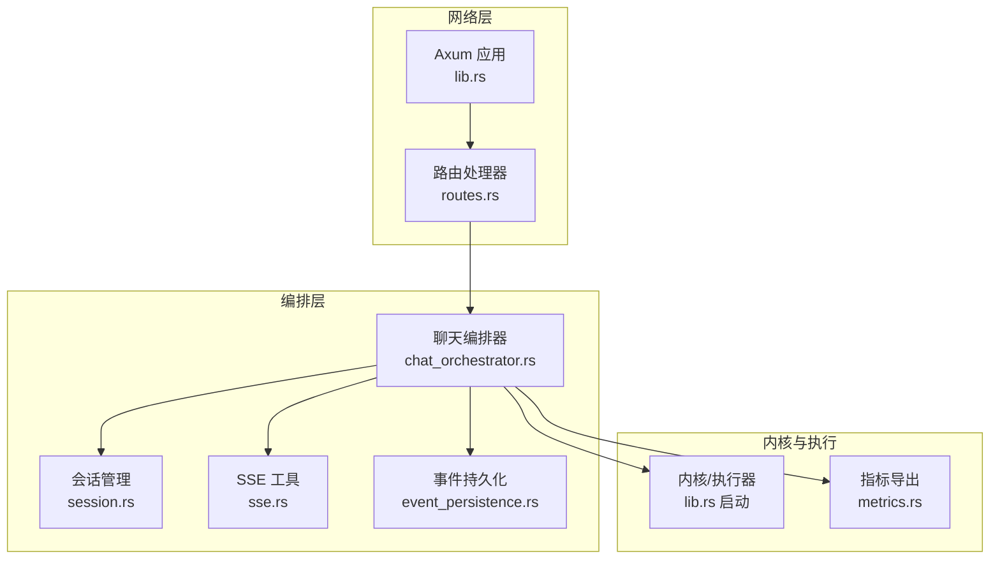
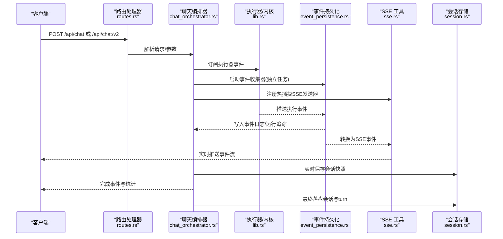
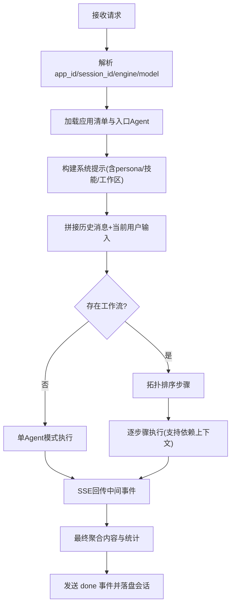
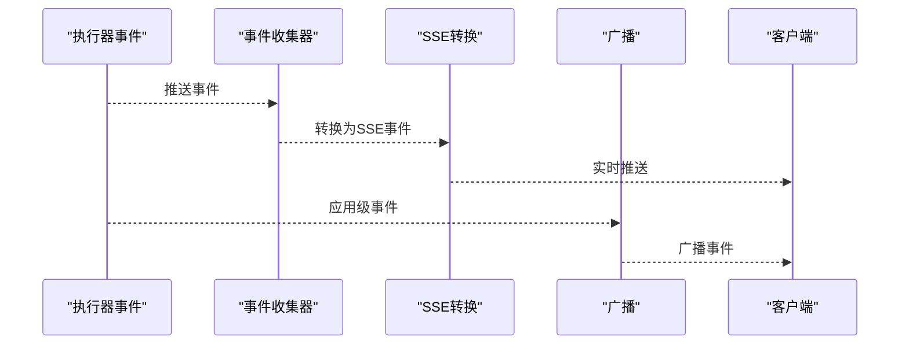
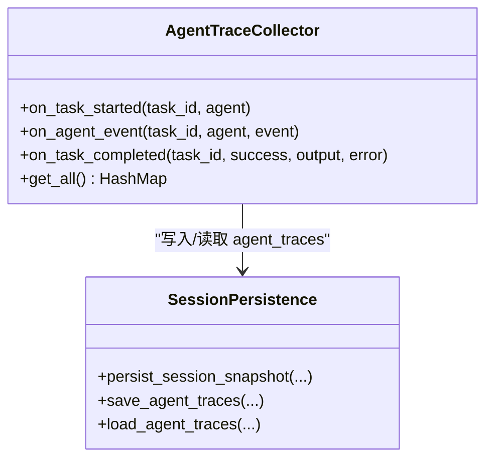
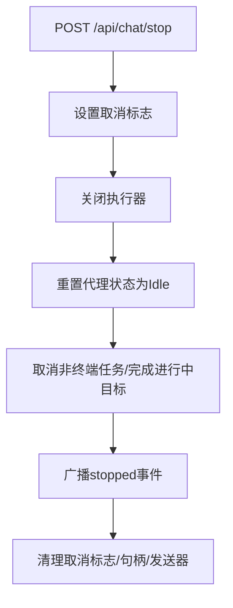
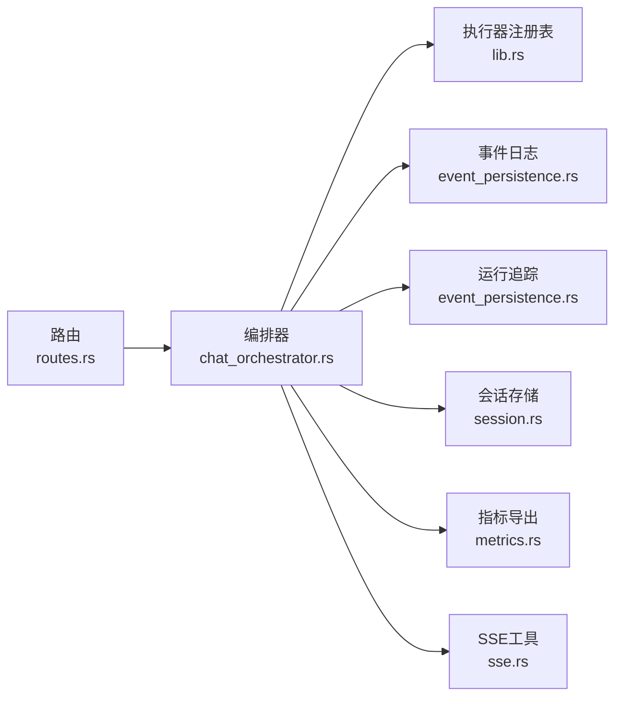

# 聊天编排器

<cite>
**本文引用的文件**
- [chat_orchestrator.rs](file://macaca/crates/macaca-web/src/chat_orchestrator.rs)
- [routes.rs](file://macaca/crates/macaca-web/src/routes.rs)
- [session.rs](file://macaca/crates/macaca-web/src/session.rs)
- [sse.rs](file://macaca/crates/macaca-web/src/sse.rs)
- [event_persistence.rs](file://macaca/crates/macaca-web/src/event_persistence.rs)
- [metrics.rs](file://macaca/crates/macaca-web/src/metrics.rs)
- [lib.rs](file://macaca/crates/macaca-web/src/lib.rs)
- [state.rs](file://macaca/crates/macaca-web/src/state.rs)
</cite>

## 目录
1. [简介](#简介)
2. [项目结构](#项目结构)
3. [核心组件](#核心组件)
4. [架构总览](#架构总览)
5. [详细组件分析](#详细组件分析)
6. [依赖关系分析](#依赖关系分析)
7. [性能考量](#性能考量)
8. [故障排查指南](#故障排查指南)
9. [结论](#结论)
10. [附录](#附录)

## 简介
本文件系统性阐述聊天编排器的设计与实现，覆盖以下主题：
- 聊天请求处理全流程：消息接收、上下文构建、Agent路由、并发执行与结果聚合
- 核心算法：消息路由策略、并发处理与结果合并逻辑
- 版本差异与迁移策略：聊天V1与V2接口对比
- 停止聊天功能：中断信号处理与资源清理
- 使用示例、错误处理与性能优化建议
- 调试工具与监控指标

## 项目结构
聊天编排器位于 macaca-web 子模块中，围绕 SSE 流式输出、会话持久化、事件日志与运行追踪构建。关键模块职责如下：
- chat_orchestrator.rs：聊天入口、工作流执行、SSE事件桥接与停止控制
- routes.rs：HTTP路由与通用响应工具
- session.rs：会话数据模型、实时状态更新与事件收集器
- sse.rs：事件转换、广播与计划决策存储
- event_persistence.rs：事件到事件日志的写入与运行追踪
- metrics.rs：Prometheus 指标导出
- lib.rs：服务启动、路由注册与全局状态装配
- state.rs：共享应用状态（持久化、循环、会话、配置）

图表来源
- [lib.rs:608-646](file://macaca/crates/macaca-web/src/lib.rs#L608-L646)
- [chat_orchestrator.rs:268-957](file://macaca/crates/macaca-web/src/chat_orchestrator.rs#L268-L957)
- [routes.rs:11-110](file://macaca/crates/macaca-web/src/routes.rs#L11-L110)
- [session.rs:1-120](file://macaca/crates/macaca-web/src/session.rs#L1-L120)
- [sse.rs:1-60](file://macaca/crates/macaca-web/src/sse.rs#L1-L60)
- [event_persistence.rs:18-60](file://macaca/crates/macaca-web/src/event_persistence.rs#L18-L60)
- [metrics.rs:128-142](file://macaca/crates/macaca-web/src/metrics.rs#L128-L142)

章节来源
- [lib.rs:608-646](file://macaca/crates/macaca-web/src/lib.rs#L608-L646)
- [chat_orchestrator.rs:268-957](file://macaca/crates/macaca-web/src/chat_orchestrator.rs#L268-L957)

## 核心组件
- 聊天编排器（post_chat/post_chat_v2）：负责解析请求、构建系统提示与历史消息、选择入口Agent、启动工作流、订阅执行事件、通过SSE实时回传，并在完成后持久化会话与统计信息。
- 会话管理（AgentTraceCollector、Session持久化）：在SSE期间与会话落盘之间协调，确保trace与turn结构一致且不互相覆盖。
- SSE事件转换与广播（convert_executor_event_to_sse、broadcast_to_app_sessions）：将执行器事件转换为前端可消费的SSE事件，并支持应用级广播。
- 事件持久化（event_persistence.rs）：独立任务订阅执行器事件，写入事件日志与运行追踪，保证断连重连后仍可重建trace。
- 停止聊天（post_chat_stop）：设置取消标志、关闭执行器、重置代理状态、取消未完成任务、广播停止事件并清理会话状态。

章节来源
- [chat_orchestrator.rs:127-156](file://macaca/crates/macaca-web/src/chat_orchestrator.rs#L127-L156)
- [chat_orchestrator.rs:154-256](file://macaca/crates/macaca-web/src/chat_orchestrator.rs#L154-L256)
- [session.rs:121-249](file://macaca/crates/macaca-web/src/session.rs#L121-L249)
- [sse.rs:57-202](file://macaca/crates/macaca-web/src/sse.rs#L57-L202)
- [event_persistence.rs:18-60](file://macaca/crates/macaca-web/src/event_persistence.rs#L18-L60)

## 架构总览
聊天编排器以“请求-编排-执行-回传-落盘”为主线，结合“热插拔SSE发送器”与“独立事件收集器”，实现浏览器刷新恢复、断连续跑与trace重建。

图表来源
- [chat_orchestrator.rs:268-957](file://macaca/crates/macaca-web/src/chat_orchestrator.rs#L268-L957)
- [event_persistence.rs:18-184](file://macaca/crates/macaca-web/src/event_persistence.rs#L18-L184)
- [sse.rs:57-202](file://macaca/crates/macaca-web/src/sse.rs#L57-L202)
- [session.rs:317-389](file://macaca/crates/macaca-web/src/session.rs#L317-L389)

## 详细组件分析

### 组件A：聊天请求处理与工作流执行
- 请求解析与上下文构建
  - 解析 app_id、session_id、engine、model 等字段
  - 从应用清单与工作区动态生成系统提示（含入口Agent persona、技能目录、工作区路径等）
  - 基于历史会话构建消息列表（用户/助手交替），并追加当前用户输入
- 入口Agent与工作流选择
  - 优先从应用清单 entry_agent/entrypoint/workflow 步骤解析入口Agent
  - 若无工作流定义则回退到单Agent模式
- 并发与暂停/恢复
  - 协程内维护最大迭代次数、令牌计数、工具使用统计
  - Fork-Join委托场景下，支持暂停等待子任务完成，收到resume信号后注入结果并继续
- 结果聚合
  - 多步骤工作流按拓扑排序执行，逐步累积工具使用、迭代次数与token用量
  - 最终汇总为一次assistant回复与统计信息，发送“done”事件

图表来源
- [chat_orchestrator.rs:275-438](file://macaca/crates/macaca-web/src/chat_orchestrator.rs#L275-L438)
- [chat_orchestrator.rs:980-1200](file://macaca/crates/macaca-web/src/chat_orchestrator.rs#L980-L1200)
- [chat_orchestrator.rs:1298-1600](file://macaca/crates/macaca-web/src/chat_orchestrator.rs#L1298-L1600)

章节来源
- [chat_orchestrator.rs:268-957](file://macaca/crates/macaca-web/src/chat_orchestrator.rs#L268-L957)
- [chat_orchestrator.rs:980-1200](file://macaca/crates/macaca-web/src/chat_orchestrator.rs#L980-L1200)
- [chat_orchestrator.rs:1298-1600](file://macaca/crates/macaca-web/src/chat_orchestrator.rs#L1298-L1600)

### 组件B：SSE事件流与热插拔发送器
- 事件转换
  - 将执行器事件映射为前端友好的SSE事件类型（如 delegated_task_start/complete/error 等）
- 热插拔发送器
  - 为每个会话维护一个可替换的SSE发送通道，支持浏览器刷新后无缝续接
- 广播与持久化
  - 对应用级事件进行广播前先写入事件日志，保证断连也能重建trace

图表来源
- [event_persistence.rs:63-184](file://macaca/crates/macaca-web/src/event_persistence.rs#L63-L184)
- [sse.rs:57-202](file://macaca/crates/macaca-web/src/sse.rs#L57-L202)

章节来源
- [sse.rs:57-202](file://macaca/crates/macaca-web/src/sse.rs#L57-L202)
- [event_persistence.rs:18-184](file://macaca/crates/macaca-web/src/event_persistence.rs#L18-L184)

### 组件C：会话持久化与trace重建
- AgentTraceCollector
  - 在SSE期间收集各Agent的trace步骤，避免与会话落盘产生竞态
- 实时快照与最终落盘
  - 通过 session 独立锁与状态字段更新，保障并发写入安全
  - 会话turn结构兼容历史消息，支持断连重连后的trace重建
- 事件日志权威性
  - EventLog是trace的唯一权威来源；会话页面详情会从事件日志重建agent_traces

图表来源
- [session.rs:121-249](file://macaca/crates/macaca-web/src/session.rs#L121-L249)
- [session.rs:317-526](file://macaca/crates/macaca-web/src/session.rs#L317-L526)

章节来源
- [session.rs:121-249](file://macaca/crates/macaca-web/src/session.rs#L121-L249)
- [session.rs:317-526](file://macaca/crates/macaca-web/src/session.rs#L317-L526)

### 组件D：停止聊天与资源清理
- 取消标志设置
  - 为应用注册原子取消标志，供编排器每轮迭代检查
- 执行器关闭
  - 关闭应用级执行器，终止所有委派任务
- 状态重置与任务回收
  - 将所有代理活动重置为空闲
  - 取消非终端任务（待处理/进行中/待评审等），并完成进行中的目标
- 广播停止事件
  - 对该应用下所有活跃会话广播“stopped”事件
- 清理收尾
  - 移除会话的取消标志，结束事件收集器与桥接任务

图表来源
- [chat_orchestrator.rs:154-256](file://macaca/crates/macaca-web/src/chat_orchestrator.rs#L154-L256)

章节来源
- [chat_orchestrator.rs:154-256](file://macaca/crates/macaca-web/src/chat_orchestrator.rs#L154-L256)

### 组件E：聊天V1与V2版本差异与迁移策略
- V1接口
  - 路由：/api/chat
  - 行为：单次请求触发一次SSE流式编排，支持工作流与多Agent协作
- V2接口
  - 路由：/api/chat/v2
  - 行为：与V1相似，但内部实现可能引入更严格的并发控制、更细粒度的事件拆分或新的工作流策略
- 迁移策略
  - 优先保持现有调用方使用 /api/chat
  - 新功能与稳定性增强优先在V2中推进，逐步引导调用方迁移
  - 通过路由层统一暴露两条路径，确保向后兼容

章节来源
- [lib.rs:629-631](file://macaca/crates/macaca-web/src/lib.rs#L629-L631)
- [chat_orchestrator.rs:268-957](file://macaca/crates/macaca-web/src/chat_orchestrator.rs#L268-L957)

## 依赖关系分析
- 路由到编排器：/api/chat 与 /api/chat/v2 映射至聊天编排器入口
- 编排器依赖：
  - 执行器注册表：用于委派任务与fork管理
  - 事件日志与运行追踪：用于断连续跑与trace重建
  - 会话存储：用于实时快照与最终落盘
  - 指标导出：记录LLM/工具/任务等关键指标
- SSE与事件持久化解耦：事件持久化作为独立任务，避免与SSE流竞争资源

图表来源
- [lib.rs:608-646](file://macaca/crates/macaca-web/src/lib.rs#L608-L646)
- [chat_orchestrator.rs:268-957](file://macaca/crates/macaca-web/src/chat_orchestrator.rs#L268-L957)
- [event_persistence.rs:18-184](file://macaca/crates/macaca-web/src/event_persistence.rs#L18-L184)
- [session.rs:317-526](file://macaca/crates/macaca-web/src/session.rs#L317-L526)
- [metrics.rs:128-142](file://macaca/crates/macaca-web/src/metrics.rs#L128-L142)
- [sse.rs:57-202](file://macaca/crates/macaca-web/src/sse.rs#L57-L202)

章节来源
- [lib.rs:608-646](file://macaca/crates/macaca-web/src/lib.rs#L608-L646)
- [chat_orchestrator.rs:268-957](file://macaca/crates/macaca-web/src/chat_orchestrator.rs#L268-L957)

## 性能考量
- 并发与背压
  - SSE发送通道容量限制（64），避免内存膨胀
  - 事件广播通道采用非阻塞尝试发送，降低阻塞风险
- 事件合并与去抖
  - SSE流中优先拉取执行器事件，再等待主通道事件，减少空转
- I/O与持久化
  - 会话快照使用会话级互斥锁，避免并发写入冲突
  - 事件日志与运行追踪异步写入，不阻塞SSE主循环
- 指标观测
  - 提供 LLM 请求总量/耗时/Token用量、工具执行次数、任务委派次数、运行追踪事件等指标，便于性能分析

章节来源
- [chat_orchestrator.rs:855-957](file://macaca/crates/macaca-web/src/chat_orchestrator.rs#L855-L957)
- [session.rs:317-389](file://macaca/crates/macaca-web/src/session.rs#L317-L389)
- [metrics.rs:16-125](file://macaca/crates/macaca-web/src/metrics.rs#L16-L125)

## 故障排查指南
- 常见错误诊断
  - LLM错误诊断：根据错误字符串匹配网络、鉴权、配额、请求格式、服务器超时等场景，给出可操作建议
- 停止聊天无效
  - 检查是否正确传递 app_id
  - 确认取消标志已注册且未被清理
  - 查看执行器是否已关闭、代理状态是否重置
- 断连后trace缺失
  - 确认事件收集器仍在运行
  - 使用会话详情接口从事件日志重建agent_traces
- 指标异常
  - 通过 /metrics 观察 LLM/工具/任务指标，定位瓶颈或失败点

章节来源
- [chat_orchestrator.rs:38-103](file://macaca/crates/macaca-web/src/chat_orchestrator.rs#L38-L103)
- [chat_orchestrator.rs:154-256](file://macaca/crates/macaca-web/src/chat_orchestrator.rs#L154-L256)
- [session.rs:730-800](file://macaca/crates/macaca-web/src/session.rs#L730-L800)
- [metrics.rs:128-142](file://macaca/crates/macaca-web/src/metrics.rs#L128-L142)

## 结论
聊天编排器通过清晰的模块划分与事件驱动架构，实现了高并发、可恢复、可观测的聊天体验。其核心优势在于：
- 以SSE为中心的实时反馈与热插拔能力
- 独立事件收集与权威日志，确保trace可靠重建
- 统一的取消与清理机制，保障资源健康
- 可扩展的工作流与Agent路由策略，满足复杂任务编排需求

## 附录

### API使用示例（路径参考）
- 启动聊天（V1）
  - 方法与路径：POST /api/chat
  - 请求体字段：app_id、prompt、model（可选）、session_id（可选）、engine（可选）
  - 返回：SSE事件流（thinking/delegated_*、done、error、stopped等）
  - 参考实现路径：[chat_orchestrator.rs:268-957](file://macaca/crates/macaca-web/src/chat_orchestrator.rs#L268-L957)
- 启动聊天（V2）
  - 方法与路径：POST /api/chat/v2
  - 行为与返回同上，内部实现增强并发与事件粒度
  - 参考实现路径：[lib.rs:629-631](file://macaca/crates/macaca-web/src/lib.rs#L629-L631)
- 停止聊天
  - 方法与路径：POST /api/chat/stop
  - 请求体字段：app_id
  - 返回：终止状态与清理项列表
  - 参考实现路径：[chat_orchestrator.rs:154-256](file://macaca/crates/macaca-web/src/chat_orchestrator.rs#L154-L256)
- 获取会话事件
  - 方法与路径：GET /api/sessions/{id}/events?since={seq}&limit={n}
  - 用途：查询事件日志（可用于trace重建）
  - 参考实现路径：[routes.rs:751-765](file://macaca/crates/macaca-web/src/routes.rs#L751-L765)
- 获取运行追踪
  - 方法与路径：GET /api/sessions/{id}/run-trace?since={seq}&limit={n}
  - 用途：仅获取 run_trace 类型事件，便于快速定位执行阶段
  - 参考实现路径：[routes.rs:767-790](file://macaca/crates/macaca-web/src/routes.rs#L767-L790)
- 指标导出
  - 方法与路径：GET /metrics
  - 用途：Prometheus 文本格式指标
  - 参考实现路径：[metrics.rs:128-142](file://macaca/crates/macaca-web/src/metrics.rs#L128-L142)

### 错误处理与性能优化要点
- 错误处理
  - 使用内置LLM错误诊断函数，针对不同错误类别给出明确指引
  - 在SSE流中发送 error/stopped 事件，便于前端及时反馈
- 性能优化
  - 控制SSE通道容量与事件合并频率
  - 利用事件日志与运行追踪进行异步持久化
  - 通过指标监控关键路径（LLM耗时、工具成功率、任务委派次数）

章节来源
- [chat_orchestrator.rs:38-103](file://macaca/crates/macaca-web/src/chat_orchestrator.rs#L38-L103)
- [chat_orchestrator.rs:855-957](file://macaca/crates/macaca-web/src/chat_orchestrator.rs#L855-L957)
- [metrics.rs:16-125](file://macaca/crates/macaca-web/src/metrics.rs#L16-L125)