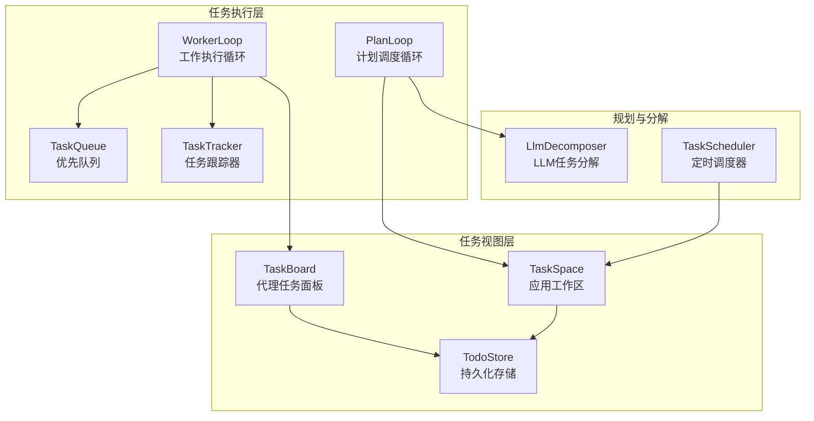
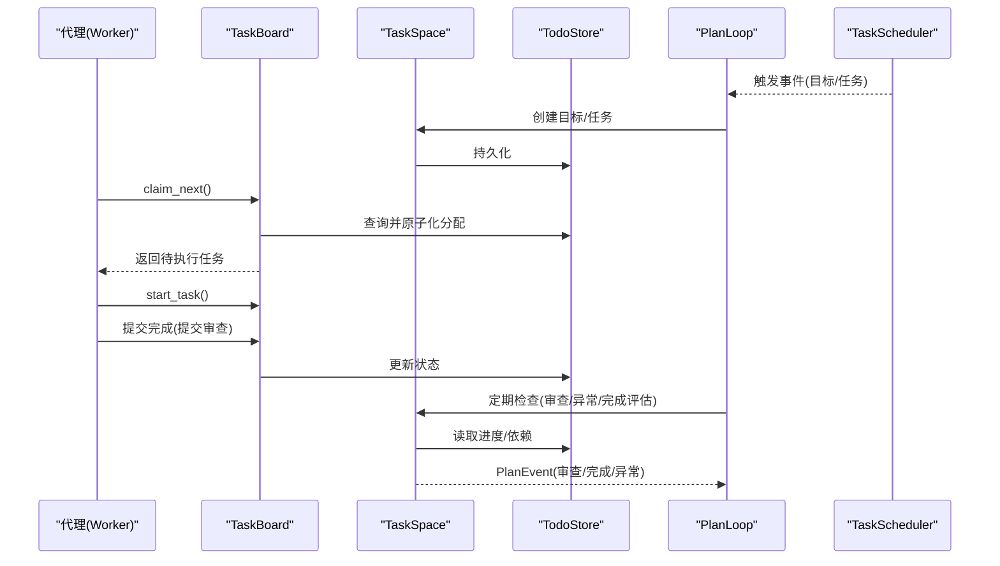
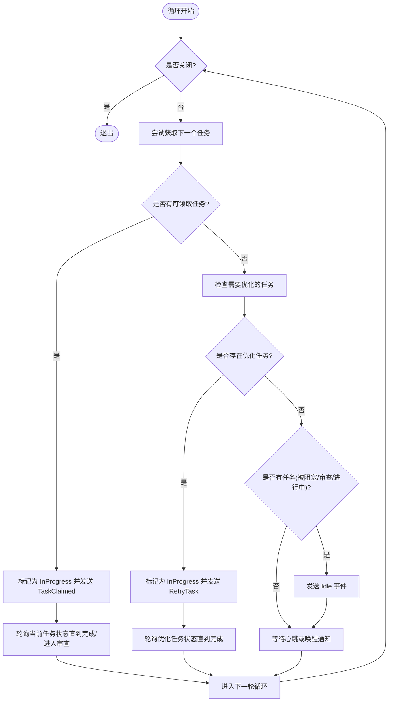
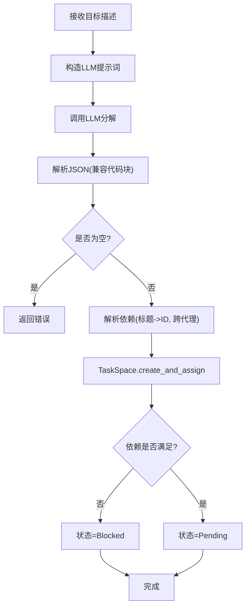
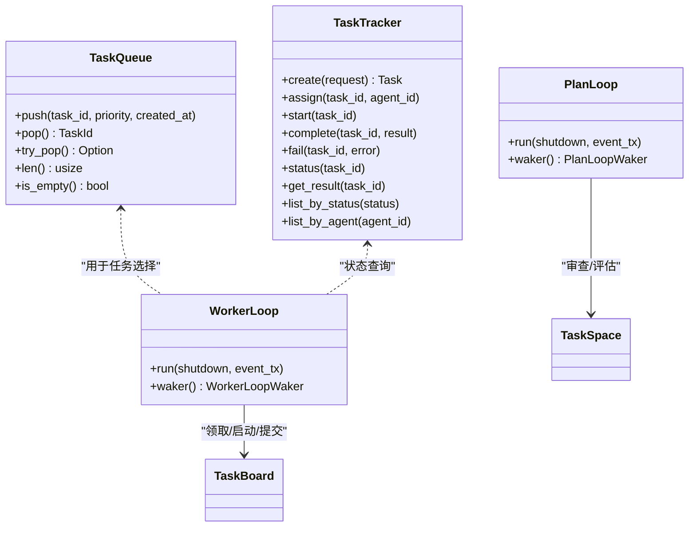
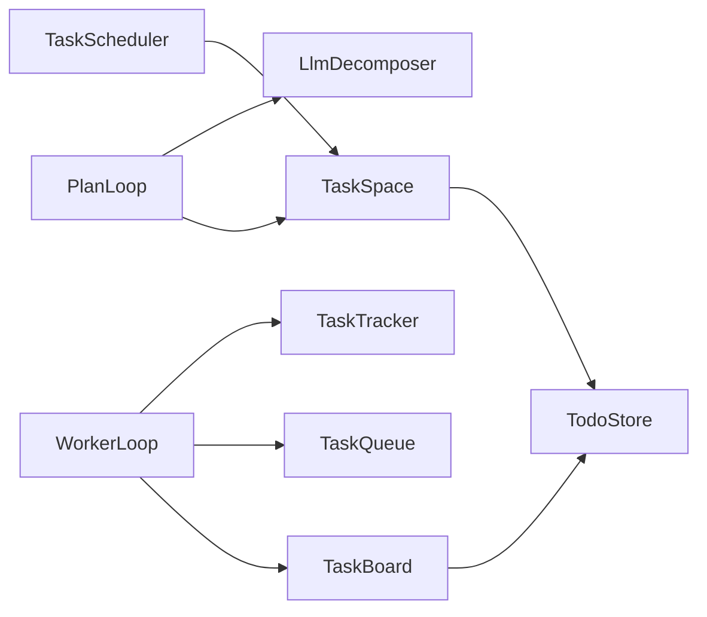

# 任务执行循环

<cite>
**本文档引用的文件**
- [worker_loop.rs](file://macaca/crates/macaca-task/src/worker_loop.rs)
- [plan_loop.rs](file://macaca/crates/macaca-task/src/plan_loop.rs)
- [todo_board.rs](file://macaca/crates/macaca-task/src/todo_board.rs)
- [todo_store.rs](file://macaca/crates/macaca-task/src/todo_store.rs)
- [decompose.rs](file://macaca/crates/macaca-task/src/decompose.rs)
- [scheduler.rs](file://macaca/crates/macaca-task/src/scheduler.rs)
- [queue.rs](file://macaca/crates/macaca-task/src/queue.rs)
- [tracker.rs](file://macaca/crates/macaca-task/src/tracker.rs)
- [claim_diagnostics.rs](file://macaca/crates/macaca-task/src/claim_diagnostics.rs)
- [lib.rs](file://macaca/crates/macaca-task/src/lib.rs)
- [default.toml](file://macaca/config/default.toml)
- [integration_tests.rs](file://macaca/crates/macaca-framework/tests/integration_tests.rs)
</cite>

## 目录
1. [简介](#简介)
2. [项目结构](#项目结构)
3. [核心组件](#核心组件)
4. [架构总览](#架构总览)
5. [详细组件分析](#详细组件分析)
6. [依赖关系分析](#依赖关系分析)
7. [性能考虑](#性能考虑)
8. [故障排查指南](#故障排查指南)
9. [结论](#结论)
10. [附录](#附录)

## 简介
本文件系统性阐述任务执行循环的设计与实现，重点覆盖以下内容：
- Worker Loop（工作执行循环）与 Plan Loop（计划调度循环）的架构设计与执行机制
- 任务获取、执行、状态更新与结果反馈的完整流程
- 调度策略：任务优先级处理、并发执行控制与资源管理
- 计划循环的智能调度：任务分解、依赖分析与自动重试机制
- 配置选项与性能优化建议：并发度、超时参数与错误处理策略
- 监控与调试方法：状态追踪、性能指标与异常诊断工具

## 项目结构
任务执行循环位于 macaca-task 子模块中，围绕任务板（TaskBoard）、应用空间（TaskSpace）、存储（TodoStore）与事件循环（WorkerLoop/PlanLoop）构建。下图展示关键模块之间的关系：



图表来源
- [worker_loop.rs:69-217](file://macaca/crates/macaca-task/src/worker_loop.rs#L69-L217)
- [plan_loop.rs:55-270](file://macaca/crates/macaca-task/src/plan_loop.rs#L55-L270)
- [todo_board.rs:68-230](file://macaca/crates/macaca-task/src/todo_board.rs#L68-L230)
- [todo_store.rs:27-332](file://macaca/crates/macaca-task/src/todo_store.rs#L27-L332)
- [decompose.rs:51-227](file://macaca/crates/macaca-task/src/decompose.rs#L51-L227)
- [scheduler.rs:217-367](file://macaca/crates/macaca-task/src/scheduler.rs#L217-L367)
- [queue.rs:42-91](file://macaca/crates/macaca-task/src/queue.rs#L42-L91)
- [tracker.rs:12-167](file://macaca/crates/macaca-task/src/tracker.rs#L12-L167)

章节来源
- [lib.rs:1-22](file://macaca/crates/macaca-task/src/lib.rs#L1-L22)

## 核心组件
- WorkerLoop：代理拉取式工作循环，负责从任务板获取最高优先级任务并驱动执行，支持空闲心跳与唤醒通知。
- PlanLoop：计划调度循环，负责目标分解、审查请求、异常检测与目标完成评估。
- TaskBoard/TaskSpace：代理视角的任务面板与应用级工作区，提供任务查询、状态变更与依赖管理。
- TodoStore：基于 Redb 的键空间隔离存储，支持应用、会话与代理维度的读写。
- LlmDecomposer：将高层目标分解为可执行子任务，支持跨代理依赖与顺序约束。
- TaskScheduler：基于 cron 或固定间隔的定时调度器，触发目标或任务创建。
- TaskQueue：基于二叉堆的优先队列，支持按优先级与创建时间排序。
- TaskTracker：内存中的任务状态机，提供任务生命周期管理。

章节来源
- [worker_loop.rs:69-217](file://macaca/crates/macaca-task/src/worker_loop.rs#L69-L217)
- [plan_loop.rs:55-270](file://macaca/crates/macaca-task/src/plan_loop.rs#L55-L270)
- [todo_board.rs:68-230](file://macaca/crates/macaca-task/src/todo_board.rs#L68-L230)
- [todo_store.rs:27-332](file://macaca/crates/macaca-task/src/todo_store.rs#L27-L332)
- [decompose.rs:51-227](file://macaca/crates/macaca-task/src/decompose.rs#L51-L227)
- [scheduler.rs:217-367](file://macaca/crates/macaca-task/src/scheduler.rs#L217-L367)
- [queue.rs:42-91](file://macaca/crates/macaca-task/src/queue.rs#L42-L91)
- [tracker.rs:12-167](file://macaca/crates/macaca-task/src/tracker.rs#L12-L167)

## 架构总览
下图展示 Worker Loop 与 Plan Loop 在整体系统中的交互路径与数据流：



图表来源
- [worker_loop.rs:118-160](file://macaca/crates/macaca-task/src/worker_loop.rs#L118-L160)
- [todo_board.rs:98-146](file://macaca/crates/macaca-task/src/todo_board.rs#L98-L146)
- [todo_board.rs:148-174](file://macaca/crates/macaca-task/src/todo_board.rs#L148-L174)
- [todo_board.rs:162-174](file://macaca/crates/macaca-task/src/todo_board.rs#L162-L174)
- [plan_loop.rs:117-125](file://macaca/crates/macaca-task/src/plan_loop.rs#L117-L125)
- [plan_loop.rs:158-181](file://macaca/crates/macaca-task/src/plan_loop.rs#L158-L181)
- [plan_loop.rs:193-258](file://macaca/crates/macaca-task/src/plan_loop.rs#L193-L258)
- [scheduler.rs:316-366](file://macaca/crates/macaca-task/src/scheduler.rs#L316-L366)

## 详细组件分析

### Worker Loop 设计与执行机制
- 任务获取策略
  - 基于会话维度的“序列优先”规则：同一会话内按 sequence_number 升序，遇到首个非终止态任务即作为“闸门”，后续更高序号任务需等待其完成。
  - 代理隔离：每个代理拥有独立的任务面板，仅可见自身任务。
- 执行与状态流转
  - 成功获取任务后，进入 Assigned → InProgress → PendingReview（提交审查）→ Completed/NeedsOptimization（失败重试）。
  - 支持在 InProgress 中更新进度与提交摘要。
- 心跳与唤醒
  - 空闲时以 heartbeat_interval 轮询；可通过通知立即唤醒。
  - 当存在需要优化的任务时，优先重试该任务。
- 事件输出
  - TaskClaimed：任务已领取，等待执行。
  - RetryTask：需要优化的任务（重试）。
  - Idle：无可用任务但有阻塞/进行中任务。



图表来源
- [worker_loop.rs:112-216](file://macaca/crates/macaca-task/src/worker_loop.rs#L112-L216)
- [todo_board.rs:98-146](file://macaca/crates/macaca-task/src/todo_board.rs#L98-L146)
- [todo_board.rs:148-174](file://macaca/crates/macaca-task/src/todo_board.rs#L148-L174)

章节来源
- [worker_loop.rs:14-29](file://macaca/crates/macaca-task/src/worker_loop.rs#L14-L29)
- [worker_loop.rs:69-100](file://macaca/crates/macaca-task/src/worker_loop.rs#L69-L100)
- [worker_loop.rs:102-217](file://macaca/crates/macaca-task/src/worker_loop.rs#L102-L217)
- [todo_board.rs:98-146](file://macaca/crates/macaca-task/src/todo_board.rs#L98-L146)
- [todo_board.rs:148-174](file://macaca/crates/macaca-task/src/todo_board.rs#L148-L174)

### Plan Loop 设计与智能调度
- 目标分解与去重
  - 弹出待处理目标，请求 LLM 分解为子任务；若分解后无任务，仅允许一次重试。
  - 将分解成功的任务推进到 InProgress 状态。
- 审查与异常检测
  - 定期扫描 PendingReview 任务，去重后按最大审查数量限制发出 ReviewNeeded。
  - 统计失败任务数量，仅在失败数增加时发出 AnomalyDetected。
- 目标完成评估
  - 对处于 InProgress 的目标，统计其所有子任务状态，全部完成后生成 EvaluateGoalCompletion 事件，并标记为 Evaluating 防止重复评估。
- 结束条件
  - 若所有任务完成，发出 AllTasksDone 事件供上层决定是否继续新工作。

```mermaid
sequenceDiagram
participant Loop as "PlanLoop"
participant Space as "TaskSpace"
participant Store as "TodoStore"
participant LLM as "LLM分解器"
Loop->>Space : pop_goal()
alt 有新目标
Space->>Store : 更新目标状态为 Decomposing
Loop->>LLM : 请求分解
LLM-->>Loop : 返回子任务列表
Loop->>Space : create_and_assign(子任务)
Space->>Store : 持久化
Loop-->>Loop : 等待任务完成
else 无新目标
Loop->>Space : pending_reviews()
Space-->>Loop : 返回待审任务
Loop-->>Loop : 发送 ReviewNeeded(去重/限流)
end
Loop->>Space : 整体进度统计
alt 失败数增加
Loop-->>Loop : 发送 AnomalyDetected
end
Loop->>Space : 列举目标与子任务
alt 所有子任务完成
Loop-->>Loop : 发送 EvaluateGoalCompletion
end
Loop->>Space : all_tasks_done()
alt 全部完成
Loop-->>Loop : 发送 AllTasksDone
end
```

图表来源
- [plan_loop.rs:117-125](file://macaca/crates/macaca-task/src/plan_loop.rs#L117-L125)
- [plan_loop.rs:127-156](file://macaca/crates/macaca-task/src/plan_loop.rs#L127-L156)
- [plan_loop.rs:158-181](file://macaca/crates/macaca-task/src/plan_loop.rs#L158-L181)
- [plan_loop.rs:183-191](file://macaca/crates/macaca-task/src/plan_loop.rs#L183-L191)
- [plan_loop.rs:193-258](file://macaca/crates/macaca-task/src/plan_loop.rs#L193-L258)
- [plan_loop.rs:260-268](file://macaca/crates/macaca-task/src/plan_loop.rs#L260-L268)

章节来源
- [plan_loop.rs:17-32](file://macaca/crates/macaca-task/src/plan_loop.rs#L17-L32)
- [plan_loop.rs:55-87](file://macaca/crates/macaca-task/src/plan_loop.rs#L55-L87)
- [plan_loop.rs:89-270](file://macaca/crates/macaca-task/src/plan_loop.rs#L89-L270)
- [decompose.rs:51-227](file://macaca/crates/macaca-task/src/decompose.rs#L51-L227)

### 任务分解、依赖分析与自动重试
- 任务分解
  - LlmDecomposer 使用 LLM 输出结构化 JSON，包含标题、描述、负责人、优先级、序列、验收标准与依赖等字段。
  - 支持同代理内序列顺序与跨代理依赖（等待全部任务或特定任务）。
- 依赖解析与创建
  - 解析阶段将标题依赖映射为 TaskId，并合并跨代理依赖集合，随后调用 TaskSpace.create_and_assign 创建任务。
  - 若存在未满足依赖，任务初始状态为 Blocked。
- 自动重试
  - 审查不通过且未达最大尝试次数时，任务转为 NeedsOptimization，携带优化建议；WorkerLoop 优先拾取此类任务进行重试。



图表来源
- [decompose.rs:62-124](file://macaca/crates/macaca-task/src/decompose.rs#L62-L124)
- [decompose.rs:150-227](file://macaca/crates/macaca-task/src/decompose.rs#L150-L227)
- [todo_board.rs:300-313](file://macaca/crates/macaca-task/src/todo_board.rs#L300-L313)

章节来源
- [decompose.rs:10-17](file://macaca/crates/macaca-task/src/decompose.rs#L10-L17)
- [decompose.rs:51-227](file://macaca/crates/macaca-task/src/decompose.rs#L51-L227)
- [todo_board.rs:300-313](file://macaca/crates/macaca-task/src/todo_board.rs#L300-L313)

### 调度策略与资源管理
- 任务优先级与并发
  - TaskQueue 基于二叉堆，优先级高者先出队；同优先级按创建时间早者先出队。
  - WorkerLoop 采用单任务串行执行模型：每次只处理一个当前任务，避免代理内部并发竞争。
- 资源管理
  - TodoStore 持久化即时生效，确保崩溃恢复后任务状态一致。
  - TaskTracker 提供内存中的状态机，便于快速查询与校验。
- 心跳与节流
  - WorkerLoop 的 heartbeat_interval 控制空闲轮询频率；PlanLoop 的 check_interval 控制计划检查频率。
  - ReviewNeeded 事件按 max_reviews_per_cycle 限制批量处理。



图表来源
- [queue.rs:42-91](file://macaca/crates/macaca-task/src/queue.rs#L42-L91)
- [tracker.rs:12-167](file://macaca/crates/macaca-task/src/tracker.rs#L12-L167)
- [worker_loop.rs:88-100](file://macaca/crates/macaca-task/src/worker_loop.rs#L88-L100)
- [plan_loop.rs:75-87](file://macaca/crates/macaca-task/src/plan_loop.rs#L75-L87)

章节来源
- [queue.rs:40-91](file://macaca/crates/macaca-task/src/queue.rs#L40-L91)
- [tracker.rs:12-167](file://macaca/crates/macaca-task/src/tracker.rs#L12-L167)
- [worker_loop.rs:14-29](file://macaca/crates/macaca-task/src/worker_loop.rs#L14-L29)
- [plan_loop.rs:17-32](file://macaca/crates/macaca-task/src/plan_loop.rs#L17-L32)

### 定时调度与目标触发
- TaskScheduler 支持 cron 表达式与固定间隔两种模式，周期性扫描到期条目并发出 ScheduleEvent。
- 条目启用/禁用、下次运行时间计算与持久化均受控于 SchedulerConfig。

```mermaid
sequenceDiagram
participant S as "TaskScheduler"
participant Store as "RedbStore"
participant Loop as "事件循环"
S->>Store : list(app_id)
loop 每次tick
S->>S : 计算下次运行时间
alt 条目到期
S-->>Loop : 发送 ScheduleEvent
S->>Store : 更新 last_run_at/run_count/next_run_at
end
end
```

图表来源
- [scheduler.rs:316-366](file://macaca/crates/macaca-task/src/scheduler.rs#L316-L366)
- [scheduler.rs:165-177](file://macaca/crates/macaca-task/src/scheduler.rs#L165-L177)

章节来源
- [scheduler.rs:16-62](file://macaca/crates/macaca-task/src/scheduler.rs#L16-L62)
- [scheduler.rs:217-367](file://macaca/crates/macaca-task/src/scheduler.rs#L217-L367)

## 依赖关系分析
- 组件耦合
  - WorkerLoop 依赖 TaskBoard 与事件通道；TaskBoard 依赖 TodoStore。
  - PlanLoop 依赖 TaskSpace 与 LLM 分解器；TaskSpace 同样依赖 TodoStore。
  - TaskQueue 与 TaskTracker 为通用工具，被 WorkerLoop 与 TaskTracker 使用。
- 键空间与隔离
  - TodoStore 使用多段键前缀实现应用、会话、代理与任务的完全隔离，保证跨会话与跨代理的数据一致性。
- 可能的循环依赖
  - 无直接循环依赖；事件通过异步通道传递，避免同步锁环。



图表来源
- [worker_loop.rs:69-73](file://macaca/crates/macaca-task/src/worker_loop.rs#L69-L73)
- [plan_loop.rs:55-57](file://macaca/crates/macaca-task/src/plan_loop.rs#L55-L57)
- [todo_board.rs:68-73](file://macaca/crates/macaca-task/src/todo_board.rs#L68-L73)
- [todo_store.rs:27-29](file://macaca/crates/macaca-task/src/todo_store.rs#L27-L29)
- [decompose.rs:51-54](file://macaca/crates/macaca-task/src/decompose.rs#L51-L54)
- [scheduler.rs:217-220](file://macaca/crates/macaca-task/src/scheduler.rs#L217-L220)

章节来源
- [todo_store.rs:16-71](file://macaca/crates/macaca-task/src/todo_store.rs#L16-L71)
- [todo_board.rs:68-73](file://macaca/crates/macaca-task/src/todo_board.rs#L68-L73)
- [plan_loop.rs:55-57](file://macaca/crates/macaca-task/src/plan_loop.rs#L55-L57)

## 性能考虑
- 心跳与轮询
  - WorkerLoop 的 heartbeat_interval 与 PlanLoop 的 check_interval 决定空闲时的 CPU 占用与响应延迟权衡。
  - 建议根据任务吞吐与审查压力调整：高负载时缩短间隔，低负载时延长间隔。
- 批量审查
  - PlanLoop 的 max_reviews_per_cycle 限制每轮审查数量，避免审查风暴导致系统过载。
- 优先队列与序列规则
  - TaskQueue 与 TaskBoard 的序列规则保证确定性顺序，减少死锁与饥饿；但在长链路场景可能成为瓶颈，应结合任务粒度与依赖设计优化。
- 存储与持久化
  - TodoStore 每次状态变更即持久化，可靠性高但写放大明显；建议在高频状态切换场景下评估是否可合并写入（当前实现未合并）。
- 并发度
  - WorkerLoop 默认单任务串行，适合代理内串行执行；若需多任务并行，应在代理侧引入外部并发控制（例如多个 WorkerLoop 实例或外部线程池），同时确保 TaskBoard 的原子分配与状态一致性。

## 故障排查指南
- 代理无法领取任务
  - 使用会话级诊断工具，定位首个非终止态任务是否为 Pending；若为 Blocked，则检查依赖是否已完成；若为 Assigned/InProgress/PendingReview/NeedsOptimization，则说明存在“序列等待”。
  - 参考：[claim_diagnostics.rs:86-214](file://macaca/crates/macaca-task/src/claim_diagnostics.rs#L86-L214)
- 审查不通过导致反复重试
  - 检查 TaskSpace.review_task 的返回值与状态转换逻辑，确认 Attempts 是否达到上限。
  - 参考：[todo_board.rs:321-358](file://macaca/crates/macaca-task/src/todo_board.rs#L321-L358)
- 任务卡住或停滞
  - 使用 PlanLoop 的 AnomalyDetected 事件与失败计数变化判断异常；结合 TaskSpace.overall_progress() 观察阻塞/失败比例。
  - 参考：[plan_loop.rs:183-191](file://macaca/crates/macaca-task/src/plan_loop.rs#L183-L191)
- 依赖未满足
  - 检查 TaskSpace.create_and_assign 的依赖解析逻辑，确认 Completed 依赖集合与 DependsOn 列表匹配。
  - 参考：[todo_board.rs:300-313](file://macaca/crates/macaca-task/src/todo_board.rs#L300-L313)
- 监控与日志
  - WorkerLoop/PlanLoop 在关键节点记录 info/warn 日志；建议结合默认配置中的日志级别与文件输出进行问题定位。
  - 参考：[default.toml:106-119](file://macaca/config/default.toml#L106-L119)

章节来源
- [claim_diagnostics.rs:86-214](file://macaca/crates/macaca-task/src/claim_diagnostics.rs#L86-L214)
- [todo_board.rs:321-358](file://macaca/crates/macaca-task/src/todo_board.rs#L321-L358)
- [plan_loop.rs:183-191](file://macaca/crates/macaca-task/src/plan_loop.rs#L183-L191)
- [todo_board.rs:300-313](file://macaca/crates/macaca-task/src/todo_board.rs#L300-L313)
- [default.toml:106-119](file://macaca/config/default.toml#L106-L119)

## 结论
本任务执行循环通过 Worker Loop 与 Plan Loop 的协同，实现了从目标分解、任务创建、代理执行、审查反馈到目标评估的闭环。其关键优势在于：
- 明确的序列与依赖规则，确保执行顺序与一致性；
- 基于事件的解耦设计，便于扩展与演进；
- 完整的状态持久化与诊断工具，保障可观测性与可维护性。

在实际部署中，建议结合业务负载调整心跳与批处理参数，并在代理侧合理控制并发度，以获得最佳吞吐与稳定性。

## 附录
- 配置项参考
  - 心跳间隔、计划检查间隔、审查批处理上限等均可通过相应配置结构体进行定制。
  - 参考：[worker_loop.rs:14-29](file://macaca/crates/macaca-task/src/worker_loop.rs#L14-L29)，[plan_loop.rs:17-32](file://macaca/crates/macaca-task/src/plan_loop.rs#L17-L32)，[scheduler.rs:165-177](file://macaca/crates/macaca-task/src/scheduler.rs#L165-L177)
- 测试参考
  - 框架集成测试展示了多模块协作与消息传递的基本行为，可作为理解任务执行循环上下文的补充材料。
  - 参考：[integration_tests.rs:176-206](file://macaca/crates/macaca-framework/tests/integration_tests.rs#L176-L206)