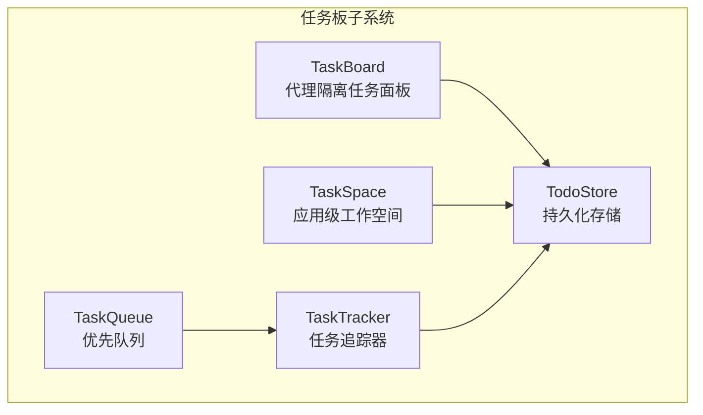
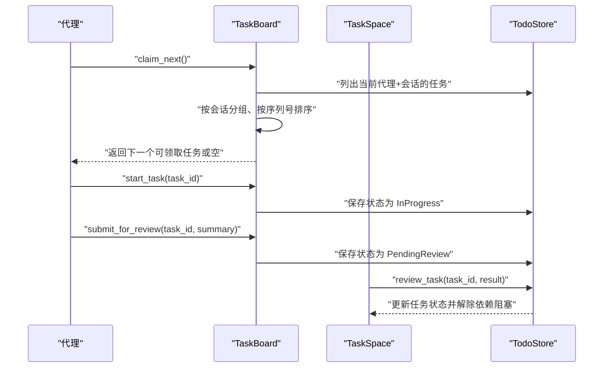
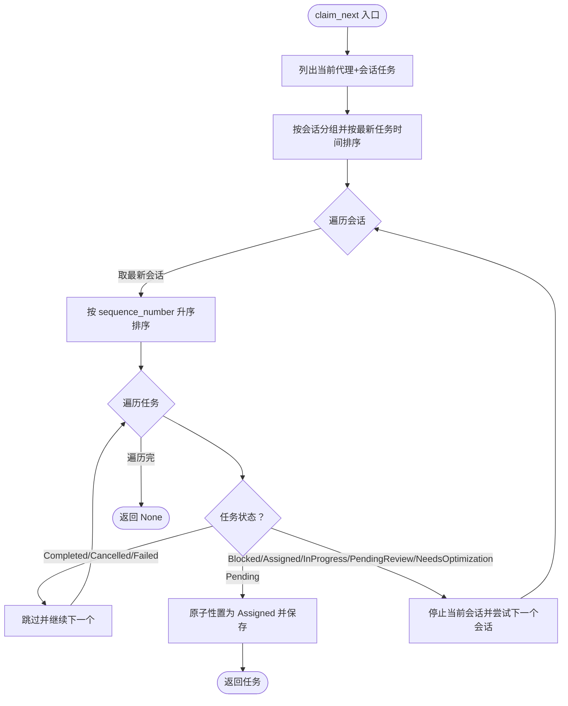
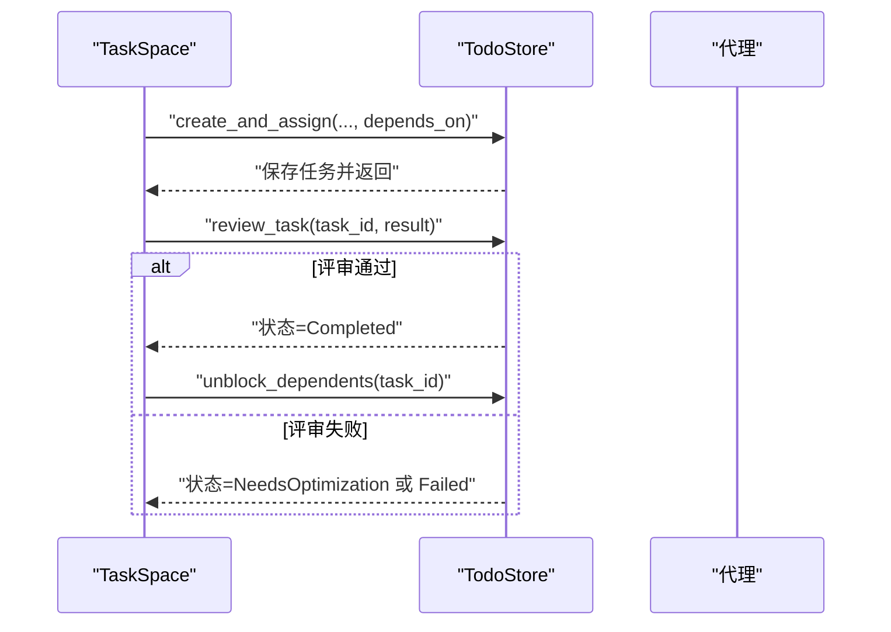
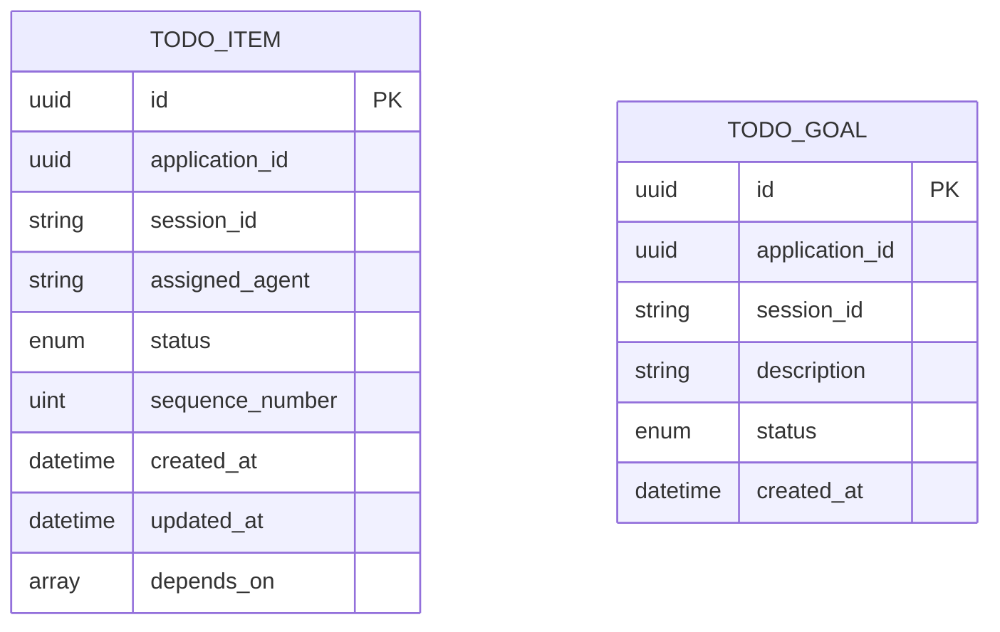
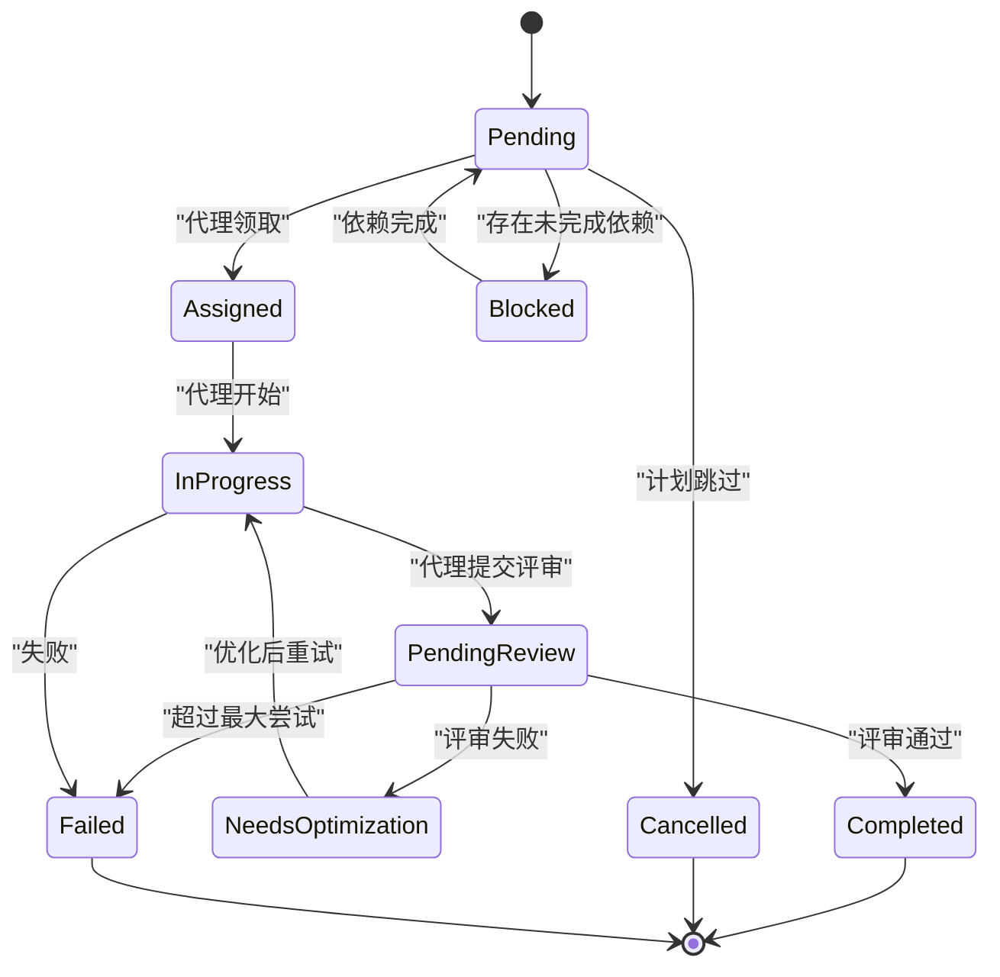
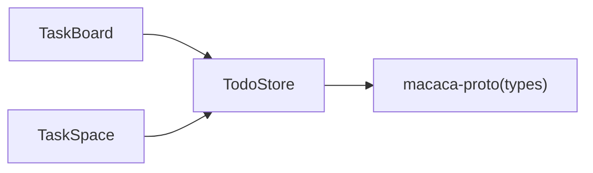

# 任务板管理

<cite>
**本文引用的文件**
- [todo_board.rs](file://macaca/crates/macaca-task/src/todo_board.rs)
- [todo_store.rs](file://macaca/crates/macaca-task/src/todo_store.rs)
- [types.rs](file://macaca/crates/macaca-proto/src/types.rs)
- [design.md](file://openspec/changes/refactor-sequential-task-execution/design.md)
- [task-execution-ordering/spec.md](file://openspec/changes/refactor-sequential-task-execution/specs/task-execution-ordering/spec.md)
- [task_lifecycle.rs](file://macaca/crates/macaca-integration-tests/tests/task_lifecycle.rs)
</cite>

## 目录
1. [简介](#简介)
2. [项目结构](#项目结构)
3. [核心组件](#核心组件)
4. [架构总览](#架构总览)
5. [详细组件分析](#详细组件分析)
6. [依赖关系分析](#依赖关系分析)
7. [性能考量](#性能考量)
8. [故障排查指南](#故障排查指南)
9. [结论](#结论)
10. [附录](#附录)

## 简介
本文件系统化阐述任务板管理子系统的设计与实现，重点覆盖以下方面：
- TaskBoard（代理隔离的任务面板）与 TaskSpace（应用级工作空间）的职责划分与隔离策略
- 任务生命周期管理：创建、状态转换、优先级与顺序控制、依赖关系处理
- 任务声明机制：按序列号的顺序执行策略与会话隔离机制
- 任务状态管理流程：涵盖 Pending、Assigned、InProgress、PendingReview、NeedsOptimization、Completed、Blocked、Failed、Cancelled 的转换规则
- 任务板操作 API 使用示例：claim_next、start_task、submit_for_review、update_progress 等方法的调用与返回说明

## 项目结构
任务板管理位于 macaca-task crate，核心模块如下：
- todo_board.rs：TaskBoard 与 TaskSpace 的实现
- todo_store.rs：基于 RedbStore 的持久化存储与键空间设计
- types.rs：任务与状态枚举、数据模型定义
- openspec 设计与规范：顺序执行、跨代理依赖、会话隔离等设计决策
- 集成测试：验证 TaskTracker 与 TaskQueue 的协作生命周期

图表来源
- [todo_board.rs:67-230](file://macaca/crates/macaca-task/src/todo_board.rs#L67-L230)
- [todo_store.rs:27-332](file://macaca/crates/macaca-task/src/todo_store.rs#L27-L332)
- [types.rs:360-478](file://macaca/crates/macaca-proto/src/types.rs#L360-L478)

章节来源
- [todo_board.rs:1-678](file://macaca/crates/macaca-task/src/todo_board.rs#L1-L678)
- [todo_store.rs:1-468](file://macaca/crates/macaca-task/src/todo_store.rs#L1-L468)
- [types.rs:360-478](file://macaca/crates/macaca-proto/src/types.rs#L360-L478)

## 核心组件
- TaskBoard：每个代理拥有独立的任务面板，仅可见与修改自身面板的任务。提供按序列号严格顺序的“领取下一任务”能力，并支持启动、提交评审、更新进度、失败标记等操作。
- TaskSpace：应用级工作空间，Plan Agent/Coordinator 专用，负责任务创建与分配、依赖阻塞/解除、评审、跳过、总体进度统计、目标（Goal）管理等。
- TodoStore：统一的持久化存储，采用“应用-会话-代理-任务”的键空间设计，确保跨会话与会话内查询的一致性与隔离性。
- 类型与状态：TodoItem/TodoStatus/TodoReviewResult 等类型定义，明确任务内容、生命周期、评审结果与依赖关系。

章节来源
- [todo_board.rs:67-230](file://macaca/crates/macaca-task/src/todo_board.rs#L67-L230)
- [todo_store.rs:27-332](file://macaca/crates/macaca-task/src/todo_store.rs#L27-L332)
- [types.rs:360-478](file://macaca/crates/macaca-proto/src/types.rs#L360-L478)

## 架构总览
任务板管理采用“代理隔离 + 应用级协调”的双层架构：
- 代理侧（TaskBoard）：pull-based 的任务领取与执行，严格按序列号顺序推进，避免跨代理竞态与无序执行。
- 协调侧（TaskSpace）：集中式的目标分解、任务创建与分配、依赖管理、评审与异常处理，保障跨代理的阶段编排与一致性。

图表来源
- [todo_board.rs:94-187](file://macaca/crates/macaca-task/src/todo_board.rs#L94-L187)
- [todo_board.rs:319-358](file://macaca/crates/macaca-task/src/todo_board.rs#L319-L358)
- [todo_store.rs:75-121](file://macaca/crates/macaca-task/src/todo_store.rs#L75-L121)

## 详细组件分析

### TaskBoard：代理隔离的任务面板
- 作用域与隔离
  - 仅访问当前应用、当前会话、当前代理的任务集合，确保代理间互不可见。
  - 会话内按最新任务创建时间倒序，优先处理最近会话；同一会话内按 sequence_number 升序领取。
- 关键方法
  - claim_next：严格按序列号顺序返回下一个可领取任务；若最小序号任务非 Pending 或处于 Blocked/Assigned/InProgress/PendingReview/NeedsOptimization，则停止当前会话尝试，切换到更早的会话。
  - start_task：将状态从 Assigned/NeedsOptimization 切换为 InProgress，并增加尝试次数。
  - submit_for_review：将状态从 InProgress 切换为 PendingReview，并记录完成摘要。
  - update_progress：在 InProgress 时追加进度消息。
  - mark_failed：将任务标记为 Failed，并记录错误反馈。
  - current_task/has_pending_tasks/needs_optimization_tasks/list_all：查询当前进行中、是否有待领取、需要优化、全部任务等。
- 顺序与依赖
  - 顺序：以 sequence_number 为主序，同一会话内严格从前到后推进。
  - 依赖：Blocked 任务会阻断其后所有任务的领取，直至依赖完成。

图表来源
- [todo_board.rs:94-146](file://macaca/crates/macaca-task/src/todo_board.rs#L94-L146)

章节来源
- [todo_board.rs:67-230](file://macaca/crates/macaca-task/src/todo_board.rs#L67-L230)

### TaskSpace：应用级工作空间
- 作用域与隔离
  - 可按会话范围或跨会话范围查询与操作任务；Plan Agent/Coordinator 专用。
- 关键方法
  - create_and_assign：自动分配 sequence_number，检查依赖是否满足，必要时置为 Blocked，然后保存。
  - review_task：校验状态为 PendingReview，依据评审结果切换为 Completed/Failed/NeedsOptimization，并在完成后解除依赖阻塞。
  - skip_task：将 Pending/Blocked 任务标记为 Cancelled，并触发依赖重新评估。
  - pending_reviews/all_tasks_done/overall_progress：跨会话聚合查询，用于监控与汇报。
  - push_goal/pop_goal/complete_goal/list_goals：目标管理，支撑 LLM 分解与评估。
  - reassign_task：在代理间重分配任务（删除旧键、更新状态为 Pending、保存到新代理键）。
- 依赖与阻塞
  - 未满足依赖：创建时直接置为 Blocked
  - 依赖完成：自动解除阻塞，变为 Pending
  - 依赖取消/失败：依赖项变更，但阻塞任务仍保持 Blocked（由 PlanLoop 检测异常）

图表来源
- [todo_board.rs:268-358](file://macaca/crates/macaca-task/src/todo_board.rs#L268-L358)
- [todo_board.rs:378-406](file://macaca/crates/macaca-task/src/todo_board.rs#L378-L406)

章节来源
- [todo_board.rs:232-509](file://macaca/crates/macaca-task/src/todo_board.rs#L232-L509)

### TodoStore：持久化与键空间设计
- 键空间
  - 任务键：todo/{app_id}/{session_id}/{agent}/{task_id}
  - 目标键：goal/{app_id}/{session_id}/{goal_id}
  - 当 session_id 为空时，使用 _global_ 作为占位符，以兼容跨会话扫描。
- 查询与操作
  - 会话范围：精确前缀匹配
  - 应用范围：应用前缀扫描
  - 代理范围：过滤 agent 字段
  - 跨会话：扫描应用前缀并按 agent 过滤
- 特性
  - 每次状态变更立即持久化，保证崩溃恢复
  - 提供序列号迁移（legacy sequence_number=0 → created_at 排序赋值）
  - 提供回滚 IN_PROGRESS/ASSIGNED 为 PENDING 的恢复能力

图表来源
- [todo_store.rs:16-71](file://macaca/crates/macaca-task/src/todo_store.rs#L16-L71)
- [types.rs:383-430](file://macaca/crates/macaca-proto/src/types.rs#L383-L430)
- [types.rs:481-491](file://macaca/crates/macaca-proto/src/types.rs#L481-L491)

章节来源
- [todo_store.rs:27-332](file://macaca/crates/macaca-task/src/todo_store.rs#L27-L332)

### 任务状态管理流程
- 状态枚举与含义
  - Pending：等待代理领取
  - Assigned：代理已确认
  - InProgress：代理执行中
  - PendingReview：代理完成，等待评审
  - NeedsOptimization：评审失败，建议优化
  - Completed：评审通过，完成
  - Blocked：依赖未满足
  - Cancelled：计划跳过
  - Failed：超过最大尝试次数
- 转换规则
  - 代理侧：claim_next → Assigned；start_task → InProgress；submit_for_review → PendingReview；update_progress → 记录进度；mark_failed → Failed
  - 协调侧：review_task → Completed/NeedsOptimization/Failed；skip_task → Cancelled；unblock_dependents → 将 Blocked 解除为 Pending
- 异常与恢复
  - 失败任务不会自动取消后续任务，由 PlanLoop 通过 AnomalyDetected 事件决策
  - 崩溃恢复：TodoStore 将 IN_PROGRESS/ASSIGNED 回滚为 PENDING

图表来源
- [types.rs:360-381](file://macaca/crates/macaca-proto/src/types.rs#L360-L381)
- [todo_board.rs:319-358](file://macaca/crates/macaca-task/src/todo_board.rs#L319-L358)

章节来源
- [types.rs:360-381](file://macaca/crates/macaca-proto/src/types.rs#L360-L381)
- [todo_board.rs:319-358](file://macaca/crates/macaca-task/src/todo_board.rs#L319-L358)

### 任务声明机制与会话隔离
- 顺序执行策略
  - 同一 agent+session 内，严格按 sequence_number 升序执行；最小序号任务非 Pending 时，后续任务不会被领取。
- 会话隔离
  - TaskBoard/TaskSpace 可按 session_id 进行会话范围查询；当 session_id 为空时，执行跨会话扫描。
- 依赖声明
  - TaskSpace.create_and_assign 在创建时检查 depends_on，若未满足则置为 Blocked；完成后自动解除阻塞。
- 规范与设计
  - 顺序执行、跨代理依赖、序列号自动分配、依赖解析增强等设计与规范详见 openspec 文档。

章节来源
- [design.md:1-136](file://openspec/changes/refactor-sequential-task-execution/design.md#L1-L136)
- [task-execution-ordering/spec.md:1-76](file://openspec/changes/refactor-sequential-task-execution/specs/task-execution-ordering/spec.md#L1-L76)
- [todo_board.rs:94-146](file://macaca/crates/macaca-task/src/todo_board.rs#L94-L146)
- [todo_board.rs:268-317](file://macaca/crates/macaca-task/src/todo_board.rs#L268-L317)

### API 使用示例与返回说明
以下为常用任务板操作 API 的调用说明与返回语义（返回值为布尔或对象，具体取决于方法定义）：
- claim_next
  - 功能：按序列号顺序领取下一个可执行任务
  - 返回：成功返回领取到的任务对象；若无可用任务或最小序号任务非 Pending，则返回空
  - 适用：代理侧 TaskBoard
- start_task(task_id)
  - 功能：将任务状态从 Assigned/NeedsOptimization 切换为 InProgress
  - 返回：布尔，表示是否成功更新
  - 适用：代理侧 TaskBoard
- submit_for_review(task_id, summary)
  - 功能：将任务状态从 InProgress 切换为 PendingReview，并记录完成摘要
  - 返回：布尔，表示是否成功更新
  - 适用：代理侧 TaskBoard
- update_progress(task_id, message)
  - 功能：在 InProgress 时追加进度消息
  - 返回：布尔，表示是否成功更新
  - 适用：代理侧 TaskBoard
- mark_failed(task_id, error)
  - 功能：将任务标记为 Failed，并记录错误反馈
  - 返回：布尔，表示是否成功更新
  - 适用：代理侧 TaskBoard
- current_task()/has_pending_tasks()/needs_optimization_tasks()/list_all()
  - 功能：查询当前进行中、是否有待领取、需要优化、全部任务等
  - 返回：对象或布尔
  - 适用：代理侧 TaskBoard

章节来源
- [todo_board.rs:94-229](file://macaca/crates/macaca-task/src/todo_board.rs#L94-L229)

## 依赖关系分析
- 组件耦合
  - TaskBoard/TaskSpace 依赖 TodoStore 提供统一持久化接口
  - 类型定义集中在 macaca-proto，二者均依赖 TodoItem/TodoStatus/TodoReviewResult 等
- 外部依赖
  - RedbStore：键空间存储与扫描
  - chrono：时间戳与 UTC 时区
  - serde：JSON 序列化/反序列化
- 循环依赖
  - 未发现直接循环依赖；TodoStore 仅提供 CRUD，不依赖 TaskBoard/TaskSpace

图表来源
- [todo_board.rs:10-12](file://macaca/crates/macaca-task/src/todo_board.rs#L10-L12)
- [todo_store.rs:13-14](file://macaca/crates/macaca-task/src/todo_store.rs#L13-L14)
- [types.rs:360-478](file://macaca/crates/macaca-proto/src/types.rs#L360-L478)

章节来源
- [todo_board.rs:10-12](file://macaca/crates/macaca-task/src/todo_board.rs#L10-L12)
- [todo_store.rs:13-14](file://macaca/crates/macaca-task/src/todo_store.rs#L13-L14)
- [types.rs:360-478](file://macaca/crates/macaca-proto/src/types.rs#L360-L478)

## 性能考量
- 存储与索引
  - TodoStore 使用前缀键空间，会话范围查询为精确匹配；跨会话查询为扫描，建议在高频场景下合理使用 session_id 缩小查询范围
- 排序与查询
  - TaskBoard 在内存中对任务按会话与序列号进行排序，复杂度与任务数量线性相关；建议控制单会话任务规模
- 状态变更
  - 每次状态变更立即持久化，保证一致性但可能带来写放大；可通过批量写入策略优化（需评估一致性需求）

## 故障排查指南
- 任务长时间处于 Blocked
  - 检查依赖任务是否已完成；TaskSpace.review_task 完成后应自动解除阻塞
  - 若依赖项被取消/失败，阻塞任务仍保持 Blocked，需由 PlanLoop 检测异常并决策
- 任务领取不到
  - 确认最小序号任务是否为 Pending；若 Blocked/Assigned/InProgress/PendingReview/NeedsOptimization，将阻止后续领取
  - 检查会话范围与代理归属是否正确
- 评审失败后任务卡住
  - 状态应为 NeedsOptimization；代理修复后可再次提交评审
- 崩溃恢复
  - TodoStore 会在重启时将 IN_PROGRESS/ASSIGNED 回滚为 PENDING，确保一致性

章节来源
- [todo_board.rs:319-358](file://macaca/crates/macaca-task/src/todo_board.rs#L319-L358)
- [todo_store.rs:181-191](file://macaca/crates/macaca-task/src/todo_store.rs#L181-L191)

## 结论
本任务板管理子系统通过“代理隔离 + 应用级协调”的架构，结合严格的序列号顺序执行与会话隔离机制，实现了可控、可追踪、可恢复的任务生命周期管理。TaskBoard/TaskSpace/TodoStore 三者职责清晰、边界明确，配合 openspec 的设计规范，能够有效支撑复杂应用的阶段化与流水线式任务编排。

## 附录
- 相关集成测试：验证 TaskTracker 与 TaskQueue 的协作生命周期，可作为任务生命周期 API 使用的参考示例
- 设计与规范：openspec 中关于顺序执行、跨代理依赖、序列号自动分配与会话隔离的详细说明

章节来源
- [task_lifecycle.rs:1-210](file://macaca/crates/macaca-integration-tests/tests/task_lifecycle.rs#L1-L210)
- [design.md:1-136](file://openspec/changes/refactor-sequential-task-execution/design.md#L1-L136)
- [task-execution-ordering/spec.md:1-76](file://openspec/changes/refactor-sequential-task-execution/specs/task-execution-ordering/spec.md#L1-L76)