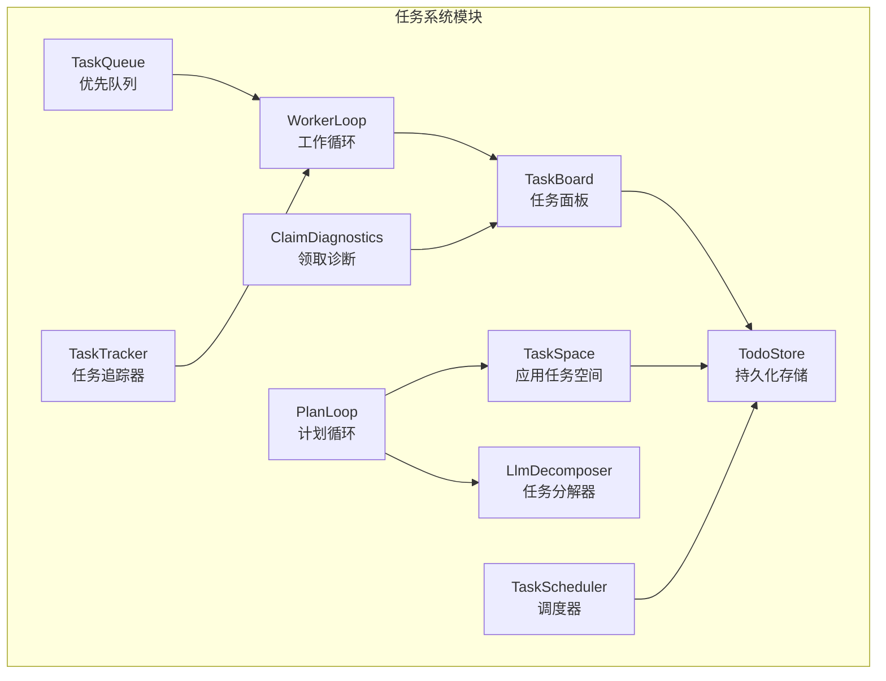
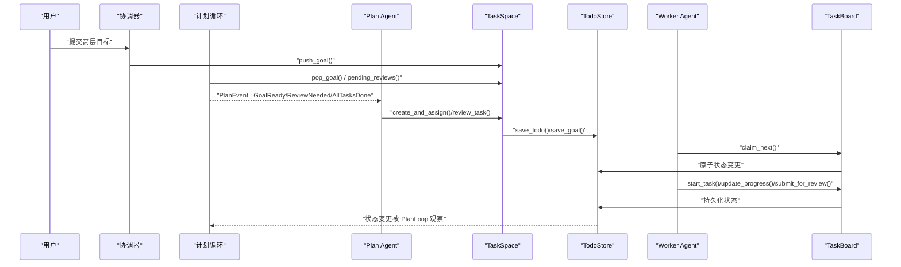
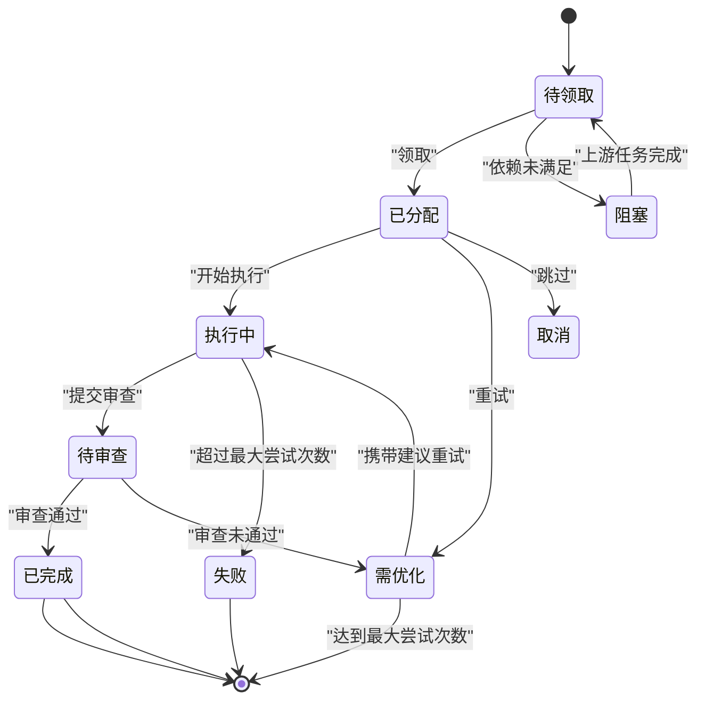
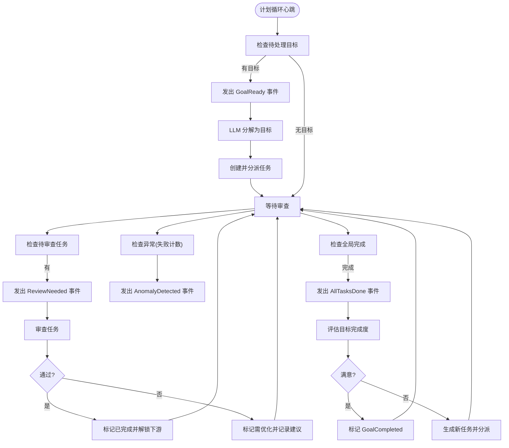
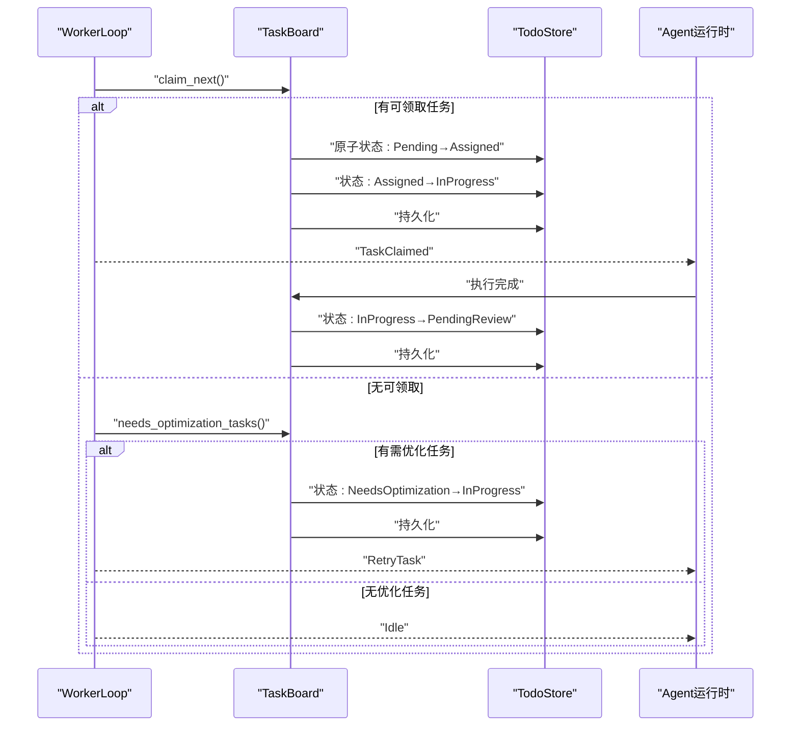
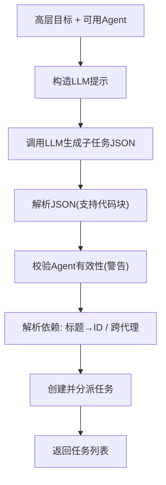
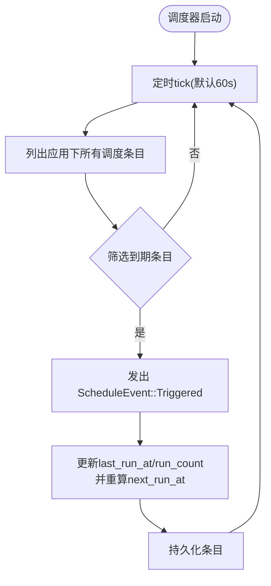
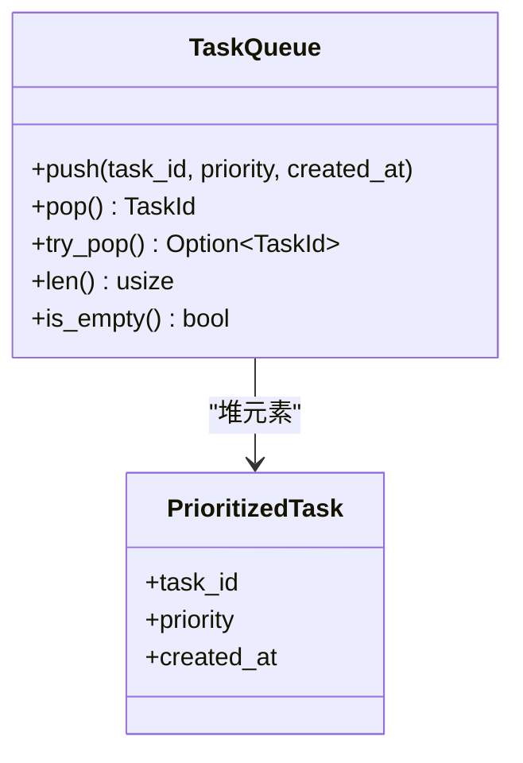
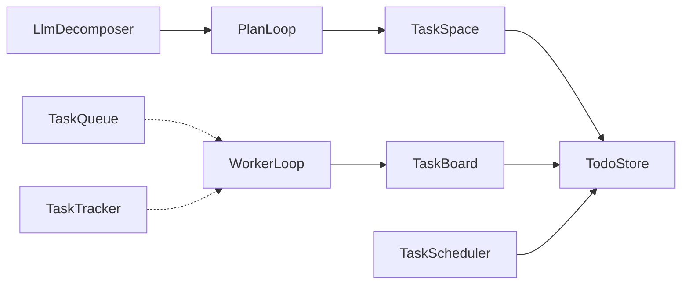

# 任务管理系统

<cite>
**本文档引用的文件**
- [Cargo.toml](file://macaca/Cargo.toml)
- [lib.rs](file://macaca/crates/macaca-task/src/lib.rs)
- [todo_board.rs](file://macaca/crates/macaca-task/src/todo_board.rs)
- [todo_store.rs](file://macaca/crates/macaca-task/src/todo_store.rs)
- [plan_loop.rs](file://macaca/crates/macaca-task/src/plan_loop.rs)
- [worker_loop.rs](file://macaca/crates/macaca-task/src/worker_loop.rs)
- [decompose.rs](file://macaca/crates/macaca-task/src/decompose.rs)
- [scheduler.rs](file://macaca/crates/macaca-task/src/scheduler.rs)
- [queue.rs](file://macaca/crates/macaca-task/src/queue.rs)
- [tracker.rs](file://macaca/crates/macaca-task/src/tracker.rs)
- [claim_diagnostics.rs](file://macaca/crates/macaca-task/src/claim_diagnostics.rs)
- [task-todo-system-design.md](file://macaca/docs/task-todo-system-design.md)
- [task-routing-design.md](file://macaca/docs/task-routing-design.md)
- [run-trace-framework.md](file://macaca/docs/run-trace-framework.md)
- [system-integration-audit.md](file://macaca/docs/system-integration-audit.md)
</cite>

## 更新摘要
**所做更改**
- 更新计划循环（PlanLoop）实现，包括改进的去重机制和异常检测
- 增强待办事项板（TaskBoard）的领取逻辑和会话隔离功能
- 改进工作循环（WorkerLoop）的空闲检测和任务重试机制
- 新增任务分解器的依赖解析和跨代理依赖支持
- 增强调度器的持久化和事件处理能力
- 完善诊断工具的会话级分析功能

## 目录
1. [简介](#简介)
2. [项目结构](#项目结构)
3. [核心组件](#核心组件)
4. [架构总览](#架构总览)
5. [详细组件分析](#详细组件分析)
6. [依赖关系分析](#依赖关系分析)
7. [性能考量](#性能考量)
8. [故障排查指南](#故障排查指南)
9. [结论](#结论)
10. [附录](#附录)

## 简介
本文件面向"任务管理系统"的综合技术文档，围绕任务板设计与工作流引擎实现展开，涵盖任务创建、状态转换、优先级管理、依赖关系处理、队列系统与工作循环机制、任务调度算法与并发执行控制、任务分解与计划循环、追踪器与诊断工具等。文档同时提供生命周期管理、状态持久化、事件广播等机制的实现细节，并给出任务配置示例、性能优化建议与监控指标说明。

## 项目结构
本系统位于 macaca 工作区的 macaca-task crate 中，采用模块化组织，核心模块包括：
- 任务板与任务空间：TaskBoard、TaskSpace、ProgressSummary
- 任务存储：TodoStore（基于 RedbStore 的键空间设计）
- 计划循环：PlanLoop（事件驱动的调度循环）
- 工作循环：WorkerLoop（Agent 自主拉取任务的执行循环）
- 任务分解：LlmDecomposer（LLM 驱动的任务分解器）
- 调度器：TaskScheduler（cron/固定间隔调度）
- 队列：TaskQueue（优先队列）
- 追踪器：TaskTracker（内存态任务追踪）
- 诊断：ClaimDiagnostics（任务领取阻塞诊断）

**图表来源**
- [lib.rs:1-22](file://macaca/crates/macaca-task/src/lib.rs#L1-L22)
- [todo_board.rs:67-230](file://macaca/crates/macaca-task/src/todo_board.rs#L67-L230)
- [todo_store.rs:27-332](file://macaca/crates/macaca-task/src/todo_store.rs#L27-L332)
- [plan_loop.rs:55-270](file://macaca/crates/macaca-task/src/plan_loop.rs#L55-L270)
- [worker_loop.rs:69-217](file://macaca/crates/macaca-task/src/worker_loop.rs#L69-L217)
- [decompose.rs:51-227](file://macaca/crates/macaca-task/src/decompose.rs#L51-L227)
- [scheduler.rs:218-367](file://macaca/crates/macaca-task/src/scheduler.rs#L218-L367)
- [queue.rs:42-91](file://macaca/crates/macaca-task/src/queue.rs#L42-L91)
- [tracker.rs:12-173](file://macaca/crates/macaca-task/src/tracker.rs#L12-L173)
- [claim_diagnostics.rs:86-214](file://macaca/crates/macaca-task/src/claim_diagnostics.rs#L86-L214)

**章节来源**
- [Cargo.toml:1-90](file://macaca/Cargo.toml#L1-L90)
- [lib.rs:1-22](file://macaca/crates/macaca-task/src/lib.rs#L1-L22)

## 核心组件
- 任务板与任务空间
  - TaskBoard：每个 Agent 的独立任务面板，提供领取、开始、提交审查、进度更新、失败标记、查询等功能。
  - TaskSpace：应用级任务空间，Plan Agent/协调器访问，提供任务创建与分派、审查、进度统计、目标管理、依赖解除与重评估等。
- 持久化存储
  - TodoStore：以"应用/会话/代理"三层隔离的键空间存储任务与目标，支持即时持久化与崩溃恢复。
- 计划循环
  - PlanLoop：事件驱动的计划循环，周期性检查目标、待审查任务、异常与全局完成状态，发出 PlanEvent 供 Plan Agent 处理。
- 工作循环
  - WorkerLoop：Agent 自主拉取任务的执行循环，周期性心跳检查，支持优化重试与空闲状态。
- 任务分解
  - LlmDecomposer：将高层目标分解为结构化子任务，支持跨代理依赖与序列号排序。
- 调度器
  - TaskScheduler：支持 cron 与固定间隔的调度，触发后产生 ScheduleEvent，由调用方创建目标或任务。
- 队列与追踪
  - TaskQueue：基于二叉堆的优先队列，支持通知唤醒。
  - TaskTracker：内存态任务追踪器，维护任务状态与结果映射。
- 诊断
  - ClaimDiagnostics：诊断 Agent 面板上 Pending 任务为何未被领取，严格遵循序列顺序规则。

**章节来源**
- [todo_board.rs:67-230](file://macaca/crates/macaca-task/src/todo_board.rs#L67-L230)
- [todo_store.rs:27-332](file://macaca/crates/macaca-task/src/todo_store.rs#L27-L332)
- [plan_loop.rs:55-270](file://macaca/crates/macaca-task/src/plan_loop.rs#L55-L270)
- [worker_loop.rs:69-217](file://macaca/crates/macaca-task/src/worker_loop.rs#L69-L217)
- [decompose.rs:51-227](file://macaca/crates/macaca-task/src/decompose.rs#L51-L227)
- [scheduler.rs:218-367](file://macaca/crates/macaca-task/src/scheduler.rs#L218-L367)
- [queue.rs:42-91](file://macaca/crates/macaca-task/src/queue.rs#L42-L91)
- [tracker.rs:12-173](file://macaca/crates/macaca-task/src/tracker.rs#L12-L173)
- [claim_diagnostics.rs:86-214](file://macaca/crates/macaca-task/src/claim_diagnostics.rs#L86-L214)

## 架构总览
系统采用"事件驱动 + 持久化 + 三层隔离"的架构：
- 事件驱动：PlanLoop 与 WorkerLoop 通过 tokio mpsc 通道发出事件，Plan Agent/Worker Agent 根据事件采取行动。
- 持久化：TodoStore 以独立键存储任务与目标，确保崩溃恢复与跨重启一致性。
- 三层隔离：应用级隔离、会话级隔离、代理级隔离，保障数据与可见性边界。

**图表来源**
- [plan_loop.rs:93-269](file://macaca/crates/macaca-task/src/plan_loop.rs#L93-L269)
- [todo_board.rs:98-230](file://macaca/crates/macaca-task/src/todo_board.rs#L98-L230)
- [todo_store.rs:75-332](file://macaca/crates/macaca-task/src/todo_store.rs#L75-L332)

## 详细组件分析

### 任务板与任务空间
- 任务状态机与转换
  - 支持 Pending → Assigned → InProgress → PendingReview → (Completed/NeedsOptimization/Blocked/Cancelled/Failed) 等状态转换。
  - 依赖管理：Blocked 任务在上游全部 Completed 后自动解锁为 Pending。
  - 会话隔离：同一 Agent 的任务按会话分组，不同会话独立排序与领取。
- 关键能力
  - claim_next：严格按 sequence_number 顺序，遇到首个非终端任务即停止后续会话尝试。
  - start_task：将 Assigned/NeedsOptimization 转换为 InProgress。
  - submit_for_review：将 InProgress 转为 PendingReview。
  - update_progress：在 InProgress 期间记录进度消息。
  - mark_failed：超过最大尝试次数标记为 Failed。
  - has_pending_tasks/current_task/list_all/needs_optimization_tasks 等辅助查询。

**图表来源**
- [todo_board.rs:98-230](file://macaca/crates/macaca-task/src/todo_board.rs#L98-L230)

**章节来源**
- [todo_board.rs:67-230](file://macaca/crates/macaca-task/src/todo_board.rs#L67-L230)
- [todo_board.rs:378-406](file://macaca/crates/macaca-task/src/todo_board.rs#L378-L406)

### 计划循环（PlanLoop）
- 周期性检查
  - 目标：pop_pending_goal → 触发分解 → create_and_assign → 状态推进。
  - 审查：pending_reviews → review_task → Completed 或 NeedsOptimization。
  - 异常：失败计数上升 → AnomalyDetected。
  - 全局完成：all_tasks_done → AllTasksDone → 评估 → GoalCompleted。
- 事件类型
  - GoalReady、ReviewNeeded、AllTasksDone、AnomalyDetected、EvaluateGoalCompletion、GoalCompleted。

**图表来源**
- [plan_loop.rs:93-269](file://macaca/crates/macaca-task/src/plan_loop.rs#L93-L269)

**章节来源**
- [plan_loop.rs:55-270](file://macaca/crates/macaca-task/src/plan_loop.rs#L55-L270)

### 工作循环（WorkerLoop）
- 自主拉取与执行
  - claim_next → start_task → 发出 TaskClaimed → 等待任务状态变化 → 继续领取。
  - 若无可领取任务，检查 NeedsOptimization 任务 → start_task → 发出 RetryTask。
  - 空闲时以心跳间隔轮询，避免忙等。
- 事件类型
  - TaskClaimed、RetryTask、Idle。

**图表来源**
- [worker_loop.rs:102-217](file://macaca/crates/macaca-task/src/worker_loop.rs#L102-L217)
- [todo_board.rs:98-230](file://macaca/crates/macaca-task/src/todo_board.rs#L98-L230)

**章节来源**
- [worker_loop.rs:69-217](file://macaca/crates/macaca-task/src/worker_loop.rs#L69-L217)

### 任务分解（LlmDecomposer）
- 输入：高层目标描述、可用 Agent 列表。
- 输出：结构化子任务数组（标题、描述、指派 Agent、优先级、序列号、验收标准、依赖等）。
- 依赖解析：支持同代理依赖（按标题映射）与跨代理依赖（按 Agent/任务标题映射）。
- 安全与容错：输出 JSON 解析容错，未知 Agent 警告但不中断。

**图表来源**
- [decompose.rs:62-227](file://macaca/crates/macaca-task/src/decompose.rs#L62-L227)

**章节来源**
- [decompose.rs:51-227](file://macaca/crates/macaca-task/src/decompose.rs#L51-L227)

### 调度器（TaskScheduler）
- 支持 cron 与固定间隔两种调度方式，统一以 ScheduleEntry 存储。
- 定时轮询（默认 60s）检查到期条目，发出 ScheduleEvent，调用方据此创建目标或任务。
- 关键能力：创建/删除/启用禁用、计算下次运行时间、持久化。

**图表来源**
- [scheduler.rs:316-366](file://macaca/crates/macaca-task/src/scheduler.rs#L316-L366)

**章节来源**
- [scheduler.rs:218-367](file://macaca/crates/macaca-task/src/scheduler.rs#L218-L367)

### 队列系统（TaskQueue）
- 基于二叉堆的优先队列，支持通知唤醒与非阻塞弹出。
- 排序规则：优先级高者优先；同优先级按创建时间早者优先。

**图表来源**
- [queue.rs:42-91](file://macaca/crates/macaca-task/src/queue.rs#L42-L91)

**章节来源**
- [queue.rs:42-91](file://macaca/crates/macaca-task/src/queue.rs#L42-L91)

### 任务追踪器（TaskTracker）
- 内存态追踪：维护任务与结果映射，支持创建、分配、开始、完成、失败、查询状态与结果。
- 用于短期任务编排与测试场景，不替代持久化存储。

**章节来源**
- [tracker.rs:12-173](file://macaca/crates/macaca-task/src/tracker.rs#L12-L173)

### 领取诊断（ClaimDiagnostics）
- 针对"Pending 任务未被领取"的常见阻塞原因进行诊断：
  - 首个非终端任务为 Pending：可领取。
  - 首个非终端任务为 Blocked：等待上游依赖完成。
  - 首个非终端任务为 Assigned/InProgress/PendingReview/NeedsOptimization：严格顺序导致后续 Pending 无法被跳过。
- 输出每代理的摘要与首道闸门信息，便于定位瓶颈。

**章节来源**
- [claim_diagnostics.rs:86-214](file://macaca/crates/macaca-task/src/claim_diagnostics.rs#L86-L214)

## 依赖关系分析
- 模块耦合
  - TaskBoard 依赖 TodoStore 进行读写；TaskSpace 作为 TaskBoard 的聚合视图，同样依赖 TodoStore。
  - PlanLoop 与 WorkerLoop 通过事件通道与外部协作，内部仅依赖 TaskSpace/TaskBoard。
  - LlmDecomposer 依赖 LLM 提供者，PlanLoop 本身不直接调用 LLM，而是通过事件驱动外部执行。
  - TaskScheduler 与 TaskQueue 独立于任务状态机，仅通过事件与业务逻辑交互。
- 外部依赖
  - RedbStore：KV 存储后端，提供键空间隔离与持久化。
  - Tokio：异步运行时与通知机制。
  - Chrono：时间与时序管理。
  - Serde：序列化与反序列化。

**图表来源**
- [lib.rs:1-22](file://macaca/crates/macaca-task/src/lib.rs#L1-L22)
- [todo_store.rs:27-332](file://macaca/crates/macaca-task/src/todo_store.rs#L27-L332)
- [plan_loop.rs:55-270](file://macaca/crates/macaca-task/src/plan_loop.rs#L55-L270)
- [worker_loop.rs:69-217](file://macaca/crates/macaca-task/src/worker_loop.rs#L69-L217)
- [decompose.rs:51-227](file://macaca/crates/macaca-task/src/decompose.rs#L51-L227)
- [scheduler.rs:218-367](file://macaca/crates/macaca-task/src/scheduler.rs#L218-L367)
- [queue.rs:42-91](file://macaca/crates/macaca-task/src/queue.rs#L42-L91)
- [tracker.rs:12-173](file://macaca/crates/macaca-task/src/tracker.rs#L12-L173)

**章节来源**
- [lib.rs:1-22](file://macaca/crates/macaca-task/src/lib.rs#L1-L22)

## 性能考量
- 存储层面
  - 独立键存储避免大 JSON 读写竞争，即时持久化确保崩溃恢复。
  - 支持跨会话与会话级查询，兼顾灵活性与性能。
- 并发与调度
  - WorkerLoop 与 PlanLoop 基于 tokio::select 与 Notify，避免忙轮询。
  - TaskQueue 使用二叉堆，O(log n) 插入与弹出，适合高吞吐场景。
- 事件驱动
  - PlanLoop 与 WorkerLoop 通过事件通道解耦，降低耦合度与资源占用。
- 优化建议
  - 对高频查询建立索引（如按状态/代理/会话）。
  - 合理设置心跳与检查间隔，平衡延迟与资源消耗。
  - 对 LLM 调用进行缓存与速率限制，避免抖动。

## 故障排查指南
- 任务领取阻塞
  - 使用 ClaimDiagnostics 分析 Agent 面板，确认首道闸门类型（claimable/blocked/sequential_wait）。
  - 检查依赖是否全部 Completed，或是否存在 Assigned/InProgress 等非终端状态。
- 审查与优化
  - ReviewNeeded 事件过多可能意味着任务质量不足或验收标准过高。
  - NeedsOptimization 任务应结合优化建议与尝试次数上限进行治理。
- 异常检测
  - AnomalyDetected 事件指示失败任务数量上升，需关注人工干预阈值。
- 监控与可观测性
  - 使用 run-trace 框架记录关键阶段（plan.loop_started、worker.task_claimed、worker.submit_review 等），便于定位卡点。
  - 结合系统审计报告识别缺失的可观测性模块（如 Metrics/AuditLogger/AlertManager）。

**章节来源**
- [claim_diagnostics.rs:86-214](file://macaca/crates/macaca-task/src/claim_diagnostics.rs#L86-L214)
- [plan_loop.rs:183-191](file://macaca/crates/macaca-task/src/plan_loop.rs#L183-L191)
- [run-trace-framework.md:1-65](file://macaca/docs/run-trace-framework.md#L1-L65)
- [system-integration-audit.md:1-160](file://macaca/docs/system-integration-audit.md#L1-L160)

## 结论
本任务管理系统以事件驱动为核心，结合三层隔离与即时持久化，实现了从高层目标到具体任务的自动化分解与执行。PlanLoop 与 WorkerLoop 分别承担"计划-验证-再决策"与"自主拉取-执行-汇报"的职责，配合 LlmDecomposer、TaskScheduler、TaskQueue 等组件，形成完整的任务生命周期管理闭环。通过 ClaimDiagnostics 与 run-trace 框架，系统具备良好的可运维性与可观测性。建议尽快补齐 CreateGoalTool、WorkerLoop 运行时接入与可观测性模块，以实现端到端的自主任务执行能力。

## 附录

### 任务生命周期与状态转换（参考）
- 生命周期：PENDING → ASSIGNED → IN_PROGRESS → PENDING_REVIEW → (COMPLETED/NEEDS_OPTIMIZATION/BLOCKED/CANCELLED/FAILED)
- 依赖：BLOCKED 由上游任务未完成触发；上游完成后自动解锁为 PENDING
- 优化：审查未通过且未达最大尝试次数 → NEEDS_OPTIMIZATION；Agent 收到建议后重试

**章节来源**
- [task-todo-system-design.md:51-92](file://macaca/docs/task-todo-system-design.md#L51-L92)

### 任务配置示例（参考）
- 目标路由：Coordinator 根据任务复杂度选择 delegate_task 或 create_goal，避免二次分类器
- 工具集：新增 create_goal、create_todo、review_todo、check_todo_progress、claim_task、start_task、submit_task_for_review、list_my_tasks 等

**章节来源**
- [task-routing-design.md:62-83](file://macaca/docs/task-routing-design.md#L62-L83)

### 监控指标与事件（参考）
- run-trace 事件：plan.loop_started、worker.task_claimed、worker.submit_review、plan.review_needed 等
- Prometheus 指标：run_trace_events_total{phase,status}

**章节来源**
- [run-trace-framework.md:52-56](file://macaca/docs/run-trace-framework.md#L52-L56)