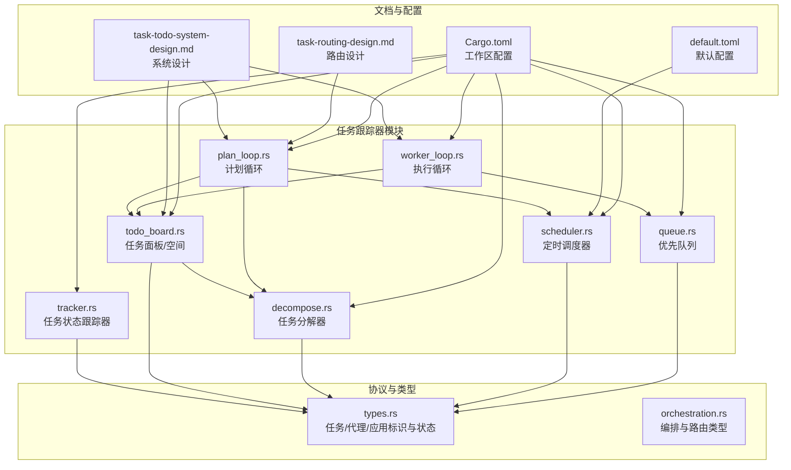
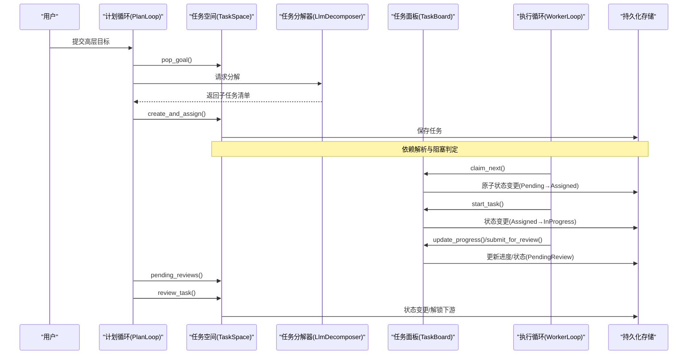
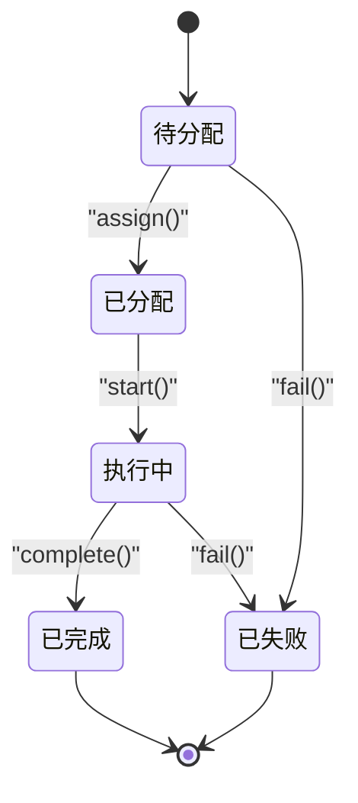
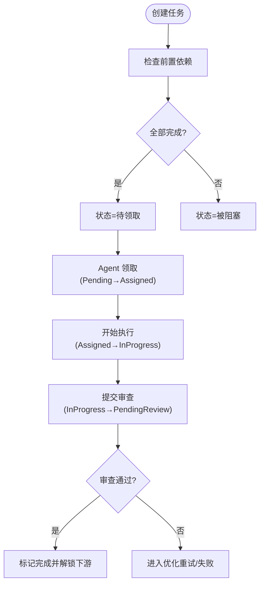
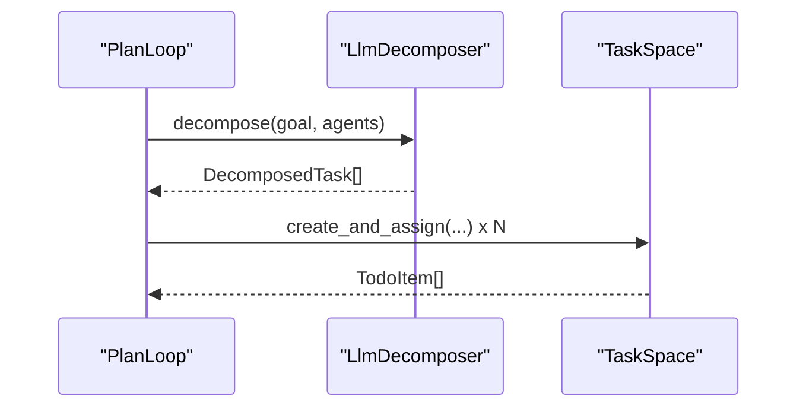
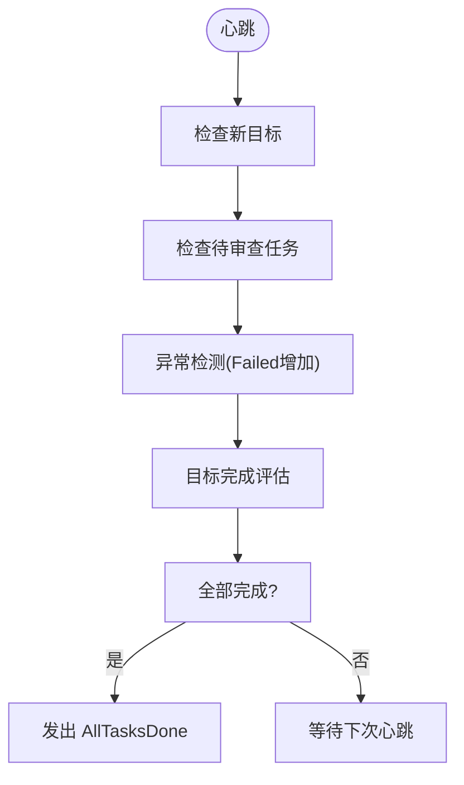
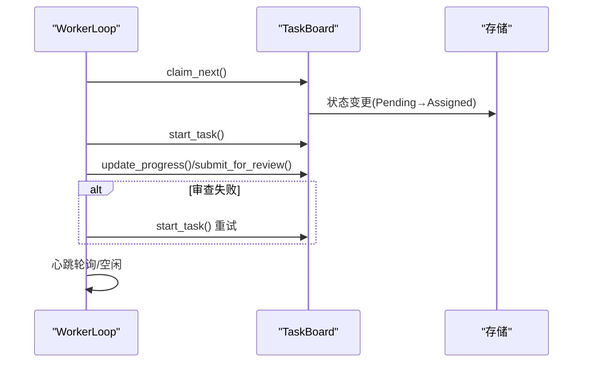
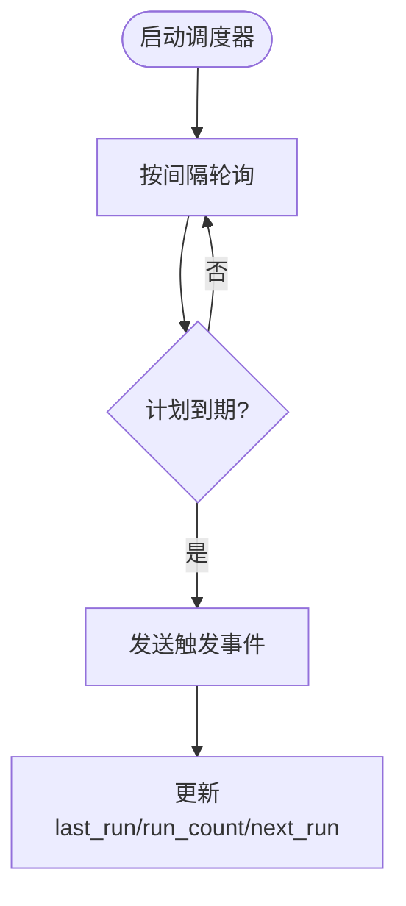
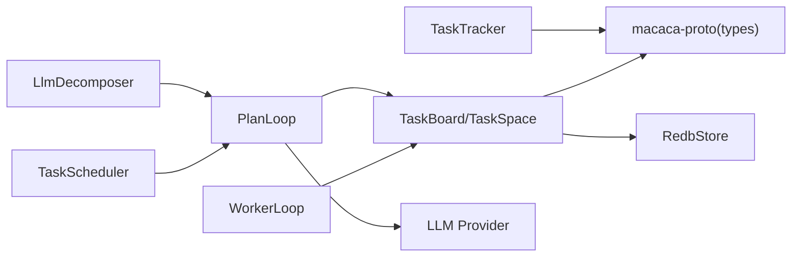

# 任务跟踪器

<cite>
**本文引用的文件**
- [tracker.rs](file://macaca/crates/macaca-task/src/tracker.rs)
- [decompose.rs](file://macaca/crates/macaca-task/src/decompose.rs)
- [todo_board.rs](file://macaca/crates/macaca-task/src/todo_board.rs)
- [scheduler.rs](file://macaca/crates/macaca-task/src/scheduler.rs)
- [queue.rs](file://macaca/crates/macaca-task/src/queue.rs)
- [plan_loop.rs](file://macaca/crates/macaca-task/src/plan_loop.rs)
- [worker_loop.rs](file://macaca/crates/macaca-task/src/worker_loop.rs)
- [lib.rs](file://macaca/crates/macaca-task/src/lib.rs)
- [task-todo-system-design.md](file://macaca/docs/task-todo-system-design.md)
- [task-routing-design.md](file://macaca/docs/task-routing-design.md)
- [types.rs](file://macaca/crates/macaca-proto/src/types.rs)
- [orchestration.rs](file://macaca/crates/macaca-proto/src/orchestration.rs)
- [Cargo.toml](file://macaca/Cargo.toml)
- [default.toml](file://macaca/config/default.toml)
</cite>

## 目录
1. [简介](#简介)
2. [项目结构](#项目结构)
3. [核心组件](#核心组件)
4. [架构总览](#架构总览)
5. [详细组件分析](#详细组件分析)
6. [依赖分析](#依赖分析)
7. [性能考量](#性能考量)
8. [故障排查指南](#故障排查指南)
9. [结论](#结论)
10. [附录](#附录)

## 简介
本文件面向“任务跟踪器”的综合技术文档，覆盖任务状态监控、进度追踪与异常检测机制；任务分解算法与复杂任务的自动拆分策略、子任务生成与依赖关系建立；配置项与定制化能力（跟踪粒度、告警阈值、通知机制）；API 接口说明（start_tracking、stop_tracking、get_status、get_progress 等）；以及与系统其他组件的集成方式与在监控运维中的应用。

## 项目结构
任务跟踪器位于 macaca-task crate 中，围绕“任务生命周期”“任务面板/空间”“计划与执行循环”“调度器”“任务队列”“任务分解器”等模块构建，配合 proto 类型与文档规范，形成端到端的自主任务管理系统。

图示来源
- [lib.rs:1-22](file://macaca/crates/macaca-task/src/lib.rs#L1-L22)
- [Cargo.toml:1-90](file://macaca/Cargo.toml#L1-L90)

章节来源
- [lib.rs:1-22](file://macaca/crates/macaca-task/src/lib.rs#L1-L22)
- [Cargo.toml:1-90](file://macaca/Cargo.toml#L1-L90)

## 核心组件
- 任务状态跟踪器：维护任务状态机与结果存取，提供创建、分配、启动、完成、失败、状态查询、结果查询、按状态/按代理列表等功能。
- 任务面板与空间：为每个 Agent 提供隔离的任务面板，支持任务领取、开始执行、提交审查、进度更新、失败标记等；TaskSpace 提供跨面板的全局视角与审查、进度统计、目标管理等。
- 任务分解器：支持“原子分解”与“LLM 驱动分解”，将高层目标分解为可执行的子任务，解析依赖关系并创建到 TaskSpace。
- 计划循环：周期性检查目标、待审查任务、异常与完成评估，驱动 Plan Agent 行为。
- 执行循环：Worker Agent 自主领取任务、执行、提交审查，支持优化重试与空闲心跳。
- 定时调度器：基于 cron 或固定间隔的计划任务，触发目标入队或直接创建任务。
- 优先队列：按优先级与创建时间排序的任务队列，支撑任务调度与抢占。

章节来源
- [tracker.rs:12-173](file://macaca/crates/macaca-task/src/tracker.rs#L12-L173)
- [todo_board.rs:67-230](file://macaca/crates/macaca-task/src/todo_board.rs#L67-L230)
- [todo_board.rs:252-509](file://macaca/crates/macaca-task/src/todo_board.rs#L252-L509)
- [decompose.rs:10-17](file://macaca/crates/macaca-task/src/decompose.rs#L10-L17)
- [decompose.rs:50-227](file://macaca/crates/macaca-task/src/decompose.rs#L50-L227)
- [plan_loop.rs:55-313](file://macaca/crates/macaca-task/src/plan_loop.rs#L55-L313)
- [worker_loop.rs:69-217](file://macaca/crates/macaca-task/src/worker_loop.rs#L69-L217)
- [scheduler.rs:217-367](file://macaca/crates/macaca-task/src/scheduler.rs#L217-L367)
- [queue.rs:42-91](file://macaca/crates/macaca-task/src/queue.rs#L42-L91)

## 架构总览
任务跟踪器采用“Pull 式”自治架构：Plan Agent 作为“项目经理”，负责目标分解、任务分派、质量审查与整体进度评估；Worker Agent 作为“执行者”，从各自面板主动领取任务、执行、提交审查；系统通过 TaskSpace/TaskBoard 统一建模任务的依赖、状态与进度；异常检测贯穿计划循环与执行循环，结合定时调度器形成闭环。

图示来源
- [plan_loop.rs:93-269](file://macaca/crates/macaca-task/src/plan_loop.rs#L93-L269)
- [todo_board.rs:258-509](file://macaca/crates/macaca-task/src/todo_board.rs#L258-L509)
- [decompose.rs:150-227](file://macaca/crates/macaca-task/src/decompose.rs#L150-L227)
- [worker_loop.rs:105-216](file://macaca/crates/macaca-task/src/worker_loop.rs#L105-L216)

## 详细组件分析

### 任务状态跟踪器（TaskTracker）
- 功能要点
  - 创建任务：生成唯一 TaskId，初始状态为 Pending。
  - 分配/启动/完成/失败：严格的状态机转换，非法转换返回错误。
  - 查询：按任务 ID 获取、按状态过滤、按代理过滤、获取结果。
  - 时间戳：统一使用 UTC，便于跨时区与日志对齐。
- 错误处理
  - 不存在任务时返回 Not Found。
  - 非法状态转换返回 Task 错误。
- 并发安全
  - 使用 Arc<RwLock<...>> 保护内存中的任务与结果映射。

图示来源
- [tracker.rs:17-173](file://macaca/crates/macaca-task/src/tracker.rs#L17-L173)

章节来源
- [tracker.rs:12-173](file://macaca/crates/macaca-task/src/tracker.rs#L12-L173)

### 任务面板与空间（TaskBoard / TaskSpace）
- TaskBoard（Agent 面板）
  - 任务领取：按序列号顺序、会话隔离、原子状态变更。
  - 执行与审查：开始执行、提交审查、更新进度、失败标记。
  - 查询：当前任务、待领取任务、优化重试任务等。
- TaskSpace（应用级工作区）
  - 任务创建与分派：自动生成序列号、解析依赖、阻塞判定。
  - 审查与解锁：审查通过则解锁下游任务。
  - 进度统计：总体进度摘要、全部完成检测。
  - 目标管理：目标入队、弹出、完成标记。
  - 重分配：跨代理重分配任务。
- 依赖检测
  - 提供环路检测工具，保证依赖图合法。

图示来源
- [todo_board.rs:268-380](file://macaca/crates/macaca-task/src/todo_board.rs#L268-L380)

章节来源
- [todo_board.rs:67-230](file://macaca/crates/macaca-task/src/todo_board.rs#L67-L230)
- [todo_board.rs:252-509](file://macaca/crates/macaca-task/src/todo_board.rs#L252-L509)

### 任务分解器（TaskDecomposer）
- 接口与实现
  - SimpleDecomposer：原子任务，不拆分。
  - LlmDecomposer：基于 LLM 的结构化解析，输出包含标题、描述、负责人、优先级、序列、验收标准、依赖等字段。
- 输出解析
  - 支持 JSON 或 Markdown 代码块包裹的 JSON，自动剥离包装。
  - 校验可用代理列表，未知代理降级为首个可用代理。
- 依赖解析与创建
  - 标题到 TaskId 的映射，跨代理依赖解析，批量创建并返回 TodoItem 列表。

图示来源
- [decompose.rs:50-227](file://macaca/crates/macaca-task/src/decompose.rs#L50-L227)

章节来源
- [decompose.rs:10-17](file://macaca/crates/macaca-task/src/decompose.rs#L10-L17)
- [decompose.rs:50-227](file://macaca/crates/macaca-task/src/decompose.rs#L50-L227)

### 计划循环（PlanLoop）
- 周期性检查
  - 新目标：弹出目标并请求分解。
  - 待审查：去重后发出 ReviewNeeded 事件。
  - 异常检测：失败计数增加时发出 AnomalyDetected。
  - 目标完成评估：收集任务摘要，请求质量评估。
  - 全部完成：触发 AllTasksDone 事件。
- 事件驱动
  - 通过事件通道与外部 Plan Agent 协作，不直接调用 LLM，降低耦合。

图示来源
- [plan_loop.rs:93-269](file://macaca/crates/macaca-task/src/plan_loop.rs#L93-L269)

章节来源
- [plan_loop.rs:55-313](file://macaca/crates/macaca-task/src/plan_loop.rs#L55-L313)

### 执行循环（WorkerLoop）
- 自主领取
  - 优先领取 Pending 任务，原子状态变更后进入执行。
- 执行与提交
  - 执行中定期上报进度；完成后提交审查。
- 优化重试
  - 若审查失败且未达最大尝试次数，进入 NeedsOptimization，支持携带优化建议重试。
- 空闲心跳
  - 无任务时按心跳间隔轮询，避免忙等。

图示来源
- [worker_loop.rs:105-216](file://macaca/crates/macaca-task/src/worker_loop.rs#L105-L216)
- [todo_board.rs:148-187](file://macaca/crates/macaca-task/src/todo_board.rs#L148-L187)

章节来源
- [worker_loop.rs:69-217](file://macaca/crates/macaca-task/src/worker_loop.rs#L69-L217)

### 定时调度器（TaskScheduler）
- 计划项
  - 支持 cron 与固定间隔两种模式，自动规范化 cron 表达式。
  - 动态启停、计算下次运行时间、持久化存储。
- 事件
  - 到期触发 ScheduleEvent::Triggered，由上层消费并创建目标或任务。

图示来源
- [scheduler.rs:316-367](file://macaca/crates/macaca-task/src/scheduler.rs#L316-L367)

章节来源
- [scheduler.rs:217-367](file://macaca/crates/macaca-task/src/scheduler.rs#L217-L367)

### 优先队列（TaskQueue）
- 基于二叉堆的优先队列，高优先级先出；同优先级按创建时间早的先出。
- 支持阻塞 pop 与非阻塞 try_pop，配合 Notify 实现唤醒。

章节来源
- [queue.rs:42-91](file://macaca/crates/macaca-task/src/queue.rs#L42-L91)

## 依赖分析
- 模块内聚与耦合
  - TaskTracker 与 TodoStore 解耦，通过 TaskSpace/TaskBoard 间接访问存储。
  - PlanLoop/WorkerLoop 通过事件与外部协作，降低对具体 LLM/工具链的耦合。
  - Scheduler 与 TaskSpace 解耦，仅产生事件，由上层消费。
- 外部依赖
  - LLM 提供商接口（macaca-llm）用于分解与评估。
  - 持久化引擎（macaca-persist/RedbStore）用于键值存储。
  - 日志与追踪（tracing）贯穿各模块。
- 类型与协议
  - 统一的 Task/Todo 状态枚举与标识类型，确保跨模块一致性。

图示来源
- [lib.rs:1-22](file://macaca/crates/macaca-task/src/lib.rs#L1-L22)
- [types.rs:300-400](file://macaca/crates/macaca-proto/src/types.rs#L300-L400)
- [Cargo.toml:1-90](file://macaca/Cargo.toml#L1-L90)

章节来源
- [lib.rs:1-22](file://macaca/crates/macaca-task/src/lib.rs#L1-L22)
- [types.rs:300-400](file://macaca/crates/macaca-proto/src/types.rs#L300-L400)
- [Cargo.toml:1-90](file://macaca/Cargo.toml#L1-L90)

## 性能考量
- 并发与锁
  - 使用 RwLock 保护任务/结果映射，读多写少场景下提升并发吞吐。
- 存储与序列化
  - 任务独立键存储，避免大对象读写竞争；已完成任务定期归档。
- 轮询与唤醒
  - WorkerLoop/PlanLoop 使用 select! 与 Notify，减少忙等与资源消耗。
- 依赖与阻塞
  - 依赖图在创建阶段解析，运行时仅做最小化检查，降低开销。
- LLM 调用
  - 分解与评估采用 JSON 输出与解析，尽量减少格式错误带来的重试成本。

## 故障排查指南
- 常见错误与定位
  - 非法状态转换：检查状态机调用顺序，确认前置状态满足条件。
  - 任务不存在：确认 TaskId 是否正确，或是否已被清理/归档。
  - 依赖环路：启用环路检测，修正依赖声明。
  - LLM 输出解析失败：检查输出是否包裹在代码块中，或 JSON 格式是否正确。
- 异常检测
  - PlanLoop 在失败计数上升时发出异常事件，应关注 Failed 任务数量与原因。
  - WorkerLoop 在空闲时发出 Idle 事件，可用于诊断任务积压或阻塞。
- 日志与追踪
  - 使用 tracing 记录关键事件与状态变更，结合可观测性配置定位问题。

章节来源
- [tracker.rs:47-139](file://macaca/crates/macaca-task/src/tracker.rs#L47-L139)
- [todo_board.rs:14-61](file://macaca/crates/macaca-task/src/todo_board.rs#L14-L61)
- [plan_loop.rs:183-191](file://macaca/crates/macaca-task/src/plan_loop.rs#L183-L191)
- [worker_loop.rs:196-201](file://macaca/crates/macaca-task/src/worker_loop.rs#L196-L201)
- [default.toml:106-119](file://macaca/config/default.toml#L106-L119)

## 结论
任务跟踪器通过“计划-执行-审查-评估”的闭环，实现了复杂任务的自动化分解与执行；借助 TaskBoard/TaskSpace 的隔离与依赖管理，保障了多 Agent 场景下的可控性与可扩展性；配合计划循环与执行循环的心跳与事件机制，形成了低耦合、高内聚的自治体系。结合定时调度器与 LLM 驱动的分解/评估，系统可在监控与运维场景中承担“智能调度员”与“质量把关人”的角色。

## 附录

### API 接口文档（方法与行为）
以下接口均来自任务跟踪器模块，行为与参数以源码为准，便于在系统中直接调用与集成。

- start_tracking
  - 作用：启动任务跟踪（在执行循环中由 WorkerLoop 驱动）。
  - 关联实现：[worker_loop.rs:105-216](file://macaca/crates/macaca-task/src/worker_loop.rs#L105-L216)
- stop_tracking
  - 作用：停止任务跟踪（通过关闭信号与心跳退出）。
  - 关联实现：[worker_loop.rs:113-115](file://macaca/crates/macaca-task/src/worker_loop.rs#L113-L115)
- get_status(task_id)
  - 作用：查询任务状态。
  - 关联实现：[tracker.rs:141-148](file://macaca/crates/macaca-task/src/tracker.rs#L141-L148)、[todo_board.rs:148-187](file://macaca/crates/macaca-task/src/todo_board.rs#L148-L187)
- get_progress(task_id)
  - 作用：获取任务进度（执行中可更新进度）。
  - 关联实现：[todo_board.rs:176-187](file://macaca/crates/macaca-task/src/todo_board.rs#L176-L187)
- assign(task_id, agent_id)
  - 作用：将任务分配给指定代理。
  - 关联实现：[tracker.rs:47-69](file://macaca/crates/macaca-task/src/tracker.rs#L47-L69)
- start(task_id)
  - 作用：开始执行任务。
  - 关联实现：[tracker.rs:71-92](file://macaca/crates/macaca-task/src/tracker.rs#L71-L92)
- complete(task_id, result)
  - 作用：完成任务并记录结果。
  - 关联实现：[tracker.rs:94-117](file://macaca/crates/macaca-task/src/tracker.rs#L94-L117)
- fail(task_id, error)
  - 作用：标记任务失败。
  - 关联实现：[tracker.rs:119-139](file://macaca/crates/macaca-task/src/tracker.rs#L119-L139)
- list_by_status(status)
  - 作用：按状态列出任务。
  - 关联实现：[tracker.rs:154-157](file://macaca/crates/macaca-task/src/tracker.rs#L154-L157)
- list_by_agent(agent_id)
  - 作用：按代理列出任务。
  - 关联实现：[tracker.rs:159-166](file://macaca/crates/macaca-task/src/tracker.rs#L159-L166)
- create_and_assign(...)
  - 作用：创建并分派任务（含依赖解析与阻塞判定）。
  - 关联实现：[todo_board.rs:268-317](file://macaca/crates/macaca-task/src/todo_board.rs#L268-L317)
- review_task(task_id, result)
  - 作用：审查任务并决定完成/优化/失败。
  - 关联实现：[todo_board.rs:319-358](file://macaca/crates/macaca-task/src/todo_board.rs#L319-L358)
- overall_progress()
  - 作用：获取整体进度摘要。
  - 关联实现：[todo_board.rs:425-443](file://macaca/crates/macaca-task/src/todo_board.rs#L425-L443)

章节来源
- [tracker.rs:25-173](file://macaca/crates/macaca-task/src/tracker.rs#L25-L173)
- [todo_board.rs:268-443](file://macaca/crates/macaca-task/src/todo_board.rs#L268-L443)
- [worker_loop.rs:105-216](file://macaca/crates/macaca-task/src/worker_loop.rs#L105-L216)

### 配置选项与定制化
- 跟踪粒度
  - Worker 心跳间隔、Plan 循环检查间隔、进度上报间隔等，均可通过配置调整。
  - 参考：[default.toml:1-119](file://macaca/config/default.toml#L1-L119)
- 告警阈值
  - 失败任务计数阈值与异常检测逻辑在 PlanLoop 中实现。
  - 参考：[plan_loop.rs:183-191](file://macaca/crates/macaca-task/src/plan_loop.rs#L183-L191)
- 通知机制
  - 通过事件通道（ScheduleEvent/PlanEvent/WorkerEvent）向外部系统广播，由上层组件订阅并推送通知。
  - 参考：[scheduler.rs:184-190](file://macaca/crates/macaca-task/src/scheduler.rs#L184-L190)、[plan_loop.rs:272-313](file://macaca/crates/macaca-task/src/plan_loop.rs#L272-L313)、[worker_loop.rs:31-57](file://macaca/crates/macaca-task/src/worker_loop.rs#L31-L57)
- LLM 与模型
  - LLM 提供商与默认模型配置，影响任务分解与评估的质量与成本。
  - 参考：[default.toml:6-52](file://macaca/config/default.toml#L6-L52)

章节来源
- [default.toml:1-119](file://macaca/config/default.toml#L1-L119)
- [plan_loop.rs:183-191](file://macaca/crates/macaca-task/src/plan_loop.rs#L183-L191)
- [scheduler.rs:184-190](file://macaca/crates/macaca-task/src/scheduler.rs#L184-L190)
- [worker_loop.rs:31-57](file://macaca/crates/macaca-task/src/worker_loop.rs#L31-L57)

### 与其他系统组件的集成
- 与 Kernel/Agent/Executor 的集成
  - 通过事件通道与工具定义对接，PlanLoop/WorkerLoop 仅负责调度与心跳，不直接绑定具体执行器。
  - 参考：[orchestration.rs:234-321](file://macaca/crates/macaca-proto/src/orchestration.rs#L234-L321)
- 与 Web/网关的集成
  - 通过 SSE/HTTP 路由暴露任务状态与进度，支持可视化面板。
  - 参考：[task-todo-system-design.md:436-451](file://macaca/docs/task-todo-system-design.md#L436-L451)
- 与监控/运维的集成
  - 通过 tracing 与可观测性配置输出日志与指标，结合异常事件进行告警。
  - 参考：[default.toml:106-119](file://macaca/config/default.toml#L106-L119)

章节来源
- [orchestration.rs:234-321](file://macaca/crates/macaca-proto/src/orchestration.rs#L234-L321)
- [task-todo-system-design.md:410-451](file://macaca/docs/task-todo-system-design.md#L410-L451)
- [default.toml:106-119](file://macaca/config/default.toml#L106-L119)