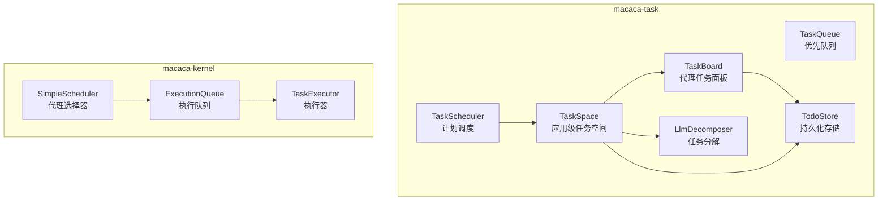
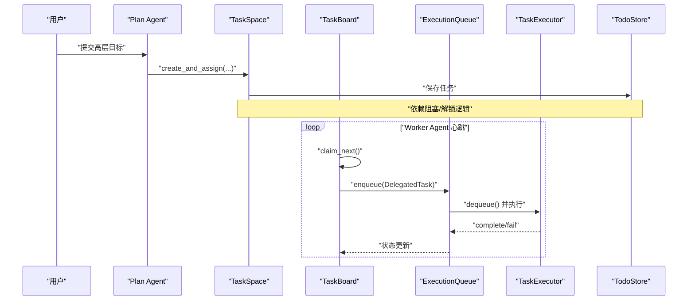
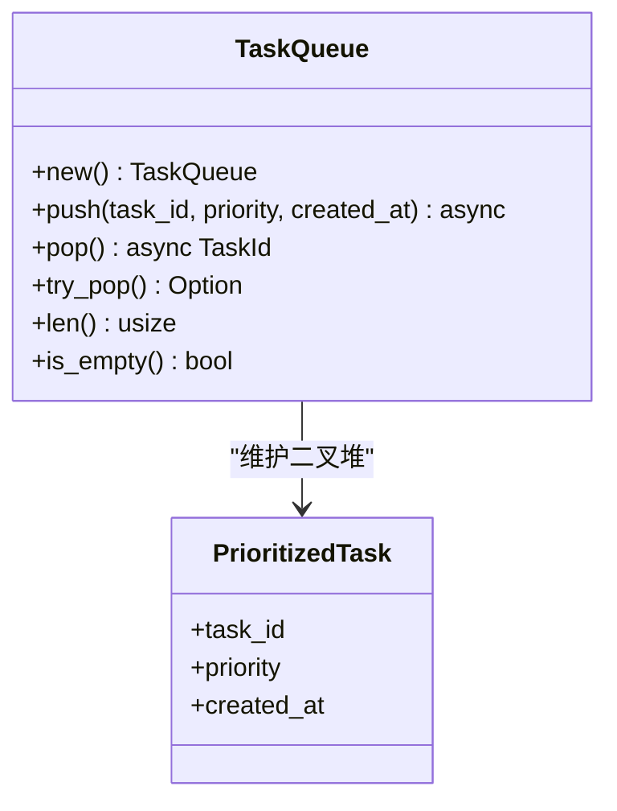
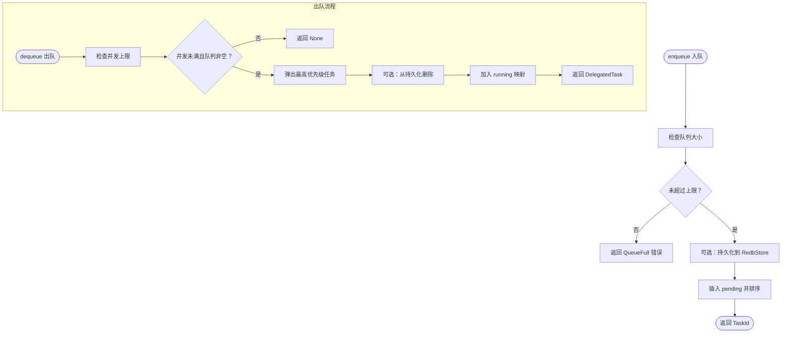
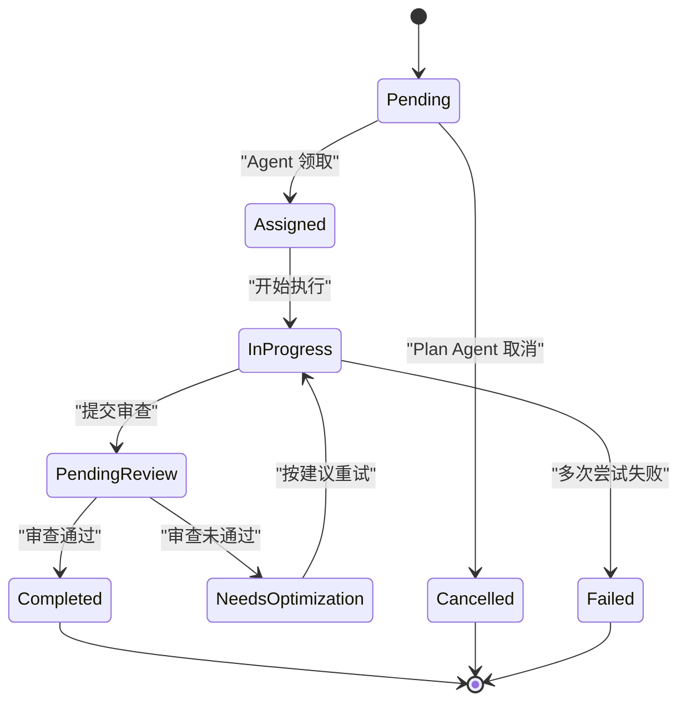
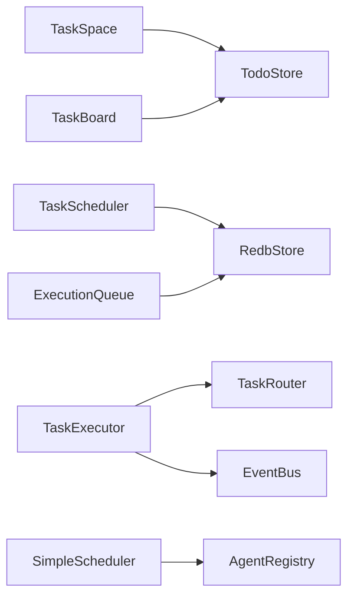

# 任务队列系统

<cite>
**本文引用的文件列表**
- [queue.rs](file://macaca/crates/macaca-task/src/queue.rs)
- [scheduler.rs](file://macaca/crates/macaca-task/src/scheduler.rs)
- [todo_board.rs](file://macaca/crates/macaca-task/src/todo_board.rs)
- [todo_store.rs](file://macaca/crates/macaca-task/src/todo_store.rs)
- [lib.rs](file://macaca/crates/macaca-task/src/lib.rs)
- [queue.rs](file://macaca/crates/macaca-kernel/src/executor/queue.rs)
- [worker.rs](file://macaca/crates/macaca-kernel/src/executor/worker.rs)
- [scheduler.rs](file://macaca/crates/macaca-kernel/src/scheduler.rs)
- [task-todo-system-design.md](file://macaca/docs/task-todo-system-design.md)
- [task-routing-design.md](file://macaca/docs/task-routing-design.md)
- [decompose.rs](file://macaca/crates/macaca-task/src/decompose.rs)
</cite>

## 目录
1. [引言](#引言)
2. [项目结构](#项目结构)
3. [核心组件](#核心组件)
4. [架构总览](#架构总览)
5. [详细组件分析](#详细组件分析)
6. [依赖关系分析](#依赖关系分析)
7. [性能考量](#性能考量)
8. [故障排查指南](#故障排查指南)
9. [结论](#结论)
10. [附录](#附录)

## 引言
本文件面向“任务队列系统”的综合技术文档，聚焦以下目标：
- 任务队列的数据结构设计与优先级调度算法（含入队、出队、优先级比较与去重机制）
- 调度器实现原理（任务分配策略、负载均衡与并发控制）
- 队列状态管理（长度限制、超时与异常恢复）
- 队列操作API（enqueue、dequeue、peek、size等）的参数与使用说明
- 队列与任务板的交互关系，以及在多代理环境下的任务分发策略

本系统同时覆盖两类队列：
- 任务板（TaskBoard）与计划空间（TaskSpace）：面向“项目级任务”的持久化、可视化与生命周期管理
- 执行队列（ExecutionQueue）：面向“即时委托”场景的高并发执行与持久化恢复

## 项目结构
本仓库中与任务队列相关的模块主要分布在两个子 crate：
- macaca-task：任务板、计划空间、任务存储、计划调度等
- macaca-kernel：执行队列、执行器、调度器（代理选择）

图表来源
- [queue.rs:40-91](file://macaca/crates/macaca-task/src/queue.rs#L40-L91)
- [todo_board.rs:67-230](file://macaca/crates/macaca-task/src/todo_board.rs#L67-L230)
- [todo_store.rs:27-332](file://macaca/crates/macaca-task/src/todo_store.rs#L27-L332)
- [scheduler.rs:217-367](file://macaca/crates/macaca-task/src/scheduler.rs#L217-L367)
- [decompose.rs:50-227](file://macaca/crates/macaca-task/src/decompose.rs#L50-L227)
- [queue.rs:61-380](file://macaca/crates/macaca-kernel/src/executor/queue.rs#L61-L380)
- [worker.rs:77-269](file://macaca/crates/macaca-kernel/src/executor/worker.rs#L77-L269)
- [scheduler.rs:24-85](file://macaca/crates/macaca-kernel/src/scheduler.rs#L24-L85)

章节来源
- [lib.rs:1-22](file://macaca/crates/macaca-task/src/lib.rs#L1-L22)

## 核心组件
- TaskQueue（macaca-task）：基于二叉堆的优先队列，支持异步入队、阻塞/非阻塞出队、长度查询与通知唤醒
- ExecutionQueue（macaca-kernel）：基于向量的优先队列，支持最大并发限制、队列大小限制、持久化恢复、结果存储与状态查询
- TaskSpace/TaskBoard（macaca-task）：应用级与代理级任务空间，支持任务创建、依赖阻塞/解锁、审查与优化反馈
- TodoStore（macaca-task）：基于 RedbStore 的键空间隔离存储，支持会话/应用/代理维度的查询与迁移
- TaskScheduler（macaca-task）：计划调度器，支持 cron/固定间隔、持久化、触发事件
- SimpleScheduler（macaca-kernel）：代理选择器，按能力匹配与运行态选择代理

章节来源
- [queue.rs:40-91](file://macaca/crates/macaca-task/src/queue.rs#L40-L91)
- [queue.rs:61-380](file://macaca/crates/macaca-kernel/src/executor/queue.rs#L61-L380)
- [todo_board.rs:67-230](file://macaca/crates/macaca-task/src/todo_board.rs#L67-L230)
- [todo_store.rs:27-332](file://macaca/crates/macaca-task/src/todo_store.rs#L27-L332)
- [scheduler.rs:217-367](file://macaca/crates/macaca-task/src/scheduler.rs#L217-L367)
- [scheduler.rs:24-85](file://macaca/crates/macaca-kernel/src/scheduler.rs#L24-L85)

## 架构总览
系统围绕“任务板”和“执行队列”两条主线协同工作：
- 任务板：面向长期项目，强调任务生命周期、依赖管理、审查与优化反馈
- 执行队列：面向即时委托，强调并发控制、持久化恢复与结果回调

图表来源
- [todo_board.rs:268-317](file://macaca/crates/macaca-task/src/todo_board.rs#L268-L317)
- [todo_store.rs:75-81](file://macaca/crates/macaca-task/src/todo_store.rs#L75-L81)
- [queue.rs:125-204](file://macaca/crates/macaca-kernel/src/executor/queue.rs#L125-L204)
- [worker.rs:135-190](file://macaca/crates/macaca-kernel/src/executor/worker.rs#L135-L190)

## 详细组件分析

### TaskQueue（macaca-task）：优先队列与通知
- 数据结构：二叉堆（BinaryHeap）包裹 PrioritizedTask，字段包含任务ID、优先级、创建时间
- 优先级比较：优先级降序；同优先级按创建时间升序（更早者先出队）
- 方法族：
  - push(task_id, priority, created_at)：入队并通知等待消费者
  - pop()：阻塞等待直至有任务可出队
  - try_pop()：非阻塞出队
  - len()/is_empty()：查询队列长度与空状态
- 通知机制：使用 Notify 在入队时唤醒等待的消费者

图表来源
- [queue.rs:40-91](file://macaca/crates/macaca-task/src/queue.rs#L40-L91)

章节来源
- [queue.rs:47-91](file://macaca/crates/macaca-task/src/queue.rs#L47-L91)

### ExecutionQueue（macaca-kernel）：并发执行队列与持久化
- 数据结构：pending（Vec<PrioritizedTask>，排序维护）、running（HashMap<TaskId, DelegatedTask>）、results（HashMap<TaskId, TaskResult>）
- 优先级计算：priority_score = priority × 10 + (parallel?1:0)，保证并行任务略优
- 并发控制：max_parallel 控制同时运行任务数
- 队列长度控制：max_queue_size 限制 pending 队列大小
- 持久化：可选 RedbStore，键空间为 exec_queue/{app_id}/{task_id}，重启后可恢复 pending 任务
- 方法族：
  - enqueue(task)：入队并持久化，返回 TaskId 或 QueueFull 错误
  - dequeue()：在并发未达限时出队，移除持久化记录并加入 running
  - complete(task_id, result)/fail(task_id, error)：完成/失败回调
  - cancel(task_id)：从 pending 或 running 中取消
  - status()/pending_count()/running_count()/is_empty()/get_result()/get_status()

图表来源
- [queue.rs:125-204](file://macaca/crates/macaca-kernel/src/executor/queue.rs#L125-L204)
- [queue.rs:206-255](file://macaca/crates/macaca-kernel/src/executor/queue.rs#L206-L255)

章节来源
- [queue.rs:80-380](file://macaca/crates/macaca-kernel/src/executor/queue.rs#L80-L380)

### TaskSpace/TaskBoard（macaca-task）：任务生命周期与依赖管理
- TaskSpace：
  - create_and_assign(...)：自动生成序列号、解析依赖、必要时标记 BLOCKED
  - review_task(...)：审查通过则完成并解锁下游；未通过则进入 NEEDS_OPTIMIZATION
  - skip_task(...)：跳过（PENDING/BLOCKED → CANCELLED），触发下游依赖再评估
  - list_all()/overall_progress()/pending_reviews()/all_tasks_done()
- TaskBoard：
  - claim_next()：按会话维度，按序列号顺序领取第一个可领取任务（Pending→Assigned）
  - start_task()/submit_for_review()/update_progress()/mark_failed()/current_task()/has_pending_tasks()/needs_optimization_tasks()/list_all()

图表来源
- [todo_board.rs:268-358](file://macaca/crates/macaca-task/src/todo_board.rs#L268-L358)

章节来源
- [todo_board.rs:67-230](file://macaca/crates/macaca-task/src/todo_board.rs#L67-L230)
- [todo_board.rs:232-509](file://macaca/crates/macaca-task/src/todo_board.rs#L232-L509)

### TodoStore（macaca-task）：键空间隔离与跨重启恢复
- 键空间：
  - todo/{app_id}/{session_id}/{agent}/{task_id} → TodoItem
  - goal/{app_id}/{session_id}/{goal_id} → TodoGoal
- 查询与操作：
  - save_todo()/get_todo()/delete_todo()
  - list_agent_todos()/list_agent_todos_by_status()/list_all_todos()/list_all_todos_for_session()/list_pending_reviews()
  - rollback_in_progress()：崩溃恢复时将 IN_PROGRESS/ASSIGNED 回滚为 PENDING
  - migrate_sequence_numbers()：为历史任务补全序列号
  - pop_pending_goal()/list_goals()/list_goals_for_session()

章节来源
- [todo_store.rs:27-332](file://macaca/crates/macaca-task/src/todo_store.rs#L27-L332)

### TaskScheduler（macaca-task）：计划调度与事件驱动
- ScheduleEntry：支持 cron 表达式（自动规范化为 7 字段）与固定间隔，计算 next_run_at
- TaskScheduler：
  - create()/save()/get()/list()/delete()/set_enabled()
  - run(app_id, shutdown, event_tx)：周期性扫描到期条目，发出 ScheduleEvent::Triggered，更新 last_run_at/run_count/next_run_at
- 事件：ScheduleEvent::Triggered(action)

章节来源
- [scheduler.rs:217-367](file://macaca/crates/macaca-task/src/scheduler.rs#L217-L367)

### SimpleScheduler（macaca-kernel）：代理选择策略
- 选择逻辑：
  - 首先选择运行中且具备任务描述中关键词的代理
  - 若无匹配，则选择第一个运行中的代理
  - 若无可选代理，返回 None
- 适用场景：即时委托场景下的代理路由

章节来源
- [scheduler.rs:24-85](file://macaca/crates/macaca-kernel/src/scheduler.rs#L24-L85)

### 任务分解与计划循环（补充）
- LlmDecomposer：将高层目标分解为结构化子任务，支持跨代理依赖声明与标题映射
- 计划循环：PlanLoop 消费 Goal，调用 LlmDecomposer 生成任务并分派至 TaskSpace

章节来源
- [decompose.rs:50-227](file://macaca/crates/macaca-task/src/decompose.rs#L50-L227)
- [task-todo-system-design.md:245-288](file://macaca/docs/task-todo-system-design.md#L245-L288)

## 依赖关系分析
- TaskSpace/TaskBoard 依赖 TodoStore 进行持久化与查询
- TaskScheduler 依赖 RedbStore 进行计划条目的持久化
- ExecutionQueue 依赖 RedbStore 进行队列状态恢复
- TaskExecutor 依赖 TaskRouter 与 EventBus 进行任务执行与事件发布
- SimpleScheduler 依赖 AgentRegistry 获取代理清单

图表来源
- [todo_board.rs:67-230](file://macaca/crates/macaca-task/src/todo_board.rs#L67-L230)
- [todo_store.rs:27-332](file://macaca/crates/macaca-task/src/todo_store.rs#L27-L332)
- [scheduler.rs:217-367](file://macaca/crates/macaca-task/src/scheduler.rs#L217-L367)
- [queue.rs:61-78](file://macaca/crates/macaca-kernel/src/executor/queue.rs#L61-L78)
- [worker.rs:77-90](file://macaca/crates/macaca-kernel/src/executor/worker.rs#L77-L90)
- [scheduler.rs:12-21](file://macaca/crates/macaca-kernel/src/scheduler.rs#L12-L21)

## 性能考量
- TaskQueue（macaca-task）
  - 入队/出队基于二叉堆，时间复杂度 O(log N)
  - 通知唤醒避免忙等，降低 CPU 占用
- ExecutionQueue（macaca-kernel）
  - 入队后整体排序，最坏 O(N log N)；可通过增量维护优化（当前实现为稳定排序）
  - 并发上限与队列上限共同控制资源占用
  - 持久化采用键值存储，避免大对象序列化开销
- TaskSpace/TaskBoard
  - 依赖阻塞/解锁通过一次遍历完成，复杂度 O(T)
  - 会话维度分组与排序，避免全局扫描
- TaskScheduler
  - 周期性扫描，间隔可配置，默认 60 秒

[本节为通用性能讨论，不直接分析具体文件]

## 故障排查指南
- ExecutionQueue 队列满
  - 现象：enqueue 返回 QueueFull 错误
  - 排查：检查 pending_count()/running_count()，确认并发上限与队列上限设置
  - 处理：提升并发上限或增大队列上限，或清理积压任务
- 任务长时间未出队
  - 现象：dequeue 返回 None
  - 排查：确认 running_count 是否已达 max_parallel；检查 pending 是否为空
- 执行器未收到任务
  - 现象：执行器未触发
  - 排查：确认 ExecutionQueue 是否正确 enqueue；检查 TaskExecutor 的命令通道与事件总线
- 重启后任务丢失
  - 现象：重启后部分任务消失
  - 排查：确认 RedbStore 是否启用；检查 restore_from_store 是否成功；核对键空间命名
- 任务审查未生效
  - 现象：任务状态未更新
  - 排查：确认 review_task 的 task_id 是否正确；检查依赖是否全部完成；确认 TaskSpace 的会话范围

章节来源
- [queue.rs:390-401](file://macaca/crates/macaca-kernel/src/executor/queue.rs#L390-L401)
- [queue.rs:206-255](file://macaca/crates/macaca-kernel/src/executor/queue.rs#L206-L255)
- [worker.rs:111-133](file://macaca/crates/macaca-kernel/src/executor/worker.rs#L111-L133)
- [todo_board.rs:318-358](file://macaca/crates/macaca-task/src/todo_board.rs#L318-L358)

## 结论
本任务队列系统通过“任务板 + 执行队列”的双轨设计，实现了：
- 项目级任务的生命周期管理与依赖编排（TaskSpace/TaskBoard/TodoStore）
- 即时委托的高并发执行与持久化恢复（ExecutionQueue/TaskExecutor）
- 计划驱动的自动化触发（TaskScheduler）
- 代理选择的智能化路由（SimpleScheduler）

系统在数据结构上兼顾公平与效率，在并发控制与持久化方面提供了稳健的工程实践，适合在多代理环境下实现稳定的任务分发与执行。

[本节为总结性内容，不直接分析具体文件]

## 附录

### 队列操作 API 文档（ExecutionQueue）
- enqueue(task)
  - 参数：DelegatedTask
  - 返回：Result<TaskId, QueueError>
  - 说明：入队并持久化；若队列满返回 QueueFull
- dequeue()
  - 返回：Option<DelegatedTask>
  - 说明：在并发未达限时弹出最高优先级任务；否则返回 None
- complete(task_id, result)
  - 说明：标记任务完成并发送完成事件
- fail(task_id, error)
  - 说明：标记任务失败并发送失败事件
- cancel(task_id)
  - 返回：bool
  - 说明：从 pending 或 running 中取消
- status()/pending_count()/running_count()/is_empty()/get_result(task_id)/get_status(task_id)
  - 说明：查询队列状态、数量、结果与任务状态

章节来源
- [queue.rs:125-380](file://macaca/crates/macaca-kernel/src/executor/queue.rs#L125-L380)

### 队列操作 API 文档（TaskQueue）
- push(task_id, priority, created_at)
  - 说明：入队并通知等待消费者
- pop()
  - 返回：TaskId
  - 说明：阻塞等待直至有任务可出队
- try_pop()
  - 返回：Option<TaskId>
  - 说明：非阻塞出队
- len()/is_empty()
  - 说明：查询队列长度与空状态

章节来源
- [queue.rs:55-91](file://macaca/crates/macaca-task/src/queue.rs#L55-L91)

### 队列与任务板交互关系
- 任务板（TaskBoard）：代理从面板领取任务，执行后提交审查
- 执行队列（ExecutionQueue）：即时委托场景下的高并发执行与持久化
- 两者互补：任务板用于长期项目与审查闭环；执行队列用于快速委托与结果回调

章节来源
- [todo_board.rs:94-146](file://macaca/crates/macaca-task/src/todo_board.rs#L94-L146)
- [queue.rs:125-204](file://macaca/crates/macaca-kernel/src/executor/queue.rs#L125-L204)
- [task-todo-system-design.md:245-334](file://macaca/docs/task-todo-system-design.md#L245-L334)

### 多代理环境下的任务分发策略
- 代理选择：SimpleScheduler 优先能力匹配，其次选择首个运行中的代理
- 任务分派：TaskSpace.create_and_assign 自动分配序列号并处理依赖阻塞
- 执行执行：ExecutionQueue 控制并发与队列长度，保障系统稳定性

章节来源
- [scheduler.rs:24-85](file://macaca/crates/macaca-kernel/src/scheduler.rs#L24-L85)
- [todo_board.rs:268-317](file://macaca/crates/macaca-task/src/todo_board.rs#L268-L317)
- [queue.rs:61-78](file://macaca/crates/macaca-kernel/src/executor/queue.rs#L61-L78)