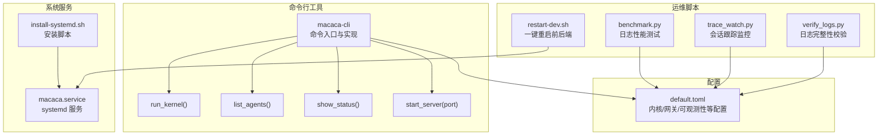
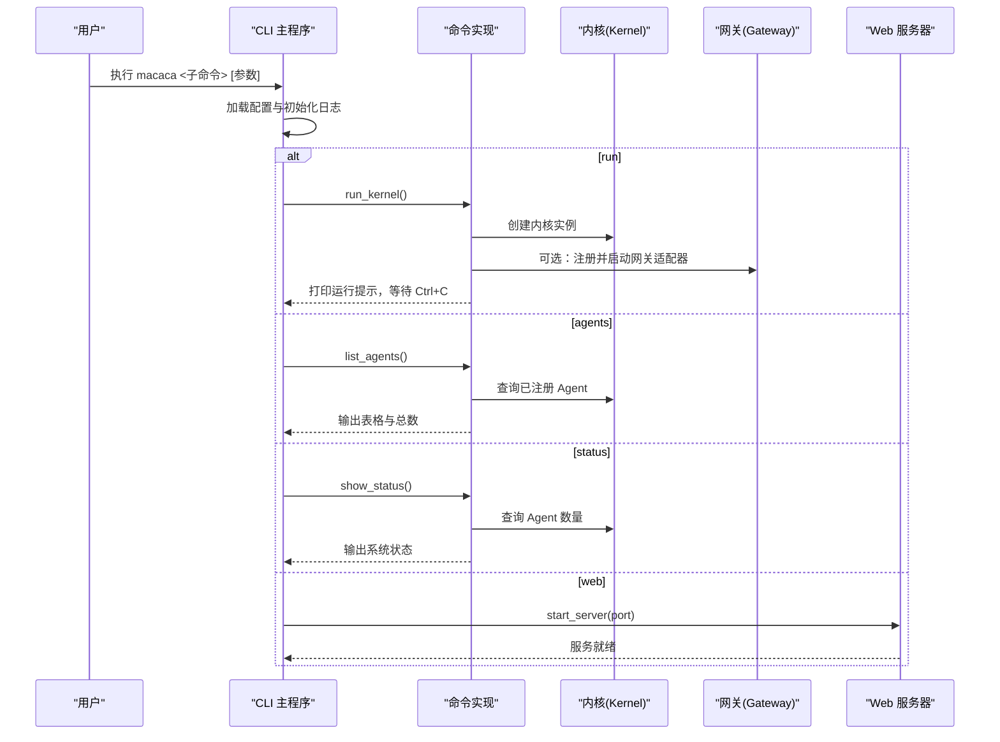
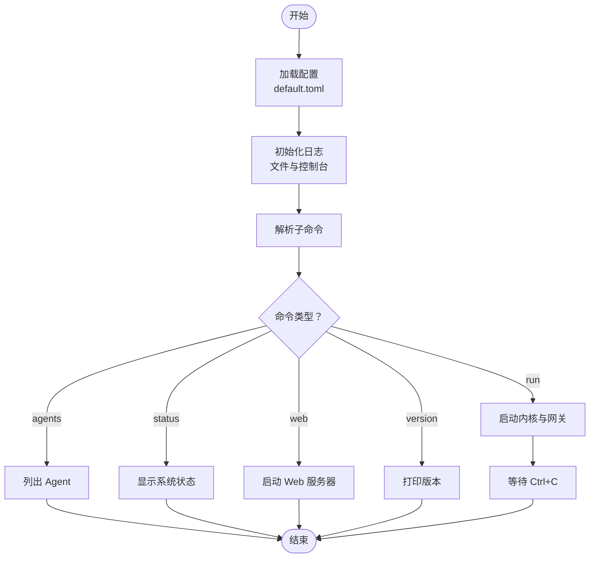
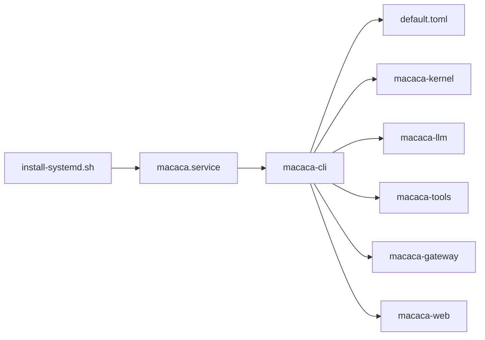

# 命令行工具

<cite>
**本文引用的文件**
- [macaca/Cargo.toml](file://macaca/Cargo.toml)
- [macaca/crates/macaca-cli/src/main.rs](file://macaca/crates/macaca-cli/src/main.rs)
- [macaca/crates/macaca-cli/src/lib.rs](file://macaca/crates/macaca-cli/src/lib.rs)
- [macaca/crates/macaca-cli/src/commands.rs](file://macaca/crates/macaca-cli/src/commands.rs)
- [macaca/config/default.toml](file://macaca/config/default.toml)
- [macaca/deploy/install-systemd.sh](file://macaca/deploy/install-systemd.sh)
- [macaca/deploy/macaca.service](file://macaca/deploy/macaca.service)
- [scripts/restart-dev.sh](file://scripts/restart-dev.sh)
- [macaca/scripts/benchmark.py](file://macaca/scripts/benchmark.py)
- [macaca/scripts/trace_watch.py](file://macaca/scripts/trace_watch.py)
- [macaca/scripts/verify_logs.py](file://macaca/scripts/verify_logs.py)
- [macaca/README.md](file://macaca/README.md)
- [macaca/ARCHITECTURE-v2.md](file://macaca/ARCHITECTURE-v2.md)
- [macaca/docs/SYSTEM_AUDIT.md](file://macaca/docs/SYSTEM_AUDIT.md)
</cite>

## 目录
1. [简介](#简介)
2. [项目结构](#项目结构)
3. [核心组件](#核心组件)
4. [架构总览](#架构总览)
5. [详细组件分析](#详细组件分析)
6. [依赖分析](#依赖分析)
7. [性能考虑](#性能考虑)
8. [故障排除指南](#故障排除指南)
9. [结论](#结论)
10. [附录](#附录)

## 简介
本文件为命令行工具的综合文档，重点覆盖以下方面：
- CLI 工具功能与使用方法：macaca run、macaca agents、macaca status、macaca version、macaca web
- 命令行参数、配置选项与输出格式
- 开发与运维脚本：一键重启脚本、性能测试脚本、日志验证与监控脚本
- 调试与监控：日志查看、状态检查、性能分析
- 最佳实践、自动化脚本示例与常见问题排查

## 项目结构
本项目采用 Rust Workspace 组织，命令行工具位于 macaca/crates/macaca-cli，核心命令实现位于命令模块中，配置位于 config/default.toml，运维脚本位于 scripts 与 deploy 目录。

图表来源
- [macaca/crates/macaca-cli/src/main.rs:1-79](file://macaca/crates/macaca-cli/src/main.rs#L1-L79)
- [macaca/crates/macaca-cli/src/commands.rs:1-207](file://macaca/crates/macaca-cli/src/commands.rs#L1-L207)
- [macaca/config/default.toml:1-119](file://macaca/config/default.toml#L1-L119)
- [scripts/restart-dev.sh:1-80](file://scripts/restart-dev.sh#L1-L80)
- [macaca/scripts/benchmark.py:1-240](file://macaca/scripts/benchmark.py#L1-L240)
- [macaca/scripts/trace_watch.py:1-199](file://macaca/scripts/trace_watch.py#L1-L199)
- [macaca/scripts/verify_logs.py:1-476](file://macaca/scripts/verify_logs.py#L1-L476)
- [macaca/deploy/macaca.service:1-38](file://macaca/deploy/macaca.service#L1-L38)
- [macaca/deploy/install-systemd.sh:1-60](file://macaca/deploy/install-systemd.sh#L1-L60)

章节来源
- [macaca/Cargo.toml:1-90](file://macaca/Cargo.toml#L1-L90)
- [macaca/README.md:1-29](file://macaca/README.md#L1-L29)

## 核心组件
- 命令入口与子命令解析：基于 clap 定义 run、agents、status、version、web 等子命令，加载默认配置并初始化日志。
- 命令实现：
  - run：启动内核与可选网关适配器，打印运行提示并等待 Ctrl+C。
  - agents：列出内核中已注册的 Agent，输出表格形式的状态概览。
  - status：展示系统状态（版本、Agent 数量、最大 Agent 数、LLM 提供商、网关启用情况等）。
  - version：打印版本信息。
  - web：启动 Web 服务器，默认端口 3001，支持 systemd notify/watchdog。
- 配置加载：默认从 config/default.toml 加载，支持环境变量覆盖。
- 日志初始化：根据配置选择文件日志格式（文本或 JSON），同时输出到控制台。

章节来源
- [macaca/crates/macaca-cli/src/main.rs:1-79](file://macaca/crates/macaca-cli/src/main.rs#L1-L79)
- [macaca/crates/macaca-cli/src/commands.rs:47-155](file://macaca/crates/macaca-cli/src/commands.rs#L47-L155)
- [macaca/config/default.toml:1-119](file://macaca/config/default.toml#L1-L119)

## 架构总览
CLI 作为入口，调用内核与网关组件，配合配置与可观测性模块协同工作。Web 子命令独立启动 HTTP 服务，systemd 服务文件用于生产部署。

图表来源
- [macaca/crates/macaca-cli/src/main.rs:33-78](file://macaca/crates/macaca-cli/src/main.rs#L33-L78)
- [macaca/crates/macaca-cli/src/commands.rs:47-155](file://macaca/crates/macaca-cli/src/commands.rs#L47-L155)

## 详细组件分析

### CLI 命令与参数
- macaca run
  - 功能：启动 Agent OS 内核与网关适配器（若配置启用）。
  - 行为：创建内核、可选注册 Telegram/Discord 适配器并启动，打印运行提示，等待信号中断。
  - 输出：运行提示与日志；Ctrl+C 停止时记录关闭日志。
- macaca agents
  - 功能：列出当前注册的 Agent。
  - 输出：ID、名称、状态三列表格，末尾统计总数。
- macaca status
  - 功能：显示系统状态。
  - 输出：版本、Agent 数量、最大 Agent 数、LLM 提供商、网关启用与各适配器状态。
- macaca version
  - 功能：打印版本号。
- macaca web
  - 功能：启动 Web 服务器。
  - 参数：--port 默认 3001。
  - systemd 集成：在启用 feature 时，通知 systemd Ready 与 Watchdog。

章节来源
- [macaca/crates/macaca-cli/src/main.rs:14-31](file://macaca/crates/macaca-cli/src/main.rs#L14-L31)
- [macaca/crates/macaca-cli/src/commands.rs:47-155](file://macaca/crates/macaca-cli/src/commands.rs#L47-L155)

### 配置选项与输出格式
- 配置文件：config/default.toml
  - 内核：max_agents、heartbeat_interval_ms、agent_timeout_ms
  - LLM：default_provider、max_tokens_per_request、rate_limit_rpm、多提供商配置
  - 记忆：session_ttl_seconds、file_store_path、auto_retrieve_on、向量与嵌入配置
  - IPC：nats_url、nats_auto_start、重连策略
  - 工作空间：root_dir
  - 持久化：engine、data_dir、snapshot_interval_seconds
  - 网关：enabled、Telegram/Discord 配置
  - 可观测性：log_level、tracing_enabled、otlp_endpoint、文件日志格式与保留策略
- 输出格式：CLI 输出为纯文本；Web API 输出遵循各自接口规范（本节不展开具体 API）。

章节来源
- [macaca/config/default.toml:1-119](file://macaca/config/default.toml#L1-L119)

### 开发与运维脚本

#### 一键重启脚本 restart-dev.sh
- 功能：停止占用端口的进程，启动后端（macaca web）与前端（Next.js dev），输出日志位置与访问地址。
- 端口与日志默认值可通过环境变量覆盖。
- 行为：查找并终止占用端口的监听进程，兜底清理残留命令行；后台启动并记录 PID 与日志文件。

章节来源
- [scripts/restart-dev.sh:1-80](file://scripts/restart-dev.sh#L1-L80)

#### systemd 服务与安装
- macaca.service：定义 Type=notify、WatchdogSec、资源限制、安全加固、用户与工作目录、环境文件等。
- install-systemd.sh：创建用户与目录、复制服务文件、更新 ExecStart 路径、启用服务并提供常用命令。

章节来源
- [macaca/deploy/macaca.service:1-38](file://macaca/deploy/macaca.service#L1-L38)
- [macaca/deploy/install-systemd.sh:1-60](file://macaca/deploy/install-systemd.sh#L1-L60)

### 性能测试与日志分析脚本

#### benchmark.py（日志系统性能测试）
- 功能：分析日志文件的时间戳、结构完整性、级别分布、模块分布，计算日志生成速率，评估 JSON 格式正确率与结构完整性评分。
- 参数：--log-file、--expected-tps。
- 输出：结构分析、级别分布柱状图、速率统计、模块分布、性能评估与建议。

章节来源
- [macaca/scripts/benchmark.py:1-240](file://macaca/scripts/benchmark.py#L1-L240)

#### verify_logs.py（日志完整性校验）
- 功能：验证任务生命周期完整性（创建/开始/Fork 生命周期/完成/失败）、工具调用完整性、关键字段覆盖度（trace_id、task_id、agent_name 等）。
- 参数：--log-file、--app-id、--session-id、--json-output、--verbose。
- 输出：摘要、任务生命周期分析、Fork 事件缺失、错误与警告、详细任务列表、结论与建议。

章节来源
- [macaca/scripts/verify_logs.py:1-476](file://macaca/scripts/verify_logs.py#L1-L476)

#### trace_watch.py（会话跟踪监控）
- 功能：轮询会话 run-trace 与原始事件，检测停滞、超时、待办失败；可选查询应用进度与“claim 诊断”信息。
- 参数：session_id、--interval、--once、--base、--deadline-seconds、--stall-seconds、--app-id、--exit-on-todo-failed、--no-claim-diagnostics。
- 行为：请求 run-trace 与 events，解析最新序列号与错误事件，按阈值判定停滞或超时并退出。

章节来源
- [macaca/scripts/trace_watch.py:1-199](file://macaca/scripts/trace_watch.py#L1-L199)

### 调试与监控流程

#### 日志查看与结构分析
- 使用 benchmark.py 与 verify_logs.py 对日志进行结构完整性与性能评估，定位缺失字段与异常级别分布。
- 结合 systemd 日志：journalctl -u macaca -f。

#### 状态检查与性能分析
- 使用 macaca status 快速确认内核状态、网关启用情况与 LLM 提供商。
- 使用 trace_watch.py 监控会话执行状态，及时发现停滞与失败。

图表来源
- [macaca/crates/macaca-cli/src/main.rs:33-78](file://macaca/crates/macaca-cli/src/main.rs#L33-L78)
- [macaca/crates/macaca-cli/src/commands.rs:47-155](file://macaca/crates/macaca-cli/src/commands.rs#L47-L155)

## 依赖分析
- CLI 依赖内核、LLM 抽象、工具集与网关组件；通过配置驱动行为。
- 配置文件 default.toml 提供内核、LLM、记忆、IPC、持久化、网关与可观测性等参数。
- systemd 服务与安装脚本提供生产级部署与监控。

图表来源
- [macaca/Cargo.toml:1-90](file://macaca/Cargo.toml#L1-L90)
- [macaca/config/default.toml:1-119](file://macaca/config/default.toml#L1-L119)
- [macaca/deploy/macaca.service:1-38](file://macaca/deploy/macaca.service#L1-L38)
- [macaca/deploy/install-systemd.sh:1-60](file://macaca/deploy/install-systemd.sh#L1-L60)

章节来源
- [macaca/Cargo.toml:1-90](file://macaca/Cargo.toml#L1-L90)

## 性能考虑
- 日志性能：benchmark.py 用于评估日志对性能的影响，建议确保日志速率与 JSON 格式正确率达标，避免过度日志导致性能下降。
- 结构完整性：verify_logs.py 建议在关键字段（trace_id、task_id、fork_id）覆盖率不足时增加埋点，提升可观测性。
- Web 服务：systemd 服务配置包含 WatchdogSec，确保服务健康与自动重启。

## 故障排除指南
- 启动失败
  - 检查 systemd 日志：journalctl -u macaca -f
  - 确认端口占用：使用 restart-dev.sh 清理占用端口的进程
- 网关未生效
  - 检查 config/default.toml 中 gateway.enabled 与各适配器配置
  - 使用 macaca status 确认网关状态
- 会话停滞或超时
  - 使用 trace_watch.py 设置 --stall-seconds 与 --deadline-seconds，结合 --app-id 与 --exit-on-todo-failed 定位问题
- 日志异常
  - 使用 verify_logs.py 与 benchmark.py 分别进行完整性与性能评估，按建议补充字段与优化日志配置

章节来源
- [macaca/scripts/trace_watch.py:35-199](file://macaca/scripts/trace_watch.py#L35-L199)
- [macaca/scripts/verify_logs.py:409-476](file://macaca/scripts/verify_logs.py#L409-L476)
- [macaca/scripts/benchmark.py:108-240](file://macaca/scripts/benchmark.py#L108-L240)
- [scripts/restart-dev.sh:21-80](file://scripts/restart-dev.sh#L21-L80)

## 结论
本 CLI 工具提供了启动内核、列出 Agent、查看系统状态、启动 Web 服务与版本查询等核心能力；配合配置文件与运维脚本，可满足开发与生产环境的日常运维需求。通过日志分析与监控脚本，能够快速定位问题并保障系统稳定性。

## 附录

### 命令速查
- macaca run：启动内核与网关
- macaca agents：列出 Agent
- macaca status：显示系统状态
- macaca version：打印版本
- macaca web --port N：启动 Web 服务器

章节来源
- [macaca/crates/macaca-cli/src/main.rs:14-31](file://macaca/crates/macaca-cli/src/main.rs#L14-L31)
- [macaca/ARCHITECTURE-v2.md:244-253](file://macaca/ARCHITECTURE-v2.md#L244-L253)

### 配置要点
- 内核与网关：max_agents、heartbeat_interval_ms、agent_timeout_ms、gateway.enabled
- LLM：default_provider、providers.* 配置
- 记忆与向量：session_ttl_seconds、vector.backend、milvus_url、embedding.provider
- IPC：nats_url、nats_auto_start
- 持久化：engine、data_dir、snapshot_interval_seconds
- 观测性：log_level、log_file.format、retention_days、compress

章节来源
- [macaca/config/default.toml:1-119](file://macaca/config/default.toml#L1-L119)