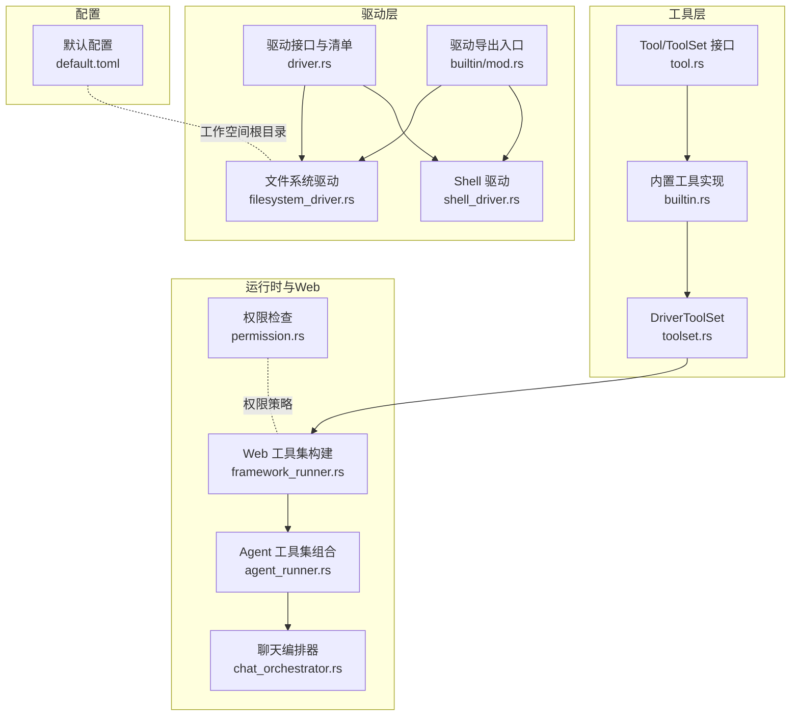
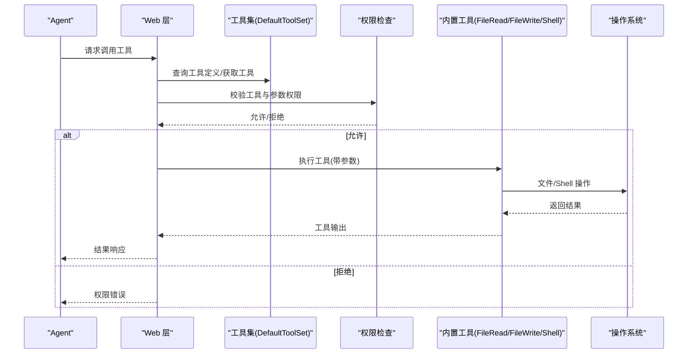
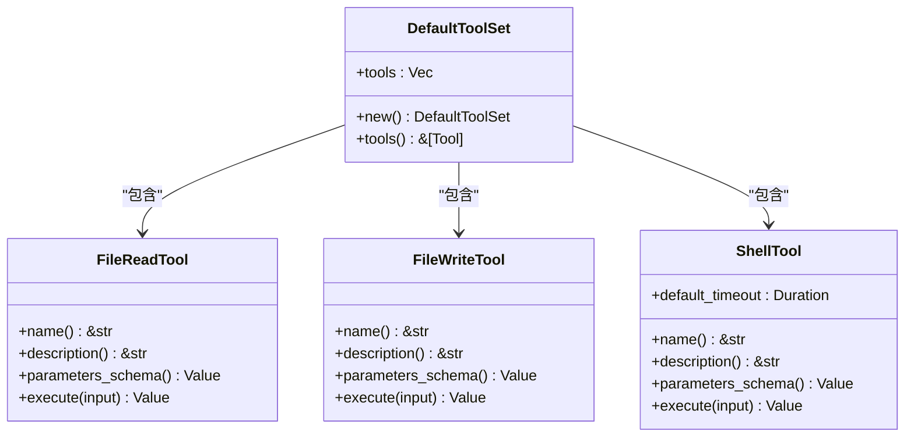
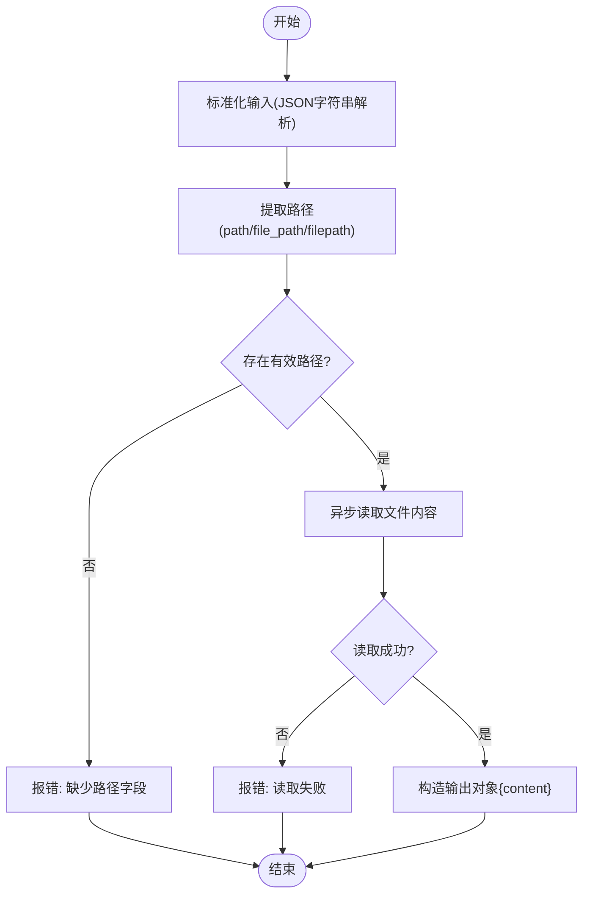
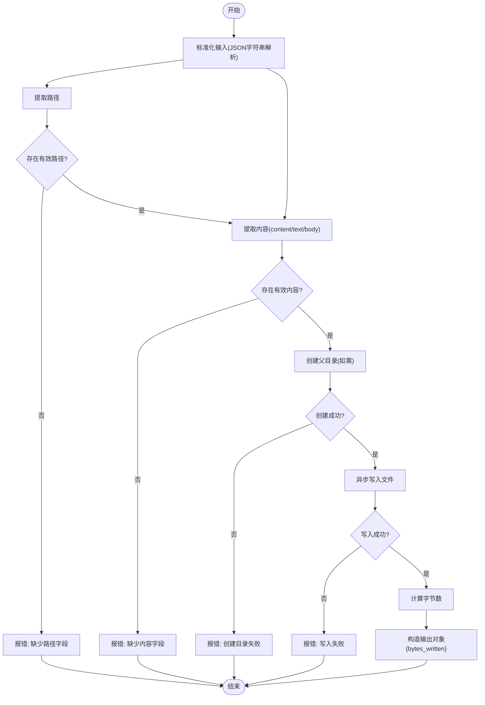
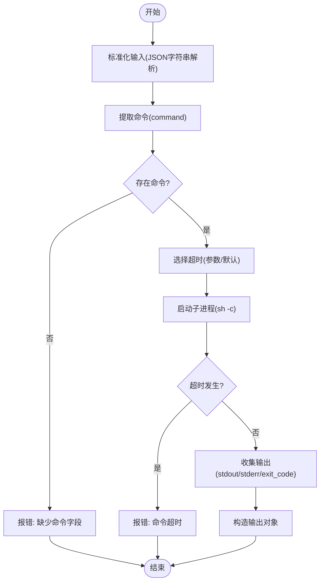
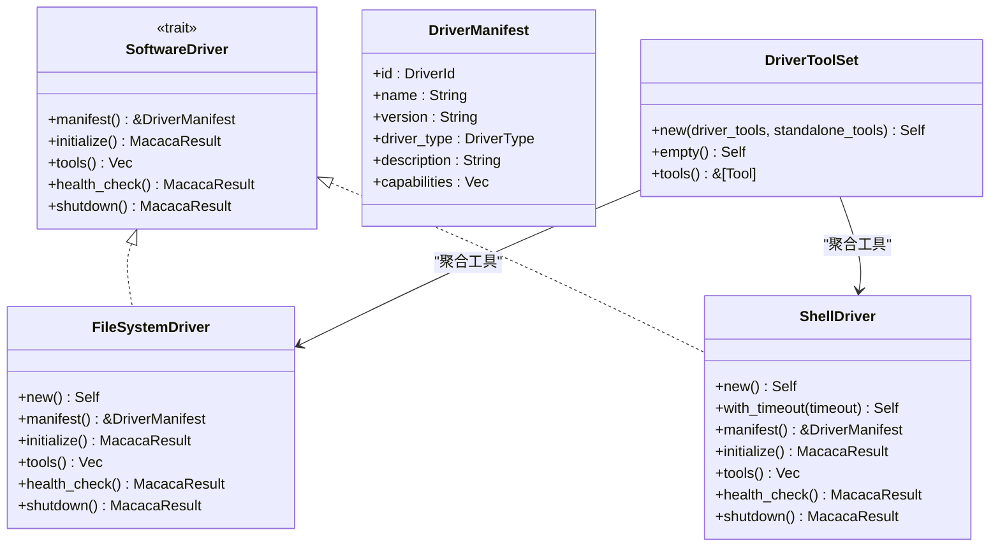
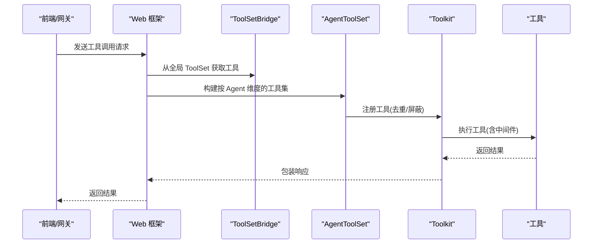
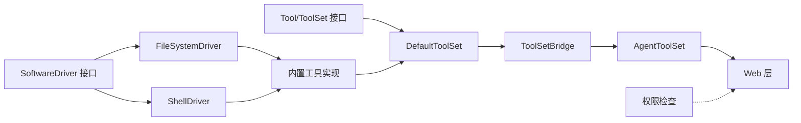

# 内置工具实现

<cite>
**本文引用的文件**
- [builtin.rs](file://macaca/crates/macaca-tools/src/builtin.rs)
- [tool.rs](file://macaca/crates/macaca-tools/src/tool.rs)
- [mod.rs](file://macaca/crates/macaca-driver/src/builtin/mod.rs)
- [toolset.rs](file://macaca/crates/macaca-driver/src/toolset.rs)
- [filesystem_driver.rs](file://macaca/crates/macaca-driver/src/builtin/filesystem_driver.rs)
- [shell_driver.rs](file://macaca/crates/macaca-driver/src/builtin/shell_driver.rs)
- [driver.rs](file://macaca/crates/macaca-driver/src/driver.rs)
- [lib.rs](file://macaca/crates/macaca-driver/src/lib.rs)
- [permission.rs](file://macaca/crates/macaca-runtime/src/permission.rs)
- [framework_runner.rs](file://macaca/crates/macaca-web/src/framework_runner.rs)
- [agent_runner.rs](file://macaca/crates/macaca-web/src/agent_runner.rs)
- [chat_orchestrator.rs](file://macaca/crates/macaca-web/src/chat_orchestrator.rs)
- [default.toml](file://macaca/config/default.toml)
</cite>

## 目录
1. [简介](#简介)
2. [项目结构](#项目结构)
3. [核心组件](#核心组件)
4. [架构总览](#架构总览)
5. [详细组件分析](#详细组件分析)
6. [依赖关系分析](#依赖关系分析)
7. [性能考虑](#性能考虑)
8. [故障排查指南](#故障排查指南)
9. [结论](#结论)
10. [附录](#附录)

## 简介
本文件系统性梳理 Agent OS 中的内置工具实现，重点围绕默认工具集 DefaultToolSet 的组成与功能，涵盖文件读写工具、Shell 命令工具等核心内置工具的实现细节。文档将从架构设计、数据流、处理逻辑、集成点、安全限制与权限控制、资源管理机制、性能优化建议以及常见问题解决等方面进行深入说明，并提供在 Agent 中调用这些工具的实际使用路径与参考示例。

## 项目结构
内置工具位于独立的工具库模块中，通过统一的 Tool/ToolSet 接口对外暴露能力；驱动框架将内置工具封装为可插拔驱动，形成 DriverToolSet；运行时提供权限检查与执行编排；Web 层负责将工具集注入到 Agent 的工具集合中供 LLM 调用。

**图表来源**
- [tool.rs:22-65](file://macaca/crates/macaca-tools/src/tool.rs#L22-L65)
- [builtin.rs:47-268](file://macaca/crates/macaca-tools/src/builtin.rs#L47-L268)
- [toolset.rs:7-29](file://macaca/crates/macaca-driver/src/toolset.rs#L7-L29)
- [driver.rs:34-61](file://macaca/crates/macaca-driver/src/driver.rs#L34-L61)
- [filesystem_driver.rs:14-62](file://macaca/crates/macaca-driver/src/builtin/filesystem_driver.rs#L14-L62)
- [shell_driver.rs:15-74](file://macaca/crates/macaca-driver/src/builtin/shell_driver.rs#L15-L74)
- [mod.rs:1-8](file://macaca/crates/macaca-driver/src/builtin/mod.rs#L1-L8)
- [permission.rs:33-311](file://macaca/crates/macaca-runtime/src/permission.rs#L33-L311)
- [framework_runner.rs:197-221](file://macaca/crates/macaca-web/src/framework_runner.rs#L197-L221)
- [agent_runner.rs:23-48](file://macaca/crates/macaca-web/src/agent_runner.rs#L23-L48)
- [chat_orchestrator.rs:1797-1827](file://macaca/crates/macaca-web/src/chat_orchestrator.rs#L1797-L1827)
- [default.toml:85-86](file://macaca/config/default.toml#L85-L86)

**章节来源**
- [tool.rs:1-66](file://macaca/crates/macaca-tools/src/tool.rs#L1-L66)
- [builtin.rs:1-376](file://macaca/crates/macaca-tools/src/builtin.rs#L1-L376)
- [toolset.rs:1-47](file://macaca/crates/macaca-driver/src/toolset.rs#L1-L47)
- [driver.rs:1-90](file://macaca/crates/macaca-driver/src/driver.rs#L1-L90)
- [filesystem_driver.rs:1-96](file://macaca/crates/macaca-driver/src/builtin/filesystem_driver.rs#L1-L96)
- [shell_driver.rs:1-111](file://macaca/crates/macaca-driver/src/builtin/shell_driver.rs#L1-L111)
- [mod.rs:1-8](file://macaca/crates/macaca-driver/src/builtin/mod.rs#L1-L8)
- [permission.rs:1-311](file://macaca/crates/macaca-runtime/src/permission.rs#L1-L311)
- [framework_runner.rs:194-221](file://macaca/crates/macaca-web/src/framework_runner.rs#L194-L221)
- [agent_runner.rs:23-48](file://macaca/crates/macaca-web/src/agent_runner.rs#L23-L48)
- [chat_orchestrator.rs:1797-1827](file://macaca/crates/macaca-web/src/chat_orchestrator.rs#L1797-L1827)
- [default.toml:85-86](file://macaca/config/default.toml#L85-L86)

## 核心组件
- Tool/ToolSet 接口：定义工具名称、描述、参数模式、执行与流式执行协议，以及工具集合的查询与定义导出能力。
- DefaultToolSet：默认内置工具集合，包含文件读取、文件写入、Shell 执行三个基础工具。
- 驱动框架：将内置工具封装为软件驱动，提供生命周期管理与能力暴露。
- 权限检查：基于工具名与参数的权限策略，支持路径白名单与网络访问控制。
- Web 层集成：将全局工具集与按 Agent 维度的工具组合注入到会话上下文中，供 LLM 调用。

**章节来源**
- [tool.rs:22-65](file://macaca/crates/macaca-tools/src/tool.rs#L22-L65)
- [builtin.rs:239-268](file://macaca/crates/macaca-tools/src/builtin.rs#L239-L268)
- [driver.rs:34-61](file://macaca/crates/macaca-driver/src/driver.rs#L34-L61)
- [permission.rs:33-311](file://macaca/crates/macaca-runtime/src/permission.rs#L33-L311)
- [framework_runner.rs:197-221](file://macaca/crates/macaca-web/src/framework_runner.rs#L197-L221)
- [agent_runner.rs:23-48](file://macaca/crates/macaca-web/src/agent_runner.rs#L23-L48)

## 架构总览
下图展示了从 Agent 到工具执行的整体流程，包括工具注册、权限校验、参数解析、执行与结果返回。

**图表来源**
- [builtin.rs:47-268](file://macaca/crates/macaca-tools/src/builtin.rs#L47-L268)
- [permission.rs:33-311](file://macaca/crates/macaca-runtime/src/permission.rs#L33-L311)
- [framework_runner.rs:197-221](file://macaca/crates/macaca-web/src/framework_runner.rs#L197-L221)
- [agent_runner.rs:23-48](file://macaca/crates/macaca-web/src/agent_runner.rs#L23-L48)

## 详细组件分析

### DefaultToolSet 默认工具集
- 组成：包含 FileReadTool、FileWriteTool、ShellTool 三个内置工具。
- 用途：作为 Agent 的基础能力集合，提供文件系统读写与 Shell 命令执行能力。
- 查询：可通过名称检索工具，或导出 LLM 可用的工具定义列表。

**图表来源**
- [builtin.rs:239-268](file://macaca/crates/macaca-tools/src/builtin.rs#L239-L268)
- [builtin.rs:47-237](file://macaca/crates/macaca-tools/src/builtin.rs#L47-L237)

**章节来源**
- [builtin.rs:239-268](file://macaca/crates/macaca-tools/src/builtin.rs#L239-L268)

### 文件读取工具 FileReadTool
- 功能：读取指定路径文件内容，返回纯文本内容。
- 输入参数：
  - 必填：path 或其别名 file_path/ filepath。
  - 支持传入 JSON 字符串，内部自动解析。
- 输出：包含 content 字段的对象。
- 错误处理：缺少路径字段、读取失败等场景抛出错误。
- 性能与健壮性：异步读取，UTF-8 解码，日志埋点记录路径。

**图表来源**
- [builtin.rs:12-45](file://macaca/crates/macaca-tools/src/builtin.rs#L12-L45)
- [builtin.rs:77-94](file://macaca/crates/macaca-tools/src/builtin.rs#L77-L94)

**章节来源**
- [builtin.rs:47-94](file://macaca/crates/macaca-tools/src/builtin.rs#L47-L94)

### 文件写入工具 FileWriteTool
- 功能：向指定路径写入内容，必要时创建父目录。
- 输入参数：
  - 必填：path 或其别名；content/text/body 之一。
  - 支持传入 JSON 字符串，内部自动解析。
- 输出：包含 bytes_written 字段的对象。
- 错误处理：缺少路径/内容字段、创建目录失败、写入失败等场景抛出错误。
- 性能与健壮性：异步写入，UTF-8 字节长度统计，日志埋点记录路径。

**图表来源**
- [builtin.rs:12-45](file://macaca/crates/macaca-tools/src/builtin.rs#L12-L45)
- [builtin.rs:129-160](file://macaca/crates/macaca-tools/src/builtin.rs#L129-L160)

**章节来源**
- [builtin.rs:96-160](file://macaca/crates/macaca-tools/src/builtin.rs#L96-L160)

### Shell 命令工具 ShellTool
- 功能：在子进程中执行 shell 命令，支持超时控制。
- 输入参数：
  - 必填：command。
  - 可选：timeout_secs（覆盖默认超时）。
- 输出：包含 stdout、stderr、exit_code 的对象。
- 超时与错误处理：超时返回超时错误，进程启动失败返回错误，退出码回退为 -1。
- 默认超时：30 秒，可通过驱动或工具实例自定义。

**图表来源**
- [builtin.rs:12-45](file://macaca/crates/macaca-tools/src/builtin.rs#L12-L45)
- [builtin.rs:181-237](file://macaca/crates/macaca-tools/src/builtin.rs#L181-L237)

**章节来源**
- [builtin.rs:162-237](file://macaca/crates/macaca-tools/src/builtin.rs#L162-L237)
- [shell_driver.rs:14-74](file://macaca/crates/macaca-driver/src/builtin/shell_driver.rs#L14-L74)

### 驱动框架与工具集桥接
- 驱动接口：SoftwareDriver 定义了驱动元信息、初始化、工具暴露、健康检查与关闭。
- 内置驱动：
  - FileSystemDriver：暴露 file_read 与 file_write 两个工具。
  - ShellDriver：暴露 shell 工具，支持自定义默认超时。
- DriverToolSet：将所有驱动工具与独立工具合并为统一工具集，便于上层消费。

**图表来源**
- [driver.rs:34-61](file://macaca/crates/macaca-driver/src/driver.rs#L34-L61)
- [filesystem_driver.rs:14-62](file://macaca/crates/macaca-driver/src/builtin/filesystem_driver.rs#L14-L62)
- [shell_driver.rs:15-74](file://macaca/crates/macaca-driver/src/builtin/shell_driver.rs#L15-L74)
- [toolset.rs:7-29](file://macaca/crates/macaca-driver/src/toolset.rs#L7-L29)
- [mod.rs:1-8](file://macaca/crates/macaca-driver/src/builtin/mod.rs#L1-L8)
- [lib.rs:1-14](file://macaca/crates/macaca-driver/src/lib.rs#L1-L14)

**章节来源**
- [driver.rs:1-90](file://macaca/crates/macaca-driver/src/driver.rs#L1-L90)
- [filesystem_driver.rs:1-96](file://macaca/crates/macaca-driver/src/builtin/filesystem_driver.rs#L1-L96)
- [shell_driver.rs:1-111](file://macaca/crates/macaca-driver/src/builtin/shell_driver.rs#L1-L111)
- [toolset.rs:1-47](file://macaca/crates/macaca-driver/src/toolset.rs#L1-L47)
- [mod.rs:1-8](file://macaca/crates/macaca-driver/src/builtin/mod.rs#L1-L8)
- [lib.rs:1-14](file://macaca/crates/macaca-driver/src/lib.rs#L1-L14)

### 在 Agent 中调用工具的流程
- Web 层构建工具集：从全局 ToolSet 获取工具定义并注入到会话上下文。
- Agent 运行时：根据工具组态与权限策略决定是否允许调用。
- 执行阶段：对工具调用进行中间件处理、参数合并、执行与后处理。

**图表来源**
- [framework_runner.rs:197-221](file://macaca/crates/macaca-web/src/framework_runner.rs#L197-L221)
- [agent_runner.rs:23-48](file://macaca/crates/macaca-web/src/agent_runner.rs#L23-L48)
- [tool.rs:34-44](file://macaca/crates/macaca-tools/src/tool.rs#L34-L44)

**章节来源**
- [framework_runner.rs:194-221](file://macaca/crates/macaca-web/src/framework_runner.rs#L194-L221)
- [agent_runner.rs:23-48](file://macaca/crates/macaca-web/src/agent_runner.rs#L23-L48)
- [tool.rs:34-44](file://macaca/crates/macaca-tools/src/tool.rs#L34-L44)

## 依赖关系分析
- 工具层依赖：Tool/ToolSet 接口被 DefaultToolSet 与驱动框架共同依赖。
- 驱动层依赖：FileSystemDriver/ShellDriver 依赖内置工具实现，并通过 SoftwareDriver 暴露能力。
- 运行时依赖：权限检查依赖工具名与参数，结合路径白名单与网络策略。
- Web 层依赖：工具集桥接与 Agent 工具集组合依赖全局 ToolSet 与会话上下文。

**图表来源**
- [tool.rs:22-65](file://macaca/crates/macaca-tools/src/tool.rs#L22-L65)
- [builtin.rs:239-268](file://macaca/crates/macaca-tools/src/builtin.rs#L239-L268)
- [driver.rs:34-61](file://macaca/crates/macaca-driver/src/driver.rs#L34-L61)
- [filesystem_driver.rs:40-62](file://macaca/crates/macaca-driver/src/builtin/filesystem_driver.rs#L40-L62)
- [shell_driver.rs:49-74](file://macaca/crates/macaca-driver/src/builtin/shell_driver.rs#L49-L74)
- [framework_runner.rs:197-221](file://macaca/crates/macaca-web/src/framework_runner.rs#L197-L221)
- [agent_runner.rs:23-48](file://macaca/crates/macaca-web/src/agent_runner.rs#L23-L48)
- [permission.rs:33-311](file://macaca/crates/macaca-runtime/src/permission.rs#L33-L311)

**章节来源**
- [tool.rs:1-66](file://macaca/crates/macaca-tools/src/tool.rs#L1-L66)
- [builtin.rs:1-376](file://macaca/crates/macaca-tools/src/builtin.rs#L1-L376)
- [driver.rs:1-90](file://macaca/crates/macaca-driver/src/driver.rs#L1-L90)
- [filesystem_driver.rs:1-96](file://macaca/crates/macaca-driver/src/builtin/filesystem_driver.rs#L1-L96)
- [shell_driver.rs:1-111](file://macaca/crates/macaca-driver/src/builtin/shell_driver.rs#L1-L111)
- [framework_runner.rs:194-221](file://macaca/crates/macaca-web/src/framework_runner.rs#L194-L221)
- [agent_runner.rs:23-48](file://macaca/crates/macaca-web/src/agent_runner.rs#L23-L48)
- [permission.rs:1-311](file://macaca/crates/macaca-runtime/src/permission.rs#L1-L311)

## 性能考虑
- 异步 I/O：文件读写与 Shell 子进程均采用异步模型，避免阻塞事件循环。
- 超时控制：Shell 命令支持超时，防止长时间阻塞；默认 30 秒，可按需调整。
- 参数解析：对 JSON 字符串输入进行一次性解析，减少重复开销。
- 日志与追踪：工具执行带有 span 记录关键参数，便于性能分析与问题定位。
- 资源管理：Shell 驱动与文件系统驱动均无长连接，生命周期短，降低资源占用。

[本节为通用性能建议，不直接分析具体文件，故无“章节来源”]

## 故障排查指南
- 文件读取失败
  - 现象：返回读取错误。
  - 排查：确认路径存在且可读；检查工作空间根目录配置。
  - 参考
    - [default.toml:85-86](file://macaca/config/default.toml#L85-L86)
    - [builtin.rs:88-90](file://macaca/crates/macaca-tools/src/builtin.rs#L88-L90)
- 文件写入失败
  - 现象：返回创建目录或写入错误。
  - 排查：确认目标路径可写；检查父目录权限；确认内容非空。
  - 参考
    - [builtin.rs:147-156](file://macaca/crates/macaca-tools/src/builtin.rs#L147-L156)
- Shell 命令超时
  - 现象：返回超时错误。
  - 排查：增大 timeout_secs；检查命令是否陷入死循环；确认网络访问策略。
  - 参考
    - [builtin.rs:221-225](file://macaca/crates/macaca-tools/src/builtin.rs#L221-L225)
    - [permission.rs:266-295](file://macaca/crates/macaca-runtime/src/permission.rs#L266-L295)
- 权限被拒
  - 现象：返回权限错误。
  - 排查：确认 Agent 的 allowed_tools 与 allowed_paths；检查网络访问开关。
  - 参考
    - [permission.rs:39-70](file://macaca/crates/macaca-runtime/src/permission.rs#L39-L70)
    - [permission.rs:216-247](file://macaca/crates/macaca-runtime/src/permission.rs#L216-L247)
- 工具未找到
  - 现象：Web 层提示工具不存在。
  - 排查：确认工具名称拼写；检查工具集构建流程是否正确注册。
  - 参考
    - [framework_runner.rs:197-221](file://macaca/crates/macaca-web/src/framework_runner.rs#L197-L221)
    - [agent_runner.rs:23-48](file://macaca/crates/macaca-web/src/agent_runner.rs#L23-L48)

**章节来源**
- [builtin.rs:88-90](file://macaca/crates/macaca-tools/src/builtin.rs#L88-L90)
- [builtin.rs:147-156](file://macaca/crates/macaca-tools/src/builtin.rs#L147-L156)
- [builtin.rs:221-225](file://macaca/crates/macaca-tools/src/builtin.rs#L221-L225)
- [permission.rs:39-70](file://macaca/crates/macaca-runtime/src/permission.rs#L39-L70)
- [permission.rs:216-247](file://macaca/crates/macaca-runtime/src/permission.rs#L216-L247)
- [framework_runner.rs:197-221](file://macaca/crates/macaca-web/src/framework_runner.rs#L197-L221)
- [agent_runner.rs:23-48](file://macaca/crates/macaca-web/src/agent_runner.rs#L23-L48)

## 结论
DefaultToolSet 提供了 Agent 的基础能力：文件系统读写与 Shell 命令执行。通过统一的 Tool/ToolSet 接口与驱动框架，这些能力被安全地暴露给 Agent 使用。权限检查模块提供了灵活的工具名与参数级控制，结合路径白名单与网络策略，确保在开放生态中可控地使用高风险能力。Web 层将工具集无缝注入到会话上下文，配合中间件与超时控制，保障了工具调用的稳定性与可观测性。

[本节为总结性内容，不直接分析具体文件，故无“章节来源”]

## 附录

### 工具清单与参数模式
- file_read
  - 名称：file_read
  - 描述：读取文件内容
  - 参数模式：包含 path/file_path/filepath 任一即可
  - 输出：包含 content 字段
  - 参考
    - [builtin.rs:65-75](file://macaca/crates/macaca-tools/src/builtin.rs#L65-L75)
    - [builtin.rs:77-94](file://macaca/crates/macaca-tools/src/builtin.rs#L77-L94)
- file_write
  - 名称：file_write
  - 描述：写入文件内容
  - 参数模式：path/file_path/filepath 与 content/text/body 任一
  - 输出：包含 bytes_written 字段
  - 参考
    - [builtin.rs:114-127](file://macaca/crates/macaca-tools/src/builtin.rs#L114-L127)
    - [builtin.rs:129-160](file://macaca/crates/macaca-tools/src/builtin.rs#L129-L160)
- shell
  - 名称：shell
  - 描述：执行 shell 命令
  - 参数模式：command 必填；timeout_secs 可选
  - 输出：包含 stdout、stderr、exit_code
  - 参考
    - [builtin.rs:191-200](file://macaca/crates/macaca-tools/src/builtin.rs#L191-L200)
    - [builtin.rs:203-236](file://macaca/crates/macaca-tools/src/builtin.rs#L203-L236)

**章节来源**
- [builtin.rs:65-236](file://macaca/crates/macaca-tools/src/builtin.rs#L65-L236)

### 实际使用示例（调用路径）
- Web 层构建工具集并注入会话上下文
  - 参考
    - [framework_runner.rs:197-221](file://macaca/crates/macaca-web/src/framework_runner.rs#L197-L221)
    - [agent_runner.rs:23-48](file://macaca/crates/macaca-web/src/agent_runner.rs#L23-L48)
- ChatOrchestrator 执行工具（含流式与超时）
  - 参考
    - [chat_orchestrator.rs:1797-1827](file://macaca/crates/macaca-web/src/chat_orchestrator.rs#L1797-L1827)

**章节来源**
- [framework_runner.rs:194-221](file://macaca/crates/macaca-web/src/framework_runner.rs#L194-L221)
- [agent_runner.rs:23-48](file://macaca/crates/macaca-web/src/agent_runner.rs#L23-L48)
- [chat_orchestrator.rs:1797-1827](file://macaca/crates/macaca-web/src/chat_orchestrator.rs#L1797-L1827)