# 工具接口设计

<cite>
**本文档引用的文件**
- [tool.rs](file://macaca/crates/macaca-framework/src/tool.rs)
- [tool.rs](file://macaca/crates/macaca-tools/src/tool.rs)
- [builtin.rs](file://macaca/crates/macaca-tools/src/builtin.rs)
- [tools.rs](file://macaca/crates/macaca-driver-claude-code/src/tools.rs)
- [chat_orchestrator.rs](file://macaca/crates/macaca-web/src/chat_orchestrator.rs)
- [toolset.rs](file://macaca/crates/macaca-driver/src/toolset.rs)
- [filesystem_driver.rs](file://macaca/crates/macaca-driver/src/builtin/filesystem_driver.rs)
</cite>

## 目录
1. [简介](#简介)
2. [项目结构](#项目结构)
3. [核心组件](#核心组件)
4. [架构概览](#架构概览)
5. [详细组件分析](#详细组件分析)
6. [依赖关系分析](#依赖关系分析)
7. [性能考虑](#性能考虑)
8. [故障排除指南](#故障排除指南)
9. [结论](#结论)

## 简介

本文件详细阐述了Agent OS中的工具接口设计，重点分析Tool trait的设计理念和实现规范。该系统提供了两种主要的工具抽象：macaca-framework中的ToolHandler（用于LLM集成）和macaca-tools中的Tool（用于驱动集成）。系统支持参数验证、执行流程控制、结果处理以及中间件扩展机制。

## 项目结构

Agent OS的工具系统采用分层架构设计，主要包含以下层次：

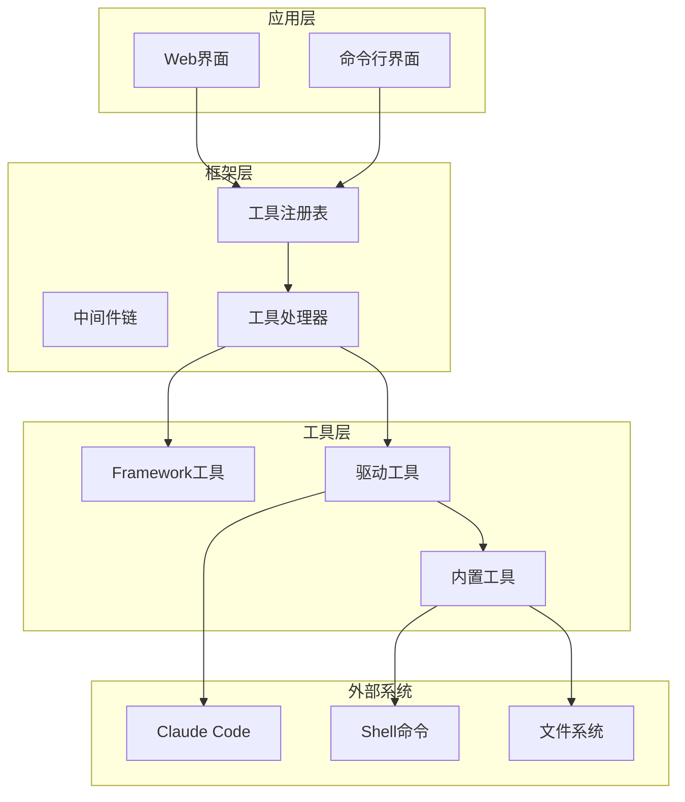

**图表来源**
- [tool.rs:197-402](file://macaca/crates/macaca-framework/src/tool.rs#L197-L402)
- [tool.rs:22-44](file://macaca/crates/macaca-tools/src/tool.rs#L22-L44)

**章节来源**
- [tool.rs:1-122](file://macaca/crates/macaca-framework/src/tool.rs#L1-L122)
- [tool.rs:1-66](file://macaca/crates/macaca-tools/src/tool.rs#L1-L66)

## 核心组件

### ToolHandler接口（LLM集成）

ToolHandler是macaca-framework提供的工具接口，专为大语言模型集成设计：

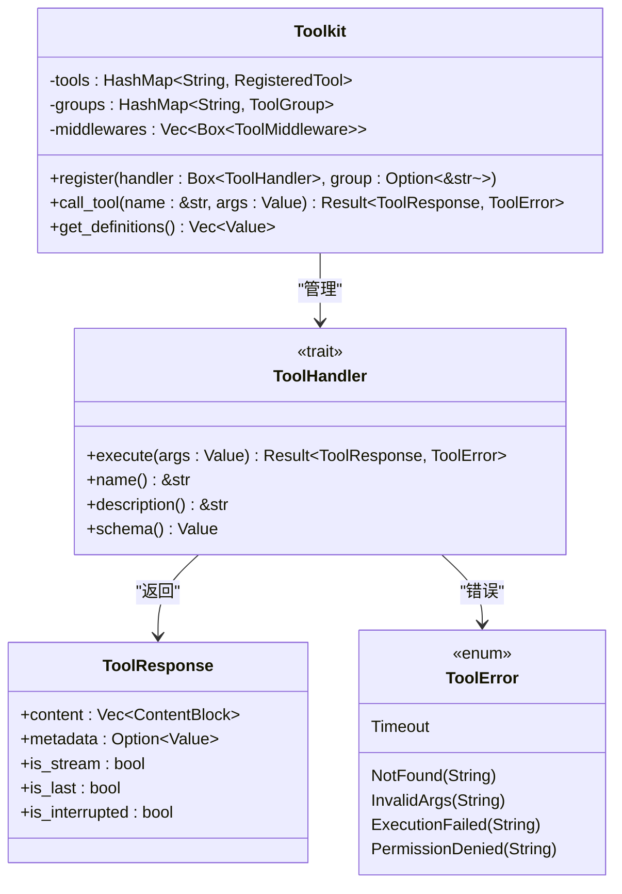

**图表来源**
- [tool.rs:105-122](file://macaca/crates/macaca-framework/src/tool.rs#L105-L122)
- [tool.rs:197-402](file://macaca/crates/macaca-framework/src/tool.rs#L197-L402)
- [tool.rs:20-76](file://macaca/crates/macaca-framework/src/tool.rs#L20-L76)

### Tool接口（驱动集成）

Tool是macaca-tools提供的工具接口，用于驱动程序集成：

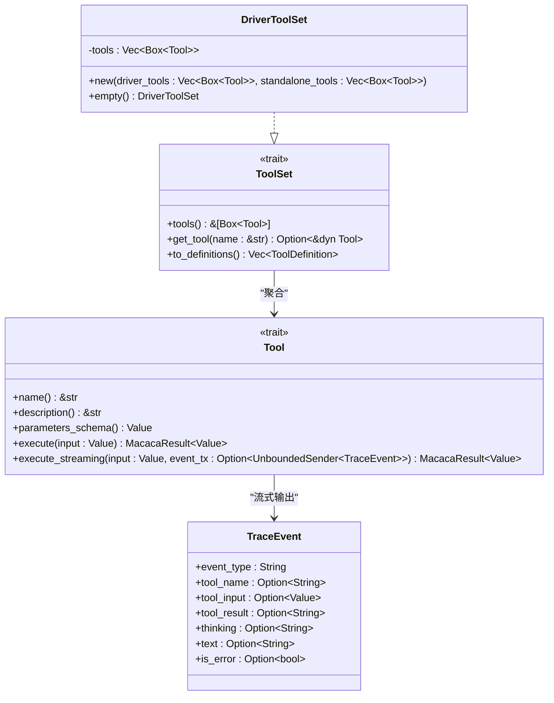

**图表来源**
- [tool.rs:22-44](file://macaca/crates/macaca-tools/src/tool.rs#L22-L44)
- [toolset.rs:7-29](file://macaca/crates/macaca-driver/src/toolset.rs#L7-L29)

**章节来源**
- [tool.rs:105-122](file://macaca/crates/macaca-framework/src/tool.rs#L105-L122)
- [tool.rs:22-44](file://macaca/crates/macaca-tools/src/tool.rs#L22-L44)

## 架构概览

工具系统的执行流程遵循严格的顺序控制：

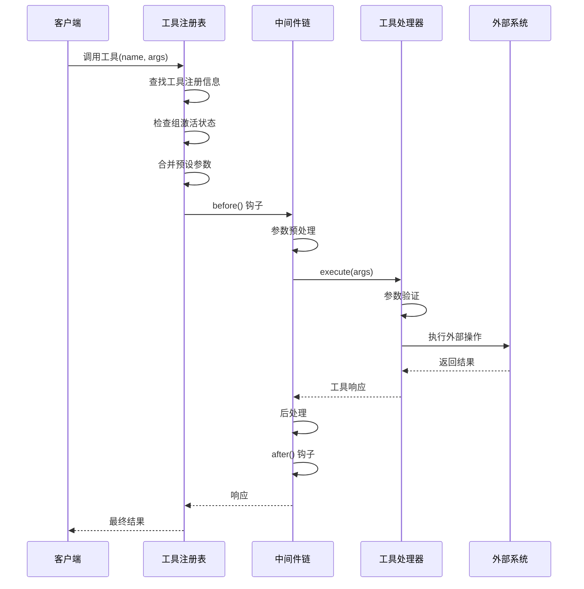

**图表来源**
- [tool.rs:314-371](file://macaca/crates/macaca-framework/src/tool.rs#L314-L371)

## 详细组件分析

### 参数验证机制

系统提供了多层次的参数验证机制：

#### JSON Schema验证
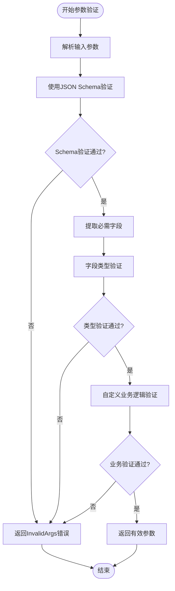

**图表来源**
- [tool.rs:120-121](file://macaca/crates/macaca-framework/src/tool.rs#L120-L121)
- [builtin.rs:78-93](file://macaca/crates/macaca-tools/src/builtin.rs#L78-L93)

#### 内置工具参数验证示例

内置工具展示了完整的参数验证模式：

**章节来源**
- [builtin.rs:78-93](file://macaca/crates/macaca-tools/src/builtin.rs#L78-L93)
- [builtin.rs:130-159](file://macaca/crates/macaca-tools/src/builtin.rs#L130-L159)
- [builtin.rs:203-236](file://macaca/crates/macaca-tools/src/builtin.rs#L203-L236)

### 执行流程控制

工具执行流程包含完整的生命周期管理：

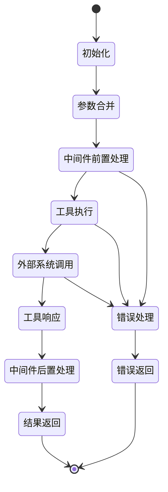

**图表来源**
- [tool.rs:314-371](file://macaca/crates/macaca-framework/src/tool.rs#L314-L371)

### 结果处理机制

系统支持多种结果处理方式：

#### 流式处理
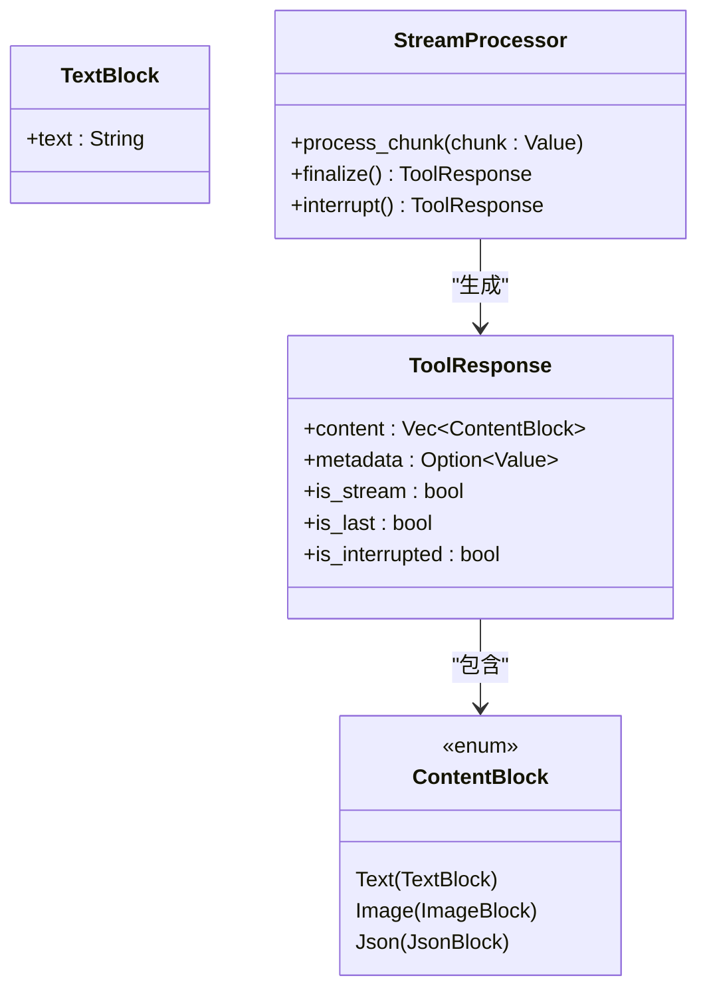

**图表来源**
- [tool.rs:20-76](file://macaca/crates/macaca-framework/src/tool.rs#L20-L76)
- [tool.rs:34-43](file://macaca/crates/macaca-tools/src/tool.rs#L34-L43)

**章节来源**
- [tool.rs:20-76](file://macaca/crates/macaca-framework/src/tool.rs#L20-L76)
- [tool.rs:34-43](file://macaca/crates/macaca-tools/src/tool.rs#L34-L43)

### 中间件系统

中间件提供横切关注点的统一处理：

#### 中间件执行顺序
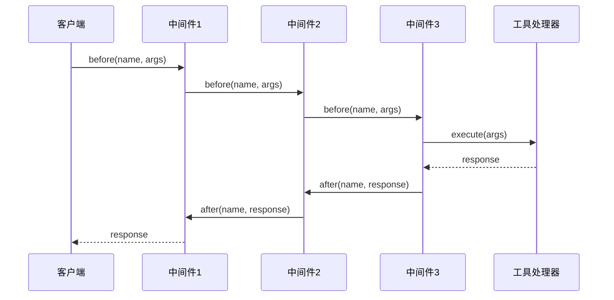

**图表来源**
- [tool.rs:132-143](file://macaca/crates/macaca-framework/src/tool.rs#L132-L143)

**章节来源**
- [tool.rs:132-143](file://macaca/crates/macaca-framework/src/tool.rs#L132-L143)

## 依赖关系分析

工具系统的关键依赖关系如下：

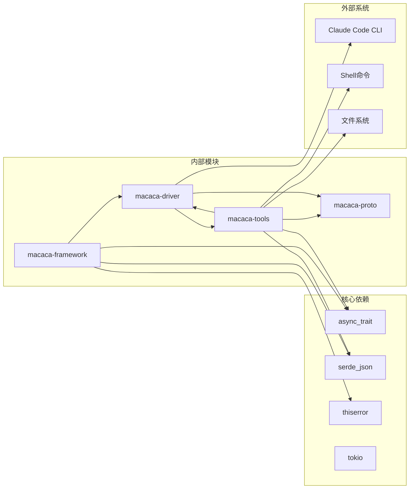

**图表来源**
- [tool.rs:9-14](file://macaca/crates/macaca-framework/src/tool.rs#L9-L14)
- [tool.rs:3-7](file://macaca/crates/macaca-tools/src/tool.rs#L3-L7)

**章节来源**
- [tool.rs:9-14](file://macaca/crates/macaca-framework/src/tool.rs#L9-L14)
- [tool.rs:3-7](file://macaca/crates/macaca-tools/src/tool.rs#L3-L7)

## 性能考虑

### 异步执行优化

系统采用异步编程模型确保高并发性能：

1. **非阻塞I/O**: 使用Tokio运行时进行异步文件和网络操作
2. **流式处理**: 支持流式数据传输减少内存占用
3. **超时控制**: 内置超时机制防止资源泄露

### 缓存策略

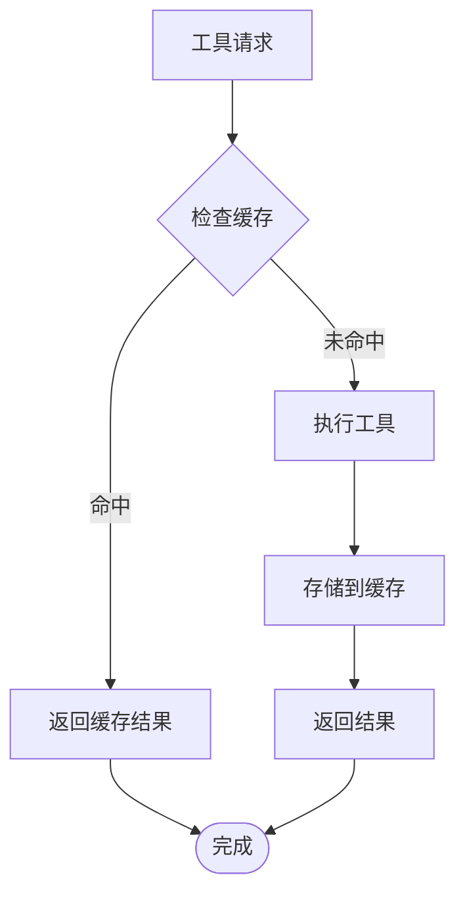

### 并发控制

系统通过以下机制控制并发：

- **任务调度**: 使用Tokio的任务调度器
- **资源限制**: 通过配置限制同时执行的工具数量
- **连接池**: 对外部系统使用连接池管理

## 故障排除指南

### 常见错误类型

系统定义了完整的错误处理机制：

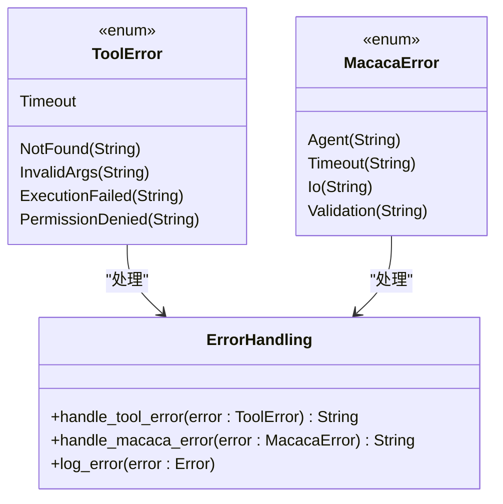

**图表来源**
- [tool.rs:82-99](file://macaca/crates/macaca-framework/src/tool.rs#L82-L99)

### 错误处理最佳实践

#### 参数验证错误
- 使用明确的错误消息帮助调试
- 提供参数期望格式的示例
- 区分必需参数缺失和可选参数问题

#### 执行失败处理
- 实现重试机制对于临时性故障
- 记录详细的上下文信息
- 提供降级策略

**章节来源**
- [tool.rs:82-99](file://macaca/crates/macaca-framework/src/tool.rs#L82-L99)
- [builtin.rs:88-90](file://macaca/crates/macaca-tools/src/builtin.rs#L88-L90)

## 结论

Agent OS的工具接口设计体现了现代异步系统的核心原则：

1. **清晰的抽象层次**: 分离LLM集成和驱动集成的不同需求
2. **灵活的扩展机制**: 通过中间件和工具集实现功能扩展
3. **完善的错误处理**: 提供多层级的错误捕获和恢复机制
4. **高性能设计**: 采用异步编程和流式处理优化性能

该设计为构建复杂的智能代理系统提供了坚实的基础，既满足了当前的需求，又为未来的扩展预留了充足的空间。