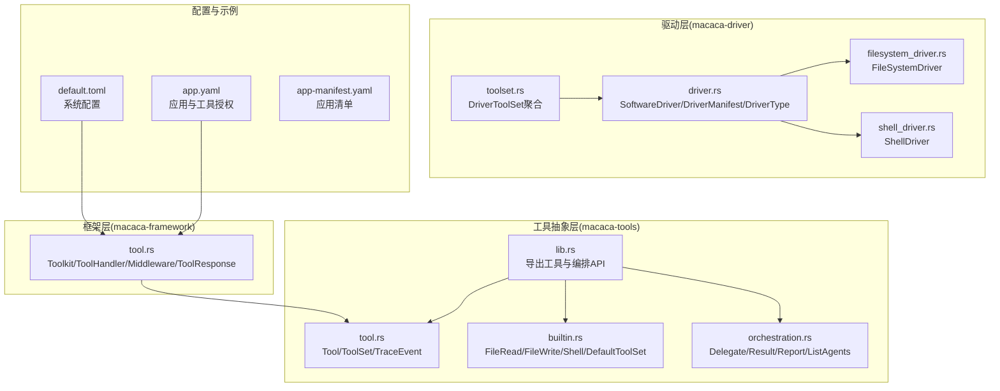
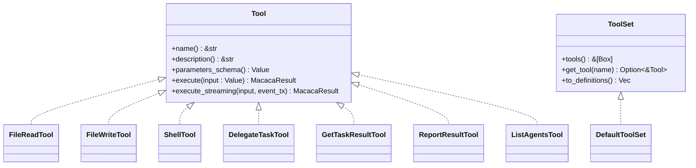
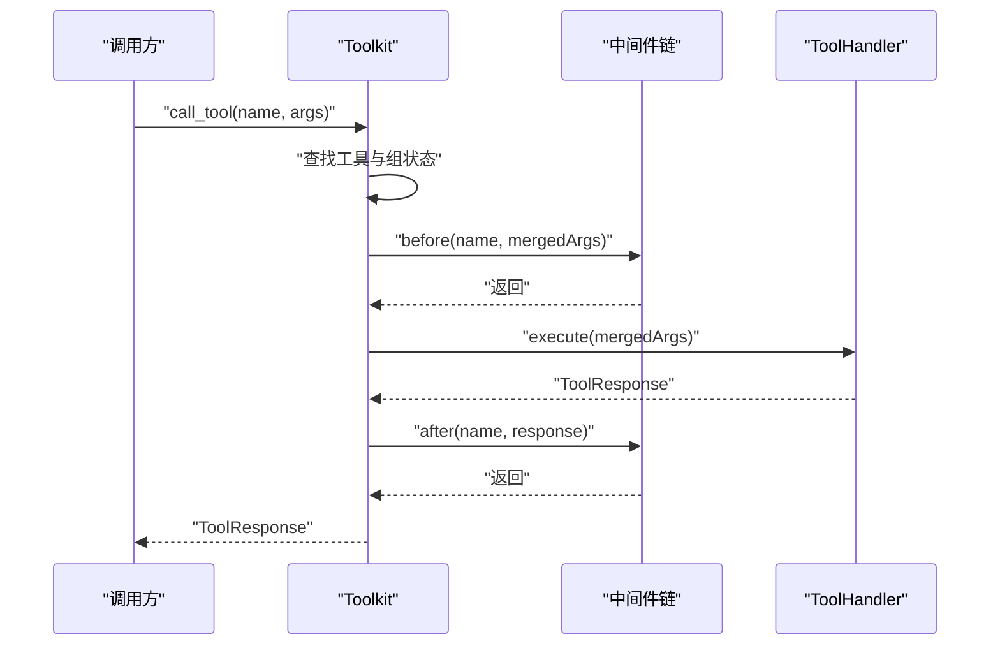
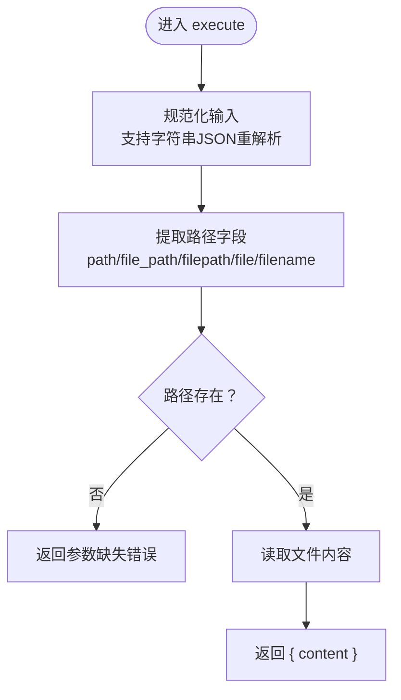
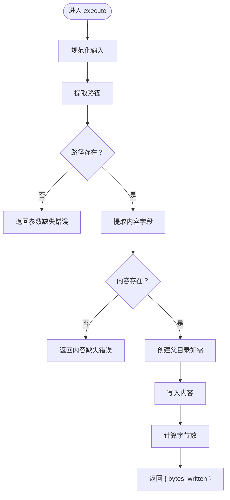
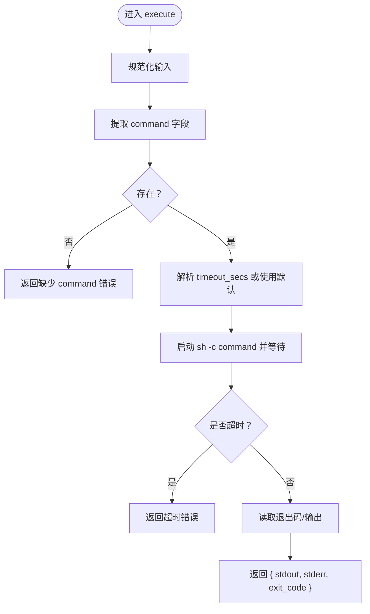
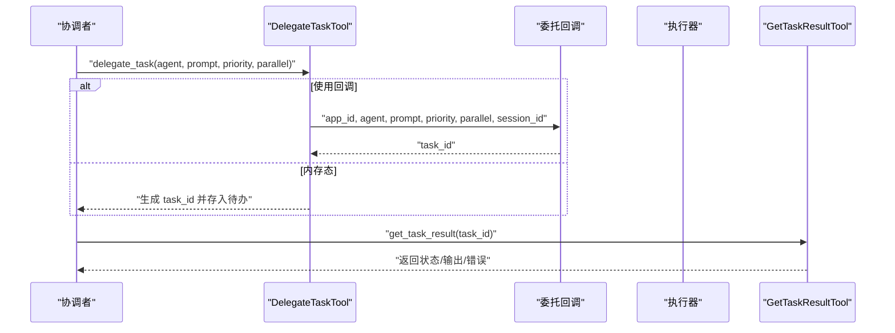
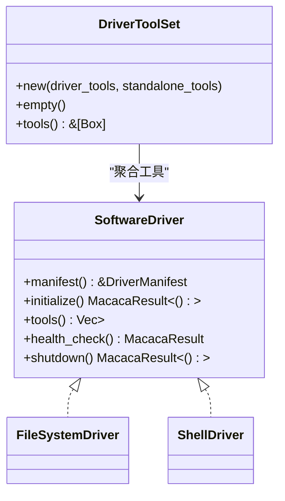
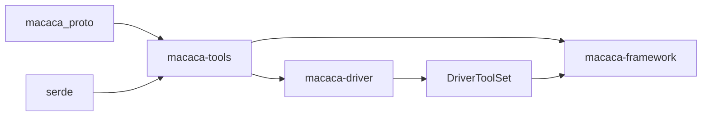

# 工具系统

<cite>
**本文引用的文件**
- [lib.rs](file://macaca/crates/macaca-tools/src/lib.rs)
- [tool.rs](file://macaca/crates/macaca-tools/src/tool.rs)
- [builtin.rs](file://macaca/crates/macaca-tools/src/builtin.rs)
- [orchestration.rs](file://macaca/crates/macaca-tools/src/orchestration.rs)
- [driver.rs](file://macaca/crates/macaca-driver/src/driver.rs)
- [toolset.rs](file://macaca/crates/macaca-driver/src/toolset.rs)
- [filesystem_driver.rs](file://macaca/crates/macaca-driver/src/builtin/filesystem_driver.rs)
- [shell_driver.rs](file://macaca/crates/macaca-driver/src/builtin/shell_driver.rs)
- [tool.rs](file://macaca/crates/macaca-framework/src/tool.rs)
- [default.toml](file://macaca/config/default.toml)
- [app.yaml](file://macaca/examples/apps/fullstack-autodev/app.yaml)
- [app-manifest.yaml](file://macaca/examples/todo-app-demo/app-manifest.yaml)
</cite>

## 目录
1. [简介](#简介)
2. [项目结构](#项目结构)
3. [核心组件](#核心组件)
4. [架构总览](#架构总览)
5. [详细组件分析](#详细组件分析)
6. [依赖分析](#依赖分析)
7. [性能考量](#性能考量)
8. [故障排查指南](#故障排查指南)
9. [结论](#结论)
10. [附录](#附录)

## 简介
本文件系统性梳理 Agent OS 的工具系统，覆盖工具接口设计与实现规范、内置工具实现（文件读写、系统命令、代理编排）、自定义工具开发指南、工具集管理与工具编排机制、配置示例、调试方法与最佳实践。目标是帮助开发者在不深入源码细节的前提下，快速理解并高效使用与扩展工具系统。

## 项目结构
工具系统主要分布在以下模块：
- macaca-tools：通用工具抽象、内置工具实现、编排工具与待办工具
- macaca-driver：软件驱动器抽象与内置驱动（文件系统、Shell）
- macaca-framework：工具注册表、中间件、执行管线与响应模型
- 配置与示例：默认配置、应用清单与工作流配置

**图表来源**
- [lib.rs:1-20](file://macaca/crates/macaca-tools/src/lib.rs#L1-L20)
- [tool.rs:1-66](file://macaca/crates/macaca-tools/src/tool.rs#L1-L66)
- [builtin.rs:1-376](file://macaca/crates/macaca-tools/src/builtin.rs#L1-L376)
- [orchestration.rs:1-429](file://macaca/crates/macaca-tools/src/orchestration.rs#L1-L429)
- [driver.rs:1-90](file://macaca/crates/macaca-driver/src/driver.rs#L1-L90)
- [toolset.rs:1-47](file://macaca/crates/macaca-driver/src/toolset.rs#L1-L47)
- [filesystem_driver.rs:1-96](file://macaca/crates/macaca-driver/src/builtin/filesystem_driver.rs#L1-L96)
- [shell_driver.rs:1-111](file://macaca/crates/macaca-driver/src/builtin/shell_driver.rs#L1-L111)
- [tool.rs:1-402](file://macaca/crates/macaca-framework/src/tool.rs#L1-L402)
- [default.toml:1-119](file://macaca/config/default.toml#L1-L119)
- [app.yaml:1-146](file://macaca/examples/apps/fullstack-autodev/app.yaml#L1-L146)
- [app-manifest.yaml:1-7](file://macaca/examples/todo-app-demo/app-manifest.yaml#L1-L7)

**章节来源**
- [lib.rs:1-20](file://macaca/crates/macaca-tools/src/lib.rs#L1-L20)
- [driver.rs:1-90](file://macaca/crates/macaca-driver/src/driver.rs#L1-L90)
- [tool.rs:1-402](file://macaca/crates/macaca-framework/src/tool.rs#L1-L402)

## 核心组件
- 工具接口与集合
  - Tool：统一的异步可调用工具接口，包含名称、描述、参数Schema、执行与可选的流式事件执行
  - ToolSet：工具集合，支持按名称检索与生成LLM可用的工具定义
  - TraceEvent：工具执行过程中的追踪事件（类型、工具名、输入、输出、思考、文本、错误标记）
- 内置工具
  - 文件读取：file_read，支持多字段别名路径解析，返回内容
  - 文件写入：file_write，支持多字段别名内容解析，自动创建父目录，返回字节数
  - Shell命令：shell，支持超时控制，默认30秒，返回stdout/stderr/exit_code
  - 默认工具集：DefaultToolSet聚合上述内置工具
- 编排工具
  - 委派任务：delegate_task，支持回调委派或内存态存储两种模式
  - 获取结果：get_task_result，支持回调查询或内存态查询
  - 报告结果：report_result，记录完成结果
  - 列出代理：list_agents，动态枚举可用代理
- 驱动器与驱动工具集
  - SoftwareDriver：驱动器生命周期与能力暴露
  - DriverToolSet：将所有驱动提供的工具与独立工具聚合为统一ToolSet
  - 内置驱动：FileSystemDriver、ShellDriver，分别暴露文件系统与Shell能力

**章节来源**
- [tool.rs:1-66](file://macaca/crates/macaca-tools/src/tool.rs#L1-L66)
- [builtin.rs:1-376](file://macaca/crates/macaca-tools/src/builtin.rs#L1-L376)
- [orchestration.rs:1-429](file://macaca/crates/macaca-tools/src/orchestration.rs#L1-L429)
- [driver.rs:1-90](file://macaca/crates/macaca-driver/src/driver.rs#L1-L90)
- [toolset.rs:1-47](file://macaca/crates/macaca-driver/src/toolset.rs#L1-L47)
- [filesystem_driver.rs:1-96](file://macaca/crates/macaca-driver/src/builtin/filesystem_driver.rs#L1-L96)
- [shell_driver.rs:1-111](file://macaca/crates/macaca-driver/src/builtin/shell_driver.rs#L1-L111)

## 架构总览
工具系统采用“抽象接口 + 聚合工具集 + 驱动器 + 执行框架”的分层设计：
- 抽象接口层：Tool/ToolSet定义统一契约
- 内置实现层：builtin.rs提供文件与Shell工具；orchestration.rs提供跨代理编排工具
- 驱动器层：driver.rs定义驱动器契约；toolset.rs聚合驱动工具；builtin驱动封装内置工具
- 执行框架层：framework的Toolkit负责工具注册、组激活/禁用、中间件链、执行与定义导出

**图表来源**
- [tool.rs:22-65](file://macaca/crates/macaca-tools/src/tool.rs#L22-L65)
- [builtin.rs:47-268](file://macaca/crates/macaca-tools/src/builtin.rs#L47-L268)
- [orchestration.rs:46-428](file://macaca/crates/macaca-tools/src/orchestration.rs#L46-L428)

## 详细组件分析

### 工具接口与执行流程
- 接口要点
  - 参数校验通过JSON Schema进行，确保LLM调用时的结构一致性
  - 支持流式事件（execute_streaming），便于长耗时任务的进度/中间结果上报
  - 执行返回统一的MacacaResult<Value>，便于上层框架处理
- 执行流程（以Framework.Toolkit为例）
  - 组激活检查：basic组始终激活，其他组可开关
  - 参数合并：preset_args与调用方参数合并，调用方优先
  - 中间件链：before/after按注册顺序执行
  - 执行处理器：handler.execute(args)
  - 返回响应：ToolResponse封装内容块、元数据与流式状态

**图表来源**
- [tool.rs:314-371](file://macaca/crates/macaca-framework/src/tool.rs#L314-L371)

**章节来源**
- [tool.rs:1-402](file://macaca/crates/macaca-framework/src/tool.rs#L1-L402)

### 内置工具实现

#### 文件读取工具（file_read）
- 输入参数Schema支持多种路径别名，自动规范化输入
- 执行前记录span字段用于追踪
- 失败时返回Agent错误，包含具体路径信息

**图表来源**
- [builtin.rs:77-94](file://macaca/crates/macaca-tools/src/builtin.rs#L77-L94)

**章节来源**
- [builtin.rs:47-94](file://macaca/crates/macaca-tools/src/builtin.rs#L47-L94)

#### 文件写入工具（file_write）
- 支持多种内容别名（content/text/body），自动创建父目录
- 返回写入字节数，便于审计与监控

**图表来源**
- [builtin.rs:129-159](file://macaca/crates/macaca-tools/src/builtin.rs#L129-L159)

**章节来源**
- [builtin.rs:96-160](file://macaca/crates/macaca-tools/src/builtin.rs#L96-L160)

#### Shell工具（shell）
- 支持超时控制，默认30秒
- 返回标准输出、标准错误与退出码
- 超时返回超时错误，失败返回Agent错误

**图表来源**
- [builtin.rs:202-236](file://macaca/crates/macaca-tools/src/builtin.rs#L202-L236)

**章节来源**
- [builtin.rs:162-237](file://macaca/crates/macaca-tools/src/builtin.rs#L162-L237)

### 代理编排工具
- 委派任务（delegate_task）
  - 支持回调委派到真实执行器或内存态存储
  - 可设置优先级与并行标志
- 获取结果（get_task_result）
  - 支持回调查询或内存态查询
  - 警告：不要轮询，应基于系统Hook通知后一次性调用
- 报告结果（report_result）
  - 记录完成结果并清理待办
- 列出代理（list_agents）
  - 动态回调返回可用代理列表

**图表来源**
- [orchestration.rs:140-326](file://macaca/crates/macaca-tools/src/orchestration.rs#L140-L326)

**章节来源**
- [orchestration.rs:46-428](file://macaca/crates/macaca-tools/src/orchestration.rs#L46-L428)

### 驱动器与驱动工具集
- SoftwareDriver
  - 生命周期：initialize → tools → health_check → shutdown
  - 能力通过Tool集合暴露给统一工具系统
- DriverToolSet
  - 将所有驱动工具与独立工具合并为统一ToolSet
- 内置驱动
  - FileSystemDriver：暴露file_read与file_write
  - ShellDriver：暴露shell

**图表来源**
- [driver.rs:34-61](file://macaca/crates/macaca-driver/src/driver.rs#L34-L61)
- [toolset.rs:5-29](file://macaca/crates/macaca-driver/src/toolset.rs#L5-L29)
- [filesystem_driver.rs:40-62](file://macaca/crates/macaca-driver/src/builtin/filesystem_driver.rs#L40-L62)
- [shell_driver.rs:49-74](file://macaca/crates/macaca-driver/src/builtin/shell_driver.rs#L49-L74)

**章节来源**
- [driver.rs:1-90](file://macaca/crates/macaca-driver/src/driver.rs#L1-L90)
- [toolset.rs:1-47](file://macaca/crates/macaca-driver/src/toolset.rs#L1-L47)
- [filesystem_driver.rs:1-96](file://macaca/crates/macaca-driver/src/builtin/filesystem_driver.rs#L1-L96)
- [shell_driver.rs:1-111](file://macaca/crates/macaca-driver/src/builtin/shell_driver.rs#L1-L111)

## 依赖分析
- 模块耦合
  - macaca-tools 依赖 macaca_proto（错误与结果类型）与 serde（JSON序列化）
  - macaca-driver 依赖 macaca-tools::Tool 与 macaca_proto
  - macaca-framework 依赖 macaca-tools::Tool 与 serde
- 关键依赖关系
  - 内置工具（FileRead/FileWrite/Shell）实现 Tool 接口
  - 驱动器（FileSystemDriver/ShellDriver）实现 SoftwareDriver，并暴露对应工具
  - DriverToolSet 将驱动工具与独立工具聚合
  - Toolkit 提供工具注册、组管理、中间件与执行

**图表来源**
- [lib.rs:1-20](file://macaca/crates/macaca-tools/src/lib.rs#L1-L20)
- [driver.rs:1-90](file://macaca/crates/macaca-driver/src/driver.rs#L1-L90)
- [tool.rs:1-402](file://macaca/crates/macaca-framework/src/tool.rs#L1-L402)

**章节来源**
- [lib.rs:1-20](file://macaca/crates/macaca-tools/src/lib.rs#L1-L20)
- [driver.rs:1-90](file://macaca/crates/macaca-driver/src/driver.rs#L1-L90)
- [tool.rs:1-402](file://macaca/crates/macaca-framework/src/tool.rs#L1-L402)

## 性能考量
- I/O与并发
  - 文件读写与Shell命令均采用异步IO，建议在高并发场景下限制同时执行的任务数量，避免磁盘/进程资源争用
- 超时与资源保护
  - Shell工具提供超时控制，建议根据任务复杂度调整默认超时
- 中间件开销
  - 中间件链会增加调用开销，建议仅在必要时启用日志/限速等中间件
- 结果缓存与去重
  - 对频繁查询的结果可引入缓存策略，减少重复I/O与命令执行

## 故障排查指南
- 常见错误类型
  - 参数缺失：如file_read缺少路径、file_write缺少内容或路径
  - 执行失败：文件权限不足、命令不存在或无法spawn
  - 超时：Shell命令超过设定超时
- 定位方法
  - 查看TraceEvent与日志span字段，确认工具名、输入与路径
  - 在Framework中启用调试日志级别，观察中间件before/after链
  - 检查OrchestrationState或回调是否正确配置
- 快速修复
  - 补充缺失参数或修正字段别名
  - 调整Shell超时或检查命令可用性
  - 确认驱动器健康检查与生命周期调用

**章节来源**
- [builtin.rs:77-94](file://macaca/crates/macaca-tools/src/builtin.rs#L77-L94)
- [builtin.rs:129-159](file://macaca/crates/macaca-tools/src/builtin.rs#L129-L159)
- [builtin.rs:202-236](file://macaca/crates/macaca-tools/src/builtin.rs#L202-L236)
- [orchestration.rs:140-326](file://macaca/crates/macaca-tools/src/orchestration.rs#L140-L326)
- [default.toml:106-119](file://macaca/config/default.toml#L106-L119)

## 结论
工具系统通过清晰的接口抽象、完善的内置实现与灵活的驱动器机制，提供了统一的工具调用体验。结合Framework的Toolkit，开发者可以便捷地注册、分组、中间件化与执行工具。编排工具进一步支撑了跨代理协作与任务治理。建议在生产环境中重视参数校验、超时控制与中间件开销，并通过配置与日志体系进行可观测性建设。

## 附录

### 自定义工具开发指南
- 实现步骤
  - 实现 Tool 接口：提供name/description/parameters_schema/execute
  - 如需流式事件，实现 execute_streaming 并通过 UnboundedSender 发送 TraceEvent
  - 将工具注册到 ToolSet（可直接使用 DefaultToolSet 或自定义 ToolSet）
- 错误处理
  - 使用 MacacaError 的具体变体表达错误语义
  - 在执行前后通过中间件注入统一的日志与限速策略
- 安全考虑
  - Shell命令应严格白名单与参数转义，避免命令注入
  - 文件操作限制在受控工作区，避免越权访问
- 性能优化
  - 对热点工具引入连接池/缓存
  - 合理拆分长任务为可中断的流式执行

**章节来源**
- [tool.rs:22-65](file://macaca/crates/macaca-tools/src/tool.rs#L22-L65)
- [tool.rs:102-143](file://macaca/crates/macaca-framework/src/tool.rs#L102-L143)

### 工具集管理与编排
- 工具集管理
  - 通过 ToolSet.to_definitions 导出LLM可用的工具定义
  - 使用 DriverToolSet 聚合驱动工具与独立工具
- 工具编排
  - 使用 delegate_task 委派任务，get_task_result 查询结果，report_result 回传结果
  - 通过优先级与并行标志控制执行顺序与并发度

**章节来源**
- [tool.rs:46-65](file://macaca/crates/macaca-tools/src/tool.rs#L46-L65)
- [toolset.rs:5-29](file://macaca/crates/macaca-driver/src/toolset.rs#L5-L29)
- [orchestration.rs:46-428](file://macaca/crates/macaca-tools/src/orchestration.rs#L46-L428)

### 配置示例与最佳实践
- 系统配置
  - 日志级别与追踪开关：observability.log_level、tracing_enabled
  - 工作区根目录：workspace.root_dir
  - 持久化引擎：persist.engine
- 应用与工具授权
  - 在应用清单中声明允许的工具列表，避免越权调用
  - 示例应用fullstack-autodev展示了多Agent与工具授权的组织方式

**章节来源**
- [default.toml:106-119](file://macaca/config/default.toml#L106-L119)
- [app.yaml:65-146](file://macaca/examples/apps/fullstack-autodev/app.yaml#L65-L146)
- [app-manifest.yaml:1-7](file://macaca/examples/todo-app-demo/app-manifest.yaml#L1-L7)