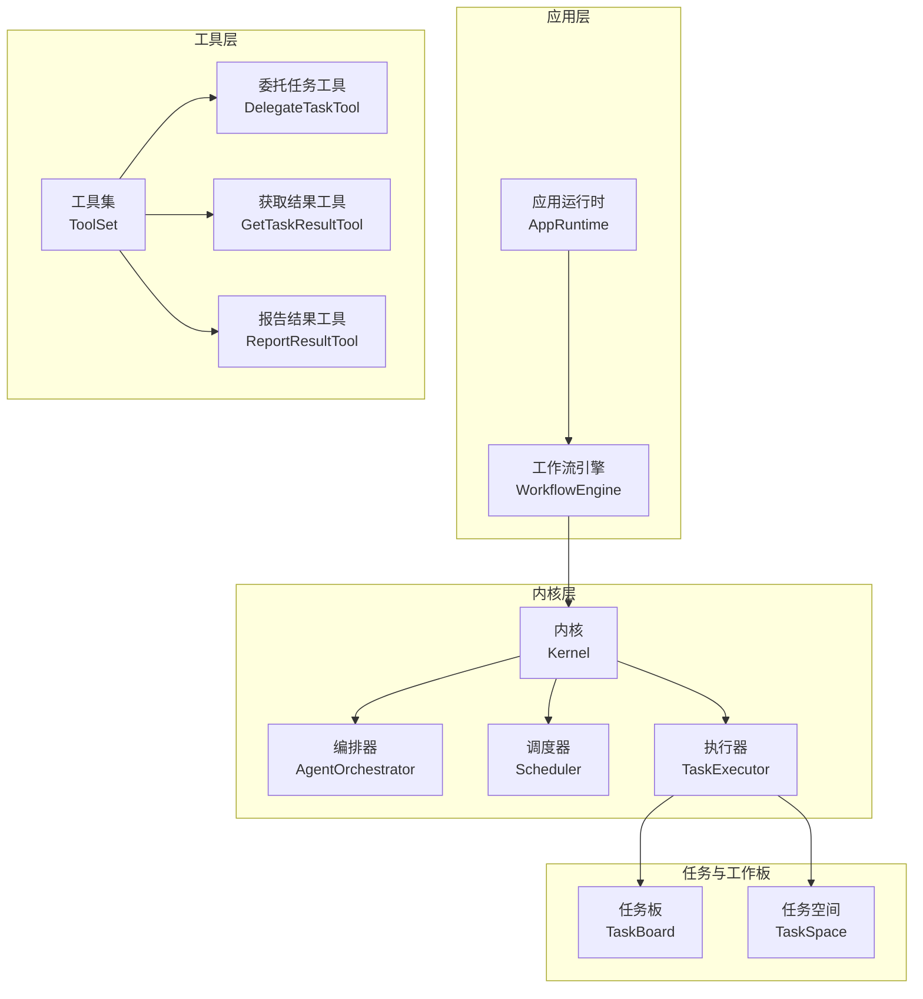
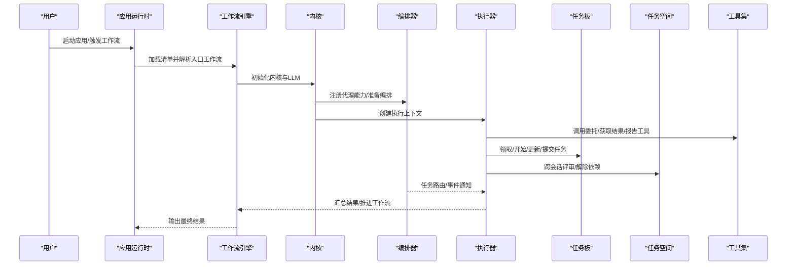
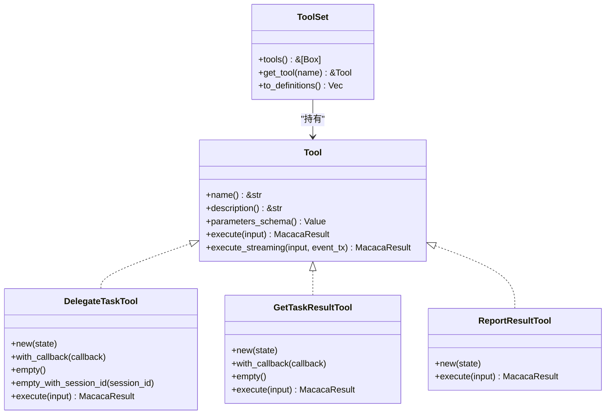
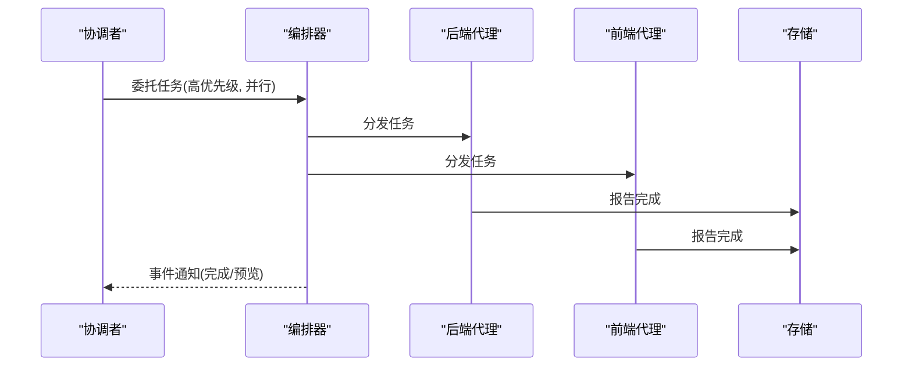
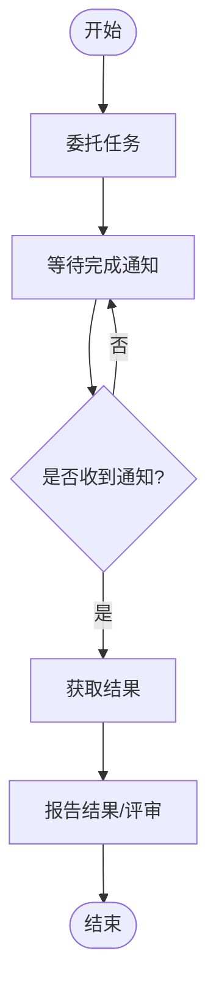
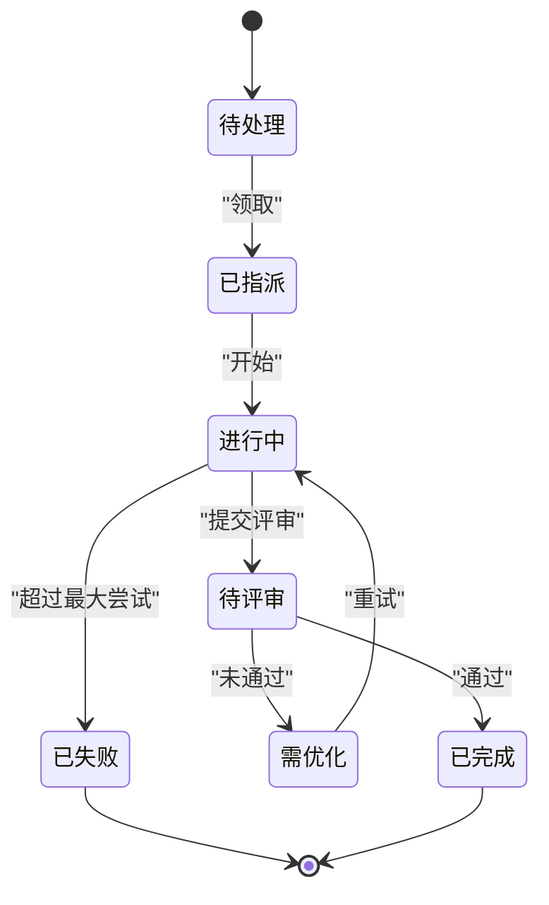
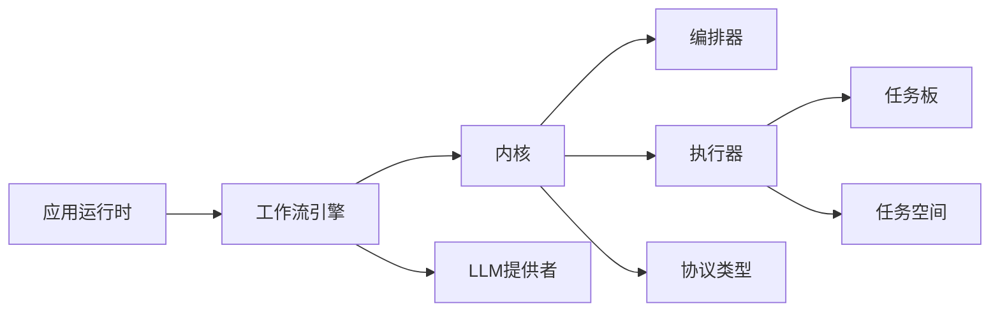

# 工具编排与管理

<cite>
**本文引用的文件**
- [Cargo.toml](file://macaca/Cargo.toml)
- [lib.rs（tools）](file://macaca/crates/macaca-tools/src/lib.rs)
- [tool.rs](file://macaca/crates/macaca-tools/src/tool.rs)
- [orchestration.rs](file://macaca/crates/macaca-tools/src/orchestration.rs)
- [lib.rs（task）](file://macaca/crates/macaca-task/src/lib.rs)
- [todo_board.rs](file://macaca/crates/macaca-task/src/todo_board.rs)
- [lib.rs（kernel）](file://macaca/crates/macaca-kernel/src/lib.rs)
- [orchestrator.rs](file://macaca/crates/macaca-kernel/src/orchestrator.rs)
- [lib.rs（agent）](file://macaca/crates/macaca-agent/src/lib.rs)
- [lib.rs（app）](file://macaca/crates/macaca-app/src/lib.rs)
- [workflow.rs](file://macaca/crates/macaca-app/src/workflow.rs)
</cite>

## 目录
1. [简介](#简介)
2. [项目结构](#项目结构)
3. [核心组件](#核心组件)
4. [架构总览](#架构总览)
5. [详细组件分析](#详细组件分析)
6. [依赖分析](#依赖分析)
7. [性能考虑](#性能考虑)
8. [故障排查指南](#故障排查指南)
9. [结论](#结论)
10. [附录](#附录)

## 简介
本文件面向“工具编排与管理”主题，系统化梳理工具集的注册、发现、加载与卸载机制；阐述工具间依赖关系、执行顺序控制与并行处理策略；给出任务编排工具的使用指南（委托任务、获取结果、报告进度等）；总结工具状态管理、错误恢复与重试机制；并提供复杂工作流设计模式与性能优化策略。内容基于仓库中的工具抽象层、任务板与空间模型、内核编排器以及应用工作流引擎等模块进行深入分析。

## 项目结构
该仓库采用多 Crate 的工作区组织方式，围绕“协议定义、工具抽象、任务编排、内核调度、应用运行时、Web 展示”等维度划分模块。工具编排与管理相关的关键模块如下：
- 工具抽象与内置工具：macaca-tools
- 任务与工作板：macaca-task
- 内核与编排：macaca-kernel
- 应用与工作流：macaca-app
- 协议与类型：macaca-proto
- 其他支撑模块：macaca-agent、macaca-runtime、macaca-ipc、macaca-memory、macaca-persist、macaca-llm、macaca-sdk、macaca-gateway、macaca-cli、macaca-driver、macaca-mcp、macaca-skill、macaca-driver-claude-code、macaca-web

图表来源
- [Cargo.toml:1-25](file://macaca/Cargo.toml#L1-L25)
- [lib.rs（app）:1-21](file://macaca/crates/macaca-app/src/lib.rs#L1-L21)
- [lib.rs（kernel）:1-29](file://macaca/crates/macaca-kernel/src/lib.rs#L1-L29)
- [lib.rs（task）:1-22](file://macaca/crates/macaca-task/src/lib.rs#L1-L22)
- [lib.rs（tools）:1-20](file://macaca/crates/macaca-tools/src/lib.rs#L1-L20)

章节来源
- [Cargo.toml:1-25](file://macaca/Cargo.toml#L1-L25)

## 核心组件
- 工具抽象与工具集
  - 工具 Trait 定义了名称、描述、参数 Schema 与异步执行接口；支持可选的流式事件回调。
  - 工具集 Trait 提供工具集合的统一访问与 LLM 友好定义转换。
- 任务板与任务空间
  - 任务板为单个代理提供隔离的任务面板，支持按会话分组、序列号顺序领取、进度更新、提交评审、失败标记与重试优化等。
  - 任务空间为应用级视图，支持跨会话的任务汇总、依赖解除、评审与目标生命周期管理。
- 编排器与内核
  - 编排器负责代理能力注册、任务委托、路由决策、结果聚合与事件通知。
  - 内核整合调度、执行、服务适配与状态跟踪，提供应用级执行环境。
- 应用工作流引擎
  - 基于应用清单的工作流执行器，构建系统提示、校验步骤依赖、定位入口工作流。

章节来源
- [tool.rs:22-66](file://macaca/crates/macaca-tools/src/tool.rs#L22-L66)
- [lib.rs（tools）:1-20](file://macaca/crates/macaca-tools/src/lib.rs#L1-L20)
- [todo_board.rs:68-230](file://macaca/crates/macaca-task/src/todo_board.rs#L68-L230)
- [todo_board.rs:252-509](file://macaca/crates/macaca-task/src/todo_board.rs#L252-L509)
- [orchestrator.rs:25-36](file://macaca/crates/macaca-kernel/src/orchestrator.rs#L25-L36)
- [lib.rs（kernel）:14-29](file://macaca/crates/macaca-kernel/src/lib.rs#L14-L29)
- [workflow.rs:44-56](file://macaca/crates/macaca-app/src/workflow.rs#L44-L56)

## 架构总览
下图展示从应用工作流到内核编排、再到任务板/空间与工具集的端到端交互路径。

图表来源
- [workflow.rs:52-56](file://macaca/crates/macaca-app/src/workflow.rs#L52-L56)
- [lib.rs（kernel）:14-29](file://macaca/crates/macaca-kernel/src/lib.rs#L14-L29)
- [orchestrator.rs:61-100](file://macaca/crates/macaca-kernel/src/orchestrator.rs#L61-L100)
- [todo_board.rs:94-146](file://macaca/crates/macaca-task/src/todo_board.rs#L94-L146)
- [lib.rs（tools）:8-19](file://macaca/crates/macaca-tools/src/lib.rs#L8-L19)

## 详细组件分析

### 工具集管理机制
- 工具注册与发现
  - 工具通过实现工具 Trait 并加入工具集；工具集提供按名称检索与 LLM 友好定义导出。
  - 工具集可由应用或驱动动态装配，形成可被 LLM 发现与调用的工具目录。
- 工具加载与卸载
  - 加载：在应用启动或运行时，将工具实例注入工具集；可通过回调桥接真实执行（如委托任务）。
  - 卸载：通过移除工具实例或重建工具集实现；注意避免并发访问导致的状态不一致。
- 工具执行与流式事件
  - 支持同步执行与可选的流式事件推送，便于前端实时展示执行过程。

图表来源
- [tool.rs:22-66](file://macaca/crates/macaca-tools/src/tool.rs#L22-L66)
- [orchestration.rs:51-101](file://macaca/crates/macaca-tools/src/orchestration.rs#L51-L101)
- [orchestration.rs:216-252](file://macaca/crates/macaca-tools/src/orchestration.rs#L216-L252)
- [orchestration.rs:329-379](file://macaca/crates/macaca-tools/src/orchestration.rs#L329-L379)

章节来源
- [tool.rs:22-66](file://macaca/crates/macaca-tools/src/tool.rs#L22-L66)
- [lib.rs（tools）:8-19](file://macaca/crates/macaca-tools/src/lib.rs#L8-L19)

### 工具编排系统
- 代理间依赖关系与路由
  - 编排器维护代理能力字典，依据关键字与示例匹配最佳代理；支持优先级与并行标记。
  - 委托任务工具支持两种模式：纯内存态（遗留）与回调执行（真实）。
- 执行顺序控制与并行策略
  - 任务按优先级选择；并行标志允许同时委派多个任务；编排器负责事件通知与结果聚合。
  - 任务板按会话分组与序列号顺序领取，确保串行约束；任务空间解除依赖后自动转为可执行。

图表来源
- [orchestrator.rs:61-100](file://macaca/crates/macaca-kernel/src/orchestrator.rs#L61-L100)
- [orchestrator.rs:111-134](file://macaca/crates/macaca-kernel/src/orchestrator.rs#L111-L134)
- [orchestration.rs:140-194](file://macaca/crates/macaca-tools/src/orchestration.rs#L140-L194)

章节来源
- [orchestrator.rs:150-186](file://macaca/crates/macaca-kernel/src/orchestrator.rs#L150-L186)
- [orchestration.rs:46-101](file://macaca/crates/macaca-tools/src/orchestration.rs#L46-L101)

### 任务编排工具使用指南
- 委托任务
  - 使用委托工具传入目标代理名与清晰指令；可设置优先级与并行标志；支持回调模式直接委派至执行器。
- 获取结果
  - 在收到完成通知后，调用获取结果工具一次性拉取；避免轮询；回调模式下由执行器返回结构化结果。
- 报告进度
  - 代理在任务板上更新进度与摘要；完成后提交评审；评审通过则解除依赖，失败进入优化重试。

图表来源
- [orchestration.rs:140-194](file://macaca/crates/macaca-tools/src/orchestration.rs#L140-L194)
- [orchestration.rs:277-326](file://macaca/crates/macaca-tools/src/orchestration.rs#L277-L326)
- [todo_board.rs:148-174](file://macaca/crates/macaca-task/src/todo_board.rs#L148-L174)

章节来源
- [orchestration.rs:140-194](file://macaca/crates/macaca-tools/src/orchestration.rs#L140-L194)
- [todo_board.rs:148-174](file://macaca/crates/macaca-task/src/todo_board.rs#L148-L174)

### 工具状态管理、错误恢复与重试机制
- 状态流转
  - 任务板：Pending → Assigned → InProgress → PendingReview → Completed/NeedsOptimization/Failed。
  - 任务空间：跨会话评审与解除依赖；取消任务保持依赖阻塞状态。
- 错误恢复与重试
  - 失败任务进入 NeedsOptimization，记录改进建议；达到最大尝试次数后标记失败。
  - 依赖解除后自动转为可执行；Plan Agent 可重新分配任务。
- 会话隔离
  - 任务板按会话分组，不同会话独立排序与领取，避免串扰。

图表来源
- [todo_board.rs:124-142](file://macaca/crates/macaca-task/src/todo_board.rs#L124-L142)
- [todo_board.rs:319-358](file://macaca/crates/macaca-task/src/todo_board.rs#L319-L358)

章节来源
- [todo_board.rs:148-224](file://macaca/crates/macaca-task/src/todo_board.rs#L148-L224)
- [todo_board.rs:319-358](file://macaca/crates/macaca-task/src/todo_board.rs#L319-L358)

### 复杂工作流设计模式与性能优化
- 设计模式
  - 分层工作流：初始化 → 计划 → 执行 → 验证；每层职责清晰，工具驱动。
  - 代理能力匹配：根据关键词与示例评分选择最优代理，降低路由成本。
  - 事件驱动：编排器以消息通道通知完成，避免轮询。
- 性能优化
  - 并行执行：对无依赖任务启用并行，提升吞吐。
  - 优先级调度：高优任务优先出队，缩短关键路径。
  - 依赖解除：评审通过后立即解除下游阻塞，减少空转。
  - 存储与索引：任务空间按会话与状态聚合统计，便于快速概览与异常检测。

章节来源
- [workflow.rs:122-158](file://macaca/crates/macaca-app/src/workflow.rs#L122-L158)
- [orchestrator.rs:150-186](file://macaca/crates/macaca-kernel/src/orchestrator.rs#L150-L186)
- [todo_board.rs:425-443](file://macaca/crates/macaca-task/src/todo_board.rs#L425-L443)

## 依赖分析
- 模块耦合
  - 应用层依赖内核层提供的执行与编排能力；内核层依赖工具集与任务板/空间模型。
  - 工具集通过回调桥接到内核执行器，形成闭环。
- 关键依赖链
  - AppRuntime → WorkflowEngine → Kernel → AgentOrchestrator → TaskExecutor → TaskBoard/TaskSpace
  - WorkflowEngine → LlmProvider（用于提示构建）
- 外部依赖
  - 异步运行时、序列化、日志追踪、UUID、时间戳等通用依赖由工作区统一声明。

图表来源
- [lib.rs（app）:14-21](file://macaca/crates/macaca-app/src/lib.rs#L14-L21)
- [lib.rs（kernel）:14-29](file://macaca/crates/macaca-kernel/src/lib.rs#L14-L29)
- [workflow.rs:44-56](file://macaca/crates/macaca-app/src/workflow.rs#L44-L56)

章节来源
- [Cargo.toml:33-90](file://macaca/Cargo.toml#L33-L90)
- [lib.rs（app）:14-21](file://macaca/crates/macaca-app/src/lib.rs#L14-L21)
- [lib.rs（kernel）:14-29](file://macaca/crates/macaca-kernel/src/lib.rs#L14-L29)

## 性能考虑
- 并行度控制
  - 通过并行标志与最大待办数量限制，防止资源争用与过载。
- 事件驱动与批处理
  - 使用消息通道批量通知完成事件，减少轮询开销。
- 依赖图检测
  - 在任务空间中检测循环依赖，提前阻断无效路径。
- 会话隔离与状态聚合
  - 会话内顺序保证与跨会话状态聚合，平衡一致性与性能。

## 故障排查指南
- 常见问题
  - 委托任务无响应：检查编排器是否收到事件、代理是否正确注册能力、回调是否可达。
  - 获取结果报错：确认任务 ID 是否存在、是否已收到完成通知、回调是否返回有效数据。
  - 任务卡住：检查依赖是否全部完成、会话是否正确、是否存在循环依赖。
- 排查步骤
  - 查看编排器事件通道与完成结果映射。
  - 核对任务板状态与任务空间进度摘要。
  - 检查代理能力关键字与示例匹配度，必要时调整评分逻辑。
  - 对失败任务查看优化建议与尝试次数，决定重试或人工干预。

章节来源
- [orchestrator.rs:111-134](file://macaca/crates/macaca-kernel/src/orchestrator.rs#L111-L134)
- [orchestration.rs:277-326](file://macaca/crates/macaca-tools/src/orchestration.rs#L277-L326)
- [todo_board.rs:425-443](file://macaca/crates/macaca-task/src/todo_board.rs#L425-L443)

## 结论
本系统通过“工具抽象 + 任务板/空间 + 内核编排 + 应用工作流”的分层设计，实现了可扩展、可观测且可演进的工具编排与管理能力。工具注册与发现、代理路由与并行执行、任务状态与依赖管理、错误恢复与重试机制共同构成了稳定可靠的自动化工作流基础设施。结合工作流设计模式与性能优化策略，可在复杂场景中实现高效、可控的智能体协作。

## 附录
- 关键术语
  - 工具：可被 LLM 调用的原子能力单元。
  - 工具集：工具的集合与对外定义。
  - 任务板：单代理的任务视图与状态机。
  - 任务空间：跨代理的应用级任务视图。
  - 编排器：代理能力注册、任务路由与事件通知的核心。
  - 工作流引擎：基于应用清单的工作流执行器。