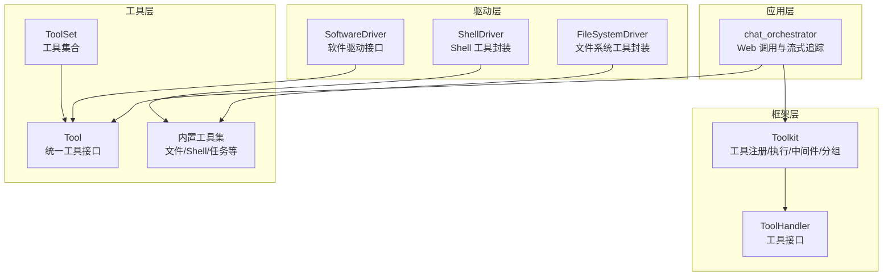
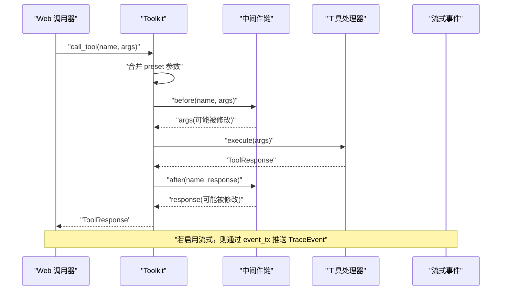
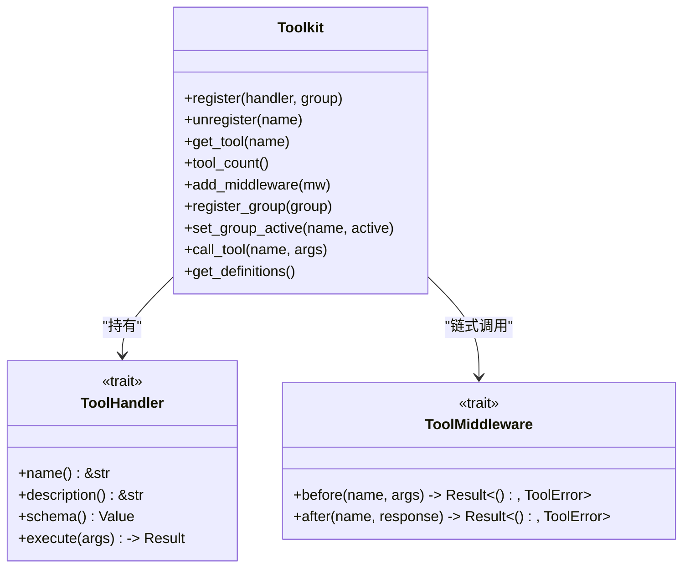
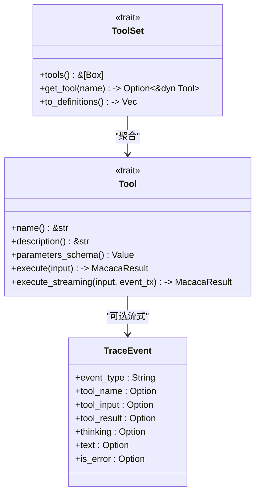
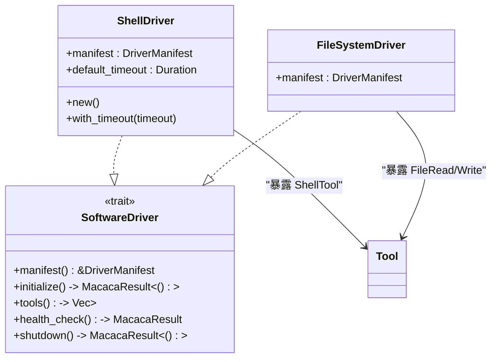
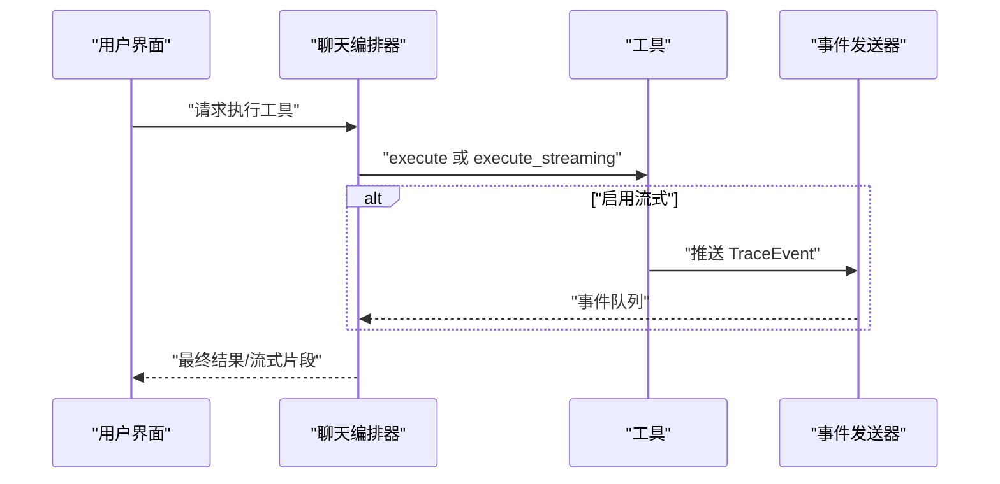
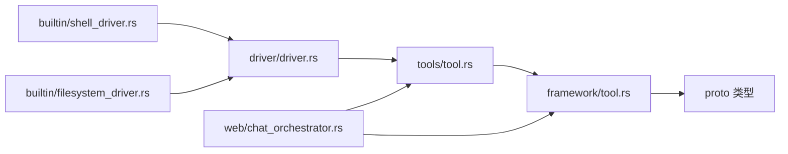

# 自定义工具开发

<cite>
**本文引用的文件**
- [tool.rs（框架层）](file://macaca/crates/macaca-framework/src/tool.rs)
- [lib.rs（框架层）](file://macaca/crates/macaca-framework/src/lib.rs)
- [tool.rs（工具层）](file://macaca/crates/macaca-tools/src/tool.rs)
- [lib.rs（工具层）](file://macaca/crates/macaca-tools/src/lib.rs)
- [driver.rs（驱动层）](file://macaca/crates/macaca-driver/src/driver.rs)
- [shell_driver.rs（内置驱动）](file://macaca/crates/macaca-driver/src/builtin/shell_driver.rs)
- [filesystem_driver.rs（内置驱动）](file://macaca/crates/macaca-driver/src/builtin/filesystem_driver.rs)
- [chat_orchestrator.rs（Web集成）](file://macaca/crates/macaca-web/src/chat_orchestrator.rs)
</cite>

## 目录
1. [引言](#引言)
2. [项目结构](#项目结构)
3. [核心组件](#核心组件)
4. [架构总览](#架构总览)
5. [详细组件分析](#详细组件分析)
6. [依赖关系分析](#依赖关系分析)
7. [性能考虑](#性能考虑)
8. [故障排查指南](#故障排查指南)
9. [结论](#结论)
10. [附录](#附录)

## 引言
本指南面向希望在 Agent OS 中开发“自定义工具”的工程师与架构师。内容覆盖从需求分析、设计、实现、测试、调试到部署发布的全流程，重点围绕两类工具抽象展开：
- 框架层工具：通过 Toolkit 管理、支持中间件与分组控制，适合通用能力与跨域工具。
- 工具层工具：面向具体执行单元，提供统一的 Tool/ToolSet 抽象，便于驱动与应用集成。

同时，文档给出系统工具、网络工具、业务逻辑工具等多类示例思路，并总结错误处理、日志追踪、性能监控与安全防护的最佳实践。

## 项目结构
本仓库采用多 Crate 的模块化组织，与工具开发直接相关的核心模块如下：
- macaca-framework：提供 Toolkit、中间件、分组、LLM 定义导出等基础设施。
- macaca-tools：提供 Tool/ToolSet 抽象及内置工具集合（文件系统、Shell 等）。
- macaca-driver：定义 SoftwareDriver 抽象，将外部软件能力以 Tool 形式暴露。
- macaca-web：前端与后端编排层，演示如何调用工具并进行流式事件追踪。

**图表来源**
- [tool.rs（框架层）:181-402](file://macaca/crates/macaca-framework/src/tool.rs#L181-L402)
- [lib.rs（框架层）:14-32](file://macaca/crates/macaca-framework/src/lib.rs#L14-L32)
- [tool.rs（工具层）:22-65](file://macaca/crates/macaca-tools/src/tool.rs#L22-L65)
- [lib.rs（工具层）:1-20](file://macaca/crates/macaca-tools/src/lib.rs#L1-L20)
- [driver.rs（驱动层）:34-61](file://macaca/crates/macaca-driver/src/driver.rs#L34-L61)
- [shell_driver.rs（内置驱动）:14-74](file://macaca/crates/macaca-driver/src/builtin/shell_driver.rs#L14-L74)
- [filesystem_driver.rs（内置驱动）:13-62](file://macaca/crates/macaca-driver/src/builtin/filesystem_driver.rs#L13-L62)
- [chat_orchestrator.rs（Web集成）:1797-1827](file://macaca/crates/macaca-web/src/chat_orchestrator.rs#L1797-L1827)

**章节来源**
- [lib.rs（框架层）:1-32](file://macaca/crates/macaca-framework/src/lib.rs#L1-L32)
- [lib.rs（工具层）:1-20](file://macaca/crates/macaca-tools/src/lib.rs#L1-L20)

## 核心组件
- 工具响应与错误
  - 工具返回统一为 ToolResponse，支持文本块、JSON 文本、流式标记与中断标记；错误类型 ToolError 提供未找到、参数无效、执行失败、权限不足、超时等语义。
- 工具接口
  - 框架层 ToolHandler：name/description/schema/execute 必需实现；支持流式输出（由上层决定是否启用）。
  - 工具层 Tool：name/description/parameters_schema/execute；默认提供 execute_streaming，可按需重写。
- 中间件与分组
  - ToolMiddleware：before/after 钩子，用于注入参数、追加元数据、限流、审计等横切关注点。
  - ToolGroup：按组激活/停用，基础组 basic 默认激活且不可关闭。
  - Toolkit：注册工具、合并 preset 参数、执行中间件链、调用处理器、导出 LLM 定义。
- 驱动与工具
  - SoftwareDriver：将外部软件能力以一组 Tool 暴露，生命周期包含初始化、健康检查、工具列表、优雅关停。
  - 内置驱动：ShellDriver、FileSystemDriver 将对应工具封装为可发现的驱动能力。

**章节来源**
- [tool.rs（框架层）:20-122](file://macaca/crates/macaca-framework/src/tool.rs#L20-L122)
- [tool.rs（框架层）:124-143](file://macaca/crates/macaca-framework/src/tool.rs#L124-L143)
- [tool.rs（框架层）:146-201](file://macaca/crates/macaca-framework/src/tool.rs#L146-L201)
- [tool.rs（框架层）:178-402](file://macaca/crates/macaca-framework/src/tool.rs#L178-L402)
- [tool.rs（工具层）:22-44](file://macaca/crates/macaca-tools/src/tool.rs#L22-L44)
- [driver.rs（驱动层）:34-61](file://macaca/crates/macaca-driver/src/driver.rs#L34-L61)

## 架构总览
下图展示从 Web 层到工具执行的完整链路，包括参数合并、中间件、工具执行与流式事件追踪。

**图表来源**
- [tool.rs（框架层）:314-371](file://macaca/crates/macaca-framework/src/tool.rs#L314-L371)
- [chat_orchestrator.rs（Web集成）:1797-1827](file://macaca/crates/macaca-web/src/chat_orchestrator.rs#L1797-L1827)

## 详细组件分析

### 组件一：框架层 Toolkit 与 ToolHandler
- 注册与查找
  - register：将实现 ToolHandler 的工具注册到指定分组，默认 basic；重复注册会替换旧实现。
  - get_tool/tool_count：按名称查找工具或统计总数。
- 执行流程
  - call_tool：校验工具存在性与分组状态；合并 preset 参数与调用方参数（调用方优先）；依次执行 before/after 中间件；调用处理器；返回响应。
- 分组与中间件
  - register_group/set_group_active：管理分组激活状态；basic 组始终激活。
  - add_middleware：按插入顺序串联 before/after 钩子。
- LLM 定义导出
  - get_definitions：仅导出当前激活分组内的工具定义，格式为包含 name/description/parameters 的数组。

**图表来源**
- [tool.rs（框架层）:178-402](file://macaca/crates/macaca-framework/src/tool.rs#L178-L402)
- [tool.rs（框架层）:105-122](file://macaca/crates/macaca-framework/src/tool.rs#L105-L122)
- [tool.rs（框架层）:125-143](file://macaca/crates/macaca-framework/src/tool.rs#L125-L143)

**章节来源**
- [tool.rs（框架层）:227-263](file://macaca/crates/macaca-framework/src/tool.rs#L227-L263)
- [tool.rs（框架层）:314-371](file://macaca/crates/macaca-framework/src/tool.rs#L314-L371)
- [tool.rs（框架层）:377-401](file://macaca/crates/macaca-framework/src/tool.rs#L377-L401)

### 组件二：工具层 Tool 与 ToolSet
- Tool 接口
  - 必需：name/description/parameters_schema/execute。
  - 可选：execute_streaming，默认转发至 execute，可在需要时重写以推送 TraceEvent。
- ToolSet
  - tools/get_tool/to_definitions：统一管理工具集合，导出 LLM 兼容定义。

**图表来源**
- [tool.rs（工具层）:22-65](file://macaca/crates/macaca-tools/src/tool.rs#L22-L65)

**章节来源**
- [tool.rs（工具层）:22-65](file://macaca/crates/macaca-tools/src/tool.rs#L22-L65)

### 组件三：驱动层 SoftwareDriver 与内置驱动
- SoftwareDriver
  - manifest/initialize/tools/health_check/shutdown：标准化驱动生命周期。
- ShellDriver
  - 将 ShellTool 包装为 Tool 并暴露为驱动，支持自定义超时。
- FileSystemDriver
  - 将 FileReadTool 与 FileWriteTool 组合为驱动。

**图表来源**
- [driver.rs（驱动层）:34-61](file://macaca/crates/macaca-driver/src/driver.rs#L34-L61)
- [shell_driver.rs（内置驱动）:14-74](file://macaca/crates/macaca-driver/src/builtin/shell_driver.rs#L14-L74)
- [filesystem_driver.rs（内置驱动）:13-62](file://macaca/crates/macaca-driver/src/builtin/filesystem_driver.rs#L13-L62)

**章节来源**
- [driver.rs（驱动层）:34-61](file://macaca/crates/macaca-driver/src/driver.rs#L34-L61)
- [shell_driver.rs（内置驱动）:14-74](file://macaca/crates/macaca-driver/src/builtin/shell_driver.rs#L14-L74)
- [filesystem_driver.rs（内置驱动）:13-62](file://macaca/crates/macaca-driver/src/builtin/filesystem_driver.rs#L13-L62)

### 组件四：Web 层调用与流式追踪
- Web 在调用工具时，可选择是否启用流式事件追踪；若启用，将传入 UnboundedSender，工具可在执行过程中推送 TraceEvent。
- Web 对工具调用设置超时保护，避免长时间阻塞。

**图表来源**
- [chat_orchestrator.rs（Web集成）:1797-1827](file://macaca/crates/macaca-web/src/chat_orchestrator.rs#L1797-L1827)
- [tool.rs（工具层）:34-44](file://macaca/crates/macaca-tools/src/tool.rs#L34-L44)

**章节来源**
- [chat_orchestrator.rs（Web集成）:1797-1827](file://macaca/crates/macaca-web/src/chat_orchestrator.rs#L1797-L1827)

## 依赖关系分析
- 模块耦合
  - 框架层 Toolkit 依赖消息与内容块类型（用于 ToolResponse），并通过 ToolHandler 抽象解耦具体工具实现。
  - 工具层 Tool 与 ToolSet 作为统一抽象，被驱动层 SoftwareDriver 使用，从而将外部软件能力标准化为工具。
  - Web 层通过 Tool/Toolkit 两种路径调用工具，前者更贴近底层执行，后者提供中间件与分组能力。
- 外部依赖
  - 序列化与异步：使用 serde 与 async_trait；流式事件使用 tokio mpsc。
  - 错误模型：统一使用 thiserror 的 ToolError，便于上层捕获与分类处理。

**图表来源**
- [tool.rs（框架层）:1-15](file://macaca/crates/macaca-framework/src/tool.rs#L1-L15)
- [tool.rs（工具层）:1-8](file://macaca/crates/macaca-tools/src/tool.rs#L1-L8)
- [driver.rs（驱动层）:1-7](file://macaca/crates/macaca-driver/src/driver.rs#L1-L7)
- [shell_driver.rs（内置驱动）:1-12](file://macaca/crates/macaca-driver/src/builtin/shell_driver.rs#L1-L12)
- [filesystem_driver.rs（内置驱动）:1-11](file://macaca/crates/macaca-driver/src/builtin/filesystem_driver.rs#L1-L11)
- [chat_orchestrator.rs（Web集成）:1797-1827](file://macaca/crates/macaca-web/src/chat_orchestrator.rs#L1797-L1827)

**章节来源**
- [tool.rs（框架层）:1-15](file://macaca/crates/macaca-framework/src/tool.rs#L1-L15)
- [tool.rs（工具层）:1-8](file://macaca/crates/macaca-tools/src/tool.rs#L1-L8)
- [driver.rs（驱动层）:1-7](file://macaca/crates/macaca-driver/src/driver.rs#L1-L7)

## 性能考虑
- 流式执行
  - 对于耗时操作（如大文件读取、网络请求、复杂计算），建议实现 execute_streaming 并周期性推送 TraceEvent，以便 UI 实时反馈与可观测性。
- 超时与并发
  - Web 层对工具调用设置了超时保护；在工具内部也应设置合理的 I/O 超时，避免阻塞线程池。
- 中间件优化
  - 在中间件中尽量避免昂贵的同步操作；必要时使用缓存或限流策略，确保 before/after 链路轻量。
- 参数合并与序列化
  - preset 参数与调用方参数合并发生在调用前，建议保持参数结构简洁，减少不必要的序列化开销。

[本节为通用指导，无需列出章节来源]

## 故障排查指南
- 常见错误类型
  - 未找到工具：检查工具名与注册分组；确认 Toolkit::call_tool 的 name 是否正确。
  - 权限不足：检查分组激活状态；basic 组不可停用，其他组可通过 set_group_active 控制。
  - 参数无效：核对 schema 与调用参数；必要时在中间件 before 中补充默认值。
  - 执行失败/超时：在工具内部捕获异常并返回结构化错误；为长耗时操作设置超时。
- 调试技巧
  - 使用中间件 before/after 记录 args/response，定位参数污染或响应篡改问题。
  - 启用流式事件追踪，观察 TraceEvent 的阶段性输出，快速定位卡顿环节。
  - 单元测试：参考框架层测试用例，验证注册、调用、分组、中间件链等行为。
- 日志与追踪
  - 结合 OpenTelemetry 追踪（框架层已提供 tracing_utils），在工具执行前后打点，形成端到端调用链。

**章节来源**
- [tool.rs（框架层）:82-99](file://macaca/crates/macaca-framework/src/tool.rs#L82-L99)
- [tool.rs（框架层）:314-371](file://macaca/crates/macaca-framework/src/tool.rs#L314-L371)
- [chat_orchestrator.rs（Web集成）:1797-1827](file://macaca/crates/macaca-web/src/chat_orchestrator.rs#L1797-L1827)

## 结论
通过 Toolkit 与 Tool 的双层抽象，Agent OS 为工具开发提供了清晰的边界与强大的扩展能力。框架层负责工具生命周期、中间件与分组管理，工具层提供统一的执行接口与流式事件能力，驱动层将外部软件能力标准化为工具。遵循本文最佳实践，可高效构建系统工具、网络工具与业务逻辑工具，并在生产环境中实现可观测、可维护与可扩展的工具体系。

[本节为总结性内容，无需列出章节来源]

## 附录

### 开发流程清单
- 需求分析
  - 明确工具职责、输入输出、边界条件与安全限制。
- 设计阶段
  - 定义 JSON Schema（parameters_schema/name/description）；评估是否需要流式输出。
- 实现阶段
  - 选择抽象层：若需中间件/分组/LLM 定义导出，优先实现 ToolHandler；若仅需简单执行，实现 Tool。
  - 编写 execute/execute_streaming；在中间件中注入默认参数与审计信息。
- 测试阶段
  - 单元测试：覆盖正常路径、参数缺失、权限拒绝、分组停用等场景。
  - 集成测试：通过 Toolkit 注册并调用，验证中间件链与响应一致性。
- 调试与发布
  - 启用流式事件追踪，结合超时与错误分类；打包为驱动或直接注册到 Toolkit；在 Web 层进行端到端验证。

### 示例类型与实现要点
- 系统工具（Shell/文件）
  - 使用 ShellDriver/FileSystemDriver 将现有工具包装为驱动，或直接在应用侧注册 ToolHandler。
  - 关注权限与路径安全，必要时在中间件中做白名单校验。
- 网络工具（REST/GraphQL）
  - 在 execute 中发起请求，设置超时与重试；在 execute_streaming 中分段推送响应。
  - 在中间件中注入鉴权头、速率限制与审计日志。
- 业务逻辑工具（计划/任务）
  - 通过 ToolSet 聚合多个相关工具；在中间件中记录业务上下文与操作轨迹。
  - 注意幂等性与并发控制，避免重复执行造成副作用。

### 最佳实践摘要
- 错误处理
  - 使用结构化错误（ToolError/MacacaResult）；区分参数错误与执行错误；对外暴露可读的错误信息。
- 日志与追踪
  - 在中间件与工具内打点；启用 OpenTelemetry；为关键路径生成 TraceEvent。
- 性能监控
  - 为长耗时操作设置超时；在中间件中统计耗时与 QPS；对热点工具进行缓存。
- 安全防护
  - 输入校验与参数净化；最小权限原则；敏感参数不落盘；在中间件中做访问控制与审计。

[本节为通用指导，无需列出章节来源]